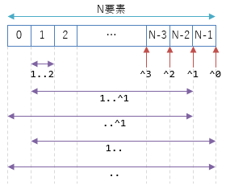

# インデックス/範囲処理

## <a id="sec-generated-title-1"></a> <a id="abstract"></a>概要

<h5 class="version version8">Ver. 8.0</h5>

C# 8.0 で、配列などに対して以下のような書き方をできるようになります。

- `a[^i]` で「後ろからi番目の要素」を参照
- `a[i..j]` で「i番目からj番目の範囲」を参照

例えば、以下のような書き方で配列の前後1要素ずつを削ったものを得ることができます。

```csharp {title=".. 構文"}
using System;
 
class Program
{
    static void Main()
    {
        var a = new[] { 1, 2, 3, 4, 5 };
 
        // 前後1要素ずつ削ったもの
        var middle = a[1..^1];
 
        // 2, 3, 4 が表示される
        foreach (var x in middle)
        {
            Console.WriteLine(x);
        }
    }
}
```

ちなみに、`i..j` は「iは含んでjは含まない」という範囲になります。
`for (var x = i; x < j; ++x)` のイメージ。

より細かく言うと、以下のような機能の組み合わせになります。

- `^i` で「後ろからi番目」を表す `Index` 型の値を得る
- `i..j` で「i番目からj番目」を表す `Range` 型の値を得る
- 所定の条件を満たす型に対して `Index`/`Range` を渡すと、所定のパターンに展開する

いくつかのプログラミング言語で似たような構文があり、
多くの場合は range (範囲)構文と呼ばれます。
C# 8.0 で導入されたものは配列などのインデックス用途に特化していて、
`Index`型と`Range`型からなるので、index/range (インデックス/範囲)構文と言ったりもします。

## <a id="sec-generated-title-2"></a> <a id="background"></a>背景

### <a id="sec-generated-title-3"></a> <a id="span"></a>Span

C# 7.2 で、[`Span<T>` 構造体](../resource/span.md)が導入されました。
配列や文字列中の一定範囲を抜き出して効率的に読み書きするための型です。
(単純な機能なのでもっと昔からあってもよさそうなものですが、
[ガベージ コレクション](../../computer/essential-software/memorymanagement.md#garbage-collection)があっても[安全かつ高速に](../resource/span.md#two-implementations)動くようにするのが意外と大変で、C# 7.2 まで導入が見送られていました。)

「[配列のインデクサー](../../../blog/2018/12/arrayindexer/index.md)」というブログで書いたことがあるんですが、
`Span<T>` 構造体は特別な最適化の対象になっていて、非常に高速です。
例えば以下の2つのメソッドでは、`Span<T>` を使った `Sum2` の方が高速です。

```csharp {title="Span を使うと速い"}
// i番目からj番目までの和。
[MethodImpl(MethodImplOptions.NoInlining)]
static int Sum1(int[] array, int i, int j)
{
    var sum = 0;
    for (int x = i; x < j; x++) sum += array[x];
    return sum;
}
 
// Sum1 と同じ処理を Span を使って書く。
// Sum1 よりこっちの方が速い。
[MethodImpl(MethodImplOptions.NoInlining)]
static int Sum2(int[] array, int i, int j)
{
    var sum = 0;
    foreach (var x in array.AsSpan()[i..j]) sum += x;
    return sum;
}
```

### <a id="sec-generated-title-4"></a> <a id="unification"></a>範囲のルール統一

配列の一定範囲を抜き出すという処理は、`array.AsSpan(x, y)` というように、単なるメソッド呼び出しでもできます。
ただ、ここで問題となるのは、引数の意味がメソッドによってぶれている点です。
`x`、`y` にそれぞれ3、5を渡した場合、どういう意味になるでしょう。
例えば、以下のようなパターンが考えられます。

- (1) 3, 4, 5 (3から5まで、3も5も含む)
- (2) 3, 4 (3から5まで、5は含まない)
- (3) 3, 4, 5, 6, 7 (3から5要素)

実際、 .NET の標準ライブラリ中でもぶれています。
例えば、[Parallel.For](https://docs.microsoft.com/ja-jp/dotnet/api/system.threading.tasks.parallel.for?view=netstandard-2.1#System_Threading_Tasks_Parallel_For_System_Int32_System_Int32_System_Action_System_Int32__)や[`Random.Next`](https://docs.microsoft.com/ja-jp/dotnet/api/system.random.next?view=netframework-4.8#System_Random_Next_System_Int32_System_Int32_) は (2) の意味ですが、[`Substring`](https://docs.microsoft.com/ja-jp/dotnet/api/system.string.substring?view=netstandard-2.1#System_String_Substring_System_Int32_System_Int32_)や[`AsSpan`](https://docs.microsoft.com/ja-jp/dotnet/api/system.memoryextensions.asspan?view=netstandard-2.1#System_MemoryExtensions_AsSpan__1___0___System_Int32_System_Int32_)は (3) の意味です。

```csharp {title="範囲指定の引数のぶれ"}
using System;
using System.Threading.Tasks;
 
class Program
{
    static void Main()
    {
        // この2つは 1から3 (3は含まない) = 1, 2の意味
        Parallel.For(1, 3, i => { });
        var v = new Random().Next(1, 3);
 
        // この2つは 1から3要素 = 1, 2, 3 の意味
        var span = new[] { 1, 2, 3, 4, 5 }.AsSpan(1, 3);
        var substr = "abcde".Substring(1, 3);
    }
}
```

名前付き引数を使えば、多少混乱を予防することはできます。

```csharp {title="名前付き引数で混乱を予防"}
Parallel.For(fromInclusive: 1, toExclusive: 3, i => { });
var v = new Random().Next(minValue: 1, maxValue: 3);
var span = new[] { 1, 2, 3, 4, 5 }.AsSpan(start: 1, length: 3);
var substr = "abcde".Substring(startIndex: 1, length: 3);
```

ただ、名前付き引数を使っても以下の問題があります。

- コードがとにかく長くなる
- `Random.Next` のように「含むか含まないか」を明示していないやつがいる
- あくまで実装者の良心頼みになっている
- 多次元データだと `matrix[1, 3, 1, 3]` みたいにさらにわかりにくい

そこで、範囲を表す専用の構文が欲しいわけです。
構文になっていれば意味がぶれることがなくなります。
C# では、`i..j` で「i番目からj番目(j は含まない)」となる構文を採用しました。

### <a id="sec-generated-title-5"></a> <a id="index-usage"></a>インデックス用途

`i..j` と書いたとき、j を含むかどうかは難しい問題です。
実際、あるプログラミング言語では j を含みますし、別のある言語では含みません。
`..=` や `..<` などで含む・含まないを選ぶようになっている言語もありますが、
`..` だけを書く構文もあったりして、その `..` の意味は言語ごとにまちまちです。

用途次第でもあります。
「この範囲に入っているかどうかを判定」みたいな用途(要するに[パターン マッチング](../datatype/patterns.md))だと、末尾も含んでくれている方がわかりやすいです。
一方で、`Span`や`Substring`のように、配列や文字列から一定範囲を抜き出す用途(インデックス用途)では、末尾を含まない方が使いやすかったりします。

インデックス用途での「末尾を含まない」には以下のようなメリットがあります。

- `j - i` だけで長さを計算できる
- ループで使いやすい
  - ループでは `for (int x = i; x < j; ++x)` というように `<` で条件判定することが多い
- `i..i` (先頭と末尾が同じ)が不正にならない(単に長さ0の範囲になる)
  - 逆に「j を含む」を採用する場合、長さ0の範囲は `i..(i-1)` と書く必要がある

C# の `i..j` で「j は含まない」の方を採用したのは、明確にインデックス用途を意図したものです。

## <a id="sec-generated-title-6"></a> <a id="index"></a>Index

配列や文字列からの一定範囲の抜き出しではよく「末尾から i 番目」という場所を取りたいことがあります。
C# 8.0 では、そのために単項 `^` 演算子を使います。

```csharp {title="^ 演算子"}
var i = ^1; // Length - 1 の場所
 
var value = 1;
var j = ^value; // 変数に対しても ^ を使える
```

単項 `^` 演算子はオペランドに `int` (か `int` に暗黙に変換できる型)しか受け付けません。
また、戻り値は `Index` 構造体(`System` 名前空間)になります。
`Index` は、以下のようなプロパティ・メソッドを持つ構造体です。

```csharp {title="Index 構造体"}
public readonly struct Index
{
    public Index(int value, bool fromEnd = false);
    public bool IsFromEnd { get; }
    public int Value { get; }
    public int GetOffset(int length);
    public static implicit operator Index(int value)
}
```

`^i` は `new Index(i, true)` に展開されます
(第2引数の `true` が「末尾から」の意味です)。
`int` からの暗黙的な変換もあって、それは素直に「先頭から i 番目」の意味になります。

### <a id="sec-generated-title-7"></a> <a id="non-negative"></a>補足: インデックスは0以上の整数

C# では、[配列のインデックスは0以上(非負)という前提](../../../blog/2018/12/arrayindex/index.md)があります。
なので、`Index` 構造体も以下のような作りになっています。

- コンストラクターに負の整数を渡すと `IndexOutOfRange` 例外が発生する
  - `^-1` みたいな書き方は文法的には認められるものの、実行時に例外発生
- 内部的には `int` 1つだけ持っていて、負の数を「末尾から」の意味で使っている
  - 構造体のサイズは `int` と同じ4バイト

## <a id="sec-generated-title-8"></a> <a id="range"></a>Range

C# 8.0 で `..` という新しい構文が追加されました。

```csharp {title=".. 構文"}
var r1 = 1..^1;
var r2 = 1..;
var r3 = ..^1;
var r4 = ..;
 
var i = 1;
var j = ^1;
var r = i..j;
```

他の2項演算子と違って、`i..` や `..j`、`..` というようにオペランドを省略できます。
オペランドは `Index` 型か、(`int` を含む) `Index` 型に暗黙的に変換できる型である必要があります。
戻り値は `Range` 型(`System` 名前空間)になります。
`Range` は、以下のようなプロパティ・メソッドを持つ構造体です。

```csharp {title="Range 構造体"}
public readonly struct Range
{
    public Range(Index start, Index end);
    public Index Start { get; }
    public Index End { get; }
    public (int Offset, int Length) GetOffsetAndLength(int length);
}
```

左オペランドの省略時は先頭から、右オペランドの省略時は末尾までの意味になります。
すなわち、`i..` は `i..^0` と、`..j` は `0..j` と、`..` は `0..^0` と同じ意味です。
また、`i..j` は `new Range(i, j)` に展開されます。

名前通り、`Start` が開始位置で、`End` が末尾位置です。
コンストラクターの引数は、第1、第2引数がそれぞれ `Start`、`End` と対応しています。
これまでの説明通り、`Start` は「含む」、`End`は「含まない」という扱いです。

この辺りは言葉で説明してもわかりにくいと思うので、以下の図を参考にしてください。



`i..^j` で、先頭からi要素、末尾からj要素を削った範囲になります。

ちなみに、演算子の優先順位は結構高いです。
2項演算(乗除算含む)や [`switch` 式](../datatype/typeswitch.md#switch-expression)よりも上になります。

```csharp {title=".. の優先順位" error-text="2 * 3..4"}
_ = 2 * 3..4; // 2 * (3..4) の意味。そんな掛け算はできないのでコンパイル エラーに。
_ = 2..3 switch // 2..3 という Range が switch 式の引数になる
{
    Range _ => 4,
};
_ = (1 + 2)..(3 + 4); // 足し算とかを優先したければ () 必須
```

## <a id="sec-generated-title-9"></a> <a id="indexer"></a>Index/Range とインデクサー

`Index`/`Range`型に対するインデクサーは、
以下で説明するように、
一定のパターンで `int` に対するインデクサーや`Slice`メソッドに展開されます。

(当初予定では、`^i`から`Index`型を、`i..j`から`Range`型を作るところまでだけが C# コンパイラーの仕事で、それを使ったインデクサーは使う側(配列や `List<T>`などのコレクションの側)の仕事にする予定でした。
それだとあらゆるコレクションに対して1個1個インデクサーのオーバーロードを追加する作業が大変なのと、最適化が掛けにくいという理由で、現状のパターン ベースな方式に変更されました。)

`Index`型の `i` に対するインデクサー `a[i]` は基本的に以下のように展開されます。

```csharp {title="Index 型インデクサーの展開結果"}
int offset = i.GetOffset(a.Length);
a[offset];
```

また、`Range` 型の `r` に対するインデクサー `a[r]` は基本的に以下のように展開されます。

```csharp {title="Range 型インデクサーの展開結果"}
var offset1 = r.Start.GetOffset(a.Length);
var offset2 = r.End.GetOffset(a.Length);
a.Slice(offset1, offset2 - offset1);
```

`a` の型によって多少バリエーションがあります。
C# のコレクションは長さを `Length` で取るものと `Count` で取るものの両方あるので、
そのどちらにも対応しています。`Length` がなくて `Count` がある場合それを使います
(`Length` があるならそっちが優先)。

```csharp {title="Index 型インデクサーの展開結果(Count)" highlight-text="Count"}
int offset = i.GetOffset(a.Count);
a[offset];
```

```csharp {title="Range 型インデクサーの展開結果(Count)" highlight-ranges="sha256:62b99ca45943e030a309af90a4c669933fd957fb0711e0f78cb137d77dea41bf;1:35-1:40,2:33-2:38"}
var offset1 = r.Start.GetOffset(a.Count);
var offset2 = r.End.GetOffset(a.Count);
a.Slice(offset1, offset2 - offset1);
```

また、`Range` 型インデクサーには、配列と文字列の場合だけ特別扱いがあります。
`Slice` メソッドではなく、それぞれ `GetSubArray`、`Substring` メソッドが呼ばれます
(`GetSubArray`は`RuntimeHelpers`クラス(`System.Runtime.CompilerServices` 名前空間)の静的メソッド)。

### <a id="sec-generated-title-10"></a> <a id="avoid-copy"></a>コピーの回避

配列と文字列に対する `Range`型インデクサー `a[i..j]` 
(展開結果的には `GetSubArray` と `Substring`)は、
それぞれ配列、文字列を返します。
この際、新しい配列・文字列を確保してコピーするコストが発生します。

```csharp {title="Range型インデクサーでコピー発生"}
var array = new[] { 1, 2, 3, 4, 5 };
var str = "abcde";
 
for (int i = 0; i < 100; i++)
{
    // こういう書き方をすると、ループのたびに new int[], new string が発生。
    // だいぶ重たい。
    var subarray = array[1..^1];
    var substr = str[1..^1];
}
```

これらはそれなりに重たい処理なので、パフォーマンスにシビアな状況での利用には注意が必要です。

コピーを発生させたくない場合、[`Span<T>`](../resource/span.md)を経由します。
要するに、`AsSpan()` や `AsMemory()` を挟めばコピーを回避できます。

```csharp {highlight-ranges="sha256:7742c796b8279d9c9634949ab500f37d174ab812445a937fda068d1a42ca46fa;8:25-8:34,9:21-9:30"}
var array = new[] { 1, 2, 3, 4, 5 };
var str = "abcde";
 
for (int i = 0; i < 100; i++)
{
    // 以下の書き方をすれば Span<int>/ReadOnlySpan<char> の Slice が呼ばれるようになる。
    // これならコピーは発生せず、軽い。
    var subarray = array.AsSpan()[1..^1];
    var substr = str.AsSpan()[1..^1];
}
```

##### <a id="sec-generated-title-11"></a>サンプル

「一定範囲を抜き出す」という処理は、テキスト処理でよく使います。

例として、書式が決まっているテキストの中から一部分を取り出してみましょう。
今回は「1行1項目で、`:` 区切りでキーと値が並んでいる」というような書式を考えます。
この書式のテキストの中からキーだけを取り出すようなコードを以下のように書けます。

```csharp {title="書式が決まったテキストから一部分を抜き出す例"}
using System;
using System.Collections.Generic;
 
class Program
{
    static void Main()
    {
        var testData = @"longitude: 139.8803943
latitude: 35.6328964
postal code: 279-0031
";
 
        foreach (var key in GetKeys(testData))
        {
            Console.WriteLine(key);
        }
    }
 
    // 行頭から : までの間の文字列だけを抜き出す
    static IEnumerable<ReadOnlyMemory<char>> GetKeys(string content)
    {
        var start = 0;
        for (int i = 0; i < content.Length; i++)
        {
            var c = content[i];
            if (c == ':')
            {
                yield return content.AsMemory()[start..i];
            }
            else if (c == '\n')
            {
                start = i + 1;
            }
        }
    }
}
```
```console {title="書式が決まったテキストから一部分を抜き出す例"}
longitude
latitude
postal code
```

例なのでシンプルな書式にしましたが、もうちょっと実用的な、例えば JSON 形式からのキーの取り出しなども、こういうコードの延長線上になります。
