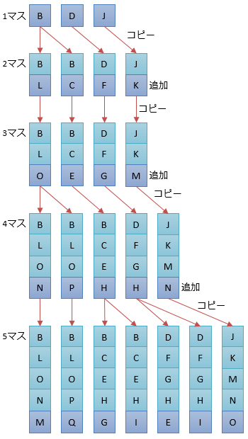
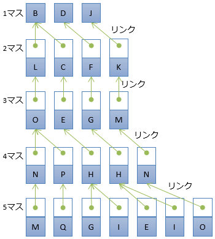
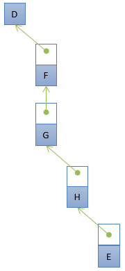

# 不変(immutable)なコレクション

## <a id="sec-generated-title-1"></a> <a id="abst"></a>概要

(書きかけ)

Immutable Collections が出たわけですが。

使いどころというか。
Immutable にしただけで性能が上がるはずはもちろん<em>ない</em>。

Immutable Collections は、連結リスト的なデータ構造で、
部分部分を共有したり、
ある時点でのスナップショットを残しつつデータを追加したりしたい場合に有用。


## <a id="sec-generated-title-2"></a> <a id="example"></a>例

わかりやすい例は経路探索。

例えば、図1のような、ゲームでよくある四角いマス目をつないだマップみたいなのを考えて

<figure>

[](../../../../assets/media/ufcpp2000/csharp/fig/immutable-map.png)

<figcaption>経路探索の対象の例</figcaption>
</figure>


再帰的に、「既存の経路候補に次の1マスをつなぐ」みたいな処理を繰り返して経路を調べていく。

「既存の経路候補に次の1マスをつなぐ」を単純に配列を使ってやると、
```csharp
foreach (var node in path.Last().NextNodes)
    yield return path.Concat(new[] { node }).ToArray();
        
```
<figure>

[](../../../../assets/media/ufcpp2000/csharp/fig/immutable-mutable.png)

<figcaption>配列を使った実装(mutable)</figcaption>
</figure>


連結リストでやると、
```csharp
class Path
{
    public Path Previous { get; private set; }
    public Node Last { get; private set; }
    
    public Path(Path previous, Node last)
    {
        Previous = previous;
        Last = last;
    }
}

...

foreach (var node in path.Last.NextNodes)
    yield return new Path(path, node);
        
```
<figure>

[](../../../../assets/media/ufcpp2000/csharp/fig/immutable-link.png)

<figcaption>連結リストを使った実装(immutable)</figcaption>
</figure>


配列使ってやってる方はコピーにかかるコストが馬鹿にならない。
1つ候補を見ては、次に進むマスを誰かに選択してもらって、1つの配列(あらかじめ十分な長さを取っておく)を書き替えながらやるならコピーは要らないんだけども。
全探索したいとか、「3マス目までの経路を誰かが使ってる横で、別の誰かが5マス目までの経路を調べてる」みたいな状況だとコピーを取らざるを得ない。

つまるところ、書き換え自由(mutable)であることを活用できないんだから、最初から書き換え不能(immutable)前提のデータ構造を使った方がいいよということ。

連結リストを使う場合はそういう心配は不要で、
全探索でも n - 1 マス目までの探索結果を共有できるのでメモリ効率はいい。
スナップショット(「3マス目までの結果」みたいなのの履歴)も残っている(かつ、それは書き変わらない)ので、続きを探索しながらでも途中結果を見れる。

ただし、1部分だけ(1経路だけ)抜きだすと…

<figure>

[](../../../../assets/media/ufcpp2000/csharp/fig/immutable-mutable1.png)

<figcaption>配列を使った実装(mutable)での1経路</figcaption>
</figure>


<figure>

[](../../../../assets/media/ufcpp2000/csharp/fig/immutable-link1.png)

<figcaption>連結リストを使った実装(mutable)での1経路</figcaption>
</figure>


間接参照を挟む分、野暮ったい。
結構効率悪くて、単純に繰り返し経路情報を読み出す(マスを列挙する)と、配列実装の方がはるかに速い。
繰り返しの列挙が必要なら早い段階で ToArray を。

結局、immutable なデータ構造が活きてくるのは↓みたいなデータ。

* 追記してくタイプのデータ

* 追記途中を書き替えちゃいけない


※注意: LINQ の Concat (の結果の IEnumerable)自体が連結リストみたいなものなので、ToArray しなければ内部的には連結リストの方みたいな状態になるはずなのだけども。
サンプルということで。
