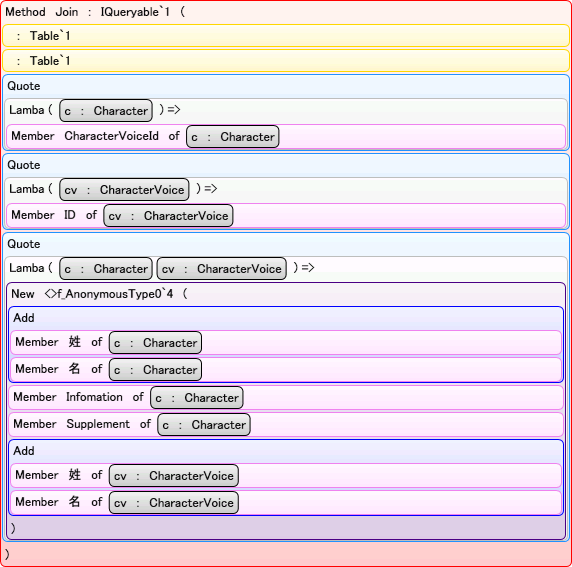

# \[雑記\] IQueryable の実装

## 概要
LINQ to SQL で使われる Table クラスなどは IQueryable と IQueryProvider インターフェースを実装しています。
これら IQueryable および IQueryProvider は、

* LINQ クエリ式から「[式木](../dynamic/sp3_expression.md#expressiontree)」を構築する。

* 構築した式木を解釈して、独自のクエリ処理を行う。

というような機能を提供するインターフェースです。
一度、式木（実行可能コードではなくて、プログラム中で読めるデータ）になるので、
IQueryable の実装次第で様々な機能を提供することができます。

となると当然、IQueryable を実装して、独自の LINQ プロバイダを作成したいとき、

* クエリ式 → 式木の構築手順

* 式木を独自に処理

の2つのことを理解しておく必要があります。

後者は要するに、式木に関する理解があればできることです。
なので、ここでは、前者の「クエリ式 → 式木構築」を中心に、
IQueryable の仕組みについて説明します。

式木に関しては、
「[式木（Expression Trees）](../dynamic/sp3_expression.md)」や「[[サンプル] 式木を WPF で GUI 表示](../sample/sm_treeview.md)」辺りを参考にしてください。

## LINQ to SQL: クエリ式 → 式木 → SQL 文
まず、
前節で説明した「クエリ式 → 式木の構築手順 → 式木を独自に処理」という流れを見るために、
LINQ to SQL を例に説明します。

例えば、C# で以下のようなクエリ式を書いたとします。

<pre class="source" title="LINQ to SQL クエリ" lang="">
<code>var context = new CharacterContext("characters.sdf");

System.Linq.IQueryable q =
    from c in context.Characters
    join cv in context.CvList on c.CharacterVoiceId equals cv.ID
    select new
    {
        Name = c.姓 + c.名,
        Info = c.Infomation,
        Supplement = c.Supplement,
        CharacterVoice = cv.姓 + cv.名,
    };
</code></pre>

IQueryable には Expression プロパティがあって、
これを使って、クエリ式 → 式木の構築結果を取得することができます。

<pre class="source" title="IQueryable.Expression の例" lang="">
<code>System.Linq.Expressions.Expression e = q.Expression;
Console.Write(e);
</code></pre>

<pre class="console" title="出力">
Table(Character).Join(Table(CharacterVoice), c =&gt; c.CharacterVoiceId, cv =&gt; cv.I
D, (c, cv) =&gt; new &lt;&gt;f__AnonymousType0`4(Name = (c.姓 + c.名), Info = c.Infomatio
n, Supplement = c.Supplement, CharacterVoice = (cv.姓 + cv.名)))
</pre>

テキストだといまいちわかりづらいと思うので、
この結果をツリー表示すると、以下のような感じ。

<figure>
	
	<figcaption>IQueryable.Expression の例</figcaption>
</figure>

ここまでは LINQ to SQL に限らず、
IQueryable を実装する LINQ プロバイダでほぼ共通の処理です。

で、LINQ to SQL では、この式木を解析して、
以下のような SQL 文に変換します。

<pre class="source" title="変換結果の SQL 文" lang="">
<code>SELECT
    [t0].[姓] + [t0].[名] AS [Name],
    [t0].[学籍番号等] AS [Info],
    [t0].[補足] AS [Supplement],
    [t1].[姓] + [t1].[名] AS [CharacterVoice]
FROM [Characters] AS [t0], [CvList] AS [t1]
WHERE [t0].[cv] = [t1].[ID]
</code></pre>

## IQueryable, IQueryProvider
IQueryable および IQueryProvider は以下のようなインターフェースです。

<pre class="source" title="IQueryable インターフェース" lang="">
<code>public interface IQueryable : IEnumerable
{
  Type ElementType { get; }
  Expression Expression { get; }
  IQueryProvider Provider { get; }
}

public interface IQueryable&lt;T&gt; : IEnumerable&lt;T&gt;, IQueryable, IEnumerable
{
}
</code></pre>

<pre class="source" title="IQueryProvider インターフェース" lang="">
<code>public interface IQueryProvider
{
  IQueryable CreateQuery(Expression expression);
  IQueryable&lt;TElement&gt; CreateQuery&lt;TElement&gt;(Expression expression);
  object Execute(Expression expression);
  TResult Execute&lt;TResult&gt;(Expression expression);
} 
</code></pre>

IQueryable の方は特別な処理をしているわけではなく、
実際にクエリ式 → 式木構築などの処理を行っているのは IQueryProvider の方です。
IQueryProvider の方だけ差し替えて様々な LINQ プロバイダを作れるようになっています。

大まかに言うと、
CreateQuery で「クエリ式 → 式木の構築」を、
Excute で「式木の独自処理」を行います。

## IQueryable, IQueryProvider の実装
たいていの場合、IQueryProvider.Excute 以外の部分の実装で凝る必要はないようです。
以下の記事（英語）に、IQueryable の典型的な実装方法が書かれています。

* [LINQ: Building an IQueryable Provider - Part I](http://blogs.msdn.com/mattwar/archive/2007/07/30/linq-building-an-iqueryable-provider-part-i.aspx)
    * おまけ： 記事中に散逸しているソースコードを1つのファイルにまとめたもの →
[Query.cs](../../../../assets/media/ufcpp2000/csharp/source/Query.cs)

この記事では、IQueryable の実装である Query クラスは（継承とか不要で）このまま使いまわせるように作られています。

IQueryProvider の実装である QueryProvider の方では、
Execute メソッド（と、ToString などの際に必要になる GetQueryText メソッド）だけが抽象メソッドとして残されています。
独自の LINQ プロバイダを実装したい場合、
QueryProvider を継承して Execute と GetQueryText を実装することになります。

前節で説明したように、Execute は「式木の独自処理」の部分を担うメソッドで、
残りの部分はすでに実装されています。
すなわち、「クエリ式 → 式木の構築」の部分は、
この記事中の Query、QueryProvider クラスが全部実装してくれています。

ということで、このソースコードを使って、
IQueryable の「クエリ式 → 式木の構築」の部分について説明していきたいと思います。

### 挙動の確認
QueryProvider クラスの時点で「クエリ式 → 式木の構築」の部分は完成しているわけで、
「式木の独自処理」が必要ないのであれば、
以下のような適当な実装でも十分に動いたりします。

（foreach したりには使えないけども、Expression を作るのには使える。）

<pre class="source" title="QueryProvider を継承。独自処理一切なし。" lang="">
<code>public class TestProvider : QueryProvider
{
    public override string GetQueryText(Expression expression)
    {
        return string.Empty;
    }

    public override object Execute(Expression expression)
    {
        return null;
    }

    public static IQueryable&lt;T&gt; CreateQueryable&lt;T&gt;()
    {
        return new Query&lt;T&gt;(new TestProvider());
    }
}
</code></pre>

とりあえず、これを使って QueryProvider クラスの挙動を確認してみましょう。
以下のようなコードを実行してみます。

<pre class="source" title="QueryProvider クラスの挙動の確認" lang="">
<code>var q1 = TestProvider.CreateQueryable&lt;int&gt;();
Console.Write("{0}\n", q1.Expression);

var q2 = q1.Where(x =&gt; x &gt; 10);
Console.Write("{0}\n", q2.Expression);

var q3 = q2.OrderBy(x =&gt; x);
Console.Write("{0}\n", q3.Expression);

var q4 = q3.Select(x =&gt; x * x);
Console.Write("{0}\n", q4.Expression);
</code></pre>

実行結果は以下の通り。

<pre class="console" title="実行結果">

.Where(x =&gt; (x &gt; 10))
.Where(x =&gt; (x &gt; 10)).OrderBy(x =&gt; x)
.Where(x =&gt; (x &gt; 10)).OrderBy(x =&gt; x).Select(x =&gt; (x * x))        
</pre>

要するに、Where, Select, OrderBy などの拡張メソッドを通るたびに、
IQueryable.Expression の中身が追記されています。

### System.Linq.Queryable
実のところ、QueryProvider クラスの CreateQuery メソッドは、
引数で与えられた式木をそのまま Query クラスに流しているだけだったりします。

<pre class="source" title="QueryProvider.CreateQuery の実装" lang="">
<code>IQueryable&lt;S&gt; IQueryProvider.CreateQuery&lt;S&gt;(Expression expression)
{
    return new Query&lt;S&gt;(this, expression);
}
</code></pre>

で、実際に「クエリ式 → 式木の構築」を担っているのは、
System.Linq.Queryable 中で定義された Select や Where 拡張メソッドの方です。

例えば、System.Linq.Queryable.Where の中身は概ね以下のようになっているようです。

<pre class="source" title="Where メソッドの中身" lang="">
<code>public static IQueryable&lt;T&gt; Where&lt;T&gt;(
  this IQueryable&lt;T&gt; q,
  Expression&lt;Func&lt;T, bool&gt;&gt; pred)
{
  MethodInfo generic = (MethodInfo)MethodBase.GetCurrentMethod();
  MethodInfo method = generic.MakeGenericMethod(typeof(T));

  return q.Provider.CreateQuery&lt;T&gt;(
    Expression.Call(
      method,
      q.Expression,
      Expression.Quote(pred)
      ));
}
</code></pre>

引数 q の持っている式木に、
Where メソッド自身の Call をかぶせた式木を作って QueryProvider の　CreateQuery メソッドに渡します。

Select などの他の標準クエリ演算子でもほぼ同様の処理をしています。
