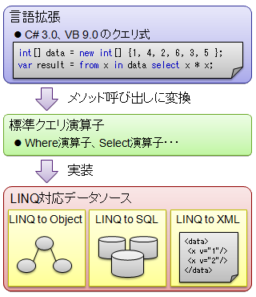

# LINQ

##  概要

<h5 class="version version3">Ver. 3.0</h5>

C# 3.0（そして、同時に発表された VB 9.0）の目玉となる新機能は、
Language Integrated Query、略して LINQ と呼ばれるもので、
リレーショナルデータベースや XML に対する操作をプログラミング言語に統合するものです。

LINQ を用いることで、様々なタイプのデータソースに対する検索や操作を、
共通の構文で行うことができます。
IEnumeable を実装するコレクションクラスに対するもの（LINQ to Object）や、
XML に対するもの（LINQ to XML）、
それに、リレーショナルデータベースサーバに対する SQL クエリを生成するもの（LINQ to SQL）などがあります。

LINQ には以下のような利点があります。

* オブジェクト指向言語らしい書き方でデータベースへの問い合わせができます。

* in-memory なオブジェクト、XML、リレーショナルデータベースに対して、同じ文法でデータの問い合わせができます。

* 問い合わせ時に、コンパイラによる文法チェックや、IntelliSense のようなツールの補助を受けることができます。

技術的には、LINQ は、データベースや XML 操作用のライブラリと、
C# や VB.NET 言語中に SQL 風の問い合わせ構文を埋め込めるようにする言語拡張から成ります。

##### ポイント

* クエリ式：<code>var q = from x in collection where x &gt; 10 select x * x;</code>

* メソッド形式で LINQ：<code>var q = collection.Where(x =&gt; x &gt; 10).Select(x =&gt; x * x);</code>

##  LINQ とは

<strong id="linq" class="keyword">LINQ</strong> とは、
Language Integrated Query の略称で、
C# や VB などの .NET Framework 対応言語に、
リレーショナルデータや XML に対するデータ操作構文を組み込む
（＋ データベースや XML 操作用のライブラリ）
というものです。

その目的は、
データベース問い合わせとオブジェクト指向プログラミング（OOP: Object-Oriented Programming）の統合です。
これまでに、
SQL などの問い合わせ言語によって、
データベースの構築・問い合わせが容易になりました。
また、
C# や Java などの OOP 言語によって、
さまざまなデータ（文字列・数値はもちろん、画像や音声なども）に対する操作を容易に記述できるようになりました。

しかしながら、
画像や音声なども含めた多種多様なデータ構造に対する問い合わせはどうでしょうか。
残念ながら、
これまでの SQL などの問い合わせ言語、あるいは C# などの OOP 言語のどちらかだけでは、
容易に実現可能とはいきませんでした。
文字列や数値にとどまらず、さまざまなデータ構造をデータベース的に扱いたいという要求は、
近年、ますます高まっているにもかかわらず、
その実現は非常に困難だったのです。

そこで、Language Integrated Query、
すなわち、OOP 言語への問い合わせ構文の統合という考え方が必要になります。

###  データベース言語

SQL などのデータベース操作言語をご存知の方ならば、
すぐに LINQ になじむこと出来るでしょう。
この手の言語のことをご存じない方のために、
SQL を例に、簡単な説明をしたいと思います。

まず、操作対象の例として、
表1に示すような、「学生名簿」と言う名前のデータテーブルを考えます。

<table summary="データテーブル： 学生名簿">
	<caption>
		データテーブル： 学生名簿
	</caption>
	<tr>
		<th>出席番号</th>
		<th>姓</th>
		<th>名</th>
	</tr>
	<tr>
		<td markdown="1">14</td>
		<td markdown="1">風浦</td>
		<td markdown="1">可符香</td>
	</tr>
	<tr>
		<td markdown="1">20</td>
		<td markdown="1">小森</td>
		<td markdown="1">霧</td>
	</tr>
	<tr>
		<td markdown="1">22</td>
		<td markdown="1">常月</td>
		<td markdown="1">まとい</td>
	</tr>
	<tr>
		<td markdown="1">19</td>
		<td markdown="1">小節</td>
		<td markdown="1">あびる</td>
	</tr>
	<tr>
		<td markdown="1">18</td>
		<td markdown="1">木村</td>
		<td markdown="1">カエレ</td>
	</tr>
	<tr>
		<td markdown="1">16</td>
		<td markdown="1">音無</td>
		<td markdown="1">芽留</td>
	</tr>
	<tr>
		<td markdown="1">17</td>
		<td markdown="1">木津</td>
		<td markdown="1">千里</td>
	</tr>
	<tr>
		<td markdown="1">8</td>
		<td markdown="1">関内</td>
		<td markdown="1">マリア</td>
	</tr>
	<tr>
		<td markdown="1">28</td>
		<td markdown="1">日塔</td>
		<td markdown="1">奈美</td>
	</tr>
</table>

こういったデータテーブルの中から、
特定の条件を満たすものだけを取り出したり、
順番を並べ替えたりという操作を行うのがデータベース操作言語です。
例えば、SQL を使って、
このテーブル中から、
出席番号前半（15以下）の学生だけ、
出席番号の小さい順に並べ、
その「名」を取り出したい場合、
以下のような問い合わせを書きます。

<pre class="source" title="Generics の例" lang="">
<code>SELECT 名 FROM 学生名簿
  WHERE 出席番号 &lt;= 15
  ORDER BY 出席番号;
</code></pre>

この問い合わせの結果は、
表2のようになるでしょう。

<table summary="問い合わせ結果： 出席番号前半の「名」">
	<caption>
		問い合わせ結果： 出席番号前半の「名」
	</caption>
	<tr>
		<th>名</th>
	</tr>
	<tr>
		<td markdown="1">マリア</td>
	</tr>
	<tr>
		<td markdown="1">可符香</td>
	</tr>
</table>

SELECT などのキーワードに関して、
簡単にだけ説明すると以下のようになります。

<table summary="SQL のキーワード">
	<caption>
		SQL のキーワード
	</caption>
	<tr>
		<th>キーワード</th>
		<th>説明</th>
	</tr>
	<tr>
		<td markdown="1">SELECT</td>
		<td markdown="1">姓、名、学生番号などのうち、どれを表示するか</td>
	</tr>
	<tr>
		<td markdown="1">FROM</td>
		<td markdown="1">どのデータテーブルからデータを読むか</td>
	</tr>
	<tr>
		<td markdown="1">WHERE</td>
		<td markdown="1">取り出したいデータに対する条件</td>
	</tr>
	<tr>
		<td markdown="1">ORDER BY</td>
		<td markdown="1">取り出す順番</td>
	</tr>
</table>

さらに、複数のテーブルに渡る問い合わせも可能です。
先ほど表1で示したデータテーブルに加え、
表3のようなデータテーブルもあったとしましょう。

<table summary="データテーブル： 備考欄">
	<caption>
		データテーブル： 備考欄
	</caption>
	<tr>
		<th>出席番号</th>
		<th>備考</th>
	</tr>
	<tr>
		<td markdown="1">19</td>
		<td markdown="1">しっぽ好き</td>
	</tr>
	<tr>
		<td markdown="1">19</td>
		<td markdown="1">被 DV 疑惑</td>
	</tr>
	<tr>
		<td markdown="1">16</td>
		<td markdown="1">毒舌メール</td>
	</tr>
	<tr>
		<td markdown="1">17</td>
		<td markdown="1">几帳面</td>
	</tr>
</table>

で、この2つのテーブル「学生名簿」と「備考欄」に対して、
以下のような問い合わせ操作をしてみます。

<pre class="source" title="Generics の例" lang="">
<code>SELECT 姓, 名, 備考 FROM 学生名簿, 備考欄
  WHERE 学生名簿.学生番号 == 備考欄.学生番号
</code></pre>

その結果得られるデータは以下のようになります。

<table summary="問い合わせ結果： 姓名と備考">
	<caption>
		問い合わせ結果： 姓名と備考
	</caption>
	<tr>
		<th>姓</th>
		<th>名</th>
		<th>備考</th>
	</tr>
	<tr>
		<td markdown="1">小節</td>
		<td markdown="1">あびる</td>
		<td markdown="1">しっぽ好き</td>
	</tr>
	<tr>
		<td markdown="1">小節</td>
		<td markdown="1">あびる</td>
		<td markdown="1">被 DV 疑惑</td>
	</tr>
	<tr>
		<td markdown="1">音無</td>
		<td markdown="1">芽留</td>
		<td markdown="1">毒舌メール</td>
	</tr>
	<tr>
		<td markdown="1">木津</td>
		<td markdown="1">千里</td>
		<td markdown="1">几帳面</td>
	</tr>
</table>

###  LINQ の例

本当に簡単にですが、データベース操作言語の概要を述べた所で、
LINQ の話に戻りましょう。
改めて書きますが、LINQ とは、
C# 等の言語に SQL ライクなデータベース操作構文を組み込む
（＋ データベースや XML 操作用のライブラリ）
というものです。

百聞は一見にしかずということで、
とりあえず、先ほどの SQL での例を C# 3.0 の構文を使って書いてみましょう。

<pre class="source" title="C# 3.0 LINQ" lang="">
<code>var 学生名簿 =
new[] {
  new {学生番号 = 14, 姓 = "風浦", 名 = "可符香"},
  new {学生番号 = 20, 姓 = "小森", 名 = "霧"    },
  new {学生番号 = 22, 姓 = "常月", 名 = "まとい"},
  new {学生番号 = 19, 姓 = "小節", 名 = "あびる"},
  new {学生番号 = 18, 姓 = "木村", 名 = "カエレ"},
  new {学生番号 = 16, 姓 = "音無", 名 = "芽留"  },
  new {学生番号 = 17, 姓 = "木津", 名 = "千里"  },
  new {学生番号 =  8, 姓 = "関内", 名 = "マリア"},
  new {学生番号 = 28, 姓 = "日塔", 名 = "奈美"  },
};

var 出席番号前半名 =
  from p in 学生名簿
  where p.学生番号 &lt;= 15
  orderby p.学生番号
  select p.名;

foreach(var 名 in 出席番号前半名)
{
  Console.Write("{0}\n", 名);
}
</code></pre>

<pre class="console" title="C# 3.0 LINQ の例、実行結果">
マリア
可符香
</pre>

非常に見慣れない構文だらけで困惑するかもしれませんが、
C# 3.0 ではこのコードがコンパイル可能です。
というより、これがコンパイル可能となるような、新しい構文が追加されました。

簡単に解説だけしておくと、
第1文、<code>var 学生名簿</code> の部分では、
SQL の説明で述べた所のデータテーブルを作っています。
「[関数型言語・動的言語的な機能](../functional/sp3_functional.md)」で説明したような、
型推論、匿名型、ラムダ式などはこのために追加されたようなものです。

第2文、<code>var 出席番号前半姓</code> の部分では、
C# 3.0 の目玉となる機能、LINQ を使っています。
where や select などの「クエリ式」を用いて、
データ操作を行っています。
詳細は次節以降で述べていくことになります。

最後の部分、<code>foreach</code> 以下は、
C# 2.0 までの感覚でも割となじみやすいのではないかと思います。
問い合わせ結果の一覧を画面に表示しています。

##  LINQ の全体像

LINQ の全体像を絵的に表すと、図1のようになります。

<figure>
	
	<figcaption>LINQ の全体像</figcaption>
</figure>

詳しくは「[クエリ式](#query)」で説明しますが、
まず、C# や VB.NET 内に SQL 風のクエリ式を記述できるような言語構文が拡張されています。

これは実際には、
Where、Select などのメソッド呼び出しに変換されます。
すなわち、「<em>Where、Select など、所定のメソッドを定義してさえあれば、どんなクラスでもクエリ式を使える</em>」という規約があるということです。
この規約で定められたメソッド群のことを<strong id="std_query_op" class="keyword">標準クエリ演算子</strong>（standard query operators）と呼びます。
（メソッド呼び出しですが、呼称的には「演算子」という呼び方をするようです。）

.NET Framework 3.5 では標準ライブラリ内のいくつかのデータソースクラスを LINQ に対応（標準クエリ演算子を実装）させています。
例えば、IEnumerable は LINQ に対応していて、配列やコレクションクラスを LINQ のデータソースとして利用できるようになっています（LINQ to Object）。
また、データベースサーバ接続用や XML リーダー/ライタークラスも LINQ 対応しました（LINQ to SQL、LINQ to XML）。

LINQ の実体は、標準クエリ演算子のメソッド呼び出しなので、クエリ式を実装していない言語からでも、これらのメソッド呼び出しによってさまざまな LINQ 対応データソースにアクセスできます。

##  クエリ式

改めて書くと、
C# 3.0 の目玉となる機能は<strong id="query" class="keyword">クエリ式</strong>（query expression）です。
すでに何度か例を示していますが、
以下のように、SQL 風の問い合わせを C# ソースファイル中に直接書ける機能です。

<pre class="source" title="クエリ式" lang="">
<code>var list1 =
  from p in list
  where p.id &lt;= 15
  orderby p.id
  select new { p.FamilyName, p.FirstName };
</code></pre>

この SQL 風のクエリ式は、
実は、C# のコンパイラ自体にデータ問い合わせの機構が埋め込まれているわけではありません。
C# 3.0 のコンパイラは、クエリ式をメソッド（あるいは「[拡張メソッド](../functional/sp3_extension.md#exmethod)」）呼び出しに変換します。
例えば、以下のようなクエリ式を考えます。

<pre class="source" title="where を使った簡単なクエリ式" lang="">
<code>var list1 =
  from p in list
  where p.id &lt;= 15
  select p.Name;
</code></pre>

これは、C# 3.0 コンパイラによって、以下のように解釈されます。

<pre class="source" title="where を使った簡単なクエリ式" lang="">
<code>var list1 = list.Where(p =&gt; p.id &lt;= 15).Select(p =&gt; p.Name);
</code></pre>

そして、実際のデータ問い合わせはこの Where や Select などのメソッド（あるいは「[拡張メソッド](../functional/sp3_extension.md#exmethod)」）内で行われます。
問い合わせ構文は、Where や Select などのメソッドを持つか、
あるいは、拡張メソッドによってこれらのメソッドを追加した、
任意のクラスに対して利用できます。

（
「何かインターフェースを実装していないとダメ」とかはなく、
コンパイラは Where や Select などという名前のメソッド（あるいは拡張メソッド）があるかどうかだけを見ます。
要するに、「[ダックタイピング](../appendix/ap_term.md#ducktype)」です。
）

ちなみに、少し実装上の話をすると、この機能は System.Array や、
System.Collections.Generic.List&lt;T&gt; にこれらのメソッド定義があるわけではなく、
IEnumerable インターフェースの拡張メソッドとして定義されています。
拡張メソッドの定義場所は、System.Query.Sequence クラスです。

どういうクエリ式がどういう標準クエリ演算子に変換されるかは次章「[標準クエリ演算子（クエリ式関係）](sp3_stdquery.md)」で説明します。
