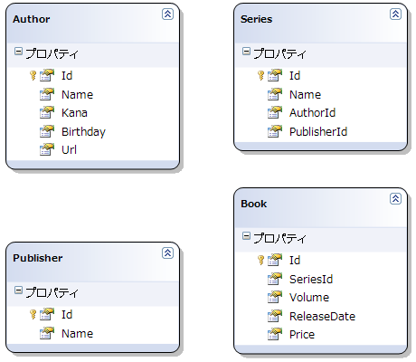
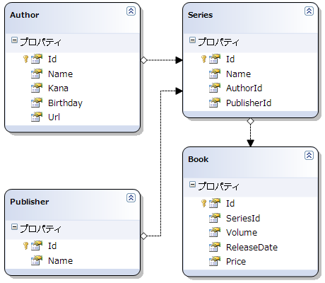

# \[雑記\] LINQ to SQL 実践編

## <a id="sec-generated-title-1"></a> <a id="abst"></a>概要

<h5 class="version version3">Ver. 3.0</h5>

「[[雑記] O/R インピーダンスミスマッチ](sp3_ormismatch.md)」では、LINQ to SQL の概念的な部分を説明しました。
それに対してここでは、実践編ということで、
SQL Server 2005 Express Edition と Visual Studio 2008 を使って、
実際にデータベースを作成し、LINQ to SQL を使ったプログラムを作成してみます。

とりあえず、簡単なサンプルということで、コンソールアプリを作ります。
データとしては、前章から引き続き、書籍の作家・シリーズに関するデータベースを作ります。

Visual Studio のウィザードを使ってコンソールアプリケーションプロジェクトを作成してください。
以下では、適当で申し訳ないんですけども、
LinqToSqlTest という名前でプロジェクトを作成したものとして説明します。


## <a id="sec-generated-title-2"></a> <a id="database"></a>データベース作成

本例では、表1～4に示すようなデータテーブルを作ります。

表形式だとちょっと分かりにくい気もしますが、
次節で LINQ to SQL クラスを作成する際にクラス図を示しますので、
そちらも見れば大体どういう構造か分かると思います。

また、前章でも言ったように、
実際のところ1作品に複数の作者という状況もあるんですが、
ここでは1作品1作者としてテーブルを作っています。

データはどうせウェブから拾ってくるつもりで、
ちょっとした検索でもっと多くの項目を拾えるんですが、
とりあえず項目数はこれくらいにしておきます。

<table summary="Authors テーブル">
	<caption>
		Authors テーブル
	</caption>
	<tr>
		<th>列名</th>
		<th>データ型</th>
		<th>Null を許容</th>
	</tr>
	<tr>
		<td markdown="1">Id</td>
		<td markdown="1">int</td>
		<td markdown="1">　</td>
	</tr>
	<tr>
		<td markdown="1">Name</td>
		<td markdown="1">varchar(100)</td>
		<td markdown="1">　</td>
	</tr>
	<tr>
		<td markdown="1">Kana</td>
		<td markdown="1">varchar(100)</td>
		<td markdown="1">する</td>
	</tr>
	<tr>
		<td markdown="1">Birthday</td>
		<td markdown="1">datetime</td>
		<td markdown="1">する</td>
	</tr>
	<tr>
		<td markdown="1">Url</td>
		<td markdown="1">varchar(512)</td>
		<td markdown="1">する</td>
	</tr>
</table>


<table summary="Publishers テーブル">
	<caption>
		Publishers テーブル
	</caption>
	<tr>
		<th>列名</th>
		<th>データ型</th>
		<th>Null を許容</th>
	</tr>
	<tr>
		<td markdown="1">Id</td>
		<td markdown="1">int</td>
		<td markdown="1">　</td>
	</tr>
	<tr>
		<td markdown="1">Name</td>
		<td markdown="1">varchar(100)</td>
		<td markdown="1">　</td>
	</tr>
</table>


<table summary="Series テーブル">
	<caption>
		Series テーブル
	</caption>
	<tr>
		<th>列名</th>
		<th>データ型</th>
		<th>Null を許容</th>
	</tr>
	<tr>
		<td markdown="1">Id</td>
		<td markdown="1">int</td>
		<td markdown="1">　</td>
	</tr>
	<tr>
		<td markdown="1">Name</td>
		<td markdown="1">varchar(512)</td>
		<td markdown="1">　</td>
	</tr>
	<tr>
		<td markdown="1">AuthorId</td>
		<td markdown="1">int</td>
		<td markdown="1">　</td>
	</tr>
	<tr>
		<td markdown="1">PublisherId</td>
		<td markdown="1">int</td>
		<td markdown="1">　</td>
	</tr>
</table>


<table summary="Books テーブル">
	<caption>
		Books テーブル
	</caption>
	<tr>
		<th>列名</th>
		<th>データ型</th>
		<th>Null を許容</th>
	</tr>
	<tr>
		<td markdown="1">Id</td>
		<td markdown="1">int</td>
		<td markdown="1">　</td>
	</tr>
	<tr>
		<td markdown="1">SeriesId</td>
		<td markdown="1">int</td>
		<td markdown="1">　</td>
	</tr>
	<tr>
		<td markdown="1">Volume</td>
		<td markdown="1">int</td>
		<td markdown="1">　</td>
	</tr>
	<tr>
		<td markdown="1">ReleaseDate</td>
		<td markdown="1">datetime</td>
		<td markdown="1">する</td>
	</tr>
	<tr>
		<td markdown="1">Price</td>
		<td markdown="1">int</td>
		<td markdown="1">する</td>
	</tr>
</table>


では、Visual Studio を使ったデータベースの作成手順について説明します。
まず、Visual Studio の [ソリューションエクスプローラ] で、LinqToSqlTest プロジェクトを右クリックして、
[追加] → [新しい項目] を選びます。

ダイアログが開いたら、[カテゴリ] から [データ] → [サービスベースのデータベース] を選んで、
適当な名前をつけて（ここでは ComicDatabase.mdf とします） [追加] ボタンを押します。

できた mdf ファイルをソリューションエクスプローラ上でダブルクリックすると、
[サーバーエクスプローラ] が開くので、
サーバーエクスプローラ中の [テーブル] のところを右クリックして [新しいテーブルの追加] を行います。

上記の表1～4のようなテーブル定義を行ってください。
テーブル名は、右下に出ている [プロパティ] ウィンドウ中の [(オブジェクト名)] のところで設定します。

この際、それぞれのテーブルの Id は、
列を右クリックして [主キーを設定] し、
[列のプロパティ] で [IDENTITY の指定] を [はい] にします。
（これで、主キーで、かつ、一意な ID 番号が自動的に振られるようになります。）


## <a id="sec-generated-title-3"></a> <a id="entity"></a>LINQ to SQL クラス作成

次に、LINQ to SQL クラス（Entity と DataContext）を作成します。

前節のテーブルに対応したクラスを自前で手書きしてもいいんですが、
Visual Studio にはデータベースから LINQ to SQL クラスを自動生成する機能があるので、
それを使ってみます。

ちなみに、データの読み出しに必要な最低限の記述だけですが、
手書きしたものも例示しておきます → 
[ComicMinimal.cs](https://github.com/ufcpp/UfcppSample/blob/master/Chapters/ufcpp2000/csharp/source/ComicMinimal.cs)
。
（Visual Studio の機能に頼ると、もっと汎用的な記述を生成してくれます。）

それでは、作成の手順ですが、
まず、[ソリューションエクスプローラ] で、LinqToSqlTest プロジェクトを右クリックして、
[追加] → [新しい項目] を選びます。

前節と同じダイアログが開くので、今度は、
[カテゴリ] から [データ] → [LINQ to SQL クラス] を選びます。
名前は、ここでは Comic.dbml とします。

Comic.dbml を開くと、
「サーバーエクスプローラかツールボックスから項目をドラッグしてください」というような旨のメッセージが表示されるので、
[サーバーエクスプローラ] の部分をクリックします。

前節で作った ComicDatabase.mdf がサーバエクスプローラ中にあるはずなので、
そこから Authors, Publishers, Series, Books テーブルを作業領域にドラッグします。

ドラッグすると、作業領域にクラス図が出るので、
エディタを使ってプロパティ名やクラス名を変更できます。
<em>今回は、テーブル名には複数形の s が付いているのをはずしてクラス名を変更します。</em>
これで、図1のような状態になるはずです。

<figure>

[](../../../../assets/media/ufcpp2000/csharp/fig/linqsql1.png)

<figcaption>LINQ to SQL クラスデザイナにテーブルを追加した状態</figcaption>
</figure>


次に、これにアソシエーションを追加します。
ツールボックスから [アソシエーション] を選んで、
Author クラス上から Series クラス上にドラッグします。
[関連付けエディタ] というウィンドウが開くので、
そこで、
[Author] のプロパティに [Id]、
[Series] のプロパティに [AuthorId] を設定します。

同様の操作をあと2回、
Publisher クラスから Series クラスにドラッグして、
[Publisher] のプロパティに [Id]、
[Series] のプロパティに [PublisherId] を設定。
Series クラスから Book クラスにドラッグして、
[Series] のプロパティに [Id]、
[Book] のプロパティに [SeriesId] を設定します。
これで、図2のような状態になります。

<figure>

[](../../../../assets/media/ufcpp2000/csharp/fig/linqsql2.png)

<figcaption>LINQ to SQL クラスアソシエーションを追加</figcaption>
</figure>


LINQ to SQL が使える状態になりました。
これで、以下のようなクラスが自動生成されます。

* ComicDataContext: Datacontext クラス

* Author: Authors テーブルに相当するエンティティ

* Publisher: Publishers テーブルに相当するエンティティ

* Series: Series テーブルに相当するエンティティ

* Book: Books テーブルに相当するエンティティ


## <a id="sec-generated-title-4"></a> <a id="linq"></a>LINQ to SQL を使ってみる

あとは、例えば、以下のようにしてデータベースにアクセスすることができます。

```csharp
static string basedir = AppDomain.CurrentDomain.BaseDirectory;
static string ConnectionString =
  "Data Source=.\\SQLEXPRESS;AttachDbFilename=\"" +
  basedir + "Comic.mdf\";Integrated Security=True;User Instance=True";

var db = new ComicDataContext(ConnectionString);

var q =
  from s in db.Series
  where s.Name.Contains("先生")
  select new { Title = s.Name, Author = s.Author.Name };

foreach (var s in q)
{
  Console.Write("{0}, {1}\n", s.Title, s.Author);
}
```


ConnectionString の .mdf ファイルのパスの部分は好きな場所に変更してもかまいません。
例えば、以下のように My Documents フォルダにデータを記憶するのもいいと思います。

```csharp
static string basedir =
  System.Environment.GetFolderPath(Environment.SpecialFolder.MyDocuments) + "\\";
```


### <a id="sec-generated-title-5"></a> <a id="add"></a>サンプルデータの追加

さて、今回の説明では、テーブルは列の定義だけして、データベースの中身はまだ何も追加していません。

もちろん、データベース管理アプリを使って .mdf ファイルにデータを追加してもいいんですが、
せっかくなのでプログラムからデータを追加してみます。

データベースへのデータの追加も非常に簡単で、
例えば以下のように、DataContext を作ってメンバー Table に InsertOnSubmit するだけです。

```csharp
var db = new ComicDataContext(ConnectionString);
Author a = new Author();
a.Name = "赤松健";
db.Author.InsertOnSubmit(a);
db.SubmitChanges();
```


ここで、1つ注意する点は、
単に InsertOnSubmit しただけではデータベースに変更が反映されません。
SubmitChanges メソッドを呼び出した時点で反映します。

値の更新も、単にエンティティクラスのメンバーの値を変更するだけで OK です。

```csharp
var db = new ComicDataContext(ConnectionString);
Author a = db.Author.Single(x => x == "赤松健");
a.Kana = "あかまつけん";
a.Birthday = new DateTime(1968, 7, 5);
a.Url = "http://www.ailove.net/main.html";
db.SubmitChanges();
```


まあ、1つ1つデータを追加していくのもばかばかしいので、
一斉登録するコードを用意しました → 
[CreateTestData.cs](https://github.com/ufcpp/UfcppSample/blob/master/Chapters/ufcpp2000/csharp/source/CreateTestData.cs)
。

データ自体は Amazon Web Service を使って自動的に拾ったものなんですが、
一旦テキストで書き出して少々手作業で修正したので、
@"" 文字列中のデータを読み出してデータを追加するコードになっています。


### <a id="sec-generated-title-6"></a> <a id="sample"></a>LINQ to SQL 利用例

データ構造の定義もサンプルデータの追加も終わったところで、
最後に、いくつかクエリの例を示します。

ちなみに、例を示す前に1つだけ注釈。
DataContext には Log プロパティ（TextWriter 型）があって、
これに出力先を指定しておくことで、
データベースサーバに実際にどういう SQL 文が発行されているのかを見ることができます。

例えば、標準出力にログを表示したい場合、以下のようにします。

```csharp
var db = new ComicDataContext(ConnectionString);
db.Log = Console.Out;
```


##### <a id="sec-generated-title-7"></a>例1： テーブル全部結合

各シリーズの、作家名・出版社名・既刊の巻数を表示。

```csharp
var db = new ComicDataContext(ConnectionString);
db.Log = Console.Out;

var q =
  from a in db.Author
  from s in a.Series
  select new {
    Title = s.Name,
    Author = a.Name,
    Publisher = s.Publisher.Name,
    Num = s.Book.Count };

foreach (var s in q)
{
  Console.Write("{0} ({2}), {1} 作, 全 {3} 巻\n",
    s.Title, s.Author, s.Publisher, s.Num);
}
```


C# のコードはシンプルですが、生成される SQL 文は結構でかくなります。


##### <a id="sec-generated-title-8"></a>例2： クエリ発行のタイミング

以下の例では、
クエリ式はなくて、一見するとデータベース問い合わせをしているようなコードには見えないんですが、
Author、Series テーブルへのアクセスの際、サーバに問い合わせが行われます。

```csharp
var db = new ComicDataContext(ConnectionString);
db.Log = Console.Out;

foreach (var a in db.Author) // ここと
{
  Console.Write("・{0}\n", a.Name);
  foreach (var s in a.Series) // ここでクエリ発行
  {
    Console.Write("  - {0}\n", s.Name);
  }
}
```


以下の例を実行すると分かるように、
IQueryable は、クエリ式を使って作ったタイミングではなく、
foreach のところでサーバへの問い合わせを行います。

```csharp
var db = new ComicDataContext(ConnectionString);
db.Log = Console.Out;

Console.Write("begin query expression\n");
// この時点ではクエリは発行されない
var q =
  from s in db.Series
  where s.Name.Contains("先生")
  select s;
Console.Write("end query expression\n");

Console.Write("begin foreach\n");
for (int i = 0; i < 2; ++i)
{
  foreach (var s in q) // ここで毎回クエリ発行
  {
    Console.Write("  - {0}\n", s.Name);
  }
}
Console.Write("end foreach\n");
```


foreach のたびにサーバに問い合わせるのが嫌なら、
以下のようにあらかじめ ToList などで in-memory オブジェクトに変換しておきます。

```csharp
var db = new ComicDataContext(ConnectionString);
db.Log = Console.Out;

Console.Write("begin query expression\n");
// この時点ではクエリは発行されない
var q =
  from s in db.Series
  where s.Name.Contains("先生")
  select s;
Console.Write("end query expression\n");

Console.Write("begin ToList\n");
// ここでクエリ発行
var list = q.ToList();
Console.Write("end ToList\n");

Console.Write("begin foreach\n");
for (int i = 0; i < 2; ++i)
{
  foreach (var s in list) // ここではクエリは発行されない
  {
    Console.Write("  - {0}\n", s.Name);
  }
}
Console.Write("end foreach\n");
```


ただし、サーバへの問い合わせを ToList の時点でしか行わないということは、
その後サーバ上のデータが更新されてもこちら側には反映されないということになります。
in-memory オブジェクト化するかどうかは、
foreach の頻度や要求される性能に応じて決めてください。

ちなみに、サーバ上のデータテーブルを最初に丸々 in-memory に読み込んでから問い合わせを行いたい場合、
テーブルを System.Data.DataSet に読み込んでから、DataSet に対して LINQ を行う方法もあります。


##### <a id="sec-generated-title-9"></a>例3： メソッド呼び出し

これまでの例でもすでに Contains や Count を利用していますが、
クエリ式中のメソッド呼び出しは、
対応する T-SQL 組み込み関数・演算子がある場合にはちゃんとその関数・演算子に変換してもらえます。

例えば、string 型のメソッドの
str.StartsWith("xxx")、
str.EndsWith("xxx")、
str.Contains("xxx") は、
それぞれ
str LIKE xxx%、
str LIKE %xxx、
str LIKE %xxx% というような感じで解釈されます。

```csharp
var db = new ComicDataContext(ConnectionString);
db.Log = Console.Out;

var q =
  from s in db.Series
  where s.Name.Contains("先生")
    || s.Name.StartsWith("吼")
    || s.Name.EndsWith("社長")
  select s;

foreach (var s in q)
{
  Console.Write("{0}\n", s.Name);
}
```


あと、面白そうなのでは、Array.Contains が IN 演算子に変換されます。

```csharp
var db = new ComicDataContext(ConnectionString);
db.Log = Console.Out;

var conds = new[] { "魔法先生ネギま！", "かってに改蔵", "アニメ店長" };

var q =
  from s in db.Series
  where conds.Contains(s.Name)
  select s;

foreach (var s in q)
{
  Console.Write("{0}\n", s.Name);
}
```
