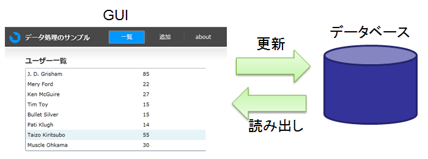
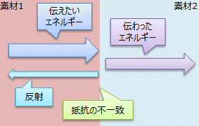
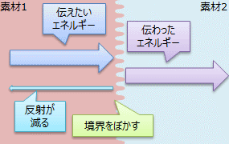

# \[雑記\] O/R インピーダンスミスマッチ

## <a id="sec-generated-title-1"></a> <a id="abst"></a>概要

<h5 class="version version3">Ver. 3.0</h5>

「[LINQ](sp3_linq.md#linq)」 を用いることで、
IEnumerable や XML、リレーショナルデータベースなど、
様々なデータソースに対して、共通の構文で問い合わせなどの操作を行うことができます。

その中でも、リレーショナルデータベースへの問い合わせを可能とする LINQ to SQL や Entity Framework は、
オブジェクト指向プログラミングとリレーショナル データベースの間の溝（インピーダンスミスマッチ）を埋める技術として、非常に面白いものになっています。

* サンプル プログラム:[EntityFrameworkSample.zip](../../../../assets/source/EntityFrameworkSample.zip)


## <a id="sec-generated-title-2"></a> <a id="gui-data"></a>ほとんどのアプリケーション ＝ GUI ＋ データ処理

近年、ほとんどのアプリケーションは、何らかのデータに対する操作と表示が主な仕事となっています。
すなわち、データ処理（読み出しや更新）と表示用の GUI 構築がプログラムの行う処理です。

<figure>

[](../../../../assets/media/ufcpp2000/csharp/fig/data1.png)

<figcaption>データに対する操作と表示</figcaption>
</figure>


このうち、GUI の構築に関しては、オブジェクト指向とイベント駆動という考え方に基づいてプログラムが作られます。
C# は 1.0 の頃から、オブジェクト指向とイベント駆動に関する機能は充実していました。
（参考： 「[オブジェクト指向](../index.md#oop)」、「[イベント](../functional/sp_event.md)」 ）

一方、データ処理は、リレーショナル データベースなどに格納するわけですが、
オブジェクト指向プログラミング（OOP）とリレーショナル データベース（RDB）の間にはプログラミング モデルの差があって、
その差（インピーダンス ミスマッチと呼ばれたりします）が開発のハードルになるので問題とされています。

（本節以降で説明する 「[LINQ](sp3_linq.md#linq)」 は、
C# 3.0 で導入された機能で、のような OOP を基本とするプログラミング言語内で、RDB 的なデータ処理を実現するものです。）


## <a id="sec-generated-title-3"></a> <a id="impedance_mismatch"></a>インピーダンス ミスマッチ

インピーダンス ミスマッチ（impedance mismatch）という言葉は、元々は電気工学の言葉で、
直訳するなら「抵抗の不一致」ということになります。
図1に示すように、抵抗の異なる素材の間に電磁波を通そうとすると、
境界面で反射が起こって、電気的なエネルギーを効率よく伝達できないんですが、
そういう状況を思い浮かべての比喩表現です。

<figure>

[](../../../../assets/media/ufcpp2000/csharp/fig/ormismatch.png)

<figcaption>異なる素材間の抵抗の不一致</figcaption>
</figure>


（
電磁波とか言われてもよく分からないという人向けに蛇足的に説明すると、
音の反射も、音波が物質中を伝わる際の抵抗（音響インピーダンス）の異なる物質の境界面で起こります。
とにかく、
物質間で反射が起きてエネルギーがうまく伝わらない状況というのがインピーダンスミスマッチです。
）

インピーダンスのミスマッチが伝達ロスを招くわけですから、
このミスマッチを解消することで伝達率が上がることが期待されます。
実際、図2に示すように、物質の境界面をぼかすような処理をかけることで、
インピーダンス（物質の抵抗）の変化が緩やかになって、
光（電磁波）や音の反射を軽減できたりもします。

<figure>

[](../../../../assets/media/ufcpp2000/csharp/fig/ormismatch2.png)

<figcaption>インピーダンス ミスマッチの解消による反射の軽減</figcaption>
</figure>


（
ちなみに、
表面に微細な凸凹を付けることで境界面をぼかして、
インピーダンス ミスマッチの解消による反射の低減を行って、
きわめて透明なガラス/フィルムを作る技術があったりします。
蛾の目の構造はこういう凸凹になっていて実際に反射が抑えられていることから、
「モスアイ（moth eye）加工」と呼ばれたりします。
）


## <a id="sec-generated-title-4"></a> <a id="or_impedance_mismatch"></a>O/R インピーダンスミスマッチ

要するに、<em>コンセプトの異なる2つの分野を繋ごうとする際に起こる困難</em>をさして、
インピーダンス ミスマッチという言葉を使います。
そして、インピーダンス ミスマッチがあると「伝達ロス」が発生するので、このミスマッチは極力解消したいものです。

IT の分野で特に問題となるミスマッチは、
オブジェクト指向プログラミング（OOP）とリレーショナルデータベース（RDB）の間の不一致で、
<strong id="or_mismatch" class="keyword">O/R インピーダンス ミスマッチ</strong>（O/R は Object/Relational の略）と呼ばれます。

ここでは、
OOP と RDB でそれぞれどういうコンセプトでデータを表すかを説明した上で、
どういうミスマッチがあるのか、
LINQ でどう解決されるのかを説明したいと思います。


## <a id="sec-generated-title-5"></a> <a id="class_vs_table"></a>OOP のクラスと RDB のテーブル

ここでは例として、本のシリーズと作家のデータベースを考えます。
この例では、
シリーズは名前と出版社と作者を、
作家は名前・誕生日・ウェブサイト URL を持つものとします。

作家はいくつかのシリーズを持っていますし、シリーズにはそれぞれ作者がいるわけですが、
まあまず、最初はその両者の間の関連性はおいておいて別々に考えます。
（この段階では OOP と RDB の間の差は顕著には現れません。）


##### <a id="sec-generated-title-6"></a>OOP（クラス）

まず、OOP の例として C# のコードを挙げますが、
C# の場合、以下のようなクラスを定義して、
List や Dictionary を使ってデータを格納します。

```csharp {title="データを表現するクラス"}
class Author
{
  public string Name;
  public DateTime Birthday;
  public string Url;
}

class Series
{
  public string Name;
  public string Publisher;
}
```


```csharp {title="List でデータを格納"}
List<Author> authors = new List<Author> {
  new Author {
    Name = "赤松健",
    Birthday = new DateTime(1968, 07, 05),
    Url = "http://www.ailove.net/main.html"
  },
  new Author {
    Name = "久米田康治",
    Birthday = new DateTime(1967, 09, 05),
    Url = "http://websunday.net/backstage/kumeta.html"
  },
  new Author {
    Name = "島本和彦",
    Birthday = new DateTime(1961, 04, 26),
    Url = "http://simamoto.zenryokutei.com/"
  },
  new Author {
    Name = "藤田和日郎",
    Birthday = new DateTime(1964, 05, 24),
    Url = "http://websunday.net/backstage/fujita.html"
  },
};

List<Series> series = new List<Series> {
  new Series { Name = "魔法先生ネギま！", Publisher = "講談社" },
  new Series { Name = "ラブひな", Publisher = "講談社" },
  new Series { Name = "さよなら絶望先生", Publisher = "講談社" },
  new Series { Name = "かってに改蔵", Publisher = "小学館" },
  new Series { Name = "アニメ店長", Publisher = "一迅社" },
  new Series { Name = "新吼えろペン", Publisher = "小学館" },
  new Series { Name = "ゲキトウ", Publisher = "講談社" },
  new Series { Name = "からくりサーカス", Publisher = "小学館" },
  new Series { Name = "うしおととら", Publisher = "小学館" },
};
```


##### <a id="sec-generated-title-7"></a>RDB（テーブル）

一方、RDB では、
以下のように、テーブルとしてデータの構造定義・格納します。

<table summary="Authors テーブル">
	<caption>
		Authors テーブル
	</caption>
	<tr>
		<th>Name</th>
		<th>Birthday</th>
		<th>Url</th>
	</tr>
	<tr>
		<td markdown="1">赤松健</td>
		<td markdown="1">1968/07/05</td>
		<td markdown="1">http://www.ailove.net/main.html</td>
	</tr>
	<tr>
		<td markdown="1">久米田康治</td>
		<td markdown="1">1967/09/05</td>
		<td markdown="1">http://websunday.net/backstage/kumeta.html</td>
	</tr>
	<tr>
		<td markdown="1">島本和彦</td>
		<td markdown="1">1961/04/26</td>
		<td markdown="1">http://simamoto.zenryokutei.com/</td>
	</tr>
	<tr>
		<td markdown="1">藤田和日郎</td>
		<td markdown="1">1964/05/24</td>
		<td markdown="1">http://websunday.net/backstage/fujita.html</td>
	</tr>
</table>


<table summary="Series テーブル">
	<caption>
		Series テーブル
	</caption>
	<tr>
		<th>Name</th>
		<th>Publisher</th>
	</tr>
	<tr>
		<td markdown="1">魔法先生ネギま！</td>
		<td markdown="1">講談社</td>
	</tr>
	<tr>
		<td markdown="1">ラブひな</td>
		<td markdown="1">講談社</td>
	</tr>
	<tr>
		<td markdown="1">さよなら絶望先生</td>
		<td markdown="1">講談社</td>
	</tr>
	<tr>
		<td markdown="1">かってに改蔵</td>
		<td markdown="1">小学館</td>
	</tr>
	<tr>
		<td markdown="1">アニメ店長</td>
		<td markdown="1">一迅社</td>
	</tr>
	<tr>
		<td markdown="1">新吼えろペン</td>
		<td markdown="1">小学館</td>
	</tr>
	<tr>
		<td markdown="1">ゲキトウ</td>
		<td markdown="1">講談社</td>
	</tr>
	<tr>
		<td markdown="1">からくりサーカス</td>
		<td markdown="1">小学館</td>
	</tr>
	<tr>
		<td markdown="1">うしおととら</td>
		<td markdown="1">小学館</td>
	</tr>
</table>


まあ、本当は、出版社の情報も別テーブルに持ちたいところですが、
ここでは話を簡単にするために Series テーブル中に含めています。

最初にも少し触れましたが、
この時点では OOP と RDB には大きな差は生まれません。
見た目こそ違いますが、
いずれも、1行1行データが書かれているだけです。


## <a id="sec-generated-title-8"></a> <a id="hierarchy_vs_join"></a>OOP の階層的データ構造と RDB のテーブル結合

まあ、前節のように、データテーブルが独立しているうちは OOP と RDB にはそれほど大きな差は生まれません。
問題は、2つのテーブルの関係性を表すときに生じます。

引き続き、作家とシリーズのデータベースの例で説明しましょう。
作家はいくつかのシリーズを持っていますし、シリーズにはそれぞれ作者がいます。


##### <a id="sec-generated-title-9"></a>OOP（クラスの階層化）

OOP では、通常、階層的なデータ構造を持っています。
作家が複数のシリーズを持っているなら、作家クラスは以下のように書かれます。

```csharp {title="Author クラスには Series リストがある" highlight-text="public List&lt;Series&gt; Series;"}
class Author
{
  public string Name;
  public DateTime Birthday;
  public string Url;

  public List<Series> Series;
}
```


また、シリーズに作者があるなら、シリーズクラスは以下のようになります。
（もちろん、本当は1つの本に複数の作者（原作、作画、コンテ構成など）があったりしますが、
ここでは単純化のために、作家は1人だけとします。）

```csharp {title="Series クラスには Author フィールドがある" highlight-text="public Author Author;"}
class Series
{
  public string Name;
  public string Publisher;

  public Author Author;
}
```


で、例えば、各作家の著作一覧を取得したければ以下のように書きます。
階層的にデータを取得するために、2重ループなどを書きます。

```csharp {title="各作家の著作一覧を取得"}
foreach (Author a in authors)
{
  Console.Write("{0}\n", a.Name);
  foreach (Series s in a.Series)
  {
    Console.Write("  - {0}\n", s.Name);
  }
}
```


また、各シリーズの著者を取得するには以下のようにします。

```csharp {title="各シリーズの著者を取得" highlight-text="s.Author.Name"}
foreach (Series s in series)
{
  Console.Write("{0}, {1}\n", s.Name, s.Author.Name);
}
```


##### <a id="sec-generated-title-10"></a>RDB（テーブル間の関係）

一方、RDB では、階層的にデータを持つことはできません。
データ上は、以下のように、ID 情報（Series テーブルの Author_Id 列）だけを持っておきます。

<table summary="Authors テーブル">
	<caption>
		Authors テーブル
	</caption>
	<tr>
		<th>Id</th>
		<th>Name</th>
		<th>Birthday</th>
		<th>Url</th>
	</tr>
	<tr>
		<td markdown="1">1</td>
		<td markdown="1">赤松健</td>
		<td markdown="1">1968/07/05</td>
		<td markdown="1">http://www.ailove.net/main.html</td>
	</tr>
	<tr>
		<td markdown="1">2</td>
		<td markdown="1">久米田康治</td>
		<td markdown="1">1967/09/05</td>
		<td markdown="1">http://websunday.net/backstage/kumeta.html</td>
	</tr>
	<tr>
		<td markdown="1">3</td>
		<td markdown="1">島本和彦</td>
		<td markdown="1">1961/04/26</td>
		<td markdown="1">http://simamoto.zenryokutei.com/</td>
	</tr>
	<tr>
		<td markdown="1">4</td>
		<td markdown="1">藤田和日郎</td>
		<td markdown="1">1964/05/24</td>
		<td markdown="1">http://websunday.net/backstage/fujita.html</td>
	</tr>
</table>


<table summary="Series テーブル">
	<caption>
		Series テーブル
	</caption>
	<tr>
		<th>Name</th>
		<th>Publisher</th>
		<th>Author_Id</th>
	</tr>
	<tr>
		<td markdown="1">魔法先生ネギま！</td>
		<td markdown="1">講談社</td>
		<td markdown="1">1</td>
	</tr>
	<tr>
		<td markdown="1">ラブひな</td>
		<td markdown="1">講談社</td>
		<td markdown="1">1</td>
	</tr>
	<tr>
		<td markdown="1">さよなら絶望先生</td>
		<td markdown="1">講談社</td>
		<td markdown="1">2</td>
	</tr>
	<tr>
		<td markdown="1">かってに改蔵</td>
		<td markdown="1">小学館</td>
		<td markdown="1">2</td>
	</tr>
	<tr>
		<td markdown="1">アニメ店長</td>
		<td markdown="1">一迅社</td>
		<td markdown="1">3</td>
	</tr>
	<tr>
		<td markdown="1">新吼えろペン</td>
		<td markdown="1">小学館</td>
		<td markdown="1">3</td>
	</tr>
	<tr>
		<td markdown="1">ゲキトウ</td>
		<td markdown="1">講談社</td>
		<td markdown="1">3</td>
	</tr>
	<tr>
		<td markdown="1">からくりサーカス</td>
		<td markdown="1">小学館</td>
		<td markdown="1">4</td>
	</tr>
	<tr>
		<td markdown="1">うしおととら</td>
		<td markdown="1">小学館</td>
		<td markdown="1">4</td>
	</tr>
</table>


そして、問い合わせの際に、
ID を元に2つのテーブルを結合してから所望のデータを取り出します。

例えば、OOP の例と同じく、
各作家のシリーズ一覧を取得したければ、以下のような SQL 文を書きます。

```sql {title="INNER JOIN で結合"}
SELECT [a].[Name] AS [AuthorName], [s].[Name]
  FROM [Authors] AS [a]
  INNER JOIN [Series] AS [s] ON [a].[Id] = [s].[Author_Id]
```


このように、OOP と RDB には、階層的データ構造とテーブル結合という方法論の差があります。


## <a id="sec-generated-title-11"></a> <a id="orm"></a>O/R マッパー

前節のおさらいになりますが、
OOP では階層的データ構造を、

```csharp {title="OOP の階層的データ構造" highlight-text="public List&lt;Series&gt; Series;"}
class Author
{
  public string Name;
  public DateTime Birthday;
  public string Url;

  public List<Series> Series;
}
```


RDB ではテーブル結合という方法を用いて関連性のあるデータにアクセスします。

```sql {title="RDB のテーブル結合"}
SELECT [a].[Name] AS [AuthorName], [s].[Name]
  FROM [Authors] AS [a]
  INNER JOIN [Series] AS [s] ON [a].[Id] = [s].[Author_Id]
```


近年、プログラミング言語からリレーショナルデータベースにアクセスする機会が増え、
この OOP と RDB の方法論の差、
すなわち、このページの冒頭で話をした O/R インピーダンスミスマッチを解消したいという要望が強くなっています。
下位のデータベースを意識せず、普通に OOP の作法でプログラミングするだけで RBD とのデータのやり取りがしたいわけです。

このような、OOP の作法でデータベース アクセスするための仕組みを O/R マッパー（O/R mapper）と呼びます。


##### <a id="sec-generated-title-12"></a>LINQ で O/R マッピング

「[LINQ](sp3_linq.md#linq)」は、様々な種類のデータに対して、統一的な問い合わせを行うための仕組みです。
この「さまざまな種類のデータ」にはデータベースも含まれています。
すなわち、O/R マッピング用の LINQ が存在します。

歴史的背景から、LINQ O/R マッパーには、.NET Framework 標準搭載のものだけで、2系統あります。

* LINQ to SQL: いわば、LINQ（IQueryable）の参考実装（C# コンパイラー チームが作成したもの）で、ある意味「簡易実装」な O/R マッパー。 今後の機能改善はされない予定。

* ADO.NET Entity Framework: ちゃんとデータベース フレームワーク（ADO.NET）チームが開発している O/R マッパー。 以下、単に Entity Framework と表記します。


LINQ to SQL の方が成熟が早かった（LINQ 自体と同時に開発していたので当然）ため、
当初は LINQ to SQL の方がよく利用されていました。
今（※2011年執筆）では Entity Framework もだいぶ成熟しているので、
こちらを使うべきでしょう。

ただし、LINQ to SQL の方が仕組みがシンプルな分、移植がしやすく、
Entity Framework が使えない環境でも LINQ to SQL なら使える（移植できる）ということもあります。
例えば、Windows Phone 7 向けの O/R マッパーは LINQ to SQL がベースとなっています。


## <a id="sec-generated-title-13"></a> <a id="linq"></a>LINQ の利用

### <a id="sec-generated-title-14"></a> <a id="entity"></a>エンティティ

まず、データベース上のテーブルに相当するクラス（これをエンティティ（entity: 本質、実体）と呼びます）を定義します。

<em>※以下、ADO.NET Entity Framework 4.1（2011年時点の最新版）を使った説明をします。</em>
（「過去の履歴」として、LINQ to SQL 版の説明も残してあります。）

Entity Framework では、何の変哲もないただのクラスを使ってデータベースのテーブルを生成/参照できます。

前節から引き続き、作家・シリーズ テーブルを例に取って説明しましょう。
まず、テーブル間の関係を抜きにすると、以下のような感じになります。

```csharp {title="エンティティ クラスの定義"}
using System.ComponentModel.DataAnnotations;
using System.Collections.Generic;

namespace CodeFirst.Models
{
    public class Author
    {
        public int Id { get; set; }

        [Required]
        [StringLength(100)]
        public string Name { get; set; }

        public DateTime? Birthday { get; set; }

        [StringLength(512)]
        public string Url { get; set; }
    }

    public class Series
    {
        public int Id { get; set; }

        [Required]
        [StringLength(512)]
        public string Name { get; set; }
    }
}
```


次に、
定義したエンティティ クラスを使ってデータベースを生成/テーブル参照するためのクラスを作ります。
Entity Framework では、以下のように、DbContext クラスを継承したクラスを作ります。

```csharp {title="エンティティ クラスの定義"}
using System.Data.Entity;

namespace CodeFirst.Models
{
    public class ComicDatabase : DbContext
    {
        public DbSet<Author> Authors { get; set; }
        public DbSet<Series> Series { get; set; }
    }
}
```


<span class="expand-button" title="展開/折畳">（LINQ to SQL 版）</span>
<div class="expand-panel" markdown="1" title="（LINQ to SQL 版）">
                
エンティティクラスには Table 属性を、
エンティティのメンバー（テーブルの列に相当）には Column 属性を付けます。

                
例えば、前節までの説明で使った作家/シリーズ テーブルの場合、
以下のような感じになります。

                
```csharp {title="エンティティ定義"}
using System.Data.Linq.Mapping;

[Table(Name = "Authors")]
public class Author
{
  [Column(AutoSync = AutoSync.OnInsert, IsPrimaryKey = true, IsDbGenerated = true)]
  public int Id;
  [Column]
  public string Name;
  [Column]
  public DateTime? Birthday;
  [Column]
  public string Url;
}

[Table(Name = "Series")]
public class Series
{
  [Column(AutoSync = AutoSync.OnInsert, IsPrimaryKey = true, IsDbGenerated = true)]
  public int Id;
  [Column]
  public string Name;
  [Column]
  public int AuthorId;
}
```


                
LINQ to SQL では、これらの属性をみて、
クラスのメンバーアクセスを RDB への SQL 問い合わせに変換します。

                
この例では、Author と Series の Id の Column 属性には、AutoSync などのパラメータが付いています。
これは、「データベース側で自動的に生成されるユニークな ID で、自動的にデータベース側と同期します」という意味になります。
通常、重複のない一意的な整数値がほしい場合、このような設定をします。


                

##### <a id="sec-generated-title-15"></a>DataContext

次に、データベースサーバに接続するためのクラス（DataContext）を作ります。

                
先ほどの Author と Series テーブルにアクセスするためには、
以下のようなクラスを作ります。

                
```csharp {title="ComicDataContext"}
using System.Data.Linq;

public class ComicDataContext : DataContext
{
  public ComicDataContext(string connectionString)
    : base(connectionString)
  {
  }

  public Table<Author> Author;
  public Table<Series> Series;
}
```


                
DataContext を継承するクラスに、Table 型のメンバーを書くだけです。
各 Table の初期化は、親クラスの DataContext のコンストラクタ中で、
「[リフレクション](../dynamic/sp_reflection.md#reflection)」機能を使って行われます。
なので、最低限、コンストラクタと Table メンバーだけ書けば LINQ to SQL で利用可能です。

            
</div>


### <a id="sec-generated-title-16"></a> <a id="query"></a>IQueryable とクエリ式

例えば、Author テーブルに対するクエリは以下のように書けます。

```csharp {title="クエリの例"}
using (var db = new ComicDatabase())
{
    var q =
        from a in db.Authors
        where a.Name == "島本和彦" || a.Name == "赤松健"
        select a;

    foreach (var a in q)
    {
        Console.Write("{0}, {1:yyyy/M/d}, {2}\n", a.Name, a.Birthday, a.Url);
    }
}
```


```console {title="実行結果"}
赤松健, 1968/7/5, http://www.ailove.net/main.html
島本和彦, 1961/4/26, http://simamoto.zenryokutei.com/
```


<span class="expand-button" title="展開/折畳">（LINQ to SQL 版）</span>
<div class="expand-panel" markdown="1" title="（LINQ to SQL 版）">
                
```csharp
var db = new ComicDataContext(ConnectionString);

var q =
  from a in db.Author
  where a.Name == "島本和彦" || a.Name == "赤松健"
  select a;

foreach (var a in q)
{
  Console.Write("{0}, {1:yyyy/M/d}, {2}\n", a.Name, a.Birthday, a.Url);
}
```


                
Table クラスは IQueryable インターフェースを実装していて、
このクエリ式は IQueryable に対する操作になります。
「[クエリ式](sp3_linq.md#query)」で説明したように、
C# 3.0 のクエリ式は、実際には Select や Where などといった名前のメソッド（あるいは拡張メソッド）呼び出しになります。
この例の場合、以下のメソッド呼び出しと同じ意味です。


                
```csharp {title="クエリ式の解釈結果"}
IQueryable<Author> q = db.Author.Where(
  a => a.Name == "島本和彦" || a.Name == "赤松健");
```


            
</div>

この時、クエリ式の結果（この例では変数 q）の型は IQueryable インターフェイスになります。

IQueryable は、このようなクエリ式から SQL 文を生成し、データベースサーバに問い合わせを行います。
ちなみに、IQueryable を ToString すると、生成された SQL 文を確認することができます。

```csharp {title="クエリ式の解釈結果の確認"}
var q =
  from a in db.Author
  where a.Name == "島本和彦" || a.Name == "赤松健"
  select a;

Console.WriteLine(q.ToString());
```


```console {title="実行結果"}
SELECT
[Extent1].[Id] AS [Id],
[Extent1].[Name] AS [Name],
[Extent1].[Kana] AS [Kana],
[Extent1].[Birthday] AS [Birthday],
[Extent1].[Url] AS [Url]
FROM [dbo].[Authors] AS [Extent1]
WHERE [Extent1].[Name] IN (N'島本和彦',N'赤松健')
```


### <a id="sec-generated-title-17"></a> <a id="association"></a>エンティティ間の関係性

それでは次に、
Author と Series エンティティ間の関係性を記述します。

Entity Framework を使うと、ただ単に他のエンティティを参照するプロパティを定義するだけで、
データベース テーブルの関係性を表現できます。
例えば、先ほどの Author / Series クラスに以下のような修正を加えます。

```csharp {title="テーブル間の関係性を、エンティティ クラスの階層構造で表現" highlight-ranges="14:9-14:58,25:9-25:43"}
    public class Author
    {
        public int Id { get; set; }

        [Required]
        [StringLength(100)]
        public string Name { get; set; }

        public DateTime? Birthday { get; set; }

        [StringLength(512)]
        public string Url { get; set; }

        public virtual IList<Series> Series { get; set; }
    }

    public class Series
    {
        public int Id { get; set; }

        [Required]
        [StringLength(512)]
        public string Name { get; set; }

        public Author Author { get; set; }
    }
```


このような、エンティティ間の参照関係を表すプロパティをナビゲーション プロパティ（navigation property）と呼びます。
ナビゲーション プロパティは、データベース上は ID 情報だけ記録され、
参照時に適宜、テーブルの JOIN が行われます。

<span class="expand-button" title="展開/折畳">（LINQ to SQL 版）</span>
<div class="expand-panel" markdown="1" title="（LINQ to SQL 版）">
                
```csharp {title="エンティティ間の関連性"}
using System.Data.Linq.Mapping;

[Table(Name = "Authors")]
public class Author
{
  [Column(AutoSync = AutoSync.OnInsert, IsPrimaryKey = true, IsDbGenerated = true)]
  public int Id;
  [Column]
  public string Name;
  [Column]
  public DateTime? Birthday;
  [Column]
  public string Url;

  [Association(OtherKey = "AuthorId")]
  public EntitySet<Series> Series;
}

[Table(Name = "Series")]
public class Series
{
  [Column(AutoSync = AutoSync.OnInsert, IsPrimaryKey = true, IsDbGenerated = true)]
  public int Id;
  [Column]
  public string Name;
  [Column]
  public int AuthorId;

  [Association(Storage = "_Author", ThisKey = "AuthorId")]
  public Author Author
  {
    get { return this._Author.Entity; }
    set { this._Author.Entity = value; }
  }
  private EntityRef<Author> _Author;
}
```


                
EntitySet や EntityRef クラスのデータへのアクセスは、
必要になったときに初めてデータベースサーバに問い合わせを行います。
すなわち、初回アクセス時にのみサーバからデータをロードし、
取得済みのデータがすでにあるならその値を返します。

                
Author は複数の Series を持っているので EntitySet、
Series は（今回の例では）ただ1人の Author を持つので EntityRef を使います。

                
OOP における階層的データ構造は、
RDB ではテーブル結合で行うわけですが、
結合の際のキーを Association 属性のパラメータに与えます。
この例では、
Author の主キー（IsPrimaryKey = true）である Id と Series の AuthorId の値によってテーブルを結合するので、
Author 側には OtherKey = "AuthorId" を、
Series 側には ThisKey = "AuthorId" を指定します。

            
</div>

これで、Author.Series や Series.Author の値が必要になった際に、
自動的にテーブル結合を行うような SQL 文が生成されます。

```csharp {title="自動的にテーブル結合を行うクエリが作られる"}
using (var db = new ComicDatabase())
{
    var q =
        from s in db.Series
        where s.Name.Contains("先生")
        select new { Title = s.Name, Author = s.Author.Name };

    foreach (var s in q)
    {
        Console.Write("{0}, {1}\n", s.Title, s.Author);
    }

    Console.Write("\n{0}\n", q);
}
```


```console {title="実行結果" highlight-lines="9"}
魔法先生ネギま！, 赤松健
さよなら絶望先生, 久米田康治

SELECT
1 AS [C1],
[Extent1].[Name] AS [Name],
[Extent2].[Name] AS [Name1]
FROM  [dbo].[Series] AS [Extent1]
LEFT OUTER JOIN [dbo].[Authors] AS [Extent2] ON [Extent1].[Author_Id] = [Extent2].[Id]
WHERE [Extent1].[Name] LIKE N'%先生%'
```


## <a id="sec-generated-title-18"></a> <a id="summary"></a>まとめ

* オブジェクト指向プログラミング（OOP）言語とリレーショナルデータベース（RDB）の間には、
    * OOP： 階層的データ構造

    * RDB： テーブル結合

という方法論の差があります（O/R インピーダンスミスマッチ）。

* Entity Framework を利用する際に使う物:
    * エンティティ: データベースのテーブルに相当するクラスを定義。

    * 関連性: 他のエンティティを参照するプロパティ（ナビゲーション プロパティ）を定義することでテーブル間の関係性を定義。

    * データベース コンテキスト: 定義したエンティティを使ってデータベースのテーブル生成/参照するためのクラスを定義。


<span class="expand-button" title="展開/折畳">（LINQ to SQL 版）</span>
<div class="expand-panel" markdown="1" title="（LINQ to SQL 版）">
            
* LINQ to SQL では、OOP の階層的データアクセスから、テーブル結合を行うような SQL クエリを自動的に生成します。

* LINQ to SQL を利用する際には、
    * エンティティ： Table 属性付きのクラスに、Column 属性付きのメンバーを定義

    * 関連性： Association 属性を付けた EntityRef / EntitySet 型のメンバーを定義

    * DataContext： DataContext クラスに Table 型のメンバーを定義

を作る。


        
</div>

次章の「[[雑記] LINQ to SQL 実践編](sp3_linqtosql.md)」では、
Visual Studio を使ってデータベースのテーブル定義 → LINQ to SQL クラス化 → クエリ式を使ったプログラム作成という一連の作業を具体的に説明します。
