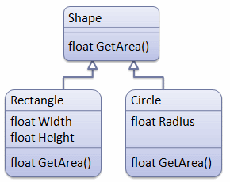
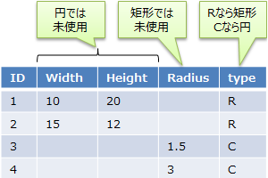
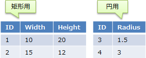
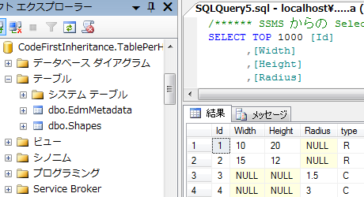
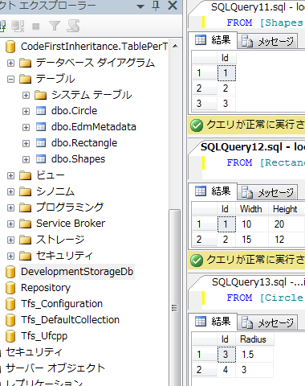
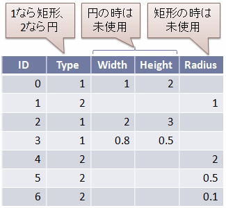
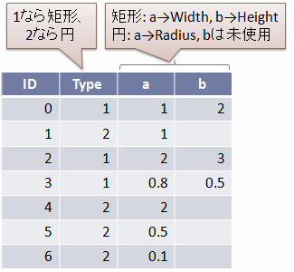

# \[雑記\] O/R インピーダンスミスマッチ（クラスの継承）

## <a id="sec-generated-title-1"></a> <a id="abst"></a>概要

<h5 class="version version3">Ver. 3.0</h5>

「[[雑記] O/R インピーダンスミスマッチ](sp3_ormismatch.md)」では、オブジェクト指向とリレーショナルデータベースの間のデータ構造の差、
階層構造とテーブル結合の差について話をしました。
これに加えて、オブジェクト指向独特の概念として、クラスの「[継承](../oop/oo_inherit.md#derive)」というものがあります。

ここでは、Entity Framework を使って、クラスの継承階層をテーブルにマッピングする例を紹介します。

* サンプル プログラム:[EntityFrameworkSample.zip](../../../../assets/source/EntityFrameworkSample.zip)


## <a id="sec-generated-title-2"></a> <a id="inherit"></a>クラスの継承階層

「[継承](../oop/oo_inherit.md)」や「[多態性](../oop/oo_polymorphism.md)」で説明したように、オブジェクト指向の基本的な概念の1つに継承というものがあります。

例えば、矩形や円などの図形を考えたとき、これらの図形には「面積を求められる」という共通の性質があります。
このような場合、共通の性質を基底クラスにまとめてしまうのがオブジェクト指向のやり方です。
この様子を図示したものと、サンプルコードを以下に示します。

<figure>

[](../../../../assets/media/ufcpp2000/csharp/fig/ormismatch_inheritance.png)

<figcaption>クラスの継承階層の例</figcaption>
</figure>


```csharp {title="クラスの継承階層の例"}
public abstract class Shape
{
    public abstract float GetArea();
}

public class Rectangle : Shape
{
    public float Width { get; set; }

    public float Height { get; set; }

    public override float GetArea()
    {
        return this.Width * this.Height;
    }
}

public class Circle : Shape
{
    public float Radius { get; set; }

    public override float GetArea()
    {
        return (float)(Math.PI * this.Radius * this.Radius);
    }
}
```


## <a id="sec-generated-title-3"></a> <a id="rdb"></a>継承階層を RDB のテーブルで表現

前節で説明したような継承階層を RDB 上で表現するにはいくつか方法がありますが、
ここでは2つほど紹介します。


##### <a id="sec-generated-title-4"></a>テーブルの共有

1つ目の方法は、クラスの継承階層で1つのテーブルを共有します。
（table per hierarchy と呼びます。）
テーブルの各行がどの型かを判別するための列（discriminator: discriminate は「区別・識別する」）を作ります。

<figure>

[](../../../../assets/media/ufcpp2000/csharp/fig/TablePerHierarchy1.png)

<figcaption>継承階層を共有テーブル化</figcaption>
</figure>


シンプルですが、型によって使われない列が出るという問題もあります。


##### <a id="sec-generated-title-5"></a>別テーブルを作成

もう1つは、クラスごとに別のテーブルを作ります。
（table per type と呼びます。）

<figure>

[](../../../../assets/media/ufcpp2000/csharp/fig/TablePerType1.png)

<figcaption>継承階層を複数のテーブルに分割</figcaption>
</figure>


共有テーブルのように無駄な列ができることはありませんが、
複数のテーブルが見かけ上、1つのテーブルであるかのように見せる仕組みが必要になります。


## <a id="sec-generated-title-6"></a> <a id="ormap"></a>Entity Framework における継承構造の O/R マッピング

Entity Framework では、データベース コンテキストを作る際に、
DbContext クラスの OnModelCreating メソッドをオーバーライドすることで、
継承階層のテーブル化方法をカスタマイズできます。

table per hierarchy にしたい場合は以下のように書きます。

```csharp {title="table per hierarchy なデータベース コンテキスト"}
public class TablePerHierarchyContext : DbContext
{
    public DbSet<Shape> Shapes { get; set; }

    protected override void OnModelCreating(DbModelBuilder modelBuilder)
    {
        modelBuilder.Entity<Shape>()
            .Map<Rectangle>(x => x.Requires("type").HasValue("R"))
            .Map<Circle>(x => x.Requires("type").HasValue("C"));
    }
}
```


一方、
table per type にしたい場合は以下のように書きます。

```csharp {title="table per type なデータベース コンテキスト"}
public class TablePerTypeContext : DbContext
{
    public DbSet<Shape> Shapes { get; set; }

    protected override void OnModelCreating(DbModelBuilder modelBuilder)
    {
        modelBuilder.Entity<Rectangle>().ToTable("Rectangle");
        modelBuilder.Entity<Circle>().ToTable("Circle");
    }
}
```


##### <a id="sec-generated-title-7"></a>サンプル データ作成

作成した2つのデータベース コンテキストを使って、サンプル データを作成してみましょう。

```csharp {title="サンプル データの作成"}
private static void Create()
{
    using (var db = new TablePerHierarchyContext())
    {
        Create(db.Shapes);
        db.SaveChanges();
    }

    // ↑↓見ての通り、コンテキストが違う以外は全く一緒。

    using (var db = new TablePerTypeContext())
    {
        Create(db.Shapes);
        db.SaveChanges();
    }
}

private static void Create(System.Data.Entity.DbSet<Shape> shapes)
{
    shapes.Add(new Rectangle { Width = 10, Height = 20 });
    shapes.Add(new Rectangle { Width = 15, Height = 12 });
    shapes.Add(new Circle { Radius = 1.5f });
    shapes.Add(new Circle { Radius = 3 });
}
```


TablePerHierarchyContext によって作られるデータベースは以下のようになります。

<figure>

[](../../../../assets/media/ufcpp2000/csharp/fig/TablePerHierarchy2.png)

<figcaption>TablePerHierarchyContext によって作られるデータベース</figcaption>
</figure>


これに対して、
TablePerTypeContext によって作られるデータベースは以下のようになります。

<figure>

[](../../../../assets/media/ufcpp2000/csharp/fig/TablePerType2.png)

<figcaption>TablePerHierarchyContext によって作られるデータベース</figcaption>
</figure>


##### <a id="sec-generated-title-8"></a>データの参照

作成したデータを参照してみましょう。

```csharp {title="データの参照"}
private static void Query()
{
    using (var db = new TablePerTypeContext())
    {
        Query(db.Shapes);
    }

    // ↑↓見ての通り、コンテキストが違う以外は全く一緒。

    using (var db = new TablePerHierarchyContext())
    {
        Query(db.Shapes);
    }
}

private static void Query(System.Data.Entity.DbSet<Shape> shapes)
{
    foreach (var x in shapes)
    {
        Console.WriteLine("{0}: {1}", x.GetType().Name, x.GetArea());
    }
}
```


```console {title="実行結果"}
Table Per Hierarchy
Rectangle: 200
Rectangle: 180
Circle: 7.068583
Circle: 28.27433
Table Per Type
Circle: 7.068583
Circle: 28.27433
Rectangle: 200
Rectangle: 180
```


## <a id="sec-generated-title-9"></a> <a id="linq-to-sql"></a>LINQ to SQL 版

<span class="expand-button" title="展開/折畳">（LINQ to SQL 版）</span>
<div class="expand-panel" markdown="1" title="（LINQ to SQL 版）">
      

##### <a id="sec-generated-title-10"></a>継承構造を RDB のテーブルで表現

前節で説明したような継承構造を RDB 上で表現するには、
型識別用の情報を格納した列（discriminator: discriminate は「区別・識別する」）を作ります。

        
引き続き、図形（shape, rectangle, circle）を例にとって説明すると、
例えば、図2か図3のようなテーブルを定義することになります。

        
<figure>

[](../../../../assets/media/ufcpp2000/csharp/fig/ormismatch_table1.png)

<figcaption>継承構造をテーブル化(1)</figcaption>
</figure>


        
<figure>

[](../../../../assets/media/ufcpp2000/csharp/fig/ormismatch_table2.png)

<figcaption>継承構造をテーブル化(2)</figcaption>
</figure>


        
この例の場合、Type 列が discrimitator になります。


      

##### <a id="sec-generated-title-11"></a>LINQ to SQL における継承構造の O/R マッピング

「[クラスの継承階層](#inherit)」で説明したクラスの継承構造と、
「[継承階層を RDB のテーブルで表現](#rdb)」で説明したテーブル構造を対応付けるため、
LINQ to SQL では、継承構造をもつクラスに InheritanceMapping 属性をつけ、
discriminator にしたいプロパティの Column 属性に <code>IsDiscriminator = true</code> をつけます。

        
例えば、図2のようにしたい場合には、以下のようなコードを書きます。

        
```csharp {title="InheritanceMapping の例1" highlight-ranges="sha256:e93baa0a3ecfaeaa889ebb33a685b12dda14f19b4920c5fe1217dade2c4d5d57;22:4-22:22,23:4-23:22,24:4-24:22,30:13-30:28"}
using System;
using System.Data.Linq;
using System.Data.Linq.Mapping;

namespace LinqToSqlSample
{
  public sealed class ShapeDataContext : DataContext
  {
    public ShapeDataContext(string connection) : base(connection) {}

    public Table<Shape> Shapes;
  }

  public enum ShapeType : int
  {
    Invalid,
    Rectangle,
    Circle,
  }

  [Table(Name = "Shape")]
  [InheritanceMapping(Code = "0", Type = typeof(Shape), IsDefault = true)]
  [InheritanceMapping(Code = "1", Type = typeof(Rectangle))]
  [InheritanceMapping(Code = "2", Type = typeof(Circle))]
  public class Shape
  {
    [Column(AutoSync = AutoSync.OnInsert, IsDbGenerated = true, IsPrimaryKey = true)]
    public int ID;

    [Column(IsDiscriminator = true)]
    public ShapeType Type;

    public virtual float GetArea() { return 0; }
  }

  public class Rectangle : Shape
  {
    [Column(CanBeNull = true)]
    public float Width;

    [Column(CanBeNull = true)]
    public float Height;

    public override float GetArea()
    {
      return this.Width * this.Height;
    }
  }

  public class Circle : Shape
  {
    [Column(CanBeNull = true)]
    public float Radius;

    public override float GetArea()
    {
      return (float)(Math.PI * this.Radius * this.Radius);
    }
  }
}
```


        
あるいは、図3のようにしたい場合には、以下のようなコードを書きます。

        
```csharp {title="InheritanceMapping の例2" highlight-ranges="sha256:58536271b8eebb834dea5c9651b63d263f4e12ffa6d087ec4c5f3403dec98cf3;22:4-22:22,23:4-23:22,24:4-24:22,30:13-30:28"}
using System;
using System.Data.Linq;
using System.Data.Linq.Mapping;

namespace LinqToSqlSample
{
  public sealed class ShapeDataContext : DataContext
  {
    public ShapeDataContext(string connection) : base(connection) {}

    public Table<Shape> Shapes;
  }

  public enum ShapeType : int
  {
    Invalid,
    Rectangle,
    Circle,
  }

  [Table(Name = "Shape")]
  [InheritanceMapping(Code = "0", Type = typeof(Shape), IsDefault = true)]
  [InheritanceMapping(Code = "1", Type = typeof(Rectangle))]
  [InheritanceMapping(Code = "2", Type = typeof(Circle))]
  public class Shape
  {
    [Column(AutoSync = AutoSync.OnInsert, IsDbGenerated = true, IsPrimaryKey = true)]
    public int ID;

    [Column(IsDiscriminator = true)]
    public ShapeType Type;

    [Column(Name = "a", CanBeNull = true)]
    protected float a;

    [Column(Name = "b", CanBeNull = true)]
    protected float b;

    public virtual float GetArea() { return 0; }
  }

  public class Rectangle : Shape
  {
    public float Width
    {
      get { return this.a; }
      set { this.a = value; }
    }

    public float Height
    {
      get { return this.b; }
      set { this.b = value; }
    }

    public override float GetArea()
    {
      return this.Width * this.Height;
    }
  }

  public class Circle : Shape
  {
    public float Radius
    {
      get { return this.a; }
      set { this.a = value; }
    }

    public override float GetArea()
    {
      return (float)(Math.PI * this.Radius * this.Radius);
    }
  }
}
```


        
要するに、<code>IsDiscriminator = true</code> のついた列の値の基づいて、
InheritanceMapping 属性の情報を元にどの派生クラスになるか決定されます。

        
以下のようなコードで動作確認ができます。

        
```csharp {title="確認用のコード"}
var db = new ShapeDataContext("shape.sdf");

if (!db.DatabaseExists())
{
  db.CreateDatabase();

  db.Shapes.InsertOnSubmit(new Rectangle { Width = 2, Height = 3 });
  db.Shapes.InsertOnSubmit(new Circle { Radius = 1 });
  db.Shapes.InsertOnSubmit(new Rectangle { Width = 1, Height = 2 });
  db.Shapes.InsertOnSubmit(new Circle { Radius = 2 });
  db.Shapes.InsertOnSubmit(new Rectangle { Width = 2, Height = 1 });
  db.Shapes.InsertOnSubmit(new Circle { Radius = 0.5F });
  db.Shapes.InsertOnSubmit(new Rectangle { Width = 0.5F, Height = 0.5F });
  db.Shapes.InsertOnSubmit(new Circle { Radius = 0.1F });

  db.SubmitChanges();
}

foreach (var s in db.Shapes)
{
  Console.Write("{0}, area = {1}\n", s.Type, s.GetArea());
}
```


        
```console {title="実行結果"}
Rectangle, area = 6
Circle, area = 3.141593
Rectangle, area = 2
Circle, area = 12.56637
Rectangle, area = 2
Circle, area = 0.7853982
Rectangle, area = 0.25
Circle, area = 0.03141593
```


    
</div>
