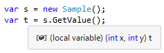

# タプル

## <a id="sec-generated-title-1"></a> <a id="abstract"></a>概要

<h5 class="version version7">Ver. 7</h5>

「[名前のない複合型](../structured/st_anonymoustype.md)」で説明したように、
型には常によい名前が付くわけではなく、名無しにしておきたいことがあります。
そういう場合に使うもののうちの1つがC# 7で導入されたタプルです。

タプルの最大の用途は[多値戻り値](../structured/st_anonymoustype.md#multiple-returns)です。
関数の戻り値は引数と対になるものなので、タプルの書き心地は引数に近くなるように設計されています。

#### <a id="sec-generated-title-2"></a>ポイント

- `(int x, int y)`というような、引数みたいな書き方で「名前のない型」を作れます
- この書き方をタプルと呼びます

## <a id="sec-generated-title-3"></a> <a id="tuple"></a>タプル

C# 7で導入された<strong id="key-tuple" class="keyword">タプル</strong>(tuple)は、
`(int x, int y)`というような、引数みたいな書き方で「名前のない型」を作る機能です。

※ タプルの利用には、`ValueTuple`構造体という型が必要になります。
この型が標準ライブラリに取り込まれるのは .NET Framework 4.7、.NET Standard 1.7を予定しています。
それ以前のバージョンでタプルを使いたい場合には、以下のパッケージを参照する必要があります。

- [System.ValueTuple](https://www.nuget.org/packages/System.ValueTuple/)


### <a id="sec-generated-title-4"></a> <a id="name"></a>タプルという名前

最初に例を挙げた`(int x, int y)`という書き方は、2つの`int`の値`x`と`y`を並べたものなわけですが、こういう「データを複数並べたもの」を意味する単語がタプルです。

英語では倍数を「double, triple, quadruple, ...」などという単語で表しますが、これを一般化して n-tuple (nは0以上の任意の整数)と書くことがあり、これがタプルの語源です。
n倍、n重、n連結というような意味しかなく、まさに「名前のない複合型」にピッタリの単語です。

### <a id="sec-generated-title-5"></a> <a id="denotation"></a>型の明示

`(int x, int y)`みたいな書き方で、1つの型を表します。
タプルの型の書き方はメソッドの仮引数リスト(引数を受け取る側の書き方)に似ていて、`()`の中に「型名 メンバー名」を `,` 区切りで並べます。

これは、型を書ける場所であれば概ねどこにでもこの「型」を書けます。
まず、以下のように、フィールドや戻り値などの型にできます。

```csharp {title="フィールドや戻り値の型にタプルを使う"}
class Sample
{
    private (int x, int y) value;
    public (int x, int y) GetValue() => value;
}
```

以下のように、ローカル変数の型としても明示できます。

```csharp {title="明示的にローカル変数の型をタプル型にする"}
var s = new Sample();
(int x, int y) t = s.GetValue();
```

もちろん、`var`を使った型推論も効きます。



また、ジェネリックな型の型引数にも使えます。

```csharp {title="型引数にタプルを使う"}
var dic = new Dictionary<(string s, string t), (int x, int y)>
{
    { ("a", "b"), (1, 2) },
    { ("x", "y"), (4, 8) },
};

Console.WriteLine(dic[("a", "b")]); // (1, 2)
```

### <a id="sec-generated-title-6"></a> <a id="denotation-disallowed"></a>制限事項

ただ、いくつか、通常の型であれば書ける場所で、タプルのこの記法を使えないところがあります。
以下の3つです。

- `new`演算子
- `is`演算子 ([C# 8.0 以降は使えるように](patterns.md#positional))
- `using`ディレクティブ ([C# 12 以降は使えるように](../structured/sp_namespace.md#using-any-type))

例えば以下のコードはコンパイル エラーを起こします。

```csharp {title="タプル型を掛けない場所" error-ranges="9:22-9:36,10:22-10:36"}
// using でエイリアスを付けることはできない(C# 11 以前)
using T = (int x, int y);

class Program
{
    static void Main()
    {
        // var t = new T(1, 2); みたいなのと同じノリでは書けない
        var t1 = new (int x, int y)(1, 2);
        var t2 = new (int x, int y) { x = 1, y = 2 };
    }

    static void M(object obj)
    {
        // (C# 7.3 までは) is 演算子には使えない
        if(obj is (int x, int y))
        {
        }
    }
}
```

ただし、以下のように、配列やnull許容型を作る場合には`new`を使えます。

```csharp
var a = new(int x, int y)[10]; // OK
var n = new(int x, int y)?();  // OK
```

`new (int x, int y)`という書き方は、将来的な言語拡張の予定と被る(被ってしまったら将来の拡張ができない)ため禁止しているようです。
`is`演算子は、C# 8.0で入った[位置パターン](patterns.md#positional)との競合を懸念して、C# 8.0までは認めていませんでした。

```csharp {title="将来的な拡張予定"}
using System;

class Program
{
    static void Main()
    {
        var ticks = 100000;
        // (予定。C#7 ではできない) C# 8?
        DateTime d = new(ticks); // 左辺から型推論して、new DateTime(ticks) が呼ばれる
    }

    static void M(object obj)
    {
        // C# 8.0 で入った構文
        // is T 扱いじゃなくて、位置パターンで obj を x, y に分解
        if (obj is (int x, int y))
        {
            Console.WriteLine($"{x}, {y}");
        }
    }
}
```

また、タプルのメンバーは2つ以上である必要があります。`()`や`(int x)`というようなタプルは現在の仕様では作れません。

```csharp {title="0-tuple, 1-tuple は書けない"}
() noneple;     // ダメ
(int x) oneple; // ダメ

// タプル構文で書けるのは2つ以上だけ
(int x, int y) twople; // OK

// タプル構文でなければ、0-tuple, 1-tuple も作れる
ValueTuple none;     // OK
ValueTuple<int> one; // OK
```

### <a id="sec-generated-title-7"></a> <a id="literal"></a>タプル リテラル

タプルは`(1, 2)`というような書き方で[リテラル](../start/st_variable.md#literal)を書くことができます。
タプル リテラルは実引数リスト(引数を渡す側の書き方)に似ています。

```csharp {title="タプル リテラル"}
// メソッド呼び出し時の F(1, 2); みたいなノリ
(int x, int y) t1 = (1, 2);

// メソッド呼び出し時の F(x: 1, y: 2); みたいなノリ
var t2 = (x: 1, y: 2);
```

`null`のように単体では型が決まらないものも、左辺に型があれば推論が効きます。
一方で、左辺も`var`等になっていて型が決まらない場合、コンパイル エラーになります。

```csharp
// これは左辺から型推論が聞くので、null も書ける
(string s, int i) t1 = (null, 1);

// これはダメ。null の型が決まらない。
var t2 = (null, 1); // コンパイル エラー
```

### <a id="sec-generated-title-8"></a> <a id="member-access"></a>メンバー参照

メンバーの参照の仕方は普通の型と変わりません。`(int x, int y)`であれば、`x`、`y`という名前でアクセスできます。
ちなみに、タプルのメンバーは書き換え可能です。

```csharp {title="タプルのメンバー参照"}
var t = (x: 1, y: 2);
Console.WriteLine(t.x); // 1
Console.WriteLine(t.y); // 2

// メンバーごとに書き換え可能
t.x = 10;
t.y = 20;
Console.WriteLine(t.x); // 10
Console.WriteLine(t.y); // 20

// タプル自身も書き換え可能
t = (100, 200);
Console.WriteLine(t.x); // 100
Console.WriteLine(t.y); // 200
```

ちなみに、タプルのメンバーはフィールドになっています
(プロパティではない)。
フィールドになっているということは、例えば、[参照引数(`ref`)](../resource/sp_ref.md#sec-byref)に直接渡せます
(これが、プロパティだと無理)。

例えば以下のようなメソッドがあったとします。

```csharp {title="Swapメソッド"}
static void Swap<T>(ref T x, ref T y)
{
    var t = x;
    x = y;
    y = t;
}
```

このとき、以下のようにタプルのメンバーを渡せます。

```csharp {title="タプルのメンバーを参照引数に渡す"}
var t = (x: 1, y: 2);
Swap(ref t.x, ref t.y);
Console.WriteLine(t.x); // 2
Console.WriteLine(t.y); // 1
```

### <a id="sec-generated-title-9"></a> <a id="deconstruction"></a>タプルの分解

タプルは、各メンバーを分解して、それぞれ別の変数に受けて使うことができます。

```csharp {title="タプルの分解"}
var t = (x: 1, y: 2);

// 分解宣言1
(int x1, int y1) = t; // x1, y1 を宣言しつつ、ｔ を分解
// 分解宣言2
var (x2, y2) = t; // 分解宣言の簡易記法

// 分解代入
int x, y;
(x, y) = t; // 分解結果を既存の変数に代入
```

この分解は、タプル以外の型に対しても使えるものです。
詳しくは「[複合型の分解](deconstruction.md)」で説明します。

### <a id="sec-generated-title-10"></a> <a id="conversion"></a>タプル間の変換

タプル間の代入は、一定の条件下では暗黙的変換が掛かります。

#### <a id="sec-generated-title-11"></a> <a id="different-names"></a>名前違いのタプル

タプル間の代入は、メンバーの宣言位置に基づいて行われます。
逆に言うと、名前は無関係で、メンバーの型の並びだけ一致していれば代入できます。

例えば以下のように書くと、1番目同士(`x` → `s`)、2番目同士(`y` → `t`)で値が代入されます。

```csharp
(int s, int t) t1 = (x: 1, y: 2);
Console.WriteLine(t1.s); // 1
Console.WriteLine(t1.t); // 2
```

同名であっても、位置が優先です。以下のような書き方をすると、`x`、`y`が入れ替わります。

```csharp
(int y, int x) t2 = (x: 1, y: 2);
Console.WriteLine(t2.x); // 2
Console.WriteLine(t2.y); // 1
```

#### <a id="sec-generated-title-12"></a> <a id="different-types"></a>型違いのタプル

タプルのメンバーの型が違う場合、メンバーごとに調べて、すべてのメンバーで暗黙的な変換がかかる場合に限り、
タプル間の暗黙的変換ができます。

例えば以下の場合、`x`も`y`も`z`も、それぞれが型変換できるので、タプルの暗黙的型変換が掛かります。

```csharp {title="タプル間の暗黙の型変換"}
object x = "abc"; // string → object は OK
long y = 1; // int → long は OK
int? z = 2; // int → int? は OK
// ↓
(object x, long y, int? z) t = ("abc", 1, 2); // OK
```

逆に、以下の場合はコンパイル エラーになります。この例では全部のメンバーが変換不能ですが、全部でなくても、どれか1つでも変換できないと、タプル自体の変換もエラーになります。

```csharp
string x = 1; // int → string は NG
int y = 1L; // long → int は NG
int z = default(int?); // int? → int は NG
// ↓
(string x, int y, int z) t = (1, 1L, default(int?)); // NG
```

#### <a id="sec-generated-title-13"></a> <a id="extensions"></a>拡張メソッドの解決

前節のような型違いのタプル間の変換は、拡張メソッドのオーバーロード解決の際にも働きます。

例えば以下のように、配列×2のタプルに対して、`IEnumerable`×2のタプルの拡張メソッドを呼べます。
(配列から`IEnumerable`への変換は暗黙的に行えるので、このタプル間の変換も暗黙的に行えます。)

```csharp
using System;
using System.Collections.Generic;
using System.Linq;

class Program
{
    static void Main()
    {
        int[] a1 = new[] { 1, 2, 3 };
        string[] a2 = new[] { "a", "b", "c" };

        // 配列 ×2のタプルに対して、IEnumerable ×2のタプルの拡張メソッドを呼べる
        foreach (var (i, s) in (a1, a2).Zip())
        {
            Console.WriteLine($"{i}: {s}");
        }
    }
}

static class TupelExtensions
{
    // IEnumerable ×2 に対する拡張メソッド
    public static IEnumerable<(T1 x1, T2 x2)> Zip<T1, T2>(this (IEnumerable<T1> items1, IEnumerable<T2> items2) t)
        => t.items1.Zip(t.items2, (x1, x2) => (x1, x2));
}
```


### <a id="sec-generated-title-14"></a> <a id="nest"></a>タプルの入れ子

タプルは入れ子にできます。

```csharp {title="タプルの入れ子"}
// タプルの入れ子
(string a, (int x, int y) b) t1 = ("abc", (1, 2));
Console.WriteLine(t1.a);   // abc
Console.WriteLine(t1.b.x); // 1
Console.WriteLine(t1.b.y); // 2

// 型推論も可能
var t2 = (a: "abc", b: (x: 1, y: 2));
```


### <a id="sec-generated-title-15"></a> <a id="anonymous-member"></a>メンバー名も匿名

タプルは、メンバー名もなくして、完全に匿名(名無し)にすることもできます。
この場合、メンバーを使う際には`Item1`、`Item2`、…というような名前で参照します。

```csharp {title="メンバー名も匿名なタプル"}
var t1 = (1, 2);
Console.WriteLine(t1.Item1); // 1
Console.WriteLine(t1.Item2); // 2
```

`Item1`、`Item2`、… という名前は、後述する`ValueTuple`構造体のメンバー名です。

冒頭や「[名前のない複合型](../structured/st_anonymoustype.md)」で説明したように、
「メンバー名だけ見れば十分」だから型名を省略するのであって、
メンバー名まで省略するのとさすがにプログラムが読みづらくなります。
メンバー名も持っていない完全な匿名タプルは、おそらくかなり短い寿命でしか使わないでしょう。
例えば、すぐに別の(メンバー名のある)タプル型に代入したり、分解して変数に受けて使うことになります。

### <a id="sec-generated-title-16"></a> <a id="overload"></a>オーバーロード

型違いのタプルを使うのであれば、オーバーロードに使えます。
例えば、以下のメソッド`F`は、`y`の型が違うのでオーバーロード可能です。

```csharp {title="型違いのタプルでのオーバーロードは可能"}
// 型違いのタプルでのオーバーロードは可能
void F((int x, int y) t) { }
void F((int x, string y) t) { }
```

一方、型が一緒で名前だけが違うタプルではオーバーロードできません。
以下のメソッド`G`は、同じものが2つあるのでコンパイル エラーを起こします。

```csharp
// 型が一緒で名前だけ違うタプルでのオーバーロードはダメ。コンパイル エラー
void G((int x, int y) t) { }
void G((int a, int b) t) { }
```

こういう仕様になっている理由は2つあります。
1つは、次節で説明するように、内部実装的に名前だけ違うタプルを区別できないという、技術的な理由。
もう1つは、[引数でのオーバーロード](../structured/st_function.md#overload)が名前を見ていない(引数の型だけがシグネチャに含まれる)のだから、引数に倣って設計されているタプルでも、メンバー名は区別しないのが自然という理由です。

### <a id="sec-generated-title-17"></a> <a id="infer-tuple-name"></a>タプル要素名の推論

<h5 class="version version7_1">Ver. 7.1</h5>

C# 7.1から、タプル構築時に渡した変数からタプルの要素名を推論できるようになりました。
例えば以下のように、`(x, y)` と書くだけで、1要素目に`x`、2要素目に `y` という名前が付きます。
(これまでだと、`(x: x, y: y)` と書く必要がありました。)

```csharp {title="タプル要素名の推論の例"}
var x = 1;
var y = 2;
var t = (x, y);

// C# 7.0。t の要素には名前が付かない
Console.WriteLine(t.Item1);
Console.WriteLine(t.Item2);

// C# 7.1。(x, y) で (x: x, y: y) 扱い
// t の要素に x, y という名前が付く
Console.WriteLine(t.x);
Console.WriteLine(t.y);
```

以下のように、部分的な適用もされます。

```csharp {title="タプル要素名の部分的な推論"}
var y = 2;
var t = (1, y);
Console.WriteLine(t.Item1); // 1
Console.WriteLine(t.y);     // 2
```

ただし、名前に被りがあるときには推論が働きません。

```csharp {title="名前被りでタプル要素名の推論ができない例"}
var x = 1;
var t = (x, x);
Console.WriteLine(t.Item1); // t.x とは書けない
Console.WriteLine(t.Item2); // こっちも t.x とは書けない

var u = (x: 0, x);
Console.WriteLine(u.x); // u.x というと Item1 の方
Console.WriteLine(u.Item2); // Item2 の方は x とは書けない
```

名前がないので当然ですが、リテラルからは要素名の推論はできません

```csharp {title="リテラルからは推論不可"}
var t = (1, 2);
Console.WriteLine(t.Item1); // さすがに t.1 とかは書けない
```

また、メソッド名からは推論されません。
一方で、プロパティ名からは推論されます。
プロパティやフィールドの場合、インスタンス メンバーへのアクセスでも推論されます
(`t.x`とかなら、タプル要素名は`x`になります。`t?.x`でも可)。

```csharp {title="メソッド不可、プロパティ可。インスタンス メンバー アクセス可。null 条件演算子可"}
int F() => 1;
var s = "abc";

var t = (F(), s?.Length);
Console.WriteLine(t.Item1); // メソッド名からは推論されない(t.F はダメ)
Console.WriteLine(t.Length); // プロパティ名からは推論される( . でも ?. でも OK)
```

### <a id="sec-generated-title-18"></a> <a id="equality"></a>==、!= での比較

<h5 class="version version7">Ver. 7.3</h5>

C# 7.3で、タプル同士を `==`、`!=` 演算子で比較できるようになりました。

これは、後述する[`ValueTuple`](#tuple-ValueTuple)の演算子が呼ばれるわけではなく、
コンパイラーによる特別な処理が入ります。

タプルに対する`==`比較は、以下のように、メンバーごとの`==`を[`&&`](../start/st_operator.md#short-circuit)で繋いだものに展開されます。

```csharp {title="タプル =="}
void M((int a, (int x, int y) b) t)
{
    // このタプル == 比較は、
    Console.WriteLine(t == (1, (2, 3)));
    // こんな感じで、メンバーごとの == を && で繋いだものに展開される。
    Console.WriteLine(t.a == 1 && t.b.x == 2 && t.b.y == 3);
}
```

同様に、`!=`は以下のように、メンバーごとの`!=`を[`||`](../start/st_operator.md#short-circuit)で繋いだものになります。

```csharp {title="タプル !="}
void N((int a, (int x, int y) b) t)
{
    // 同じく != 比較は、
    Console.WriteLine(t != (1, (2, 3)));
    // こんな感じで、メンバーごとの != を || で繋いだものに展開される。
    Console.WriteLine(t.a != 1 || t.b.x != 2 || t.b.y != 3);
}
```

`ValueTuple`の`==`演算子や`Equals`メソッドではなくこういうコンパイラーによる処理が入っているのは、
「[タプル間の変換](#conversion)」で説明したような、メンバーごとの型変換を考慮してのことです。
例えば、以下のように、暗黙的型変換ができるもの同士の比較ができます。

```csharp
(long a, (double x, decimal y) b) t = (1, (2, 3));

// byte → long
// float → double
// short → decimal
// という、暗黙的型変換ができるもの同士の比較
Console.WriteLine(t == ((byte)1, ((float)2, (short)3)));
```

ちなみに、[ユーザー定義](../oop/oo_operator.md)の`==`、`!=`演算子を持っている場合、そのユーザー定義のものが呼ばれます。
また、ユーザー定義であれば`==`が`bool`以外の型を返すこともありますが、
その場合も、[`true`、`false`演算子](../oop/oo_operator.md#true-false)があれば比較できます。

```csharp {title="ユーザー定義の ==, !=, true, false が呼ばれる例"}
using System;

struct MyBool
{
    public bool Value;
    public MyBool(bool value) => Value = value;

    // 何が呼ばれてるかがわかるように WriteLine を挟む
    public static bool operator true(MyBool x) { Console.WriteLine("MyBool.true"); return x.Value; }
    public static bool operator false(MyBool x) { Console.WriteLine("MyBool.false"); return !x.Value; }
    public static implicit operator MyBool(bool b) => new MyBool(b);
}

struct MyInt
{
    public int Value;
    public MyInt(int value) => Value = value;
    public static MyBool operator ==(MyInt x, MyInt y) => x.Value == y.Value;
    public static MyBool operator !=(MyInt x, MyInt y) => x.Value != y.Value;
    public static implicit operator MyInt(int b) => new MyInt(b);
    public override bool Equals(object obj) => obj is MyInt x && Value == x.Value;
    public override int GetHashCode() => Value.GetHashCode();
}

public class Program
{
    static void Main()
    {
        (MyInt a, (MyInt x, MyInt y) b) t = (1, (2, 3));

        // MyInt の == に展開されるので、MyBool が得られる。
        // MyBool 同士の && で、MyBool の false 演算子が呼ばれる。
        // (この例の場合、"MyBool.false" が3回表示される。)
        // (false の方が呼ばれるのは C# の && の仕様。)
        Console.WriteLine(t == (1, (2, 3)));
    }
}
```


<!-- original-page-break -->

## <a id="sec-generated-title-19"></a> <a id="internal"></a>タプルの内部実装

タプルがどういうコードに展開されるかについても話しておきましょう。

タプルを使ったコードを古いバージョンの.NET上で動かしたり、
タプルを使ったライブラリを古いバージョンのC#から参照したり、
別のプログラミング言語から参照したい場合もあります。
そのために、タプルは、`ValueTuple`という構造体に展開されます。

### <a id="sec-generated-title-20"></a> <a id="tuple-ValueTuple"></a>ValueTuple構造体への展開

タプルは、コンパイルの結果としては`ValueTuple`構造体(`System`名前空間)に展開されます。

例えば、以下のようなコードを考えます。

```csharp {title="ローカルでのタプル利用"}
var t = (x: 3, y: 5);
var p = t.x * t.y;
var (x, y) = t;
Console.WriteLine($"{x} × {y} = {p}");
```

以下のようなコードに展開されます。

```csharp {title="ローカルでのタプルの展開結果"}
var t = new ValueTuple<int, int>(3, 5); // (x: 3, y: 5)
var p = t.Item1 * t.Item2; // t.x * t.y
var x = t.Item1;
var y = t.Item2;
Console.WriteLine($"{x} × {y} = {p}");
```

元々の`x`や`y`という名前は、内部的には残っていません。`ValueTuple`構造体のメンバーである`Item1`や`Item2`に展開されます。

特に、一度`object`や`dynamic`を経由すると、名前を完全に紛失します。
以下のコードでは、`x`や`y`が見つからず、実行時エラーを起こします。

```csharp {title="タプル型は名前を紛失する"}
private static void Dynamic()
{
    // 匿名型は名前が残る
    var a = new { x = 3, y = 5 };
    var s1 = Sum(a); // 大丈夫
    Console.WriteLine(s1);

    // タプル型は名前を紛失する
    var t = (x: 3, y: 5);
    var s2 = Sum(t); // x, yという名前が実行時になくてエラーに
    Console.WriteLine(s2);
}

private static dynamic Sum(dynamic d) => d.x + d.y;
```

### <a id="sec-generated-title-21"></a> <a id="TupleElementNames"></a>TupleElementNames属性

とはいえ、名前をどこにも残さないと、ライブラリをまたいだ時に`x`、`y`などの名前が使えなくて困ります。
そこで、クラスのメンバーにタプルを使う場合には、`TupleElementNames`属性(`System.Runtime.CompilerServices`名前空間)を付けて、
C#コンパイラーには名前がわかるようにしています。

例えば、以下のような引数も戻り値もタプルなメソッドを書いたとします。

```csharp {title="引数も戻り値もタプルなメソッド"}
public (int x, int y) F((int a, int b) t) => (t.a + t.b, t.a - t.b);
```

このメソッドは、以下のように展開されます。タプルが`ValueTuple`構造体に化けますが、`TupleElementNames`属性を付けて名前を残します。

```csharp
[return: TupleElementNames(new[] { "x", "y" })]
public ValueTuple<int, int> F([TupleElementNames(new[] { "a", "b" })] ValueTuple<int, int> t)
    => new ValueTuple<int, int>(t.Item1 + t.Item2, t.Item1 - t.Item2);
```

C#コンパイラーは、この情報を元に、タプルの名前を復元します。

### <a id="sec-generated-title-22"></a> <a id="ValueTuple-definition"></a>ValueTuple構造体の中身

タプルの展開結果にあたる`ValueTuple`は、型引数が0～8個の合計9個の構造体があります。
例えば、型引数2個のものは以下のような定義になっています。

```csharp {title="ValueTuple構造体"}
[StructLayout(LayoutKind.Auto)]
public struct ValueTuple<T1, T2>
    : IEquatable<ValueTuple<T1, T2>>, IStructuralEquatable, IStructuralComparable, IComparable, IComparable<ValueTuple<T1, T2>>
{
    public T1 Item1;
    public T2 Item2;

    public ValueTuple(T1 item1, T2 item2)
    {
        Item1 = item1;
        Item2 = item2;
    }

    // 後略、インターフェイスのメンバー定義
}
```

基本的には、publicなフィールドだけを持つ構造体です。
それに、値の比較用の各種インターフェイスが実装されています。

#### <a id="sec-generated-title-23"></a> <a id="long-tuple"></a>メンバーが9個以上のタプル

最初に言った通り、`ValueTuple`構造体の型引数は、最大のものでも8個です。
では、メンバーが9個以上のタプルを作るとどうなるかというと、入れ子の`ValueTuple`構造体が作られます。

例えば、以下のようなコードを書いたとします。
メンバー名も匿名で作ったので `ItemN`(`N`は正の整数)といったような名前でメンバーを読み書きすることになります。
C#上は、8番目以降のメンバーに対しても、`Item8`、`Item9`というような名前で参照できます。

```csharp {title="メンバーが9個のタプル"}
var t = (1, 2, 3, 4, 5, 6, 7, 8, 9);
Console.WriteLine(t.Item9);
```

このコードは、以下のように展開されます。

```csharp {title="メンバーが9個のタプルの展開結果"}
var t = new ValueTuple<int, int, int, int, int, int, int, ValueTuple<int, int>>(
    1, 2, 3, 4, 5, 6, 7, new ValueTuple<int, int>(8, 9));
Console.WriteLine(t.Rest.Item2);
```

`ValueTuple`構造体には`Item8`、`Item9`という名前のメンバーはありません。
型引数の数が最大のもので8メンバーで、その8つ目のメンバーの名前は`Rest` (残り)です。
そして、以下のように、C#上`Item9`であれば展開結果的には`Rest`のさらに`Item2`というように、入れ子のメンバー参照に展開されます。

C# 上 | コンパイル結果
---- | ----
`Item8` | `Rest.Item1`
`Item9` | `Rest.Item2`
… | …
`Item15` | `Rest.Rest.Item1`
`Item16` | `Rest.Rest.Item2`
… | …

#### <a id="sec-generated-title-24"></a> <a id="nupkg"></a>ValueTuple構造体の定義場所

C# 7のリリースに合わせて、`ValueTuple`構造体は標準ライブラリに取り込まれる予定です。

一方で、古い.NET (.NET Framework 4.6.2以前、.NET Standard 1.6以前)上でタプルを使いたい場合、
以下のライブラリを参照します。この中に`ValueTuple`構造体や、`TupleElementNames`属性が定義されています。

- [System.ValueTuple](https://www.nuget.org/packages/System.ValueTuple/)

### <a id="sec-generated-title-25"></a> <a id="0-tuple"></a>型引数0、1のValueTuple

前述の通り、タプルのメンバーは2つ以上な必要があって、`()`や`(int x)`というようなタプルは作れません。
一方で、`ValueTuple`構造体には、型引数0個と1個のものが存在します。

```csharp {title="型引数0個と1個のValueTuple"}
// メンバー0個、1個のものは、構造体はあるけど、タプル構文は使えない
var noneple = new ValueTuple();
var oneple = new ValueTuple<int>(1);

// メンバー2個以上はタプル構文を使える
var twople = (1, 2); // new ValueTuple<int, int>(1, 2);
var threeple = (1, 2, 3); // new ValueTuple<int, int, int>(1, 2, 3);
```

型引数0個の`ValueTuple`(0-tuple)は、いわゆる[Unit型](../structured/st_function.md#unit)です。
`void`の代わりにこの型を使うことで、戻り値がある場合とない場合のコードを統一的に書けてうれしい場合があります。
一方、型引数1個のもの(1-tuple)も、用途としては0-tupleと同じです。
型引数2個以上のものと並べて、戻り値や引数の個数違いを統一的に書けます。

例えば、以下の2つのコードはどちらの方が統一性があっていいかという話になります。

```csharp {title="タプルでは0、1は書けない"}
// タプルでは0、1は書けない
async Task F0() { }
async Task<int> F1() => 1;
async Task<(int x1, int x2)> F2() => (1, 2);
async Task<(int x1, int x2, int x3)> F3() => (1, 2, 3);
```

```csharp {title="こう書けると統一性があってきれい"}
// こう書けると統一性があってきれい(C# 7では書けない)
async Task<()> F0() { }
async Task<(int x1)> F1() => (1);
async Task<(int x1, int x2)> F2() => (1, 2);
async Task<(int x1, int x2, int x3)> F3() => (1, 2, 3);
```

特に、ソースコード生成などでまとめて、個数違いのメソッドを生成したい場合などには、0-tupleや1-tupleがほしくなります。
0個と1個の時だけ特別扱いが必要になるかどうかという問題です。
0-tupleと1-tupleがあれば、特別扱いなしでソースコード生成ができて楽です。

ということで、0-tuple、1-tupleの需要はあるんですが、問題があって構文を提供できていません。
1-tupleになるであろう構文は`(1)`というような形になるはずですが、
これが、C#の既存の構文ですでに、単に`1`と同じ意味で解釈されるため、1-tupleを作れません。
0-tupleの方の`()`は、これまでは書けなかった書き方なので別にC# 7で追加できますが、
1-tupleだけ飛ばして「0か2以上のみ」とするのも変な話です。

<!-- original-page-break -->

## <a id="sec-generated-title-26"></a> <a id="related"></a>関連

タプルには、毛色の似た機能が2つあります。

- [匿名型](../start/sp3_inference.md#anonymous) … タプルと同様に、名前がない型
- [出力引数](../resource/sp_ref.md#out) … 複数の戻り値を返すのに使える

これらとの関連・使い分けについても話しておきましょう。

### <a id="sec-generated-title-27"></a> <a id="anonymous-type"></a>匿名型との比較

タプルは、名前がない型という観点で言うと、[匿名型](../start/sp3_inference.md#anonymous)と似ています。
しかし、「[名前のない複合型](../structured/st_anonymoustype.md)」で説明したように、
出自・用途の違いから、内部実装は結構異なります。

以下の表のようになります。

| | タプル | 匿名型 |
|---|---|---|
|主な用途|[多値戻り値](../structured/st_anonymoustype.md#multiple-returns)|[部分的なメンバー抜き出し](../structured/st_anonymoustype.md#projection)|
|展開結果| `ValueTuple`構造体＋属性 | クラスの生成 |
|型の種類|値型|参照型|
|見た目|引数の書き方に似ている|オブジェクト初期化子の書き方に似ている|

展開結果の差は用途の差から来ています。
タプルは戻り値として使います。publicなメンバーの型にも使うことになるので、ライブラリ間をまたげる必要があります。
`ValueTuple`構造体に展開することで、ライブラリをまたいでも同じ構造体を参照する状態になります。

一方、匿名型は、ライブラリごとにそれぞれクラスを生成します(「[匿名型](../start/sp3_inference.md#anonymous)」参照)。
同じ型に見えて、ライブラリをまたぐと別クラスになってしまいます。
このことから、匿名型は、メソッドの戻り値など、publicになりうる場所には書けません。
メソッド内のローカルな部分で完結して使う必要があります。

とはいえ、`ValueTuple`構造体に展開では、前節での説明の通り、実行時に名前を紛失します。
[`dynamic`](../dynamic/sp4_dynamic.md)や、[式木](../dynamic/sp3_expression.md)での利用にはタプルは向きません。この用途なら匿名型の方が向いています。

値型か参照型かも実装が異なりますが、これも、戻り値として使う、その後すぐに[分解](#deconstruction)して使うという想定だと、値型の方が実行性能的に有利だからです。
用途が変われば最適な実装は変わります。

### <a id="sec-generated-title-28"></a> <a id="out-params"></a>出力引数との比較

多値戻り値という用途だと、[出力引数](../resource/sp_ref.md#out)という手段もあります。
一般的に言うと、多値戻り値には今後タプルを使うのがおすすめです。
出力引数の方が煩雑な書き方になりがちだからです。

比較のために簡単な例を挙げてみましょう。まず、C# 6以前の出力引数を使ったものです。

```csharp {title="出力引数(C# 6)版"}
static void F(Point p)
{
    // 事前に変数を用意しないといけない/var 不可
    int x, y;
    // 1個1個 out を付けないといけない
    Deconstruct(p, out x, out y);
    Console.WriteLine($"{x}, {y}");

    //非同期メソッドには使えない
}

// 1個1個 out を付けないといけない
static void Deconstruct(Point p, out int x, out int y)
{
    // 1個1個代入
    x = p.X;
    y = p.Y;
}
```

1個1個`out`修飾子を付けて回るのは結構な煩雑さです。
呼び出す前に別途変数宣言が必要なのも面倒です。
これらは単に煩雑なだけなので我慢すれば何とかなりますが、
致命的なのは非同期メソッドで使えないことです。

ちなみに、煩雑さはC# 7で多少マシになりました。[出力変数宣言](../resource/sp_ref.md#out-var)という構文が追加されて、以下のように書けます。

```csharp {title="出力引数(C# 7)版" highlight-text="out var x, out var y"}
static void F(Point p)
{
    // 変数の事前準備は不要に
    // でも1個1個 out を付けないといけない
    Deconstruct(p, out var x, out var y);
    Console.WriteLine($"{x}, {y}");

    //非同期メソッドには相変わらず使えない
}

// 1個1個 out を付けないといけない
static void Deconstruct(Point p, out int x, out int y) => (x, y) = (p.X, p.Y);
```

でも、相変わらず長くなりがちです。
また、非同期メソッドで使えない点は変わりません。

タプルを使えばこの問題は解決です。

```csharp {title="タプル版"}
static async Task F(Point p)
{
    // 1個の var で受け取れる
    var t1 = Deconstruct(p);
    Console.WriteLine($"{t1.x}, {t1.y}");

    // 何なら分解と併せればもっと書き心地よく書ける
    var (x, y) = Deconstruct(p);
    Console.WriteLine($"{x}, {y}");

    // 非同期メソッドで使えるのはタプルだけ
    var t2 = await DeconstructAsync(p);
    Console.WriteLine($"{t2.x}, {t2.y}");
}

static (int x, int y) Deconstruct(Point p) => (p.X, p.Y); // 1個の式で書けて楽
static async Task<(int x, int y)> DeconstructAsync(Point p) => (p.X, p.Y);
```

一方で、出力引数を使いたくなる場面も残っています。

- `TryParse`のように、`bool`値を返して`if`ステートメントなどの条件式内で使いたい場合
- オーバーロードを呼び分けたい場合

`if`内で使いたい場合は、例えば以下のようなコードになります。

```csharp {title="if 内で使うなら bool 1個の戻り値の方が使いやすい"}
static void TryPattern()
{
    var s = Console.ReadLine();
    if (int.TryParse(s, out var x)) Console.WriteLine(x);
}
```

これはさすがにタプルを使う方が煩雑です。

```csharp {title="if 内で使うならタプルの方が煩雑"}
static void TuplePattern()
{
    var s = Console.ReadLine();
    var (success, x) = Parse(s);
    if (success) Console.WriteLine(x);
}

static (bool success, int value) Parse(string s) => int.TryParse(s, out var x) ? (true, x) : (false, 0);
```

もっとも、C# 7では、以下のような `is` 演算子を使った`null`チェックで同様のことをすると言う手もあります。
この書き方を型スイッチと呼びます(説明ページ準備中。でき次第リンク)。

```csharp {title="C# 7の is を使って、int? の null チェック" highlight-text="is int x"}
static void NullCheckPattern()
{
    var s = Console.ReadLine();
    if (ParseOrDefault(s) is int x) Console.WriteLine(x);
}

static int? ParseOrDefault(string s) => int.TryParse(s, out var x) ? x : default(int?);
```

もう1つ、[オーバーロード](../structured/st_function.md#overload)ですが、C#では(というか.NETでは)、引数でのオーバーロードはできますが、戻り値でのオーバーロードはできません。
そこで、以下のように、オーバーロードに関しては出力引数の方が有利になります。

```csharp {title="オーバーロードの可否"}
// これはオーバーロード可能
static void F(out int x, out int y) => (x, y) = (1, 2);
static void F(out int id, out string name) => (id, name) = (1, "abc");

// 戻り値でのオーバーロードはできない
// コンパイル エラーに
static (int x, int y) F() => (1, 2);
static (int id, string name) F() => (1, "abc");
```
