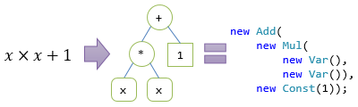
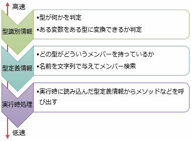

# is、switch の拡張 (型スイッチ)

## <a id="sec-generated-title-1"></a> <a id="abstract"></a>概要

<h5 class="version version7">Ver. 7</h5>

C# 7.0で、[`is`演算子](../oop/oo_polymorphism.md#downcast)や[`switch`ステートメント](../structured/st_branch.md#switch)の`case`が拡張されました。

C# 6.0 以前では以下のような仕様でした。

- `is`演算子 … `x is T` と言うように、型の判定だけができた
- `switch`ステートメントの`case` … `case` の後ろには定数だけが指定で来た

これに対して、C# 7.0 以降では、`is`、`case`の後ろに「パターン」を指定できます。
「パターン」の詳細については[次項](patterns.md)で別途説明する予定ですが、
簡単に概要だけ表にすると以下のようなものがあります。

| パターン | バージョン | 概要 | 例 |
| --- | --- | --- | ------------- |
| 型パターン | C# 7.0 | 型の判定 | `int i`、`string s` |
| 定数パターン | C# 7.0 | 定数との比較 | `null`、`1` |
| var パターン | C# 7.0 | 何にでもマッチ・変数で受け取り | `var x` |
| 破棄パターン | C# 8.0 | 何にでもマッチ・無視 | `_` |
| 位置パターン | C# 8.0 | [分解](deconstruction.md)と同じ要領で、再帰的にマッチングする | `(1, var i, _)` |
| プロパティ パターン | C# 8.0 | プロパティに対して再帰的にマッチングする | `{ A: 1, B: var i }` |

C# 7.0 時点では「型パターン」が主だった機能だったため、
`is`や`switch`の拡張を指して「型スイッチ」(type switch)と呼ばれたりもしました。

本項では、まずは`is`や`switch`がC# 6.0以前と比べてどう変わったかについて焦点を当てます。
例なども、主に型パターン(C# 7.0)で説明していきます。
パターン自体の詳細については次項の「[パターン マッチング](patterns.md)」を参照してください。

## <a id="sec-generated-title-2"></a> <a id="is"></a>is演算子の拡張

C# 7では、`is`演算子で以下のような書き方ができるようになりました。

```csharp
型を調べたい変数 is 型 新しい変数
```

(正確に言うと`is`の後ろに新たに書けるようになったのは「パターン」で、
これはそのうちの「型パターン」と呼ばれるものです。)

C# 6以前の`is`演算子は少し使い勝手が悪い面がありました。型の一致を判定するだけならいいんですが、
型変換も絡むといまいちです。

例えば、以下のように型を判定するだけなら`is`演算子の出番です。

```csharp
// 型判定のみなら、これまでの is 演算子でも十分
if (obj is string) Console.WriteLine("string");
```

ところが、型を判定したうえでダウンキャストしたいという場面では、以下のように、「2度手間」になって、コード量的にも実行効率的にもよくないです。

```csharp
// 型変換もしたい
if (obj is string)
{
    var s = (string)obj;
    //↑ isとキャストで2つの別命令を使う。二重処理になってるだけで無駄
    Console.WriteLine("string #" + s.Length);
}
```

結局、以下のように、`as`演算子を使うことが推奨されます。

```csharp
// 結局、as 演算子 + null チェックを使うことになる
var s = obj as string;
if (s != null)
{
    Console.WriteLine("string #" + s.Length);
}
```

これに対して、C# 7では、`is`演算子で以下のような書き方ができるようになりました。

```csharp
// C# 7での新しい書き方
if (obj is string s)
{
    Console.WriteLine("string #" + s.Length);
}
```

挙動的には、先ほどの`as`演算子を使ったものとまったく同じ挙動になります。
`is`演算子で型を判定しつつ(`bool`の戻り値を返しつつ)、その型への変換結果を新しい変数で受け取れます。

### <a id="sec-generated-title-3"></a> <a id="scope"></a>is演算子で宣言された変数のスコープ

`is`演算子の拡張によって、式の中で変数宣言ができるようになりました。
そこで問題になるのはこの変数のスコープです。

概ね、「その式を含むブロック内」と考えていいんですが、`if`や`while`などの中で使ったときなど、いくつか特殊な場合があります。
詳細については「[式の中で変数宣言](../start/st_scope.md#declaration-expressions)」を参照してください。

### <a id="sec-generated-title-4"></a> <a id="null-check"></a>is演算子によるnullチェック

元々の`is`演算子の仕様でもあるんですが、`null`には型がなくて常に`is`に失敗します(`false`を返す)。

```csharp
string x = null;

if (x is string)
{
    // x の変数の型は string なのに、is string は false
    // is 演算子は変数の実行時の中身を見る ＆ null には型がない
    Console.WriteLine("ここは絶対通らない");
}
```

この仕様は、C# 7からの新しい構文でも引き継いでいて、`null`じゃないときだけだけ何かの処理をしたいときに使えます。
と言っても、参照型の場合にはあまり使い道はありませんが、以下のような書き方ができます。

```csharp
static void F(string nullable)
{
    if (nullable is string nonNull)
    {
        // nonNull には絶対に null が入らない
        // nullable をそのまま使っても、if の結果、null じゃない保証があるのであまり意味はないけども
        Console.WriteLine(nonNull.Length);
    }
}
```

この書き方が役に立つのは、値型と[null許容型](../resource/sp2_nullable.md)を使う場合でしょう。
例えばC# 6以前だと、以下のような書き方になります。

```csharp
static void F(int? x)
{
    // C# 6以前の書き方
    if (x.HasValue)
    {
        // この「.GetValueOrDefault()」をいちいち書くのが結構うっとおしい
        // x * x だと、(x.HasValue & x.HasValue) ? (int?)(x.GetValueOrDefault() * x.GetValueOrDefault()) : null みたいなコードに展開されてしまう
        int n = x.GetValueOrDefault();
        Console.WriteLine(n * n);
    }
}
```

これが、C# 7で以下のように書けるようになります。

```csharp
static void F(int? x)
{
    if (x is int n)
    {
        Console.WriteLine(n * n);
    }
}
```

ただ、1つ注意が必要なのは、`is var` という似て非なる構文がある点です。
`is var` ([`var`パターン](patterns.md#var)と言って、[`is T`](patterns.md#declaration) とは別扱い)を使った場合、nullチェックはされません。
`var` は何でも受け取れる構文で、null も受け付けます。

ちなみに、C# 8.0 では、[再帰パターン](patterns.md#recursive)が暗黙的に null チェックも含んでいることを使って、手短に null チェックもできます
(参考: [非 null マッチング](patterns.md#non-null))。

```csharp
string s = null;
 
// 型を明示した場合、null にマッチしない
if (s is string) Console.WriteLine("ここは通らない");
 
// var パターンは何にでも(null 含む)マッチする
if (s is var _) Console.WriteLine("ここは通る");
 
// 再帰パターンで型を省略すると null チェックも含む
if (s is { }) Console.WriteLine("ここは通らない");
```

### <a id="sec-generated-title-5"></a> <a id="invariant-meaning"></a>余談: 変数の意味を変えない

プログラミング言語によっては、以下のように、`is`演算子で型を判定した後には、自動的にその型扱いしてくれる言語もあります。

```csharp
static void F(object obj)
{
    if (obj is string)
    {
        // この中では obj を string 扱いできる言語がある
        // C# ではコンパイル エラー
        Console.WriteLine("string #" + obj.Length);
    }
    else if (obj is int)
    {
        // 同上、int 扱いできる言語がある
        // C# ではコンパイル エラー
        Console.WriteLine("int " + (obj * obj));
    }
}
```

C# では、こういう、「`object`だと思っていたものが一定範囲でだけ別の型になる」というようなことはやらない方針です。

また、以下のように、同名の別変数を導入できる言語もありますが、こちらもC#では認めていません。

```csharp
static void F(object x)
{
    if (x is string x)
    {
        // 引数の x とは別に、is 演算子で別の「x」を導入できる言語もある
        // C# ではコンパイル エラー
        Console.WriteLine("string #" + x.Length);
    }
}
```

C#では、変数はスコープ内で意味不変(invariant meaning)であるべきという方針を持っています。
上記の2つの例では、`obj`や`x`が部分的に(`if`の中でだけ)別の意味になるので、C#としては認めたくないものになります。

<!-- original-page-break -->


## <a id="sec-generated-title-6"></a> <a id="switch"></a>switchステートメントの拡張

C# 7では、`switch`ステートメントの`case`句に、値だけでなく、パターンを書けるようになりました。
パターンの書き方は、前節の`is`演算子と同様です。
また、型による条件に加えて、`when`句というものを付けて追加の条件式を書くこともできます。

```csharp
switch(変数)
{
    case 型 変数:
        // 型が一致しているときにここに来る
        // その型に変換した結果が変数に入っている
        break;
    case 型 変数 when 条件式:
        // 型が一致していて、かつ、条件式満たしているときにここに来る
        break;
    case 値:
        // 通常の値による条件との混在も可能
        break;
      ・
      ・
      ・
    default:
        // どの条件も満たさない時に実行される
        break;
}
```

例えば以下のような書き方ができます。

```csharp
static void F(object obj)
{
    switch (obj)
    {
        case string s:
            Console.WriteLine("string #" + s.Length);
            break;
        case 7:
            Console.WriteLine("7の時だけここに来る");
            break;
        case int n when n > 0:
            Console.WriteLine("正の数の時にここに来る " + n);
            // ただし、上から順に判定するので、7 の時には来なくなる
            break;
        case int n:
            Console.WriteLine("整数の時にここに来る" + n);
            // 同上、0 以下の時にしか来ない
            break;
        default:
            Console.WriteLine("その他");
            break;
    }
}
```

### <a id="sec-generated-title-7"></a> <a id="sequential"></a>上から逐次判定

C# 6までの、値による分岐しかなかった`switch`ステートメントとはちょっと違う部分があります。
以下の点に気を付けてください。

- 条件の範囲が被る場合がある
  - 値による分岐の場合は、各 `case` がそれぞれ排他だった
  - 型による分岐が入ったことで、上記の例でいう `7` ⊃ `int`かつ正の数 ⊃ `int` のように、被りが起こり得る
- 条件は上から順に判定する
  - 被りがない場合なら順序を気にする必要はなかった
      - なので、「ジャンプ テーブル化」(後述)という最適化手法が使えていた
  - 型による分岐を1つでも含むと、この前提が崩れて、ジャンプ テーブル化できない(逐次判定しかしない)

ジャンプ テーブル化の説明のために、以下のような`switch`を考えましょう。

```csharp
switch(n)
{
    case 0: return "zero";
    case 1: return "one";
    case 2: return "two";
    case 3: return "three";
    case 4: return "four";
    case 5: return "five";
    case 6: return "six";
    case 7: return "seven";
    case 8: return "eight";
    case 9: return "nine";
    default: return "other";
}
```

こういう`switch`であれば、以下のように、辞書を引いて結果を得ることもできるはずです。

```csharp
var map = new Dictionary<int, string>
{
    { 0, "zero" },
    { 1, "one" },
    { 2, "two" },
    { 3, "three" },
    { 4, "four" },
    { 5, "five" },
    { 6, "six" },
    { 7, "seven" },
    { 8, "eight" },
    { 9, "nine" },
};

string s;
if (map.TryGetValue(n, out s)) return s;
else return "other";
```

`case`の個数が少ないうちは普通に上から順に等値判定していく方が軽いんですが、
`case`数が増えれば増えるほど、辞書化した方が有利になります。

そこで、C# の`switch`ステートメント(というか、.NETの中間言語の`switch`命令)では、`case`の数が多い場合にこういう辞書を使った最適化を行うようになっています。
正確にいうと、辞書の値は条件分岐によるジャンプ先が入っていて、`goto`的な命令との組み合わせで実現されます。
そこで、「ジャンプ先のテーブルを引く」という意味で「ジャンプ テーブル化」と呼ばれます。

繰り返しになりますが、`case`に型による条件を書いてしまうと、こういうジャンプ テーブル化ができなくなります。
というより、コンパイル結果的には`switch`命令が使えず、`if-else`を繰り返すようなコードにコンパイルされます。
上から順に逐次判定になるので、`case`数があまりにも多いと実行性能的にあまりよくないので注意してください。

また、上の方の`case`にあるほど判定が速いことになります。
以下のように、一番上の`case`と一番下の`case`では、かなりパフォーマンスに差が出ます。
(なので、パフォーマンスが気になるなら、発生頻度が高いものほど上の方に書く必要があります。)

```csharp
using System;
using System.Diagnostics;

class Program
{
    static void Main()
    {
        var sw = new Stopwatch();

        // bool 型は一番先頭 = 速い
        object t = true;
        sw.Start();
        for (int i = 0; i < 100000; i++) TypeSwitch(t);
        sw.Stop();
        Console.WriteLine("bool   " + sw.Elapsed); // かなり速いはず

        // double 型は一番末尾 = 遅い
        object d = 1.1;
        sw.Restart();
        for (int i = 0; i < 100000; i++) TypeSwitch(d);
        sw.Stop();
        Console.WriteLine("string " + sw.Elapsed); // 手元の環境では5倍くらい遅かった

        // どの case にもない型。default 句に行く
        var s = DateTime.UtcNow;
        sw.Restart();
        for (int i = 0; i < 100000; i++) TypeSwitch(s);
        sw.Stop();
        Console.WriteLine("string " + sw.Elapsed); // 一番最後まで判定するので遅い
    }

    static int TypeSwitch(object x)
    {
        switch (x)
        {
            default: return -1; // ちなみに、default 句はどこに書こうと必ず一番最後
            case bool _: return 0; // 前から順に判定ということは、bool の時が一番早い
            case sbyte _: return 1;
            case byte _: return 2;
            case short _: return 3;
            case ushort _: return 4;
            case int _: return 5;
            case uint _: return 6;
            case long _: return 7;
            case ulong _: return 8;
            case float _: return 9;
            case double _: return 10; // 逆に double の時は凄く遅い
        }
    }
}
```

ちなみに、この例でも書いてありますが、逐次判定になっていたとしても`default`句にたどり着くのは必ず一番最後です。

<!-- original-page-break -->


## <a id="sec-generated-title-8"></a> <a id="usage"></a>型スイッチ(switch を使ったパターン マッチング)の用途

型によって分岐する方法としては、[仮想メソッド](../oop/oo_polymorphism.md#virtual)を使う方法があります。
オブジェクト指向プログラミング言語としては、仮想メソッドが相当に便利で、実行性能もよく、こちらが好まれます。
極端な意見では、「型を調べたら負け」、「[ダウンキャスト](../oop/oo_polymorphism.md#downcast)が必要なのは筋が悪い」という人すらいます。

ここでは、この仮想メソッドと、本稿の主題である型スイッチの使い分けについて説明します。

例として、以下のようなクラス階層を考えます。

```csharp
public abstract class Node { }

public class Var : Node { }

public class Const : Node
{
    public int Value { get; }
    public Const(int value) { Value = value; }
}

public class Add : Node
{
    public Node Left { get; }
    public Node Right { get; }
    public Add(Node left, Node right)
    {
        Left = left;
        Right = right;
    }
}

public class Mul : Node
{
    public Node Left { get; }
    public Node Right { get; }
    public Mul(Node left, Node right)
    {
        Left = left;
        Right = right;
    }
}
```

説明都合で簡素化していますが、数式を扱うようなクラスです。
要するに、例えば、「<math xmlns="http://www.w3.org/1998/Math/MathML"><mi>x</mi><mo>×</mo><mi>x</mi><mo>+</mo><mn>1</mn></math>」というような式を、以下のようなコードで表すためのクラスです。

```csharp
var expression = new Add(
    new Mul(
        new Var(),
        new Var()),
    new Const(1));
```



これに対して、「変数<math xmlns="http://www.w3.org/1998/Math/MathML"><mi>x</mi></math>の値を与えて、式の計算結果を得る」というようなメソッドを、仮想メソッドと型スイッチの両方で作ってみましょう。

まず、仮想メソッドなら以下のようになるでしょう(必要な部分だけを抜き出してあります)。

```csharp
abstract class Node
{
    public abstract int Calculate(int x);
}

class Var
{
    public override int Calculate(int x) => x;
}

class Const
{
    public override int Calculate(int x) => Value;
}

class Add
{
    public override int Calculate(int x) => Left.Calculate(x) + Right.Calculate(x);
}

class Mul
{
    public override int Calculate(int x) => Left.Calculate(x) * Right.Calculate(x);
}
```

一方、型スイッチを使って書くなら以下のようになります。

```csharp
public static class NodeExtensions
{
    public static int Calculate(this Node n, int x)
    {
        switch (n)
        {
            case Var v: return x;
            case Const c: return c.Value;
            case Add a: return Calculate(a.Left, x) + Calculate(a.Right, x);
            case Mul m: return Calculate(m.Left, x) * Calculate(m.Right, x);
        }
        throw new ArgumentOutOfRangeException();
    }
}
```

それぞれ、以下のような特徴があります。

- 性能:
  - 〇 仮想メソッドはかなり実行性能がいい
  - × 型スイッチでは性能面はかなわない
- 実装の強制
  - 〇 仮想メソッドなら、抽象メソッドにしておけば派生クラスでの実装漏れがあり得なくなる
  - × 型スイッチの場合、`case`への追加忘れがあり得る
- 実装を書ける場所
  - × 仮想メソッドはクラスの中にないとダメ
  - 〇 型スイッチなら拡張メソッドなど、クラスの外でも使える

基本的にはやっぱり仮想メソッドの方が性能・使い勝手の面で良かったりします。
ただ、仮想メソッド最大の問題は、クラスの中に書くのが必須ということです。
どうしてもクラスの中には書けない(クラスの作者自身が書けず、第三者が書く必要がある)場合というのはあって、
この場合は型スイッチを使う必要があります。

クラスの中に書くということは、そのクラスを使いたい人なら誰でも使うような汎用的な機能なはずです。
仮想メソッドはそういう汎用的な機能にしか使えないということになります。

一方で、使う人それぞれの固有の事情であれば、使う人の側が自分で書くことになるでしょう。

例えば、表示要件を考えてみます。
あるアプリでは、「`x * x + 1`」というように、プログラミング言語によくあるように、掛け算を`*`で表して文字列化したいかもしれません。
またあるアプリでは、「<math xmlns="http://www.w3.org/1998/Math/MathML"><mi>x</mi><mo>×</mo><mi>x</mi><mo>+</mo><mn>1</mn></math>」というように、ちゃんと数式フォントで、掛け算には×記号を使って表示したいかもしれません。
数式表示のためには、自前でレンダリングを行うべきかもしれませんし、
「`<math><mi>x</mi><mo>×</mo><mi>x</mi><mo>+</mo><mn>1</mn></math>`」というようなMathML文字列を作って、これを何らかのライブラリに解釈してもらうのがいいかもしれません。

数式データを使う用途もアプリごとに変わってくるでしょう。
あるアプリでは、数式を組版して表示すること自体が目的かもしれません。
またあるアプリでは、数式を微分したり方程式の解を求めたり、数学計算のために使うかもしれません。
あるいは、プログラミング言語を作っていて、式を計算するCPU命令を出力するための中間形式として使うかもしれません。

こういう、クラス作者側では用途が見えないものは、型スイッチを使って書くことになります。

### <a id="sec-generated-title-9"></a> <a id="performance"></a>補足: 型スイッチの性能

仮想メソッドと比べると遅いという話をしましたが、これは、仮想メソッドが性能よすぎるだけで、
型スイッチもそこまでひどい性能ではありません。
先ほどの`Calculate`の例でいうと、大まかに計測したところ4倍程度の差でした。

「型を見る」というと、[リフレクション](../dynamic/sp_reflection.md)を想像する人がいるようです。
リフレクションを使う場合、確かに、2・3桁(2・3倍じゃなくて、桁が変わる)遅くなる場合があります。
しかし、型スイッチに必要なのは「その型に代入できるかどうか」だけで、これはそこそこ高速な処理です。
リフレクションで遅いのは、「ある型がどういうメンバーを持っているか調べる」であるとか、
「メソッド名を文字列で渡してメソッドを探して、そのメソッドを実行する」であるとかです。

要するに、リフレクションで取れる型情報や、それの使い方には何段階かあって、それぞれ負荷の度合いも変わります。



型識別だけなら大したコストは掛かりません。そして、型スイッチが使うのはこの型識別情報だけです。

むしろ、型スイッチの遅さの原因は、
[前項](#sequential)で説明したような、逐次判定のせいです。
上から1つ1つ`case`の条件判定しているので、平均的には`case`の数に比例した処理量が必要になります。


<!-- original-page-break -->


## <a id="sec-generated-title-10"></a> <a id="generic-type-switch"></a>余談: ジェネリック型に対する型パターン

<h5 class="version version7_1">Ver. 7.1</h5>

C# 7.0の時点では、[ジェネリクス](../oop/sp2_generics.md)が絡む場合、
例えば以下のようなコードはコンパイル エラーになっていました。
(ジェネリックな型`T`の変数に対して`switch`できない。ちなみに、一度`object`にキャストすればできる。)

```csharp
static void M<T>(T x)
{
    switch (x)
    {
        case int i:
            break;
        case string s:
            break;
    }
}
```

「`T`を`int`や`string`として処理できない」と言った旨のコンパイル エラーが出ます。

さらにいうと、以下のような需要が結構ありそうな場面でも、C# 7.0ではコンパイル エラーになりました。

```csharp
class Base { }
class Derived1 : Base { }
class Derived2 : Base { }
class Derived3 : Base { }

// こういう、型制約付きのやつですら 7.0 ではダメだった
static void N<T>(T x)
    where T : Base
{
    switch (x)
    {
        case Derived1 d:
            break;
        case Derived2 d:
            break;
        case Derived3 d:
            break;
    }
}
```

C# 7.0でも、以下のように、`as`演算子を使った場合にはちゃんとコンパイルできます。
型パターンは、内部的には`as`演算子に展開される機能で、`as`演算子にできて型パターンにできないことがあるのは不自然です。

```csharp
static void N<T>(T x)
    where T : Base
{
    { var d = x as Derived1; if (d != null) { return; } }
    { var d = x as Derived2; if (d != null) { return; } }
    { var d = x as Derived3; if (d != null) { return; } }
}
```

そこで、C# 7.1では、上記コードのような、ジェネリックな型に対する型パターンを使えるようになりました。
(新機能というよりは、仕様漏れ・バグ修正の類です。)

## <a id="sec-generated-title-11"></a> <a id="generic-is-null"></a>余談: ジェネリック型に対する is null

<h5 class="version version8">Ver. 8.0</h5>

C# 8.0 から、
以下のコードがコンパイルできるようになりました。

```csharp
static bool M<T>(T x) => x is null;
```

元々 `x == null` であればコンパイルできていたのに、`x is null` がコンパイルできないのは変だということで修正されました。
型引数 `T` が[非 null 値型](../resource/sp2_nullable.md#non-nullable)の時には常に false になります。


<!-- original-page-break -->


## <a id="sec-generated-title-12"></a> <a id="switch-expression"></a>switch 式

<h5 class="version version8">Ver. 8.0</h5>

C# 8.0 では、`switch` の[式](../structured/miscexpressions.md#term)版が追加されました。
式なので戻り値が必須ですが、どこにでも書けて便利です。
また、従来の `switch` ステートメントは C# の前身となるC言語のものの名残を強く残し過ぎていて使いにくいものでしたが、その辺りも解消されて使いやすくなりました。

例えば、以下のような列挙型を使った分岐を考えてみます。

```csharp
using static 年号;
 
enum 年号
{
    明治, 大正, 昭和, 平成
}
```

これまでだと、以下のような書き方をせざるを得ないことがあったかと思います。

```csharp
public void M(年号 e)
{
    int y;
    switch (e)
    {
        case 明治:
            y = 45;
            break;
        case 大正:
            y = 15;
            break;
        case 昭和:
            y = 64;
            break;
        case 平成:
            y = 31;
            break;
        default: throw new InvalidOperationException();
    }
    // y を使って何か
}
```

こういう書き方は結構しんどいわけですが、しんどい理由は以下のような点にあります。

- それぞれの条件で1つずつ値を返したいだけなのにステートメントを求められる
- `break` が必須
- `case` ラベルもうざい

ちょこっとごまかす方法として、以下のように別メソッドを1段挟む方法もあるにはありますが、相変わらず`case`や`return`がうっとおしいです。

```csharp
public void M(年号 e)
{
    int lastYear()
    {
        switch (e)
        {
            case 明治: return 45;
            case 大正: return 15;
            case 昭和: return 64;
            case 平成: return 31;
            default: throw new InvalidOperationException();
        }
    }
 
    var y = lastYear();
    // y を使って何か
}
```

これは、C# 8.0 の `switch` 式を使うと、以下のように書き直すことができます。

```csharp
public void M(年号 e)
{
    var y = e switch
    {
        明治 => 45,
        大正 => 15,
        昭和 => 64,
        平成 => 31,
        _ => throw new InvalidOperationException()
    };
    // y を使って何か
}
```

文法的には以下のようになります。

```csharp
変数 switch
{
    パターン1 => 式1,
    パターン2 => 式2,
      ・
      ・
      ・
}
```

ステートメントの方の`switch`との弁別のために、`switch`キーワードは後置きになっています。

最後の1個のコンマはあってもなくてもかまいません。
[配列](../structured/st_array.md)や[オブジェクト初期化子、コレクション初期化子](../functional/sp3_lambda.md#init)と同様です。

パターンの部分には「[パターン マッチング](patterns.md)」で説明している任意のパターンを書けます。
また、[`when`句](#switch)を付けることもできます。

```csharp
static int M(object obj) => obj switch
{
    int x when x > 0 => 1,
    int _ => 2,
    _ => 3,
};
```

### <a id="sec-generated-title-13"></a> <a id="switch-priority"></a>switch 式の優先度

`switch` 式の優先度は単項演算の下、乗除演算の上になります。
`++x` や `await x` は `switch` 式よりも先に評価されて、
`x * y` や `x + y` は `switch` 式よりも後に評価されます。

```csharp
// これは (await b) switch { ... } の意味になって、
// bool を await できないのでコンパイル エラー。
static async Task M1(bool b, Task x, Task y)
    => await b switch { true => x, false => y };
 
// これは (++x) switch { ... } の意味で、
// x に -1 を渡した時だけ false に。
static bool M2(int x)
    => ++x switch { 0 => false, _ => true };
 
// これは y * (switch { ... }) の意味で、
// 0 か y が返る。
static int M2(int x, int y)
    => y * x switch { 0 => 0, _ => 1 };
```

### <a id="sec-generated-title-14"></a> <a id="exhaustive"></a>網羅性

式であるからには、`switch` 式は必ず値を返す必要があります。
なので、パターンには網羅性(exhaustiveness)が求められます。
すなわち、「どのパターンも満たさず`switch`式を抜けてしまう」みたいな状態は許容されません。
ちゃんと C# コンパイラーが網羅性をチェックしていて、抜けがあるとコンパイル エラーになります。

多くの場合、末尾に[`var`パターン](patterns.md#var)か[破棄パターン](patterns.md#discard)を書いて漏れを防ぎます。

```csharp
static int M(int x) => x switch
{
    1 => 2,
    2 => 4,
    _ => 8, // 破棄パターンで「残り全部」を受付
};
 
static int M(object x) => x switch
{
    int i => i,
    string s => s.Length,
    var other => other.GetHashCode(), // var パターンで「残り全部」を受付
};
```

今のところ、`bool`だけは網羅性を確実にチェックできます。

```csharp
static int M(bool x) => x switch
{
    true => 1,
    false => 0,
    // true/false で全パターン網羅できているので _ とかは不要
};
 
static int M(bool x, bool y) => (x, y) switch
{
    (false, false) => 0,
    (true, false) => 1,
    (false, true) => 2,
    (true, true) => 4,
    // 上記4パターンしかありえないので _ とかは不要
};
```

将来的には、`enum`型の網羅性や、派生クラスの網羅性もチェックしたいそうですが、
「後からのメンバー追加に弱くなる」など課題があるため、実装されるかどうかは不明瞭です。

#### <a id="sec-generated-title-15"></a> <a id="bool-exhaustiveness"></a>余談: bool の網羅性

前節の`switch`式の網羅性チェックと関連して、ステートメントの方の`switch`でも、`bool`の網羅性チェックが働くようになりました。
C# 8.0 前後で挙動が変わるのでご注意ください。

すなわち、以下のような`switch`ステートメントを書いたとき、`default`句に関する扱いが変わります。

```csharp
static int M(bool b)
{
    switch (b)
    {
        case false: return 0;
        case true: return 1;
        default: return -1;
    }
}
```

- C# 7.3 以前: `default` が必須
- C# 8.0 以降: `default` が要らないというか、むしろ書くと警告(絶対に来ない条件があるという扱い)

C# 7.3 以前がどうしてそうなっていたかは以前ブログを書いたのでそちらを参照してください: 「[bool 型の false, true, それ以外](../../../blog/2019/1/falsetrueother/index.md)」。

### <a id="sec-generated-title-16"></a> <a id="target-typed"></a>ターゲットからの型決定

`switch` 式にはターゲットからの型推論が働きます。

ここでいうターゲットというのは結果を渡す先のことで、例えば以下のような書き方をした場合、
null を渡す先が `int?` 型の変数なので、この `int?` が「ターゲットの型」になります。

```csharp
int? x = null;
```

`switch` 式では、いろいろな条件でいろいろな値を返すわけですが、
値から「共通の型」を決定できない場合があります。
例えば、以下のように、(例え同じクラスから派生していたとしても)異なる型 `A` と `B` の「共通の型」は判定できず、
コンパイル エラーを起こします。

```csharp
class Base { }
class A : Base { }
class B : Base { }
 
static object M(int i)
{
    // 値が A と B で違う型なので、switch 式が返す型を決定できない。
    // コンパイル エラーになる。
    var x = i switch
    {
        0 => new A(),
        _ => new B(),
    };
 
    return x;
}
```

これくらいならば `Base` が共通の型だと判定してほしくも思いますが、
多段派生していたり、インターフェイスも実装していたり複雑な場合のことを考えるとそんなに簡単な話ではありません。

```csharp
// 型 D と F の「共通型」といわれると何？
// インターフェイス J？ それともクラス A？
interface I { }
interface J { }
class A { }
class B : A, I { }
class C : A { }
class D : B, J { }
class E : B { }
class F : C, J { }
```

この問題の回避策は2つあって、1つは特に難しいこともなく、「[キャスト](../start/st_cast.md#cast)しろ」というものです。
C# コンパイラーが理解できるところまでかみ砕いたコードを書いてあげなきゃいけないということで、ちょっと煩雑なコードになります。

```csharp
// 片方を既定型にキャストしておくことで「共通型は Base」と判定できるようになる
var x = i switch
{
    0 => (Base)new A(),
    _ => new B(),
};
```

もう1つが本節の主題の「ターゲット型からの型決定」です。
先ほどの例では左辺が `var` (型推論)なのでコンパイルできませんが、
以下のように、ターゲット側の型を明示することで、`switch` 式の側の型を `Base` に決定できます。

```csharp
// 左辺(Base 型の変数)から switch 式の型を Base に決定。
// コンパイルできるようになる。
Base x = i switch
{
    0 => new A(),
    _ => new B(),
};
```

特に役立つのは「1 と null」(`int?` になってほしい)とかでしょう。

```csharp
static void M(bool b)
{
    // これはコンパイル エラー。1 と null の共通型は C# 8.0 時点では決定できない。
    var x = b switch { true => 1, _ => null };
 
    // これはコンパイルできる。ターゲット型から int? に決定済みなので、1 も null も受け付ける。
    int? y = b switch { true => 1, _ => null };
}
```
