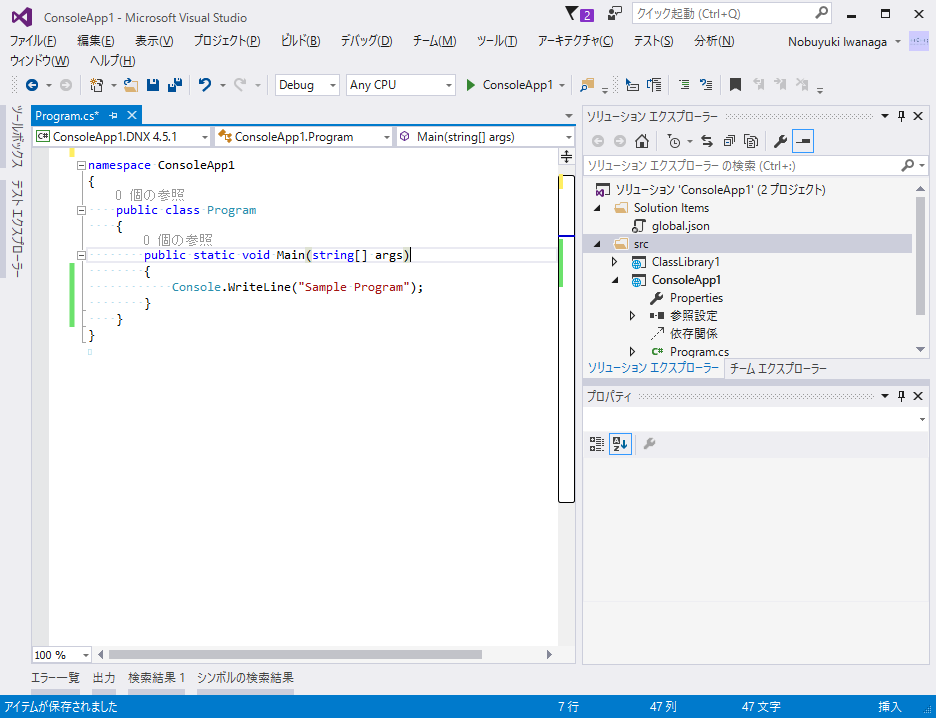
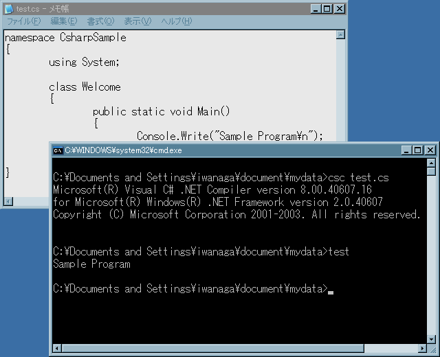

# C# 開発環境

## 概要
C# でプログラミングを行うためには、コンパイラーだけ入手してテキスト エディターで開発する方法と、
統合開発環境を利用する方法があります。

※ 単に「エディター」と呼ばれているアプリでも、最近のものは拡張機能をインストールすることで高度な機能を持てる物が多いです。
中には統合開発環境に迫るくらいの機能のものもあります。

※ とりあえず、説明はいいから速く C# を触りたいという人向けリンク:

- オンラインでも試せます: [try.dot.net](http://try.dot.net)
- Windows な人: [Visual Studio (for Windows)](https://visualstudio.microsoft.com/)
- Mac な人: [Visual Studio for Mac](https://visualstudio.microsoft.com/vs/mac/)
- その他、あるいは、クロスプラットフォームで開発をしたい人: [Visual Studio Code](https://code.visualstudio.com/)

## 統合開発環境(IDE)
統合開発環境(Integrated Development Environment、略してIDE)は、
ソースコードの編集、コンパイル、デバッグなど、プログラム作成に必要な機能を統合的に提供するGUIプログラムです。
概ね、以下のようなことができます。

- コード ハイライト: 予約語や型名、文字列など、プログラム的に意味のある部分を色付けしてソースコードを見やすくする
- コード補完: 今カーソルがある位置にどういうものが書けるか、型名やメソッド名などの候補を出す
- エラーの指摘: C#の場合は、ソースコードを書いたそばから文法チェックが走り、リアルタイムにエラーを指摘してもらえます
- デバッグ実行:
  - ブレイク ポイント: プログラムが指定した場所まで来たら、処理を一時停止して、その時点の変数の中身などを覗けます
  - ステップ実行: ソースコードを1行1行実行しつつ、その時点の変数の中身などを覗けます
- パッケージ化: プログラムを配布可能な状態にパッキングします

### Visual Studio
Visual Studioは、Windows専用ではありますが、古くからある高機能なIDEです。

- 公式ページ: [Visual Studio](https://visualstudio.microsoft.com/)

Windowsを開発機として使えるならば、第一に考えるべき選択肢でしょう。
プロ向けの製品プランであるVisual Studio ProfessionalやVisual Studio Enterpriseはそこそこの値段がしますが、
人件費と比べれば安いものです。

<figure>
	
	<figcaption>Visural Studio でプログラミング（画像は 2015 のもの）</figcaption>
</figure>

Visual Studioには無償版もあります。
無償版には、歴史的経緯から、Visual Studio CommunityとVisual Studio Expressの2系統あります。
(これから始めるのであれば Community の方を使います。)

| 製品プラン | 有償/無償 | 概要 |
| --- | --- | --- |
| Enterprise | 有償 | 最上位グレードで、お値段も張ります。大規模チーム開発に必要な機能や、最新の機能はまずEnterpriseにのみ追加されます。 |
| Professional | 有償 | 個人開発や小規模開発ならば十分な程度の機能を提供しています。 |
| Community | 無償 | オープンソースへの貢献か、一定規模以下のビジネスにだけ使える無償プラン。ビジネス規模の制限は結構きついので、ほぼ非商用利用向けです。その代わり、使える機能はProfessional並みです。 |
| Express | 無償 | 商用利用制限がない代わりに機能制限があります。今はCommunityへの移行をしてほしいようで、大々的なリンクは消えていて「探せばまだ見つかる」というような状態です。 |

ちなみに、学生や、スタートアップ企業の場合は、有償のマイクロソフト製品を無償で使うことができるプランがあります。

- [DreamSpark](https://www.dreamspark.com/): 学生であることを証明できる書類があれば入れます。
- [BizSpark](https://www.microsoft.com/ja-jp/ventures/BizSpark.aspx): 企業5年未満、非上場、かつ、年商100万ドル未満の会社であれば入れます。

#### 補足: Visual Studioブランド
後述する Visual Studio Code など、名前に「Visual Studio」と入っていますが、これまでの Visual Studio とは別物の製品があります。
最近では、マイクロソフトは「Visual Studio」という名前をマイクロソフト製の開発ツール全般を指すブランド名にしたいようです。
例えば、以下のようなものも前節の Visual Studio とは別物です。

- [Visual Studio Team Services](https://azure.microsoft.com/services/visual-studio-team-services/)
- [Visual Studio for Mac](https://visualstudio.microsoft.com/vs/mac/)

これらと区別するために、前節の意味での Visual Studio は、「Visual Studio for Windows」と言ったりもするようになりました。

### その他
- [MonoDevelop](http://www.monodevelop.com/): クロスプラットフォームIDE。
- [Xamarin Studio](https://xamarin.com/studio): 中身はMonoDevelopと一緒というか、MonoDevelop + iOS/Android開発プラグインみたい。
  - Visual Studio for Mac も、中身は Xamarin Studio (= MonoDevelop ベース)
- JetBrains [Project Rider](http://blog.jetbrains.com/dotnet/2016/01/13/project-rider-a-csharp-ide/): まだ発表されたばかりだけども。IntelliJ等で有名なJetBrains社が、クロスプラットフォームなC#向けIDEを開発。

(他にもいいものがあれば随時更新)

## テキスト エディターと拡張機能
Visual Studio (for Windows)くらい「全部入り」な IDE だと、インストールや起動が重くて嫌という人もいると思います。
なので、単に「テキストを編集する」用途の場合、テキスト エディターと呼ばれるようなもっとシンプルなアプリを使うことが多いでしょう。

そして、普段使い慣れているテキスト エディターで、そのまま開発作業もしたいという要望もあります。
最近のテキスト エディターは拡張機能が充実していて、開発支援用の拡張もいろいろ提供されています。

### Visual Studio Code
Visual Studio Codeは、クロスプラットフォームで動く開発ツールです。

- 公式ページ: [Visual Studio Code](https://code.visualstudio.com/)

拡張機能を入れていない状態だと非常にコンパクトなので「エディター」の範疇でも使われます。
C# 向けの拡張機能をインストールすることで、前述のコード補完やデバッグ実行なども使えます。

### その他
- [OmniSharp](http://www.omnisharp.net/): EmacsやSublime Text向けの、C#開発支援プラグイン。

(他にもいいものがあれば随時更新)

## コマンド ライン ツール
プログラミングには IDE や、拡張機能が充実しているエディターが必須というわけではありません。

本当に「プレーンなテキストを打ち込む」という機能しか持たないエディターで編集したC#ソースコードを、コマンド ラインから実行することもできます。

また、普段の開発ではIDEを使うにしても、時折、IDEをインストールしていないマシンでコンパイルを行いたくなることもあるでしょう。例えば、以下のような用途があります。

- [CI](https://ja.wikipedia.org/wiki/%E7%B6%99%E7%B6%9A%E7%9A%84%E3%82%A4%E3%83%B3%E3%83%86%E3%82%B0%E3%83%AC%E3%83%BC%E3%82%B7%E3%83%A7%E3%83%B3)ビルドで、コミットごとにとか、日に1回特定の時刻にとか、自動ビルドしたい
- サーバーにリモート ログインして、[GitHub](https://github.com/)などからソースコード一式をダウンロードして、それをコンパイルして実行したい

### dotnet コマンド
.NET Core(オープンソース開発されているクロスプラットフォーム向け.NET)では、dotnetコマンドという便利なコマンド ライン ツールを提供しています。

dotnetコマンドという1つのコマンドだけで、C#でのプログラミングに必要な機能が一通り提供されています。
dotnet コマンドは以下のページからインストールできます。

[http://dotnet.github.io/getting-started/](http://dotnet.github.io/getting-started/)

dotnetコマンドは、今のところ(2016年1月時点)、Windows、Ubuntu、OS X用のインストーラーと、[Docker](https://www.docker.com/)コンテナーが提供されています。

![dotnetコマンド(1)][1]
![dotnetコマンド(2)][2]

### C#コンパイラーとMSBuild
旧来のWindows向け.NET Frameworkでも、C#のコンパイラーだけであれば無償で使えていました。

Visual Studioに無償版がなかったころでも、やろうと思えば無償でC#プログラミングは可能でした。

<figure>
	
	<figcaption>メモ帳でプログラミング</figcaption>
</figure>

C#コンパイラーは、昔は.NET Framework（開発者向けの SDK ではなく、アプリケーション機能に必要なランタイムのみでも）に付属していました。`Windows`のシステム フォルダー直下に`Microsoft.NET`というフォルダーができているはずなので、その中をC#コンパイラーの実行ファイル名である`csc`で検索すれば見つかるでしょう。

今は、[Microsoft Build Tools](https://www.microsoft.com/ja-JP/download/details.aspx?id=48159)に付属しています。
Microsoft Build Toolsは、Visual Studioから、コマンド ライン ビルドに必要なツールを抜き出したもので、無償で手に入ります。
インストール先は`Programs Files`直下にできる`MSBuild`というフォルダーで、この中に`csc`も入っています。

  [1]: ../../../../assets/media/1061/dotnetcli1.png
  [2]: ../../../../assets/media/1062/dotnetcli2.png
