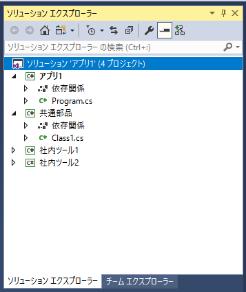

# プロジェクト管理

##  概要

Visual Studio で C# を使ったプログラム開発を行う場合、まず、「プロジェクト」というものを作ります。
また、この際、「ソリューション」というものが一緒に作られます。

ここでは、そのプロジェクトの作り方の簡単な紹介と、プロジェクトやソリューションが何なのか、どうして必要なのかを説明します。

##### ポイント

- プロジェクト: 1つのプログラムを作るのに必要な各種ファイルを管理するもの
- ソリューション: 1つの課題を解決するのに必要な一連のプロジェクト(≒ プログラム)を管理するもの

ちなみに、プログラムを作るのにどうして「プロジェクト」という単位が必要になるのかや、
どういう単位で「プロジェクト」を区切るのかなどは
「[プロジェクトの分割](../package/project.md)」で説明します。

##  プロジェクトの作成

プロジェクトやソリューションの説明は次節以降でしますが、まずは、そのプロジェクトの作り方を簡単に紹介します。
(※ここでは、Visual Studio 2015を使ってスクリーンショットを撮っています。他のバージョンでもそれほど大きな違いはありません。)
Visual Studio を起動すると以下のような画面になっていると思います。

![Visual Studio 起動直後][1]

ここで、「スタート」→「新しいプロジェクト」を選ぶと、以下のようなダイアログが表示されます。

![「新しいプロジェクト」で「プロジェクト テンプレート」を選択][2]

この中から、作りたいプログラムの種類に応じた「プロジェクト テンプレート」(後述)を選びます。

この「C# によるプログラミング入門」での説明の多くは「コンソール アプリケーション」で動きます。ここでも「コンソール アプリケーション」を選びます。通常は、「名前」のところには作りたいプログラムの名前に応じた適切な名前を入力します。今回はとりあえず、最初から入っている「ConsoleApplication1」という名前のままでプロジェクトを作ってみましょう。これで、以下のような画面になるはずです。

![プロジェクト作成直後][3]

これで、プログラム作成に必要な最低ラインの準備が整いました。ちなみに、この時点で(プロジェクトの新規作成をしただけで)、ソリューションというものも一緒に作られています。
 以降では、ここで出てきた「プロジェクト」「ソリューション」「プロジェクト テンプレート」などの言葉について説明していきます。

##  プロジェクトとは

 プログラムの作成・実行 で説明するように、ソースコードをコンパイルすることでプログラムを作ります。
通常、ソースコードは切りのいい単位ごとに別ファイルに分けて作るので、プログラムの作成には複数のソースコード ファイルが必要になります。
また、プログラムの種類によっては、ソースコード以外にも画像や音声など、様々な素材（アセット(asset)と呼んだりします）が必要です。

これら、プログラムを作るのに必要なファイルを管理するのがプロジェクトです。
例えば、下図の場合、ConsoleApplication1 という名前のプロジェクトに、App.config、Logic.cs、Program.cs という3つのファイルが管理されています。

![enter image description here][4]

その他、C#のプロジェクトでは以下のようなものを管理します。

- ライブラリ の参照
- コンパイル オプション(プログラム名、C# のバージョンや、コンパイル時の警告の厳しさなど)の設定
- プログラムの種類によっては、インストーラー作成や、サーバーやストアへのアップロード方法などの設定

##  ソリューションとは

何かやりたいこと(課題)があるからプログラムを作るはずです。
そしてそのやりたいことの実現(解決)には、1つのプログラムではなく、複数のプログラムを作る場合があります。
あるいは、それらのプログラムから共通利用する「部品」も必要になったりします。

このような、やりたいことを実現(課題を解決)するために必要な複数のプログラムや部品(その1つ1つがプロジェクトとして管理される)を束ねるのがソリューション(solution: 解決策)です。

 以下の図は、例として、「アプリ1」「社内ツール1」「社内ツール2」という3つのプログラムと、この3つから使う「共通部品」という、合わせて4つのプロジェクトを作った例です。
この3つのプロジェクトを管理するのが「アプリ1」ソリューションです。

ソリューション内には、プロジェクト間の依存関係などが記録されています。

##  プロジェクト テンプレート

 プログラムに必要なソースコードなどのファイルは、どんなプログラムでも同じなような必要最低限のものであっても、結構な分量があります。
どんなプログラムでもだいたい同じになるなら、最初からひな形を用意しようというのが、プロジェクト テンプレート(project template: プロジェクトのひな形)です。

いくつか紹介しましょう。

<table>
<tr>
<th>テンプレートの種類</th><th>説明</th>
</tr>
<tr>
<td>コンソール アプリケーション</td>
<td>“古き良き”文字だけのプログラムのことをコンソール アプリケーション(console application: console は操作卓という意味。昔はコンピューターをキーボードからの文字入力だけで操作していたのの名残)といいます。</td>
</tr>
<tr>
<td>ASP.NET Web アプリケーション</td>
<td>Web アプリを作ります。ASP.NET は、C#でWebアプリを作るためのフレームワークの名前です。</td>
</tr>
<tr>
<td>Blank App (Windows Universal)</td>
<td>(Windows 10以降用の)Windows GUIアプリを作ります。C#でGUIアプリを作るためのフレームワークは、詳細は省きますが、歴史的経緯で、他にも WPF、Windows Formsなどたくさんあります。</td>
</tr>
</table>

とにかく習うより慣れろで見た目に面白いものや、実用的なものを作りたいという方は、Web アプリや GUI アプリから始めるのもいいでしょう。

 作るのが簡単なのはコンソール アプリです。
このサイトでは、C# というプログラミング言語や、プログラミングに関する概念的な説明が主題なので、ほとんどのサンプルがコンソール アプリになっています。

その他にもいろんな種類のテンプレートが用意されています。例えば、Visual Studio 2015では、iOSやAndroidなど、マイクロソフト以外の製品向けのアプリ開発ができるテンプレートも用意されています。選べるプログラミング言語も、C#の他、C++、Visual Basic、JavaScript、TypeScriptなどたくさんあります。Visual Studioが標準で用意しているものの他にも、拡張機能(いろんな会社から、商用・非商用問わずたくさん出ています)を入れることでより多くのテンプレートを利用できます。

  [1]: ../../../../assets/media/1002/newproject1.png
  [2]: ../../../../assets/media/1003/newproject2.png
  [3]: ../../../../assets/media/1005/newproject3.png
  [4]: ../../../../assets/media/1001/project1.png
  [5]: ../../../../assets/media/1006/solution1.png
