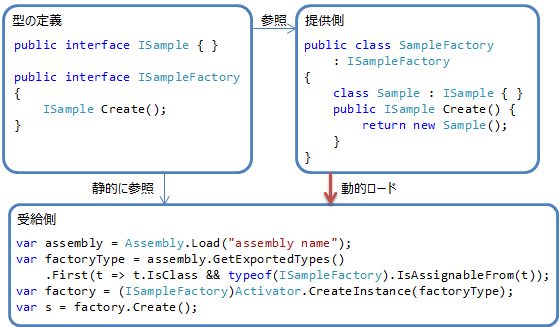
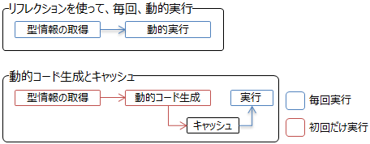
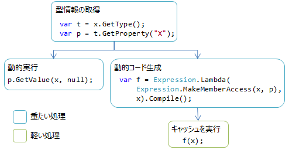
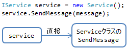
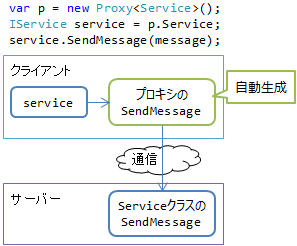
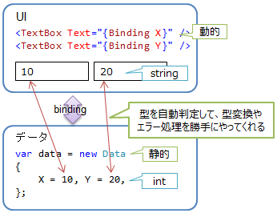
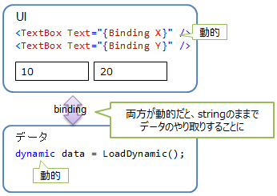

# \[雑記\]動的な処理の使い方

## <a id="sec-generated-title-1"></a> <a id="abst"></a>概要

プログラミング言語の区分として、静的（static）か動的（dynamic）かというものがあります。
ただ、動的と言っても、何を動的に行うか、いろんなやり方があって、いろんな用途があります。

C# は「静的な言語」と呼ばれることが多いですが、正確には「静的な型を持つ言語」になります。
そして、型が静的でも、動的ローディングや動的コード生成など、色々な動的処理を行えます。

ここでは、C# でできる動的処理と、その用途について説明して行きます。


## <a id="sec-generated-title-2"></a> <a id="loading"></a>動的ローディング

既知の型を、未知のDLLから読み込みます。

例えば、図1のような感じ。
System.Reflection.Assembly クラスの Load メソッドなどを使って DLL を読み込んで、
System.Activator.Create メソッドでインスタンスを作ります。

<figure>

[](../../../../assets/media/ufcpp2000/csharp/fig/latebinding.png)

<figcaption>動的ローディング。</figcaption>
</figure>


通常の（静的な）コードと比べて、
インスタンスを作る部分だけ面倒ですが、
一度インスタンスを作ってしまえば、後は通常のコードと同じです。


### <a id="sec-generated-title-3"></a> <a id="plug-in"></a>用途1: プラグイン

プラグイン、つまり、アプリ本体とは別の第3者がアプリへの拡張機能を提供する場合、まさに、既知の型を未知のDLLから読み込むことになります。


### <a id="sec-generated-title-4"></a> <a id="hot-deploy"></a>用途2: ホット デプロイ

アプリ本体を稼働させたままで、部分的に機能を置き換えたい場合があります。
その場合、置き換えたい部分をプラグインとして作っておいて、
更新が必要なときに再読み込み（たとえば、DLLファイルの監視をしておいて、新しくなったらのを検知して自動的に再読み込み）する仕組みを作ります。

稼働させたまま（hot）部品を配置（deploy）するという意味で、ホット デプロイ（hot deploy）と呼びます。


### <a id="sec-generated-title-5"></a> <a id="mef"></a>ライブラリ: MEF

こういうプラグイン的な動的ローディングをサポートするためのフレームワークとして、
[MEF](http://msdn.microsoft.com/ja-jp/library/system.componentmodel.composition.aspx)（Managed Extensibility Framework）というものがあります。

MEFは、.NET Framework 4からは標準ライブラリに取り込まれました。System.ComponentModel.Composition名前空間以下のクラスがMEFの実体です。


## <a id="sec-generated-title-6"></a> <a id="reflection"></a>リフレクション（型情報を使った処理

型がどういうメンバー（メソッドやプロパティなど）を持つかというような、型情報を使った処理を書きたいことがあります。

の手の情報は、実行時には必ずしも必要のない情報で、プログラミング言語によっては実行時に残さない（コンパイル時にだけ使う）こともあります。
そういう意味で、メタデータ（metadata: データに関するデータという意味。この場合、プログラムというデータを作るためのデータ）と呼ばれたりもします。

.NETでは、GetTypeメソッドなどを使って型情報を実行時に取得できます。型情報は、Type型のインスタンスとして表されます。

型情報を実行時に取得することをリフレクション（reflection: 反射。ここでは自己反映という意味合い）と呼びます。


### <a id="sec-generated-title-7"></a> <a id="serialization"></a>用途: シリアライズ

型情報を使った処理の代表格は、データのシリアライズ（serialize: 直列化する）です。
独自のバイナリ形式であったり文字列化であったり、一定のルールでデータを保存・復元することをシリアライズ（復元の方はデシリアライズ）と呼びます。

コンピューターをまたいだ通信でデータを受け渡ししたり、ファイルなどに保存するために使います。
通信もファイルも、結局はバイト配列を流し込むもの（＝ストリーム（stream））なので、
データをまっすぐに並べる（＝シリアライズ）必要があります。

もちろん、型ごとに独自のシリアライズ処理を書いても構わないんですが、だいたいは定型的な処理になるので、個別に書くのは面倒です。
そこで、型情報を使って動的にシリアライズしたりします。

以下のコードは、クラスのすべてのプロパティの値をコンソールに表示する物です。
シリアライズ処理も、これと同じような仕組みで実現します。

```csharp
using System;

class Point
{
    public int X { get; set; }
    public int Y { get; set; }
}

class Program
{
    static void Main()
    {
        var p = new Point { X = 10, Y = 20 };
        OutputAllProperties(p);
    }

    static void OutputAllProperties<T>(T obj)
    {
        var t = typeof(T);

        foreach (var p in t.GetProperties())
        {
            var name = p.Name;
            var value = p.GetValue(obj, null);
            Console.WriteLine("{0}: {1}", name, value);
        }
    }
}
```


```console
X: 10
Y: 20
```


ただし、実際には、パフォーマンス上の理由から、
後述する動的コード生成を使って、リフレクションの負荷を軽減します。


### <a id="sec-generated-title-8"></a> <a id="xml-json"></a>具体例: XML 化、JSON 化

.NET の場合、標準でシリアライズ用のクラスがそろっているので、自分でシリアライズ処理を書く必要はあまりないでしょう。
独自形式での保存が必要な場合を除けば、標準ライブラリを使うべきです。

標準では、
XML 形式でシリアライズする DataContractSerializer クラス（System.Runtime.Serialization 名前空間）や、
JSON 形式でシリアライズする DataContractJsonSerializer クラス（System.Runtime.Serialization.Json 名前空間）などがあります。


## <a id="sec-generated-title-9"></a> <a id="code-generation"></a>動的コード生成

静的な処理（コンパイル済みのコードの実行）と比べると、リフレクションはそれなりに重たい処理です。
もともとコンパイル時に全部済ましてしまうような処理をその都度掛ける分重たいわけです。
だいたい、2・3桁くらい遅いです。2倍じゃなく、2桁差。

そこで、動的にコードを生成して、その生成したコンパイル済みのコードを取っておいて、使いまわそうという発想が出てきます。
この方法なら、重たい処理は最初の1回だけでよくて、2回目以降は十分高速になります。

<figure>

[](../../../../assets/media/ufcpp2000/csharp/fig/code-generation1.png)

<figcaption>動的実行と動的コード生成（重たい処理は初回だけ）。</figcaption>
</figure>


型情報の取得、動的実行、動的コード生成はいずれも重たい処理です。
一方、キャッシュしたコードを実行するだけなら、かなり低負荷です。

<figure>

[](../../../../assets/media/ufcpp2000/csharp/fig/code-generation2.png)

<figcaption>動的実行と動的コード生成（処理内容の例と、処理負荷）。</figcaption>
</figure>


.NET には、歴史的経緯から、何系統かの動的コード生成用ライブラリがあります。

* 式ツリー
    * System.Linq.Expressions名前空間以下のクラスを使います

    * 名前通り、ツリー構造のデータを使ってプログラムを表現します

    * .NET 3.0で式相当のコード、.NET 4で一通りなんでもコード生成できるようになりました


* IL Emit（中間言語の発行）
    * DynamicMethod クラス（System.Reflection.Emit 名前空間）を使います

    * IL（.NETの中間言語、アセンブリ言語）を直接記述します

    * 式ツリーの導入以降、直接使うことはあまりなくなりました


* CodeDOM
    * System.CodeDom名前空間以下のクラスを使います

    * 文字列でC#などのソース コードを作って、それをコンパイルします

    * 内部的に、C#などのコンパイラーを直接呼び出しているだけで、現状、あまり使い勝手の良い仕様になっていません


### <a id="sec-generated-title-10"></a> <a id="faster-reflection"></a>用途1: リフレクションの高速化

本節冒頭の通り、一番の用途はリフレクションの高速化です。
たいていのシリアライズ用のライブラリでは、内部的には動的コード生成しています。


### <a id="sec-generated-title-11"></a> <a id="scripting"></a>用途2: スクリプティング

アプリ中で、ちょっとしたスクリプト言語を使いたい場合があります。アプリ中でのスクリプト実行は、当然、動的コード生成になります。

.NET で作ったアプリスクリプト言語を使うためのライブラリとして、
[DLR](http://dlr.codeplex.com/)（Dynamic Language Runtime）というものがあります。

DLR は、動的言語を .NET 上で動かすための基盤技術で、オープンソースで開発されています。
DLR 上で動く言語としては、[IronPython](http://ironpython.codeplex.com/) や [IronRuby](http://ironruby.codeplex.com/) などがあります。


## <a id="sec-generated-title-12"></a> <a id="loose-typing"></a>ゆるい型付け

通常、C#のような、静的で厳密な型を持つ言語では、あるオブジェクトに途中でプロパティやメソッドを足すということはできません。

しかし、C# 4.0でdynamicキーワードが導入されて、ゆるい型（実行時にいろいろ追加可能）が使えるようになりました。

```csharp {title="dynamic キーワード"}
dynamic d = new ExpandoObject();
d.X = 10; // この瞬間、d に X というメンバーが追加される
d.Y = 20; // 同上、Y 追加
Console.WriteLine(d.X + d.Y);
```


ここで使ったExpandoObjectを含め、System.Dynamic名前空間以下のクラスを使います。


### <a id="sec-generated-title-13"></a> <a id="independency"></a>用途1: DLL 間の依存関係をなくす

通常、クラスなどの型を使いたければ、その型を定義しているDLLをコンパイル時に参照する必要があります。そのDLLに依存しないとコンパイルできません。

しかし、まれにですが、無理やりにでもDLLの依存関係を切りたいことがあります。結構無理やりな手段ですが、そういう場合にdynamicキーワードが使えなくもないです。


### <a id="sec-generated-title-14"></a> <a id="script-interop"></a>用途2: スクリプト言語連携

IronPythonなどの基盤であるDLR（dynamic language runtime）は、内部的にSystem.Dynamic名前空間のクラスを使います。dynamicキーワードを使って、簡単に連携可能です。

というよりも、.NET 4の動的機能、System.Dynamic名前空間内のクラスは、DLRの成果を.NETに取り込んだものです


### <a id="sec-generated-title-15"></a> <a id="loosely-typed-data"></a>用途3: ゆるい型のデータ連携

JSONを使ったRESTサービスなどでは、いわゆるスキーマレス（schema-less: データ構造をきっちり決めてない）になっていることがあります。

dynamicキーワードを使えば、この手のスキーマレスなデータとの連携がお手軽になります。


## <a id="sec-generated-title-16"></a> <a id="dynamic-behavior"></a>動的に型の挙動を変える

ある型の特定のメソッドの挙動を動的に差し替えたり、インターフェイスを継承した型を動的に生成したりしたいことがあります。

この場合、動的に型を作ることになります。型の動的生成には、以下のようなクラスが使えます。

* TypeBuilder クラス（System.Reflection.Emit名前空間）
    * 型情報（Type型）を動的に作ります

    * メソッドなどの挙動も動的にコード生成できます（MethodBuilderクラス、ILGeneragorクラスなどを使います）

    * 作った型情報を元に、Activator.Createします


* RealProxy クラス（System.Runtime.Remoting 名前空間）
    * インターフェイスのメソッド呼び出しをフックして、別の処理をはさむ機能を提供します


### <a id="sec-generated-title-17"></a> <a id="proxy"></a>用途1: 透過プロキシ

例えば、以下のようなクラスを考えてみます。

```csharp
public class IService
{
    void SendMessage(string message);
}
 
public class Service : IService
{
    public void SendMessage(string message)
    {
        // 具体的な処理
    }
}
```


このクラスを、普通にインスタンスを作って使うなら、図4のようになります。

<figure>

[](../../../../assets/media/ufcpp2000/csharp/fig/dynamic-proxy1.png)

<figcaption>クラスのインスタンスの通常の利用方法。</figcaption>
</figure>


これに対して、インターフェイスとクラスの間に別の処理をはさみたいことがあります。
わかりやすい例は、図5のような、通信をはさんでサーバー上で処理を行いたい場合です。

<figure>

[](../../../../assets/media/ufcpp2000/csharp/fig/dynamic-proxy2.png)

<figcaption>メソッド呼び出しに割り込んで、挙動を変える例。</figcaption>
</figure>


こういう、間に挟むもののことをプロキシ（proxy）と呼びます。
特に、この例のように、利用側からするとプロキシが挟まっていることを意識しないで使えるもののことを透過プロキシ（transparent proxy）と呼びます。

プロキシ用途の場合、ビルド時コード生成という手段もあるんですが、動的に（実行時に）型生成することも多いです。


### <a id="sec-generated-title-18"></a> <a id="mock"></a>用途2: モック

あるメソッドをテストしたいときに、そのメソッドが別のメソッドに依存している場合、どうすればいいでしょう。

依存先のメソッドが完成するまで待つと、どんどん開発が遅れます。
また、最初は正しく動いていたけど、あとから依存先の方にバグが混入したら、こちらのメソッドまでテストが通らなくなったり。

ということで、依存先のメソッドをモック（mock: 模造品）で差し替えたいことがあります。
こういう場合、型を継承した別クラスを動的に作って、所望のメソッドだけ置き換えるというような方法を取ります。

モック生成のためだけにTypeBuilderなどを使うのは結構大変なので、補助してくれるライブラリを使うのが一般的です。
モック生成用のライブラリは、結構いろんなものがオープン ソースで提供されています。

有名なものだと、[Moq](http://code.google.com/p/moq/) などがあります。
以下のような使い方ができるモック用ライブラリです。

```csharp
var mock = new Moq.Mock<IComparer<int>>();
mock.Setup(m => m.Compare(0, 1)).Returns(-1);
mock.Setup(m => m.Compare(1, 0)).Returns(1);
mock.Setup(m => m.Compare(0, 0)).Returns(0);

var c = mock.Object;
Console.WriteLine(c.Compare(1, 0));
```


## <a id="sec-generated-title-19"></a> <a id="type-descriptor"></a>型情報の動的生成

メソッドなどの挙動までは必要なく、「この型はこういうプロパティを持っている」というような、メタデータだけ動的に作って提供したいことがあります。
以下のようなクラスを使います。

* ICustomTypeDescriptor インターフェイス（System.ComponentModel 名前空間）
    * .NET 4/Silverlight 4以前で使います

    * Type型とは別系統で、TypeDescriptorなどのクラスを返す仕組みでした。Type型を返すことでも同じことができるので、後述のICustomTypeProviderで置き換わる予定です


* ICustomTypeProvider インターフェイス（System.Reflection 名前空間）
    * .NET 4.5/Silverlight 5以降で使います

    * Type型で型情報を返します


### <a id="sec-generated-title-20"></a> <a id="data-binding"></a>用途: データ バインディング

WPFやSilverlightでは、UIの方（いわゆるビュー。XAMLで書くやつ）には、「ここにXの値を表示したい」というような印だけ入れておいて、実際のデータは外部から渡します。

この際、渡したデータの型情報に基づいて、文字列から数値への変換や、変換に失敗した際のエラー処理などを自動的にやってくれています（図6）。
こういう仕組みをデータ バインディング（data binding）と呼びます。

<figure>

[](../../../../assets/media/ufcpp2000/csharp/fig/data-binding1.png)

<figcaption>データ バインディングの例。</figcaption>
</figure>


そこで問題になるのは、渡すデータがゆるい型の場合です。
データ バインディングは内部的にいろいろ動的な処理をしているわけですが、渡す側も動的だと、型情報が取れなくて困ります（図7）。

<figure>

[](../../../../assets/media/ufcpp2000/csharp/fig/data-binding2.png)

<figcaption>データ バインディングと動的な型。</figcaption>
</figure>


そこで、ゆるい型に対して、別途、ちゃんとした型情報を偽装して与えるために使うのが、ICustomTypeProviderなどのインターフェイスです。
このインターフェイスを実装している場合、実際の型情報（GetTypeした結果）よりも優先して、別途用意した型情報に基づいたデータ バインディングを行ってくれます。
