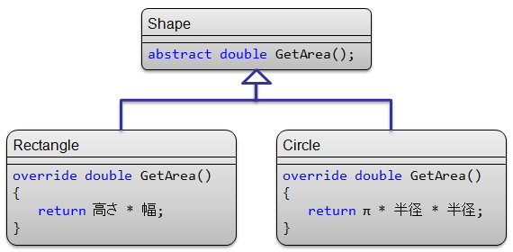

# \[雑記\] 多重ディスパッチ

## 概要
<h5 class="version version4">Ver. 4.0</h5>

dynamic の用途の1つとして、多重ディスパッチというものを説明します。

##### ポイント
* 多重ディスパッチ（multiple dispatch）： 複数のインスタンスの動的な型情報に基づいて、実際に呼び出すメソッドを切り替える （「[仮想メソッド](../oop/oo_polymorphism.md#virtual_method)」の複数インスタンス版）。

* dynamic を使うことで、ほんのちょっと多重ディスパッチの実装が楽に。

## ディスパッチ
多重ディスパッチの話の前に、まずそもそもディスパッチ（dispatch）、訳すなら「配送」になるわけですが、
このディスパッチって何？って話から。

仮想メソッド呼び出しは、
オブジェクトに対してメッセージを送っているともみなせます。
例えば、下図のようなクラスを考えてみましょう。

<figure>
	
	<figcaption>仮想メソッド持ちのクラス</figcaption>
</figure>

実装例を挙げると以下のような感じ。

<pre class="source" title="Shape の実装例" lang="">
<code>interface Shape
{
    double GetArea();
}

class Rectangle : Shape
{
    public double 幅 = 0;
    public double 高さ = 0;
    public double GetArea() { return 幅 * 高さ; }
}

class Circle : Shape
{
    public double 半径 = 0;
    public double GetArea() { return Math.PI * 半径 * 半径; }
}
</code></pre>

で、以下のように、仮想メソッド呼び出しをします。

<pre class="source" title="仮想メソッド呼び出し" lang="">
<code>Shape s;
// どこかで s に Rectangle もしくは Circle を代入。
s.GetArea();
</code></pre>

GetArea は仮想メソッドなので、s.GetArea() の呼び出しは、実際には s の動的な型情報に基づいて、
Rectangle あるいは Circle の GetArea メソッドが呼び出されます。
この一連の流れは、以下のようにとらえることもできます。

1. オブジェクト s に対して「GetArea を実行してくれ」というメッセージを送る

2. <em>s の動的な型を調べて、メッセージの配送先を決める</em>

3. 実際にメッセージを受け取って、処理を行うのは Rectangle.GetArea もしくは Circle.GetArea

この2番の処理、すなわち、メッセージの配送先を決めることを<strong id="dispatch" class="keyword">ディスパッチ</strong>（dispatch: 配送）と呼びます。
（特に、仮想メソッド呼び出しのように、実行時の型（動的な型）によって配送先を決めることを<strong id="dynamic" class="keyword">動的ディスパッチ</strong>（dynamic dispatch）と呼びます。）

C# や C++ などの言語では、このディスパッチ処理を「[仮想関数テーブル](../oop/oo_vftable.md#vftable)」という仕組みを使って行っています。

## 自前で動的ディスパッチ
「[仮想関数テーブル](../oop/oo_vftable.md#vftable)」という仕組みに乗っかるだけが動的ディスパッチの実現方法ではありません。
例えば、以下のようなコードを書くことで動的ディスパッチを実現できます。

<pre class="source" title="自前で動的ディスパッチする" lang="">
<code>static class ShapeMethods
{
    public static double GetArea(this Shape s)
    {
        if (s is Rectangle) return GetArea((Rectangle)s);
        if (s is Circle) return GetArea((Circle)s);
        throw new ArgumentException();
    }

    static double GetArea(Rectangle x) { return x.幅 * x.高さ; }
    static double GetArea(Circle x) { return Math.PI * x.半径 * x.半径; }
}
</code></pre>

まあ、見てのとおりです。
自前で動的な型を調べて、自前でメッセージの配送先（＝ 実際に呼び出すメソッド）を切り替えています。

さて、これを見て「なんでわざわざこんな面倒なことするの？」と思った方、それは正しい判断です。
面倒な書き方になる割に、別にメリットはありません（仮想関数テーブルを使う方が実行効率もいい）。

が、それは、動的ディスパッチを行いたい変数が1つだけ（この例の場合、s 1個だけ）だからです。
次節で述べる多重ディスパッチを行いたい場合、むしろこういう書き方の方がすっきりしたりします。

## 多重ディスパッチ
それでは、次に多重ディスパッチの話に。

先ほどの GetArea の場合、1つの変数 s の中身だけを見てディスパッチ先を決定できていました。
ところが、じゃあ、以下のようなものを考えてみましょう。

* 2つの Shape 型の変数 s と t を考える。

* s が t を内包できるかどうかを調べたい。
1. s も t も Rectangle （四角）なら、幅・高さの大小関係を調べればいい。

2. s も t も Circle （円）なら、半径の大小を調べればいい。

3. s が Rectangle、t が Circle なら、s の対角線の長さと t の直径の大小を調べる。

4. s が Circle、t が Rectangle なら、s の直径と t の対角線の長さの大小を調べる。

要するに、2つの変数を使って動的ディスパッチを行いたいということです。

こういうのを<strong id="multiple" class="keyword">多重ディスパッチ</strong>（multiple dispatch）と呼びます。
多重ディスパッチは仮想メソッド（要するに、仮想関数テーブルを使った実装）では実現できません。

ということで、やむを得ず、先ほどのような「自前ディスパッチ」の仕組みを作ります。

<pre class="source" title="多重ディスパッチ" lang="">
<code>public static bool Contains(this Shape s, Shape t)
{
    if (s is Rectangle &amp;&amp; t is Rectangle) return Contains((Rectangle)s, (Rectangle)t);
    if (s is Rectangle &amp;&amp; t is Circle) return Contains((Rectangle)s, (Circle)t);
    if (s is Circle &amp;&amp; t is Rectangle) return Contains((Circle)s, (Rectangle)t);
    if (s is Circle &amp;&amp; t is Circle) return Contains((Circle)s, (Circle)t);
    throw new ArgumentException();
}

static bool Contains(Rectangle s, Rectangle t)
{
    return s.幅 &gt; t.幅 &amp;&amp; s.高さ &gt; t.高さ;
}
static bool Contains(Rectangle s, Circle t)
{
    return s.幅 * s.幅 + s.高さ * s.高さ &gt; t.半径 * t.半径 * 4;
}
static bool Contains(Circle s, Rectangle t)
{
    return s.半径 * s.半径 * 4 &gt; t.幅 * t.幅 + t.高さ * t.高さ;
}
static bool Contains(Circle s, Circle t)
{
    return s.半径 &gt; t.半径;
}
</code></pre>

（ちなみに、こういう場合、Visitor パターンっていう実装手法もあって、
それを使うというのも1つの手なんですが、
Visitor パターンを使った多重ディスパッチはあまりきれいなコードにはならないし、
2変数のディスパッチ（2重ディスパッチ（double dispatch）と呼ぶ）が限界だったりします。
ということで、ここではそのやり方は割愛。）

## dynamic でディスパッチ
さて、ようやくここからが本題。

自前でディスパッチ用の <code>if (s is ...)</code> を書きたくない・・・。
だって、クラスが増えるたびにいちいち追加するの？
とか思うわけです。

そこで C# 4.0 の dynamic を使ってみましょう。

<pre class="source" title="dynamic を使った多重ディスパッチ" lang="">
<code>//public static bool Contains(this Shape s, Shape t)
//{
//    if (s is Rectangle &amp;&amp; t is Rectangle) return Contains((Rectangle)s, (Rectangle)t);
//    if (s is Rectangle &amp;&amp; t is Circle) return Contains((Rectangle)s, (Circle)t);
//    if (s is Circle &amp;&amp; t is Rectangle) return Contains((Circle)s, (Rectangle)t);
//    if (s is Circle &amp;&amp; t is Circle) return Contains((Circle)s, (Circle)t);
//    throw new ArgumentException();
//}
// ↑before
// ↓after
<em>public static bool Contains(this Shape s, Shape t)
{
    return Contains((dynamic)s, (dynamic)t);
}
static bool Contains(dynamic s, dynamic t) { return Contains(s, t); }</em>

static bool Contains(Rectangle s, Rectangle t)
{
    return s.幅 &gt; t.幅 &amp;&amp; s.高さ &gt; t.高さ;
}
static bool Contains(Rectangle s, Circle t)
{
    return s.幅 * s.幅 + s.高さ * s.高さ &gt; t.半径 * t.半径 * 4;
}
static bool Contains(Circle s, Rectangle t)
{
    return s.半径 * s.半径 * 4 &gt; t.幅 * t.幅 + t.高さ * t.高さ;
}
static bool Contains(Circle s, Circle t)
{
    return s.半径 &gt; t.半径;
}
</code></pre>

ソースコード全体も以下に置いておきます。

* 
[ソースコード（C#）](../../../../assets/media/ufcpp2000/csharp/source/MultipleDispatch.cs)

これはこれで、あんまりきれいなものではないんですが、
元の if だらけよりは多少マシかと。
ちなみに、「[dynamic の内部実装](sp4_callsite.md)」を呼んでもらえるとわかるんですが、
dynamic が内部的にやってることは、この if (s is ...) を動的に生成してるだけだったりもします。

### おまけ
Visitor パターンを使ったものを含め、多重ディスパッチのサンプル↓。

[ソース一式（ZIP 形式）](../../../../assets/media/ufcpp2000/csharp/source/MultipleDispatch.zip)

## まとめ
* 仮想メソッドのように、実行時の型に応じて実際に呼び出されるメソッドを切り替えることを動的ディスパッチと呼ぶ。

* 動的ディスパッチは if (x is ...) みたいなコードを書くことで、手動でも行える。

* C# 4.0 の dynamic を使うと、自動的に動的ディスパッチを行ってもらえる。

* 仮想メソッドでは実現できない多重ディスパッチの場合でも、dynamic なら動的ディスパッチ可能。
    * 3重ディスパッチでも4重ディスパッチでも、いくらでも多重化可能。

<code>(x, y).Method();</code> みたいな書き方ができるともっとスマートなんですけどね。
C# 4.0 でもそれは無理。
