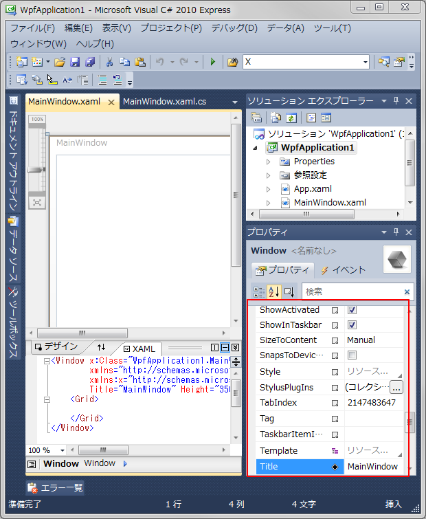
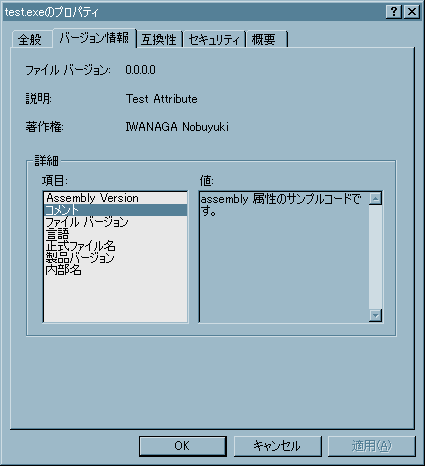

# 属性

## <a id="sec-generated-title-1"></a> <a id="abst"></a>概要

<strong id="attribute" class="keyword">属性</strong>（attribute）とはクラスやメンバーに追加情報を与えるものです。
例えば、<code>public</code> や <code>private</code> などといったC#のキーワードもある種の属性と考えることが出来ます。
<code>public</code> ならば「このメンバーはクラス外からも参照可能」、
<code>private</code> ならば「このメンバーはクラス内のみから参照可能」という追加情報が与えられます。

C++ などの既存の言語では、このような追加情報を定義する場合、
言語仕様自体を拡張し、新たにコンパイラを作り直す必要がありました。
それに対し、C# では自分で属性を定義し、クラスやメンバーに付加することが出来ます。
すなわち、ライブラリで提供されている属性や自作した属性を用いることで、
コンパイラに対する指示を行ったり、クラスの利用者に対する情報を残すことが出来ます。

属性の情報は、以下のような場面で使われます。

* 条件コンパイルなどの、コンパイラへの指示に使う（Conditional や Obsolete）。

* 作者情報などをメタデータとしてプログラムに埋め込む（AssemblyTitle など）。

* 「[リフレクション](sp_reflection.md#reflection)」を利用して、プログラム実行時に属性情報を取り出して利用する。


##### <a id="sec-generated-title-2"></a>ポイント

* C# では、クラスやメンバーに対して、ユーザーが自分で定義した属性を自由に付けられます。

* 一部の属性は、コンパイラや Visual Studio に対する指示として利用します。 例：
    * [Obsolete] class OldClass {} … 古いバージョンとの互換性のためだけに残してるけど、このクラスはもう使わないで。

    * [EditorBrowsable] T Property; … Visual Studio の IntelliSense（などの、開発ツールの補完機能）で表示するかどうかを設定します。


## <a id="sec-generated-title-3"></a> <a id="use"></a>属性の使用

属性は以下のように <code>[]</code> でくくり、
クラスやメンバーの前に付けて使います。

```csharp
[属性名(属性パラメータ)]
メンバーの定義
```


たとえば以下のような感じ。

```csharp
[DataContract]
class User
{
    public int Id { get; set; }
    public string Name { get; set; }
}
```


属性名は語尾に <code>Attribute</code> を付けることになっています。
例えば、標準で用意されている属性には <code>ObsoleteAttribute</code> や
<code>ConditionalAttribute</code> などといった名前のものがあります。
また、これらを C# から利用する場合、語尾の <code>Attribute</code> は省略してもかまいません。
したがって、前者は <code>Obsolete</code>、
後者は <code>Conditional</code> という名前で使用できます。

例として、<code>Conditional</code> 属性を使用してみましょう。
<code>Conditional</code> 属性とは、
特定の条件下でのみ実行されるメソッドを定義するために使用する属性です。
例えば、以下のようにして使用します。

```csharp
using System;
using System.Diagnostics;

class AttributeTest
{
    static void Main()
    {
        double[] array = new double[] { 9, 4, 5, 2, 7, 1, 6, 3, 8 };
        BubbleSort(array);
        Output(array);
    }

    /// <summary>
    /// バブルソートを行う。
    /// </summary>
    static void BubbleSort(double[] array)
    {
        int n = array.Length - 1;

        for (int i = 0; i < n; ++i)
        {
            for (int j = n; j > i; --j)
                if (array[j - 1] > array[j])
                    Swap(ref array[j - 1], ref array[j]);

            IntermediateOutput(array); // ソートの途中段階のデータを表示。
        }
    }

    static void Swap(ref double x, ref double y)
    {
        double tmp = x;
        x = y;
        y = tmp;
    }

    /// <summary>
    /// 配列の内容をコンソールに表示する。
    /// </summary>
    static void Output(double[] array)
    {
        foreach (double x in array)
        {
            Console.Write("{0} ", x);
        }
        Console.Write("\n");
    }

    /// <summary>
    /// SHOW_INTERMEDIATE というシンボルが定義されているときのみ
    /// 配列の内容をコンソールに表示する。
    /// </summary>
    [Conditional("SHOW_INTERMEDIATE")]
    static void IntermediateOutput(double[] array)
    {
        Output(array);
    }
}
```


<code>SHOW_INTERMEDIATE</code> という名前のシンボルが定義されている場合、
以下のように、ソートの途中段階のデータが表示されます。

```console
1 9 4 5 2 7 3 6 8
1 2 9 4 5 3 7 6 8
1 2 3 9 4 5 6 7 8
1 2 3 4 9 5 6 7 8
1 2 3 4 5 9 6 7 8
1 2 3 4 5 6 9 7 8
1 2 3 4 5 6 7 9 8
1 2 3 4 5 6 7 8 9
1 2 3 4 5 6 7 8 9
```


一方、<code>SHOW_INTERMEDIATE</code> という名前のシンボルが定義されていない場合、
以下のように、結果のみが表示されます。

```console
1 2 3 4 5 6 7 8 9
```


ちなみに、以下のように <code>,</code> で区切るか、複数の <code>[]</code> を並べることで複数の属性を指定することが出来ます。

```csharp
[Conditional("DEBUG"), Conditional("TEST")]
void DebugOutput(string message)
```


```csharp
[Conditional("DEBUG")]
[Conditional("TEST")]
void DebugOutput(string message)
```


## <a id="sec-generated-title-4"></a> <a id="predefined"></a>定義済み属性

<code>Conditional</code> 以外にも、標準ライブラリによって提供されている定義済み属性がいくつかあります。
そのうちのいくつかを以下に挙げます。
「付与した属性を誰が使うか」で分類しています。


### <a id="sec-generated-title-5"></a> <a id="compiler_attribute"></a>コンパイラが利用

コンパイラへの指示になっていて、コンパイル結果に影響を及ぼします。

<table summary="">

	<tr>
		<th>属性名</th>
		<th>効果</th>
	</tr>
	<tr>
		<td markdown="1"><code>System.AttributeUsageAttribute</code></td>
		<td markdown="1">属性の用途を指定します。属性クラスを自作する場合(詳細は後述)に使用します。</td>
	</tr>
	<tr>
		<td markdown="1"><code>System.ObsoleteAttribute</code></td>
		<td markdown="1">時代遅れな(次期バージョンで削除されても文句の言えない)コードであることを示します。 この属性が付いているクラスやメソッドを利用すると、コンパイラが警告を発します。</td>
	</tr>
	<tr>
		<td markdown="1"><code>System.Diagnostics.ConditionalAttribute</code></td>
		<td markdown="1">特定の条件下でのみ実行されるメソッドを定義するために使用します。<h5 class="version version2">Ver. 2.0</h5>C# 2.0 では、メソッドだけでなく、属性に対しても Conditional 属性を付ける事が可能になりました。</td>
	</tr>
</table>


### <a id="sec-generated-title-6"></a> <a id="ide_attirbute"></a>開発ツール

Visual Studio などの開発ツールが利用します。
いずれも、<code>System.ComponentModel</code> 名前空間です。

<table summary="">

	<tr>
		<th>属性名</th>
		<th>効果</th>
	</tr>
	<tr>
		<td markdown="1"><code>CategoryAttribute</code><br></br><code>DefaultValueAttribute</code><br></br><code>DescriptionAttribute</code><br></br><code>BrowsableAttribute</code><br></br></td>
		<td markdown="1">コンポーネントクラス(簡単に言うと Windows アプリケーションのボタンやテキストボックス等のこと)のプロパティに対してこれらの属性を指定することで、 Visual Studio のプロパティ エディタで値を編集することが出来るようになります。
<figure>

[](../../../../assets/media/ufcpp2000/csharp/fig/VsProperty.png)

<figcaption>Visual Studio のプロパティ エディター</figcaption>
</figure>

</td>
	</tr>
</table>


### <a id="sec-generated-title-7"></a> <a id="ves_attribute"></a>実行エンジン

.NET Framework の 「[IL](../abstract/ab_dotnet.md#il)」 実行エンジンが利用します。
いずれも、<code>System.Runtime.InteropServices</code> 名前空間です。

<table summary="">

	<tr>
		<th>属性名</th>
		<th>効果</th>
	</tr>
	<tr>
		<td markdown="1"><code>DllImportAttribute</code><br></br></td>
		<td markdown="1">ネイティブ な DLL からメソッドをインポートします。 （DllImport 属性を付けたメソッドを宣言するだけで、ネイティブ な DLL のメソッドを利用できます。 ネイティブ DLL 側に特別な処理を書く必要は全くありません。）</td>
	</tr>
	<tr>
		<td markdown="1"><code>ComImportAttribute</code><br></br></td>
		<td markdown="1">Unmanaged な DLL から COM クラスをインポートします。</td>
	</tr>
</table>


### <a id="sec-generated-title-8"></a> <a id="lib_attribute"></a>ライブラリ

ライブラリが利用します。
各ライブラリ内部で、「[リフレクション](sp_reflection.md#reflection)」を使った動的コード生成などを行っています。


##### <a id="sec-generated-title-9"></a>ASP.NET

<table summary="">

	<tr>
		<th>属性名</th>
		<th>効果</th>
	</tr>
	<tr>
		<td markdown="1"><code>System.Web.Services.WebMethodAttribute</code></td>
		<td markdown="1">XML Web Service を使用してリモートにあるメソッドを呼び出すことが出来ます。</td>
	</tr>
</table>


##### <a id="sec-generated-title-10"></a>WCF（Windows Communication Foundation）

<table summary="">

	<tr>
		<th>属性名</th>
		<th>効果</th>
	</tr>
	<tr>
		<td markdown="1"><code>System.ServiceModel.OperationContractAttribute</code><br></br><code>System.ServiceModel.ServiceContractAttribute</code><br></br><code>System.Runtime.Serialization.DataContractAttribute</code></td>
		<td markdown="1">WCF のサービスや、サービスで使うデータに付けます。</td>
	</tr>
</table>


##### <a id="sec-generated-title-11"></a>データ検証

<code>System.ComponentModel.DataAnnotations.Validator</code> クラスを使って、
データが満たすべき条件（null であってはいけないとか、値の範囲とか）を検証します。
いずれも、<code>System.ComponentModel.DataAnnotations</code> 名前空間です。

<table summary="">

	<tr>
		<th>属性名</th>
		<th>効果</th>
	</tr>
	<tr>
		<td markdown="1"><code>RequiredAttribute</code></td>
		<td markdown="1">必須である（null や空文字を認めない）ことを示します。</td>
	</tr>
	<tr>
		<td markdown="1"><code>RangeAttribute</code></td>
		<td markdown="1">値の範囲を指定します。</td>
	</tr>
	<tr>
		<td markdown="1"><code>StringLengthAttribute</code></td>
		<td markdown="1">文字列の最大長/最小長を指定します。</td>
	</tr>
</table>


##### <a id="sec-generated-title-12"></a>テスト

Visual Studio 組み込みの単体テスト機能で利用します。
いずれも、<code>Microsoft.VisualStudio.TestTools.UnitTesting</code> 名前空間です。

<table summary="">

	<tr>
		<th>属性名</th>
		<th>効果</th>
	</tr>
	<tr>
		<td markdown="1"><code>TestClassAttribute</code></td>
		<td markdown="1">テスト メソッドを含むクラスを識別するために使用されます。</td>
	</tr>
	<tr>
		<td markdown="1"><code>TestMethodAttribute</code></td>
		<td markdown="1">テスト メソッドの識別に使用します。</td>
	</tr>
</table>


### <a id="sec-generated-title-13"></a> <a id="assembly_attribute"></a>プログラム自体に関する情報

一部の属性は、実行ファイルのプロパティに表示されます。
例えば、以下のようなプログラムにより、
AssemblyDescription という属性をアセンブリに付けたとします。

```csharp
using System.Reflection;
using System.Runtime.CompilerServices;

[assembly: AssemblyDescription("assembly 属性のサンプルコードです。")]

class TestAttribute
{
  static void Main()
  {
  }
}
```


AssemblyDescription に与えた文字列は、このプログラムのコメントとして、
explorer から参照することができます。
このソースコードをコンパイルした結果の実行ファイルのプロパティを開くと、
以下のようになります。

<figure>

[](../../../../assets/media/ufcpp2000/csharp/fig/assembly0.png)

<figcaption>実行ファイルのプロパティ</figcaption>
</figure>


## <a id="sec-generated-title-14"></a> <a id="target"></a>属性の対象

属性を付ける場所によって属性の対象は変わります。
例えば、クラスの直前に属性を付ければクラスに属性が適用されますし、
メソッド定義の直前に属性を付ければメソッドに属性が適用されます。
以下にその例を挙げます。

```csharp
[assembly: AssemblyTitle("Test Attribute")] // プログラムそのものが対象
 
[Serializable] // クラスが対象
public class SampleClass
{
    [Obsolete("時期版で削除します。使わないでください。")] // メソッドが対象
    public void Test([In, Out] ref int n) // 引数が対象
    {
        n *= 2;
    }
}
```


しかし、属性を付ける位置によっては属性の対象が曖昧になることがあります。
メソッドそのものとメソッドの戻り値に属性を適用したい場合がその典型例です。
以下にその例を挙げます。

```csharp
[DllImport("msvcrt.dll")]
[MarshalAs(UnmanagedType.I4)] // メソッドの戻り値に属性を適用したいんだけど、
// コンパイラはそう解釈してくれない。
// 戻り値ではなく、メソッド自体に適用していると解釈される。
public static extern int puts(
    [MarshalAs(UnmanagedType.LPStr)] string m);
```


このような曖昧さを解決するため、
明示的に属性の対象を指定する構文があります。

```csharp
[属性の対象 : 属性名(属性のオプション)]
```


先ほどの例を属性の対象を明示的に指定して書き直すと以下のようになります。

```csharp
[method: DllImport("msvcrt.dll")]
[return: MarshalAs(UnmanagedType.I4)]
public static extern int puts(
    [param: MarshalAs(UnmanagedType.LPStr)] string m);
```


属性の対象には以下のようなものがあります。

<table summary="">

	<tr>
		<th>対象名</th>
		<th>説明</th>
	</tr>
	<tr>
		<td markdown="1"><code>assembly</code></td>
		<td markdown="1">アセンブリ(簡単に言うと、プログラムの実行に必要なファイルをひとまとめにした物のこと)が対象になります。</td>
	</tr>
	<tr>
		<td markdown="1"><code>module</code></td>
		<td markdown="1">モジュール(1つの実行ファイルやDLLファイルのこと)が対象になります。</td>
	</tr>
	<tr>
		<td markdown="1"><code>type</code></td>
		<td markdown="1">クラスや構造体、列挙型やデリゲート(後述)等の型が対象になります。</td>
	</tr>
	<tr>
		<td markdown="1"><code>field</code></td>
		<td markdown="1">フィールド(要するにメンバー変数のこと)が対象になります。</td>
	</tr>
	<tr>
		<td markdown="1"><code>method</code></td>
		<td markdown="1">メソッドが対象になります。</td>
	</tr>
	<tr>
		<td markdown="1"><code>event</code></td>
		<td markdown="1">イベント(後述)が対象になります。</td>
	</tr>
	<tr>
		<td markdown="1"><code>property</code></td>
		<td markdown="1">プロパティが対象になります。</td>
	</tr>
	<tr>
		<td markdown="1"><code>param</code></td>
		<td markdown="1">メソッドの引数が対象になります。</td>
	</tr>
	<tr>
		<td markdown="1"><code>return</code></td>
		<td markdown="1">メソッドの戻り値が対象になります。</td>
	</tr>
</table>


このうち、<code>return</code> は先ほど説明したとおり、
メソッドそのものに対する属性と区別するために必ず付ける必要があります。
また、<code>assembly</code> および <code>module</code> も指定が必須です。

### <a id="sec-generated-title-15"></a> <a id="auto-impl"></a>プロパティ、イベントと属性の対象

[プロパティ](../oop/oo_property.md)や[イベント](../functional/sp_event.md)は、
内部的にはフィールドやメソッドも作られます。
その結果、属性の指定先もいろいろと増えます。

- プロパティやイベント自身
- `get`/`set` や、`add`/`remove` アクセサーに対応するメソッド
- `set`, `add`, `remove` が受け取っている `value`引数
- 自動実装の場合、[バック フィールド](../oop/oo_property.md#auto)も生成されるので、そのフィールド

これらに対して、以下のような書き方で属性を付けることができます。

```csharp
using System;

class XAttribute : Attribute { }

class Sample
{
    [X] // プロパティ自体
    public int Property
    {
        [method:X] // get に対応するメソッド
        get => 0;

        [method: X] // set に対応するメソッド
        [param: X]  // set が受け取っている value 引数
        set { }
    }

    [field:X] // (C# 7.3 から) 自動で生成されるフィールド
    public int AutoProperty { get; }

    [X] // イベント自体
    public event Action Event
    {
        [method: X] // add に対応するメソッド
        [param: X]  // add が受け取っている value 引数
        add { }

        [method: X] // remove に対応するメソッド
        [param: X]  // remove が受け取っている value 引数
        remove { }
    }

    [field: X] // 自動で生成されるフィールド
    public event Action AutoEvent;
}
```

<h5 class="version version7">Ver. 7.3</h5>

※この中で、自動プロパティから生成されるフィールドに対する属性付けは、C# 7.3からしかできません。

C# 7.2 以前では自動プロパティでフィールドに対して属性指定する方法がなく、
もし必要なら、自動実装をやめて手動でプロパティを実装しなおさなければなりませんでした。

ちなみに、この「修正」は一応、破壊的変更になります。
この問題を踏むことはほとんどないとは思いますが、以下のコードは、C# 7.2まではコンパイルできて、7.3ではコンパイルできなくなります。

```csharp
using System;

// 本来フィールドには付けれない属性
[AttributeUsage(AttributeTargets.Class)]
class XAttribute : Attribute { }

class Sample
{
    // C# 7.2 の挙動:
    // そもそもこの field 指定が無効。
    // 無効なので警告は出しているけども、エラーにはしていなかった。
    // 一方で、「フィールドに付けれる属性かどうか」のチェックはしていなかった。
    //
    // C# 7.3 の挙動:
    // field 指定が有効になったことで、チェックが働くように。
    // フィールドに付けれる属性ではないのでエラーになる。
    [field:X]
    public int AutoProperty { get; }
}
```

### <a id="sec-generated-title-16"></a> <a id="primary-constructor">プライマリ コンストラクター</a>

<h5 class="version version9">Ver. 9</h5>
<h5 class="version version12">Ver. 12</h5>

C# 12 からは普通のクラスや構造体にも使えるようになった[プライマリ コンストラクター](../cheatsheet/ap_ver12.md#primary-constructor)という構文があります。
(ただし、[レコード型](../cheatsheet/ap_ver9.md#record)では、
C# 9 で導入された当初から先行してプライマリ コンストラクターを使えました。)

```csharp
// クラスの直後に () や引数リストを書ける。
class A();
class B(int x);
```

通常、クラスの直前に書く属性はクラス自体に対して付与されますが、
`method` 指定を付けることでプライマリ コンストラクターに対する属性にできます。
(ただし、レコード型が対象であっても、この機能が使えるのは C# 12 からです。)

```csharp
[X]         // これはクラスに対する属性。
[method: X] // これはプライマリ コンストラクターに対する属性。
class A();

class XAttribute : Attribute;
```

また、レコード型の場合はプライマリ コンストラクターの引数からプロパティが自動生成されることになりますが、
以下のように、`property` や `field` を付けることで属性の指定先を選べます。

```csharp
record A(
    [X]           // これはプライマリ コンストラクターの引数に付く。
    // [param: X]    省略せずに書くならこう。
    [property: X] // これは生成されるプロパティに付く。
    [field: X]    // これは生成されるプロパティのバッキング フィールドに付く。
    int X
    );

class XAttribute : Attribute;
```


## <a id="sec-generated-title-17"></a> <a id="userdefine"></a>属性の自作

<em>
        属性の実態は <code>System.Attribute</code> クラスの派生クラスです
      </em>。
<code>System.Attribute</code> クラスを継承したクラスを作成することで、
新しい属性を自作することが出来ます。

ここでは例として、クラスの作者を記録しておくための属性 <code>Author</code> を作成します。
まずは最も基本的な部分を作成します。

```csharp
[AttributeUsage(AttributeTargets.Class | AttributeTargets.Struct)]
public class AuthorAttribute : Attribute
{
    private string Name;       // 作者名
    public string Affiliation; // 作者所属
    public AuthorAttribute(string name) { this.Name = name; }
}
```


見てのとおり、何の変哲もないクラスです。
ただ、<code>System.Attribute</code> を継承していて、
<code>AttributeUsage</code> 属性が付いています。
<code>AttributeUsage</code> により、その属性の用途を指定することが出来ます。
この例の場合、<code>Author</code> 属性は対象が指定されていて、
クラスまたは構造体にのみ適用できる属性になります。

次に使用する側の例を挙げます。

```csharp
[Author("Andrei Hejilsberg")]
class Test
{
  // 中身は省略
}
```


属性パラメータで指定した引数は属性クラスのコンストラクタに渡されます。
したがって、この例の場合、<code>AuthorAttribute</code> クラスのコンストラクタに文字列 <code>"Andrei Hejilsberg"</code> が渡されます。
その結果生成された <code>AuthorAttribute</code> クラスのインスタンス情報がこのクラスのメタデータとして残されます。

また、属性クラスの public なフィールドやプロパティは<em>名前付きパラメータ</em>と呼ばれる方法で設定することが出来ます。
例として、先ほど作成した <code>Author</code> 属性の <code>affiliation</code> フィールドを設定してみましょう。

```csharp
[Author("Andrei Hejilsberg", Affiliation="Microsoft")]
class Test
{
  // 中身は省略
}
```


この例の <code>Affiliation="Microsoft"</code> の部分が名前付きパラメータです。
このように、通常の属性パラメータの後ろに <code>,</code> で区切って「<code>フィールド名 = 値</code>」と書くことでフィールドの値を設定できます。
(プロパティの場合もまったく同様にして値を設定できます。)

<code>Attribute</code> にも <code>AllowMultiple</code> と <code>Inherited</code> という2つの名前付きパラメータがあります。

```csharp
[AttributeUsage(
   属性の対象,
   AllowMultiple=複数回適用の可否,
   Inherited=継承の有無
)]
```


<code>AllowMultiple</code> には同じ属性を同じ対象に複数回適用できるかどうかを指定します。
true の場合は適用可能、false の場合は適用不可になります。
<code>Inherited</code> には属性が継承されるかどうかを指定します。
true の場合はクラスの継承時に属性も一緒に継承され、
false の場合には属性は継承されません。

先ほどの <code>Author</code> 属性の場合、
1つのクラスを複数人で開発することもありえますし、
<code>AllowMultiple</code> は true にすべきでしょう。
また、派生クラスと基底クラスの作者が同じとは限りませんから、
<code>Inherited</code> は false とすべきです。
以上のことを踏まえ、<code>Author</code> 属性を書き直すと以下のようになります。

```csharp
[AttributeUsage(
  AttributeTargets.Class | AttributeTargets.Struct,
  AllowMultiple = true,
  Inherited = false)]
public class AuthorAttribute : Attribute
{
  private string name;       // 作者名
  public string affiliation; // 作者所属
  public AuthorAttribute(string name){this.name = name;}
}
```


## <a id="sec-generated-title-18"></a> <a id="get"></a>属性情報の取得

リフレクション機能を用いて属性情報を出得することが出来ます。
具体的には、
<code>Attribule</code> クラスの <code>GetCustomAttribute </code> メソッドや <code>GetCustomAttributes </code> メソッドを用いて属性を取得します。
取得したい属性の AllowMultiple パラメータが false の場合は <code>GetCustomAttribute </code> メソッドを、 AllowMultiple パラメータが true の場合や、
全ての属性を取得したい場合には <code>GetCustomAttributes </code> メソッドを使用します。

例として、クラス及びそのクラス中の public メソッドに適用された全ての <code>Author</code> 属性を取得するプログラムを以下に示します。

```csharp
using System;
using System.Reflection;
  
/// <summary>
/// 作者情報を残すための属性。
/// </summary>
[AttributeUsage(
    AttributeTargets.Class | AttributeTargets.Struct | AttributeTargets.Method,
    AllowMultiple = true,
    Inherited = false)]
public class AuthorAttribute : Attribute
{
    private string name;
    public AuthorAttribute(string name) { this.name = name; }
    public string Name { get { return this.name; } }
}
 
/// <summary>
/// テスト用のクラス。
/// メソッドごとに違う人が開発するなんてほとんどありえないけど、
/// その辺は目をつぶってください。
/// </summary>
[Author("Stephanie McMahon")]
[Author("Hunter Herst Helmsly")]
class AuthorTest
{
    [Author("Kurt Angle")]
    public static void A() { }
    [Author("Rocky Mavia")]
    public static void B() { }
    [Author("Chris Jericho")]
    public static void C() { }
    [Author("Glen Jacobs")]
    public static void D() { }
}
 
/// <summary>
 
/// テストプログラム。
/// </summary>
class AttributeTest
{
    static void Main()
    {
        GetAllAuthors(typeof(AuthorTest));
    }
 
    /// <summary>
    /// クラス自体とクラス中の public メソッドの作者情報を取得する。
    /// </summary>
    /// <param name="t">クラスの Type</param>
    static void GetAllAuthors(Type t)
    {
        Console.Write("type name: {0}\n", t.Name);
        GetAuthors(t);
 
        foreach (MethodInfo info in t.GetMethods())
        {
            Console.Write("  method name: {0}\n", info.Name);
            GetAuthors(info);
        }
    }
 
    /// <summary>
    /// クラスやメソッドの作者情報を取得する。
    /// </summary>
    /// <param name="info">クラスやメソッドの MemberInfo</param>
    static void GetAuthors(MemberInfo info)
    {
        Attribute[] authors = Attribute.GetCustomAttributes(
            info, typeof(AuthorAttribute));
        foreach (Attribute att in authors)
        {
            AuthorAttribute author = att as AuthorAttribute;
            if (author != null)
            {
                Console.Write("    author name: {0}\n", author.Name);
            }
        }
    }
}
```


```console
type name: AuthorTest
    author name: Hunter Herst Helmsly
    author name: Stephanie McMahon
  method name: GetHashCode
  method name: Equals
  method name: ToString
  method name: A
    author name: Kurt Angle
  method name: B
    author name: Rocky Mavia
  method name: C
    author name: Chris Jericho
  method name: D
    author name: Glen Jacobs
  method name: GetType
```

## <a id="sec-generated-title-19"></a> <a id="generic-attribute">ジェネリックな属性</a>

<h5 class="version version11">Ver. 11</h5>

C# 11.0 で、属性をジェネリック クラスにできるようになりました。
これまでだと、以下のように引数で `typeof` を使って型を渡すことになっていました。

```csharp
// 属性は非ジェネリックでないとダメ。
class TypeConverter : Attribute
{
    public TypeConverter(Type type) { }
}

// これまでだとこんな感じで引数で typeof を指定する。
[TypeConverter(typeof(MyConverter))]
class MyClass { }
```

C# 11.0 以降は以下のようにも書けます。

```csharp
// ジェネリックにできるように。
class TypeConverter<T> : Attribute { }

// <> で型引数を指定できる。
[TypeConverter<MyConverter>]
class MyClass { }
```

ただし、型引数は具象型(仮引数が残っていない状態)でなければなりません。

```csharp
// ただし、型引数は具象型出ないとダメ。
// 型仮引数を仮引数のままにはできない。
// CS8968 エラーになる。
[TypeConverter<T>]
class MyClass<T> { }
```
