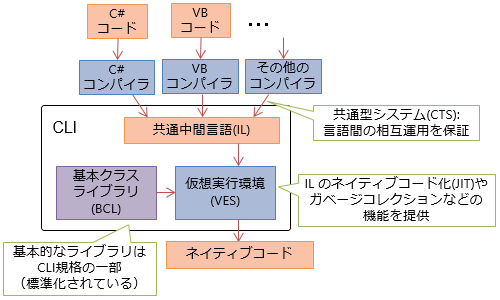
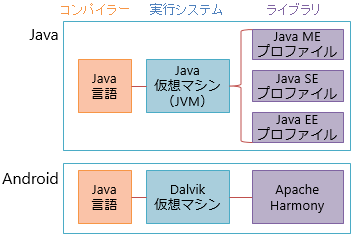
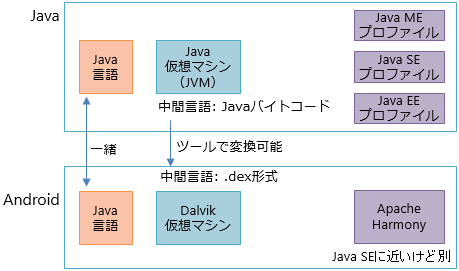
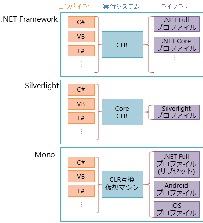
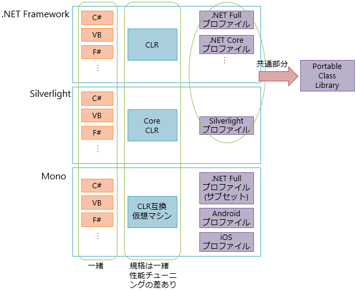

# 実行基盤

##  概要

（書きかけ）

MS 実装の名前「.NET Framework」、あるいは、標準規格の名前「CLI（Common Language Infrastructure）」とは。

* 中間言語（IL: Intermediate Language）仕様と、その中間言語を生成するコンパイラー

* 中間言語を解釈して実行する下層実行システム（VES: Virtual Execution System）

* 基礎ライブラリ（BCL: Base Class Library）

##  CLI

IL（メタデータ含めて）、VES、BCL それぞれの意味合いを

共通型システム

<figure>

<figcaption>CLI</figcaption>
</figure>

##  余談: Android は Java か？

とか言われる理由。
要は、「Java 言語だけど、実行システムもライブラリも Java じゃない」。

<figure>

<figcaption>Java と Android</figcaption>
</figure>

<figure>

<figcaption>Java と Android</figcaption>
</figure>

Write once, run anywhere しようと思ったら全部一致してないとダメ。
Java を名乗るためには互換性テストに通らないといけない。
「Java 言語だけど Java じゃない」状態。

これに対して、 .NET は？

<figure>

<figcaption>.NET</figcaption>
</figure>

<figure>

<figcaption>.NET</figcaption>
</figure>
