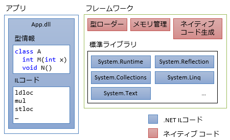
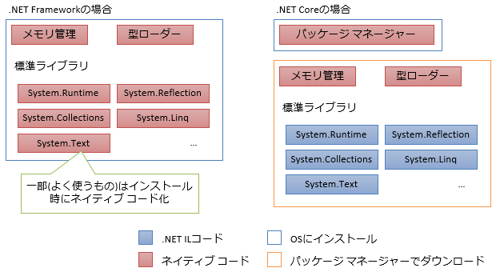
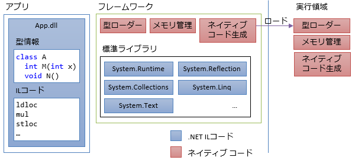
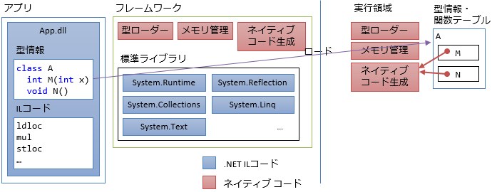
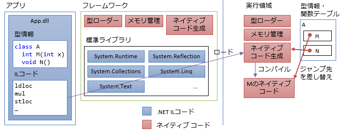
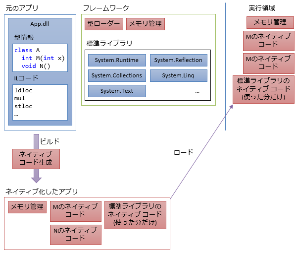

# JITコンパイル

##  概要

C# の実行方法の1つに、<strong id="jit" class="keyword">JIT</strong> (Just-In-Time: ちょうど必要になったときに)コンパイルという方式があります。

C# が登場して以来長らくの間、主流の実行方式はJITコンパイルでした。現在でも、デスクトップPCなどではこの実行方式をとります。C#※1の他では、Java※2もJIT方式です※3。JITコンパイルとまではいわないものの、スクリプト言語と呼ばれるようなプログラミング言語も、内部実装的にJITコンパイルに似たような仕組みを使っていたりもします。

- ※1 正確にはC#に加え、Visual BasicやF#など、.NETランタイム上で動かすプログラミング言語も
- ※2 こちらも正確にはJava仮想マシン上で動かすScalaなどの言語も
- ※3 Javaは、登場初期にはインタープリター方式という別の方式も使っていましたが、現在ではあまり使われません。

ここでは、JITコンパイルという方式がどのようなものかを説明していきます。

##  .NET上で実行

「C#は.NET Framework上で動かす」などと言われます。つまり、C#で書いたプログラムを動かすためには、下図のように、作ったアプリとは別にフレームワークが必要になります。

ここでいうフレームワークは、.NETの事なんですが、互換環境や新実装がいくつかあり、例えば以下のようなものがあります。

- .NET Framework: C#登場時点(2000年頃)からある、マイクロソフト実装のWindowsデスクトップ上で動くフレームワーク
- Mono: .NET Framework登場からほどなくして作られた、オープンソースで開発されている.NET Framework互換環境
- .NET Core: 2015年に登場した、マイクロソフト主導のオープンソースで開発されている新しいフレームワーク

フレームワークの用意の仕方は、.NET Frameworkと.NET Coreで少し異なります。

基本的には何らかのインストールが必要になります。.NET Frameworkは、アプリを動かす環境に、必要なものをすべて事前にインストールする必要があります。

一方で、.NET Coreの場合、インストールが必要なものはパッケージ マネージャーという部分だけです。パッケージ マネージャーは非常に小さいプログラムなので、仰々しいインストールをしなくても、アプリと一緒に配ったり、必要になったときにネットからダウンロードしてくればいいでしょう。残りの部分は、そのパッケージ マネージャーがパッケージ管理サーバーから探して自動的にダウンロードします。

(この辺りの詳細は別ページで書くかも)

いずれにせよ、フレームワークは以下のようなものを含みます。

- メモリ管理: [ヒープ](../../computer/essential-software/memorymanagement.md#heap)領域の確保・解放を管理します。
- 型ローダー: アプリ内にどういうクラスやどういうメソッドがあるかという情報を読みだします。
- ネイティブ コード生成: [IL](../../il/index.md)からネイティブ コードを生成します。
- 標準ライブラリ: 「このバージョンのフレームワークをインストールすれば必ず使える」という保証のあるライブラリです。ネイティブ コードで実装されいている部分も、ILで実装されている部分もあります。

##  JITコンパイル

JITコンパイル方式では、Just-In-Timeという名前通り、必要になるまでアプリのコードは読み込まれません。アプリを起動した直後には、下図のように、メモリの実行領域には、フレームワーク側のコードだけが読み込まれていて、アプリのコードはありません。

アプリのコードは必要になったときに初めて読み込まれます。例えば、`A`というクラスの`M`というメソッドが呼ばれたとします。ここでは、`A`というクラスも初めて出てきたので、まず、`A`の型情報が読み込まれます。このとき、メモリ上には関数テーブル※と呼ばれるものが作られます。

- ※ 関数テーブル(function table)の他、仮想関数テーブル(virtual function table)、仮想メソッド テーブル(virtual method table)などと呼ばれます。あるいはvirtual function/method tableをVTなどと略す書き方もよくします。

関数テーブルには、「このメソッドを呼ばれた時には、実行領域のこの部分を呼び出せ」というような、ジャンプ先の情報(メモリ アドレス)が入ります。初期状態では、ジャンプ先として、「ネイティブ コード生成」のコードを指しています。これによって、「メソッド`M`の初回呼び出し時に、`M`をネイティブ コード化するコードが実行される」というような状態になっています。

続いて、実際にメソッド`M`の呼び出しが行われます。前述のとおり、関数テーブルの初期状態を参照した結果、メソッド`M`のネイティブ コード生成が行われます。結果として、下図のような状態になります。

そして、ネイティブ コード化されたMのコードが実際に呼び出されます。2回目の呼び出し以降は、直接このネイティブ コードが呼ばれます。

ここまで来れば、「Just-In-Time(必要になったちょうどその時に)コンパイルされている」という感覚がわかるでしょうか。クラスやメソッドなどを初めて使う瞬間にコンパイルが走ります。2回目以降の利用はかなり高速に動作できます。

##  AOTコンパイル

JITコンパイル方式にはそれなりにメリットがあるからこそこの方式を使うわけですが、万能でもなく、事前に全部ネイティブ コード化してしまいたい場面もあります。通常はJITコンパイル実行するものを、普通に全部事前コンパイルすることを、JITとの対比で、<strong id="aot" class="keyword">AOT</strong>(Ahead-Of-Time: その時が来る前に)コンパイルと言ったりします。

JIT コンパイル方式のフレームワークでも、結局最後にはネイティブ コード化して実行することになるわけで、ネイティブ コード生成のタイミングを変えるだけでAOTコンパイルを実現できたりはします。要するに、下図のような状態です。

JITコンパイル方式の利点を以下の表にまとめます。

<table>
<tr>
<th>JITの利点</th><th>その利点が働きにくくなる場面</th>
</tr>
<tr>
<td>セキュリティが担保しやすい</td>
<td>他の仕組み(ストアでの審査など)でセキュリティが担保できる。あるいは、開発者自身が使う場合など、そもそもセキュリティ担保が不要な場面もある</td>
</tr>
<tr>
<td>C#→ILのコンパイルはかなり早い</td>
<td>デバッグ時はJIT方式で実行して動作確認し、最終製品にはAOT方式を使うというような対処が可能</td>
</tr>
<tr>
<td>依存するライブラリを更新しやすい</td>
<td>ライブラリの更新頻度はアプリよりもだいぶ低く、通常はアプリ更新のタイミングで一緒に更新すればいい。
ライブラリだけを更新する必要があるのはセキュリティ ホールがあった場合など、緊急の場面のみ。
この場合も、その時に1回コンパイルすればよく、JITが必須というわけではない</td>
</tr>
<tr>
<td markdown="1"> [リフレクション](../dynamic/sp_reflection.md#reflection) など、動的な処理がしやすい</td>
<td>動的な処理は元々実行速度が遅くなりがちなので避けることが多い。少し手間は増えるものの、AOTでも動的な処理が全くできないわけではない</td>
</tr>
</table>

こういう性質から、セキュリティ担保や動的処理の問題が避けれる状況ではAOT方式が好まれます。例えば、

- 出所が分からないアプリを実行する可能性のあるデスクトップ アプリでは、JIT方式がそれなりに有利
- ストア審査があるスマホ アプリでは、JIT方式が有利にならない。一方で、スマホは可能な限りスマホ上での処理を減らしたいので、動的な処理も元々避けがちで、AOT方式が有利

というような使い分けができます。
