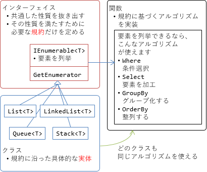

# クラスの機能拡張

## <a id="sec-generated-title-1"></a> <a id="abst"></a>概要

あるクラスに新しい機能を足したい場合にどうするべきかという話。

クラス自体にインスタンス メソッドを足すべきか、拡張メソッドを作るべきか。
どういうときに拡張メソッドを使うべきか。


##### <a id="sec-generated-title-2"></a>ポイント

* 拡張メソッドを使うと、クラスとメソッドが分離する。

* なので、分離する方がよければ拡張メソッド、そうでないなら普通にインスタンス メソッドとして実装すべき。

* 分離する方がよい場面: 実装者の分離、アセンブリの分離


## <a id="sec-generated-title-3"></a> <a id="how-to-extend"></a>新しい機能の追加

クラスに新しい機能を追加したいとします。
単に機能追加といっても、以下のように、いろいろな要件があったりします。

* クラス作者自身が機能追加するのか、他人がするのか。

* クラスと同じアセンブリ内で機能追加するのか。

* クラスの派生クラスでも新機能を使いたいか。


まず、いろいろ機能追加のやり方を示して、それぞれが上記の要件のうち何を満たせるかについて考えてみましょう。


### <a id="sec-generated-title-4"></a> <a id="in-class"></a>クラス自身に新メンバーを足す

例として、以下のようなクラスに、新メンバー、Norm() （x, y の二乗和を計算）を足してみましょう。

```csharp
class P
{
    public int X { get; set; }
    public int Y { get; set; }
}
```


単純に、このクラス自身を書き換えます。

```csharp
class P
{
    public int X { get; set; }
    public int Y { get; set; }

    public int Norm() { return X * X + Y * Y; }
}
```


一番シンプルで、まず第一に考えるべき方法です。
利点（○）、欠点（×）を以下に挙げます。

* <span class="pros-mark">○</span>クラスのフル機能が使える（private メンバー等にも触れれる）

* <span class="pros-mark">○</span>クラス内を探せばいいだけなので、定義場所を探すのが楽

* <span class="cons-mark">×</span>クラスを定義しているそのファイルを変更しなければならない

* <span class="cons-mark">×</span>クラス実装者（本人、チームメイトなど、権限ある人）が責任を持って追加しなければならない


### <a id="sec-generated-title-5"></a> <a id="partial"></a>クラス自身に新メンバーを足す（partial）

前節の X クラスが、例えば自動生成したコードだったとしましょう。
自動生成は最初の1回きりではなく、定期的にやるものとします。
この場合、X クラスを定義しているファイルは修正できません（修正しても、自動生成の際に修正内容が消える）。

そういうときに使うのが「[パーシャルクラス](../oop/oo_class.md#partial_class)」です。
まず、自動生成側にも、class キーワードの前に partial 修飾子を付けます。

```csharp
partial class P
{
    public int X { get; set; }
    public int Y { get; set; }
}
```


そして、別ファイルにて、以下のように、同じクラスに新メンバーを追加します。

```csharp
partial class P
{
    public int Norm() { return X * X + Y * Y; }
}
```


この方法を使うと、（プレーンなオブジェクトして作った）自動生成クラスに対して後からインターフェイスを差し込むというようなこともできます。

```csharp
interface IP
{
    int X { get; }
    int Y { get; }
}

partial class P : IP { } // 元の側に X, Y がすでにあるので、こちらでの実装は不要。
```


この方法は、ファイルを分けれるということ以外は、前節の方法を全く同じ扱いを受けます。
private なものも含めて、全メンバーにアクセスできる代わりに、アセンブリをまたぐことはできません（同一 exe/dll 内になければならない）。

* <span class="pros-mark">○</span>クラスのフル機能が使える（private メンバー等にも触れれる）

* <span class="cons-mark">×</span>クラス実装者（本人、チームメイトなど、権限ある人）が責任を持って追加しなければならない

* <span class="cons-mark">×</span>インターフェイスに対する操作を与えられない。


### <a id="sec-generated-title-6"></a> <a id="static"></a>静的メソッドでいいよ

正直なところ、クラスの public なメンバーを参照して何か値を計算するだけなら、静的メソッドで十分です。

```csharp
static class PUtil
{
    public static int Norm(P x) { return x.X * x.X + x.Y * x.Y; }
}
```


オブジェクト指向関係の論争ではよく槍玉に上がる static ですが…。
よくないのは static に状態を持つ（static フィールド、プロパティを読み書きする）ことなので、
状態を持たない static なメソッドは大体無害です。

* <span class="pros-mark">○</span>誰でも（クラス実装者以外も）、どこでも（アセンブリの外でも）機能追加できる

* <span class="pros-mark">○</span>インターフェイスに対しても操作を与えられる。

* <span class="cons-mark">×</span>public な部分にしか触れない

* <span class="cons-mark">×</span>クラスがわかれることで、定義場所を探しにくい

* <span class="cons-mark">×</span>呼び出し方が、<code>PUtil.Norm(x);</code>みたいになって不格好


### <a id="sec-generated-title-7"></a> <a id="extensions"></a>拡張メソッド

C# の場合、単なる静的メソッドを、インスタンス メソッドと同じ記法で呼びだせる機能があります。
すなわち、「[拡張メソッド](sp3_extension.md#exmethod)」。

```csharp
static class PExtensions
{
    public static int Norm(this X x) { return x.X * x.X + x.Y * x.Y; }
}
```


呼びだし方がインスタンス メソッドを同じ記法になる以外は、あくまでも単なる静的メソッドです。

* <span class="pros-mark">○</span>誰でも（クラス実装者以外も）、どこでも（アセンブリの外でも）機能追加できる

* <span class="pros-mark">○</span>インターフェイスに対しても操作を与えられる。

* <span class="pros-mark">○</span>インスタンス メソッドと同じ記法で呼びだせる

* <span class="cons-mark">×</span>public な部分にしか触れない

* <span class="cons-mark">×</span>クラスがわかれることで、定義場所を探しにくい（呼びだし部分に PExtensions というクラス名が出てこない分、なおのこと探しにくい）


### <a id="sec-generated-title-8"></a> <a id="inheritance"></a>継承

さて、ここから先は正直なところ、<em>かなりの下策</em>。

クラスの拡張というと、クラスの継承ですね。
つまり、派生クラスを作ってそこにメンバーを足す。

```csharp
class PEx : P
{
    public int Norm() { return X * X + Y * Y; }
}
```


これにはわかりやすい問題があって、別の派生クラスからはこの Norm メソッドを使えません。
かなり不便です。

```csharp
class PMarkII : P
{
    public int Z { get; set; }
	
	// この PMarkII からは Norm メソッドを使えない
}
```


継承は、以下のような場面で使うものであって、既存の完結したクラスに機能を追加するためのものではありません。

* インターフェイスや抽象クラスから複数の派生クラスを作って、多態的な動作を行う（ほとんどの場合、インターフェイスの利用を推奨）

* 複数のクラスの共通部分を切りだして、1つの基底クラスを作る（継承ではなくて包含で実現する方がいいことも多い）


「オブジェクト指向言語だから継承」みたいな安易な考え方は危険なので気を付けましょう。


### <a id="sec-generated-title-9"></a> <a id="cast"></a>型変換

もう1つ、「なくはない」方法。
（C# では普通やらないし、やっても大しておいしくない。
一方、他の言語ではたまにこれに類する方法を見る。）

1段階、型変換をはさんでしまうというもの。
例えば、以下のようなクラスを作ります。

```csharp
class PEx
{
    private readonly P _x;
    private PEx(P x) { _x = x; }
    // P からの型変換を用意
    public static implicit operator PEx(P x) { return new PEx(x); }

    public int Norm() { return _x.X * _x.X + _x.Y * _x.Y; }
}
```


そして、以下のように使う。

```csharp
var x = new P { X = 1, Y = 2 };
var norm = ((PEx)x).Norm();
Console.WriteLine(norm);
```


これをやるくらいなら拡張メソッドでいいじゃないという感じのものです。
言語によっては、キャスト式を書かなくても型推論で自動的に変換をかけてくれるものもあります。
が、Visual Studio 上でのコード補完のためにほぼリアルタイムで構文解析している C# では、あんまり変な型推論までするのは得策ではないので、
ここまでの自動型変換は将来的にも載ることはないと思われます。


## <a id="sec-generated-title-10"></a> <a id="why-exntensions"></a>拡張メソッドの使いどころ

機能拡張のやり方ですが、継承とか型変換でやるのはあまり筋がよくなくて、
結局、普通にインスタンス メソッドを足すか、拡張メソッドで作るかの2択になります。
この2つ利点・欠点の比較をまとめてみましょう。

<table summary="">

	<tr>
		<th>インスタンス メソッド</th>
		<th>拡張メソッド</th>
	</tr>
	<tr>
		<td markdown="1">クラスの記法がフルに使える</td>
		<td markdown="1">（結局のところ分離された赤の他人なので）public なメンバーしか触れない</td>
	</tr>
	<tr>
		<td markdown="1">分離ができない。クラス実装者が責任を持って機能追加する必要がある</td>
		<td markdown="1">分離できる。第三者が機能を実装できる</td>
	</tr>
	<tr>
		<td markdown="1">分離されないがゆえに、どこで定義されているかは探しやすい</td>
		<td markdown="1">分離されているがゆえに、定義場所を探しにくい</td>
	</tr>
	<tr>
		<td markdown="1">インターフェイスに対して実装を与えられない</td>
		<td markdown="1">インターフェイスに対しても実装を与えられる</td>
	</tr>
</table>


結局のところ、クラスとメソッドが分離されるかどうかという点が差のすべてで、
この分離を良しとするかどうかポイントです。
分離する必要がないなら、普通にインスタンス メソッドで実装しましょう。

従って、クラスとメソッドを分離すべき状況というものについて考える必要があります。


### <a id="sec-generated-title-11"></a> <a id="who-implement"></a>実装者がわかれる

クラスの実装者と違う人がクラスへの操作・アルゴリズムを作りたい時
規約とアルゴリズムは直交概念
普通、別の人が作りたくなるもの

<figure>

[](../../../../assets/media/ufcpp2000/csharp/fig/WhyExtensions1.png)

<figcaption>クラスの実装者と関数（メソッド）の実装者がわかれる例</figcaption>
</figure>


### <a id="sec-generated-title-12"></a> <a id="dependency"></a>アセンブリの依存解消

```csharp
class A
{
    public B ToB() { /* B への変換処理 */ }
}

class B
{
    public A ToA() { /* A への変換処理 */ }
}
```


循環参照あり（絵にする）

```csharp
class A { }

static class AExtensions
{
    public static B ToB(this A a) { /* B への変換処理 */ }
}

class B
{
    public A ToA() { /* A への変換処理 */ }
}
```


A の B への依存が消えて、循環しなくなる。
これで、A と B のアセンブリを分けれる。

実際、今、Type 型と TypeInfo 型がこんな関係。
GetTypeInfo()
System.Runtime と System.Reflection
