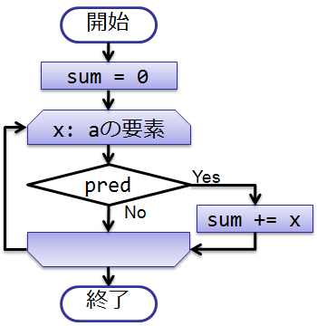
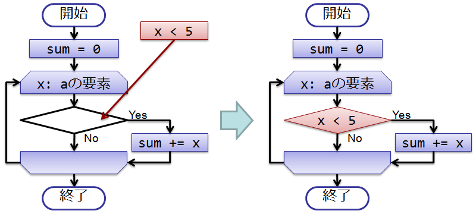
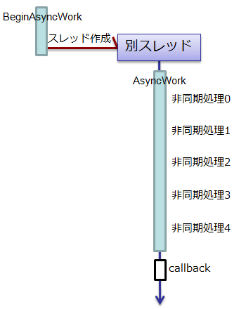
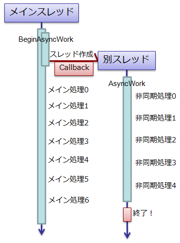
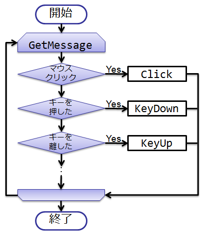
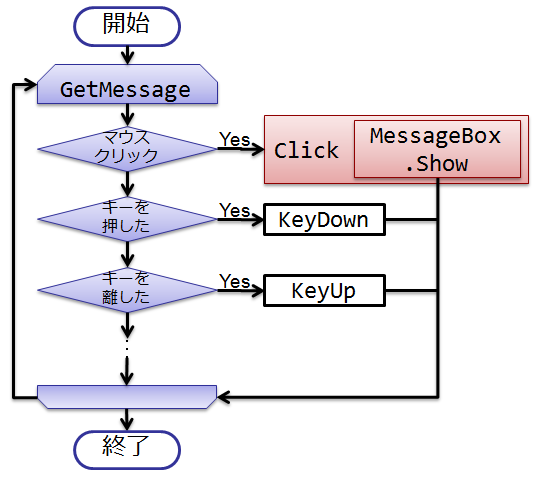

# \[雑記\] デリゲートの利用例

## <a id="sec-generated-title-1"></a> <a id="abst"></a>概要

「デリゲートのイメージがつかめない」って人が思った以上に多いようなので、
利用例をいくつか挙げて、図示してみることに。

一言でいうと、「何か処理を外から挿す」というのがデリゲートの役割。


## <a id="sec-generated-title-2"></a> <a id="predicate"></a>述語： 条件式を外から挿す

「[デリゲート](sp_delegate.md)」で書いたことをさらりともう一度。

特定の条件を満たすものだけを抽出するようなメソッドを書きたいとき、条件式をデリゲートにして引数に渡します。
（こういう、外から与える条件式を述語（predicate）と言ったりします。）

例えば、与えられた条件を満たすものの和を求めるメソッドは以下のように書けます。

```csharp
static int Sum(int[] a, Predicate<int> pred)
{
    int sum = 0;
    foreach (int x in a)
        if (pred(x))
            sum += x;
    return sum;
}
```


pred が「外から与える条件」です。
絵にすると以下のような感じ。

<figure>
	[](../../../../assets/media/ufcpp2000/csharp/fig/delegate1.png)
	<figcaption>条件を満たしたものの和を求める。</figcaption>
</figure>


「条件を外から与える」っていうのは、例えば以下のようにします。

```csharp
var sum = Sum(
    new[] { 1, 5, 3, 8 },
    x => x < 5);
```


この例の場合、「5より小さい」という条件を与えたことになります。
したがって、1, 5, 3, 8 の中から5より小さい 1, 3 だけが抽出され、その和である 4 が Sum の結果になります。
これも絵にすると以下のような感じ。

<figure>
	[](../../../../assets/media/ufcpp2000/csharp/fig/delegate2.png)
	<figcaption>条件「5よりも小さい」を与える。</figcaption>
</figure>


## <a id="sec-generated-title-3"></a> <a id="callback"></a>コールバック： 非同期処理の終了通知

マルチスレッドで複数の処理を同時に実行したりすると、
他のスレッドの終了のタイミングがつかめなくなります。
（「タイミングがつかめない」ってことを指して、こういう処理を非同期（acyncronous）処理と呼びます。）
（マルチスレッドに関しては「[マルチスレッド](../async/sp_thread.md)」参照。）

非同期処理の終了のタイミングで何かをしたい場合、
「処理が終わったらこのメソッドを呼んで欲しい」というものを他スレッド側に渡して呼び出してもらいます。
このような「他スレッドで呼び出して欲しいメソッド」をコールバック（callback）と言います。

例として、以下のようなプログラムを見てみましょう。
（<em>注意</em>: .NET 4 で Task クラスが導入されて以降、この例のような、BeginInvoke を使った非同期処理は書かなくなりました。
ただし、Task クラスを使う場合も、非同期処理や、そのコールバックにはデリゲートを使います。）

```csharp
using System;
using System.Threading;

public class Program
{
    static void Main()
    {
        // 非同期処理を開始。
        BeginAsyncWork(Callback);

        // 同時に別の処理もする。
        for (int i = 0; i < 7; i++)
        {
            // 0.8秒おきにメッセージ表示。
            System.Threading.Thread.Sleep(800);
            Console.WriteLine("メイン処理 {0}", i);
        }
    }
    static void BeginAsyncWork(AsyncCallback callback)
    {
        Action async = AsyncWork;
        async.BeginInvoke(callback, null);
    }
    static void AsyncWork()
    {
        for (int i = 0; i < 5; i++)
        {
            // 1秒おきにメッセージ表示。
            System.Threading.Thread.Sleep(1000);
            Console.WriteLine("非同期処理 {0}", i);
        }
    }
    static void Callback(IAsyncResult r)
    {
        Console.WriteLine("終了！");
    }
}
```


メインスレッド（Main 内の処理）では0.8秒に1回「メイン処理」の文字列を、
それとは別スレッド（AsyncWork 内）では1秒に1回「非同期処理」の文字列を表示しています。

BeginAsyncWork で、AsyncWork の非同期実行を開始しています。
前述のとおり、メインスレッド側ではいつ AsyncWork の処理が終わるのかわからないので、
コールバックを渡して、AsyncWork の実行が終わったら呼び出してもらいます。

<figure>
	[](../../../../assets/media/ufcpp2000/csharp/fig/delegate3.png)
	<figcaption>BeginAsyncWork</figcaption>
</figure>


今回の場合、コールバックとして、「終了！」という文字列を表示するメソッドを渡しています。

<figure>
	[](../../../../assets/media/ufcpp2000/csharp/fig/delegate4.png)
	<figcaption>BeginAsyncWork に Callback を渡す。</figcaption>
</figure>


ということで、出力結果は以下のような感じになります。

```console
メイン処理 0
非同期処理 0
メイン処理 1
非同期処理 1
メイン処理 2
非同期処理 2
メイン処理 3
メイン処理 4
非同期処理 3
メイン処理 5
非同期処理 4
終了！
メイン処理 6
```


## <a id="sec-generated-title-4"></a> <a id="event"></a>イベント処理

デリゲートといえばイベント処理（「[イベント](sp_event.md)」参照。）
詳しくは 「[イベント](sp_event.md)」 の方を読んでもらうとして、
ここでは GUI アプリのイベント処理がどんな感じで動いているかをイラストレーション。

ものすごい大雑把に模擬的な書き方をすると、GUI アプリってのは以下のような構造で動いています。
（メッセージループって言います。）

```csharp
Message msg;
while (GetMessage(out msg)) // OS から「マウスクリック」とかのメッセージが来てないか調べる。
{
    ProcessMessage(msg); // メッセージを処理。
}
```


ProcessMessage の中身も模擬的に書くと、以下のような感じ。

```csharp
void ProcessMessage(Message msg)
{
    if (msg == マウスクリック) MouseClick();
    else if (msg == キーを押した) KeyDown();
    else if (msg == キーを離した) KeyUp();
    以下略
}
```


ここで出てきた MouseClick とか KeyDown とかはデリゲートです。
「[イベント](sp_event.md#event)」になっていて、GUI ライブラリ利用者が任意のイベントハンドラーを外から挿せるようになっています。
図にすると以下のような感じ。

<figure>
	[](../../../../assets/media/ufcpp2000/csharp/fig/delegate5.png)
	<figcaption>メッセージループ。</figcaption>
</figure>


で、例えば、クリックされたときにメッセージボックスを出したいとします。
Windows Forms を使うなら、以下のようなコードを書きます。

```csharp
var form = new Form();
form.Click += (sender, e) => { MessageBox.Show("Click!"); };
```


その結果、メッセージループ内の Click のところで MessageBox.Show が呼び出されるようになります。

<figure>
	[](../../../../assets/media/ufcpp2000/csharp/fig/delegate6.png)
	<figcaption>クリックイベントを処理。</figcaption>
</figure>
