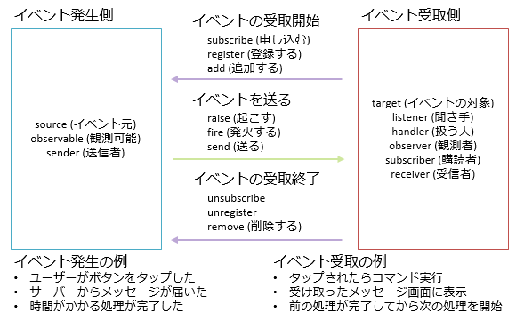

# 【雑記】イベントの購読とその解除

## <a id="sec-generated-title-1"></a> <a id="abst"></a>概要

C# の event 構文の問題と、その解消方法について説明します。


##### <a id="sec-generated-title-2"></a>サンプル

[https://github.com/ufcpp/UfcppSample/tree/master/Chapters/Event/Observable](https://github.com/ufcpp/UfcppSample/tree/master/Chapters/Event/Observable)


##### <a id="sec-generated-title-3"></a>ポイント

* イベントには発生側と受取側があって、発生側に受取側を登録する口が必要。

* C# の event 構文は、このイベント登録口を作るための構文。

* ただ、結構使いにくい。

* [Reactive Extensions](https://rx.codeplex.com/)使うのがいいんじゃないかな。


## <a id="sec-generated-title-4"></a> <a id="event-syntax"></a>イベント

まず、イベントについておさらい。
↓こういうの。「発生側」と「受取側」を明確に分離するためのパターン。

<figure>
	[](../../../../assets/media/1029/observableobserver.png)
	<figcaption>イベントの概要</figcaption>
</figure>


event source, observable, event sender, ... など、呼び方はいろいろありますが、流儀や文脈の差であって、だいたい同じものです。


### <a id="sec-generated-title-5"></a> <a id="revisit"></a>event 構文のおさらい

C# の場合、イベント発生側に「登録口」を作るための専用構文(以下、event 構文)を持っているわけですが。(参考: 「[イベント](sp_event.md)」)

```csharp
using System;
using System.Threading.Tasks;

class EventSource
{
    public event EventHandler<int> Progress; // 登録口

    private async Task RunAsync()
    {
        for (int i = 0; i < 100; i++)
        {
            await Task.Delay(100);
            Progress(this, i); // イベントを起こす
        }
    }
}

class EventSubscriber : IDisposable
{
    EventSource _source;

    public EventSubscriber(EventSource source)
    {
        _source = source;
        source.Progress += OnProgress; // 購読開始
    }

    // イベントを受け取って処理
    private void OnProgress(object sender, int i)
    {
        Console.WriteLine("進捗 " + i + "%");
    }

    public void Dispose()
    {
        _source.Progress -= OnProgress; // 購読解除
    }
}
```


以下のような挙動になります。

* 「イベントを起こす」の行: クラスの中からは、普通のデリゲートのように呼び出しができます(このデリゲート呼び出しによってイベントを送ります)。 (以下の、<code>+=</code>と<code>-=</code>はクラス内からでもできます。)

* 「購読開始」「購読解除」の行: クラスの外からは、<code>+=</code>で購読、<code>-=</code>でその解除ができます。 クラス内からとは違って、呼び出し(イベントを起こす)はできません。

* 購読開始から購読解除までの間、<code>EventSource</code>側で<code>Progress</code>を呼ぶたびに、<code>EventSubscribe</code>側の<code>OnProgress</code>が実行されます。


### <a id="sec-generated-title-6"></a> <a id="must-unsubscribe"></a>登録解除が必要

C# は、ガベージ コレクションというメモリの自動管理の仕組みを持っています(参考: 「[C# のメモリ管理](../resource/rm_gc.md)」)。
(C# に限らず多くの言語がそうですが) C# のガベージ コレクションは、「もう誰からも参照されていないオブジェクトがあったら消す」という仕組みで動いています。
逆に言うと、誰かが参照を持ち続けている限り、いつまでたってもメモリが解放されません。

そして、知らず知らずのうちに参照を持ってしまうことがある(= メモリが解放されなくなる)機能の際たるものが、イベント購読だったりします。
発生側から受取側にイベントを伝える都合上、必ず、発生側が受取側の参照を持ちます。
発生側の寿命が長くて、受取側の寿命が短い場合、イベント購読解除しないとメモリ リークが起きます。

メモリの自動管理を持っていないプログラミング言語でメモリの管理がものすごく大変なように、
場合によってはイベント購読管理も結構大変になります。
(メモリ管理と比べれば管理すべきオブジェクトの数が少ないのがせめてもの救い。
寿命に差があるときにだけ管理すればいいので、全然大変にならないこともあります。
それがかえって油断になるというか、管理し忘れを生みがちではあります。)


## <a id="sec-generated-title-7"></a> <a id="add-remove-issue"></a>問題1: add/remove

C# の event 構文では、イベント購読の開始・解除が <code>+=</code> と <code>-=</code> です。
(あるいは、コンパイル結果的には addX, removeX というようなメソッドが生成されています。)
他のプログラミング言語でも、addListener/removeListener とか、addTarget/removeTarget とかいう名前のメソッドをよく見かけます。
つまり、add/remove というメソッドのペアで、購読開始と解除をやります。

これで何が問題かというと、add で渡したものと同じものを remove に渡さないといけないという点です。
当たり前のようで、匿名関数(ラムダ式)を多用する今の C# 的には結構きつかったりします。

```csharp
using System;

class AnonymousFunctionProbrem
{
    public event Action X;

    private void RaiseX() => X?.Invoke();

    public void IncorrectSample()
    {
        // 購読開始
        X += () => Console.WriteLine("X");

        // 数回、イベントを起こしてみる
        for (int i = 0; i < 5; i++) RaiseX();

        // 購読解除は、これだと実はできてない
        // () => ... の部分が、それぞれ別オブジェクトになってて、remove できない
        // というか、2か所に書かせるな
        X -= () => Console.WriteLine("X");

        // このイベントは受け取ってしまう。
        for (int i = 0; i < 5; i++) RaiseX();
    }

    public void CorrectSample()
    {
        // こうすればいい。のだけど…
        // どこにでも書けるのが匿名関数(ラムダ式)のいいところなのに、そのよさが台無し
        Action handler = () => Console.WriteLine("X");

        X += handler;

        for (int i = 0; i < 5; i++) RaiseX();

        X -= handler;

        // ちゃんと購読解除されてる
        for (int i = 0; i < 5; i++) RaiseX();
    }
```


この問題の原因は add/remove (<code>+=</code>/<code>-=</code>)のペアでイベント購読をやっているせいです。
解決策として簡単なのは、イベント購読解除側を IDisposable にしてしまう方法。

```csharp
using System;
using System.Reactive.Disposables;

class SubscribeAnonymousFunctionProbrem
{
    public event Action X;

    public IDisposable SubscribeX(Action handler)
    {
        X += handler;
        return Disposable.Create(() => X -= handler);
    }

    private void RaiseX() => X?.Invoke();

    public void CorrectSample()
    {
        // 購読解除は Dispose でやればいい
        using (SubscribeX(() => Console.WriteLine("X")))
        {
            for (int i = 0; i < 5; i++) RaiseX();
        }

        // ちゃんと購読解除されてる
        for (int i = 0; i < 5; i++) RaiseX();
    }
}
```


## <a id="sec-generated-title-8"></a> <a id="parameter-issue"></a>問題2: メソッドの引数に渡せない

event 構文で作った「イベント登録口」は、「オブジェクトでもメソッドでもない」というのが結構困りものになります。
一番きついのが、メソッドの引数として渡せないことでしょう。

例えば、以下の例では、ボタンに対して「1回クリックされるのを待つ Task を作る」というような処理をしています。

```csharp
// ボタンのクリックを1回受け取るまで待ちたい
public static Task FirstClickAsync(this Button x)
{
    var tcs = new TaskCompletionSource<bool>();
    RoutedEventHandler handler = null;
    handler = (sender, arg) =>
    {
        x.Click -= handler;
        tcs.TrySetResult(false);
    };
    x.Click += handler;
    return tcs.Task;
}
```


これ自体はいいんですが、次に、同じような処理をダブルクリックのイベントでやりたくなったとします。
同じようなコードをもう1つ書く必要があります。

```csharp
// ボタンのダブルクリックを1回受け取るまで待ちたい
// FirstClickAsync とほとんど同じなのに…
public static Task FirstDoubleClickAsync(this Button x)
{
    var tcs = new TaskCompletionSource<bool>();
    MouseButtonEventHandler handler = null;
    handler = (sender, arg) =>
    {
        x.MouseDoubleClick -= handler;
        tcs.TrySetResult(false);
    };
    x.MouseDoubleClick += handler;
    return tcs.Task;
}
```


残念ながら、この2つのコードは、ほとんど見た目が同じなのに、処理を共通化できません。
他にも、右クリック、ボタン長押し、フリック、… などなど、種類を増やしたくなった場合、そのすべてに対して同じコードを書く必要があります。

そうなってしまう原因は、イベントがメソッドの引数として渡せないことにあります。
希望を言うなら以下のようなことができればよかったんですが、これはできません。

```csharp
// こんな感じのコードが書けたらよかったのにな(もちろん無理。コンパイル エラー)
public static Task FirstAsync<TEventHandler>(this event TEventHandler x)
{
    var tcs = new TaskCompletionSource<bool>();
    TEventHandler handler = null;
    handler = (sender, arg) =>
    {
        x -= handler;
        tcs.TrySetResult(false);
    };
    x += handler;
    return tcs.Task;
}
```


この問題の解決策は、1段階、以下のようなクラスを作ってラップしてしまうことです。
event 構文を直接使うのをやめる。

```csharp
using System;
using System.Reactive.Disposables;

// イベントの登録口。
public interface IEvent<TArg>
{
    IDisposable Subscribe(EventHandler<TArg> handler);
}

// イベントの登録口の実装 + イベントを起こす機能。
public class Event<TArg> : IEvent<TArg>
{
    event EventHandler<TArg> e;

    public IDisposable Subscribe(EventHandler<TArg> handler)
    {
        e += handler;
        return Disposable.Create(() => e -= handler);
    }

    public void Raise(object sender, TArg arg) => e?.Invoke(sender, arg);
}
```


つまり、Button クラスに以下のようであってほしい。

```csharp
class Button
{
    public IEvent<RoutedEventArgs> Click => _click;
    private Event<RoutedEventArgs> _click = new Event<RoutedEventArgs>();

    public IEvent<MouseButtonEventArgs> MouseDoubleClick => _mouseDoubleClick;
    private Event<MouseButtonEventArgs> _mouseDoubleClick = new Event<MouseButtonEventArgs>();
}
```


これなら、どんなイベントであろうと、1つのメソッドで共通処理を書けます。
先ほどの「イベントを1回受け取るまで待ちたい」という例であれば、以下のように書けます。

```csharp
public static Task FirstAsync<TArg>(this IEvent<TArg> x)
{
    var tcs = new TaskCompletionSource<bool>();
    IDisposable subscription = null;
    subscription = x.Subscribe((sender, arg) =>
    {
        subscription.Dispose();
        tcs.TrySetResult(false);
    });
    return tcs.Task;
}
```


## <a id="sec-generated-title-9"></a> <a id="event-internal"></a>問題3: 結構中身が大げさ

C# の event 構文では、add/remove 句を書かなかった場合、コンパイラーが自動的に add/remove の中身を実装してくれます。
この中身の自動実装が、実は結構大変なものだったりします。

イベントの購読開始・解除は、複数のスレッドから同時に行われることがあります。
そのため、C# の言語仕様では、event 構文の自動実装に、スレッド安全性を求めています。
現在のマイクロソフト製 C# コンパイラーによる実装は以下の通りです。

以下のようなイベントを書いたとします。

```csharp
using System;

class EventInternal
{
    public event EventHandler X;
}
```


自動実装の結果は以下のようなものになります。

```csharp
using System;
using System.Threading;

class SameAsEventInternal
{
    private EventHandler _X;

    public event EventHandler X
    {
        add
        {
            EventHandler x2;
            var x1 = _X;
            do
            {
                x2 = x1;
                var x3 = (EventHandler)Delegate.Combine(x2, value);
                x1 = Interlocked.CompareExchange(ref _X, x3, x2);
            }
            while (x1 != x2);
        }
        remove
        {
            EventHandler x2;
            var x1 = _X;
            do
            {
                x2 = x1;
                var x3 = (EventHandler)Delegate.Remove(x2, value);
                x1 = Interlocked.CompareExchange(ref _X, x3, x2);
            }
            while (x1 != x2);
        }
    }
}
```


軽く説明すると、スレッド安全性を保証しつつ、実行性能を落とさないようにする工夫の結果、こんな大変なコードになりました。
昔の C# コンパイラーはもっとシンプルなコードを生成していましたが、性能上の問題などがあって、現在はこんな風になっています。
「実行性能を落とさないスレッド安全保証は難しい」ということです。

そして問題は、イベントを1つ作るたびに全部これと同種のコードが生成されるということです。
まあ、前節で紹介したような、1段階 <code>Event</code> クラスを挟んでしまう方法を使うなら、この問題はなくなります
(コード生成される箇所は1か所だけになる)。


## <a id="sec-generated-title-10"></a> <a id="rx"></a>Reactive Extensions

event 構文に関して、いくつかの問題の説明と、
その解決策として IEvent インターフェイス、Event クラスというものを作ってみました。
まあ、実は Event クラスを自作する必要はなかったんですが。
この手の、event 構文の問題を解消できるライブラリなら、実はすでにあります。

[Reactive Extensions](https://rx.codeplex.com/) (通称 Rx)というもので、.NET Framework 同梱ではないものの、マイクロソフトが提供しているライブラリです
([NuGet パッケージ マネージャー](http://www.atmarkit.co.jp/fdotnet/chushin/nuget_01/nuget_01_01.html)を使えば簡単に使えます)。
Reactive (反応がある、反応性がよい)の名前通り、受動的にメッセージを受け取って、それに反応して何らかの処理を動かすためのライブラリです。
イベント処理は、こういう、reactive な処理の一種なので、イベント処理にも有用です。

Rx は、先ほど実装したような Event に相当するようなものを持っています。
Subject クラス(System.Reactive.Subjects 名前空間)が、同じ用途に使えます。
(ちなみに、IEvent に相当するようなものは、.NET の標準ライブラリに最初からあったりします。IObservable インターフェイス(System 名前空間)。)
さきほどの、「Button クラスがこうだったらよかったのに」コードは、Rx を使って書くなら以下のようになります。

```csharp
class Button
{
    public IObservable<RoutedEventArgs> Click => _click;
    private Subject<RoutedEventArgs> _click = new Subject<RoutedEventArgs>();

    public IObservable<MouseButtonEventArgs> MouseDoubleClick => _mouseDoubleClick;
    private Subject<MouseButtonEventArgs> _mouseDoubleClick = new Subject<MouseButtonEventArgs>();
}
```
