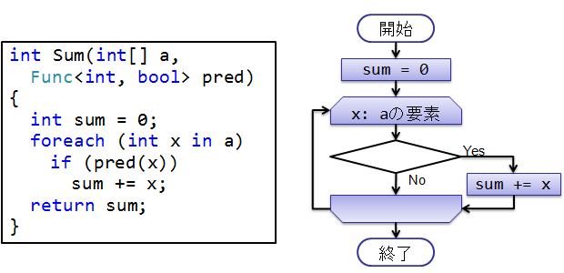
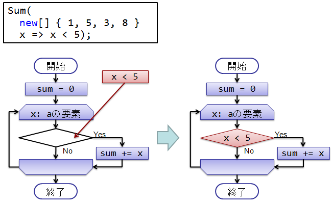
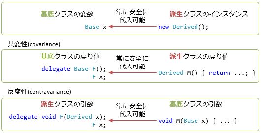

# デリゲート

## <a id="sec-generated-title-1"></a> <a id="abst"></a>概要

<strong id="delegate" class="keyword">デリゲート</strong>（delegate: 代表、委譲、委託）とは、メソッドを参照するための型です。
C言語やC++言語の勉強をしたことがある人には、
「デリゲートとは関数ポインターや関数オブジェクトをオブジェクト指向に適するように拡張したもの」
と言った方が分かりやすいかもしれません。

デリゲートは用途も関数ポインターとほとんど同じで、
述語やイベントハンドラ(「[イベント](sp_event.md)」で説明)等に利用します。
ただし、C言語の関数ポインターと違い、
インスタンスメソッドを参照したり、
複数のメソッドを同時に参照する事が出来ます。

delegate（委譲）という言葉のニュアンスとしては、
「他のメソッドに処理を丸投げするためのオブジェクト」というような意味です。
イベントが起きたときのイベントハンドリングをどのメソッドに丸投げ（委託）するかを指示するためなどに使われます。


##### <a id="sec-generated-title-2"></a>ポイント

* C# では、メソッドも他の型と同じように扱えます（変数に代入して使ったり、他のメソッドの引数や戻り値にしたりできる）。
* デリゲート： メソッドを代入するための変数の型。
* 例： `delegate int DelegateName(int x, int y);`


## <a id="sec-generated-title-3"></a> <a id="definition"></a>デリゲートの定義

<em>デリゲートとはメソッドを参照するための型です</em>。
要するに、<code>A</code> という名前のメソッドとデリゲート型の変数 <code>a</code> があったとすると、
<code>a = A;</code> というような意味合いの事を実現するのがデリゲートです。

デリゲートを使用するためにはまず、デリゲート型を定義します。
デリゲート型の定義は以下のように、<code>delegate</code> キーワードを用いて行います。

```csharp
delegate 戻り値の型 デリゲート型名(引数リスト);
```


このようにして定義したデリゲート型は、ユーザ定義のクラスや構造体と同じ1つの“型”として扱われます。
また、デリゲート型は自動的に <code>System.Delegate</code> クラスの派生クラスになります。

デリゲート型の変数には、
デリゲートの定義時に指定した物と同じ戻り値と引数リストを持つメソッドを代入する事が出来ます。
例えば、<code>delegate void SomeDelegate(int a); </code> と定義したデリゲート型には、
<code>int</code> 型の引数を1つ取り、何も値を返さないメソッドを代入できます。
そして、デリゲートに格納されたメソッドは、デリゲートを介して呼び出すことが出来ます。
以下にデリゲートの使用例を示します。

```csharp
using System;

// SomeDelegate という名前のデリゲート型を定義
delegate void SomeDelegate(int a);

class DelegateTest
{
  static void Main()
  {
    // SomeDelegate型の変数にメソッドを代入。
    SomeDelegate a = new SomeDelegate(A);

    a(256); // デリゲートを介してメソッドを呼び出す。
            // この例では A(256) が呼ばれる。
  }

  static void A(int n)
  {
    Console.Write("A({0}) が呼ばれました。\n", n);
  }
}
```


```console
A(256) が呼ばれました。
```


<h5 class="version version2">Ver. 2.0</h5>

C# 1.1 までは、
<code>
        SomeDelegate a = <span class="reserved">new</span> SomeDelegate(A);
      </code>
と言うように、new が必要でしたが、
C# 2.0 からは、
<code>SomeDelegate a = A;</code>
と言うように、メソッドからデリゲートへの暗黙の変換が出来るようになりました。

```csharp
using System;

// SomeDelegate という名前のデリゲート型を定義
delegate void SomeDelegate(int a);

class DelegateTest
{
  static void Main()
  {
    SomeDelegate a = A; // 暗黙にSomeDelegate型に変換。
    a(256);
  }

  static void A(int n)
  {
    Console.Write("A({0}) が呼ばれました。\n", n);
  }
}
```


## <a id="sec-generated-title-4"></a> <a id="function"></a>デリゲートの機能

これまでに述べたように、デリゲートにはメソッドを参照し、
間接的なメソッド呼び出しを行う機能があります。
この機能はC言語でも関数ポインターというものを用いることで実現できますが、
C# のデリゲートにはさらに高度な機能があります。


### <a id="sec-generated-title-5"></a> <a id="instancemethod"></a>インスタンスメソッドの代入

デリゲートにはクラス(static)メソッドとインスタンス(非static)メソッドのどちらでも代入する事が出来ます。

```csharp
using System;

/// <summary>
/// メッセージを表示するだけのデリゲート
/// </summary>
delegate void ShowMessage();

class Person
{
  string name;
  public Person(string name){this.name = name;}
  public void ShowName(){Console.Write("名前: {0}\n", this.name);}
};

class DelegateTest
{
  static void Main()
  {
    Person p = new Person("鬼丸美輝");

    // インスタンスメソッドを代入。
    ShowMessage show = new ShowMessage(p.ShowName);

    show();
  }
}
```


```console
名前: 鬼丸美輝
```


### <a id="sec-generated-title-6"></a> <a id="multicast"></a>複数のメソッドを代入

デリゲートには <code>+=</code> 演算子を用いることで、複数のメソッドを代入する事が出来ます。
複数のメソッドを代入した状態で、デリゲート呼び出しを行うと、代入した全てのメソッドが呼び出されます。
このように、複数のメソッドを格納した状態のデリゲートのことを<strong id="malticast" class="keyword">マルチキャストデリゲート</strong>と呼びます。

```csharp
using System;

/// <summary>
/// メッセージを表示するだけのデリゲート
/// </summary>
delegate void ShowMessage();

class DelegateTest
{
  static void Main()
  {
    ShowMessage a = new ShowMessage(A);
    a += new ShowMessage(B);
    a += new ShowMessage(C);

    a();
  }

  static void A(){Console.Write("A が呼ばれました。\n");}
  static void B(){Console.Write("B が呼ばれました。\n");}
  static void C(){Console.Write("C が呼ばれました。\n");}
}
```


```console
A が呼ばれました。
B が呼ばれました。
C が呼ばれました。
```


もちろん、クラスメソッドとインスタンスメソッドを混ぜて、複数のメソッドを代入することも出来ます。

```csharp
using System;

/// <summary>
/// メッセージを表示するだけのデリゲート
/// </summary>
delegate void ShowMessage();

class Person
{
  string name;
  
  public Person(string name){this.name = name;}

  public void ShowName(){Console.Write("名前: {0}\n", this.name);}
};

class DelegateTest
{
  static void Main()
  {
    Person p1 = new Person("鬼丸美輝");
    Person p2 = new Person("神無月めぐみ");

    ShowMessage show = new ShowMessage(p1.ShowName);
    show += new ShowMessage(p2.ShowName);
    show += new ShowMessage(A);
    show += new ShowMessage(B);

    show();
  }

  static void A(){Console.Write("A が呼ばれました。\n");}
  static void B(){Console.Write("B が呼ばれました。\n");}
}
```


```console
名前: 鬼丸美輝
名前: 神無月めぐみ
A が呼ばれました。
B が呼ばれました。
```


ちなみに、マルチキャストデリゲートの呼び出しは、<code>+=</code> で代入した順に<em>逐次実行されます（並列実行はされません）</em>。

### <a id="sec-generated-title-7"></a> <a id="async"></a>非同期呼び出し

かつては、デリゲート型に対して `BeginInvoke`/`EndInvoke` という形で非同期呼び出しをする機構がありました。

現在では[非同期処理をしたい場合には `Task` クラスを使う](../async/sp_thread.md)のが一般的になっていて、 `BeginInvoke`/`EndInvoke` は非推奨になっています。(↓一応過去の記事の痕跡。)

<span class="expand-button" title="展開/折畳">（Begin/EndInvoke を利用する例）</span>
<div class="expand-panel" markdown="1" title="（Begin/EndInvoke を利用する例）">

デリゲート呼び出しは非同期に行うことも出来ます。
通常、メソッドを呼び出すとメソッド内の処理が完了するまで呼び出し元には戻ってきません。
このような動作を<em>同期呼び出し</em> (Synchronous Call) と呼びます。
それに対して、<strong id="asynchronous" class="keyword">非同期呼び出し</strong> (Asynchronous Call) とは、
メソッドを呼び出した瞬間に呼び出し元に処理が戻ってくるような呼び出しのことです。
デリゲートの非同期呼び出しをすると、
デリゲートを介して呼び出されるメソッドの処理と、呼び出し元の処理が平行して行われることになります。
(このような平行した動作については「マルチスレッド」で詳しく説明します。)

デリゲート型を定義すると、
C# コンパイラによって自動的に <code>BeginInvoke</code> と <code>EndInvoke</code> というメソッドが生成されます。
この <code>BeginInvoke</code> を用いることにより非同期呼び出しを開始し、
<code>EndInvoke</code> を用いることにより非同期処理の終了を待つ事が出来ます。

<code>BeginInvoke</code> は、デリゲート型の定義時に引数リストで指定した引数と、<code>System.AsyncCallback</code> デリゲート型の引数および <code>object</code> 型の引数をとり、<code>System.IAsyncResult </code> インターフェース型の値を返します。
また、
<code>EndInvoke</code> はデリゲート型の定義時に <code>ref</code> または <code>out</code> キーワードを付けた引数および <code>System.IAsyncResult </code> インターフェース型の引数を持ち、デリゲートの戻り値と同じ型の戻り値を持ちます。
例えば、<code>delegate int ShowMessage(int n, ref int p, out int q);</code> というデリゲート型を定義した場合、以下のようなメソッド定義になります。

```csharp
IAsyncResult BeginInvoke(
  int n, ref int p, out int q, AsyncCallback callback, object state);
int EndInvoke(ref int p, out int q, IAsyncResult ar);
```


以下に非同期デリゲート呼び出しの例を挙げます。

```csharp
using System;
using System.Threading;

namespace A
{
  /// <summary>
  /// メッセージを表示するだけのデリゲート
  /// </summary>
  public delegate void ShowMessage(int n);

  public class DelegateTest
  {
    static void Main()
    {
      const int N = 6;
      ShowMessage asyncCall = new ShowMessage(AsynchronousMethod);

      // asyncCall を非同期で呼び出す。
      IAsyncResult ar = asyncCall.BeginInvoke(N, null, null);

      // ↓この部分は asyncCall によって呼び出されるメソッドと同時に実行されます。
      for(int i=0; i<N; ++i)
      {
        Thread.Sleep(600);
        Console.Write("Main ({0})\n", i);
      }

      // asyncCall の処理が終わるのを待つ。
      asyncCall.EndInvoke(ar);

      Console.Write(" 処理完了\n");
    }

    static void AsynchronousMethod(int n)
    {
      for(int i=0; i<n; ++i)
      {
        Thread.Sleep(1000);
        Console.Write("AsynchronousMethod ({0})\n", i);
      }
    }
  }
}
```


```console
Main (0)
AsynchronousMethod (0)
Main (1)
Main (2)
AsynchronousMethod (1)
Main (3)
Main (4)
AsynchronousMethod (2)
Main (5)
AsynchronousMethod (3)
AsynchronousMethod (4)
AsynchronousMethod (5)
処理完了
```


ちなみに、BeginInvoke によるデリゲートの非同期呼び出しは、
内部的には「[スレッド プール](../async/misc_task.md#key_thread_pool)」を使っています。

マルチキャストデリゲートの非同期呼び出しは実行時エラーになります。
（マルチキャストデリゲートは並列実行のための機能ではありません。
並列実行には Thread や Task クラスを用います。）

</div>

今でも `BeginInvoke`/`EndInvoke` 自体は残っているんですが、呼び出しすると `PlatformNotSupportedException` 例外を起こしたりします。
(というか、もはや相当古い .NET ランタイムでしか正常に実行できません。)

## <a id="sec-generated-title-8"></a> <a id="use"></a>デリゲートの用途

デリゲートの用途はいろいろありますが、
ここでは例として、述語と言うものを紹介します。


（デリゲートがもっともよく使われる場面は「イベントハンドラ」というものなんですが、
イベントハンドラに関しては、「[イベント](sp_event.md)」で説明します。）


### <a id="sec-generated-title-9"></a> <a id="pred"></a>述語

述語という言葉は「××は○○である」という文章の「○○である」の部分を指します。
プログラミングの世界では、
あるオブジェクト x が「x は○○である」という条件を満たすかどうかを調べるメソッドのことを<em>述語</em>（predicate）と呼びます。

ここでは例として、配列の中から特定の条件を満たすものだけを取り出すことを考えます。
条件が始めから決まっているなら話は簡単です。
例えば、整数の配列の中から値が10より大きいものだけを取り出す場合、
以下のようなコードで実現できます。

```csharp
static int[] Select(int[] x)
{
  int n=0;
  foreach(int i in x) if(i > 10) ++n;

  int[] y = new int[n];
  n=0;
  foreach(int i in x)
    if(i > 10)
    {
      y[n] = i;
      ++n;
    }

  return y;
}
```


それでは、このコードを任意の条件に対して適用できるようにするため、
述語を使って拡張してみましょう。
まず、述語用のデリゲート型を定義します。

```csharp
/// <summary>
/// 整数 n がある条件を満たすときだけ true を返すデリゲート。
/// </summary>
delegate bool Predicate(int n);
```


そして、先ほどのコードを以下のように書き換えます。

```csharp
static int[] Select(int[] x, Predicate pred)
{
  int n=0;
  foreach(int i in x)
    if(pred(i)) ++n;

  int[] y = new int[n];

  n=0;
  foreach(int i in x)
    if(pred(i))
    {
      y[n] = i;
      ++n;
    }

  return y;
}
```


このメソッドを利用する際には、
述語用のメソッドを作り、デリゲート化して <code>Select</code> メソッドに渡します。

```csharp
using System;

delegate bool Predicate(int n);

class DelegateTest
{
  static void Main()
  {
    int[] x = new int[]{1, 8, 4, 11, 8, 15, 12, 19};

    // x の中から値が 10 以上のもだけ取り出す
    int[] y = Select(x, new Predicate(IsOver10));
    foreach(int i in y)
      Console.Write("{0}  ", i);
    Console.Write("\n");

    // x の中から値が (5, 15) の範囲にあるものだけ取り出す
    int[] z = Select(x, new Predicate(Is5to15));
    foreach(int i in z)
      Console.Write("{0}  ", i);
    Console.Write("\n");
  }

  static bool IsOver10(int n){return n > 10;}
  static bool Is5to15(int n){return (n > 5) && (n < 15);}

  /// <summary>
  /// x の中から条件 pred を満たすものだけを取り出す。
  /// </summary>
  /// <param name="x">対象となる配列</param>
  /// <param name="pred">述語</param>
  /// <returns>条件を満たすものだけを取り出した配列</returns>
  static int[] Select(int[] x, Predicate pred)
  {
    int n=0;
    foreach(int i in x)
      if(pred(i)) ++n;

    int[] y = new int[n];

    n=0;
    foreach(int i in x)
      if(pred(i))
      {
        y[n] = i;
        ++n;
      }

    return y;
  }
}
```


```csharp
11  15  12  19
8  11  8  12
```


イメージ的には下図のような感じです。

<figure>

[](../../../../assets/media/ufcpp2000/csharp/fig/predicate1.png)

<figcaption>述語としてのデリゲート</figcaption>
</figure>


メソッドの中では、pred に何が渡されてくるか全く関知しません。
pred は「呼び出し側から渡されるはずの何らかの条件」ということで、図中では空欄にしてあります。

<figure>

[](../../../../assets/media/ufcpp2000/csharp/fig/predicate2.png)

<figcaption>メソッドにデリゲートを渡す</figcaption>
</figure>


呼び出し側で、具体的な条件である <code>x &lt; 5</code>という式を与え、
図中の空欄を埋めます。


## <a id="sec-generated-title-10"></a> <a id="anonymous"></a>匿名関数

C# では、式中で、その場限りのメソッドを書くことができる<strong id="anonymous-func" class="keyword">匿名関数</strong>（anonymous function）という機能があります。

歴史的経緯から、匿名関数には、C# 2.0 で導入された匿名メソッド式という書き方と、
C# 3.0 で導入されたラムダ式という書き方があります。

（2.0 時代には匿名メソッド式しかなく、匿名メソッド式とラムダ式を合わせて「匿名関数」という総称が与えられたのも後のことです、用語としてはあまり定着していません。
ラムダ式のことを含めて匿名メソッドと呼ぶこともあります。）

詳細は別項の「[ローカル関数と匿名関数](fun_localfunctions.md)」でも説明しているのでそちらもご覧ください。

### <a id="sec-generated-title-11"></a> <a id="anonymous-method"></a>匿名メソッド式

<h5 class="version version2">Ver. 2.0</h5>

（このページが C# 2.0 の頃に書いたものにラムダ式を書き足しているので、匿名関数の説明が匿名メソッド式ベースで書かれています。
ただ、現在の C# 文化的にはラムダ式を使う方が好まれるのでご注意ください。
極端な話、匿名メソッド式の文法は覚える必要がないです。
ここの説明では匿名関数の概念だけ覚えて、文法としては次節のラムダ式を覚えてください。）

C# 2.0 から、<strong id="anonymous" class="keyword">匿名メソッド式</strong>（anonymous method expression）という物が導入されました。

C# 1.1 まででは、
デリゲートを使う際には、まず最初にどこかでメソッドを定義し、
その定義したメソッドを参照する必要がありました。
そのメソッドを1度きりしか使わない場合でも、必ずどこかで定義する必要があります。

これに対して、C# 2.0 では、
デリゲートを渡すものと期待される任意の箇所に、
直接、名前のないメソッドを記述できる仕組みが搭載されました。
この機能を匿名メソッドと呼びます。

例えば、前節のサンプルプログラムでは、
Select メソッドに渡すための述語メソッドとして、
IsOver10, Is5To15 という２つのメソッドを定義して使っていました。
この2つのメソッドを、匿名メソッド機能を用いて書き直すと、以下のようになります。

```csharp
using System;

delegate bool Predicate(int n);

class DelegateTest
{
  static void Main()
  {
    int[] x = new int[]{1, 8, 4, 11, 8, 15, 12, 19};

    // x の中から値が 10 以上のもだけ取り出す
    int[] y = Select(x,
      delegate(int n){ return n > 10; }
    );
    foreach(int i in y)
      Console.Write("{0}  ", i);
    Console.Write("\n");

    // x の中から値が (5, 15) の範囲にあるものだけ取り出す
    int[] z = Select(x,
      delegate(int n){ return (n > 5) && (n < 15); }
    );
    foreach(int i in z)
      Console.Write("{0}  ", i);
    Console.Write("\n");
  }

  // Select メソッドの実装は先ほどと同じなので省略
}
```


先ほどの例では
<code>
                  <span class="reserved">new</span> Predicate(IsOver10)
              </code>
と書いていた部分に、
<code>
                  <span class="reserved">delegate</span>(<span class="reserved">int</span> n){ <span class="reserved">return</span> n &gt; 10; }
              </code>
と、IsOver10 の中身そのものが書かれています。
匿名メソッドとは、このような、delegate キーワードから始めて、メソッドの中身を任意の箇所に埋め込んだ部分のことを指します。

```csharp
delegate (引数リスト){ メソッド定義 }
```


### <a id="sec-generated-title-12"></a> <a id="lambda"></a>ラムダ式

<h5 class="version version3">Ver. 3.0</h5>

C# 3.0 では、匿名関数をさらに簡便な記法で書けるようになりました。

C# 2.0 の記法では、以下のように書いていたものを、

```csharp
delegate(int n){ return n > 10; }
```


3.0 では以下のように書けるようになりました。

```csharp
(int n) => { return n > 10; }
```


変数の型が左辺値や関数の引数から推論できる場合にはさらに簡素化できて、以下のように書けます。

```csharp
Func<int, bool> f = n => { return n > 10; };
```


また、ラムダ式の中身が return 文1つだけの場合には、{} や return も省略できて、
以下のように書けます。

```csharp
Func<int, bool> f = n => n > 10;
```


このような記法を<strong id="lambda" class="keyword">ラムダ式</strong>（lambda expression）と呼びます。
ラムダ式は、実際には、「匿名関数として<em>も</em>使えるもの」で、
匿名メソッド式（匿名関数として<em>しか</em>使えない）よりも用途が広いです。
詳細は「[ラムダ式](sp3_lambda.md)」を参照。

ちなみに、匿名メソッド式で出来ることはラムダ式で全てできます。
もしも、ラムダ式の方を先に C# に導入されていたら、
C# 2.0 式の匿名メソッド式の記法は導入されなかったと思います。

### <a id="sec-generated-title-13"></a> <a id="csharp10"></a>C# 10.0 でのラムダ式

<h5 class="version version10">Ver. 10</h5>

C# 10.0 では以下のような書き方のラムダ式も書けるようになりました。

```csharp
var f = [A] static int? ([A] string? s) => s?.Length;
```

要点としては以下のような修正がありました。

* `var` で受け取れる (ラムダ式自体から型が決定できる)
* [属性](../dynamic/sp_attribute.md)や戻り値の型が指定できる

## <a id="sec-generated-title-14"></a> <a id="co-contra"></a>covariance と contravariance

<h5 class="version version2">Ver. 2.0</h5>

C# 1.1 以前、
デリゲートの戻り値・引数の型と、
それに代入するメソッドの戻り値・引数の型は完全に一致している必要がありました。
C# 2.0 では、
covariance と contravariance という2つの特別な場合において、
戻り値・引数の型が一部異なっていても（適切な継承関係があれば）
デリゲートにメソッドを代入できるようになりました。

ちなみに、covariance と contravariance という言葉は、
元々は圏論（category theory）という数学の分野(さらにたどるとテンソル代数とかテンソル解析が由来)の用語で、
それぞれ共変性・反変性と訳します。

まずはじめに、「[ダウンキャスト](../oop/oo_polymorphism.md#downcast)」の内容を思い出してみてください。
継承関係にある二つのクラス Base（基底クラス）と Derived（派生クラス）があった場合、
基底クラスへの変換、すなわち、
Derived 型の変数を Base 型に代入することは常に合法に行うことが出来ます。
ということは、メソッドの引数・戻り値に関しても、
Base 型の引数に対して Derived 型の変数を渡したり、
Derived 型を帰すメソッドの戻り値を Base 型の変数で受けることが合法ということになります。

```csharp
class Base {}
class Derived : Base {}

class DelegateTest
{
  static void Main()
  {
    Base xb;
    xb = BaseReturn();      // 型が完全一致。
    xb = DerivedReturn();   // 基底クラスへのキャストは合法。

    Derived xd = new Derived();
    DerivedParameter(xd);   // 型が完全一致。
    BaseParameter(xd);      // 基底クラスへのキャストは合法。
  }

  static Base    BaseReturn()    { return new Base(); }
  static Derived DerivedReturn() {return new Derived(); }

  static void BaseParameter(Base x) {}
  static void DerivedParameter(Derived x) {}
}
```


デリゲートの戻り値・引数の型と、
それに代入するメソッドの戻り値・引数の型の間に、
このような合法的な変換が成り立つ（適切な継承関係がある）場合には、
デリゲートへの代入を認めようというのが
covariance と contravariance です。



### <a id="sec-generated-title-15"></a> <a id="covariance"></a>covariance

基底クラスを戻り値とするデリゲートに対して、
派生クラスを戻り値とするメソッドを代入できることを
<strong id="covariance" class="keyword">covariance</strong> といいます。
（数学用語としては、「共変性」と訳します。
プログラミング用語としてはそのままコーバリアンスと呼ぶことが多いみたい。
→ 徐々に「共変性」という訳で定着してきたようです。）

```csharp
class Base {}
class Derived : Base {}

delegate Base DelegateBaseReturn();

class DelegateTest
{
  static void Main()
  {
    Base xb;
    xb = BaseReturn();      // 型が完全一致。
    xb = DerivedReturn();   // 基底クラスへのキャストは合法。

    DelegateBaseReturn db;
    db  = BaseReturn;       // 型が完全一致。
    db += DerivedReturn;    // 戻り値の型が違うけど、これも OK。
    xb = db();
  }

  static Base    BaseReturn()    { return new Base(); }
  static Derived DerivedReturn() {return new Derived(); }
}
```


### <a id="sec-generated-title-16"></a> <a id="contravariance"></a>contravariance

派生クラスを引数とするデリゲートに対して、
基底クラスを引数とするデリゲートを代入できることを
<strong id="contravariance" class="keyword">contravariance</strong> といいます。
（数学用語としては、「反変性」と訳します。
プログラミング用語としてはそのままコントラバリアンスと呼ぶことが多いみたい。
→ 徐々に「反変性」という訳で定着してきたようです。）

```csharp
using System;

class Base {}
class Derived : Base {}

delegate void DelegateDerivedParameter(Derived x);

class DelegateTest
{
  static void Main()
  {
    Derived xd = new Derived();
    DerivedParameter(xd);   // 型が完全一致。
    BaseParameter(xd);      // 基底クラスへのキャストは合法。

    DelegateDerivedParameter dd;
    dd  = DerivedParameter; // 型が完全一致。
    dd += BaseParameter;    // 引数の型が違うけど、これも OK。
    dd(xd);
  }

  static void BaseParameter(Base x) {}
  static void DerivedParameter(Derived x) {}
}
```


## <a id="sec-generated-title-17"></a> <a id="natural-type"></a>デリゲートの自然な型

<h5 class="version version10">Ver. 10</h5>

デリゲートの型決定は基本的に[ターゲット型からの推論](../start/misctyperesolution.md#target-type)です。
例えば以下のように、左辺の変数の型を見て `C.M` の型を決定していました。
(同時に[オーバーロード解決](../structured/miscoverloadresolution.md)もしています。)

```csharp
// Func<int, int> 相手なので int M(int x)
Func<int, int> f1 = C.M;

// Func<string, object> 相手なので object M(string x)
Func<string, object> f2 = C.M;

// Action 相手なので void M()
Action f3 = C.M;

class C
{
    // オーバーロードをいくつか用意。
    public static int M(int x) => x;
    public static object M(string x) => x;
    public static void M() { }
}
```

ラムダ式と同世代の C# 3.0 で [`var` 変数宣言](../start/sp3_inference.md#type-inference)が書けるようになったわけですが、デリゲートも `var` を使って書きたいという要望はずっとありました。

また `var` (要するに型推論)だけではなく、`Delegate` 型(`System` 名前空間)など(要は親クラス)にラムダ式を渡したい場面があります。
例えば、Web リクエストを受け付けるプログラムを以下のように書きたいという要望がありました。

```csharp
var builder = WebApplication.CreateBuilder(args);
var app = builder.Build();

app.MapGet("/", () => "Hello World!");

app.Run();
```

実際このコードは .NET 6.0 (C# 10.0 と同世代)の Web アプリ テンプレートで作られるコードです。
`MapGet` の引数は `Delegate` 型で、C# 9.0 までは `() => "Hellow World!"` の部分の型決定ができませんでした。

これに対して C# 10.0 では、デリゲートに型決定ルールを追加しました。
この C# 10.0 のルールで決定する型を(デリゲートの)「自然な型」(natural type)といいます。

まず、代入先が以下のいずれかの場合に「自然な型の決定」が働きます。

* `var` (ソース型からの推論)
* `MulticastDelegate` (`System` 名前空間)と、その親クラスとインターフェイス
  * `Delegate` 型(`System` 名前空間)は `MulticastDelegate` の親クラス
  * `object` (ただし、`object` 相手の代入は警告になる)

つまり、C# 10.0 では以下のコードがコンパイルできるようになりました。

```csharp
// C# 9.0 までは
// Func<string, int> f = m;
// みたいに書かないとダメだった(ターゲット型推論)。
var f = m;
Delegate d = m;
MulticastDelegate md = m;

// Delegate は ICloneable を実装しているので一応これも OK。
// (ただし、ICloneable インターフェイス自体今どき使わない。)
ICloneable c = m;

// これも一応できるけど、そんなに使い道がないというかたまにミスの原因になるので警告。
// object obj = m(); の () 付け忘れをたまにやるので…
object obj = m;

int m(string s) => s.Length;
```

この場合、デリゲートの型は以下のように決定されています(これがデリゲートの「自然な型」)。

* 可能であれば `Action`、`Action<T>`、`Func<T>` など(いずれも `System` 名前空間)を使う
* それができない場合、[匿名型](../start/sp3_inference.md#anonymous)と同じように、コンパイラーが自動生成する internal なデリゲート型を使う

本当に可能な限り `Action` などの `System` 名前空間に定義されているデリゲート型を使いたいんですが、
.NET の型システム的に以下のような制限があります。

* 可変長のジェネリック型引数を持てない
  * `Action` などは最大で16引数までのものを1個1個定義してある
* ジェネリック型引数には `ref`、`out` などの型を持てない

ということで、以下のような感じで型が決まります。

```csharp
// System.Action とかになるやつ:
var a1 = (int a) => { };
var a4 = (int a, int b, int c, int d) => { };
var a16 = (int a, int b, int c, int d, int e, int f, int g, int h, int i, int j, int k, int l, int m, int n, int o, int p) => { };
var f1 = (int a) => a.ToString();
var f4 = (int a, int b, int c, int d) => $"{a}.{b}.{c}.{d}";

// コンパイラー生成の独自デリゲートになるやつ:
// ref 系
var i1 = (in int a) => { };
var r1 = (ref int a) => { };
var o1 = (out int a) => a = 0;
// 引数の数オーバー
var a17 = (int a, int b, int c, int d, int e, int f, int g, int h, int i, int j, int k, int l, int m, int n, int o, int p, int q) => { };
```

ちなみに、`var` 変数宣言している時点で型が確定しているので、後から別のデリゲート型に代入することはできません。

```csharp
// Func<int, bool> になる。
var a = (int x) => true;

// 左辺に型を明示してあると Action/Func 以外の型になる。
Predicate<int> p = (int x) => true;

// p に直接 (int x) => true を代入するのは行けるのに、
// var 変数宣言を挟むとダメ。
// (Func<int, bool> から Predicate<int> への変換が許されていない。)
p = a;
```
