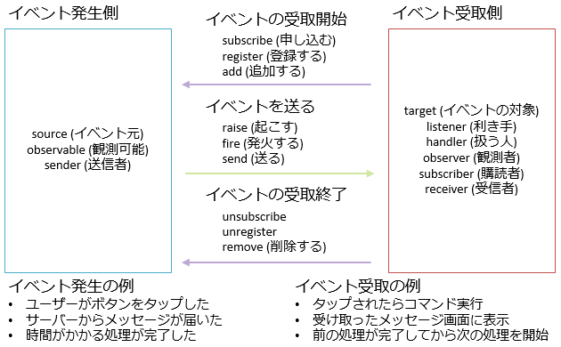

# イベント

## <a id="sec-generated-title-1"></a> <a id="abst"></a>概要

C# には、イベント駆動型のプログラム作成を容易にするため、
イベント処理用の構文 event が用意されています。
event は、デリゲートに対する「[プロパティ](../oop/oo_property.md#property)」のようなもので、
以下のような特徴を持っています。

* デリゲート呼び出しはクラス内部からのみ可能。

* 外部からはデリゲートの追加/削除のみが可能。

##### <a id="sec-generated-title-2"></a>サンプル

[https://github.com/ufcpp/UfcppSample/tree/master/Chapters/Event/EventDriven](https://github.com/ufcpp/UfcppSample/tree/master/Chapters/Event/EventDriven)


##### <a id="sec-generated-title-3"></a>ポイント

* イベント： プロパティのデリゲート版。イベント駆動処理に使われるのでこの名前になっています。

* イベント駆動処理には、単なるデリゲート型のプロパティでは機能が不十分で、 「呼び出しはクラス内からのみ、外部からできるのは登録・削除のみ」という制約が必要になります。

* C# には、この制約を満たすような専用の構文(event 構文)があります。

* 補足: といっても、event 構文には使いにくい面もあるので注意。参考:「[【雑記】イベントの購読とその解除](misceventsubscribe.md)」


## <a id="sec-generated-title-4"></a> <a id="event-driven"></a>イベント駆動型

「キーボードのボタンが押された」とか「マウスが移動した」等の、
コンピュータ上で発生するなんらかの事象のことを<strong id="event" class="keyword">イベント</strong>（event）といい、
イベントが発生したときに行う処理のことを<strong id="eventhandler" class="keyword">イベント ハンドラー</strong>（event handler）と呼びます。
このように、イベントとそれに対する処理により動作するようなプログラムのことを<strong id="edriven" class="keyword">イベント駆動型</strong>（event drive）プログラムと呼びます。

ポイントは、図1に示すように、イベントを発生させる側と受け取って何か処理をする側がわかれることです。

<figure>
	[](../../../../assets/media/ufcpp2000/csharp/fig/ObservableObserver.png)
	<figcaption>イベントの概要</figcaption>
</figure>


event source, observable, event sender, ... など、呼び方はいろいろありますが、流儀や文脈の差であって、だいたい同じものです。

イベント駆動の最たる例は、GUI アプリでしょう。
GUI アプリでは、ユーザからのマウスやキーボード、タッチなどの入力イベント発生を待ち、
それらに対して何らかの処理を行っていくことでプログラムが動作しています。

とはいえ、GUI アプリで例示するのは、他にもいろいろ説明しないといけないことが多いので、
ここではコンソール アプリで説明していきましょう。
コンソール アプリでも、「ユーザーからのキー入力を待つ」というのはイベント処理だと考えることができます。
（GUI アプリに関しては「[GUI アプリケーション](../lib/lib_forms.md)」や「[Windows Presentation Foundation](../../dotnet/index.md#wpf)」参照。）


## <a id="sec-generated-title-5"></a> <a id="ex"></a>イベント駆動型プログラムの例

イベント駆動の例として、
キーボードからの入力を受け取って処理を行うプログラムを作っていきます。
初めに、イベント発生側と受取側があまりわかれていないベタな例を示しましょう。
時節以降で、これを分離していきます。

簡単なサンプルとして、
1秒おきに時刻を表示するプログラムを作ります。
キーボードからの入力に応じて、
表示の一時停止や、表示形式の変更、プログラムの停止等を行います。

この最初のサンプルでは、
Main 関数内のループで時刻の表示を行い、
別のスレッドでイベント(ユーザからのキー入力)の発生を待ち続け、
同時にイベントの処理もこのスレッド内で行います。

```csharp
using System;
using System.Threading;
using System.Threading.Tasks;

class Program
{
    // 時刻の表示形式
    const string FULL = "yyyy/dd/MM hh:mm:ss\n";
    const string DATE = "yyyy/dd/MM\n";
    const string TIME = "hh:mm:ss\n";

    static bool isSuspended = true;  // プログラムの一時停止フラグ。
    static string timeFormat = TIME; // 時刻の表示形式。

    static void Main()
    {
        WriteHelp();

        var cts = new CancellationTokenSource();

        Task.WhenAll(
            Task.Run(() => EventLoop(cts)),
            TimerLoop(cts.Token)
            ).Wait();
    }

    // 毎秒時刻表示のループ
    private static async Task TimerLoop(CancellationToken ct)
    {
        while (!ct.IsCancellationRequested)
        {
            if (!isSuspended)
            {
                // 1秒おきに現在時刻を表示。
                Console.Write(DateTime.Now.ToString(timeFormat));
            }
            await Task.Delay(1000);
        }
    }

    // キー受付のループ
    static void EventLoop(CancellationTokenSource cts)
    {
        while (!cts.IsCancellationRequested)
        {
            // 文字を読み込む
            // (「キーが押される」というイベントの発生を待つ)
            string line = Console.ReadLine();
            char eventCode = line.Length == 0 ? '\0' : line[0];

            // イベント処理
            switch (eventCode)
            {
                case 'r': // run
                    isSuspended = false;
                    break;
                case 's': // suspend
                    isSuspended = true;
                    break;
                case 'f': // full
                    timeFormat = FULL;
                    break;
                case 'd': // date
                    timeFormat = DATE;
                    break;
                case 't': // time
                    timeFormat = TIME;
                    break;
                case 'q': // quit
                    cts.Cancel();
                    break;
                default: // ヘルプ
                    WriteHelp();
                    break;
            }
        }
    }

    private static void WriteHelp()
    {
        Console.Write(
            "使い方\n" +
            "r (run)    : 時刻表示を開始します。\n" +
            "s (suspend): 時刻表示を一時停止します。\n" +
            "f (full)   : 時刻の表示形式を“日付＋時刻”にします。\n" +
            "d (date)   : 時刻の表示形式を“日付のみ”にします。\n" +
            "t (time)   : 時刻の表示形式を“時刻のみ”にします。\n" +
            "q (quit)   : プログラムを終了します。\n"
            );
    }
}
```


このプログラムでは、<code>EventLoop</code> というメソッドの中で、
イベント(ユーザのキー入力)発生を待ち、
その処理を行っています。
ここで、イベントの発生を待つ部分は他のプログラムでも利用可能な汎用的な処理です。
そのため、次のステップとして、
イベント発生待ちの部分を取り出して、汎用ルーチン化することを考えます。
すなわち、イベント発生待受け部(イベントループ)とイベント処理部(イベント ハンドラー)を分けて実装することにします。


## <a id="sec-generated-title-6"></a> <a id="handler"></a>イベント ハンドラー

これまでで見てきたように、
イベント駆動型のプログラムは大きく分けて
<em>「イベント発生待受け部」（イベントループ）と「イベント処理部」（イベント ハンドラー）の2つの部分からなります</em>。
イベント処理部はプログラムごとに異なる処理を行うことになりますが、
イベント発生待受け部は汎用的な処理で、
どんなプログラムでも共通の処理になります。

そこで、イベント発生待受け部のみを独立させ、汎用ルーチン化することを考えます。
といっても、これの実現はそれほど難しい事ではなく、
単に[デリゲート](sp_delegate.md)を用いてイベント処理を他のメソッドに譲り渡してしまえばいいだけのことです。
したがって、イベント発生待受け用クラスは以下のようになります。

```csharp
using System;
using System.Threading;
using System.Threading.Tasks;

// イベント処理用のデリゲート
delegate void KeyboadEventHandler(char eventCode);

/// <summary>
/// キーボードからの入力イベント待受けクラス。
/// </summary>
class KeyboardEventLoop
{
    KeyboadEventHandler _onKeyDown;

    public KeyboardEventLoop(KeyboadEventHandler onKeyDown)
    {
        _onKeyDown = onKeyDown;
    }

    /// <summary>
    /// 待受け開始。
    /// </summary>
    /// <param name="ct">待ち受けを終了したいときにキャンセルする。</param>
    public Task Start(CancellationToken ct)
    {
        return Task.Run(() => EventLoop(ct));
    }

    /// <summary>
    /// イベント待受けループ。
    /// </summary>
    void EventLoop(CancellationToken ct)
    {
        // イベントループ
        while (!ct.IsCancellationRequested)
        {
            // 文字を読み込む
            // (「キーが押される」というイベントの発生を待つ)
            string line = Console.ReadLine();
            char eventCode = (line == null || line.Length == 0) ? '\0' : line[0];

            // イベント処理はデリゲートを通して他のメソッドに任せる。
            _onKeyDown(eventCode);
        }
    }
}
```


このようにしてイベント待受け部から独立させたイベント処理部(この例においては <code>onKeyDown</code> デリゲート)のことを<em>イベント ハンドラー</em>と呼びます。
そして、このクラスを用いて先ほどのサンプルプログラムを書き換えると以下のようになります。

```csharp
using System;
using System.Threading;
using System.Threading.Tasks;

class Program
{
    // 時刻の表示形式
    const string FULL = "yyyy/dd/MM hh:mm:ss\n";
    const string DATE = "yyyy/dd/MM\n";
    const string TIME = "hh:mm:ss\n";

    static KeyboardEventLoop eventLoop;
    static bool isSuspended = true;  // プログラムの一時停止フラグ。
    static string timeFormat = TIME; // 時刻の表示形式。

    static void Main()
    {
        WriteHelp();

        var cts = new CancellationTokenSource();
        eventLoop = new KeyboardEventLoop(code => OnKeyDown(code, cts));

        Task.WhenAll(
            eventLoop.Start(cts.Token),
            TimerLoop(cts.Token)
            ).Wait();
    }

    // 毎秒時刻表示のループ
    private static async Task TimerLoop(CancellationToken ct)
    {
        while (!ct.IsCancellationRequested)
        {
            if (!isSuspended)
            {
                // 1秒おきに現在時刻を表示。
                Console.Write(DateTime.Now.ToString(timeFormat));
            }
            await Task.Delay(1000);
        }
    }

    // イベント処理部。
    static void OnKeyDown(char eventCode, CancellationTokenSource cts)
    {
        switch (eventCode)
        {
            case 'r': // run
                isSuspended = false;
                break;
            case 's': // suspend
                Console.Write("\n一時停止します\n");
                isSuspended = true;
                break;
            case 'f': // full
                timeFormat = FULL;
                break;
            case 'd': // date
                timeFormat = DATE;
                break;
            case 't': // time
                timeFormat = TIME;
                break;
            case 'q': // quit
                cts.Cancel();
                break;
            default: // ヘルプ
                WriteHelp();
                break;
        }
    }

    private static void WriteHelp()
    {
        Console.Write(
            "使い方\n" +
            "r (run)    : 時刻表示を開始します。\n" +
            "s (suspend): 時刻表示を一時停止します。\n" +
            "f (full)   : 時刻の表示形式を“日付＋時刻”にします。\n" +
            "d (date)   : 時刻の表示形式を“日付のみ”にします。\n" +
            "t (time)   : 時刻の表示形式を“時刻のみ”にします。\n" +
            "q (quit)   : プログラムを終了します。\n"
            );
    }
}
```


## <a id="sec-generated-title-7"></a> <a id="event-keyword"></a>C# の event 構文

ここまでの話をもう1歩推し進めて、
イベント ハンドラーの追加削除を自由にできるようにしたいと思います。
これはイベント ハンドラー用のデリゲート変数を public にしてしまえば簡単にできたりもしますが、
「[プロパティ](../oop/oo_property.md)」で説明したように、
メンバー変数を外部から直接取得/書換え可能にすべきではありません。
デリゲート変数も例外ではなく、取得/書換えはアクセッサを介して行うべきです。

それならば、デリゲート型のプロパティを用意すればいいのではないかと思われるかもしれませんが、それではまだ不十分です。
なぜかといいますと、イベント ハンドラー用のデリゲートには以下のような条件が求められるからです。

* デリゲート呼び出しはクラス内部からのみ可能。

* 外部からはデリゲートの追加/削除のみが可能。


すなわち、クラス内部からは通常のデリゲート変数と同様に扱え、
外部からは <code>+=</code>、<code>-=</code> 演算子によるデリゲートの追加/削除のみを行えるような仕組みが欲しいわけです。
プロパティではこのような仕組みは提供できません。

そこで、C# にはこの仕組みを実現するために <em>event</em> というキーワードが用意されています。
利用方法は簡単で、イベント ハンドラーとして使用したいデリゲート型の変数宣言時に <code>event</code> という修飾子を付けるだけです。

```csharp
event デリゲート型 イベント ハンドラー名;
```


このようにして宣言した変数は“<em>イベント</em>”と呼ばれ、
前述のように内部からは普通のデリゲートと同じように利用でき、
外部からは <code>+=</code>、<code>-=</code> のみが利用できるようになります。

また、イベントはプロパティの <code>get</code>/<code>set</code> と同じように、
<code>add</code>/<code>remove</code> というキーワードを用いて、
追加/削除時の処理を明示的に指定することもできます。
（省略可能。省略すると、デリゲートを格納するフィールドと、add/remove アクセサーをコンパイラーが自動生成してくれる。）

```csharp
event デリゲート型 イベント ハンドラー名
{
  add
  {
    // addアクセサ
    //  ここにイベント ハンドラー追加時の処理を書く。
  }
  remove
  {
    // removeアクセサ
    //  ここにイベント ハンドラー削除時の処理を書く。
  }
  // add/remove アクセッサ共に、
  // 追加/削除したいイベント ハンドラーは value という名前の変数に格納されている。
}
```


このように明示的に追加/削除時の処理を追加したものをイベントプロパティと呼びます。

それでは、先ほど作成したイベント発生待受けクラスを event を用いて書き換えてみましょう。
（event キーワードを足して public にしただけ。）

```csharp
using System;
using System.Threading;
using System.Threading.Tasks;

// イベント処理用のデリゲート
delegate void KeyboadEventHandler(char eventCode);

/// <summary>
/// キーボードからの入力イベント待受けクラス。
/// </summary>
class KeyboardEventLoop
{
    /// <summary>
    /// キー入力があった時に呼ばれるイベント。
    /// </summary>
    public event KeyboadEventHandler OnKeyDown;

    public KeyboardEventLoop() { }
    public KeyboardEventLoop(KeyboadEventHandler onKeyDown)
    {
        OnKeyDown += onKeyDown;
    }

    /// <summary>
    /// 待受け開始。
    /// </summary>
    /// <param name="ct">待ち受けを終了したいときにキャンセルする。</param>
    public Task Start(CancellationToken ct)
    {
        return Task.Run(() => EventLoop(ct));
    }

    /// <summary>
    /// イベント待受けループ。
    /// </summary>
    void EventLoop(CancellationToken ct)
    {
        // イベントループ
        while (!ct.IsCancellationRequested)
        {
            // 文字を読み込む
            // (「キーが押される」というイベントの発生を待つ)
            string line = Console.ReadLine();
            char eventCode = (line == null || line.Length == 0) ? '\0' : line[0];

            // イベント処理は event を通して他のメソッドに任せる。
            OnKeyDown(eventCode);
        }
    }
}
```


## <a id="sec-generated-title-8"></a> <a id="auto-event"></a>補足: 自動イベント

前節で構文を説明した通り、event 構文には、add/remove アクセサーを明示的に書く方法と、省略して書く方法があります。
省略して書く方では、add/remove がコンパイラーによって自動生成されています。
ちなみに、この、コンパイラーによって自動生成されるもののことを自動イベント(auto-event)と言ったりします。

補足的にはなりますが、この自動イベントの自動生成結果について少し話しておきます。

例えば、以下のようなイベントを書いたとします。

```csharp
using System;

class EventSample
{
    public event EventHandler X;
}
```


C# 4.0 以降、コンパイラーによる自動生成の結果は以下のような意味合いのものになります。

```csharp
using System;
using System.Threading;

class EventSample
{
    private EventHandler _X; // 注意: コンパイラー自動生成結果的には X

    public event EventHandler X
    {
        add
        {
            EventHandler x2;
            var x1 = _X;
            do
            {
                x2 = x1;
                var x3 = (EventHandler)Delegate.Combine(x2, value);
                x1 = Interlocked.CompareExchange(ref _X, x3, x2);
            }
            while (x1 != x2);
        }
        remove
        {
            EventHandler x2;
            var x1 = _X;
            do
            {
                x2 = x1;
                var x3 = (EventHandler)Delegate.Remove(x2, value);
                x1 = Interlocked.CompareExchange(ref _X, x3, x2);
            }
            while (x1 != x2);
        }
    }
}
```


結構大げさなコードが生成されていますが、これは、マルチスレッド動作で正しく動くことを保証するためにこうなっています。
(こういうマルチスレッド動作保証の方法については、別途、非同期処理がらみのページで説明予定。)
マルチスレッド動作を気にしなくていいなら、意味的には以下のコードと同じです。

```csharp
using System;

class EventSample
{
    private EventHandler _X; // 注意: コンパイラー自動生成結果的には X

    public event EventHandler X
    {
        add { _X += value; }
        remove { _X -= value; }
    }
}
```


1点、注意があります。
event とは別に、普通のデリゲート型のフィールドが作られますが、
実際のコンパイラー生成結果的には、event 名とフィールド名はまったく同じ名前で、どちらも X になります。
(C# の言語仕様上は、同名のメンバーを2つ持つことはできませんが、
.NET の中間言語仕様上は、event とフィールドみたいに、異種メンバーであれば同じ名前であっても構いません。)
クラスの外から <code>+=</code> / <code>-=</code> しているのは event の方の X で、
クラスの中からデリゲート呼び出ししているのはフィールドの方の X だったりします。
