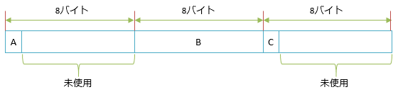
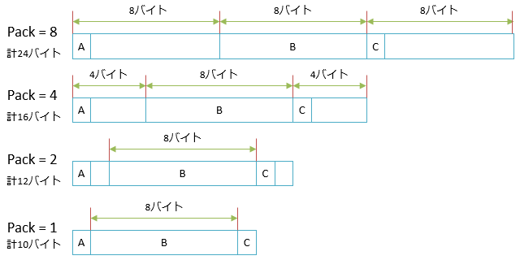
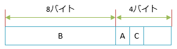
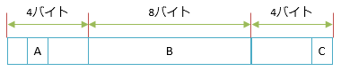

# 複合型のレイアウト

## 概要
複合型(クラスや構造体)では、フィールドをメモリ上にどうレイアウト(layout: 配置)するかという問題があります。

通常、メモリ上のレイアウトがどうなっているのかをプログラマーが気にする必要はありません。
大体はコンパイラーが最適な仕事をしてくれます。

それでも、時々、レイアウト方法を明示的に指定したい場合があります
(おそらく、そのほとんどはC++などで書かれたネイティブ コードとの相互運用です)。
そこで、プログラミング言語によってはレイアウトをカスタマイズするための機能を提供しているものもあります。

C#では、クラスと構造体に対してレイアウトのカスタマイズ機能を提供しています。
`StructLayout`属性を付けることでカスタマイズ可能です。

## アラインメント
「最適なレイアウト」について説明するためには、まず、メモリの<strong id="key-alignment" class="keyword">アラインメント</strong>(alignment: 整列、調整)について知る必要があります。

一般に、メモリの読み書きは、[アドレス](../../computer/general/memory.md#address)が4の倍数や8の倍数になっている方が高速です。
(1命令で読み出せるのは倍数ピッタリの場所だけなCPUもあります。
最悪、2命令で隣り合った場所を読み込んで、繋ぎなおすような処理が必要になります。)

そこで、多くのプログラミング言語で、アドレスがきれいな倍数になるように、フィールドとフィールドの間に隙間を空けたり、フィールドを並べ替えたりしています。この、所定の倍数の位置にフィールドを並べる処理をアラインメントと呼びます。

例えば、以下のような構造体を書いたとします。A, C (`byte`型)が1バイト、B (`long`型)が8バイトのデータです。

<pre class="source" title="アラインメント説明用のサンプル構造体">
<code><reserved>struct Sample
{
    public byte A;
    public long B;
    public byte C;
}
</code></pre>

アラインメントの間隔はコンパイラーやCPUによって変わりますが、一例として、この構造体のメモリ レイアウトは以下のようになります。

フィールドすべてが8の倍数アドレスに並ぶように、8バイト間隔でフィールドが並びます。
また、末尾にも、全体が8の倍数になるように未使用領域が追加されます。

## C#でレイアウトを調べてみる
C#でも、[unsafe](sp_unsafe.md#unsafe)コードを使えば、構造体のレイアウトを調べることができます。
以下のように、ポインターを使って、構造体の先頭と、各フィールドのアドレスの差を見れば、レイアウトがわかります。

<pre class="source" title="ポインターを使ってレイアウトを調べるコード">
<code>using System;

struct Sample
{
    public byte A;
    public long B;
    public byte C;
}

class Program
{
    static unsafe void Main()
    {
        var a = default(Sample);
        var p = &amp;a;
        var pa = &amp;a.A;
        var pb = &amp;a.B;
        var pc = &amp;a.C;

        Console.WriteLine($@"サイズ: {sizeof(Sample)}
A: {(long)pa - (long)p}
B: {(long)pb - (long)p}
C: {(long)pc - (long)p}
");
    }
}
</code></pre>

ただし、1つ注意があります。C#では、たとえunsafeコード内であっても、参照型のアドレスは取れないようになっています。
そのため、参照型や、参照型を含んだ構造体の場合はレイアウトを調べられません。

<pre class="source" title="参照型のアドレスは取れないので、レイアウトも調べられない">
<code>using System;

struct Sample
{
    public int I;
    public string S;
}

class Program
{
    static unsafe void Main()
    {
        var a = default(Sample);
        var p = &amp;a;    // コンパイル エラー: 参照型を含んだ構造体はアドレス取れない
        var pi = &amp;a.I;
        var ps = &amp;a.S; // コンパイル エラー: 参照型メンバーのアドレスは取れない

        Console.WriteLine((long)pi - (long)p);
        Console.WriteLine((long)ps - (long)p);
    }
}
</code></pre>

## レイアウトの指定
C#では、`StructLayout`属性(`System.Runtime.InteropServices`名前空間)を付けることで、レイアウト方式をカスタマイズ可能です。

以下の3種類のレイアウト方式を選択できます。

- Sequential: フィールドを宣言した順番通りに並べる
- Auto: コンパイラー裁量で並び替えを認める
- Explicit: 複合型の作者が明示的に位置を指定する

ちなみに、何も指定しない場合、構造体はSequentialレイアウト、クラスはAutoレイアウトになります。

また、フィールドとフィールドに何バイトの間隔を空けるか(Pack)を指定することもできます。

### Sequentialレイアウト
Sequentialレイアウトでは、複合型のフィールドは宣言した順序通りにレイアウトされます。
`StructLayout`属性の引数に、`LayoutKind.Sequential`を渡します。

<pre class="source" title="Sequentialレイアウトの例">
<code>using System.Runtime.InteropServices;

[StructLayout(LayoutKind.Sequential)]
struct Sample
{
    public byte A;
    public long B;
    public byte C;
}
</code></pre>

アラインメントの説明で挙げたのと同じ絵になりますが、このコードは以下のようなレイアウトになります。

構造体では、特に何も指定しないとSequentialレイアウトになります。
順序通りに並べるとコンパイラーごとの差異が生まれにくく、相互運用がしやすいからでしょう
(構造体はネイティブコードとの相互運用に使うことが結構多い)。

### Pack指定
間隔の開け方(Pack)は、通常は、32ビットCPUであれば4 (4バイト = 32ビット)、64ビットCPUであれば8 (8バイト = 64ビット)です
(それが一番高速になる可能性が高い)。

Packを明示的に指定したい場合には、以下のように、`StructLayout`属性の`Pack`プロパティに数値を与えます。

<pre class="source" title="StructLayout属性のPackプロパティを指定">
<code>using System.Runtime.InteropServices;

[StructLayout(LayoutKind.Sequential, Pack = 8)]
struct Pack8
{
    public byte A;
    public long B;
    public byte C;
}

[StructLayout(LayoutKind.Sequential, Pack = 4)]
struct Pack4
{
    public byte A;
    public long B;
    public byte C;
}

[StructLayout(LayoutKind.Sequential, Pack = 2)]
struct Pack2
{
    public byte A;
    public long B;
    public byte C;
}

[StructLayout(LayoutKind.Sequential, Pack = 1)]
struct Pack1
{
    public byte A;
    public long B;
    public byte C;
}
</code></pre>

これで、以下のようなレイアウトになります。

### Autoレイアウト
Autoレイアウトでは、コンパイラー裁量でフィールドの順序変更を許します。
`StructLayout`属性の引数に、`LayoutKind.Auto`を渡します。

通常、`int`型(4バイト)は4の倍数に、`long`型(8バイト)は8の倍数位置に並ぶようにしつつ、
隙間をより小さい型で埋めたりして、型のサイズが最小になるように並び替えが行われます。

例えば、以下のような構造体を書いた場合を考えます。

<pre class="source" title="Autoレイアウトの例">
<code><reserved>using System.Runtime.InteropServices;

[StructLayout(LayoutKind.Auto, Pack = 8)]
struct Sample
{
    public byte A;
    public long B;
    public byte C;
}
</code></pre>

この場合、
`byte`型のフィールド2つを固めて後ろに持っていくことで、`long`型のBのアラインメントは揃えつつ、構造体のサイズを小さくします。
結果、以下のような12バイトのレイアウトになります。

(ただし、32ビット CPU の場合。これが64ビットCPUの場合はアラインメントが8バイト単位になって、 `Sample` 構造体は16バイトになります。)

ちなみに、クラスでは、特に何も指定しないとAutoレイアウトになります。

### Explicitレイアウト
`StructLayout`属性の引数に、`LayoutKind.Explicit`を指定して、
フィールドに`FieldOffset`属性を付けることで、
フィールドの位置を明示的に指定することができます。

例えば、以下のような構造体を書いた場合を考えます。

<pre class="source" title="Explicitレイアウトの例">
<code>using System.Runtime.InteropServices;

[StructLayout(LayoutKind.Explicit)]
struct Sample
{
    [FieldOffset(1)]
    public byte A;
    [FieldOffset(4)]
    public long B;
    [FieldOffset(15)]
    public byte C;
}
</code></pre>

以下のような変な隙間が空いたレイアウトになります。

#### フィールドの位置を重ねる
Explicitレイアウトを使うと、複数のフィールドの位置を重ねることもできます。
すなわち、C言語のunionのようなことができます。

例えば、以下のようなことができます。

<pre class="source" title="union的な使い方の例">
<code><reserved>using System;
using System.Runtime.InteropServices;

[StructLayout(LayoutKind.Explicit)]
struct Union
{
    [FieldOffset(0)]
    public byte A;

    [FieldOffset(1)]
    public byte B;

    [FieldOffset(2)]
    public byte C;

    [FieldOffset(3)]
    public byte D;

    [FieldOffset(0)] // A と一緒
    public int N;
}

class Program
{
    static void Main()
    {
        var x = new Union { N = 0x12345678 };
        Console.WriteLine(x.A.ToString("x")); // 78
        Console.WriteLine(x.B.ToString("x")); // 56
        Console.WriteLine(x.C.ToString("x")); // 34
        Console.WriteLine(x.D.ToString("x")); // 12
    }
}
</code></pre>

<pre class="console" title="実行結果">
<code>78
56
34
12
</code></pre>

`int`型のフィールド`N`に書き込んだ結果を、1バイト1バイト、個別に取り出しています。

ちなみに、下位バイト(この例では78)が先頭(フィールド`A`)に来るか末尾(フィールド`D`)に来るかはCPUによります(「エンディアン(endian)」と言います)。
Intel CPUの場合は先頭に来ます(little endianと言います。この逆はbig endian)。

#### 余談: Explicitレイアウトの悪用例
C# 8.0 で挙動が変わったんですが、昔の C# では、「true でも false でもない bool 型」を作ることができました。
(詳しくは「[余談: bool の網羅性](../datatype/typeswitch.md#bool-exhaustiveness)」で説明しています。)

以前の C# では、Explicit レイアウトを悪用して、([unsafe](sp_unsafe.md) すら要らずに)この「true でも false でもない bool 型」を作れて、switch ステートメントで変な挙動を起こしていました。

（古い C# での挙動）

Explicitレイアウトでフィールドの位置を重ねられることで、
結構たちが悪い悪用ができたりします。
例えば、本来あり得ない値を作ったりできます。

通常、C#の`bool`型が`true`か`false`の2つの値しかとりません。
しかし、別の型のフィールドと重ねて、無理やり上書きすることで、他の値にできます。
例えば以下のようなコードが書けます。

<pre class="source" title="Explicitレイアウトの悪用例">
<code><reserved>using System;
using System.Runtime.InteropServices;

[StructLayout(LayoutKind.Explicit)]
struct Union
{
    [FieldOffset(0)]
    public bool Bool;

    [FieldOffset(0)] // Bool と同じ場所
    public byte Byte;
}

class Program
{
    static void Main()
    {
        Write(false);   // False
        Write(true);    // True

        Write(Bool(0)); // False … false と一緒
        Write(Bool(1)); // True … true と一緒
        Write(Bool(2)); // Other!
    }

    private static bool Bool(byte value)
    {
        var union = new Union();
        union.Byte = value;
        return union.Bool;
    }

    static void Write(bool x)
    {
        switch (x)
        {
            case true:
                Console.WriteLine("True");
                break;
            case false:
                Console.WriteLine("False");
                break;
            default:
                Console.WriteLine("Other!");
                break;
        }
    }
}
</code></pre>

<pre class="console" title="実行結果">
<code>False
True
False
True
Other!
</code></pre>

C#の`true`、`false`は、内部的にはそれぞれ1, 0の数値になっていることが分かります。
そして、それ以外の数値を指定すると、`switch`の飛び先が変わります。

ちなみに、0以外の数値は、真偽判定(`if`ステートメントの条件式内とか)で使うと`true`扱いになります。
`ToString`の結果も`True`です。
`switch`ステートメントでだけ変な結果を起こせます。

#### 余談: 値と参照を重ねる
Explicitレイアウトには1つ制限があります。
値型のフィールドと参照型のフィールドを同じ位置に重ねてレイアウトすることはできません。

ただし、コンパイル エラーにはならず、実行時エラーです。
(C#の制限ではなくて、.NETランタイムの制限なので、実行時にしかエラーを拾えない。)
例えば、以下のようなコードを書くと、`TypeLoadException`が発生します。

<pre class="source" title="Explicitレイアウトで値と参照を重ねる例">
<code>using System.Runtime.InteropServices;

[StructLayout(LayoutKind.Explicit)]
struct Sample
{
    [FieldOffset(0)]
    public int A;

    // 値と参照を同じ場所にレイアウト
    // コンパイル エラーにはならない
    [FieldOffset(0)]
    public object B;
}

class Program
{
    static unsafe void Main()
    {
        // Sample 型に触れた瞬間、実行時エラーになる
        var s = new Sample();
    }
}
</code></pre>

この制限は、[ガベージ コレクション](../../computer/essential-software/memorymanagement.md#garbage-collection)の都合です。
ガベージ コレクションは、参照をたどって誰からも参照されていないオブジェクトを探索するわけですが、
ここで、本当に参照なのかどうかがわからないものがあると探索に支障をきたします。
値と参照が重なっていると、この状態が生まれます。

ちなみに、プログラミング言語によっては、同じメモリ領域に値と参照をどちらでも格納できるものもあります。
そういう言語の場合は、以下のいずれかの処理を行っています。

- ガベージ コレクションを持たない
- すべて参照扱いにしてガベージ コレクションを走らせる
  - もちろん、本来参照じゃない場所まで参照扱いするので、回収漏れがあり得ます
- 値か参照かを弁別のために、メモリ領域の最上位ビットとかをフラグとして使う
  - こういう言語では、整数が31ビットしか使えなかったりします(C#みたいな言語の半分の大きさ)
