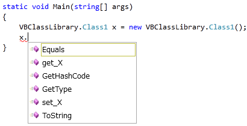

# COM 相互運用時の特別処理

## <a id="sec-generated-title-1"></a> <a id="abst"></a>概要

<h5 class="version version4">Ver. 4.0</h5>

.NET Framework には COM 相互運用機能があって、COM のクラスをあたかも .NET のクラスであるかのように扱うことができます。
ただ、COM が主流だった時代と今とでは大分設計思想に差があって、
.NET 的には不要だけども、COM 相互運用をする上では欲しい機能というのがいくつかあります。

そこで、C# 4.0 では、COM 相互運用用のクラス
（RCW（Runtime Callable Wrapper）といいます。.NET ランタイムから COM を呼び出せるようにしたラッパークラス）に対してだけ特別な処理をするようになりました。
COM への特別処理は以下の2点。

* ref 引数（「[引数の参照渡し](../resource/sp_ref.md)」参照）に対して、ref キーワードを付けなくても呼び出せるようになった。

* <code>get_X(index)</code>、<code>set_X(index, value)</code>というメソッドに対して、 インデックス付きプロパティ構文（<code>X[index]</code>という書き方）が使えるようになった。


## <a id="sec-generated-title-2"></a> <a id="refomit"></a>ref 省略

本来、「引数の参照渡しでは、呼び出し側からも参照渡しであることが一目でわかるべき」
というのが C# の流儀なので、ref キーワードの省略はあまりいい構文ではありません。
（なので、通常は「[参照渡し](../resource/sp_ref.md#byref)」では ref を省略できない。）

ですが、COM の場合、参照渡しにする必要のないようなものにまでやたらと ref が付きまくるので、
やむなく ref キーワードの省略を認めるようです。
（あくまで RCW （COM 相互運用クラス）に対してだけこの機構が働く。）

例えば、悪名高い Word の Document.SaveAs メソッドを見てみましょう。
C# 3.0 までは以下のような書き方をする必要がありました。

```csharp {title="悪名高い ref 地獄"}
var word = new Microsoft.Office.Interop.Word.Application();

object missing = Type.Missing;
object filename = "sample.docx";
word.ActiveDocument.SaveAs2(ref filename,
    ref missing, ref missing, ref missing, ref missing,
    ref missing, ref missing, ref missing, ref missing,
    ref missing, ref missing, ref missing, ref missing,
    ref missing, ref missing, ref missing, ref missing);
```


これが、C# 4.0 なら以下のように書けたりもします。

```csharp {title="ref 省略"}
object missing = Type.Missing;
string filename = "sample.docx";
word.ActiveDocument.SaveAs2(filename,
    missing, missing, missing, missing,
    missing, missing, missing, missing,
    missing, missing, missing, missing,
    missing, missing, missing, missing);
```


まあ、この場合、ref 省略よりも、オプション引数（「[オプション引数・名前付き引数](../structured/sp4_optional.md)」参照）が追加されたことの方がインパクトが大きいですが↓。

```csharp {title="オプション引数が入ったおかげで"}
string filename = "sample.docx";
word.ActiveDocument.SaveAs2(filename);
```


ただし、これも COM 特別処理のおかげです。
C# 的には本来、ref 引数に対して規定値は定義できないんですが、
RCW の場合には ref がついてても規定値が設定されるようになっています。


## <a id="sec-generated-title-3"></a> <a id="indexed"></a>インデックス付きプロパティ

C# は「インデックス付きプロパティじゃなくて、インデクサー持ちの型のプロパティを作れ」という設計思想です。
（あるいは、「[イテレーター](../data/sp2_iterator.md#iterator)」を使って IEnumerable を返すか。）
でも、COM の時代にはそういう思想がなくて、インデックス付きプロパティだらけなので、これもやむなく認めるようになりました。

例えば、Excel の Application.Range がインデックス付きプロパティになっています。
C# 3.0 までは、以下のようにアクセスする必要がありました。

```csharp {title="get_Range"}
var excel = new Microsoft.Office.Interop.Excel.Application();
var range = excel.get_Range("A1", "A2");
```


これが、C# 4.0 では以下のように書けます。

```csharp {title="インデックス付きプロパティ"}
var excel = new Microsoft.Office.Interop.Excel.Application();
var range = excel.Range["A1", "A2"];
```


また、対 COM 限定で、インデクサーやインデックス付きプロパティに対する引数の省略（「[オプション引数](../structured/sp4_optional.md#optional)」参照）が可能です。
すなわち、以下のような記述が許されます。

```csharp {title="インデクサーに対する引数の省略"}
obj[];
```


これらの処理は本当に対 RCW （COM 相互運用）専用です。
C# でインデックス付きプロパティが定義できるようになるわけではないです。

それどころか、VB.NET で作ったインデックス付きプロパティにすら、
C# からはインデックス付きプロパティ構文でアクセスできません。
（今まで通り get_X という書き方をする必要があります。）
例えば、VB で以下のように書いたとしても、

```vbnet {title="VB のインデックス付きプロパティ"}
Public Class Class1

    Dim x_ As Dictionary(Of String, Integer)

    Public Property X(ByVal i As String) As Integer
        Get
            Return x_(i)
        End Get
        Set(ByVal value As Integer)
            x_(i) = value
        End Set
    End Property

End Class
```


C# 側からは get_X でしか参照できません。（下図参照。）

<figure>

[](../../../../assets/media/ufcpp2000/csharp/fig/get_x.png)

<figcaption>C# から見たインデックス付きプロパティ</figcaption>
</figure>

## <a id="sec-generated-title-4"></a> <a id="no-pia"></a>No PIA

C# の機能ではなく、.NET Framework 4 の新機能ですが、No PIA と呼ばれる機能も追加されました。

詳しくは「[プラットフォーム呼び出し](sp_pinvoke.md#no-pia)」で説明します。
