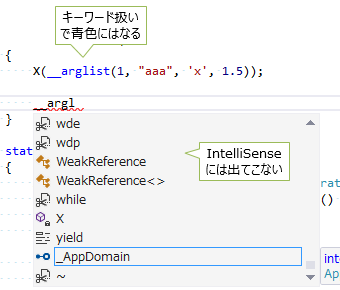

# 型付き参照

##  概要

ほぼ、他の言語との相互運用のための機能ですが、
C# には参照関連の隠しキーワード `__makeref`, `__refvalue`, `__reftype`, `__arglist` があったりします。

※ ちなみに現在では [`Unsafe` クラス](https://docs.microsoft.com/en-us/dotnet/api/system.runtime.compilerservices.unsafe) で代用できることも多く、より一層出番は減っています。

##### サンプル

[https://github.com/ufcpp/UfcppSample/tree/master/Chapters/Interop/TypedReference](https://github.com/ufcpp/UfcppSample/tree/master/Chapters/Interop/TypedReference)

##  参照と隠しキーワード

ここで言う「参照」というのは、他の変数を読み書きできる別の変数を作ることです。
標準 C# にはないので別の言語の機能で説明すると、C++ で 型名の後ろに &amp; を付けて作る参照変数のことです
(一種の制限付きのポインター)。
例えば、以下のコードは C++ のものですが、変数 r が、別の変数 x の参照になっています。

<pre class="source" title="C++" lang="">
<code>#include &lt;stdio.h&gt;

void sample()
{
    int x = 10;
    <em>int&amp; r = x;</em> // x の参照を作る

    r = 99; // 参照元の x も書き換わる

    printf("%d", x); // 99
}
</code></pre>

通常、C# では、開発者が意識して参照を使える場面は、
参照引数と出力引数(ref, out。参考: 「[引数の参照渡し](../resource/sp_ref.md)」)だけです※。

しかし、実は、C# の隠し機能(ドキュメント化されていない。当然、標準 C# 仕様にもなっていない)として、
ローカル変数や引数の参照を作る機能があったりします。
そのための隠しキーワードとして、__makeref, __refvalue, __reftype, __arglist の4つがあります。

<table summary="参照関連の C# 隠しキーワード">
	<caption>
		参照関連の C# 隠しキーワード
	</caption>
	<tr>
		<th>キーワード</th>
		<th>概要</th>
	</tr>
	<tr>
		<td markdown="1"><code>__makeref</code></td>
		<td markdown="1">参照を作ります。</td>
	</tr>
	<tr>
		<td markdown="1"><code>__refvalue</code></td>
		<td markdown="1">参照の値を読み書きします。</td>
	</tr>
	<tr>
		<td markdown="1"><code>__reftype</code></td>
		<td markdown="1">参照先の型を取得します。参照先の変数 x に対して、x.GetType() 相当のものを得ます。</td>
	</tr>
	<tr>
		<td markdown="1"><code>__arglist</code></td>
		<td markdown="1">可変長引数を作ります。</td>
	</tr>
</table>

アンダーバー2つ(__)から始まっていて、いかにも隠し機能ですが、図1のように、一応、Visual Studio のサポートもかかります。
といっても、コード補完(IntelliSense)には出ず、キーワードのハイライトのみです。

<figure>
	
	<figcaption>隠しキーワード(__arglist)</figcaption>
</figure>

ちなみに、標準仕様外の機能ですが、[Mono](http://www.mono-project.com/) のC#コンパイラーもこの機能対応していて、こちらでも普通に使えます。

###  ※ 補足: 内部的な話

参照が作れないのは C# の言語仕様上の制限で、.NET の 「[IL](../abstract/ab_dotnet.md#il)」 の仕様上は参照があります。

C# でも、内部的には(コンパイル結果の IL 的には)、値型の this 参照や、値型の入れ子の書き換えなどで参照が使われます。

<pre class="source" title="this 参照" lang="">
<code>struct A
{
    public int x;
    public int Y()
    {
        return this.x * this.x; // この this はメソッド Y に参照が渡されてる
    }
}
</code></pre>

<pre class="source" title="" lang="">
<code>using System;

class Program
{
    struct A { public B b; }
    struct B { public C c; }
    struct C { public int x; }

    static void Main(string[] args)
    {
        var a = new A();
        a.b.c.x = 1;
        Console.WriteLine(a.b.c.x); // ちゃんと x が 1 に書き換わってる
    }
}
</code></pre>

##  __makeref の例

先ほどの C++ の例を、__makeref キーワードを使って書きなおすと以下のようになります。

<pre class="source" title="__makeref の例" lang="">
<code>using System;

class Program
{
    static void Main(string[] args)
    {
        int x = 10;
        TypedReference r = __makeref(x); // x の参照を作る

        __refvalue(r, int) = 99; // 参照元の x も書き換わる

        Console.WriteLine(x); // 99
    }
}
</code></pre>

通常では C# で必要になる機能でもなく、完全に隠し機能なので、かなり煩雑な文法になっています
(簡便に書ける文法はそれなりにリスク(他の文法の邪魔になったり、将来的な変更を難しくしたり)があります)。

__makeref で参照を作って、__refvalue で値の読み書きをします。

ちなみに、型推論も利きます。

<pre class="source" title="__makeref の型推論" lang="">
<code>var x = 10; // int
var r = __makeref(x); // TypedReference
</code></pre>

##  __arglist の例

C# の場合、通常、可変個の引数をとりたければ配列引数(参考: 「[params キーワード](../structured/sp_params.md#params)」)を使います。
これは、複数与えた実引数を、1つの配列にまとめてからメソッドなどに渡すので、実際の引数は1つだけになります。

内部的なことを言うと、いわゆる呼び出しスタックという場所に引数を置いてからメソッドなどを呼び出して、指定個数スタック上の値を消費します。
C# の配列引数の場合、このスタック上で消費される数は固定で、この意味では「可変個引数」にはなりません。
一方で、C 言語など、他の言語では、スタック上の値を可変個消費するという意味で、本当に可変個引数な関数を作れるものがあります。

これに対して、隠しキーワード __arglist を使うと、C# で本当に可変個引数なメソッドを作りことができます。
例えば、以下のようなコードになります。

<pre class="source" title="__arglist の例" lang="">
<code>using System;

class Program
{
    static void Main(string[] args)
    {
        X(__arglist(1, "aaa", 'x', 1.5)); // 呼び出し側にも __arglist を書く
    }

    static void X(__arglist) // 仮引数のところに __arglist を書く
    {
        // 中身のとりだしには ArgIterator 構造体を使う
        ArgIterator argumentIterator = new ArgIterator(__arglist);
        while (argumentIterator.GetRemainingCount() &gt; 0)
        {
            object value = null;

            var r = argumentIterator.GetNextArg(); // 可変個引数の1個1個は TypedReference になっている
            var t = __reftype(r); // TypedReference から、元の型を取得

            // 型で分岐して、__refvalue で値の取り出し
            if (t == typeof(int)) value = __refvalue(r, int);
            else if (t == typeof(char)) value = __refvalue(r, char);
            else if (t == typeof(double)) value = __refvalue(r, double);
            else value = __refvalue(r, string);

            Console.WriteLine(t.Name + ": " + value);
        }
    }
}
</code></pre>

<pre class="console" title="実行結果">
Int32: 1
String: aaa
Char: x
Double: 1.5
</pre>

配列引数を使う場合と比べて大幅に煩雑なので、他の言語との相互運用のための機能だと思った方がいいでしょう。
例えば、以下のようなコードで、C 言語の printf 関数を呼ぶことができます。

<pre class="source" title="" lang="">
<code>using System.Runtime.InteropServices;

class Program
{
    static void Main(string[] args)
    {
        printf("%d, %s, %c, %f", __arglist(1, "aaa", 'x', 1.5));
    }

    [DllImport("msvcrt", CallingConvention = CallingConvention.Cdecl)]
    static extern int printf(string format, __arglist);
}
</code></pre>

##  ボックス化回避

(C# にとっては隠し機能ですが).NET に型付き参照がある理由は、値型に対する操作の効率化、特に、ボックス化回避のためです。
ボックス化については「[ボックス化](../resource/rmboxing.md)」を参照。

普通に型を明示している分にはボックス化は起きません。
また、ジェネリックを使うとボックス化を避けれることも多いです。
しかし、まれに、この型付き参照なしではボックス化を避けれないこともあるようです。
例えば、以下のように、ジェネリックな引数に対して、型を見ていくつかの型の場合だけ特殊処理したい場合などです。

<pre class="source" title="" lang="">
<code>public static void Set1&lt;T&gt;(ref T value)
{
    // 型を見て分岐しているのに、結局一度 (T)(object) とキャストしないといけない
    // (object)の時点でボックス化発生
    if (value is int) value = (T)(object)1;
    else if (value is double) value = (T)(object)1.0;
    else if (value is char  ) value = (T)(object)'1';
    else if (value is string) value = (T)(object)"1";
    else value = default(T);
}
</code></pre>

この場合に、__makeref を使うとボックス化を避けることができたりします。

<pre class="source" title="" lang="">
<code>public static void Set1&lt;T&gt;(ref T value)
{
    if (value is int) __refvalue(__makeref(value), int) = 1;
    else if (value is double) __refvalue(__makeref(value), double) = 1;
    else if (value is char  ) __refvalue(__makeref(value), char  ) = '1';
    else if (value is string) __refvalue(__makeref(value), string) = "1";
    else value = default(T);
}
</code></pre>

参考:

* [http://stackoverflow.com/questions/4764573/why-is-typedreference-behind-the-scenes-its-so-fast-and-safe-almost-magical](http://stackoverflow.com/questions/4764573/why-is-typedreference-behind-the-scenes-its-so-fast-and-safe-almost-magical)

* [http://stackoverflow.com/questions/1711393/practical-uses-of-typedreference](http://stackoverflow.com/questions/1711393/practical-uses-of-typedreference)

ちなみに、この用途は [`Unsafe` クラス](https://docs.microsoft.com/en-us/dotnet/api/system.runtime.compilerservices.unsafe)を使った方法の方がパフォーマンスがいいので、
このクラスが使えるようになって以降はこの用途で `__makeref` が使われることはなくなりました。

<pre class="source" title="Unsafe クラスで同様の処理">
<code>using System.Runtime.CompilerServices;

static void Set1&lt;T&gt;(ref T value)
{
    if (value is int) Unsafe.As&lt;T, int&gt;(ref value) = 1;
    else if (value is double) Unsafe.As&lt;T, int&gt;(ref value) = 1;
    else if (value is char) Unsafe.As&lt;T, char&gt;(ref value) = '1';
    else if (value is string) Unsafe.As&lt;T, string&gt;(ref value) = "1";
    else value = default(T);
}
</code></pre>
