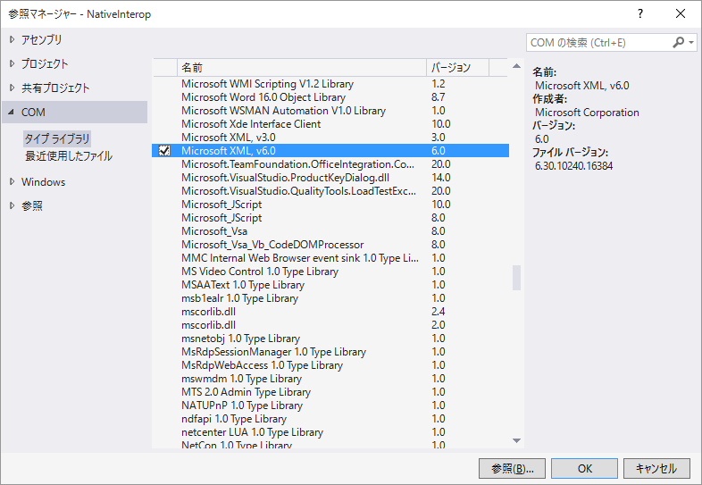
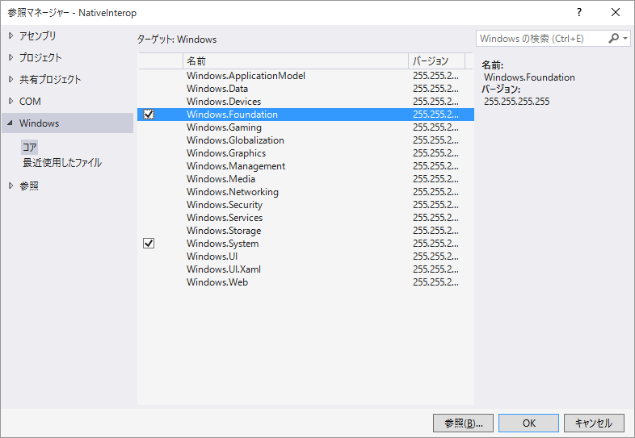

# プラットフォーム呼び出し

## <a id="sec-generated-title-1"></a> <a id="abst"></a>概要

.NET Frameworkには豊富なライブラリが提供されていて、C#やVisual Basicなどの.NET Framework上で動くプログラミング言語だけを使ってたいていのことができます。
しかし、その他のプログラミング言語との相互運用をしたい場面も出てくるでしょう。

特に、OSに深く食い込むような機能はいわゆるネイティブ コードで書かれたネイティブ ライブラリです。
.NET Frameworkはネイティブ ライブラリ中の機能を呼び出すための機能を備えていて、
これを<strong id="pinvoke" class="keyword">P/Invoke</strong> (Platform Invoke: プラットフォーム呼び出し)と呼びます。

ここでは、C#から、このP/Invokeを使う(ネイティブ コードを呼び出す)方法について説明します。

##### <a id="sec-generated-title-2"></a>ポイント

* .NET Framework はネイティブ ライブラリ呼び出し用の命令を持っている。
* C# でネイティブコード呼び出しをするには、DllImport 属性とかを使う。

##### <a id="sec-generated-title-3"></a>サンプル

- [https://github.com/ufcpp/UfcppSample/tree/master/Chapters/Interop/NativeInterop](https://github.com/ufcpp/UfcppSample/tree/master/Chapters/Interop/NativeInterop)

## <a id="sec-generated-title-4"></a> <a id="native"></a>ネイティブ コード

C# から呼び出せるネイティブ コードには以下のようなものがあります。

- C-Style 関数
- COM オブジェクト
- WinRT コンポーネント

## <a id="sec-generated-title-5"></a> <a id="c-style-function"></a>C-Style 関数

C-Style 関数は、C言語で書いた関数や、C++ で「`extern "C"`」内に書いた関数です。Unix系OSのAPIや、初期のWindows API (Win32 APIと呼ばれています)はこの形式で提供されています。

### <a id="sec-generated-title-6"></a> <a id="dllimport"></a>DllImport

C# から C-Stlye 関数を呼び出すには、`DllImport`属性(`System.Runtime.InteropServices`名前空間)を使います。
例えば、以下のように書きます。

```csharp
using System;
using System.Runtime.InteropServices;

namespace NativeInterop
{
    class DllImportSample
    {
        static void Main()
        {
            SYSTEMTIME t;
            GetLocalTime(out t);

            Console.WriteLine($"{t.wYear}/{t.wMonth}/{t.wDay} {t.wHour}:{t.wMinute}:{t.wSecond}");
        }

        [DllImport("kernel32.dll")]
        static extern void GetLocalTime(out SYSTEMTIME lpSystemTime);
    }

    [StructLayout(LayoutKind.Sequential, Pack = 2)]
    struct SYSTEMTIME
    {
        public ushort wYear;
        public ushort wMonth;
        public ushort wDayOfWeek;
        public ushort wDay;
        public ushort wHour;
        public ushort wMinute;
        public ushort wSecond;
        public ushort wMilliseconds;
    }
}
```

```console
2015/8/15 1:42:37
```

このコードで、`kernel32.dll` という Windows のネイティブ ライブラリ中にある[`GetLocalTime`](https://msdn.microsoft.com/ja-jp/library/Cc429760.aspx)という関数を呼び出せます。

上記の例を見ての通り、結構なコードを書く必要があります。以下のようなものが必要です。

- `DllImport`属性の引数に、参照したいネイティブ ライブラリの名前を書く
- メソッド名は、呼び出したい関数の名前をそのまま付ける
- C# 側の型とネイティブ側の型には対応関係があるので、適切に置き換えて戻り値や引数を並べる
  - 対応関係についてはMSDNを参照: [プラットフォーム呼び出しによるデータのマーシャリング](https://msdn.microsoft.com/ja-jp/library/fzhhdwae.aspx)
- 引数で構造体が使われている場合、同じレイアウトの構造体を C# コード中に書く必要がある

使いたい関数に対して一つ一つこの作業が必要ですが、さすがにめんどくさいので、Win32 API名からP/Invoke用のコードを検索できるサイトがあったりします。

- [http://pinvoke.net/](http://pinvoke.net/)

### <a id="sec-generated-title-7"></a> <a id="extern-modifier"></a>extern 修飾子

ちなみに、この`DllImport`では、「実装が外にあるメソッド」を書くことになります。
この例の場合、`GetLocalTime`には実装(メソッドの本体)がない代わりに、<strong id="extern-modifier" class="keyword">`extern`修飾子</strong>がついています。
`extern`は実装が外にあることを示すための修飾子で、P/Invoke 用の機能です。

### <a id="sec-generated-title-8"></a> <a id="marshaling"></a>マーシャリング

`DllImport`属性を使った P/Invoke の手順の中に、
「C# 側の型とネイティブ側の型には対応関係があるので、適切に置き換えて戻り値や引数を並べる」
というものがありました。

この、C# 側の型とネイティブ側の型の対応関係に基づいて型を置き換える処理のことを<strong id="key-marshaling" class="keyword">マーシャリング</strong> (marshalling: 整列)といいます。

marshal という単語には、整列の他に、元帥(軍事司令官)、(パレードなどの)式典担当という意味があります。
つまり、marshal は、同じ整列でも sort や order よりも「統括者がいて、責任をもって並べる」というような意味合いが強くなります。
C# とネイティブの境界では、そういう「誰かが責任を持った整列」が行われないと危険ということです。

C# とネイティブの間に限らず、C# 同士であっても、セキュリティ的に隔離したい2つのプログラムの間では、同様にマーシャリングと呼ばれる過程(誰かが責任をもってデータを受け渡しする)を通したデータの受け渡しが必要になります。

#### <a id="sec-generated-title-9"></a>サンプル

- [KeyLogger](https://github.com/ufcpp/UfcppSample/tree/master/Chapters/Old/KeyLogger)

キー入力を全部記録して、それをマクロ的に再生するプログラム。
昔、ブラウザー ゲームでボット プレイするために作ったもの。

`SetWindowsHookEx`とか`SendInput`とかの Win32 API を使っています。
このあたりのAPIの使い方は、以下のページを参考にして作りました。

- （[Processing Global Mouse and Keyboard Hooks in C#](http://www.codeproject.com/KB/cs/globalhook.aspx)）

保守していないし今ちゃんと動く保証なし。

<!-- original-page-break -->

## <a id="sec-generated-title-10"></a> <a id="COM"></a><a id="com"></a>COM オブジェクト

COM (Component Object Model)は、かなり端折って言うと、プログラミング言語をまたいでクラスやメソッドを使うための規格です。
マイクロソフトが作った規格で、ほぼWindows用(規格はオープンだし、Unix上での利用ガイドもあるものの、Windows以外ではあまり使われない)です。
DirectXなど新し目のWindows APIはCOMで実装されています。また、OfficeやInternet ExplorerなどのWindowsアプリはCOMを介して、自作のプログラムからアプリ中の機能を呼び出すことができます。

.NET Frameworkの型システムは、このCOMの発展形です。

### <a id="sec-generated-title-11"></a> <a id="com-reference"></a>COM 参照

C# からの COM 利用は、Visual Studio を使えば簡単にできます。
Visual Studio 上で、下図のように、「参照の追加」→「COM」→参照したいDLLを選んで「OK」という手順を踏みます。



この図の例の場合、MSXML2 という COM ライブラリを参照します。
これで、例えば以下のように、MSXML2 中のクラス(この例では`DOMDocument60`クラス)を使えます。

```csharp
using MSXML2;
using System;

namespace NativeInterop
{
    class ComImportSample
    {
        static void Main()
        {
            var doc = new DOMDocument60();

            if (doc.load("Sample.xml"))
            {
                var s = doc.documentElement;

                foreach (IXMLDOMElement item in s.getElementsByTagName("Item"))
                {
                    var name = item.getAttribute("Name");
                    var value = item.getAttribute("Value");

                    Console.WriteLine($"{name} = {value}");
                }
            }
        }
    }
}
```

見ての通り、C#からCOMオブジェクトは、普通にC#のクラスっぽく見えます。
造りが古臭いせいで面倒になりがちですが、そこまで違和感なく使えます。

ここで、このコードに対して与えるデータ(`Sample.xml`)として以下のようなものを用意したとすると、

```xml
<?xml version="1.0" encoding="utf-8" ?>
<Sample>
    <Item Name="a" Value="1"/>
    <Item Name="b" Value="2"/>
    <Item Name="c" Value="3"/>
    <Item Name="d" Value="4"/>
</Sample>
```

以下の結果が得られます。

```console
a = 1
b = 2
c = 3
d = 4
```

### <a id="sec-generated-title-12"></a> <a id="rcw-ccw"></a>RCW と CCW

前節の「COM参照」をすると、コンパイラーが以下のようなクラスを生成します。

```csharp
using System;
using System.Runtime.CompilerServices;
using System.Runtime.InteropServices;
namespace MSXML2
{
    [CompilerGenerated, CoClass(typeof(object)), Guid("2933BF96-7B36-11D2-B20E-00C04F983E60"), TypeIdentifier]
    [ComImport]
    public interface DOMDocument60 : IXMLDOMDocument3, XMLDOMDocumentEvents_Event
    {
    }
}
```

```csharp
using System;
using System.Runtime.CompilerServices;
using System.Runtime.InteropServices;
namespace MSXML2
{
    [CompilerGenerated, Guid("2933BF86-7B36-11D2-B20E-00C04F983E60"), TypeIdentifier]
    [ComImport]
    public interface IXMLDOMElement : IXMLDOMNode
    {
        void _VtblGap1_37();
        [DispId(99)]
        [MethodImpl(MethodImplOptions.InternalCall)]
        [return: MarshalAs(UnmanagedType.Struct)]
        object getAttribute([MarshalAs(UnmanagedType.BStr)] [In] string name);
        void _VtblGap2_5();
        [DispId(105)]
        [MethodImpl(MethodImplOptions.InternalCall)]
        [return: MarshalAs(UnmanagedType.Interface)]
        IXMLDOMNodeList getElementsByTagName([MarshalAs(UnmanagedType.BStr)] [In] string tagName);
    }
}
```

要は、C-Style 関数の時に`DllImport`属性を使ったように、
COM オブジェクトに対しては `ComImport` という属性を使います。

このような、C# から COM オブジェクトを呼び出すためのラッパー クラスを<strong id="rcw" class="keyword">RCW</strong> (Runtime Callable Wrapper)と呼びます。

逆に、詳細はここでは省略しますが、C# で書いたクラスを COM 側から使う手段もあって、そちらは<strong id="ccw" class="keyword">CCW</strong> (COM Callable Wrapper)と呼ばれます。

#### <a id="sec-generated-title-13"></a> <a id="no-pia"></a>No PIA

<h5 class="version version4">Ver. 4.0</h5>

.NET Framework 3.5以前では、RCW を介してのCOM呼び出しに少し問題がありました。

先ほど例示したように、COM参照すると RCW と呼ばれるラッパークラスが生成されます。
プログラム中で使っている型・メソッドだけが残されていて、不要なメンバーはありません。

ここで問題になるのは、複数のライブラリ中にそれぞれ別個に RCW が生成された場合です。
.NET では、「アセンブリ＋名前」の組み合わせで型の所在を検索するので、同名・同機能であっても、別のライブラリ中に定義されていたら別の型扱いになります。

そこで、複数のライブラリからCOM参照したい場合、.NET Framework 3.5以前では、PIA (Primary Interop Assembly: プライマリ相互運用アセンブリ)といって、RCW 専用のCOMオブジェクト中の全メンバーを参照したライブラリを作って使う必要がありました(参考: [PIA に関するドキュメント](https://msdn.microsoft.com/ja-jp/library/Aa302338.aspx))。

PIAは、まじめに作ると結構馬鹿でかいファイルになってしまいます。
それが嫌で、.NET Framework 4からは、アセンブリやメンバー定義が違っていても、RCW の GUIDが同じなら同じ型とみなして扱うという特殊処理が入りました(この処理は No PIA と呼ばれています)。
この処理によって、PIAなしでも複数のライブラリからCOMオブジェクトの参照ができるようになりました。

## <a id="sec-generated-title-14"></a> <a id="dynamic"></a>dynamic と COM 呼び出し

<h5 class="version version4">Ver. 4.0</h5>

C# 4.0の `dynamic` (参考: 「[動的型付け変数](../dynamic/sp4_dynamic.md#dynamic)」)を使えば、「COM 参照」すらなしで COM オブジェクトを呼び出せます。

例えば、先ほどのコードは以下のように書き換えることもできます。

```csharp
using System;

namespace NativeInterop
{
    class ComLateBindingSample
    {
        public static void Main()
        {
            var t = Type.GetTypeFromProgID("MSXML2.DOMDocument");
            dynamic doc = Activator.CreateInstance(t);

            if (doc.load("Sample.xml"))
            {
                var s = doc.documentElement;

                foreach (var item in s.getElementsByTagName("Item"))
                {
                    var name = item.getAttribute("Name");
                    var value = item.getAttribute("Value");

                    Console.WriteLine($"{name} = {value}");
                }
            }
        }
    }
}
```

インスタンス `doc` を作るところが `new` から `CreateInstance` に代わって、変数の型が `dynamic` になっただけで、そこから先のコードはほぼ同じです。
これで、「COM 参照」は必要なくなり、RCW は実行時に動的に作られます。

この機能は、RCW が不要になる分、プログラムのサイズが縮むというメリットがあります。
一方、開発時には、どのクラスにどういうメンバーがあるといった情報が得られる、コード補完が効かなくなるというデメリットがあります。
なので、開発時には「COM参照」を使って開発して、
最後に`dynamic`に置き換えて、「COM参照」を消してからコンパイルするという手順を踏むとよいかもしれません。

<!-- original-page-break -->

## <a id="sec-generated-title-15"></a> <a id="WinRT"></a>WinRT コンポーネント

WinRT (Windows Runtime)は、Windows 8以降で実装された、新しいWindows APIです。
WinRTコンポーネント(WinRT APIが提供するクラスなど)は、COMの進化版(COMの上位互換)に、
.NET Frameworkの型情報を加えたような形式になっています。

WinRT コンポーネントは、Windows 8世代、つまり、.NET Frameworkよりもだいぶ後に作られただけあって、
C# からの参照はかなり簡単になっています。
C# で書かれたライブラリとほとんど区別なく WinRT コンポーネントを参照できます。
よっぽど意識しない限り、ネイティブ ライブラリを参照しているとは感じないでしょう。

Visual Studio 上では、下図のように、「参照の追加」→「Windows」→参照したいコンポーネントを選んで「OK」という手順を踏みます。



### <a id="sec-generated-title-16"></a> <a id="universal-windows"></a>Windows アプリ

WinRT は前述のとおり、Windows 8世代の新APIです。
Windows 8から Windows 10にかけて紆余曲折ありましたが、要は、以下のタイプのアプリから使う前提のものです。

- Windows ストア アプリ
  - 「Modern アプリ」とか「メトロ スタイル」とか呼ばれていた時期もあります
  - これを単に「Windows アプリ」と呼んで、これまでの Win32 API ベースのアプリは「従来のデスクトップ アプリ」と呼びたがっている(呼ばれるようになってほしい)節もあります
- Universal Windows Platform (UWP)アプリ

これらに関連したプロジェクトを作ると、標準の状態で WinRT コンポーネントの参照ができます。

### <a id="sec-generated-title-17"></a> <a id="classic-desktop"></a>従来のデスクトップ アプリ

標準の状態では無理ですが、少し手を入れることで、従来のデスクトップ アプリからもWinRTコンポーネントを参照できます。

csproj を手書きで書き換える必要があります。以下のように、`TargetPlatformVersion`というタグを1行追加します。

```xml
<?xml version="1.0" encoding="utf-8"?>
<Project ToolsVersion="14.0" DefaultTargets="Build" xmlns="http://schemas.microsoft.com/developer/msbuild/2003">
  <Import Project="$(MSBuildExtensionsPath)\$(MSBuildToolsVersion)\Microsoft.Common.props" Condition="Exists('$(MSBuildExtensionsPath)\$(MSBuildToolsVersion)\Microsoft.Common.props')" />
  <PropertyGroup>
    <Configuration Condition=" '$(Configuration)' == '' ">Debug</Configuration>
    <Platform Condition=" '$(Platform)' == '' ">AnyCPU</Platform>
    <ProjectGuid>{F404E6CA-F7FD-4AB8-A531-D8203BCC3F70}</ProjectGuid>
    <OutputType>Exe</OutputType>
    <AppDesignerFolder>Properties</AppDesignerFolder>
    <RootNamespace>NativeInterop</RootNamespace>
    <AssemblyName>NativeInterop</AssemblyName>
    <TargetFrameworkVersion>v4.6</TargetFrameworkVersion>
    <TargetPlatformVersion>10.0.10240.0</TargetPlatformVersion>
    <FileAlignment>512</FileAlignment>
    <AutoGenerateBindingRedirects>true</AutoGenerateBindingRedirects>
  </PropertyGroup>
...
```

`TargetPlatformVersion`タグの中身には、`8.0`, `8.1`, `10.0` など、Windows のバージョンを書きます。

これで、例えば、以下のようなコンソール アプリで、WinRT コンポーネントを使えます。

```csharp
using System;
using System.Runtime.CompilerServices;
using System.Threading.Tasks;
using Windows.Foundation;
using Windows.System;

namespace NativeInterop
{
    class WinRtSample
    {
        public static void Main()
        {
            MainAsync().Wait();
        }

        static async Task MainAsync()
        {
            var allUsers = await User.FindAllAsync();

            foreach (var user in allUsers)
            {
                Console.WriteLine(user.NonRoamableId);
            }
        }
    }

    static class WinRtExtensions
    {
        public static TaskAwaiter<T> GetAwaiter<T>(this IAsyncOperation<T> t) => t.AsTask().GetAwaiter();

        public static Task<T> AsTask<T>(this IAsyncOperation<T> t)
        {
            var tcs = new TaskCompletionSource<T>();
            t.Completed += (info, state) =>
            {
                try
                {
                    tcs.TrySetResult(info.GetResults());
                }
                catch(Exception ex)
                {
                    tcs.TrySetException(ex);
                }
            };
            return tcs.Task;
        }
    }
}
```
