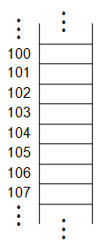
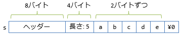

# unsafe

## <a id="sec-generated-title-1"></a> <a id="abst"></a>概要

C# や Java などのプログラミング言語では、
コンピュータのメモリ上の任意の場所に自由にアクセスするための手段、
すなわち、ポインターの利用が禁止もしくは制限されています。

ポインターは、その自由さから、非常に有用であると同時に、
危険なものでもあり、バグの原因になりやすいという問題がありました。
そのため、C# や Java などの言語では、
ポインターの代替となる物を用意し、
必要最小限の機能のみを提供する事によって、
簡単でかつ堅牢なプログラミング環境を提供しています。

ただし、C# では、
C言語などの既存のプログラミング言語との相互運用性や、
プログラムの実行効率向上のために、
ポインターを完全に廃止するのではなく、
<strong id="unsafe" class="keyword">unsafe</strong> コンテキストと呼ばれる特別な場面でのみポインターを利用できるようにしています。


##### <a id="sec-generated-title-2"></a>ポイント

* unsafe キーワードの付いたメソッド内や、unsafe ブロック内限定で、ポインターなどの低レベル機能が使える。

* unsafe を使うためには、コンパイル時に /unsafe オプション(`AllowUnsafeBlocks`)を付ける必要がある。

* C言語などとの相互運用のためにあるもの。それ以外の用途（パフォーマンス向上など）に使うのは最終手段。


## <a id="sec-generated-title-3"></a> <a id="about-pointer"></a>ポインターとは

（
「[コンピュータの基礎知識](../../computer/index.md)」に、
もう少し詳しいポインターの説明を書いたので、
そちらも参照してみてください →
「[メイン・メモリ](../../computer/general/memory.md)」。
）

プログラム中で使用する変数の値はメモリに記憶されています。
図1に示すように、メモリ上には値を格納するための領域が一直線に並んで、
それぞれに<em>アドレス</em>(変数の所在地を示す番号)が付いています。
そして、アドレスを格納するために用いるのが<em>ポインター</em>(アドレスを指し示す変数という意味)です。

<figure>

[](../../../../assets/media/ufcpp2000/csharp/fig/pointer1.png)

<figcaption>アドレス</figcaption>
</figure>


ポインターを説明するために、C# の前身であるC++によるポインターの利用例を示します。
C++では、変数の宣言するとき、
型名の後に `*` を付けるとポインター変数になります。
また、変数の前に <code>&amp;</code> を付けることで、
その変数のアドレスを取り出すことができます。
逆に、ポインターの参照先の値を読み書きするには、
ポインター変数の前に `*` を付けます。

```csharp
// 注: C++ です。

int* p; // ポインターの宣言
int n = 30;

p = &n;     // ポインター p に n のアドレスを代入
cout << *p; // p の参照先 (n) の値 (30) を読み出す
*p = 20;    // p の参照先 (n) の値を 20 に書き換える
cout << n;  // n は 20 に書き換わっている
```


このように、ポインターを使うことで他の変数を参照することが出来ます。
さらに、ポインターにはあくまでメモリ上のアドレスがそのまま数値として格納されていて、
<code>+</code>, <code>--</code>, <code>++</code>, <code>--</code> などの演算子を使って値を自由に変更できます。
この自由さのため、ポインターは正しく使用すれば非常に強力な道具になりますが、
ほんのちょっとした不注意からプログラマの意図しない動作を起こすことがあり、
扱いの難しいものとなっていました。

このような問題を解決するため、
C# や Java などのプログラミング言語では、
ポインターの代替となる機能を提供し、
ポインターの使用を禁止もしくは制限しています。

ここでは、ポインターの詳細についてはこれ以上触れませんが、
従来のプログラミング言語においてポインターがどのような場面で使用されいたのかと、
C# においてどのような機能で代替出来るのかだけ、
以下に簡単にまとめます。

<table summary="">

	<tr>
		<th>ポインターを必要とする場面</th>
		<th>代替機能</th>
	</tr>
	<tr>
		<td markdown="1">動的確保</td>
		<td markdown="1">参照型の変数は常に動的に確保される。</td>
	</tr>
	<tr>
		<td markdown="1">動的配列</td>
		<td markdown="1">C# の配列は元々動的。</td>
	</tr>
	<tr>
		<td markdown="1">引数の参照渡し</td>
		<td markdown="1">参照変数を使うもしくは ref、out キーワードを使う。</td>
	</tr>
	<tr>
		<td markdown="1">配列に対する反復処理の効率化</td>
		<td markdown="1">for や foreach に対してコンパイラーが最適化を掛けて、効率のいいコードにする。</td>
	</tr>
</table>


## <a id="sec-generated-title-4"></a> <a id="unsafe"></a>unsafe コード

従来のプログラミング言語でポインターを必要としていた場面のほとんどは、
他の機能で代替することが出来るため、
C# や Java 言語にとってポインターは必須なものではありません。
そのため、Java 言語ではポインターを完全に廃止しています。
しかし、C# ではプログラムの効率化と従来のプログラミング言語との相互運用を目的として、
制限付きながらポインターの使用可能にしてあります。

まず、ポインター使用における制限ですが、
C# では <em>unsafe キーワード</em>を用いて宣言されたメソッドもしくはブロック内(このようなコードを <em>unsafe コード</em>と呼びます)でしかポインターを使用できません。
メソッドに unsafe 修飾子を付けることでそのメソッド内部は unsafe コードとなり、
そのメソッド内でポインターを使用できるようになります。
また、<code>unsafe{}</code> と言うように、ブロックの手前に unsafe キーワードを付けることで、そのブロック内部でのポインター使用が可能になります。

```csharp
unsafe void UnsafeMethod()
{
  // unsafe メソッド。
  // ポインターが使用可能。
}

void SafeMethod()
{
  // ポインター使用不可。

  unsafe
  {
    // unsafe ブロック。
    // ブロック内でのみポインター使用可能。
  }
}
```


さらに、プログラム内で unsafe キーワードを使用するためには、
<em>
        コンパイル時に <code>/unsafe</code> オプションを付ける必要があります
      </em>。
前節で述べたように、ポインターの使用は危険を伴うため、
C# ではこのような強い制限を設けています。

ちなみに、C# コンパイラーのオプションは `/unsafe` ですが、csproj ファイルに書くタグとしては `AllowUnsafeBlocks` という名前になっています。

```xml
<Project Sdk="Microsoft.NET.Sdk">
 
  <PropertyGroup>
    <TargetFramework>net5.0</TargetFramework>
    <AllowUnsafeBlocks>true</AllowUnsafeBlocks>
  </PropertyGroup>
 
</Project>
```

## <a id="sec-generated-title-5"></a> <a id="managed-pointer"></a>補足: managed ポインター

「[参照渡しとポインター](../resource/sp_ref.md#pointer)」などでも触れていますが、
内部的には、[参照渡し](../resource/sp_ref.md#byref)はポインターと同じような処理です。
また、[参照型](../resource/oo_reference.md#reftype)の変数も、内部的にはポインターになっています。

ただし、以下のような差があります。

- 参照型変数や参照渡しは、以下の意味で .NET ランタイムの管理下にある
    - [ガベージ コレクション](../resource/rm_gc.md#garbage-collection)(GC)によってトラッキングされている
    - GC が誤動作を起こさないように、意図しない書き換えができないように厳しく制限されている
- (本項で説明する)ポインターは、.NET ランタイムに管理されていない代わりに自由な読み書きができる

この意味で、参照型変数や参照渡し(が内部で使っているポインター)を、managed ポインターと呼びます。
また、managed ポインターとの区別が必要な場面では、
本項のポインターのことを unmanaged ポインターと呼ぶこともあります。

C# では制限されていますが、[IL](../../il/index.md)のレベルでは実は制限が緩く、
managed ポインターと unmanaged ポインターを相互に変換できたりします。
「GCによるトラッキング」のも兼ねて、実際に変換を行うコードを示しましょう。
(このコードの実行には [Unsafe パッケージ](https://www.nuget.org/packages/System.Runtime.CompilerServices.Unsafe/)が必要です。)

```csharp
using System;
using System.Runtime.CompilerServices;
using static System.Console;

// C# の参照型が内部的にどうなっているか試してみるために、フィールド1個だけのクラスを用意。
class X
{
    // フィールドが1個だけなので、順序に悩む必要なし。
    // クラスの場合、フィールドが複数あるとき、並び順はコンパイラーが自由に変えていい仕様になってるので注意。
    // (StructLayout 属性を付けて制御はできる。)
    public int Value;
}

unsafe class Program
{
    // 参照型変数が指す先のヒープのアドレスを取得。
    // Unsafe クラスは、C# では絶対に書けない処理をやってくれる(中身は IL assebler 実装)。
    // C# の unsafe コード以上に unsafe なことができるやべーやつ。
    // IL は案外がばがばで、C# コンパイラーのレベルで安全性を保証してることが結構ある。
    static ulong AsUnmanaged<T>(T r) where T : class => (ulong)Unsafe.As<T, IntPtr>(ref r);

    // 同上、ref が指す先のアドレスを取得。
    static ulong AsUnmanaged<T>(ref T r) => (ulong)Unsafe.AsPointer(ref r);
        
    static void Main()
    {
        // GC 誘発用に無駄オブジェクトを無駄に大量生成。
        void GenerageGarbage()
        {
            for (int i = 0; i < 1000000; i++) { var dummy = new object(); }
        }

        GenerageGarbage();

        var x = new X { Value = 12345678 };
        ref var r = ref x.Value;

        // 通常ではない手段(Unsafe クラス)を使って、managed ポインターを無理やり unmanaged ポインター化。
        var addressOfX = AsUnmanaged(x);
        var addressOfValue = AsUnmanaged(ref r);

        WriteLine((addressOfX, addressOfValue));

        GenerageGarbage();
        GC.Collect(0, GCCollectionMode.Forced);
        WriteLine("--- ここで GC 発生 ---");

        // 無理やり数値化した方のアドレスまでは追えないので、当然、前のアドレスのまま。
        // もう無効なアドレスなので、ここに対して読み書きするとクラッシュ・セキュリティ ホールの原因になる。
        WriteLine("unmanaged " + (addressOfX, addressOfValue));

        // GC 発生後、アドレスが変わってる。
        // 大体は前に移動しているはずなので、値が小さくなってる。
        WriteLine("managed   " + (AsUnmanaged(x), AsUnmanaged(ref r)));

        fixed (int* p = &x.Value)
        {
            // fixed している間はどれだけゴミを出そうが x は移動しない。
            GenerageGarbage();
            GC.Collect(0, GCCollectionMode.Forced);
            WriteLine("--- ここで GC 発生(fixed) ---");

            // fixe 直前と変わってないはず。
            WriteLine("managed   " + (AsUnmanaged(x), AsUnmanaged(ref r)));
        }
    }
}
```

実行すると、一例ですが以下のようになります(数値は毎回変わります)。

```console
(2349487527640, 2349487527648)
--- ここで GC 発生 ---
unmanaged (2349487527640, 2349487527648)
managed   (2349484335496, 2349484335504)
--- ここで GC 発生(fixed) ---
managed   (2349484335496, 2349484335504)
```

`AsUnmanaged`メソッドが変換処理に当たります。

このコードを実行すると、managed ポインターの値(アドレス)は、GCが発生する前後で変化しています。
これは、[コンパクション](../../computer/essential-software/memorymanagement.md#compaction)という処理が走ったせいで、
実際にオブジェクトが配置されている場所が変更されています。
.NETランタイムが、この変更に追従して変数の内容を書き換えています。

一方で、unmanaged ポインターは、GCの前後で変わりません。
GCにとってはあずかり知らぬ存在で、コンパクションの結果は反映されません。

これではまずいので、「unmanaged ポインターを使っている間はコンパクションでオブジェクトを移動させないでほしい」という制約を書けるのが、後述する [`fixed` ステートメント](#fixed)です。

## <a id="sec-generated-title-6"></a> <a id="function"></a>unsafe コード限定機能

unsafe コード内では以下の機能が利用可能となります。

* ポインターの使用。

* 配列の静的確保(stackalloc)。

* sizeof 演算子

* アドレス固定(fixed)。


詳しくは次節以降で説明していきます。


### <a id="sec-generated-title-7"></a> <a id="unmanaged-types"></a>アンマネージ型

ちなみに、
[ガベージ コレクション](../../computer/essential-software/memorymanagement.md#garbage-collection)の管理対象(managed)になっている型に対してunsafeなことをされると破滅的な結果を招くので、そういう型に対してはポインターなどの利用を制限する必要があります。

そこで、以下のような条件を満たす型をアンマネージ型(unmanaged type)と呼び、
ポインターなどを利用できるのはこの条件を満たす型のみに限定しています。

* 値型である
* 構造体の場合、再帰的に、アンマネージ型なメンバーしか含まない
* 非ジェネリック<sup>※</sup>

<sup>※</sup> この条件は過剰で、C# 7.3 (「[unmanaged制約](#unmanaged-constraints)」参照) と C# 8.0 ([アンマネージなジェネリック構造体](#unmanaged-generic-struct))で緩和されています。

## <a id="sec-generated-title-8"></a> <a id="pointer"></a>ポインター

C# では、C++ 言語と似た文法でポインターを使用できます。
すなわち、<code>&amp;</code> 演算子を用いてアドレスの取り出し、
<code>*</code> 演算子を用いてポインターの指している先を参照、
<code>+</code>, <code>--</code>, <code>++</code>, <code>--</code> などの演算子を使ってアドレスの値を計算できます。

ちなみに、`&` を アドレス取得式(address-of expression)、`*` を間接参照式(pointer indirection expression)と呼びます。

```csharp
using System;

class UnsafeTest
{
  static void Main()
  {
    unsafe
    {
      int n;
      int* pn = &n;        // n のアドレスをポインター pn に代入。
      byte* p = (byte*)pn; // 違う型のポインターに無理やり代入可能。

      *p = 0x78; // n の最初の1バイト目に 0x78 を代入
      ++p;
      *p = 0x56; // n の2バイト目に 0x56 を代入
      ++p;
      *p = 0x34; // n の3バイト目に 0x34 を代入
      ++p;
      *p = 0x12; // n の4バイト目に 0x12 を代入

      Console.Write("{0:x}\n", n); // n の値を16進数で表示。
    }
  }
}
```
```console
12345678
```

また、ポインターには `->` というポインター専用演算子と、配列と同じ `[]` によるアクセスが使えます。

| 演算子 | 説明 |
|---|---|
| `->` | ポインター メンバー アクセス(pointer member access)。`p->x` で、 `(*p).x` と同じ意味。 |
| `[]` | ポインター要素アクセス(pointer element access)。`p[i]` で `*(p + i)` と同じ意味。 |

例えば以下のように使います。

```csharp
using System;

struct Point
{
    public short X;
    public short Y;
}

class Program
{
    unsafe static void Main()
    {
        var p = new Point();

        // アンマネージ型の変数にはポインターを使える
        // & でアドレス取得(ポインター化)
        // 型推論(var)も効く
        var pp = &p;

        // int 型のポインターに無理やり代入
        // p のある位置に無理やり int の値を書き込み
        int* pi = (int*)pp;
        *pi = 0x00010002;

        // -> で構造体のポインターのメンバーにアクセス
        Console.WriteLine(pp->X); // (*pp).X と同じ意味 = 2
        Console.WriteLine(pp->Y); // (*pp).Y と同じ意味 = 1

        // byte 型のポインターに無理やり代入
        byte* pb = (byte*)pp;

        // ポインターには配列と同じように [] が使える
        Console.WriteLine(pb[0]); // *(pb + 0) と同じ意味 = 2
        Console.WriteLine(pb[1]); // *(pb + 1) と同じ意味 = 0
        Console.WriteLine(pb[2]); // *(pb + 2) と同じ意味 = 1
        Console.WriteLine(pb[3]); // *(pb + 3) と同じ意味 = 0
    }
}
```

### <a id="sec-generated-title-9"></a> <a id="unsafe-using">unsafe 型に対する using エイリアス</a>

<h5 class="version version12">Ver. 12</h5>

C# 12 で [using エイリアスで使える型が増えました](../structured/sp_namespace.md#using-any-type)。
それに伴ってポインターや[関数ポインター](functionpointer.md)に対しても using エイリアスを書けるようになりました。

ただし、これらの型は unsafe な型なので、unsafe 修飾子を必要とします。
そのため、using ディレクティブにも unsafe 修飾を付けます(以下のように、using の後ろに unsafe を書きます)。

```csharp
using unsafe Pointer = int*;
using unsafe FuncPointer = delegate*<int, void>;
```

## <a id="sec-generated-title-10"></a> <a id="stackalloc"></a>スタック上への配列の確保(stackalloc)

C# で通常使用している配列はヒープ領域にメモリを確保しています（参考: 「[[雑記] スタックとヒープ](../resource/misc_heap.md)」 ）。
しかしながら、ヒープ領域への読み書きは、スタック領域と比べ、少しですが効率が悪くなります。
そのため、C# では unsafe コード内限定で、配列をスタック上に確保するための構文を用意しています。

スタック上への配列確保は以下に示すように、 <code>stackalloc</code> キーワードを用いて行います。

```csharp
型名* 変数名 = stackalloc 型名[配列長];
```


変数の型が <code>型名[]</code> から <code>型名*</code> に、
インスタンスの作成方法が <code>new 型名[配列長]</code> から <code>stackalloc 型名[配列長]</code> に代わっていますが、通常の配列と似たような構文で使用できます。


##### <a id="sec-generated-title-11"></a>サンプル

```csharp
using System;

class UnsafeTest
{
  static void Main()
  {
    unsafe
    {
      const int N = 10;
      const int MAX = 99;
      int* x = stackalloc int[N]; // 配列をスタック上に確保
      Random rand = new Random();

      // 配列 x に乱数を代入
      for(int i=0; i<N; ++i)
      {
        x[i] = rand.Next(MAX);
        Console.Write("{0}, ", x[i]);
      }
      Console.Write('\n');

      // 配列 x を整列
      for(int i=0; i<N; ++i)
        for(int j=i+1; j<N; ++j)
          if(x[i] > x[j])
          {
            int tmp = x[i];
            x[i] = x[j];
            x[j] = tmp;
          }

      // 整列結果を出力
      for(int i=0; i<N; ++i)
      {
        Console.Write("{0}, ", x[i]);
      }
      Console.Write('\n');
    }
  }
}
```


```console
56, 67, 82, 23, 86, 78, 27, 92, 39, 13,
13, 23, 27, 39, 56, 67, 78, 82, 86, 92,
```

### <a id="sec-generated-title-12"></a> <a id="safe-stackalloc"></a>安全な stackalloc

<h5 class="version version7">Ver. 7.2</h5>

C# 7.2から、[`Span<T>`構造体](../resource/span.md)を使うことで、
unsafe なしで `stackalloc` 演算子を使うことができるようになりました。
といっても、unsafe なしで危険なことができるわけではありません。
安全性は`Span<T>`構造体が保証してくれます。

```csharp
using System;

class Program
{
    static void Main()
    {
        Span<int> s = stackalloc int[5];
    }
}
```

詳しくは、「[安全な stackalloc](../resource/span.md#safe-stackalloc)」で説明します。

### <a id="sec-generated-title-13"></a> <a id="stackalloc-initializer"></a>stackalloc 初期化子

<h5 class="version version7">Ver. 7.3</h5>

C# 7.3から、`stackalloc`に対して、配列と同じような初期化子を使えるようになりました。
配列同様、初期化子中の要素の型からの推論も効きます。

```csharp
// 初期化子。{ } を使って初期値を与えられる。
Span<int> x1 = stackalloc int[3] { 0xEF, 0xBB, 0xBF };

// 初期化子があるとき、サイズは省略可能。
Span<int> x2 = stackalloc int[] { 0xEF, 0xBB, 0xBF };

// 初期化子から推論できるときは型名も省略可能。
Span<int> x3 = stackalloc[] { 0xEF, 0xBB, 0xBF };
```

### <a id="sec-generated-title-14"></a> <a id="loop"></a>注意: ループ中の stackalloc

`stackalloc` で確保したスタック領域は、実は関数を抜けるまで解放されません。
例えば以下のようにループ中で `stackalloc` を使うと結構あっさり stack overflow (要はメモリ不足)を起こします。

```csharp
using System;
 
class Program
{
    static void Main()
    {
        for (int i = 0; i < 1000; i++)
        {
            // ループの中でしか使ってないけど、実際に解放されるのは Main を抜けるタイミングだったり。
            // (確保は毎ループで起きる。)
            // ループを繰り返してるうちに stack overflow を起こす。
            Span<byte> _ = stackalloc byte[10000];
        }
    }
}
```

特に、C# 8.0 では[式中の stackalloc](../resource/span.md#nested-stackalloc) が認められて気軽に書きやすくなったので注意が必要です。

解決方法ですが、関数を抜ければ解放されるので、以下のようにローカル関数を1個挟むだけでよかったりします。

```csharp
using System;
 
class Program
{
    static void Main()
    {
        for (int i = 0; i < 1000; i++)
        {
            // 別関数を挟めば大丈夫(ローカル関数でも可)
            loopBody();
 
            void loopBody()
            {
                Span<byte> _ = stackalloc byte[10000];
            }
        }
    }
}
```

## <a id="sec-generated-title-15"></a> <a id="sizeof"></a>sizeof 演算子

unsafe コード内では、sizeof 演算子で構造体の領域サイズを取得できます。
（通常（unsafe コードの外では）、sizeof 演算子でサイズを取得できるのは int や char など、C# の規格上サイズが決まっている数値型のみです。）

```csharp
using System;

class Program
{
    unsafe struct X
    {
        byte x;
        int y;
    }

    static void Main()
    {
        unsafe
        {
            Console.WriteLine(sizeof(X));
        }
    }
}
```


```console
8
```


構造体のメンバーのレイアウトは、必ずしも隙間なく並ぶわけではなく、
メンバーのアドレスが4の倍数になるように隙間が作られたりします。
（32ビット CPU では、4バイト単位で値を読み書きするため、その方が実行効率がいい。
CPU の種類によって、最適な間隔は変わります。）
上記の例でも、1バイトの x と、4バイトの y の間に隙間が空いて、X 構造体全体では8バイトの領域を占めています。


## <a id="sec-generated-title-16"></a> <a id="fixed"></a>アドレス固定(fixed)

[前述の通り](#managed-pointer)、GC 管理下にあるオブジェクトは、GC 発生時に異動する可能性があります。
そして、GC 管理下にあるオブジェクトに対してポインターを使いたい場合には、
しばらくの間オブジェクトの移動を停止してもらう(<em>アドレスを固定する</em>)処理が必要になります。
そのための構文として、C# には `fixed` ステートメントというものがあります。
`fixed` ステートメントは以下のような形で書かれます。

```csharp
fixed(型名* 変数名 = アドレス取得式) 実行したい文
```


`fixed` ステートメント中でアドレスを取得したオブジェクトは GC で移動されなくなり、
アドレスが変化しないことが保証されます。
例えば、参照型のメンバーのアドレスをポインターに代入する場合、以下のようにします。

```csharp
// Complex クラスは re, im というdouble 型のメンバーを持っているものとする。
Complex c = new Complex(1, 0);
fixed(double* p = &c.re)
{
  *p = 10;
}
Console.Write("({0}, {1})\n", c.re, c.im); // (10, 0) と表示される
```

ちなみに、C# では、配列と文字列に対して、`fixed`ステートメントを使うことで、
配列・文字列の先頭要素・文字のアドレスを取得することができます。

### <a id="sec-generated-title-17"></a> <a id="array"></a>配列

`fixed`ステートメント中で、
配列をポインターに暗黙的に変換することができます。

```csharp
int[] array = new int[10];
fixed (int* p = array)
{
}
```

例えば以下のように、ポインター`px`を介して配列 `array` の内容を書き換えられます。

```csharp
class Program
{
    unsafe static void Main()
    {
        var array = new[] { 1, 2, 3, 4, 5 };

        // 配列 x をポインター px に代入する。
        fixed (int* px = array)
        {
            // ポインターを介して配列 x の内容を変更。
            for (int* p = px; p != px + array.Length; ++p)
                *p = (*p) * (*p);
        }

        // 結果出力。
        for (int i = 0; i < array.Length; ++i)
            System.Console.Write("{0} ", array[i]);
        // 1 4 9 16 25 と表示される。
    }
}
```

この場合、`&`演算子は必要ありません。
ほぼ `&array[0]` (先頭要素のアドレスの取得)と同じ意味ですが、1点だけ、空配列の時に以下のような差があります。

- `array`からの変換の場合、空配列を渡すと 0 (null ポインター)が得られる
- `&array[0]`の場合、空配列を渡すと IndexOutOfRange 例外が発生する

```csharp
using System;
using static System.Console;

class Program
{
    unsafe static void Main()
    {
        var array = new int[0]; // 空っぽ

        fixed (int* p = array) WriteLine((ulong)p); // 0

        try
        {
            // この書き方だと今度は例外になる。
            fixed (int* p = &array[0]) WriteLine((ulong)p);
        }
        catch (IndexOutOfRangeException)
        {
            WriteLine("IndexOutOfRangeException");
        }
    }
}
```

### <a id="sec-generated-title-18"></a> <a id="string"></a>文字列

配列と同様に、文字列に対しても `fixed` ステートメントが使えます。
この場合は先頭1文字の場所のアドレスが得られます。

```csharp
using static System.Console;

unsafe class Program
{
    static void Main()
    {
        var s = "abcde";
        fixed (char* p = s)
        {
            // 1行に1文字ずつ a b c d e が表示される
            for (int i = 0; i < s.Length; i++)
                WriteLine(s[i]);
        }

        // ちなみに、string の場合は空文字列でも有効なアドレスが返ってくる
        var empty = "";
        fixed (char* p = empty)
        {
            WriteLine((ulong)p);  // 非 0
            WriteLine((int)p[0]); // 常に '\0' が入ってる
        }
    }
}
```

ちなみに、.NET の文字列は、内部的には以下のような構造になっています。



先ほどの例で、空っぽの文字列を `fixed` でポインター化しても有効なアドレスが返ってくると言いましたが、
これは、文字列の末尾に常に 0 が入っていて、
その場所のアドレスを返しても安全だからです。
(C 言語で書かれたコードとの相互運用のために、常にこの無駄な 0 が入っています。)

また、見ての通り、文字列の本当の先頭と、1文字目(`a`)が入っている場所は、
実際には12バイトずれています。
文字列に対して`fixed`ステーメントを使うと、この12バイトを足す処理が C# コンパイラーによって追加されています。
(実際には、何バイトずれているかはOSなどの環境によって異なります。
[`OffsetToStringData`](https://msdn.microsoft.com/ja-jp/library/system.runtime.compilerservices.runtimehelpers.offsettostringdata.aspx)というプロパティから実際のバイト数が取れるので、このプロパティからの読み出しコードも追加されています。
)

#### <a id="sec-generated-title-19"></a> <a id="mutate-string"></a>文字列の書き換え

.NET の文字列(`string`)は、通常は書き換えできません。
しかし、unsafe を使ってポインター越しになら書き換えできてしまいます。

```csharp
unsafe class Program
{
    static void Main()
    {
        var s = "abcde";

        fixed(char* p = s)
        {
            for (int i = 0; i < 5; i++)
                p[i] = (char)(i + '1');
        }

        System.Console.WriteLine(s); // 12345
    }
}
```

ほとんどの場合、文字列を書き換えるのはバグの原因にこそなれど何の利益もないんですが、
「桁数がわかっている数値を整形して文字列化したい」といったときなど、新規に文字列を作るときに利用価値があったりします。

### <a id="sec-generated-title-20"></a> <a id="custom-fixed"></a>ユーザー定義型での fixed ステートメント利用

<h5 class="version version7">Ver. 7.3</h5>

前述の通り、[配列](#array)と[文字列](#string)に対して`fixed`ステートメントを使うと、
ちょっと特殊な処理が掛かっています。

そして、その他にもいくつかの型で、同様の「`fixed`ステートメントでの特殊処理」をしたいことがあります。
例えば以下のようなものがあります。

- [`Span<T>`構造体](../resource/span.md) … 配列や文字列の一部分を指したりする型なので、配列や文字列と同様にポインターを使いたいことがある
- [`ImmutableArray<T>`構造体](https://source.dot.net/#System.Collections.Immutable/System/Collections/Immutable/ImmutableArray_1.cs,570249d040af2b99) … 内部的には配列。その内部の配列に対してポインター操作したいことがある

そこで、C# 7.3では、所定のパターンを満たす型に対して `fixed` ステートメントが使えるようになりました。
以下のように、`GetPinnableReference`という名前のメソッドを用意すれば使えます。

```csharp
// ただの配列のラッパー
readonly struct Array<T>
{
    private readonly T[] _array;
    public Array(int length) => _array = new T[length];
    public ref T this[int index] => ref _array[index];
    public int Length => _array.Length;

    // このメソッドがあれば fixed ステートメントを使えるようになる
    public ref T GetPinnableReference() => ref _array[0];
}

class Program
{
    static void Main(string[] args)
    {
        var a = new Array<int>(5);

        unsafe
        {
            // fixed (int* p = &a.GetPinnableReference()) に展開される。
            fixed (int* p = a)
            {
                for (int i = 0; i < 5; i++)
                    p[i] = i;
            }
        }

        for (int i = 0; i < 5; i++)
            System.Console.WriteLine(a[i]);
    }
}
```

配列や文字列に対しても、C# コンパイラーが特殊処理するのではなく、
`GetPinnableReference`メソッドを用意して上記のパターンに展開したいという話もあります。

ちなみに、[配列の時の特殊処理](#array)、すなわち「空配列だったら 0 (null ポインター)を返す」と同じ結果にしたければ、`GetPinnableReference`を以下のように書く必要があります。
(現状、[`Unsafe`クラス](https://www.nuget.org/packages/System.Runtime.CompilerServices.Unsafe/)が必須です。)

```csharp
using System.Runtime.CompilerServices;

// ただの配列のラッパー
readonly struct Array<T>
{
    // 中略

    public unsafe ref T GetPinnableReference()
    {
        var a = _array;
        if (a.Length == 0) return ref Unsafe.AsRef<T>(null);
        else return ref a[0];
    }
}
```

## <a id="sec-generated-title-21"></a> <a id="fixed-buffer"></a>固定長バッファ

<h5 class="version version2">Ver. 2.0</h5>

C# 2.0 で、unsafe な構造体のメンバーとして、
C 言語の配列風の固定長バッファを定義できるようになりました。

固定長バッファは、以下のように、fixed キーワードを用いて定義します。
通常の C# の配列と異なり、型名[] ではなく、
変数名[要素数] と書きます。

```csharp
[System.Runtime.InteropServices.StructLayout(
  System.Runtime.InteropServices.LayoutKind.Sequential,
  Pack=1)]
unsafe struct Header
{
  public Int16 Source;
  public Int16 Destination;
  public Byte  Type;
  fixed byte reserved[3];
  public Int32 Data;
}
```


固定長配列は、主に unmanaged コードとの相互運用時に用いられます。
その名前の通り、バッファ長は固定で、実行時にサイズを決めたり、
サイズを変えたりすることはできません。


## <a id="sec-generated-title-22"></a> <a id="cppcli"></a>余談： C++/CLI

C# の unsafe の目的は、実行効率の向上と既存言語との相互運用性ですが、
この目的のためなら、C# で unsafe を使う以外に、
<strong id="cppcli" class="keyword">C++/CLI</strong> を使うという選択肢もあります。

C++/CLI は、C++ を .NET Framework 向けに修正したもので、
Microsoft の提供する .NET 言語の中で唯一、
native コードと managed コードを混在させてのプログラミングができる言語です。
C++/CLI を使うことで、既存の（native の） C++ 資源を .NET Framework から利用することも割と容易です。

native なコードは、通常の C++ と同じ構文で記述でき、
managed な部分に関しては、
ref、delegate、property などのいくつかの拡張キーワードや、
TypeName^ や TypeName^% などの追加の記号を使って記述します。

C# と比べるとお世辞にも書きやすいとは言えない言語ですが、
native / managed 混在プログラムを書きたい場合には最良の選択肢となるでしょう。

## <a id="sec-generated-title-23"></a> <a id="how-unsafe"></a>unsafeコードはどのくらいunsafeか

unsafeコードが名前通りunsafe(安全でない)なところを、一例出しておきます。

通常、C#の文字列(`string`型)は書き換えできません。
書き換えれないようなすることで、同じメモリ領域を複数の場所から参照しても安全に使えます(どこか別のあずかり知らぬところで書き換わってる心配がない)。

ですが、unsafeコードを使うと、文字列を書き換えれてしまいます。
例えば以下のようなコードが書けます。

```csharp
using System;

class Program
{
    static void Main()
    {
        // C# の string は書き換えできないはず
        var s1 = "-----";

        // 参照型なので、同じインスタンスを見てる
        // 書き換えれないからこそ、インスタンスの共有が安全
        var s2 = s1;

        // 実際には、C# の string は書き換えれる
        unsafe
        {
            fixed (char* c = s1)
            {
                c[2] = 'X';
            }
        }

        Console.WriteLine(s1); // --X--
        Console.WriteLine(s2); // 同じものを見てるので、こちらにも書き換えの影響が出てて --X--
    }
}
```

無制限にやられてしますと結構怖いコードです。
このように、unsafeコードの利用には注意が必要です。|

## <a id="sec-generated-title-24"></a> <a id="unmanaged-constraints"></a>unmanaged制約

<h5 class="version version7">Ver. 7.3</h5>

これまでに、ポインターなどの機能を使えるのは[アンマネージ型](#unmanaged-types)に限るという話をしました。
アンマネージというのは、「参照型など、[ガベージ コレクション](../resource/rm_gc.md#garbage-collection)のトラッキング対象になっている型を含まない」という意味です。
このことを保証するために、これまでは、「ジェネリックな型を使えない」という制限が掛かっていました。

しかし、C# 7.3では、`unmanaged`という型制約が増えて、
ジェネリック型引数に対してもポインターなどを使えるようになりました。

```csharp
unsafe static void MemSet0<T>(ref T x)
    where T : unmanaged
{
    // 今まではこの T* が許されなかった。
    // たとえ、Point みたいにポインター化可能な型で MemSet0<Point> を呼んだとしてもダメ。
    // unmanaged  制約のおかげで、ポインター化可能になった。
    fixed (T* p = &x)
    {
        var b = (byte*)p;
        var size = sizeof(T);
        for (int i = 0; i < size; i++)
        {
            b[i] = 0;
        }
    }
}
```

`Span<T>`構造体を使った安全な`stackalloc`でも同様に、`unmanaged`制約が有効です。

```csharp
static void SafeStackalloc<T>()
    where T : unmanaged
{
    // unmanaged 制約必須。
    Span<T> span = stackalloc T[4];
}
```

これらは、ちゃんと呼び出し側で制約のチェックが行われます。

```csharp
using System;
using System.Collections.Generic;

class Program
{
    static void SafeStackalloc<T>()
        where T : unmanaged
    {
        Span<T> span = stackalloc T[4];
    }

    static void Main()
    {
        // OK
        SafeStackalloc<int>(); // 値型
        SafeStackalloc<DateTime>(); // 値型だけを含む構造体

        // 以下はNG
        SafeStackalloc<string>(); // 参照型

        // 残念なことに C# 7.3 以前ではジェネリックな型が NG (8.0 で改善)
        SafeStackalloc<KeyValuePair<int, int>>();
        SafeStackalloc<Wrap<int>>();
    }

    struct Wrap<T>
        where T : unmanaged
    {
        public T Value;
    }
}
```

1つ注意すべきは、ジェネリックな型を再帰的に追えるようになるのは C# 8.0 以降です。
C# 7.3 では `Wrap<int>` みたいな、`unmanaged` 制約を満たしているはずの型であってもアンマネージ型と認識できません。

## <a id="sec-generated-title-25"></a> <a id="unmanaged-generic-struct"></a>アンマネージなジェネリック構造体

<h5 class="version version8">Ver. 8.0</h5>

C# 8.0 では、ジェネックな構造体に対して再帰的にアンマネージ型かどうかの判定するようになりました。
型引数全てがアンマネージであれば、その構造体もアンマネージ扱いを受けるようになります。

前節の例の末尾2行もコンパイルできるようになっています。

```csharp
        // C# 7.3 ではダメだったけど、8.0 では OK
        SafeStackalloc<KeyValuePair<int, int>>();
        SafeStackalloc<Wrap<int>>();
```

以下のように、ポインターも使えます。

```csharp
using System.Collections.Generic;
 
class Program
{
    unsafe static void Main()
    {
        var kv = new KeyValuePair<int, int>(1, 2);
        KeyValuePair<int, int>* pkv = &kv;
 
        var wi = new Wrap<int> { Value = 1 };
        Wrap<int>* pwi = &wi;
    }
 
    struct Wrap<T>
        where T : unmanaged
    {
        public T Value;
    }
}
```

何段入れ子になっていても大丈夫です。
ちゃんと、すべてがアンマネージかどうかを調べてくれます。

```csharp
// 何段入れ子になっていても大丈夫
var x = new KeyValuePair<(float, bool), Wrap<int>>((1, true), new Wrap<int>());
var px = &x;
 
// ただし、その中に1つでもマネージな型(参照型)が含まれているとダメ
var y = new KeyValuePair<(float, string), Wrap<int>>((1, ""), new Wrap<int>());
var py = &y;
```

## <a id="sec-generated-title-26"></a> <a id="skip-locals-init"></a>ローカル変数の0初期化抑止

<h5 class="version version9">Ver. 9.0</h5>

C# では通常、[未初期化](../resource/rm_default.md#uninitialized)のままの変数を読むことはできません。

```csharp
using System;
 
// ローカル変数には初期化が必須。
int x = 1;
 
// 初期化されていないものを読もうとするとコンパイル エラー。
int y;
Console.WriteLine(y);
```

ただ、[`stackalloc`](#stackalloc)を使った場合、その要素までは初期化が必須にはなりません。
この時、通常は、未初期化領域を参照してしまわないように、 .NET ランタイムが「規定値(0)で埋める」という処理を行っています。

```csharp
using System;
 
// スタック上に4要素の int を確保。
Span<int> span = stackalloc int[4];
 
// 4要素すべて0で自動的に初期化されている状態になる。
for (int i = 0; i < span.Length; i++)
{
    Console.WriteLine(span[i]); // 0
}
```

本項で説明している unsafe 機能の目的は、「パフォーマンス優先で、安全性はプログラマーが頑張るからコンパイラーは余計なことをしないでくれ」というものです。
なので、この `stackalloc` に対する0初期化も「余計なコスト」になるので避けたいことがあります。
例えば、以下のように、プログラマーにとっては必ず上書きされることがわかってる
(かつ、何かミスがあったときに未初期化領域を参照してしまうのは「自己責任」と割り切れる)
場合、0初期化は無駄です。

```csharp
using System;
using System.Text.Unicode;
 
m("aあ😀");
 
static void m(string s)
{
    // UTF-16 の文字数に大して、UTF-8 のバイト数は最大でも3倍以内。
    Span<byte> buffer = stackalloc byte[s.Length * 3];
    Utf8.FromUtf16(s, buffer, out _, out var bytesWritten);
 
    // FromUtf16 の仕様上、bytesWritten バイト目までは必ず上書きされる。
    // 上書きされた部分だけを使う分には0初期化は「余計なお世話」。
    var written = buffer[..bytesWritten];
 
    foreach (var b in written)
    {
        Console.WriteLine(b);
    }
}
```

C# 9.0 で、unsafe 限定で、この0初期化をスキップできるようになりました。
メソッドに `SkipLocalsInit` 属性 (`System.Runtime.CompilerServices` 名前空間)を付けるだけです。

```csharp
using System;
using System.Runtime.CompilerServices;
using System.Text.Unicode;
 
m("aあ😀");
 
[SkipLocalsInit]
static void m(string s)
{
    // この buffer は中身が0初期化されない。
    Span<byte> buffer = stackalloc byte[s.Length * 3];
 
    // 以下、先ほどと同じコードは省略。
}
```

ただ、本当に unsafe なので、`/unsafe` オプション(`AllowUnsafeBlock`)が必須です。
現状、ポインターや[ネイティブ相互運用](sp_pinvoke.md)を使わずに未初期化領域を参照できてしまう唯一の機能になります。
例えば、以下のようなコードを書くと「不定な値」が返ってきます。

```csharp
using System;
using System.Runtime.CompilerServices;
 
m();
 
[SkipLocalsInit]
static void m()
{
    Span<int> span = stackalloc int[4];
 
    foreach (var x in span)
    {
        // ここで何の値が表示されるかは未定義。
        // Debug ビルドだと0が返ってきたりするものの、Release ビルドだと毎回違う値が返ってきたり。
        Console.WriteLine(x);
    }
}
```

ちなみに、`SkipLocalsInit` 属性はクラスやモジュールに付けることができて、
その場合、クラス内・モジュール内全部のメソッドの0初期化が抑止されます。

この0初期化をケチるほど安全性よりもパフォーマンスを優先することは低頻度で多くの開発者にとっては無縁ではありますが、パフォーマンス最優先な場面は全くないわけではありません。
例えば、 .NET の基本クラス ライブラリ自身がこの属性を使ってパフォーマンスを改善していたりします。
(C# 9.0 以前は、特殊なビルド処理を掛けることで同様の処理を無理やり実現していたようですが、
C# 9.0 (.NET 5.0) からはこの機能を使うようになったようです。)

## <a id="sec-generated-title-27"></a> <a id="function-pointer"></a>関数ポインター

<h5 class="version version9">Ver. 9</h5>

C# 9.0 で、関数ポインターも使えるようになりました。

詳しくは「[関数ポインター](functionpointer.md)」で説明します。

## <a id="sec-generated-title-28"></a> <a id="pointer-of-managed-types">マネージ型のポインター</a>

C# 11 から、マネージ型のポインターを使えるようになりました。
すなわち、
参照型 `T` や [ref 構造体](../resource/refstruct.md) `R` に対して、
`T*` や `R*` みたいなポインター型を書いたり、
それらの変数 `x` に対して `&x` でアドレス取得できるようになりました。

```csharp
unsafe
{
    string s = "";
    Span<byte> x = stackalloc byte[4];

    // 以下のような型、アドレス取得はこれまではエラーになっていた。
    // (C# 11 以降も警告にはなる。多少の緩和があった。)
    string* ps = &s;
    Span<byte>* px = &x;
}
```

C# 11以降でも警告になることからわかる通り、割かし危険度の高い機能です。
(コンパイラーチェックが効かないプログラマー裁量での)安全性を保つためにはかなりの注意を要するため、
あまり利用は推奨しません。

ただ、こういう「推奨はされないけども最終手段として使える回避策」が必要になることもまれにあります。
これまでのようにエラーになってしまうと、もっと醜悪でもっと危険な手段を取らないと最終手段の回避策すら取れません。
(例: [Unsafe クラスその1](../../../blog/2018/12/unsafe/index.md)、
[その2](../../../blog/2018/12/unsafegarantee/index.md)、
[その3](../../../blog/2018/12/unsafenogarantee/index.md))

それと比べれば、[`unsafe` コンテキスト](sp_unsafe.md)は C# 1.0 の頃から使われてきている安定の最終手段なので、まだマシといえます。
そのため、「気乗りはしないけどもしょうがなさげ」くらいのノリで、
「マネージ型のポインター」が認められることになりました。

ちなみに、[ref フィールド](../cheatsheet/ap_ver11.md#ref-field)がらみの作業をしている途中で必要になったようです。
(C# 11 のタイミングで重い腰を挙げて実装されたのはそのせい。)
