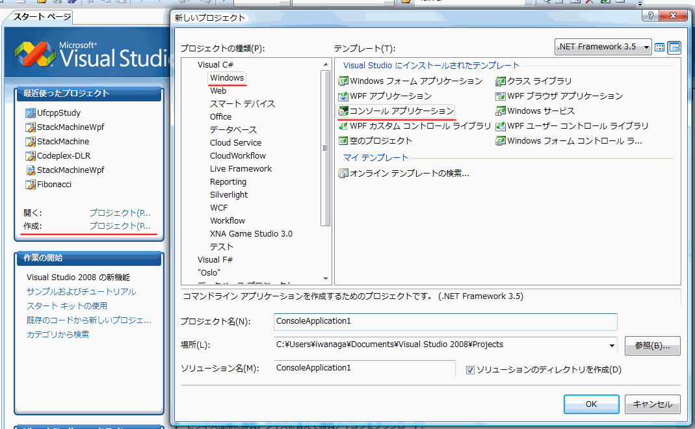

# はじめてのプログラミング

## 概要
まず、初心者の人向けに、プログラミングの勉強の仕方について、
個人的に思うところを書いてみようかと。

## はじめから C
Q.
はじめから C# でいいの？
  
A.
何の言語使ってもいいって言うなら、むしろ C# はよい選択肢になりうる。

理由は以下の通り。

* 言語仕様が非常に洗練されている。
    * C# には Microsoft の長年のノウハウや、 Microsoft に寄せられる膨大な量の開発者フィードバックの結果が詰まっている。

    * 比較的新しくて、過去のしがらみ・悪習が少ない。 古い言語ほど、プログラミングと関係ないところでの苦労が多い。

* ツールがしっかりしている。 Visual Studio の出来の良さはかなりのもの。

* 標準ライブラリが充実。標準ライブラリだけの状態でかなりのことができる。

* C# / .NET （と、その他関連する Microsoft 技術）は非常に広範囲な用途をカバー。 これだけなんでも簡単にできる言語は他にない。
    * スマホ アプリ（Xamarin）
    * ゲーム（Unity）
    * Windows クライアント（WPF）
    * ウェブサイト（ASP.NET）
    * データベース（SQL Server, LINQ）
    * クラウド（Microsoft Azure）

##### 注意:
とはいえ、C# だけ覚えていればすべてが片付くというものでもありません。

OS レベルやハードウェア レベルに近い低水準機能に触れたいとき、
特に、特定の CPU や GPU に特化した最適化により実行速度を上げたい場合には C# は使えません。
C 言語や C++ などの言語を学ぶことになるでしょう。

それでも、最初に古い悪習を身に着けない、まず蓄積されたノウハウに触れるという意味で、
最近の洗練された言語から学習を初めて、徐々に過去の言語に触れるという順序は悪くないです。

## ツールに頼ろう
C# を学び始めるなら、まず最初にやることは以下の通り。

1. 何よりも先に[Visual Studio や Visual Studio Code](../devenv/ab_devenv.md)などの開発環境をインストールする。

2. <em>テンプレート通りに</em>プロジェクトを作る。 もしくは、サンプルを開く。

3. <em>文字が青くなってる部分</em>は C# のキーワード。 気になったら、このキーワードで検索してみる。

4. 何しようか迷ったら、<em>Ctrl + [Space]</em>を押すか、<em>右クリック</em>。 Visual Studio なら、ツールの補助だけでかなりのことができます。

5. [F1] キー（ヘルプボタン）を押すのは、気になる位置にカーソルを乗せてから。 カーソルが乗ってる場所に関するヘルプが出ます。 ただし、いまどきは付属のヘルプよりも、ネットで検索した方がいい情報が出てきたりもする。

これだけでそれなりに勉強できたりする。

Visual Studio は、プロ用の開発ツールとしてだけでなく、
初心者用の学習ツールとしても超優秀だと思う。

ポイントは、

* ツールには頼れる限り頼る。

* とりあえず、目の前に何もないところで迷うより、意味不明でもいいから何か現物見ながら悩む。

というあたり。

Q.
プログラミング言語だけじゃなくて、ツールの使い方も覚えなきゃいけないからかえって大変なんじゃないの？
  
A.
確実にそのコストの何倍も何十倍もメリットを享受できます。
というか、この手のツールは開発ツールであるとともに、学習ツールとしても見ても優秀です。

Q.
初めからツールに頼ると、ツールなしでコード書けなくなるからダメだって言われた。
  
A.
いまどき、ツールに頼らないと生産性低すぎて仕事になりません。

Q.
Visual Studio をインストールしたはいいけど、テンプレートとかプロジェクトとか言われてもよくわからない・・・
  
A.
下図参照。
赤線の入ってるところをクリック。
（画像は 2008 バージョンのもの。他のバージョンでも、見た目はだいぶ変わりますが、大まかな流れは同じです）

<figure>
	

</figure>

Q.
サンプルを取ってきたけど、どうやって見ればいいの？
  
A.
C# ソースファイル（拡張子 .cs）しかないならそれをクリック。
ソリューションファイル（拡張子 .sln）が付いてるならそっちをクリック。

## 人に見せることを意識しよう
プログラミングに限った話でもないんですが、
何かを学ぶ時は、人に見せることを意識して勉強する方がいいです。

いまどきなら、ブログでも立ち上げて実際に公の場で人に見せるのも効果的でしょう。
そうでなくても、「いつ見られてもいいように」という心掛けは学習を促進します。

独学でなく、頼れる友人や先輩でもいるなら、恥ずかしがらずに全部見てもらうべき。
日報や進捗報告には書いたソース（の置き場所等）も含めましょう。
校正の赤ペンで真っ赤にされるのは、恥ではなくて貴重な経験。

「ただ見てもらう」よりは、「誰かに教える」方がより効果的です。
一方的に教えられるような立場でなくても、互いに教えあいましょう。
「自分では書けるようになった」はまだ「わかったつもり」、半人前です。
人に教えられるようになって初めて一人前です。
