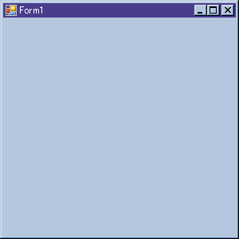
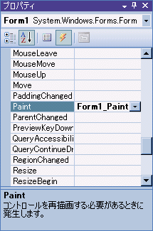
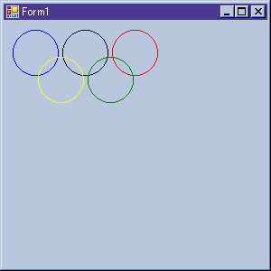

# グラフィック

## <a id="sec-generated-title-1"></a> <a id="abst"></a>概要

System.Drawing 名前空間以下に、
画像ファイルの読み書きや、
直線や円などを画像に描くためのクラスが用意されています。


## <a id="sec-generated-title-2"></a> <a id="image"></a>Image

System.Drawing.Image はベクタ画像・ビットマップ画像問わず、画像を扱うためのクラスです。
png, jpg, gif 等、さまざまな画像形式ファイルを読み書きできます。

ただし、ベクタ画像も含む、抽象的なクラスとして設計されているので、
「座標 (x, ｙ) のピクセルの色データを取り出す」等といった操作は出来ません。

ここでは、例として、画像を読み出して、jpeg 形式で保存しなおしてみましょう。
といっても、非常に簡単で、以下のような数行ほどのプログラムでできます。

```csharp
class Program
{
  static void Main(string[] args)
  {
    //↓ 画像ファイルのパスは適当に書き換えて。
    string filename = @"..\..\..\..\webpage\study\csharp\fig\graphics01.png";
    Image img = Image.FromFile(filename);
    img.Save("out.jpg", System.Drawing.Imaging.ImageFormat.Jpeg);
    img.Dispose();
  }
}
```


Image.FromFile メソッドを使用して、
ファイルから画像データを読み出して新しい Image クラスのインスタンスを生成します。
画像の形式は自動判別してくれます。
扱える画像形式に関しては、
System.Drawing.Imaging.ImageFormat 辺りを Visual Studio のヘルプや MSDN のサイトで調べてください。

一方、画像の保存には Save メソッドを用います。
画像形式を拡張子から自動判別するような機能はないので、こちらは
System.Drawing.Imaging.ImageFormat で形式を明示的に指定します。

そして最後に、リソースを破棄するために Dispose メソッドを呼び出します。
この部分に関しては、詳しくは「[リソースの破棄](../resource/oo_dispose.md)」を参照してください。

ちなみに、このプログラムを、Visual Studio のコンソールアプリケーションで作成する場合には、
参照の追加する（System.Drawing ライブラリを使用するということを Visual Studio に教えておく）必要があります。
（「ソリューション エクスプローラ」の「参照」の部分を右クリックして、
「参照の追加」を選択し、
出てきたダイアログボックス中から「System.Drawing」と言うのを探してダブルクリックします。）


## <a id="sec-generated-title-3"></a> <a id="bmp"></a>Bitmap

System.Drawing.Bitmap はビットマップ画像を扱うためのクラスです。

System.Windows.Forms はビットマップベースの GUI 環境なので、
System.Windows.Forms を使った GUI プログラミングでは Bitmap クラスをよく使用します。

ただし、ビットマップに対する図形の描画などは、
次節で説明する Graphics クラスという物を介して行うのが普通です。


## <a id="sec-generated-title-4"></a> <a id="graphics"></a>Graphics

ビットマップ画像や、
System.Windows.Forms GUI プログラムの画面上に、
直線、曲線、矩形、円などを描くためのクラスとして、
System.Drawing.Graphis というクラスが用意されています。

ここでは、例として、Windows アプリケーションのフォーム上に落書きをしてみましょう。
Visual Studio のウィザードに従って、
Windows アプリケーション開発用のプロジェクトを作ると、
初期状態で図1のようなフォームが出来ているはずです。

<figure>

[](../../../../assets/media/ufcpp2000/csharp/fig/graphics01.png)

<figcaption>Windows アプリケーション初期状態</figcaption>
</figure>


このフォームの Paint イベントに対して、以下のような「[イベント ハンドラー](../functional/sp_event.md#eventhandler)」を追加します。

```csharp
private void Form1_Paint(object sender, PaintEventArgs e)
{
  Graphics g = e.Graphics;
  g.DrawArc(new Pen(Color.Blue  ),  10, 10, 50, 50, 0, 360);
  g.DrawArc(new Pen(Color.Black ),  65, 10, 50, 50, 0, 360);
  g.DrawArc(new Pen(Color.Red   ), 120, 10, 50, 50, 0, 360);
  g.DrawArc(new Pen(Color.Yellow),  38, 40, 50, 50, 0, 360);
  g.DrawArc(new Pen(Color.Green ),  93, 40, 50, 50, 0, 360);
}
```


ちなみに、Visual Studio を使えば、イベントハンドラの追加は非常に簡単で、
プロパティウィンドウ（右下に出ているか、出ていなければメニューから「表示(V)」→「プロパティウィンドウ」を選択）の Paint の部分をダブルクリックするだけでイベントハンドラの雛形を自動生成してくれます。（図2）

<figure>

[](../../../../assets/media/ufcpp2000/csharp/fig/graphics02.png)

<figcaption>Windows アプリケーション初期状態</figcaption>
</figure>


その結果、アプリケーション起動時に図3のような落書きが表示されるはずです。

<figure>

[](../../../../assets/media/ufcpp2000/csharp/fig/graphics03.png)

<figcaption>Windows アプリケーションに落書き</figcaption>
</figure>


## <a id="sec-generated-title-5"></a> <a id="gui"></a>GUI 雛形プログラム

Graphic クラス自体はシンプルなものですが、
実際に GUI プログラムを書くためには、
Graphic クラス以外にもいろいろと覚える必要があって、
1からプログラムを書くのは大変です。

例えば、
古くからある Windows のスクリーンセーバー「ライン アート」のような単純な GUI プログラムでも、
作ろうと思うと、System.Windows.Forms や「[スレッド](../async/sp_thread.md#thread)」等の知識が必要です。

そこで、
「ライン アート」のようなタイプの（画面上を図形が動き回るような）プログラムの雛形を用意しました。

[GUI 雛形プログラム（Graphic 用）](https://github.com/ufcpp/UfcppSample/tree/master/Chapters/Old/DrawImage)

Form1.cs 中の「ここの中身を更新してください。」と書かれた region の中だけ修正すればいいようにしてあります。
## <a id="exercise"></a>演習問題

### <a id="exercise-draw1"></a>問題 1

[GUI 雛形プログラム（Graphic 用）](https://github.com/ufcpp/UfcppSample/tree/master/Chapters/Old/DrawImage)をベースに、
画面上を何か図形が動き回るようなプログラムを作成せよ。
Windows のスクリーンセーバー「ライン アート」のような物を目指すとよい。

#### 解答例 1


[GUI 雛形プログラム（Graphic 用）](../../../../assets/source/DrawImage.zip)自体が1つの回答例。
