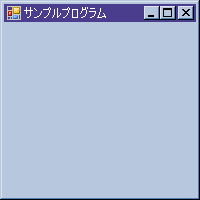
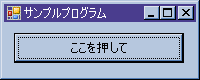
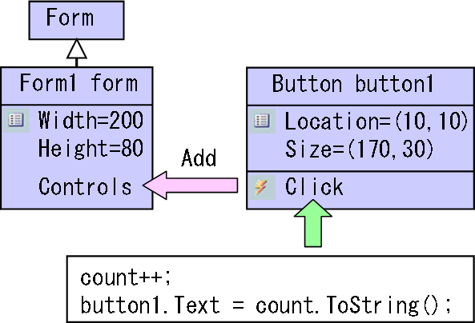

# GUI アプリケーション

## <a id="sec-generated-title-1"></a> <a id="abst"></a>概要

（注：
.NET Framework 3.0 では、
Windows.Forms よりも高機能な GUI 構築基盤
「[Windows Presentation Foundation](../../dotnet/wpf/wpf_abst.md#wpf)」 が追加されました。
.NET Framework 3.0 をインストールしている場合には、そちらを使う方が幸せになれるかも。
ここで説明するのは、.NET Framework 3.0 以前に主流だった話になります。
）

System.Windows.Forms 名前空間以下に、
Windows の GUI （graphical user interface）アプリケーション（要するに、マウスを使ってグラフィカルに操作するアプリケーション）を作成するためのクラス群が用意されています。

C 言語や C++ 等では、
GUI アプリケーションの作成は少々敷居が高かったのですが、
C# や Java ではずいぶんと敷居が下がっています。
これは、GUI アプリケーション開発と「[オブジェクト指向](../oop/oo_about.md#oo)」の親和性が非常に高いためで、
一般に、オブジェクト指向言語を用いると GUI アプリケーション開発が容易になります。

というか、むしろ、
オブジェクト指向の歴史は GUI アプリ開発の歴史とともに進歩してきた面も強いです。
なので、「[オブジェクト指向](../index.md#oop)」で C# とオブジェクト指向を勉強した後ならば、
難しい話はもはや何も残っていません。

また、Visual Studio 等の統合開発環境を利用すれば、
ボタンやリストボックス等の GUI 部品の配置をマウスを使ってグラフィカルに行うことができ、
プログラミングの作業としては「[イベント ハンドラー](../functional/sp_event.md#eventhandler)」の中身を実装するだけで GUI アプリケーションを開発できます。

（ちなみに、System.Windows 以下にあるクラスは、Windows 環境に依存するもので、
.NET Framework の標準化仕様には含まれていません。）


## <a id="sec-generated-title-2"></a> <a id="gui"></a>GUI 部品

今、皆様がお使いであろうウェブブラウザを見てください。
メニューやツールバーがありますね。
さらに、インターネットオプションなんかを開けば、
ボタンやチェックボックス等が並んでいます。
これら、メニューやボタン等、それに、ウィンドウそのものも全て「[オブジェクト](../oop/oo_about.md#object)」です。

System.Windows.Forms 名前空間以下には、
Form や Menu、Button といった名前の「[クラス](../oop/oo_class.md#class)」があり、
その「[インスタンス](../oop/oo_class.md#instance)」を作ることで GUI アプリケーションを構築していきます。


## <a id="sec-generated-title-3"></a> <a id="form"></a>Form

まず、GUI アプリケーションのウィンドウそのもの（.NET Framework ではフォームと呼びます）について説明します。
.NET Framework では、Form というクラスがそれにあたります。

ボタンも何もないただのフォームが1枚現れるだけなのであまり意味はありませんが、
最小の GUI アプリケーションは以下のようなものになります。

```csharp
using System;
using System.Drawing;
using System.Windows.Forms;

class Program
{
  static void Main()
  {
    Application.Run(new Form());
  }
}
```


これを実行すると、
何一つ設定をいじっていないので、図1のようなデフォルトのサイズのフォームが1枚表示されます。
（300×300ドットが標準みたい。）

<figure>
	[](../../../../assets/media/ufcpp2000/csharp/fig/graphics01.png)
	<figcaption>Windows アプリケーション初期状態</figcaption>
</figure>


ちなみに、
これをコマンドプロンプトから「[C# コンパイラ](../start/st_compile.md#cscompiler)」を使ってコンパイルする場合には、
/target:winexe というオプションを付けてください。
（そうしないと、プログラムを実行するたびにコマンドプロンプトが表示されてしまいます。）

```console
csc /target:winexe Program.cs
```


それでは、次に、フォームのサイズを変えたり、
タイトルバーにテキストを表示させたりしてみましょう。
フォームのサイズやタイトル文字は、全て「[プロパティ](../oop/oo_property.md#property)」になっています。
Width プロパティがフォームの幅、
Height が高さ、
Text がタイトル文字になります。
これらを設定し、以下のようなプログラム作成・コンパイルし、実行すると、
図2のようなフォームが表示されるはずです。

```csharp
using System;
using System.Drawing;
using System.Windows.Forms;

class Program
{
  static void Main()
  {
    Form f = new Form();
    f.Width = 200;
    f.Height = 200;
    f.Text = "サンプルプログラム";
    Application.Run(f);
  }
}
```


<figure>
	[](../../../../assets/media/ufcpp2000/csharp/fig/forms01.png)
	<figcaption>幅・高さとタイトル文字を設定</figcaption>
</figure>


ただし、上述のようなプログラミングスタイルは、説明の取っ掛かりとしては分かりやすいのですが、
通常はこのスタイルでは GUI アプリケーションを作りません。
以下のコードに示すように、
フォームごとに Form クラスを「[継承](../oop/oo_inherit.md#derive)」した「[派生クラス](../oop/oo_inherit.md#subclass)」を作るスタイルが一般的です。

```csharp
using System;
using System.Drawing;
using System.Windows.Forms;

class Program
{
  static void Main()
  {
    Application.Run(new Form1());
  }
}

class Form1 : Form
{
  public Form1()
  {
    this.Width = 200;
    this.Height = 200;
    this.Text = "サンプルプログラム";
  }
}
```


## <a id="sec-generated-title-4"></a> <a id="add"></a>GUI 部品を Form に追加

前節のままだと、単にフォームが表示されただけで、あとできることというと、
最小化・最大化・終了くらいのものです。
まともな GUI アプリケーションにするためには、
ボタン等の部品を追加していく必要があります。


### <a id="sec-generated-title-5"></a> <a id="genparts"></a>GUI 部品の作成

ここではボタンを例にして説明しましょう。
ボタンは Button クラスのインスタンスとして作成できます。
幅や高さ、ボタンに表示される文字を、
ぞれぞれ Width, Height, Text プロパティで設定できるあたりは Form クラスと全く同じです。
あるいは、Size プロパティを使えば、幅と高さを同時に指定できます。
また、ボタンを置く位置は Location プロパティを使って指定します。

```csharp
Button button1;
button1 = new Button();
button1.Location = new Point(10, 10);
button1.Size = new Size(170, 30);
button1.Text = "ここを押して";
```


### <a id="sec-generated-title-6"></a> <a id="addparts"></a>Form に追加

これだけでは、ボタンを1つ作っただけで、まだフォーム上に表示されません。
フォームにボタンを登録する必要があります。
.NET Framework では、
フォーム上に表示すべき部品のことをコントロールと呼び、
Form クラスはこのコントロールの一覧である Controls というプロパティを持っています。
そして、Controls に対して、Add メソッドを呼び出すことで、
コントロール（ここでの例の場合、ボタン）を追加することができます。

```csharp
using System;
using System.Drawing;
using System.Windows.Forms;

class Program
{
  static void Main()
  {
    Application.Run(new Form1());
  }
}

class Form1 : Form
{
  Button button1;

  public Form1()
  {
    this.Width = 200;
    this.Height = 80;
    this.Text = "サンプルプログラム";

    this.button1 = new Button();
    this.button1.Location = new Point(10, 10);
    this.button1.Size = new Size(170, 30);
    this.button1.Text = "ここを押して";

    this.Controls.Add(this.button1);
  }
}
```


これをコンパイル・実行すると図3のようなフォームが表示されるはずです。

<figure>
	[](../../../../assets/media/ufcpp2000/csharp/fig/forms02.png)
	<figcaption>ボタンを追加したフォーム</figcaption>
</figure>


### <a id="sec-generated-title-7"></a> <a id="handler"></a>イベントハンドラの設定

前節の段階でもまだあまり意味のある GUI アプリケーションではありません。
なんせ、ボタンを押しても何も起こりません。

ここで、「[イベント](../functional/sp_event.md)」で説明した事が生きてきます。
「ボタンが押された」というのは「[イベント](../functional/sp_event.md#event)」であり、
「ボタンが押されたときになにか処理をしたい」というのはまさに「[イベント駆動型](../functional/sp_event.md#edriven)」のプログラムになります。
実際、.NET Framework の Button クラスには Click という名前のイベントがあり、
これに対して「[イベント ハンドラー](../functional/sp_event.md#eventhandler)」を登録することで、
ボタン押下時の処理を指定します。

例として、ボタンが押されるたびに、押した回数をボタン上に表示するプログラムを作ってみましょう。
以下にソースを示します。
先ほどから追加したのは、背景色を変えて強調してある部分だけです。

```csharp
using System;
using System.Drawing;
using System.Windows.Forms;

class Program
{
  static void Main()
  {
    Application.Run(new Form1());
  }
}

class Form1 : Form
{
  Button button1;
  int count = 0;

  public Form1()
  {
    this.Width = 200;
    this.Height = 80;
    this.Text = "サンプルプログラム";

    this.button1 = new Button();
    this.button1.Location = new Point(10, 10);
    this.button1.Size = new Size(170, 30);
    this.button1.Text = "ここを押して";

    this.button1.Click += new EventHandler(this.Button1_Click);

    this.Controls.Add(this.button1);
  }

  void Button1_Click(object sender, EventArgs e)
  {
    this.count++;
    this.button1.Text = this.count.ToString();
  }
}
```


これでようやく、（ぎりぎりなんとか）胸を張って GUI アプリケーションといえる物が完成しました。
見ての通り、かなりシンプルな作りになっています。
（C# での GUI アプリケーション開発は非常に簡単！）

ここではボタンしか使いませんでしたが、
System.Windows.Forms 名前空間以下には、さまざまなコントロール（GUI 部品）が用意されています。
（詳細は [MSDN](http://msdn2.microsoft.com/ja-JP/library/system.windows.forms.aspx) 等のリファレンスページを参照。）
また、コントロールを自作することも可能です。


### <a id="sec-generated-title-8"></a> <a id="conclusion"></a>まとめ

フォームにコントロール（ボタン等の GUI 部品）を作るには、
以下のような手順を踏みます。

1. コントロールの作成（<code>button1 = new Button();</code>）

2. コントロールの設定変更（<code>button1.Location = new Point(10, 10);</code>）

3. イベントハンドラの作成・登録（<code>button1.Click += new EventHandler(Button1_Click);</code>）

4. コントロールをフォームに追加（<code>Controls.Add(button1);</code>）


<figure>
	[](../../../../assets/media/ufcpp2000/csharp/fig/forms03.png)
	<figcaption>コントロールの追加</figcaption>
</figure>


ちなみに、Visual Studio 等の統合開発環境を利用すれば、
これらの作業の大部分を自動化してくれます。
プログラミング作業的には <code>Button1_Click</code> メソッドの中身を実装するだけで、
残りの作業は、ボタン等のコントロールをマウスでドラッグ＆ドロップしたり、GUI 上で設定変更が可能です。

こういう、統合開発環境を使ったドラッグ＆ドロップ開発などを RAD（Rapid Application Development）といいます。
（参考： 「[RAD デモ](../../miscprog/list/training.md#rad)」。）
