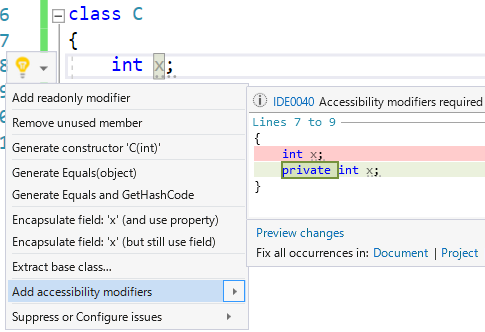
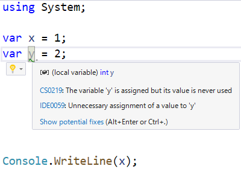

# コード解析とコード生成

## <a id="sec-generated-title-1"></a> <a id="abstract"></a>概要

C# コンパイラーなどを含むいわゆる「開発ツール」にとって重要なことは開発者の生産性を高めることです。
開発ツールが発展してきた現在、コンパイラーの仕事は多岐にわたります。
例えば、以下のようなことをしたいという要求があったりします。

- コード解析 (analyzer): 人的ミスを生みそうなコードははじく。場合によってはその修正方法も提示する(fixer)
- コード生成 (generator): ボイラープレートになりがちなコードを手短に書けるようにする

C# コンパイラー自身が様々なコード解析を提供していますし、
ボイラープレートを避けるために追加された文法もたくさんあります。
一方で、コード解析やコード生成には C# の正規の文法としては入れにくいものもあり、
第3者の作ったプラグインとして機能提供される場合も多いです。
現在の C# コンパイラーは公式にそういうプラグインを組み込むための仕組みを持っています。

文脈的にわかる場合には単に analyzer、generator と呼ばれます。
generator に関しては「ソースコードを生成する」ということを明示して source generator と呼ぶことが多いです。
文脈的にわかりにくい場合には、[C# コンパイラーのコードネーム](https://github.com/dotnet/roslyn)を足して、roslyn analyzer、roslyn source generator と呼んだりします。

積みタスク: [issues/320](https://github.com/ufcpp/UfcppSample/issues/320)

## <a id="sec-generated-title-2"></a> <a id="analyzer"></a>コード解析(analyzer)とコード生成(generator)

C# コンパイラーは現在(というかそれぞれ C# 6.0 世代と C# 9.0 世代で)、コード解析とコード生成のプラグインを書けるようになりました。
コード解析(analyzer)については C# 6.0 のときにも1ページ利用例を書きました: 「[Code-Awareなライブラリ](../package/pkgcodeawarelibrary.md
)」。

C# チームや .NET チームが公式に提供する機能としても、今はコンパイラーの内部に実装するよりも、プラグインとして実装するものが増えています。
例えば、以下のコードを書いたとします。

```csharp
class C
{
    int x;
}
```

C# の文法上は特に問題のない書き方なんですが、推奨されているコーディング規約としては、[アクセシビリティ](../oop/oo_conceal.md#level)を明示(`private` 修飾子を付けた方がいい)と言うことになっています。
こういう、「文法としては間違っていないけども、規約的には推奨されていない」みたいなものに対する情報はプラグインとして提供されていたりします。

上記のコードを Visual Studio で書いていると、以下のように、非推奨である旨が表示されて、修正案を提示してもらえます。



これはコード解析プラグインとして実装されています。

コード生成(generator)はまだ実装されて間もない(C# 9.0 世代での追加)ので実例は少ないですが、今後は公式提供される generator が増えていくと思われます。

## <a id="sec-generated-title-3"></a> <a id="syntax-vs-plugin"></a>文法化 VS プラグイン

[昔ブログに書いたことはあるんですが](../../../blog/2016/12/tipsgeneratedil/index.md)、C# は構文糖衣が多い言語です。
構文糖衣(syntax sugar)というのは、「煩雑でもよければ等価なコードを別の文法で書けるものの、簡潔に書くために導入された文法」みたいなものです。

例えば、[クエリ式](../data/sp3_linq.md#query)がわかりやすい例ですが、以下のコードの `a`、`b`、`c` の3行は全く同じ意味のコードになります。

```csharp
using System.Linq;
 
var data = new[] { 1, 2, 3, 4 };
 
var a =
    from x in data
    where x > 2
    select x * x;
 
var b = data
    .Where(x => x > 2)
    .Select(x => x * x);
 
var c = Enumerable.Select(
    Enumerable.Where(data, x => x > 2),
    x => x * x);
```

`a`の行と`b`の行のどちらが読みやすいかは好みの問題になったりしますが、`c`の行は少し読みにくいと思います。
[クエリ式](../data/sp3_linq.md#query)や[拡張メソッド](../functional/sp3_extension.md#exmethod)はこういう、原理的には他の書き方もできるけど、書きやすさのために使う構文糖衣です。

この手の構文糖衣はある意味、C# コードから別の C# コードを生成しているようなもので、
冒頭で説明したコード生成(generator)の公式提供版と言えます。

この辺りの機能は、ある程度の汎用的であると認定されたからこそ C# の文法として正式に採用されましたが、一方で、用途が狭く、言語機能としては採用しにくいようなコード生成もあります。
要望としてよくあるものとしては [`PropertyChanged`](https://docs.microsoft.com/ja-jp/dotnet/api/system.componentmodel.inotifypropertychanged?WT.mc_id=DT-MVP-4028921) の実装が煩雑で面倒なので専用の文法が欲しいと言われたりします。

例えば、以下のようなコードを書きたい場面があるわけですが、

```csharp
using System.Collections.Generic;
using System.ComponentModel;
using System.Runtime.CompilerServices;
 
class C : INotifyPropertyChanged
{
    public event PropertyChangedEventHandler? PropertyChanged;
    protected void OnPropertyChanged(PropertyChangedEventArgs args)
        => PropertyChanged?.Invoke(this, args);
    protected void SetValue<T>(ref T store, T value, [CallerMemberName] string? propertyName = null)
    {
        if (!EqualityComparer<T>.Default.Equals(store, value))
        {
            store = value;
            OnPropertyChanged(new(propertyName));
        }
    }
 
    private int _x;
    public int X { get => _x; set => SetValue(ref _x, value); }
}
 
```

このコードのうち、実質的に意味を持っているのは「`X` プロパティを持っていて、それに `PropertyChanged` を実装したい」というだけです。
だったら、以下のような簡素なコードから複雑なコードを「コード生成」したいという話になります。

```csharp
class C
{
    [AutoNotify] // 一例。こういう属性が欲しいという話。
    private int _x;
}
```

本当に限られた場面でですが、その場面に行き当たった人にとっては非常に欲しくなる機能です。

こういう場合に使うのがコード生成(generator)です。
上記の `PropertyChanged` に関して、
C# チームとしては、C# の言語機能を追加するつもりはないそうですが、
generator のサンプルを提供しています。

- [AutoNotifyGenerator](https://github.com/dotnet/roslyn-sdk/blob/master/samples/CSharp/SourceGenerators/SourceGeneratorSamples/AutoNotifyGenerator.cs)

この generator を使うと、上記の `AutoNotify` 属性付きのフィールドから以下のようなソースコードを生成します。

```csharp
public partial class C : System.ComponentModel.INotifyPropertyChanged
{
    public event System.ComponentModel.PropertyChangedEventHandler PropertyChanged;
    public int X
    {
        get
        {
            return this._x;
        }
 
        set
        {
            this._x = value;
            this.PropertyChanged?.Invoke(this, new System.ComponentModel.PropertyChangedEventArgs(nameof(X)));
        }
    }
}
```

## <a id="sec-generated-title-4"></a> <a id="tool-vs-plugin"></a>外部ツール VS プラグイン

こういうソースコードの生成は、以前でも、外部ツールを書けば(ソースコードを C# コンパイラーでコンパイルする前に、自前のツールを通してソースコードを書き換えるとかすることは)可能でした。
コンパイラーの関知しない場所での書き換えだと以下のような問題があります。

- どこで何のツールによって生成されたソースコードなのかを調べるのが難しくなることがある
- 生成結果が正しいかどうか、リアルタイムに追うことができない

特に後者は C# にとって重要です。
[Visual Studio](https://visualstudio.microsoft.com/) や [Visual Studio Code](https://code.visualstudio.com/) などの開発環境を使っていると、
C# では、書いたところからリアルタイムにコンパイルが掛かって、エラーや警告をリアルタイムに知ることができます。

例えば以下のようなコードを書いたとします。

```csharp
using System;
var x = 1;
var y = 2;
Console.WriteLine(x);
```

変数 `y` が未使用(何の役にも立っていない)のでミスの可能性が高いコードです。
そこで、C# コンパイラーはこの役に立たないコードに対して警告を出してくれるんですが、
Visual Studio 上では書いた瞬間から警告が出ますし、
`y` を使用するコードを足せば即座に警告が消えます。
また、未使用変数を消してくれる自動修正(code fix)機能も提供してくれています。



こういうリアルタイムなコンパイルをするためにも、外部ツールではなく、コンパイラーのプラグイン機能が必要になります。

コード生成(generator)による生成物も、以下の動画のように、Visual Studio 上では手書きの C# コードと遜色ない扱いを受けることができます。

<div>
<iframe width="560" height="315" src="https://www.youtube.com/embed/vIYGnhi3DOk" title="YouTube video player" frameborder="0" allow="accelerometer; autoplay; clipboard-write; encrypted-media; gyroscope; picture-in-picture" allowfullscreen></iframe>
</div>

以下の機能が使えます。

- 生成物を Solution Explorer で確認
- F12 で生成物にジャンプ
- F9 でブレイクポイントを設置
- F11 でステップイン実行

## <a id="sec-generated-title-5"></a> <a id="usage"></a>コード解析・コード生成の利用

C# 6.0 世代でコード解析(analyzer)を、C# 9.0 世代でコード生成(generator)を書けるようになったといっても、ほとんどの C# 開発者にとってこれらは「自分で書く物」ではなく、「人が書いたものを利用するだけ」になると思います。

C#/.NET チームによる公式提供のものは .NET SDK や Visual Studio に最初から組み込まれていて、意識せずに使うことになります。
([前節](#analyzer)で紹介したアクセシビリティの追加などがその代表例です。)

一方で、プラグインなので、公式提供されなさそうな狭い用途のものも、第3者が作って公開していたりします。
利用するだけであれば、これらコード解析・コード生成プラグインは [NuGet](https://www.nuget.org/) パッケージ参照するだけです。

例として、筆者の自作のコード解析・コード生成を参照してみます。

サンプルコード: [AnalyzerPackageReference](https://github.com/ufcpp/UfcppSample/tree/master/Demo/2021/AnalyzerPackageReference)

コード解析の例として[NonCopyableAnalyzer](https://github.com/ufcpp/NonCopyableAnalyzer)を、コード生成の例として[StringLiteralGenerator](https://github.com/ufcpp/StringLiteralGenerator)を使います。

簡単に説明しておくと、まず、NonCopyableAnalyzerは[構造体](../resource/rm_struct.md)のコピーを禁止するコード解析です。
構造体はコピーが発生してしまうとまずい場面があるんですが、
通常は「コピーされてまずいなら構造体を使うな」という方針にすることが多いです。
ただ、パフォーマンス的にどうしても構造体にした上でコピーを禁止したいという場面がまれにあって、そういう場合に使います。

```csharp
// NonCopyableAnalyzer の機能:
S s1 = new();
S s2 = s1; // 構造体の代入(コピー)を禁止する
 
[NonCopyable]
struct S { }
```

StringLiteralGenerator は C# の通常の[文字列リテラル](../start/st_embeddedtype.md#stringl)から UTF-8 のバイト列を生成するものです。
例えば以下のようなコードを書いて、

```csharp
partial class Literal
{
    [Utf8("aあ😀")]
    public static partial ReadOnlySpan<byte> M();
}
```

以下のようなコードを自動生成します。

```csharp
partial class Literal
{
    public static partial System.ReadOnlySpan<byte> M() => new byte[] {97, 227, 129, 130, 240, 159, 152, 128, };
}
```

どちらも読みやすさや書きやすさよりもパフォーマンスを最優先したい場合に限って使えるもので、あまり汎用に使えるものではありません。
汎用的でないからこそプラグインに向いているものです。

[以下のようなパッケージ参照](https://github.com/ufcpp/UfcppSample/blob/master/Demo/2021/AnalyzerPackageReference/AnalyzerPackageReference/AnalyzerPackageReference.csproj#L8-L11)をすることでこれらのプラグインを追加できます。

```xml
  <ItemGroup>
    <PackageReference Include="NonCopyableAnalyzer" Version="0.6.0" />
    <PackageReference Include="StringLiteralGenerator" Version="1.0.1" />
  </ItemGroup>
```

## <a id="sec-generated-title-6"></a> <a id="empty-body">括弧の省略</a>

<h5 class="version version12">Ver. 12</h5>

C# 12 から、`class A;` というように、クラスの本体の `{}` を省略できるようになりました。
([プライマリ コンストラクター](../cheatsheet/ap_ver12.md#primary-constructor)導入のついでで実装された機能です。)
コード生成とは相性のいい機能なのでここで少しだけ触れておきます。

コード生成や[リフレクション](../dynamic/sp_reflection.md#reflection)に頼るコードでは、
「属性だけつけてクラスの中身は空っぽ」ということが割とよく起きます。

一例が `System.Text.Json` なんですが、
以下のように、[`JsonSerializable` 属性](https://learn.microsoft.com/ja-jp/dotnet/api/system.text.json.serialization.jsonserializableattribute)を使ったコード生成をします。

```csharp
using System.Text.Json.Serialization;

// JsonSerializable 属性を付けていると、シリアライズ処理に必要なメンバーをコード生成する。
[JsonSerializable(typeof(Person))]
partial class MyJsonContext : JsonSerializerContext
{
    // 手書きでは何もする必要がないので空っぽ。
}

record Person(string FirstName, string LastName);
```

ここで `{}` の省略が使えます。
たかだか2行、1文字の差ですが、以下のように書けるようになります。

```csharp
using System.Text.Json.Serialization;

// JsonSerializable 属性を付けていると、シリアライズ処理に必要なメンバーをコード生成する。
[JsonSerializable(typeof(Person))]
partial class MyJsonContext : JsonSerializerContext;

record Person(string FirstName, string LastName);
```
