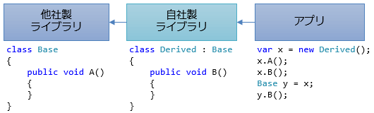

# 互換性の維持

##  概要

C# は後方互換性に非常に注意を払っています。
C# 自身についても、C# のバージョンを上げることで動かなくなるコードが出ないように気を付けて機能追加をしていますし、
C# で書かれたライブラリについても、ライブラリ内の改修がライブラリ利用側で問題になりにくいように気を使って文法を決めています。

##  C# 自体の後方互換性

プログラミング言語に機能を追加する際、既存のプログラム コードがそのままコンパイルできるように互換性を保つことは非常に重要です。

###  文脈キーワード

C# 2.0 以降で追加されたキーワードは、全て文脈キーワード(contexual keyword) というものになっています。通常のキーワードとは違って、特定の文脈でしかキーワード扱いされません。

文脈キーワードの作り方にも数パターンがありますが、いくつか例を挙げて見ましょう。

- `yield`: 2単語で初めてキーワード扱い
- `var`: 変数宣言できる場所で、かつ、`var`という名前の型が存在しない時だけキーワード扱い
- `await`: `async`修飾子が付いたメソッドの中でだけキーワード扱い
- `nameof`: `nameof`という名前のメソッドがない時に限りキーワード扱い

####  yield

1つ目はC# 2.0で追加された「[イテレーター](../data/sp2_iterator.md#iterator)」に関する <code>yield</code> キーワードです。
<code>yield</code> は、 <code>yield return</code> もしくは <code>yield break</code> という2単語並んだ状態でしかキーワード扱いされません。

ですので、C# 1.0時代に以下のようなコードを書いてた人がいたとしても、C# 2.0 以降でも問題なくコンパイルできます。

<pre class="source" title="">
<code>static void Calc(decimal dividends, decimal price)
{
    // yield には歩留まりとか出来高みたいな意味があって、
    // こういう変数名を使う人がいてもおかしくはない
    decimal yield = dividends / price;
    Console.WriteLine(yield);
}
</code></pre>

極端な話、キーワードの`yield` (`yield return`や`yield break`)と並べて、型名や変数名でも`yield`という識別子を使えます。

<pre class="source" title="yield returnの2単語でキーワード">
<code>using System.Collections.Generic;

class Program
{
    static IEnumerator&lt;yield&gt; F()
    {
        // 「yield return」の2単語で初めてキーワードになる
        // 青いところだけがキーワード。
        // 水色が型名、黒が変数名。

        yield yield = 1;
        yield return yield;
    }

    struct yield
    {
        public int value;
        public static implicit operator yield(int n) =&gt; new yield { value = n };
    }
}
</code></pre>

####  var

もう1つ、C# 3.0で導入された「[型推論](../start/sp3_inference.md#type-inference)」に関する <code>var</code> キーワードは、変数宣言出来る文脈でだけキーワード扱いされます。
以下のようなコードも C# 3.0 でコンパイルできます。

<pre class="source" title="var 変数" lang="">
<code>static double Calc(IEnumerable&lt;double&gt; data)
{
    int count = 0;
    double sum = 0;
    double sqSum = 0;
 
    foreach (double x in data)
    {
        ++count;
        sum += x;
        sqSum += x * x;
    }
 
    // 分散(variance)。ローカル変数だし略して var って名前つける人はいる
    double <em>var</em> = (sum * sum - sqSum) / count;
    return var;
}
</code></pre>

また、`var`という名前の型が存在していた場合は、型推論よりも優先的にその`var`型が使われます。

<pre class="source" title="型推論よりも、var型優先">
<code>class Inferred
{
    static void F()
    {
        // この場合は型推論で Int 型の変数 var になる
        var var = 1;
    }
}

class SuccessfullyCompiled
{
    struct var
    {
        public int value;
        public static implicit operator var(int n) =&gt; new var { value = n };
    }

    static void F()
    {
        // この場合は ↑ の var 構造体型の変数 var になる
        var var = 1;
    }
}

class Erroneous
{
    struct var { }

    static void F()
    {
        // この場合は ↑ の var 構造体型になるけども、1 を代入できなくてコンパイル エラー
        var var = 1;
    }
}
</code></pre>

C#では型名を小文字始まりにする習慣があまりないのでめったなことではこういう状態になりませんが、
もし万が一、C# 2.0以前に`var`型を作っていた人がいてもちゃんとコンパイルできます。

逆に、あまり褒められた手法ではないですが、この仕様を逆手にとって、「このプロジェクトでは型推論を使わせない」というコーディング規約を遵守させるためにわざと`var`型を定義しておく人もいるそうです。

####  await

C# 5.0 で導入された非同期メソッド用の <code>await</code> キーワードは、
「<code>async</code> 修飾子がついているメソッドの中でだけキーワード扱いされる」という方法で文脈キーワードになっています
（<code>async</code> はメソッドの手前でだけキーワード扱い）。

<pre class="source" title="">
<code>static int X()
{
    var async = 2; // OK

    // 匿名関数の中などはまた別文脈
    // 匿名関数に async を付けているので、この中では await がキーワード
    Func&lt;Task&lt;int&gt;&gt; f = async () =&gt; { await Task.Delay(3); return async; };

    var await = 5; // OK
    return await * f().Result;
}

static async Task&lt;int&gt; XAsync()
{
    var async = 2;
    Func&lt;Task&lt;int&gt;&gt; f = async () =&gt; { await Task.Delay(3); return async; };
    var await = 5; // コンパイル エラー。キーワード扱いなので変数名に使えない。
    return await * await f();
}
</code></pre>

非同期メソッドの場合、前述の`yield`や`var`とは違い、もしも`await`という名前の型が存在していても、非同期メソッド内では`await`はキーワードです。むしろ、`await`型の方を使うのにエスケープが必要です。

<pre class="source" title="非同期メソッド内ではawait型を使えない">
<code>using System.Threading.Tasks;

class Program
{
    public struct await { }

    static async Task&lt;int&gt; XAsync()
    {
        // async が付いたメソッド内では ↑ の await 型は使えない
        var x = new await(); // コンパイル エラー

        // どうしても使いたかったら @ を付けてエスケープ
        var y = new @await(); // これならコンパイルできる
    }
}
</code></pre>

ちなみに、C# 4.0以前には非同期メソッド自体がなかったので、これで破壊的変更になるソースコードはこの世に存在しないはずです。

また、`async`に関してもメソッド戻り値の手前でだけキーワード扱いされるので、例えば以下のようなコードでもちゃんとコンパイルできます。

<pre class="source" title="async 型">
<code>using async = System.Threading.Tasks.Task;

class Program
{
    // 原理的には C# 4.0 時代にあり得るコード
    // ちゃんとコンパイル可能
    // この async は Task クラスのエイリアス
    static async F()
    {
        return async.Delay(1);
    }

    // ちゃんと、1つ目の async がキーワード、2つ目の async は型名
    static async async G()
    {
        await async.Delay(1);
    }
}
</code></pre>

####  nameof

C# 6で導入された`nameof`演算子は、同名のメソッドがない場合に限ってキーワード扱いされます。

<pre class="source" title="nameofメソッド">
<code>using System;

class NoMethod
{
    static void F()
    {
        // nameof メソッドが存在しないのでこれはキーワード
        var x = 1;
        Console.WriteLine(nameof(x)); // x
    }
}

class SuccessfullyCompiled
{
    static void F()
    {
        // nameof メソッドがあるのでそちらが呼ばれてしまう
        var x = 1;
        Console.WriteLine(nameof(x)); // abc
    }

    static string nameof(int n) =&gt; "abc";
}

class Erroneous
{
    static void F()
    {
        // nameof メソッドがある上に、型が合わない
        // コンパイル エラーになる
        var x = 1;
        Console.WriteLine(nameof(x));
    }

    static string nameof(string s) =&gt; "";
}
</code></pre>

メソッド名も、C#の習慣では大文字始まりで書くものなので、`nameof`メソッド(小文字始まり)を作って使っていた人はほとんどいないでしょう。
それでも万が一いたとしても、ちゃんとC# 6でコンパイルできます。

この仕様のため、1つ気を付けなければならないことがあります。
互換性的な問題ではないですが、[`using static`](../oop/oo_static.md#using-static)との組み合わせで、
知らず知らずのうちに`nameof`メソッドが呼ばれる可能性があります。

<pre class="source" title="using staticとnameofの組み合わせ">
<code>using System;
using static MyExtensions;

class Program
{
    static void Main()
    {
        // 一見、nameof メソッドはなさそうに見えるけども…
        // using static MyExtensions; のせいで、MyExtensions.nameof が参照される
        var x = 1;
        Console.WriteLine(nameof(x)); // abc
    }
}

static class MyExtensions
{
    public static string nameof(object x) =&gt; "abc";
}
</code></pre>

悪意を持ってわざとやらない限り書かれることはないであろうコードですが、一応注意してください。

####  余談1： 文脈依存の大変さ

文脈キーワードには、過去のバージョンとの互換性を取りやすいというだけでなく、識別子（変数名など）に使える単語が減らないという利点があります。
その一方で、キーワードかどうかをプログラム的に判別するのが難しくなり、例えば、ブログとかでのキーワードの色付け表示がしづらかったりします。
単にキーワードに色を付けるためだけでも単純な文字列マッチングではできず、C# の文法を理解する必要があります。

####  余談2： yield と await

いくつか紹介してきたように、文脈キーワードの作り方は一種類ではありません。
似たような機能であっても、文脈の作り方が異なる場合もあります。

例えば前述の通り、イテレーター用の <code>yield</code> は、2単語の複合キーワードにすることで文脈キーワードになっています。
一方で、`await`は`async`修飾子が付いたメソッド内では単独でキーワードになります。

<pre class="source" title="yieldとawaitの方針の差">
<code>static IEnumerable&lt;int&gt; Yield()
{
    var yield = 1; // OK
    yield return yield;
}

static async Task&lt;int&gt; Await()
{
    //var await = 1; // これはコンパイル エラー
    await Task.Delay(1);
    return 1;
}
</code></pre>

似たような機能にも拘わらず異なる設計になっているのは、C# 2.0の時に導入したイテレーター構文にいくつか不満・不便があったからだそうです。

* <code>yield return</code>というように、2単語書くのがめんどくさい。
    * （<code>await</code>は1単語。）
* 「[匿名関数](../functional/sp_delegate.md#anonymous-func)」内で<code>yield</code>を使えない（匿名関数をイテレーター化できない※）。
    * （非同期な匿名関数は作れる。）
* メソッド内に<code>yield</code>が含まれるかどうかによって、メソッド内部のコンパイル結果がまるっきり変わる（のが少し不気味）。
    * （一方、非同期メソッドの方は、<code>await</code>演算子を使わない限り<code>async</code>修飾子を付けても付けなくてもコンパイル結果が同じという気持ち悪さはあります。）

（※やってできなくはないものの、コンパイラーの保守コストが跳ね上がって割に合わない。）

いまさら変更はできないんですが（もちろん互換性維持のため）、もしかすると、イテレーターも以下のように、別のキーワードで修飾するような文法の方がよかったかもしれません。

<pre class="source" title="イテレーターの、ありえたかもしれない別構文" lang="">
<code>static <em>iterator</em> IEnumerable&lt;int&gt; Range(int from, int to)
{
    for (var i = from; i &lt; to; i++)
        yield i;
}
</code></pre>

##  C# で書かれたコードの互換性

C# の開発者は互換性に対して非常に多くの注意を払っています。
C# という言語自体の互換性だけでなく、
C# を使って書いたライブラリが互換性を保って利用してもらいやすいように C# の文法を決めています。

###  依存関係と、コード修正の影響

C# の文法の話をする前に、ライブラリの互換性維持について少し説明しておきましょう。
シンプルな例ですが、図1に、ライブラリの開発体制としてありがちな状況を示します。

<figure>
	
	<figcaption>ライブラリの開発体制の例</figcaption>
</figure>

例えばこれで、自分は真ん中の「自社製ライブラリ」の開発に関わっていることを想像してください。
自分たちが依存している他のライブラリもありますし、自分たちの作ったライブラリを利用しているアプリもあります。
直接ソースコードを修正できるのは自分たちの作っている「自社製ライブラリ」だけで、依存先の「他社製ライブラリ」は問題を見つけたとしてフィードバックをしてもすぐに修正される保証はありません。
利用者の「アプリ」に至っては、どこの誰が使っているのかさえわからない場合もあります（たとえ社内であったとしても部署が違えばよくある話）。

そして、「他社ライブラリ」中の親クラス（Base）を継承して、「自社ライブラリ」で子クラス（Derived）を作り、その子クラスを「アプリ」が使うというようなことも考えられます。
例えば以下のような状況です（わかりやすくするために1つにまとめていますが、Base、Derived、Program はそれぞれ別ファイル・別プロジェクトにあって、別の人が保守しているものと考えてください）。

<pre class="source" title="保守担当" lang="">
<code>using System;
 
// X さんが保守
class Base
{
    public void A() { Console.WriteLine("Base.A"); }
}
 
// Y さんが保守
class Derived : Base
{
    public void B() { Console.WriteLine("Derived.B"); }
}
 
// Z さんが保守
// X さん、Y さん、Z さんは互いに全く面識なし。
class Program
{
    static void Main()
    {
        var x = new Derived();
        x.A();
        x.B();
        Base y = x;
        y.A();
    }
}
</code></pre>

この状況下で、Base や Derived クラスに対する修正がどういう影響を及ぼすかを考える必要があります。

###  基底クラスへの追加

当然ですが、public になっている部分を「変更」すると、利用側のコードが動かなくなります。
これはわかりやすい互換性の問題なので、たいていの開発者は細心の注意を払うと思います（変更したくてもしないとか、互換性を破棄する旨をあらかじめ伝えるとか）。

では、「追加」ならどうでしょう。以下のような場合がありえます。

<table summary="">

	<tr>
		<th>変更前</th>
		<th>変更後</th>
	</tr>
	<tr>
		<td markdown="1">
<pre class="source" title="" lang="">
<code>class Base
{
    public void A() { Console.WriteLine("Base.A"); }
}
 
class Derived : Base
{
    public void B() { Console.WriteLine("Derived.B"); }
}
</code></pre>

</td>
		<td markdown="1">
<pre class="source" title="" lang="">
<code>class Base
{
    public void A() { Console.WriteLine("Base.A"); }
 
    // 派生クラスに B メソッドがあることなんて知らないから足してしまった
    public void B() { Console.WriteLine("Base.B"); }
}
 
class Derived : Base
{
    // エラーにはならない。ただし、警告あり。
    public void B() { Console.WriteLine("Derived.B"); }
 
    // （別に問題ない場合）警告を消すためには public new void B() とする
    // （たいていは問題になったりするので早めにメソッド名を変えてしまえる方がいいのだけども）
}
</code></pre>

</td>
	</tr>
</table>

Base 側に Derived 側と同じ名前のメソッドを追加してしまいました。
Base 側開発者は Derived 側のことを何も知らないので、悪意なく起こりえる話です。
この場合でも、C# はエラーを起こさないようにしています。

###  new 修飾子、override 修飾子

やむなく変更が必要な場合も考えてみましょう。
例えば以下の例を見てください。

<table summary="">

	<tr>
		<th>変更前</th>
		<th>変更後</th>
	</tr>
	<tr>
		<td markdown="1">
<pre class="source" title="" lang="">
<code>class Base
{
    public void A() { Console.WriteLine("Base.A"); }
}
 
class Derived : Base
{
    // 意図して Base と同じ名前のメソッドを定義
    public new void A() { Console.WriteLine("Derived.B"); }
}
</code></pre>

</td>
		<td markdown="1">
<pre class="source" title="" lang="">
<code>class Base
{
    public void ARenamed() { Console.WriteLine("Base.A"); }
}
 
class Derived : Base
{
    // 警告が出る。基底クラスに A がないのに new 修飾。
    // 少なくとも、Base 側の変更に気づきはする。
    public new void A() { Console.WriteLine("Derived.B"); }
}
</code></pre>

</td>
	</tr>
</table>

Derived 側で A メソッドをわざわざ再定義（new）しているわけで、何らかの事情があったりします
（普通はこういうコードは避ける。意図して（new 修飾子を付けてまで）やっている時点で何か事情がある）。
この場合だと、new 修飾子が不要なのについている状態になって、Derived 側開発者が Base 側の「事情が変わった」ということに気づけるようになっています。

もう1例、似たような話ですが、「[仮想メソッド](../oop/oo_polymorphism.md#virtual_method)」の場合も見てみましょう。

<table summary="">

	<tr>
		<th>変更前</th>
		<th>変更後</th>
	</tr>
	<tr>
		<td markdown="1">
<pre class="source" title="" lang="">
<code>class Base
{
    public virtual void A() { Console.WriteLine("Base.A"); }
}
 
class Derived : Base
{
    public override void A() { Console.WriteLine("Derived.B"); }
}
</code></pre>

</td>
		<td markdown="1">
<pre class="source" title="" lang="">
<code>class Base
{
    public virtual void ARenamed() { Console.WriteLine("Base.A"); }
}
 
class Derived : Base
{
    // この場合はコンパイル エラー。
    public override void A() { Console.WriteLine("Derived.B"); }
}
</code></pre>

</td>
	</tr>
</table>

仮想メソッドの場合、基底クラスと同じメソッドの別実装を与えることが目的なので、
そもそも基底クラスにないメソッドに override 修飾子がついているというのは明らかに何かのミスがあります。
なので、この場合は、コンパイル エラーを起こします（Base 側の変更に合わせて Derived 側も直す必要がある）。

###  オーバーロードの解決ルール

もう少し複雑な例を。
C# では、同じ名前で引数の型だけが違うメソッドを定義できます（「[オーバーロード](../structured/st_function.md#overload)」）。
複数の候補がある場合には、もっとも型の一致度の高いものが選ばれます。
例えば以下のように、型がぴったり一致するオーバーロードがあればそちらが呼ばれます。

<pre class="source" title="" lang="">
<code>using System;
 
class Sample
{
    public void A(object x) { Console.WriteLine("object"); }
    public void A(string x) { Console.WriteLine("string"); }
}
 
class Program
{
    static void Main()
    {
        var x = new Sample();
        x.A(""); // A(string x) の方が呼ばれる
    }
}
</code></pre>

ここでまた、基底クラスへのメソッド追加を考えてみましょう。

<table summary="">

	<tr>
		<th>変更前</th>
		<th>変更後</th>
	</tr>
	<tr>
		<td markdown="1">
<pre class="source" title="" lang="">
<code>using System;
 
class Base
{
}
 
class Derived : Base
{
    public void A(object x) { Console.WriteLine("object"); }
}
 
class Program
{
    static void Main()
    {
        var x = new Derived();
        x.A(""); // 1個しかないので当然 A(object x) が呼ばれる
    }
}
</code></pre>

</td>
		<td markdown="1">
<pre class="source" title="" lang="">
<code>using System;
 
class Base
{
    public void A(string x) { Console.WriteLine("string"); }
}
 
class Derived : Base
{
    public void A(object x) { Console.WriteLine("object"); }
}
 
class Program
{
    static void Main()
    {
        var x = new Derived();
        x.A(""); // 型の一致よりも、Derived にあることが優先されて、A(object) が呼ばれる
    }
}
</code></pre>

</td>
	</tr>
</table>

通常のルールとは異なり、引数の型の一致度よりも、Derived 側で定義されているということの方が優先されます。

最初に説明した通り、Base 側と Derived 側は全く別の、それも面識のない開発者が保守している可能性があって、
Derived 側の事情はお構いなしに Base 側が変更される場合がありえます。
この場合、Base 側に後からメソッドを追加しても、元々の挙動が変わらないようにした結果として、こういうオーバーロードの解決順になっています。

##  C# における破壊的変更

注意は払っているといっても、C# にも破壊的変更（breaking change: 互換性を損ねる変更）がなくはないです。

粗を探せば結構な数があるものの、既存コード（マイクロソフト社内でのコードや、オープンソース プロジェクトのコード）を使って、問題のあるコードがほとんどないことを確認しているそうです。
実際、著者の知る範囲で、昔書いた C# コードが最新のコンパイラーでコンパイルして問題が起きたという体験をしたこと/聞いたことは1度もありません。

ここでは、一応、どんな破壊的変更があったのかを紹介しておきましょう
（おそらく影響あるのは、ほとんどの人は思いつかないし、思いついても書かないようなコードだと思います）。

###  ジェネリクスの導入

<h5 class="version version2">Ver. 2.0</h5>

C# 2.0 で「[ジェネリック](../oop/sp2_generics.md)」が導入されました。

ジェネリクスはほぼ上位互換な機能追加でしたが、
一応、やろうと思えば 1.0 でしかコンパイルできないようなコードが書けたりします。
以下のコードは、C# 1.0 でしかコンパイルできません。

<pre class="source" title="" lang="">
<code>using System;
 
class Program
{
    static void Main()
    {
        int x = 1;
        int y = 2;
        int z = 3;
        M(x &lt; y, z &gt; (0));
    }
 
    static void M(bool a, bool b) { Console.WriteLine("{0}, {1}", a, b); }
}
</code></pre>

C# 1.0 では、このコードは2つの大小比較 <code>x &lt; y</code> と <code>z &gt; (0)</code> を引数に与えるメソッド M 呼び出しとみなされます。

一方で、C# 2.0 以降の場合、<code>x&lt;y, z&gt;</code> というジェネリックなメソッドの呼び出しとみなされて、
「x はメソッドじゃない」「y, z という型はない」という理由でコンパイル エラーになります。

###  ジェネリックの変性と is 演算子

<h5 class="version version4">Ver. 4.0</h5>

is 演算子は、例外を出さずにキャストできるかどうかを判定する演算子です（参考: 「[ダウンキャスト](../oop/oo_polymorphism.md#downcast)」）。

C# 4.0 で※、ジェネリックに「[変性注釈](../oop/sp4_variance.md#variance-annotation)」を持たせれるようになったため、
キャストできるかどうかの結果が変わり、場合によっては互換性を失うコードがあります。
例えば以下のコードは、C# 4.0 以降では True、3.0 以前では False と表示されます。

<pre class="source" title="" lang="">
<code>using System;
using System.Collections.Generic;
 
class Program
{
    static void Main()
    {
        IEnumerable&lt;string&gt; x = new string[0];
        Console.WriteLine(x is IEnumerable&lt;object&gt;);
    }
}
</code></pre>

※ 実際に変性注釈を持てるようになったのは、「[CLI](../abstract/ab_dotnet.md#cli)」のレベルでは 2.0 の頃からでした（C# の文法に組み込まれたのが 4.0 から）。
ただし、IEnumerable&lt;T&gt; インターフェイスに out 修飾子が付いたのは .NET Framework 4 からなので、
このコードは、.NET 4 以降で実行するか、.NET 3.5 以前で実行するかによって結果が変わることになります（コンパイルに使った C# のバージョンでなく、実行に使う .NET Framework の方のバージョンに依存）。

###  自動実装 event

<h5 class="version version4">Ver. 4.0</h5>

C# 4.0 では、ひそかに自動実装イベント（add/remove アクセサーを持たないイベント。「[イベント](../functional/sp_event.md#event)」参照）の内部実装方法が変更されました。 
C# の仕様上、イベントの自動実装はスレッド安全であることを要請しています。
しかし、スレッド安全性を保証する方法はいくつかあり、C# 4.0 では、より安全でパフォーマンスもいい実装方法に変更されたという流れです。

例えば、以下のようなイベントがあったとします。

<pre class="source" title="" lang="">
<code>using System;
 
class Sample
{
    public event EventHandler&lt;string&gt; A;
}
</code></pre>

C# 3.0 以前では、以下のような MethodImpl 属性を使ったコードに展開されていました。

<pre class="source" title="" lang="">
<code>using System;
using System.Runtime.CompilerServices;
 
class Sample
{
    public event EventHandler A
    {
        [MethodImpl(MethodImplOptions.Synchronized)]
        add { a = (EventHandler)Delegate.Combine(a, value); }
        [MethodImpl(MethodImplOptions.Synchronized)]
        remove { a = (EventHandler)Delegate.Remove(a, value); }
    }
    private event EventHandler a;
}
</code></pre>

かつてはこれでよいと思われていたものの、今となっては、MethodImplOptions.Synchronized による同期にはいくつか問題が指摘されています
（メソッド全体に lock(this) がかかるので、安全性的にもパフォーマンス的にもいまいち）。
そこで、C# 4.0 から、以下のようなコードが生成されるように変更されました。

<pre class="source" title="" lang="">
<code>using System;
using System.Threading;
 
class Sample
{
    public event EventHandler A
    {
        add
        {
            EventHandler a1, a2 = a;
            do
            {
                a1 = a2;
                var a3 = (EventHandler)Delegate.Combine(a1, value);
                a2 = Interlocked.CompareExchange(ref a, a3, a1);
            }
            while (a2 != a1);
        }
        remove
        {
            EventHandler a1, a2 = a;
            do
            {
                a1 = a2;
                var a3 = (EventHandler)Delegate.Remove(a1, value);
                a2 = Interlocked.CompareExchange(ref a, a3, a1);
            }
            while (a2 != a1);
        }
    }
    private event EventHandler a;
}
</code></pre>

これは、lock ステートメント（それなりに負担が大きい機構）を使わずにスレッド安全性を保証する方法として知られているパターンの一種です。
基本的にはパフォーマンスがよくなっただけなので、変更といえど問題はほとんど起こりません。

問題が出る極端な場合を紹介すると、
[Mono](http://www.mono-project.com/Main_Page) 2.10 以前のバージョンを使っていて、iOS 上で実行しようとした場合には、
CompareExchange メソッドが正しく動かないという問題があって、上記のコードが実行時エラーを起こします。
（あくまで、C# 4.0（Visual Studio 2010）以上を使って作った DLL を古いバージョンの Mono 経由で iOS 上で使おうとするという状況下でだけ起きる問題です。）

###  foreach の変数スコープ

<h5 class="version version5">Ver. 5.0</h5>

C# 5.0 で、foreach の仕様に変更がありました（参考「[foreach の仕様変更](../cheatsheet/ap_ver5.md#foreach)」）。
以下のコードを実行すると、C# 4.0 以前と 5.0 以降で結果が変わります。

<pre class="source" title="" lang="">
<code>using System;
 
class Program
{
    static void Main()
    {
        Action a = null;
        foreach (var x in new[] { 1, 2, 3, 4, 5 })
        {
            a += () =&gt; Console.WriteLine(x);
        }
        a();
    }
}
</code></pre>

<table summary="">

	<tr>
		<td markdown="1">4.0 以前</td>
		<td markdown="1">5.0 以降</td>
	</tr>
	<tr>
		<td markdown="1">
<pre class="console" title="">
5
5
5
5
5
</pre>

</td>
		<td markdown="1">
<pre class="console" title="">
1
2
3
4
5
</pre>

</td>
	</tr>
</table>

4.0 以前では、あまりにも使い勝手が悪く、こういうコードを意図して書いている人はほぼいなくて、特に問題にならないという判断で仕様変更が行われました。

実際、4.0 からのバージョンアップで困ることはまずないでしょう。
ただし、その逆、C# 5.0 で作ったコードを古い環境に持っていってコンパイルしなおす場合には注意が必要です。
環境が混在している場合には特に注意しましょう。

###  C#と文字コード(カタカナ中点・)

<h5 class="version version6">Ver. 6</h5>

C# 6で、コンパイラーを1から作り直した影響もあって、C#コンパイラーが参照しているUnicodeのバージョンが変わりました。

ほとんどの場合、Unicodeのバージョンアップは文字の追加なので、破壊的変更になることはありません。しかし、1文字だけ、文字カテゴリーが変わって、今まで変数名につかえていたのに、C# 6からは変数名に使えなくなった文字があります。

詳しくは「[注意: カタカナ中点](../start/misc_unicode.md#katakana-middle-dot)」で説明していますが、カタカナ中点(なかぐろ)「・」(katakana middle dot、U+30FB)がその問題となる文字です。

ちなみに、C#的には、C#のどのバージョンがUnicodeのどのバージョンを使うかは特に明記せず、「とりあえずその時点で最新のUnicodeバージョンを使う」という方針になります。
(これまではマイクロソフト製C#コンパイラーは基本的にWindows上で動かすものだったので特に気にされることはありませんでしたが、C# 6以降の世代では、C#コンパイラーも.NETもオープンソース化、マルチプラットフォーム化した影響で、プラットフォームごとに多少、使える文字が変わる可能性があります。)

###  タプル要素名の推論

<h5 class="version version7_1">Ver. 7.1</h5>

C# 7.0で入ったタプルですが、[C# 7.1で少し機能追加がありました](../cheatsheet/ap_ver7_1.md#sec-generated-title-3)。
タプルの要素名を、タプル構築時に与えた変数名から推論する機能なんですが、この機能のせいで、拡張メソッドが絡んだ時の挙動がちょっと変わりました。

<pre class="source" title="">
<code>using System;

static class Extensions
{
    public static void y(this (int, Action) t) =&gt; Console.WriteLine("拡張メソッド y");
}

class Program
{
    static void Main()
    {
        int x = 1;
        Action y = () =&gt; Console.WriteLine("変数 y");

        // C# 7.0 では、(int, Action) 扱い
        // C# 7.1 では、(int x, Action y) 扱い
        var t = (x, y);

        // C# 7.0 での挙動: 拡張メソッドの y が呼ばれる
        //     ↑ 正確にいうと、昔の C# コンパイラーではこういう挙動だった
        //     今の C# コンパイラーでは「その機能を使うには7.1以上を使え」的なコンパイル エラーになる
        // C# 7.1 での挙動: タプル要素の y が呼ばれる
        t.y();
    }
}
</code></pre>

この「要素名の推論」は、[匿名型](../start/sp3_inference.md#anonymous)であれば当初から使えた機能です。
匿名型と比較されることの多いタプルでも、当然、最初から検討はされていました。
しかし、匿名型には必ず要素名が必要なのに対して、
タプルの場合は名前なしのもの(`(int, Action)`)があり得るので、推論のせいで以下のような状況があり得ます。

<pre class="source" title="">
<code>// 元々こういうコードだったとして、
//var t = (1, 2);

// リファクタリングでこう書き換えたとする
const int M = 1;
const int N = 2;
var t = (M, N);

// 元々の書き方だと t.Item1 と書かざるを得ない
// それが、書き換えた方だと「M に書き換えませんか？」と提案される
// 通常、これは警告にもならないけども、設定変更で警告とかエラーにもできる
var x = t.Item1;
</code></pre>

そこで、「C# 7.0の時点では先送りして、必要であれば7.1で推論を導入する」ということになっていたんですが、
その結果、上記の拡張メソッドでの破壊的変更を生んでしまうことに気付いて慌てたようです。

###  その他

その他細々と、破壊的変更に関する情報のまとめページを以下に掲載して起きます。

* [Visual C# 2008 Breaking Changes](http://msdn.microsoft.com/en-us/library/cc713578.aspx)

* [Visual C# 2010 Breaking Changes](http://msdn.microsoft.com/en-us/library/vstudio/ee855831.aspx)

* [Visual C# Breaking Changes in Visual Studio 2012](http://msdn.microsoft.com/en-us/library/hh678682(v=vs.110).aspx)

これまでに説明してきたような大きなもの以外では、バグっぽかったり仕様漏れだったものを直したものが多いです。
