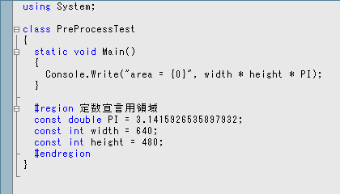
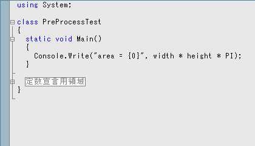

# プリプロセス

## <a id="sec-generated-title-1"></a> <a id="point"></a>ポイント

* プリプロセス命令： コンパイラや統合開発環境に特別な指示を出すために使う構文。
    * シンボル定義・条件コンパイル： 「デバッグ時のみ」など、条件によってコンパイル結果を変える。

    * 警告・エラーの生成

    * ソースコードの領域わけ： ソースコードを領域わけすることで、コードの可読性向上。


## <a id="sec-generated-title-2"></a> <a id="abst"></a>概要

<strong id="preprocess" class="keyword">プリプロセス命令</strong>（preprocessor directive）というものを用いることで、
条件付きコンパイル、エラーや警告の通知、ソースコードの領域分けなどを行うことが出来ます。
（directive はコンパイラへの指示という感じのニュアンスです。
operation などの単語と区別するために、「擬似命令」と訳したり、
そのままカタカナ語でディレクティブと書くこともあります。）
すなわち、プロプロセス命令とは、コンパイラ等の開発環境に対する指示を行うための命令のことです。

プリプロセスとは、文字通りに意味を取ると、
コンパイルの前に行う処理のことです。
（最近はそうでもないけど、少なくともプリプロセスという言葉ができた当時は）
C言語やC++言語では本当に文字通り、
コンパイルの前に命令の解釈を行っていたのでこのように呼ばれていました。
C# ではプリプロセス命令の解釈をコンパイルと同時に行っているので、
厳密には“プリプロセス”とは呼べないのですが、
C言語やC++言語のプリプロセス命令と似たような働きをしているため、
やはりプリプロセス命令という呼称が使われています。


## <a id="sec-generated-title-3"></a> <a id="prepro"></a>プリプロセス命令

C# のプリプロセス命令用のキーワードは、全て <code>#</code> から始まっています。
C# のプリプロセス命令には以下のようなものがあります。


##### <a id="sec-generated-title-4"></a>シンボル定義

* <code>#define</code>

* <code>#undef</code>


##### <a id="sec-generated-title-5"></a>条件付きコンパイル

* <code>#if</code>

* <code>#else</code>

* <code>#elif</code>

* <code>#endif</code>


##### <a id="sec-generated-title-6"></a>エラー、警告の報告

* <code>#warning</code>

* <code>#error</code>

* <code>#line</code>


##### <a id="sec-generated-title-7"></a>ソースコードの領域分け

* <code>#region</code>

* <code>#endregion</code>


##### <a id="sec-generated-title-8"></a>プラグマ

<h5 class="version version2">Ver. 2.0</h5>

* <code>#pragma</code>


## <a id="sec-generated-title-9"></a> <a id="symbol"></a>シンボル定義

<code>#define</code> 命令を用いると、シンボルの定義を行うことが出来ます。
定義したシンボルは <code>if</code> 命令の条件付きコンパイル命令で使用することが出来ます。
(例えば、<code>DEBUG</code> という名前のシンボルが定義されている場合のみコンパイルされる部分を作ることが出来ます。)
シンボルの定義は以下のようにして行います。

```csharp
#define シンボル名
```


また、シンボルの定義は C# コンパイラの <code>/define</code> オプションを用いても行うことが出来ます。
例えば、csc を用いて <code>test.cs</code> をコンパイルする際に <code>DEBUG</code> と <code>QUIET</code> という名前のシンボルを定義したければ以下のようにします。
(ちなみに、<code>DEBUG</code> はデバッグ用のコードを生成したいときに、
<code>QUIET</code> はエラーメッセージを画面等に出力したくないときに使うことが多いシンボル名です。)

```console
csc /define:DEBUG;QUIET test.cs
```


ちなみに、複数のソースコードに渡ってシンボル定義を有効にしたい場合には、この /define オプションを使います。
（C++ の #include に相当するものがない。）

一方、<code>#undef</code> 命令を用いると、
<code>#define</code> 命令で定義したシンボルを消すことが出来ます。
シンボルの削除は以下のようにして行います。

```csharp
#undef シンボル名
```


<code>#define</code>, <code>#undef</code> 命令はソースの先頭でのみ使用することが出来ます。
それ以外の場所にこれらの命令を記述するとコンパイルエラーになります。


## <a id="sec-generated-title-10"></a> <a id="conditional"></a>条件付きコンパイル

条件付きコンパイル命令を用いることで、
あるシンボルが定義されているときのみコンパイルされる部分を作ることが出来ます。
例えば、<code>#if</code> 命令を使って、
<code>DEBUG</code> という名前のシンボルが定義されているときだけコンパイルされる部分を作ることでデバッグ用のコードを埋め込んだりします。

条件付きコンパイル命令は以下のようにして用います。

```csharp
#if 条件1
条件1成立時に実行する部分
#elif 条件2
条件2成立時に実行する部分
#elif 条件3
条件3成立時に実行する部分
.
.
.
#else
条件不成立時に実行する部分
#endif
```


このうちで、<code>#elif</code> の部分と <code>#else</code> の部分は別になくてもかまいません。
(ちなみに、elif は else if を省略した語です。)

条件として使えるのは、シンボル名と true/false、および、
それらを <code>&amp;&amp;</code> や <code>||</code> などの論理演算子でつないだものです。
条件式にシンボル名を用いた場合、そのシンボルが定義されている場合にのみ真として評価されます。
また、シンボル名の前に否定演算子 <code>!</code> をつけることで、
そのシンボルが定義されていない場合にのみ真として評価することも出来ます。

例えば、以下のコードは <code>DEBUG</code> が定義されていてかつ <code>QUIET</code> が定義されていない場合にのみ真として評価されます。

```csharp
#if DEBUG && !QUIET
Console.Write("a = {0}, b = {0}", a, b); // デバッグ用に変数の値を画面に出力
#endif
```


##### <a id="sec-generated-title-11"></a>サンプル

```csharp
#define B

using System;

class PreProcessTest
{
  static void Main()
  {
#if A
    Console.Write("A という名前のシンボルが定義されています。\n");
#elif B
    Console.Write("B という名前のシンボルが定義されています。\n");
#endif
  }
}
```


普通にコンパイルした場合

```console
B という名前のシンボルが定義されています。
```


コンパイルオプションに <code>/define:A</code> と指定してコンパイルした場合

```console
A という名前のシンボルが定義されています。
```


## <a id="sec-generated-title-12"></a> <a id="error"></a>エラー、警告の報告

<code>#warning</code> 命令を用いることでユーザー定義の警告メッセージを、
<code>#error</code> 命令を用いることでユーザー定義のエラーメッセージを表示することが出来ます。

```csharp
#warning 警告メッセージ
#error   エラーメッセージ
```


例えば、以下のようにして使用します。

```csharp
#if A
#warning まだ準備できてないから A を define しないで欲しいな。
#if B
#error ごめん、A と B を同時に define されちゃうと困るの。
#endif
#endif
```


また、<code>#line</code> 命令を用いることで、警告やエラー報告用の行番号を変更できます。

```csharp
#line 行番号もしくは 'default'
```


##### <a id="sec-generated-title-13"></a>サンプル

```csharp
using System;

class PreProcessTest
{
  static void Main()
  {
#warning 7行目

#line 200
#warning 200行目
#warning 201行目

#line default
#warning 14行目
  }
}
```


上記のコードをコンパイルすると以下のような警告メッセージが表示されます。

```console
c:\test\class1.cs(7,10): warning CS1030: #warning : '7行目'
c:\test\class1.cs(14,10): warning CS1030: #warning : '14行目'
c:\test\class1.cs(200,10): warning CS1030: #warning : '200行目'
c:\test\class1.cs(201,10): warning CS1030: #warning : '201行目'
```


## <a id="sec-generated-title-14"></a> <a id="region"></a>ソースコードの領域分け

<code>#region</code>、<code>#endregion</code> 命令を用いることで、
コードを領域分けすることが出来ます。

```csharp
#region 領域の名前
プログラムコード
#endregion
```


C# では、通常、1つのファイルに1つのクラスを記述するので、
クラスの規模が大きくなるにつれ、ソースファイルの可読性が悪くなってきます。
そんなとき、この <code>#region</code> 命令を用いて領域分けをすることで、
可読性の向上を図ります。
（例えば、関連性のあるメソッドを集めて region で区切る等。）

また、<code>#region</code> 命令で領域分けされたコードブロックは
Visual Studio のコードエディタのアウトライン機能
(メソッドやクラスなどの意味のある単位ごとに領域の折り畳み/展開が出来る機能)を使用して
折り畳むことが出来ます。
例えば、以下のようなコードを書いたとします。

```csharp
using System;

class PreProcessTest
{
  static void Main()
  {
    Console.Write("area = {0}", width * height * PI);
  }

  #region 定数宣言用領域
  const double PI = 3.1415926535897932;
  const int width = 640;
  const int height = 480;
  #endregion
}
```


これを Visual Studio で開くと以下のような見た目になります。

<figure>
	[](../../../../assets/media/ufcpp2000/csharp/fig/region1.png)
	<figcaption>Visual Studio のアウトライン機能の例(展開時)</figcaption>
</figure>


ここで、<code>#region</code> 命令の左に出ている <code>[-]</code> ボタンをクリックすると、
<code>#region</code> 命令で領域分けしたコードが折り畳まれ、以下のような見た目に変わります。

<figure>
	[](../../../../assets/media/ufcpp2000/csharp/fig/region2.png)
	<figcaption>Visual Studio のアウトライン機能の例(折り畳み時)</figcaption>
</figure>


## <a id="sec-generated-title-15"></a> <a id="pragma"></a>プラグマ

<h5 class="version version2">Ver. 2.0</h5>

C# 2.0 から、<code>#pragma</code> 命令が追加されました。
C++ をご存知の方向けの説明をするなら、一言、
ほぼ、C++ の #pragma と同様の機能です。

<em>プラグマ</em>（pragma）という言葉は、
ギリシャ語で「行為」という意味で、
転じて「実用主義」という意味（哲学用語）だそうです。

C++ では、<code>#pragma</code> 命令を使って、
実行環境（ハードウェアや OS）に依存した細かい指示や、
C++ の言語仕様的に非標準な指示をコンパイラに与えることができました。
（標準仕様では「対応していない pragma があった場合無視しろ」と決められている。）
例えば、インライン展開の制御や、構造体のバイトアラインの制御ができます。
また、コンパイラに対して、警告メッセージを出さないように指示することもできました。

今の所、
C# の <code>#pragma</code> 命令には、
警告メッセージの抑制（<code>#pragma warning</code>）と、
ソースファイルの改変確認のためのチェックサム生成機能（<code>#pragma checksum</code>）があります。

```csharp
using System;
class Program
{
  [Obsolete]
  static void Foo() {}
  static void Main() {
// 612番の警告(Obsolete メソッドを使用)を出さないようにする。
#pragma warning disable 612
  Foo();
// 612番の警告を出すように戻す。
#pragma warning restore 612
  }
}
```
