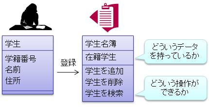
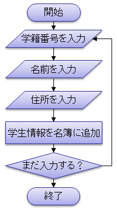
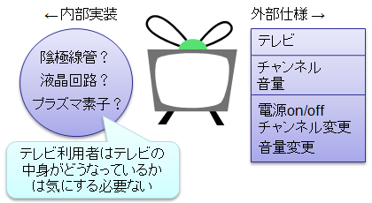
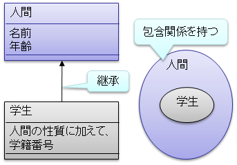
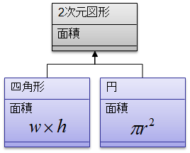

# オブジェクト指向とは

##  概要

C#はオブジェクト指向と呼ばれる考え方に基づいて作られています。
C#に限らず、最近のプログラミング言語のほとんどがオブジェクト指向に基づいた設計になっています。
では、このオブジェクト指向とはいったい何なのでしょうか。
ここではそのオブジェクト指向というものについて話をします。

（
ある機会に、
ここでの説明の概要を PowerPoint プレゼン化したものを作ったので、参考までに →
「[オブジェクト指向プログラミング概要](../../miscprog/list/training.md#oop)」。
ただし、言語は C# じゃなくて C++ になっています。
）

##### ポイント

* プログラムを作るときにはまずデータ構造を決める。

* オブジェクト指向: データ構造を中心に考える。

* データ構造は、中身を隠す（カプセル化する）と、必要なところだけ見えて分かりやすい。

* 継承と多態性という概念もあります（後々説明）。

##  手続きとデータ構造

「[基礎](../index.md#start)」で話をしてきた、代入文や条件分岐、反復処理、構造体などがあれば一通りのプログラムは作れます。
これらの機能は<strong id="proc" class="keyword">手続き</strong>（procedure：プログラムの動作の手順）を書くためのものです。

ところで、プログラムを作るとき、まず何を決める必要があるでしょうか。
手続きをどうやって書いていこうかと考える前に、まず<strong id="struct" class="keyword">データ構造</strong>（data structure：プログラム中で使うデータをどのようにして記憶しておくか）を決めなければなりません。
データ構造が決まって初めて、そのデータをどのように処理していくかという手続きが決まるわけです。

具体例として、学校で学生名簿を管理することを考えてみます。
通常、まずはじめに、学生を表すのにどういう情報が必要かを考えます。
また、学生一覧を管理するための名簿データ構造が必要になります。

<figure>

<figcaption>データ構造の例</figcaption>
</figure>

そして、データ構造が決まって始めて、
そのデータに対してどういう手続きを踏むかが決まります。

<figure>

<figcaption>手続きの例</figcaption>
</figure>

##  オブジェクト

前節で述べたように、手続きを中心とするのではなく、データを中心としてそのデータに対する操作として手続きを書いていくのが自然なプログラム作成手法なわけです。
このような、操作の対象としてのデータ構造のことを<strong id="object" class="keyword">オブジェクト</strong>(object : 対象、物体)といい、オブジェクトを中心としてプログラムを設計していく手法のことを<strong id="oo" class="keyword">オブジェクト指向</strong>（object oriented）といいます。

オブジェクトを中心に据えることに加えて、
オブジェクト指向では以下のような考え方に基づいてプログラミングを行います。

##### 中身の隠蔽（カプセル化）

オブジェクト指向の考え方では、
<em>
        オブジェクトは中身（内部実装）がどうなっているのかを隠蔽し、
        可能な操作と属性（外部仕様）のみを公開すべきだと言われています
      </em>。
この、可能な操作のことをメソッド(method : 方法、手段)といい、属性のことをプロパティ(property : 所有物、属性)といいます。

いきなり「中身を隠せ、操作と属性だけ出せ」と言われてもピンとこないでしょうから、
具体例をあげて説明しましょう。

例としてテレビというものを考えてみます。
テレビは「電源を入れる」、「チャンネルを変える」、「音量を変える」という操作が可能です。
また、「現在点いているチャンネル」、「現在の音量」という属性を持っています。
テレビの利用者は、テレビの中身がどうなっているのかを知らなくても、
電源を入れて、チャンネルを合わせれば見たい番組を見れます。
テレビの中にはさまざまなパーツが含まれています。
しかし、利用者はテレビの中に何が入ってるのか、またテレビがどのようにして組み立てられたのかには興味はなく、自分の操作に対して所望の動作をしてくれればそれでいいわけです。

<figure>

<figcaption>オブジェクトと実装の隠蔽の例</figcaption>
</figure>

##### 継承

また、<em>オブジェクトには継承という概念があります</em>。
例えば、
「人」というオブジェクトと「学生」というオブジェクトがあるとき、
明らかに「学生」は「人」の部分集合です。
学生ならば必ず人としての性質も持っています。
つまり、「学生」は「人」に対する可能な操作と「人」の持つ属性をそのまま引き継ぎます。
このような時、「学生は人を継承する(inherit)」とか「学生は人から導出される(derived)」といいます。

<figure>

<figcaption>継承関係の例</figcaption>
</figure>

##### 多態性

継承を使うと、同じ属性・同じ操作でも、オブジェクトごとに異なる振る舞いになる場合があります。
例えば、面積という属性を持つ「図形」を継承して、「四角形」と「円」を作ったとき、
この2つのオブジェクトでは、面積の計算方法（振る舞い）が異なります。

<figure>

<figcaption>多態性の例</figcaption>
</figure>

##  オブジェクト指向プログラミング言語

オブジェクト指向プログラミング言語とは、文法的にオブジェクト指向プログラミングを支援する機能の備わっているプログラミング言語のことです。
C#はもちろん、JavaやC++などもオブジェクト指向言語であるといわれています。

（
支援する機能がないからといって、
オブジェクト指向プログラミングができないわけではないです。
もちろん大変ではありますが。
C 言語などの非オブジェクト指向言語でも、
オブジェクト指向の考え方に基づくプログラミングがよく行われています。
）

オブジェクト指向を支援する機能とは、
オブジェクトの型(これを<strong id="class" class="keyword">クラス</strong>と呼ぶ)の定義、実装の隠蔽機能、クラスの継承機能などのことです。
これから先の章では、C#のオブジェクト指向を支援する機能について説明していきます。
