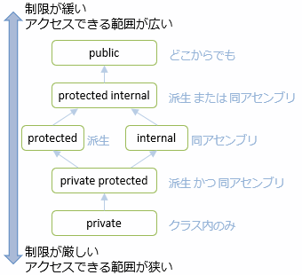

# 実装の隠蔽

## <a id="sec-generated-title-1"></a> <a id="abst"></a>概要

「[オブジェクト指向とは](oo_about.md)」で「オブジェクトは内部の実装がどうなっているのかを隠蔽し、可能な操作と属性のみを公開する」と書きました。
しかし、今までのサンプルではまず、クラスの定義の仕方などを覚えてもらうためにこのような実装の隠蔽については何も説明していませんでした。

ここでは、
クラスの内部実装を隠蔽するためにクラスのメンバー変数やメソッドにアクセシビリティを設定する方法を説明し、
なぜクラスの内部実装を隠蔽する必要があるのかを説明します。


##### <a id="sec-generated-title-2"></a>ポイント

* オブジェクト指向の中核概念その1: 実装の隠蔽（カプセル化）。

* 外（クラス利用側）から見た振る舞いと中身（実装側）はわけて考える。

* 中身は隠す（利用者に見せない）。

* 目的：
    * 不正な書き換えを防止する。

    * 実装を変更したときに、利用者側まで変更する必要をなくす。


## <a id="sec-generated-title-3"></a> <a id="level"></a>アクセシビリティ

クラスのメンバー変数やメソッドには<strong id="level" class="keyword">アクセシビリティ</strong>（Accessibility: アクセスできる度合い）というものがあります。
アクセシビリティとは、変数やメソッドに対して、どこからアクセスできるかという制限の度合いのことで、
以下のようなものがあります。

<table summary="アクセシビリティに関する修飾子">

	<tr>
		<th>アクセシビリティ</th>
		<th>説明</th>
	</tr>
	<tr>
		<td markdown="1">public</td>
		<td markdown="1">どこからでもアクセス可能</td>
	</tr>
	<tr>
		<td markdown="1">protected</td>
		<td markdown="1">クラス内部と、派生クラスの内部からのみアクセス可能</td>
	</tr>
	<tr>
		<td markdown="1">internal</td>
		<td markdown="1">同一プロジェクト内のクラスからのみアクセス可能</td>
	</tr>
	<tr>
		<td markdown="1">protected internal</td>
		<td markdown="1">同一プロジェクト内のクラス内部、または、派生クラスの内部からのみアクセス可能</td>
	</tr>
	<tr>
		<td markdown="1">private protected</td>
		<td markdown="1">(C# 7.2 以降)同一プロジェクト内のクラス内部、かつ、派生クラスの内部からのみアクセス可能</td>
	</tr>
	<tr>
		<td markdown="1">private</td>
		<td markdown="1">クラス内部からのみアクセス可能</td>
	</tr>
</table>



以下のように変数の前にキーワードを付けることでアクセシビリティを制御することが出来ます。

```csharp
アクセシビリティ 変数宣言やメソッド定義
```


派生クラスについては後ほど「[継承](oo_inherit.md#subclass)」で説明します。
また、アセンブリについては「[プロジェクトの分割](../package/project.md#assembly)」で説明します。

アクセス権限のない場所からクラスのメンバーにアクセスしようとするとエラーになります。
例えば、アクセシビリティをprivateにした変数に、クラスの外部からアクセスしようとするとエラーになります。
とりあえず、今のところは<em>クラスの外部に公開したいものはpublicに、そうでないものはprivateにする</em>とだけ覚えておいてください。

ちなみに、アクセシビリティを明示的に指定しなかった場合、private (一番厳しい制限)扱いされます。
後述しますが、むやみに広い範囲からアクセスできると後々の修正が大変になることがあるので、
可能な限り狭い範囲からだけアクセスできるようにすることをお勧めします。
迷うようなら、最初はprivateで作って、必要になったときに必要な分だけ制限を緩めるのがいいでしょう。

また、別項([トップ レベルのアクセシビリティ](../package/toplevelaccessibility.md))で説明しますが、(トップ レベルにある)クラス自身に対するアクセシビリティは public もしくは internal のみになります。

##### <a id="sec-generated-title-4"></a>サンプル

```csharp
class A
{
  public    int pub; // どこからでもアクセス可能
  protected int pro; // クラス内部と派生クラス内部からアクセス可能
  private   int pri; // クラス内部からのみアクセス可能

  public void function1()
  {
    // クラス内部
    pub = 1; // OK
    pro = 2; // OK
    pri = 3; // OK
  }
}

class B : A
{
  public void function2()
  {
    // 派生クラス内部
    pub = 1; // OK
    pro = 2; // OK
    pri = 3; // エラー
  }
}

class AccessibilitySample
{
  static void Main()
  {
    A a = new A();
    // クラス A の外部
    a.pub = 1; // OK
    a.pro = 2; // エラー
    a.pri = 3; // エラー
  }
}
```


このソースをコンパイルしようとすると、以下のようなエラーが出ます。

```console
test.cs(23,3): error CS0122: 'A.pri' is inaccessible due to its protection level
test.cs(34,3): error CS0122: 'A.pro' is inaccessible due to its protection level
test.cs(35,3): error CS0122: 'A.pri' is inaccessible due to its protection level
```


## <a id="sec-generated-title-5"></a> <a id="conceal"></a>実装の隠蔽

通常、内部の実装がどうなっているのかを隠蔽（要するに private にする）し、可能な操作のみを公開(public)することが望ましいとされています。
簡単に言うと、<em>メンバー変数はクラス外部から直接アクセス出来ないようにして、オブジェクトの状態の変更はすべてメソッドを通して行うべきだということです</em>。

例として、「[クラス](oo_class.md)」で作った複素数クラスについて考えてみましょう。
以前は実装の隠蔽は行っていませんでしたが、
ちゃんと実装を隠蔽するように作り直して見ましょう。

```csharp
class Complex
{
  // 実装は外部から隠蔽(privateにしておく)
  private double re; // 実部を記憶しておく
  private double im; // 虚部を記憶しておく

  // 実部を取り出す
  public double Re(){return this.re;}

  // 実部を書き換え
  public void Re(double x){this.re = x;}

  // 虚部を取り出す
  public double Im(){return this.im;}

  // 虚部を書き換え
  public void Im(double y){this.im = y;}

  // 絶対値を取り出す
  public double Abs()
  {
    return Math.Sqrt(re*re + im*im);// Math.Sqrt は平方根を求める関数
  }
}
```


見ての通り、以前のものと比べてかなり回りくどくて面倒くさいものになっています。
なぜこのようにわざわざ回りくどい書き方をしなければいけないのか疑問に感じるかと思いますが、
クラスの内部実装を隠蔽する意義は、大きく分けて以下の2つがあります。

* オブジェクトの不正な書き換えを防止する。

* クラスの実装を変更した際、利用側のコードを修正する必要をなくす

ちなみに、パフォーマンスに関しては心配する必要はありません。
[インライン展開](../structured/miscinlining.md)という最適化が掛かるので、
元々のフィールドを直接公開するコードと大差ない速度で実行できます。

##### <a id="sec-generated-title-6"></a>オブジェクトの不正な書き換え防止する

「[コンストラクタ](../../../../assets/oo_construct.html)」で、 <code>Person</code> というクラスを作りました。
ここで、年齢が負の数になるのはおかしいので、
コンストラクタで年齢が負の数にならないようにチェックを行うように改良してみましょう。

```csharp
class Person
{
  public string name; // 名前
  public int age;     // 年齢

  public Person()
  {
    this.name = "";
    this.age  = 0;
  }

  public Person(string name, int age)
  {
    this.name = name;
    this.age  = age > 0 ? age : 0; // age が負だった場合、0歳にしておく
  }
}
```


しかし、現時点ではクラスの外部から<code>Person</code>クラスのメンバー<code>age</code>を直接書き換えれてしまうため、
年齢が負の数にならないように強制することは無理です。
例えば、以下のサンプルのようにすると無理やり年齢を負の数に設定することができます。

```csharp
Person p = new Person("範馬刃牙", -5); // 年齢に負の値を設定しようとしても
Console.Write("{0}は{1}歳です。\n",  // 0歳に修正されている
              p.name, p.age);        // (「範馬刃牙は0歳です」と表示される)

p.age = -5;                          // でも、ageを直接書き換えてしまえば
Console.Write("{0}は{1}歳です。\n",  // 負の年齢になってしまう
              p.name, p.age);        // (「範馬刃牙は-5歳です」と表示される)
```


この問題を解決するためには、メンバー変数<code>age</code>は外部からは直接アクセスできないようにして、メソッドを通して<code>age</code>の値を設定、取得する必要があります。

```csharp
class Person
{
  public string name; // 名前
  private int age;    // 年齢

  public Person()
  {
    this.name = "";
    this.age  = 0;
  }

  public Person(string name, int age)
  {
    this.name = name;
    SetAge(age);
  }

  public int GetAge()
  {
    return this.age;
  }

  public void SetAge(int age)
  {
    this.age  = age > 0 ? age : 0; // age が負だった場合、0歳にしておく
  }
}
```


##### <a id="sec-generated-title-7"></a>クラスの実装を変更した際、利用側のコードを修正する必要をなくす

クラスの実装を隠蔽しない場合、どのような不具合が生じるかを説明するため、
まず、以下のコードについて考えてみましょう。

```csharp
using System;

// クラス定義
class Complex
{
  public double re; // 実部を記憶しておく(外部からの読み出し・書き換えも可能)
  public double im; // 虚部を記憶しておく(外部からの読み出し・書き換えも可能)

  // 絶対値を取り出す
  public double Abs()
  {
    return Math.Sqrt(re*re + im*im);// Math.Sqrt は平方根を求める関数
  }
}

// クラス利用側
class ConcealSample
{
  static void Main()
  {
    Complex c = new Complex();
    c.re = 4; // メンバー変数に直接アクセス
    c.im = 3; // メンバー変数に直接アクセス
    Console.Write("|c| = {0}\n", c.Abs());
  }
}
```


「[クラス](oo_class.md)」で説明しましたが、複素数クラスの実装方法には、
上述のコードのような「実部と虚部をメンバー変数に記憶しておく」方法のほかに、
「絶対値と偏角をメンバー変数に記憶しておく」方法があります。
そして、加減算を行う回数よりも乗除算を行う回数のほうがはるかに多い場合、
後者のほうが計算量が少なくなります。

例えば、この複素数クラスを利用するプログラムがあったとして、
そのプログラムでは加減算よりも乗除算の回数のほうがはるかに多いため、
後者の方式に変更したくなったとします。
この場合、以下のようにクラスの側だけでなく、クラスの利用側のコードも修正する必要があります。

```csharp
using System;

// クラス定義
class Complex
{
  public double abs; // 絶対値を記憶しておく(外部からの読み出し・書き換えも可能)
  public double arg; // 偏角を記憶しておく(外部からの読み出し・書き換えも可能)

  // 実部・虚部を書き換え
  public void Set(double x, double y)
  {
    this.abs = Math.Sqrt(x*x + y*y);
    this.arg = Math.Atan2(y, x);
  }
}

// クラス利用側
class ConcealSample
{
  static void Main()
  {
    Complex c = new Complex();
    c.Set(4, 3); // クラス利用側のコードも修正が必要
    Console.Write("|c| = {0}\n", c.abs);
  }
}
```


このように、
クラスの実装方法を変更するたびに、利用側のコードまで修正する必要があると、
プログラムを作るのも保守するのも大変になります。

このような問題は、以下のように実装を隠蔽することで避けることができます。

```csharp
using System;

// クラス定義
class Complex
{
  // 実装は外部から隠蔽(privateにしておく)
  private double re; // 実部を記憶しておく
  private double im; // 虚部を記憶しておく

  public double Re(){return this.re;}    // 実部を取り出す
  public void Re(double x){this.re = x;} // 実部を書き換え

  public double Im(){return this.im;}    // 虚部を取り出す
  public void Im(double y){this.im = y;} // 虚部を書き換え

  public double Abs(){return Math.Sqrt(re*re + im*im);}  // 絶対値を取り出す
}

// クラス利用側
class ConcealSample
{
  static void Main()
  {
    Complex c = new Complex();
    c.Re(4); // メソッドを通してオブジェクトの状態を変更
    c.Im(3);
    Console.Write("|c| = {0}\n", c.Abs());
  }
}
```


このコードの実装方法を
「実部と虚部をメンバー変数に記憶しておく」方法から
「絶対値と偏角をメンバー変数に記憶しておく」方法に変更する場合、
以下のように、クラス利用側のコードに手を加える必要は一切ありません。

```csharp
using System;

// クラス定義
class Complex
{
  // 実装は外部から隠蔽(privateにしておく)
  private double abs; // 絶対値を記憶しておく
  private double arg; // 偏角を記憶しておく

  // 実部を取り出す
  public double Re()
  {
    return this.abs * Math.Cos(this.arg);
  }

  // 実部を書き換え
  public void Re(double x)
  {
    double im = this.abs * Math.Sin(this.arg);
    this.abs = Math.Sqrt(x*x + im*im);
    this.arg = Math.Atan2(im, x);
  }

  // 虚部を取り出す
  public double Im(){return this.abs * Math.Sin(this.arg);}

  // 虚部を書き換え
  public void Im(double y)
  {
    double re = this.abs * Math.Cos(this.arg);
    this.abs = Math.Sqrt(y*y + re*re);
    this.arg = Math.Atan2(y, re);
  }

  public double Abs(){return this.abs;}  // 絶対値を取り出す
}

// クラス利用側
class ConcealSample
{
  static void Main()
  {
    Complex c = new Complex();
    c.Re(4); // クラス利用側は一切変更せず
    c.Im(3);
    Console.Write("|c| = {0}\n", c.Abs());
  }
}
```

## <a id="sec-generated-title-8"></a> <a id="protected-internal"></a>protected、internal、protected internal と private protected

`protected`や`internal`が必要になるのは[派生クラス](oo_inherit.md#subclass)や[アセンブリ](../package/project.md#assembly)が必要になってからですが、一応ここである程度説明しておきます。

まず、1つの[プロジェクト](../package/project.md#project)内ではアクセシビリティに応じて以下のような制限がかかります。

```csharp
public class Base
{
    public int Public { get; set; } // どこからでも
    protected int Protected { get; set; } // 派生クラスからだけ
    internal int Internal { get; set; } // 同一アセンブリ(同一 exe/同一 dll)内からだけ
    protected internal int ProtectedInternal { get; set; } // 派生クラス "もしくは" 同一アセンブリ内 から
    private protected int PrivateProtected { get; set; } // 派生クラス "かつ" 同一アセンブリ内 から(C# 7.2 以降)
    private int Private { get; set; } // クラス内からだけ

    public void Method()
    {
        // 同一クラス内
        // 全部 OK
        Public = 0;
        Protected = 0;
        Internal = 0;
        ProtectedInternal = 0;
        Private = 0;
        PrivateProtected = 0;
    }
}

internal class Derived : Base
{
    public void MethodInDerived()
    {
        // 同一アセンブリ内の派生クラス
        // コメントアウトしてないやつだけ OK
        Public = 0;
        Protected = 0;
        Internal = 0;
        ProtectedInternal = 0;
        //Private = 0;
        PrivateProtected = 0;
    }
}

internal class OtherClass
{
    public void Method()
    {
        // 同一アセンブリ内の他のクラス
        // コメントアウトしてないやつだけ OK
        var x = new Base();

        x.Public = 0;
        //x.Protected = 0;
        x.Internal = 0;
        x.ProtectedInternal = 0;
        //x.Private = 0;
        //x.PrivateProtected = 0;
    }
}
```

このコードとは別のプロジェクト内では、以下のような制限がかかります。

```csharp
public class Derived : ClassLibrary1.Base
{
    public void MethodInDerived()
    {
        // 他のアセンブリ内の派生クラス
        // コメントアウトしてないやつだけ OK

        Public = 0;
        Protected = 0;
        //Internal = 0;
        ProtectedInternal = 0;
        //Private = 0;
        //PrivateProtected = 0; // ここが protected internal との差
    }
}

internal class OtherClass
{
    public void Method()
    {
        // 他のアセンブリ内の他のクラス
        // public 以外全滅

        var x = new ClassLibrary1.Base();

        x.Public = 0;
        //x.Protected = 0;
        //x.Internal = 0;
        //x.ProtectedInternal = 0;
        //x.Private = 0;
        //x.PrivateProtected = 0;
    }
}
```

ちなみに、`protected internal` と `private protected` では、語順は自由です。
`protected internal`と`internal protected`、`private protected`と`protected private`はそれぞれ同じ意味になります。

```csharp
// どちらの順序でも同じ意味
protected internal int A1;
internal protected int A2;

private protected int B1;
protected private int B2;
```

### <a id="sec-generated-title-9"></a> <a id="private-protected"></a>余談: private protected は C# コンパイラー上だけの問題

<h5 class="version version7_1">Ver. 7.2</h5>

余談となりますが、`private protected`相当のアクセシビリティは、[IL](../abstract/ab_dotnet.md#il)レベルでは 1.0 の頃からずっとあります。

C# | IL
--- | ---
public | public
protected | family
internal | assembly
protected internal | famorassem
private protected | famandassem
private | private

protectedを指してfamily、internalを指してassemblyと、別の単語を使っていますが意味は同じです。
famorassem、famandassemはそれぞれfamily <em>or</em> assembly、family <em>and</em> assemblyの意味です。

当初、fam<em>and</em>assem相当のアクセシビリティの需要を甘く見ていて、
`protected internal`をfam<em>or</em>assemの意味で用い、fam<em>and</em>assemは用意しませんでした。

元々あるものなので、`private protected`の追加は大して難しい作業ではありません。
しかし、キーワードをどうするかでかなり悩みました。
最初に追加することを考えたのは C# 6.0 の頃ですが、結局、C# 7.2まで延びました。

確かに、`private protected`と言われて「`protected` かつ `internal`」とは想像しにくいです。
一応、「`private`が混ざってるからより厳しい方」 = 「かつ」と覚えてください。

他のキーワードを導入するとか、`protected and internal`や`protected & internal`みたいな書き方も検討されましたが、
新しいキーワードの追加やこれ専用の文法の追加はコスト的に見合わないということで見送られました。
