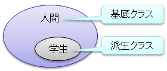

# 継承

## <a id="sec-generated-title-1"></a> <a id="abst"></a>概要

<strong id="derive" class="keyword">継承</strong>（inheritance）とはオブジェクト指向の中核を担う概念で、
あるクラスから性質を受け継いだ新しいクラスを作ることです。
継承は<em>派生</em>（derivation）とも呼ばれます。


##### <a id="sec-generated-title-2"></a>ポイント

* オブジェクト指向の中核概念その2: 継承。

* 「人間」⊃「学生」のように、包含関係のあるものを表現する方法。

* 「学生は人間を継承する」、「学生は人間から派生する」などと言う。

* class Person { ... } に対して、class Student : Person { ... } と書く。


## <a id="sec-generated-title-3"></a> <a id="about"></a>継承関係とは

継承関係の例として、「人間」と「学生」という2つのクラスについて考えて見ましょう。

「学生」は「人間」の一部です。
すなわち、「学生」ならば必ず「人間」としての特徴を備えています。
それとは逆に「人間」だからといって必ずしも「学生」であるとはいえません。
つまり、「学生」は「人間」の特別な場合である(「人間⊃学生」という包含関係が成り立つ)といえます。

例えば、「人間」には「名前」、「年齢」などの属性があります。
(ここでは簡単化のためこの2つの属性のみを考えます。)
「学生」は人間の一部分ですから、当然この2つの属性を備えています。
それに加え、「学生」は「学籍番号」という属性を持っています。

このように、あるクラス A がクラス B を包含するような関係にあるとき、
この関係を<em>継承関係</em>と呼び、
「B は A を継承する」とか「B は A から派生する(導出される)」といいます。
また、このとき、クラス A のことを「<strong id="supclass" class="keyword">基底クラス</strong>（base class）」
または「<em>スーパークラス</em>（super class）」と呼び、
クラス B のことを「<strong id="subclass" class="keyword">派生クラス</strong>（derived class）」
または「<em>サブクラス</em>（sub class）」と呼びます。

<figure>
	[](../../../../assets/media/ufcpp2000/csharp/fig/inheritance.png)
	<figcaption>「人間」と「学生」の包含関係</figcaption>
</figure>


## <a id="sec-generated-title-4"></a> <a id="inherit"></a>クラスの継承

C# を始めとするオブジェクト指向言語では、
このような継承関係を表現するため、
あるクラスが他のクラスを継承するための構文が用意されています。
C# でクラスの継承を行うためには、クラス定義の際に以下のように書きます。

```csharp
class 派生クラス名 : 基底クラス名
{
  派生クラスの定義
}
```


クラスの継承の例として、先ほどの「人間」と「学生」にあたるクラス
<code>Person</code> と <code>Student</code> を
C# でクラス化すると以下のようになります。

```csharp
class Person
{
  public string name; // 名前
  public int    age;  // 年齢
}

class Student : Person
{
  public int    id;   // 学籍番号
}
```


クラス利用側のコードは以下のようになります。

```csharp
Person p1 = new Person();
p1.name = "天野舞耶";
p1.age  = 23;

Student s1 = new Student();
s1.name = "周防達也"; // Person のメンバーをそのまま利用出来る
s1.age  = 18;
s1.id   = 50012;

Person p2 = s1; // Student は Person として扱うことが出来る。

Student s2 = p1; // でも、Person は Student として扱っちゃ駄目。
//↑この1行はエラーになる。
```


C# では、派生クラスのインスタンスは基底クラスの変数に代入することが出来ます。
これは、例えば、学生ならば必ず人間であるため、「学生は人間として扱うことができる」ということです。
それとは逆に、基底クラスのインスタンスを派生クラスの変数に代入することは出来ません。
すなわち、すべて人間が学生というわけではないですから、「人間を無条件に学生として扱ってはいけない」ということです。


## <a id="sec-generated-title-5"></a> <a id="object"></a>object型

C# では、基底クラスを指定せずに作成した型は全て自動的に <code>object</code> 型を継承することになります。
(構造体等の値型は明示的に他の型を継承できないので、必ず <code>object</code> を継承します。)
つまり、C# における全ての型は <code>object</code> の派生クラスになります。

<code>object</code> 型には <code>Equals</code> (他のインスタンスとの比較)や <code>ToString</code> (インスタンスを文字列化する)等の機能があります。


## <a id="sec-generated-title-6"></a> <a id="ctor"></a>基底クラスのコンストラクタ呼び出し

派生クラスのインスタンスが生成される際、
派生クラスのコンストラクタが呼び出される前に
基底クラスのコンストラクタが呼び出されます。

例えば、以下のようなコードを実行すると、
まず、<code>Base</code> クラスのコンストラクタが呼ばれ、
その後 <code>Derived</code> クラスのコンストラクタが呼ばれます。

```csharp
_ = new Derived();

class Base
{
    public Base()
    {
        Console.WriteLine("Base");
    }
}

class Derived : Base
{
    public Derived()
    {
        Console.WriteLine("Derived");
    }
}
```

```console
Base
Derived
```

一方で、フィールド初期化子の呼び出し順序は逆で、派生クラス側の初期化子の方が先に実行されます。
結果的に、実行順序は以下の順序になります。

1. 派生クラスのフィールド初期化子
2. 基底クラスのフィールド初期化子
3. 基底クラスのコンストラクター
4. 派生クラスのコンストラクター

```csharp
_ = new Derived();

class Base
{
    // 呼び出される順序を確認するために呼ぶメソッド。
    protected static int M(string message)
    {
        Console.WriteLine(message);
        return 0;
    }

    public int X = M("Base フィールド初期化子");

    public Base()
    {
        M("Base コンストラクター");
    }
}

class Derived : Base
{
    public int Y = M("Derived フィールド初期化子");

    public Derived()
    {
        M("Derived コンストラクター");
    }
}
```

```console
Derived フィールド初期化子
Base フィールド初期化子
Base コンストラクター
Derived コンストラクター
```

あと、「[コンストラクター](oo_construct.md#initializer-order)」で説明している「初期化の順序との兼ね合い」も改めて問題になります。
フィールド初期化子でインスタンス メソッドを呼べてしまうと、
以下のように「基底クラスの未初期化のフィールドを読めてしまう」ということが起きます。
(クラスが分かれているので、派生がない場合よりも深刻です。)

```csharp
class Base
{
    public int BaseField;

    protected int M() => BaseField;
}

class Derived : Base
{
    // ここで M を呼べてしまうと、未初期化の BaseField を読んでしまう。
    public int DerivedField = M();
}
```


## <a id="sec-generated-title-7"></a> <a id="base_ctor"></a>基底クラスのコンストラクタを明示的に呼び出す

先ほど行ったように、派生クラスのインスタンスを生成する際、
自動的に基底クラスのコンストラクタも呼び出されます。
しかし、この際、呼び出されるコンストラクタは引数なしのコンストラクタになります。

基底クラスの引数つきのコンストラクタを呼び出すためには、
以下のように自分でコードを書いて明示的に基底クラスのコンストラクタを呼び出す必要があります。

```csharp
派生クラスのコンストラクタ(引数) : base(基底クラスに渡したい引数)
{
}
```


例として、先ほどの <code>Person</code> クラスと <code>Student</code> クラスにコンストラクタを追加してみましょう。
ついでに実装の隠蔽も行った結果を以下に示します。

```csharp
class Person
{
  private string name; // 名前
  private int    age;  // 年齢

  public Person(string name, int age)
  {
    this.name = name;
    this.age  = age;
  }

  public string Name
  {
    set{this.name = value;}
    get{return this.name;}
  }

  public int Age
  {
    set{this.age = value;}
    get{return this.age;}
  }
}

class Student : Person
{
  private int    id;   // 学籍番号

  public Student(string name, int age, int id) : base(name, age)
  {
    this.id   = id;
  }

  public int Id
  {
    set{this.id = value;}
    get{return this.id;}
  }
}
```

この構文は[コンストラクター初期化子](oo_construct.md#initializer)の一種です。
`this`の方と区別して base 初期化子と呼ぶ場合もあります。

## <a id="sec-generated-title-8"></a> <a id="protected"></a>protected

「[実装の隠蔽](oo_conceal.md)」で、クラスのメンバーのアクセスレベルについて説明しました。その際、public と private については説明しましたが、ここでは継承と関係の深い protected について説明します。

public はクラス内外とわずどこからでもアクセス可能なレベルで、
private はクラス内部からのみアクセス可能なレベルです。
これらに対し、protected はクラスとそのクラスを継承する派生クラス内からアクセス可能なレベルです(private は派生クラス内からアクセスできない)。
以下に例を挙げます。

```csharp
class Base
{
  public    int public_val;
  protected int protected_val;
  private   int private_val;

  void BaseTest()
  {
    public_val    = 0; // OK
    protected_val = 0; // OK
    private_val   = 0; // OK
  }
}

class Derived : Base
{
  void DerivedTest()
  {
    public_val    = 0; // OK
    protected_val = 0; // OK   (protected は派生クラスからアクセス可能)
    private_val   = 0; // エラー(private   は派生クラスからアクセス不能)
  }
}

class Test
{
  static void Main()
  {
    Base b = new Base();

    b.public_val    = 0; // OK
    b.protected_val = 0; // エラー(protected は外部からアクセス不能)
    b.private_val   = 0; // エラー(private   は外部からアクセス不能)
  }
}
```


## <a id="sec-generated-title-9"></a> <a id="conceal"></a>基底クラスのメンバーの隠蔽

派生クラスには自由にメンバーを追加することが出来ますが、
基底クラスの public メンバーと同名のメンバーを再定義してしまうと
基底クラスのメンバーが新しく追加されたメンバーに隠れてしまいます。
このような状態を「基底クラスのメンバーを隠蔽する」といいます。

```csharp
using System;

class Base
{
  public void Test()
  {
    Console.Write("Base.Test()\n");
  }
}

class Derived : Base
{
  public void Test() //基底クラスの Test() と同名のメソッド
  {
    Console.Write("Derived.Test()\n");
  }
}

class Test
{
  static void Main()
  {
    Base b = new Base();
    b.Test(); // Base の Test が呼ばれる

    Derived d = new Derived();
    d.Test(); // Derived の Test が呼ばれる

    ((Base)d).Test();
    // Base に キャストしてから Test を呼ぶと Base の Test が呼ばれる
  }
}
```


```console
Base.Test()
Derived.Test()
Base.Test()
```


ここで、プログラマが意図して基底クラスのメンバーの隠蔽を行う分には何の問題もないんですが、
基底クラスに同名のメソッドがあることに気づかずにメソッドを追加してしまうと、
意図しない動作を引き起こしてしまうことがあります。
そこで、C#では基底クラスのメンバーの隠蔽を行う場合、メソッドにnew修飾子を付ける必要があります。
(new修飾子を付けていない場合、コンパイラが警告を出します。)

```csharp
class Derived : Base
{
  //基底クラスのメンバーを隠蔽するには new を付ける必要がある。
  public new void Test()
  {
    Console.Write("Derived.Test()\n");
  }
}
```

### <a id="sec-generated-title-10"></a> <a id="base-access"></a>base アクセス

ちなみに、`base` キーワードを使って基底クラスのメンバーを参照できます。
この機能を使って、以下のように、隠蔽されたメンバーを呼び出すこともできます。

```csharp
class Base
{
  public void Test()
  {
    Console.Write("Base.Test()\n");
  }
}

class Derived : Base
{
  public new void Test() //基底クラスの Test() と同名のメソッド
  {
    Console.Write("Derived.Test()\n");
  }

  public void Test2()
  {
    this.Test(); // Derived の Test が呼ばれる。
    base.Test(); // Base の Test が呼ばれる。
  }
}
```

ちなみに、[`this`アクセス](oo_class.md#this-access)と同様に、`base`アクセスでも[インデクサー](oo_indexer.md)にアクセスできます。
(一方で、[拡張メソッド](../functional/sp3_extension.md)の呼び出しには使えません。)

```csharp
class Base
{
    public virtual int this[int i] => i;
}
 
class Derived : Base
{
    public override int this[int i] => base[i]; // Base のインデクサーが呼ばれる
}
```

### <a id="sec-generated-title-11"></a> <a id="non-virtual-base-access"></a>base(T) アクセス

<h5 class="version version8">Ver. 未定</h5>

※ 本節の `base(T)` の機能は、元々 C# 8.0 で入る予定だったものが、9.0 以降で改めて検討しなおすことになったものです。
C# 8.0 のプレビュー版で一時的に使える時期はありましたが、リリース版ではいったん削除されています。

前節の `base` アクセスでは、継承に階層があるとき、特定のクラスの実装を呼び分けるということはできません。
常に、「一番近いもの」が選ばれて呼び出されます。

これに対して、将来的には、`base(T)` という形で、特定のクラスを明示的に指定できるようになりました。
(主に[インターフェイスのデフォルト実装](oo_interface.md#dim)のための機能でしたが、クラスに対しても認められています。)

```csharp
using System;
 
class A
{
    public virtual void M() => Console.WriteLine("A.M");
}
 
class B : A
{
    public override void M() => Console.WriteLine("B.M");
}
 
class C : B
{
    // 今までであれば、必ず「自分に近い方の M」が呼ばれる。
    // この場合は B.M。
    public override void M() => base.M();
 
    // この書き方なら絶対に A.M が呼ばれる。
    public void M1() => base(A).M();
 
    // この書き方なら絶対に B.M が呼ばれる。
    public void M2() => base(B).M();
}
```

C# 8.0 から外れたのは、以下のような `base` の方との挙動の差が問題になったからです。

前述の通り `base` は「一番近いものを自動的に選ぶ」という性質があります。
これは、
「コンパイルした時には `B.M` はなかった/あったけど、
実行時には `B.M` が追加/削除されている」
というような状況でも問題なく実行できます。
`B.M` があればそれが呼ばれるし、なければ `A.M` を探しに行きます。

一方、C# 8.0 に間に合うようにこの `base(T)` アクセスを実装しようと思うと、「基底をたどって探す」という挙動ができませんでした。
`base(B).M()` と書くと、クラス `B` 自体しか見ません。
コンパイル時に `B` 自体に `M` がなければコンパイル エラーになりますし、
先ほどの「コンパイルした時にはあったものが削除された」みたいなシチュエーションでは実行時に例外が発生します。

この挙動の差を埋めようと思うと .NET ランタイム自体にそこそこ大変な修正が必要で、
後々改めて取り組むことになりました。
(その後結局あまり進んでいなくて、.NET 7 / C# 11 の時点でも未実装です。)

## <a id="sec-generated-title-12"></a> <a id="sealed"></a>sealed

C# のクラスは基本的に常に継承して派生クラスを作ることができるのですが、
場合によっては絶対に継承されたくないと言うこともあります。
このような場合、クラス定義時に sealed （封印された）というキーワードをつけることで、
継承を禁止することができます。

```csharp
sealed class SealedClass { }

class Derived : SealedClass // SealedClass は継承不可なので、エラーになる。
{
}
```

## <a id="sec-generated-title-13"></a> <a id="single"></a>単一継承

C#のクラス継承では、1つのクラスしか継承できません。これを単一継承(single inheritance)と呼びます。
(逆を意味するのは多重継承(multiple inheritance)で、「C#では多重継承を認めていない」などと言ったりもします。)
つまり、以下のように、2つ以上のクラスを継承しようとするとコンパイル エラーになります。

```csharp
class Base1 { }
class Base2 { }
class Derived : Base1, Base2 { }
```

別項で説明する[インターフェイス](oo_interface.md)であればこの制限はなく、いくつでも実装できます。
