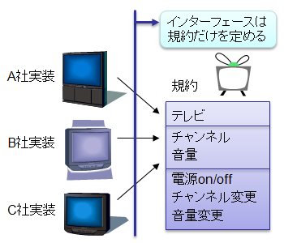

# インターフェース

## <a id="sec-generated-title-1"></a> <a id="abst"></a>概要

インターフェース(interface)という言葉の意味は直訳すると「境界面」になります。
すなわち、物と物との間の仲介をする部分のことです。

例えば、PC と周辺機器をつなぐ場合、
どのような物理媒体を用いて、どういう信号を送るかといった規約を定める必要があります。
このような約束事に基づいて作られたケーブルやコネクタのことをインターフェースと呼ぶわけです。

オブジェクト指向プログラミングの世界においては、
インターフェースとはクラスが実装すべき規約（どういうメソッドにどういう引数を渡すかなど）を定めるものです。
すなわち、クラス設計者とクラス利用者の間の仲介役を担うのがインターフェースです。


##### <a id="sec-generated-title-2"></a>ポイント

* インターフェース: クラス外部からみた規約だけを定めるもの。「クラスの内外の境界」という意味。

* public な抽象メソッドだけを持つクラスのようなもの。
    * C# 8.0 で緩和されて、「フィールドを持てない代わりに多重継承できる」くらいの差に縮まっています

* 抽象クラスと違って、複数のインターフェースを継承できる。

* class キーワードの代わりに interface キーワードを使う。

##### <a id="sec-generated-title-3"></a>サンプル

-[https://github.com/ufcpp/UfcppSample/tree/master/Chapters/Oop/InterfaceSample](https://github.com/ufcpp/UfcppSample/tree/master/Chapters/Oop/InterfaceSample)

## <a id="sec-generated-title-4"></a> <a id="contract"></a>メソッドの規約と実装

メソッドを設計する場合、規約の決定と実装という2つの段階を経ることになります。

<strong id="contract" class="keyword">規約</strong>あるいは<em>契約</em>（contract）とは、
クラス外部からみたクラス・メソッドの仕様のことで、
メソッドを設計する際、まずは規約を定める必要があります。
すなわち、規約とは「そのメソッドが何を出来るのか」、
「そのメソッドを呼び出すことで何が起こるのか」ということです。

そしてその後、定まった規約を満たすようにメソッド内部の<strong id="implementation" class="keyword">実装</strong>（implementation）を行います。
通常、規約と実装は切り離して考えるべきです。
クラス利用側からすると、
実際にメソッドの内部実装がどうなっているかはどうでもよくて、
外部仕様さえ分かればクラスを利用できるからです。

通常のメソッドは規約と実装を同時に定めますが、
「[抽象メソッド](oo_abstract.md#abmethod)」抽象メソッドは規約のみを定め、実装は派生クラスで行うことになります。

ここで注意しなければいけないのは、複数のクラスが同じ規約を満たす場合もあるということです。
また、同じ規約であっても、クラスが異なればその実装方法も異なります。
抽象メソッドの実装は派生クラスで行いますが、
派生クラスごとに実装方法が異なります。

例えば、
「[抽象メソッド、抽象クラス](oo_abstract.md)」で説明した <code>Person</code> クラスでは、
「<code>Age</code> プロパティが呼ばれたら年齢を答える」という規約を定めています。
<code>Person</code> の派生クラスではこの規約に従って <code>Age</code> プロパティを実装します。
クラスによって正直に答えたり、鯖を読んだりと、その実装方法は異なりますが、
「年齢を答える」という規約は満たされています。


## <a id="sec-generated-title-5"></a> <a id="interface"></a>C# のインターフェース

インターフェースとは、規約のみを定めるものです。
上述したように、C# では抽象メソッドを用いることでメソッドの規約のみを定めることが出来ます。
つまり、C# の<strong id="interface" class="keyword">インターフェース</strong>（interface）とは、抽象メソッドのみを持つ抽象クラスだと考えることが出来ます。

<figure>

[](../../../../assets/media/ufcpp2000/csharp/fig/if0.png)

<figcaption>インターフェース</figcaption>
</figure>


C# のインターフェースの定義は以下のようにして行います。

```csharp {title="インターフェース定義のしかた"}
interface インターフェース名
{
  メソッド・プロパティの宣言
}
```


インターフェースの実装はクラスの継承と同じ構文で行います。

```csharp {title="インターフェースの実装"}
class クラス名 : インターフェース名
{
  クラスの定義
}
```


クラスとよく似ていますが、インターフェースには以下に挙げるような特徴があります。

* メンバー変数(フィールド)を持つことが出来ない。

* static メソッドを持つことが出来ない。

* 宣言したメソッド・プロパティはすべて<code>public abstract</code>になる。

* 1つのクラスが複数のインターフェースを実装(多重継承)できる。

<h5 class="version version8">Ver. 8.0</h5>

C# 8.0 では、制限がいくつか緩和されています。
[後述](#dim)しますが、機能面で言うと、クラス(特に抽象クラス)との差は「フィールドを持てない代わりに多重継承できる」くらいの差になっています。

<!-- original-page-break -->

## <a id="sec-generated-title-6"></a> <a id="lib"></a>標準クラスライブラリ中のインターフェース

.NET Framework の標準クラスライブラリでは、汎用性の高いいくつかのインターフェースを標準で用意しています。
ここでは、そのうちのいくつかを紹介します。

### <a id="sec-generated-title-7"></a> <a id="IComparable"></a>IComparable

`IComparable<T>`インターフェイス(`System`名前空間)は、順序比較ができるものを表します。
配列の整列などに使います。

```csharp {title="IComparableの例"}
using System;
using System.Linq;

/// <summary>
/// 2次元上の点。
/// <see cref="IComparable{T}"/> を実装している = 順序をつけられる。
/// </summary>
class Point2D : IComparable<Point2D>
{
    public double X { get; }
    public double Y { get; }

    public Point2D(double x, double y)
    {
        X = x;
        Y = y;
    }

    public double Radius => Math.Sqrt(X * X + Y * Y);
    public double Angle => Math.Atan2(Y, X);

    /// <summary>
    /// 距離で順序を決める。
    /// 距離が全く同じなら偏角で順序付け。
    /// </summary>
    /// <param name="other"></param>
    /// <returns></returns>
    public int CompareTo(Point2D other)
    {
        var r = Radius.CompareTo(other.Radius);
        if (r != 0) return r;
        return Angle.CompareTo(other.Angle);
    }
}


class IComparableSample
{
    public static void Main()
    {
        const int N = 5;
        var rand = new Random();
        var data = Enumerable.Range(0, N).Select(_ => new Point2D(rand.NextDouble(), rand.NextDouble())).ToArray();

        Console.WriteLine("元:");
        foreach (var p in data) WriteLine(p);

        // 並べ替えの順序に使える
        Console.WriteLine("整列済み:");
        foreach (var p in data.OrderBy(x => x)) WriteLine(p);
    }

    private static void WriteLine(Point2D p)
    {
        Console.WriteLine($"({p.X:N3}, {p.Y:N3}), radius = {p.Radius:N3}, angle = {p.Angle:N3}");
    }
}
```

### <a id="sec-generated-title-8"></a> <a id="collection"></a>コレクション

コレクション(参考: 「[コレクション概要](../../algorithm/collection/collection.md)」)には、
同じ操作ができる様々な実装方法があります(それぞれにメリット・デメリット、適切な利用場面があります)。

そして、C#では、操作の種類ごとにインターフェイスが標準で用意されていて、コレクションはそれらのインターフェイスを実装します。
以下の表示いくつか例を挙げます(いずれも`System.Collections.Generic`名前空間)。
(詳しくは[MSDN](https://msdn.microsoft.com/ja-jp/library/system.collections.generic.aspx)をご覧ください。)

<table>
<tr>
<th>インターフェイス</th>
<th>説明</th>
</tr>
<tr>
<td Markdown="1"> `IEnumerable<T>`</td>
<td Markdown="1">要素の列挙ができる。`foreach`ステートメントや、[LINQ](../data/sp3_linq.md#linq) to Objects で使える。</td>
</tr>
<tr>
<td Markdown="1">`ICollection<T>`</td>
<td Markdown="1">`IEnumerable<T>`に加えて、要素の追加(`Add`)、削除(`Remove`)などができたり、要素の個数が取れる。</td>
</tr>
<tr>
<td Markdown="1">`IList<T>`</td>
<td Markdown="1">`ICollection<T>`に加えて、[インデクサー](oo_indexer.md)を使った要素の読み書きができる。</td>
</tr>
<tr>
<td Markdown="1">`IDictionary<TKey, TValue> `</td>
<td Markdown="1">辞書アクセス(キーを使った値の検索)しての値の読み書きができる。</td>
</tr>
<tr>
<td Markdown="1">`IReadOnlyCollection<T>`<sup>※</sup></td>
<td Markdown="1">`IEnumerable<T>`に加えて、要素の個数が取れる。読み取り専用なので[共変](sp4_variance.md#covariance)。</td>
</tr>
<tr>
<td Markdown="1">`IReadOnlyList<T>`<sup>※</sup></td>
<td Markdown="1">`IReadOnlyCollection<T>`に加えて、[インデクサー](oo_indexer.md)を使った要素の読み取りができる。読み取り専用なので[共変](sp4_variance.md#covariance)。</td>
</tr>
<tr>
<td Markdown="1">`IReadOnlyDictionary<TKey, TValue>`<sup>※</sup></td>
<td Markdown="1">辞書アクセス(キーを使った値の検索)しての値の読み取りができる。</td>
</tr>
</table>

<h5 class="version version5">Ver. 5.0</h5>
<sup>※</sup> 読み取り専用系のインターフェイスは .NET Framework 4.5 (C# 5.0と同時期)で追加されました。

このうち、`IEnumerable`と`IReadIReadOnlyList`の例を挙げておきます。

```csharp {title="IEnumerableの例"}
using System;
using System.Collections;
using System.Collections.Generic;
using System.Linq;

/// <summary>
/// 連結リスト。
/// <see cref="IEnumerable{T}"/> を実装している = データの列挙ができる。複数のデータを束ねてる。
/// </summary>
/// <typeparam name="T"></typeparam>
class LinkedList<T> : IEnumerable<T>
{
    public T Value { get; }
    public LinkedList<T> Next { get; }

    public LinkedList(T value) : this(value, null) { }
    private LinkedList(T value, LinkedList<T> next) { Value = value; Next = next; }

    public LinkedList<T> Add(T value) => new LinkedList<T>(value, this);

    public IEnumerator<T> GetEnumerator()
    {
        if(Next != null)
            foreach (var x in Next)
                yield return x;
        yield return Value;
    }

    IEnumerator IEnumerable.GetEnumerator() => GetEnumerator();
}

class IEnumerableSample
{
    public static void Main()
    {
        var a = new LinkedList<int>(1);
        var b = a.Add(2).Add(3).Add(4);

        // foreach で使える(これは IEnumerable 必須ではない)
        foreach (var x in b)
            Console.WriteLine(x);

        // string.Join で使える
        Console.WriteLine(string.Join(", ", b));

        // LINQ で使える
        Console.WriteLine(b.Sum());
    }
}
```

```csharp {title="IReadOnlyListの例"}
using System;
using System.Collections;
using System.Collections.Generic;

/// <summary>
/// 4次元上の点。
/// <see cref="IReadOnlyList{T}"/> を実装している = <see cref="IEnumerable{T}"/>に加えて、インデックス指定で値を読める。
/// </summary>
class Point4D : IReadOnlyList<double>
{
    public double X { get; }
    public double Y { get; }
    public double Z { get; }
    public double W { get; }

    public Point4D(double x, double y, double z, double w) { X = x; Y = y; Z = z; W = w; }

    public double this[int index]
    {
        get
        {
            switch (index)
            {
                default:
                case 0: return X;
                case 1: return Y;
                case 2: return Z;
                case 3: return W;
            }
        }
    }

    public int Count => 4;

    public IEnumerator<double> GetEnumerator()
    {
        yield return X;
        yield return Y;
        yield return Z;
        yield return W;
    }

    IEnumerator IEnumerable.GetEnumerator() => GetEnumerator();
}

class IReadOnlyListSample
{
    public static void Main()
    {
        var p1 = new Point4D(1, 2, 3, 4);
        var p2 = new Point4D(3, 7, 5, 11);

        // X, Y, Z, W の代わりに 0, 1, 2, 3 のインデックスで値を読み出し
        var innerProduct = 0.0;
        for (int i = 0; i < 4; i++)
            innerProduct += p1[i] * p2[i];

        Console.WriteLine(innerProduct);
    }
}
```

### <a id="sec-generated-title-9"></a> <a id="IDisposable"></a>IDisposable

`IDisposable`インターフェイス(`System`名前空間)は、[ガベージ コレクション](../resource/rm_gc.md#garbage-collection)任せではなく、
明示的なタイミングで破棄処理を行いたいものに使います。詳細は「[リソースの破棄](../resource/oo_dispose.md)」で説明します。

```csharp {title="IDisposableの例"}
using System;

/// <summary>
/// <see cref="IDisposable"/> を実装している = 使い終わったら明示的に Dispose を呼ぶ必要がある。
/// </summary>
class Stopwatch : IDisposable
{
    System.Diagnostics.Stopwatch _s = new System.Diagnostics.Stopwatch();

    public Stopwatch() { _s.Start(); }

    public void Dispose()
    {
        _s.Stop();
        Console.WriteLine(_s.Elapsed);
    }
}

class IDisposableSample
{
    public static void Main()
    {
        // using ブロックを抜けたら自動的に Dispose が呼ばれる
        using (new Stopwatch())
        {
            var t = T(12, 6, 0);
        }
    }

    private static int T(int x, int y, int z) => x <= y ? y : T(T(x - 1, y, z), T(y - 1, z, x), T(z - 1, x, y));
}
```

<!-- original-page-break -->

## <a id="sec-generated-title-10"></a> <a id="multiple"></a>複数のインターフェイスを実装

C#は多重継承を認めていません(1つのクラスしか[継承](oo_inherit.md)できない)。この制約はクラスに対してのみかかります。すなわち、インターフェイスは複数実装できます。

例えば、以下のような型を作れます。

```csharp
struct Id : IComparable<Id>, IEquatable<Id>
{
    public int Value { get; set; }

    public int CompareTo(Id other) => Value.CompareTo(other.Value);

    public bool Equals(Id other) => Value == other.Value;
}
```

## <a id="sec-generated-title-11"></a> <a id="orverload"></a>型引数違いのジェネリック インターフェイス

C#では、[オーバーロード](../structured/st_function.md#overload)解決ができる限り、同名のメンバーを持つインターフェイスを複数、普通に実装することができます(オーバーロード解決できない場合には、次節の[明示的実装](#explicit-impl)が必要になります)。

これは特に、[ジェネリック](sp2_generics.md#generics)なインターフェイスを、型引数違いで複数実装する際に有効です。

例えば、標準ライブラリの`IEquatable<T>`インターフェイス(`System`名前空間)について、異なる型引数で複数実装できます。
`A`と`B`という2つのクラスがあったとして、`IEquatable<A>`と`IEquatable<B>`という2つの実装を持てます。

具体的な用途としては、例えば、以下のような場面で有効です。

- 図形全般を表す`Shape`型がある
- `Shape`から派生した、矩形型`Rectangle`がある
  - `Rectangle`は、幅と高さの両方の比較で等値判定する
- `Shape`から派生した、円型`Circle`がある
  - `Circle`は、半径の比較で等値判定する
- `Shape`は、矩形同士、円同士でだけ等値判定をする。型が違う場合はその時点で不一致

この条件下では、それぞれのクラスに以下のようにインターフェイスを持てます。

- `Shape`は他の`Shape`と比較できるので、`IEquatable<Shape>`を実装できる
- `Rectangle`は他の`Rectangle`と比較できるので、`IEquatable<Rectangle>`を実装できる
  - `Rectangle`は`Shape`から派生しているので、`IEquatable<Shape>`でもある
- `Circle`は他の`Circle`と比較できるので、`IEquatable<Circle>`を実装できる
  - `Circle`は`Shape`から派生しているので、`IEquatable<Shape>`でもある

これを、以下のようなコードで実装できます。

```csharp
using System;

abstract class Shape : IEquatable<Shape>
{
    public abstract bool Equals(Shape other);
}

class Rectangle : Shape, IEquatable<Rectangle>
{
    public double Width { get; set; }
    public double Height { get; set; }

    public override bool Equals(Shape other) => Equals(other as Rectangle);

    public bool Equals(Rectangle other)
        => other != null && Width == other.Width && Height == other.Height;
}

class Circle : Shape, IEquatable<Circle>
{
    public double Radius { get; set; }

    public override bool Equals(Shape other) => Equals(other as Circle);

    public bool Equals(Circle other)
        => other != null && Radius == other.Radius;
}
```

## <a id="sec-generated-title-12"></a> <a id="explicit-impl"></a>明示的実装

インターフェイスの場合、1つのクラスで複数のインターフェイスを実装することができます。
このとき、複数のインターフェイスに同名・同引数のメソッドがあった場合、衝突が起こりえます。

例えば以下の例を見てください。`IAccumulator`インターフェイスと`IGroup<T>`インターフェイスがどちらも`Add`メソッドを持っていて、それを両方実装している`ImplicitImplementation`クラスは、1つの`Add`メソッドが2つの役割を兼ねることになります。

```csharp {title="複数のインターフェイスの実装" highlight-lines="5,11,20-24"}
using System.Collections.Generic;

interface IAccumulator
{
    void Add(int value);
    int Sum { get; }
}

interface IGroup<T>
{
    void Add(T item);
    IEnumerable<T> Items { get; }
}

/// <summary>
/// 1つの<see cref="Add(int)"/>で、2つのインターフェイスの実装を担うんであれば特に問題は出ない。
/// </summary>
class ImplicitImplementation : IAccumulator, IGroup<int>
{
    public void Add(int x)
    {
        Sum += x;
        _items.Add(x);
    }

    public IEnumerable<int> Items => _items;
    private List<int> _items = new List<int>();

    public int Sum { get; private set; }
}
```

元々役割を兼ねたい場合はこれでいいんですが、そうでないこともあります。
こういう時に使うのが、<strong id="explicit-interface-method" class="keyword">インターフェイスの明示的実装</strong>です。
メンバーを定義する際に、メンバー名の前に「インターフェイス名 + `.`」を加えます。
例えば、メソッドの場合は以下のように書きます。

```csharp {title="関数の書式" highlight-text="インターフェイス名"}
戻り値の型 インターフェイス名.メソッド名(引数一覧)
{
    メソッド本体(具体的な処理)
}
```

この場合、アクセス修飾子(`public`や`private`などは付けれません。)

これを使って、先ほどの2つのインターフェイスの`Add`メソッドに対して別実装を与えてみましょう。
以下のようになります。

```csharp {title="インターフェイスの明示的実装の例"}
/// <summary>
/// <see cref="IAccumulator.Add(int)"/>と、<see cref="IGroup{int}.Add(int)"/>が完全に被るので、
/// 別の実装を与えたければ明示的実装が必要。
/// </summary>
class ExplicitImplementation : IAccumulator, IGroup<int>
{
    void IAccumulator.Add(int value) => Sum += value;

    void IGroup<int>.Add(int item) => _items.Add(item);

    public IEnumerable<int> Items => _items;
    private List<int> _items = new List<int>();

    public int Sum { get; private set; }
}
```

この例のように、明示的実装はメンバー単位で切り替えれます。
この例の場合は、`Add`だけが明示的実装で、残りの`Sum`や`Items`は通常の(暗黙的な)実装です。

ちなみに、明示的実装をしたメンバーは、そのクラスの変数から直接は利用できなくなります。
一度インターフェイスのキャストしてから呼び出すことになります。

```csharp {title="明示的実装したインターフェイスの呼び出し例"}
using System;

class ExpliciteImplementationSample
{
    public static void Main()
    {
        // 1つのAddで両方の債務を担ってるので2重集計される
        var a = new ImplicitImplementation();
        for (int i = 0; i < 5; i++)
        {
            Accumulate(a, i);
            AddItem(a, i);

            // 通常の実装なので、普通に Add(i) を呼ぶことも可能
            //a.Add(i);
        }
        Console.WriteLine($"sum = {a.Sum}, items = {string.Join(", ", a.Items)}");

        // 明示的実装を使って2つのAddを別実装したので個別集計される。
        var b = new ExplicitImplementation();
        for (int i = 0; i < 5; i++)
        {
            Accumulate(b, i);
            AddItem(b, i);

            // 明示的実装の場合、一度インターフェイスにキャストしてからでないと Add(i) は呼べない。
            // 例えば以下のコメントを外すとコンパイル エラー。
            //b.Add(i);
        }
        Console.WriteLine($"sum = {b.Sum}, items = {string.Join(", ", b.Items)}");
    }

    static void Accumulate(IAccumulator x, int value) => x.Add(value);

    static void AddItem<T>(IGroup<T> g, T item) => g.Add(item);
}
```

まとめると、インターフェイスの明示的実装を使うと、以下のような状態になります。

- 同じ名前のメンバーを持ったインターフェイスを複数同時に実装できる
- 明示的実装したメンバーは、いったんインターフェイス型にキャストしてからでないと呼べなくなる


<!-- original-page-break -->

## <a id="sec-generated-title-13"></a> <a id="usage"></a>インターフェイスの明示的実装の用途

もう少し具体的に、インターフェイスの明示的実装の用途をいくつか紹介しましょう。

インターフェイスの明示的実装は、同じ名前のメンバーを持ったインターフェイスを複数同時に実装できるようにするための機能です。
では、それが必要になる場面というのは具体的にはどういう状況でしょう。
また、メンバーをいったんインターフェイス型にキャストしてからでないと呼べなくなるという性質も、有効に使える場面があります。

### <a id="sec-generated-title-14"></a> <a id="legacy-member"></a>消したいけど消せないメソッドを隠す

まず一般論として、public なものは、足すより消す方が難しいです。他人の作ったライブラリを使っていて、ある日突然、自分の使っているメソッドが消えたらどうでしょう。自分は何もしていないのに、自分の書いたコードがコンパイルできなくなります。

この問題はライブラリが広く使われれば使われるほど影響範囲が広がります。標準ライブラリに至っては、まず削除はできないものだと思ってください。

その結果、.NETの標準ライブラリには、いくつか、消したくても消せないものがあります。代表例として、以下のようなものがあります。

- 非ジェネリック版の`IEnumerable`インターフェイス(`System.Collections`名前空間)
  - ジェネリック版の`IEnumerable<T>`(`System.Collections.Generic`名前空間)が、この非ジェネリック版から派生している
- `ICollection<T>`インターフェイス(`System.Collections.Generic`名前空間)の`IsReadOnly`

これらを「消したい」理由については後で補足しますが、とりあえず、消したくても消してはいけません。

これらのインターフェイスを実装する際、その消したいけど消せないメソッドも一緒に実装させられるという苦行が待っています。
せめて、そんなもうあまり使わなくなったメンバーはpublicにしたくないわけです。
そこで、明示的実装の、メンバーを隠せる性質が使えます。

例として`IEnumerable`インターフェイスを隠す方法を示しましょう。というか、すでに[前述](#collection)の例で使っていたりします。再掲すると以下の通りです。

```csharp {title="IEnumerableの例" highlight-text="IEnumerator IEnumerable.GetEnumerator() =&gt; GetEnumerator();"}
using System.Collections;
using System.Collections.Generic;

class LinkedList<T> : IEnumerable<T>
{
    public T Value { get; }
    public LinkedList<T> Next { get; }

    public LinkedList(T value) : this(value, null) { }
    private LinkedList(T value, LinkedList<T> next) { Value = value; Next = next; }

    public LinkedList<T> Add(T value) => new LinkedList<T>(value, this);

    public IEnumerator<T> GetEnumerator()
    {
        if(Next != null)
            foreach (var x in Next)
                yield return x;
        yield return Value;
    }

    // 明示的実装。こいつは、IEnumerableを介さない限り見えなくなる
    IEnumerator IEnumerable.GetEnumerator() => GetEnumerator();
}
```

#### <a id="sec-generated-title-15"></a> <a id="legacy-nongeneric"></a>補足1： 非ジェネリック インターフェイス

特に、[ジェネリック](sp2_generics.md#generics)関連に多いです。
ジェネリックが.NET 1.0には間に合わず、2.0からの追加だったので、多くのインターフェイスで非ジェネリック版と、ジェネリック版が2重保守されています。

`IEnumerable`もその例の1つで、.NET 1.0時代に非ジェネリック版が、2.0でジェネリック版が入りました。2.0で入ったジェネリック版は、1.0時代のコードとの互換性のために非ジェネリック版から派生しています。もし、最初から.NETにジェネリックがあれば、非ジェネリック版の機能は不要でした。

#### <a id="sec-generated-title-16"></a> <a id="legacy-isreadonly"></a>補足2: IsReadOnly

インターフェイスが増えるというのはそれなりのコストがかかるそうで、.NETリリース初期の頃は、インターフェイスを減らす方向で設計を進めたそうです。`ICollection<T>`インターフェイスが`IsReadOnly`というプロパティを持っているのはその頃の名残です。しかし今となっては、インターフェイスが増えてもいいからちゃんと「読み取り専用なコレクション」と「書き換え可能なコレクション」は別インターフェイスに分けるべきだということになっています(そのため、.NET 4.5で、`IReadOnlyCollection<T>`インターフェイスが(`System.Collections.Generic`名前空間)が追加されました)。

つまり、今と昔で以下のような思想の差があります。

- 昔: インターフェイスを増やしたくないので、コレクションが読み取り専用か書き換え可能かはプロパティで返していた
- 今: 読み取り専用なら`IReadOnlyCollection<T>`インターフェイスを、書き換え可能なら`ICollection<T>`インターフェイスを使う

こうなると、`IsReadOnly`プロパティははっきり言って邪魔です。`ICollection<T>`を選んだ時点で書き換え可能にしたいんだから、おそらくは常にtrueを返すだけになるでしょう。

### <a id="sec-generated-title-17"></a> <a id="access-restriction"></a>メンバーのアクセスを制限する

(書きかけ)

- internal set 隠し
- internal interface 実装できるのとの組み合わせ

### <a id="sec-generated-title-18"></a>ジェネリック版とobject版

(書きかけ)

ときどき、「特定のインターフェイスを実装している時だけ特別な動作を挟む」みたいな処理を書きたい場合があります。

- この as 判定用に `interface IX { object X { get; } }`
- でも、人手で使うとき用にジェネリック版を用意して `interface IX<T> : IX { new T X { get; } }`


<!-- original-page-break -->


## <a id="sec-generated-title-19"></a> <a id="dim"></a>インターフェイスのデフォルト実装

<h5 class="version version8">Ver. 8.0</h5>

C# 8.0 (.NET Core 3.0)で、インターフェイスの制限が緩和されました。
以下のようになります。

- メソッド、[プロパティ](oo_property.md)、[インデクサー](oo_indexer.md)、[イベント](../functional/sp_event.md)のアクセサーの実装を持てるようになった
- [アクセシビリティ](oo_conceal.md#level)を明示的に指定できるようになった
- [静的メンバー](oo_static.md)を持てるようになった
  - [入れ子](../package/toplevelaccessibility.md#key-nested)の型も含む

これら指して「インターフェイスのデフォルト実装」(default implementations of interfaces)と呼びます<sup>※</sup>。
(1番目の「インターフェイスが関数メンバーの実装を持てる」というのを主目的に検討されたもので、
言葉の意味だけからすると、狭義にはこの1番目の機能こそが「デフォルト実装」です。
ただ、これのついでに実装されたものなので2番目、3番目には具体的な名前がついていません。)

このようにインターフェイスに対する制限を減らすのであれば、
「クラス(特に[抽象クラス](oo_abstract.md#abclass))との区別が今でも必要なのかどうか」
というような議論もありました。
今、1から文法を決めれるとしても残したい区別は、
「フィールドを持てない代わりに多重継承できる」という点くらいで、
他の差は「歴史的経緯に由来するもの」という側面が強いです。
(インターフェイスでのフィールド定義は、多重継承、特に、[ひし形継承](https://ja.wikipedia.org/wiki/%E8%8F%B1%E5%BD%A2%E7%B6%99%E6%89%BF%E5%95%8F%E9%A1%8C)との相性が悪く、複雑度のわりにメリットが少ないです。)

歴史的経緯に由来して、以下のような挙動はクラスと揃えることができませんでした。

- アクセシビリティ未指定のときなど、既定の挙動が違う
- 派生インターフェイスでの[オーバーライド](oo_polymorphism.md#override)は明示的実装が必須
- デフォルト実装を持っているメンバーは、派生クラス・派生インターフェイスからは直接呼べない(親へのキャストが必要)

ここでいう「歴史的経緯」は、
既存機能・既存コードへの影響を最小限にとどめるためや、
.NET ランタイム側の修正が簡単な範囲に収めるために残ってしまった差です。

<sup>※</sup> Java 由来で、「インターフェイスのデフォルト メソッド」(default interface method、略して DIM)と呼ばれたりもします。

### <a id="sec-generated-title-20"></a> <a id="runtime-feature"></a>ランタイム側の修正

インターフェイスのデフォルト実装は C# コンパイラー上のトリックだけでは実装できず、 .NET ランタイム側の対応が必要な機能です。
C# 8.0 以降を使っていても、ターゲットとなるランタイム(TargetFramework)が古いと使えません。
.NET Core 3.0 (かそれと同世代)以降のランタイムである必要があります。
.NET Framework 側では対応予定はない(.NET Core 3.0 と同世代な .NET Framework 4.8 でも未対応)です。

詳しくは以前書いたブログ「[RuntimeFeature クラス](../../../blog/2018/12/runtimefeature/index.md)」で説明しています。

### <a id="sec-generated-title-21"></a> <a id="dim-motivation"></a>導入の動機

この制限緩和には、以下のような動機ががあります。

- 既存のインターフェイスにメンバーを追加しても破壊的変更にならない
- 同様の機能を持っている Android (Java (8以降))や iOS (Swift)との相互運用
- [トレイト](https://ja.wikipedia.org/wiki/%E3%83%88%E3%83%AC%E3%82%A4%E3%83%88)的にも使える

#### <a id="sec-generated-title-22"></a> <a id="breaking-change"></a>メンバー追加による破壊的変更

最大の動機は1番目の「破壊的変更にならない」という部分です。
抽象メンバーは派生クラスでの実装が必須で、実装しなければコンパイル エラーを起こします。
その結果、「後から追加したら派生クラスがコンパイル エラーを起こす」という状態になります。

```csharp {title="抽象メンバーの追加は破壊的変更"}
interface I
{
    void X();
 
    // 後から追加したものとする
    void Y();
}
 
class C : I
{
    // X は実装してある
    public void X() { }
 
    // C が I を実装するコードを書いたころには Y がなかったので OK。
    // Y を追加したことでコンパイル エラーに。
}
```

この問題を回避するには、これまでは抽象クラスを使うしかありませんでした。
抽象クラスは抽象クラスで、多重継承ができないという別の制限があるので完全な回避策にはなりません。

(あるいは、語尾にExとか2とか3とかが付いた新しいインターフェイスを作ったり、
ユーザーに破壊的変更を受け入れてもらうという手もありますが、
どちらもかなり最終手段です。)

そこで、C# 8.0 ではインターフェイスも実装を持てるようにしました。
Java 8 の同様の機能も同じ動機に基づいています。
機能名が「デフォルト実装」(default = de(脱) + fault(不備))なのもこのためです。
「本来なくてはならない実装がない」という状態(fault)に対して既定動作を与えることで、エラーを回避します。

「規約だけを定める」というクリーンさを犠牲にしてでも、このメリットは大きいです。

この観点で言うと、インターフェイスのデフォルト実装はライブラリ作者のための機能になります。
特に、広く使われているライブラリほど破壊的変更はできないものなので、
一番恩恵を受けるのは[corefx](https://github.com/dotnet/corefx/) (.NET Core の標準ライブラリ部分)チームだったりします。

(小さい規模だと、自分たちで作ったインターフェイスを自分たちで使うということが多くなりますし、
その場合は別に破壊的変更が気になること自体あまりありません。)

#### <a id="sec-generated-title-23"></a> <a id="trait"></a>トレイト用途

[トレイト](https://ja.wikipedia.org/wiki/%E3%83%88%E3%83%AC%E3%82%A4%E3%83%88)的な用途としては、フィールドを持てないなどの制限があるので、恩恵は限定的です。
C# の場合には[拡張メソッド](../functional/sp3_extension.md)でも似たようなことができるので、特に恩恵は少なめです。

「拡張メソッドでもできなくはないけども、[virtual](oo_polymorphism.md#virtual_method) な実装方法を取りたい」みたいな場合に使います。

よく例に上がるのが [LINQ](../data/sp3_linq.md) to Object の `Count` メソッドです。
`IEnumerable<T>`(`System.Collections.Generic`名前空間) に対する `Count`(含まれている要素数を数える)は、汎用的に書くなら以下のように書くしかありません。

```csharp {title="汎用的な Count"}
static int Count<T>(IEnumerable<T> source)
{
    var count = 0;
    foreach (var _ in source) ++count;
    return count;
}
```

ただ、配列や`List<T>`など、元々長さを持っている型であれば、この `foreach` は全くの無駄で、できれば元々フィールドとして持っている長さを直接返したいです。
そのため、[実際の `Count` の実装](https://source.dot.net/#System.Linq/System/Linq/Count.cs)には `is` 演算子による分岐が挟まっています。
この分岐をするくらいなら、拡張メソッドではなく、インターフェイスのデフォルト実装としてトレイト的に実装する方が素直(virtual なので `ICollection` 側でオーバーライドできる)です。

### <a id="sec-generated-title-24"></a> <a id="function-implementation"></a>実装を持つ関数メンバー

ということで、インターフェイスが実装を持てるようになりました。

```csharp {title="デフォルト実装"}
using System;
 
interface I
{
    void X();
 
    // 後から追加しても、デフォルト実装を持っているので平気
    void Y() { }
}
 
class A : I
{
    // X だけ実装していればとりあえず大丈夫
    public void X() { }
}
 
class B : I
{
    public void X() { }
 
    // Y も実装。I 越しでもちゃんとこれが呼ばれる。
    public void Y() => Console.WriteLine("B");
}
 
class Program
{
    static void Main() => M(new B());
    static void M(I i) => i.Y();
}
```

```console {title="デフォルト実装"}
B
```

ただし、以下の制限は残っています。

- インスタンス [フィールド](../structured/st_struct.md#field) は持てない
- インスタンス [コンストラクター](oo_construct.md)、[ファイナライザー](../resource/rm_destructor.md)は持てない

主目的(新規メンバー追加での破壊的変更の回避)のためにはインスタンス メンバーだけ実装を持てればいいわけですが、ついでにいろいろと緩和されています。

#### <a id="sec-generated-title-25"></a> <a id="static-member"></a>静的メンバー

静的メンバーも持てるようになりました。
インスタンス メンバーと違って、静的コンストラクターや静的フィールドは持てます。
[定数](../start/sp_const.md)や、[演算子](oo_operator.md)、[入れ子](../package/toplevelaccessibility.md#key-nested)の型も持てます。

```csharp

```

```csharp {title="インターフェイスの静的メンバー"}
using System;
 
interface I
{
    static I() { }
    static int _field;
    static int Method() => ++_field;
    const int Constant = 1;
    public static I operator +(I x) => x;
    class Inner { }
}
 
class Program
{
    static void Main()
    {
        Console.WriteLine(I.Method());
        I.Inner inner;
    }
}
```

次節で説明する通り、アクセシビリティは特に指定しなければ `public` です。
明示すれば `protected` や `private` にすることもできます。

#### <a id="sec-generated-title-26"></a> <a id="accessibility"></a>アクセシビリティ

C# 7.3 までは、インターフェイスのメンバーは常に `public` で `virtual` でした。
C# 8.0 からは、明示的に指定することでクラスと同じく、`protected` などのアクセシビリティを指定できます。

```csharp {title="インターフェイスのメンバーにアクセシビリティを明示"}
interface I
{
    // 未指定の挙動は今まで通り、public virtual。
    void Public()
    {
        Private();
    }
 
    // 明示することでそれ以外のアクセシビリティを指定できるように。
    // protected なら派生クラス・派生インターフェイスから、
    // private なら自分自身からのみ呼び出し可能。
    protected void Protected() { }
    private void Private() { }
}
 
interface IDerived : I
{
    void M()
    {
        Public();
        Protected();
        // Private(); はダメ
    }
}
```

ちなみに、省略時の挙動は今まで通り `public virtual` です。
クラスの場合の省略時は `private` なので、クラスとは挙動が異なります。

また、[後述しますが](#mics-restriction)、`protected` なメンバーにアクセスできるのは派生インターフェイスからだけです。
クラスの場合、派生(実装)しているクラスであっても `protected` メンバーは見えません。

#### <a id="sec-generated-title-27"></a> <a id="default-virtual"></a>既定で仮想

アクセシビリティを明示して `protected` や `internal` などを付けても、`protected virtual` や `internal virtual` の意味になります。
仮想呼び出しになる方が既定動作です。
これも、クラスとは既定動作が違います。
C# のクラスは何も指定しなければ仮想関数にはなりません。

`private` か、あるいは明示的に `sealed` を指定した時だけ、非仮想になります。

```csharp {title="インターフェイスは既定で virtual"}
interface I
{
    // 未指定の挙動は今まで通り、public virtual。
    void Public() { }
 
    // これも実際には protected virtual。
    protected void Protected() { }
 
    // private メンバーは派生側から呼ばれないので virtual である必要がない。
    private void Private() { }
 
    // sealed を明示すれば virtual ではなくせる。
    sealed void Sealed() { }
}
```

ちなみに、派生インターフェイスで基底インターフェイスの `virtual` なメンバーに `sealed` を付けることはできません。
一度 `virtual` になったものはずっと `virtual` です。

```csharp {error-text="Protected"}
interface IDerived : I
{
    // 基底側で virtual なものを派生側で sealed に変えることはできない。
    // コンパイル エラーになる。
    sealed void I.Protected() { }
}
```

(多重継承があり得るインターフェイスでは、ある経路で `sealed` を付けてオーバーライドを禁止しても、別のある経路では `sealed` が付いていないなど、不整合があるため認められません。)

#### <a id="sec-generated-title-28"></a> <a id="multiple-inheritance"></a>多重継承

クラスとの最大の差は多重継承ができる点です。

デフォルト実装があっても、
フィールドさえ持たなければ多重継承の実装はそれほど難しいものではないので、
パフォーマンスなどへの悪影響はありません。
(参考: [「インターフェースのデフォルト実装」の導入（前編）](https://www.buildinsider.net/column/iwanaga-nobuyuki/013))

ただ、「別経路で同じメソッドに別実装が与えられている」という場合があって、
そこでの呼び分けが問題になることがあります。

例えば以下のようなコードでは、どの実装を使いたいのか不明瞭なので、コンパイル エラーを起こします。

```csharp {title="実装が不明瞭な場合はコンパイル エラーに" error-ranges="19:11-19:13"}
using System;
 
interface IA
{
    void M() => Console.WriteLine("A.M");
}
 
interface IB : IA
{
    void IA.M() => Console.WriteLine("B.M");
}
 
interface IC : IA
{
    void IA.M() => Console.WriteLine("C.M");
}
 
// IB にも IC にも M の実装があって、どちらを使いたいのか不明瞭(コンパイル エラー)。
class C : IB, IC
{
}
```

ちなみに、「コンパイルするときには `IB` にしか `M` の実装がなかったからコンパイルできたけど、後から `IC` に `M` を追加した状態のライブラリに差し替えた」というような状況もあり得て、この場合は実行時エラーになります。
`AmbiguousImplementationException`(`System.Runtime` 名前空間)が throw されます。

もちろん、自分自身が実装を持てばそれが優先されるので、この「不明瞭」エラーは起きません。

```csharp {title="不明瞭エラーの回避"}
class C : IB, IC
{
    // これなら IB.M でも IC.M でもなく、この M が呼ばれるので明瞭
    public void M() => Console.WriteLine("new implementation");
}
```

「どうしても `IB.M` を呼びたい」というように、特定の実装を明示的に呼び出したい場合もあるかと思います。
そういうときのために、[`base` キーワード](oo_inherit.md#base-access)に特定の型を指定できる機能も追加される予定<sup>※</sup>です。
`base(T)` というように書きます。

```csharp
class C : IB, IC
{
    // これなら IB.M を明示的に呼べる。
    public void M() => base(IB).M();
}
```

<sup>※</sup> 元々 C# 8.0 に入る予定で一時的には実装されていましたが、
最終的には 8.0 から外れて、9.0 で取り組みなおすことになりました。

ちなみに、将来的にはこの書き方も認めたいという計画はあります
(参考: 「[base(T) アクセス](oo_inherit.md#non-virtual-base-access)」)。

### <a id="sec-generated-title-29"></a>#<a id="reabstraction"></a>再抽象化

デフォルト実装を持つメンバーを、派生インターフェイス側で再び抽象メンバーに戻すこともできます。
以下のように、明示的実装っぽい書き方の前に `abstract` 修飾を付けます。

```csharp {title="再抽象化" highlight-text="abstract void A.M();"}
using System;
 
interface A
{
    void M() => Console.WriteLine("default implementation");
}
 
interface B : A
{
    // 実装を持っているメソッドを abstract に変更。
    abstract void A.M();
}
 
// M の実装が必須になる(コンパイル エラー)。
class C : B
{
}
```

メソッド `M` が抽象メンバーになったので、インターフェイス`B`を実装するクラスには `M` の実装が必須になります。

この機能を再抽象化(re-abstraction)と言います。

#### <a id="sec-generated-title-30"></a> <a id="mics-restriction"></a>その他の制限

主に既存の(C# 7.3 以前の)コードを壊さないようにするためですが、
その他にもいくつか制限が掛かっています。
派生クラスと派生インターフェイスで挙動が変わったりもするので注意が必要です。

まず、派生インターフェイスでは、オーバーライドは常に[明示的実装](#explicit-impl)が必要です。

```csharp {title="オーバーライドには明示的実装が必須" warning-ranges="13:10-13:11"}
interface I
{
    void M() { }
}
 
interface IDerived : I
{
    // オーバーライドには明示的実装が必須。
    void I.M() { }
 
    // 単に M と書くと、別物になる。
    // 「別物で基底の M を隠したければ new 修飾を付けろ」と警告が出る。
    void M() { }
}

class C : I
{
    // クラスの場合は別にそんな制限はなくて、public な同名のメソッドを書けば I.M として使える。
    public void M() { }
}
```

基底インターフェイスのメンバーの呼び出しは、
派生側もインターフェイスの場合にはクラス → クラスの時と同じような感覚です。
普通に呼べるし、`proteted` なものに触れます。

一方、派生側がクラスの場合、デフォルト実装しかない(自分自身はオーバーライドしていない)時にはそのメンバーを直接呼べません。
また、`protected` なものには触れません。

```csharp {title="派生側での扱い" error-ranges="32:9-32:16,38:19-38:28"}
interface I
{
    void Abstract();
    void Default() { }
 
    protected void Protected() { }
}
 
interface IDerived : I
{
    void M()
    {
        // クラス → クラスの派生と同じ感覚。
        // public, protected メソッドを呼べるし、デフォルト実装の有無も関係なく呼べる。
        Abstract();
        Default();
        Protected();
    }
}
 
class C : I
{
    // デフォルト実装がないものは実装が必須
    public void Abstract() { }
 
    public void M()
    {
        // これは、自身も実装を持っているので呼べる。
        Abstract();
 
        // これはコンパイル エラーになる。
        Default();
 
        // 呼びたければ1段キャストが必要。
        ((I)this).Default();
 
        // protected なものは呼べない。コンパイル エラーに。
        ((I)this).Protected();
    }
}
```


<!-- original-page-break -->

## <a id="sec-generated-title-31"></a> <a id="static-abstract"></a>インターフェイスの静的抽象メンバー

<h5 class="version version11">Ver. 11.0</h5>

C# 11 (.NET 7) で、インターフェイスの静的メンバーを abstract/virtual にできるようになりました。

```csharp
using System.Buffers.Text;
using System.Text;

interface IUtf8Parsable<T>
    where T : IUtf8Parsable<T>
{
    // 静的メンバーにしたいもの筆頭が、ファクトリメソッドの類。
    // この例では Parse (文字列から T のインスタンスを作る)にしているものの、
    // 例えば static T Create(); みたいなものの需要も結構高いはず。
    public static abstract T Parse(ReadOnlySpan<byte> utf8);

    // virtual にもできる。
    // デフォルト実装を持ちつつ、必要であればクラス側で別実装を書ける。
    public static virtual T Parse(string s)
    {
        var buffer = (stackalloc byte[s.Length]);
        var read = Encoding.ASCII.GetBytes(s, buffer);
        return T.Parse(buffer[..read]);
    }
}

// 実装例:
record struct Point(int X, int Y) : IUtf8Parsable<Point>
{
    public static Point Parse(ReadOnlySpan<byte> utf8)
    {
        var i = utf8.IndexOf((byte)',');
        var xs = utf8[..i];
        var ys = utf8[(i + 1)..];

        Utf8Parser.TryParse(xs, out int x, out _);
        Utf8Parser.TryParse(ys, out int y, out _);

        return new(x, y);
    }
}
```

[C# 8 のときのデフォルト実装](#dim)と同じく、ランタイム側の修正が必要な機能で、C# バージョンだけを 11 に上げても、古い .NET をターゲットにしていると利用できません。

### <a id="sec-generated-title-32"></a> <a id="static-abstract-declaration">静的抽象メンバーの宣言</a>

文法的には割かし素直で、 `abstract`/`virtual` と `static` を併用できるようになりました。

```csharp {highlight-ranges="3:5-3:20,4:5-4:19"}
interface IA
{
    static abstract void StaticAbstract();
    static virtual void StaticVirtual() { }
}
```

このまま「`abstract`/`virtual` と `static` を同時に指定できるようになっただけです」と簡単に済ませられればいいんですが、C# 11 にもなって後付けしている経緯から、
ちょっと他の文法との整合性が悪かったりします。

以下のように、インスタンス メンバーと静的メンバーで、何も修飾子を付けないときの挙動が異なります。

```csharp {title="インスタンス メンバーと静的メンバーの挙動の違い"}
interface IA
{
    // インスタンス メンバーの場合、abstract 修飾を付けなくても元から abstract。
    void Instance();

    // C# 8
    abstract void InstanceAbstract();
    virtual void InstanceVirtual() { }

    // C# 8
    // 静的メンバーの場合、何も修飾しないときは non-virtual。
    static void Static() { }

    // C# 11
    static abstract void StaticAbstract();
    static virtual void StaticVirtual() { }
}
```

ちなみに、この C# 8 の頃からの「何も付けないと non-virtual」の仕様があるのでわざわざ付ける意味はないんですが、一応、`sealed` 修飾子を付けれるようになっています。

```csharp {title="sealed の明示も OK"}
interface IA
{
    // 何もつけない = non-virtual。
    void Static() { }

    // わざわざつける意味はない(元から sealed)けども、一応、明示的に sealed を付けることは認められてる。
    sealed void StaticSealed() { }
}
```

### <a id="sec-generated-title-33"></a> <a id="static-abstract-implementation">静的抽象メンバーの実装</a>

インターフェイスの静的メンバーの実装方法はインスタンス メンバーの場合とそれほど変わりません。
以下のように、`public` で同名のメソッドを定義する(暗黙的実装)か、
`インターフェイス名.` で実装する(明示的実装)かです。

```csharp {title="静的メンバーの実装例"}
interface IA
{
    abstract void Instance();
    static abstract void Static();
}

class Implicit : IA
{
    // 暗黙的実装。
    // public にする必要あり。
    public void Instance() { }
    public static void Static() { }
}

class Explicit : IA
{
    // 明示的実装。
    // アクセシビリティは書けない(public と付けちゃダメ)。
    void IA.Instance() { }
    static void IA.Static() { }
}
```

ただ、静的メンバーを `virtual` / `abstract` にできるのはインターフェイスだけなので、
この点はインスタンス メンバーと同じというわけにはいきません。
以下のようなコードはエラーになります。

```csharp {title="クラスでは static virtual とは書けない" error-ranges="13:32-13:38" error-diagnostics="CS0112@13:32-13:38"}
interface IA
{
    abstract void Instance();
    static abstract void Static();
}

class Virtual : IA
{
    // これは書ける(元々)。
    public virtual void Instance() { }

    // こうは書けない。
    public static virtual void Static() { }
}
```


### <a id="sec-generated-title-34"></a> <a id="static-abstract-invocation">静的抽象メンバーの呼び出し</a>

インターフェイスの静的抽象メンバーは、[ジェネリック型引数](sp2_generics.md#typeparam)越しにしか呼べません。

例えば前節で例に挙げた `IA` インターフェイスの場合、以下のような呼び出し方になります。

```csharp
static void M<T>()
    where T : IA
{
    // non-virtual の場合、インターフェイス名. 開始。
    // T.Static(); とは書けない。
    IA.Static();

    // virtual/abstract の場合、型引数. 開始。
    // IA.StaticAbstract(); IA.StaticVirtual(); とは書けない。
    T.StaticAbstract();
    T.StaticVirtual();
}

interface IA
{
    // non-virtual。
    static void Static() { }

    // virtual/abstract
    static abstract void StaticAbstract();
    static virtual void StaticVirtual() { }
}
```

#### <a id="sec-generated-title-35"></a> <a id="type-class">注意: 静的抽象メンバー呼び出しは静的な型に紐づく</a>

インスタンス メンバーと違って、
静的抽象メンバーの呼び出しは静的な型に紐づきます。

以下のように、`M<T>()` 内で `T.Static()` と呼び出したとき、
メソッド `M` を `M<A>()` で呼び出した場合に常に `A.Static` が呼ばれます。

```csharp {title="静的な型に紐づいてメソッドが呼ばれる例"}
// 静的な型(変数/引数の型)とインスタンスの型(変数に格納した値の型)が一致してるときはそんなに変な挙動はしない。

M(new ABase()); // Base Instance / Base Static
M(new ADerived()); // Derived Instance / Derived Static

// 問題は、それが違うとき。

ABase a = new ADerived();
M(a); // Derived Instance / Base Static

M<ABase>(new ADerived()); // Derived Instance / Base Static

static void M<T>(T x)
    where T : IA
{
    x.Instance();
    T.Static();
}
 
// static abstract (実装を持っていない)メンバーがあるとと M<IA>() と書けなくなる。
interface IA
{
    abstract void Instance();
    static abstract void Static();
}

class ABase : IA
{
    void IA.Instance() => Console.WriteLine("Base Instance");
    static void IA.Static() => Console.WriteLine("Base Static");
}

class ADerived : ABase, IA
{
    void IA.Instance() => Console.WriteLine("Derived Instance");
    static void IA.Static() => Console.WriteLine("Derived Static");
}
```

これまでのインターフェイスの「インスタンスの型に紐づいて動的な呼び出しが行われる」という感覚とずれるので注意が必要です。

このことを指して、他のプログラミングの機能名と照らし合わせて、
「インターフェイスの静的抽象メンバーは、インターフェイスというよりも型クラス(type class)だ」と説明する人もいるくらいです。

#### <a id="sec-generated-title-36"></a> <a id="type-argument">注意: 静的抽象メンバーを持っていると型実引数に渡せない</a>

前節で説明したように、静的な型に紐づく以上、
`abstract` な(実装を持っていない)型を型引数にすることはできません。

以下のように、`virtual` (実装を持っている)であれば問題ありません。

```csharp {title="virtual なら実装を持っているので困らない"}
M<IA>();

static void M<T>()
    where T : IA
    => T.M();

// static abstract (実装を持っていない)メンバーがいないときは、M<IA>() と書ける。
interface IA
{
    static virtual void M() => Console.WriteLine("IA.M");
}
```

一方で、以下のように `abstract` (実装を持っていない)だとコンパイル エラーになります。

```csharp {title="abstract は実装を持っていないので呼べない" error-ranges="1:1-1:2" error-diagnostics="CS8920@1:1-1:2"}
M<IA>(); // ここでエラーに。

M<A>(); // これ(実装クラス)ならOK。

static void M<T>()
    where T : IA
    => T.M();

// static abstract (実装を持っていない)メンバーがあると M<IA>() と書けなくなる。
interface IA
{
    static abstract void M();
}

class A : IA
{
    public static void M() { }
}
```

### <a id="sec-generated-title-37"></a> <a id="interface-operator">演算子</a>

静的メンバーを `virtual` / `abstract` にできて一番うれしいのは、
演算子を定義できることでしょう。

例えばこれまで、以下のようなメソッドすらジェネリックな実装を持てませんでした。

```csharp {title="+ 演算子の例" error-text="new float[] { 1, 2, 3, 4 }" error-diagnostics="CS1503@3:23-3:49"}
Console.WriteLine(Sum(new[] { 1, 2, 3, 4 }));

Console.WriteLine(Sum(new float[] { 1, 2, 3, 4 })); // こう書きたいのにエラーに…

static int Sum(int[] items) // Sum<T>(T[]) にしてしまうと += が書けない。
{
    var sum = 0;
    foreach (var x in items) sum += x;
    return sum;
}
```

C# 11 でインターフェイスに `virtual` / `abstract` な演算子を持てるようになったことに伴って、
.NET 7 で標準ライブラリに以下のようなインターフェイスが用意されました。

```csharp {title="+ 演算子を持つインターフェイスが標準ライブラリ入り"}
namespace System.Numerics;

public interface IAdditionOperators<TSelf, TOther, TResult>
    where TSelf : IAdditionOperators<TSelf, TOther, TResult>?
{
    static abstract TResult operator +(TSelf left, TOther right);
    static virtual TResult operator checked +(TSelf left, TOther right) => left + right;
}
```

`int` や `float` などの組み込みの数値型は一通りこのインターフェイスを実装しています。
(さらにいうと、この手のインターフェイスをまとめた `INumeber<T>` というインターフェイスを実装しています。)
その結果、本節冒頭で挙げたような `Sum` メソッドをジェネリックに書けるようになりました。

```csharp {title="ジェネリックな Sum メソッド"}
using System.Numerics;

// よくある「和を取るコード」なものですら、これまでだとジェネリックに書く手段がなかった。
// C# 11 で可能に。
static T Sum<T>(IEnumerable<T> items)
    where T : INumber<T>
{
    var sum = T.Zero;
    foreach (var x in items) sum += x;
    return sum;
}

// いろんな型に対して sum<T> を呼ぶ。
Console.WriteLine(Sum(new byte[] { 1, 2, 3, 4, 5 }));
Console.WriteLine(Sum(new int[] { 1, 2, 3, 4, 5 }));
Console.WriteLine(Sum(new float[] { 1, 2, 3, 4, 5 }));
Console.WriteLine(Sum(new double[] { 1, 2, 3, 4, 5 }));
Console.WriteLine(Sum(new decimal[] { 1, 2, 3, 4, 5 }));
```

#### <a id="sec-generated-title-38"></a> <a id="generic-math">Generic Math</a>

加減乗除や論理演算はもちろん、`float`, `double` などの一部の型は `Math.Sin` などの数学関数も使えます。
コンセプト的に、この新機能を使ったジェネリックな数値処理の事を通称 Generic Math と呼んでいたりします。

また、 .NET 5 以降、数値関連の型がいくつか追加されています。

* [`Half`](https://docs.microsoft.com/ja-jp/dotnet/api/system.half?WT.mc_id=DT-MVP-4028921): 16ビット浮動小数点数
* [`Int128`, `UInt128`](https://github.com/dotnet/runtime/issues/67151): 128ビットの整数
* [`CLong`](https://docs.microsoft.com/ja-jp/dotnet/api/system.runtime.interopservices.clong?WT.mc_id=DT-MVP-4028921), [`CULong`](https://docs.microsoft.com/ja-jp/dotnet/api/system.runtime.interopservices.culong?WT.mc_id=DT-MVP-4028921): C/C++ との相互運用のために使う、環境によってビット幅が違う整数
* [`nint`, `nuint`](../cheatsheet/ap_ver9.md#nint): CPU 依存幅の整数

これらの新しい数値型も、Generic Math の対象で、`INumber<T>` などのインターフェイスを実装しています。
## <a id="exercise"></a>演習問題

### <a id="exercise-if1"></a>問題 1


[多態性](oo_polymorphism.md)の[問題 1](oo_polymorphism.md#exercise-polim1)の <code>Shape</code> クラスをインターフェース化せよ。

<code>Triangle</code> や <code>Shape</code> 関係の例題は一応、これで完成形。

余力があれば、楕円、長方形、平行四辺形、（任意の頂点の）多角形等、さまざまな図形クラスを作成せよ。
また、これらの図形の面積と周の比を計算するプログラムを作成せよ。


#### 解答例 1


三角形、円に加え、多角形を実装した物を示します。

```csharp {title="さまざまな図形"}
using System;

/// <summary>
/// 2次元の点をあらわす構造体
/// </summary>
struct Point
{
  double x; // x 座標
  double y; // y 座標

  #region 初期化

  /// <summary>
  /// 座標値 (x, y) を与えて初期化。
  /// </summary>
  /// <param name="x">x 座標値</param>
  /// <param name="y">y 座標値</param>
  public Point(double x, double y)
  {
    this.x = x;
    this.y = y;
  }

  #endregion
  #region プロパティ

  /// <summary>
  /// x 座標。
  /// </summary>
  public double X
  {
    get { return this.x; }
    set { this.x = value; }
  }

  /// <summary>
  /// y 座標。
  /// </summary>
  public double Y
  {
    get { return this.y; }
    set { this.y = value; }
  }

  #endregion
  #region 演算子

  /// <summary>
  /// ベクトル和
  /// </summary>
  /// <param name="a">点A</param>
  /// <param name="b">点B</param>
  /// <returns>和</returns>
  public static Point operator +(Point a, Point b)
  {
    return new Point(a.x + b.x, a.y + b.y);
  }

  /// <summary>
  /// ベクトル差
  /// </summary>
  /// <param name="a">点A</param>
  /// <param name="b">点B</param>
  /// <returns>和</returns>
  public static Point operator -(Point a, Point b)
  {
    return new Point(a.x - b.x, a.y - b.y);
  }

  #endregion

  /// <summary>
  /// A-B 間の距離を求める。
  /// </summary>
  /// <param name="a">点A</param>
  /// <param name="b">点B</param>
  /// <returns>距離AB</returns>
  public static double GetDistance(Point a, Point b)
  {
    double x = a.x - b.x;
    double y = a.y - b.y;
    return Math.Sqrt(x * x + y * y);
  }

  public override string ToString()
  {
    return "(" + x + ", " + y + ")";
  }
}

/// <summary>
/// 2次元空間上の図形を表すクラス。
/// 三角形や円等の共通の抽象基底クラス。
/// </summary>
interface Shape
{
  double GetArea();
  double GetPerimeter();
}

/// <summary>
/// 2次元空間上の円をあらわすクラス
/// </summary>
class Circle : Shape
{
  Point center;
  double radius;

  #region 初期化

  /// <summary>
  /// 半径を指定して初期化。
  /// </summary>
  /// <param name="r">半径。</param>
  public Circle(Point center, double r)
  {
    this.center = center;
    this.radius = r;
  }

  #endregion
  #region プロパティ

  /// <summary>
  /// 円の中心。
  /// </summary>
  public Point Center
  {
    get { return this.center; }
    set { this.center = value; }
  }

  /// <summary>
  /// 円の半径。
  /// </summary>
  public double Radius
  {
    get { return this.radius; }
    set { this.radius = value; }
  }

  #endregion
  #region 面積・周

  /// <summary>
  /// 円の面積を求める。
  /// </summary>
  /// <returns>面積</returns>
  public double GetArea()
  {
    return Math.PI * this.radius * this.radius;
  }

  /// <summary>
  /// 円の周の長さを求める。
  /// </summary>
  /// <returns>周</returns>
  public double GetPerimeter()
  {
    return 2 * Math.PI * this.radius;
  }

  #endregion

  public override string ToString()
  {
    return string.Format(
      "Circle (c = {0}, r = {1})",
      this.center, this.radius);
  }
}

/// <summary>
/// 2次元空間上の三角形をあらわすクラス
/// </summary>
class Triangle : Shape
{
  Point a;
  Point b;
  Point c;

  #region 初期化

  /// <summary>
  /// 3つの頂点の座標を与えて初期化。
  /// </summary>
  /// <param name="a">頂点A</param>
  /// <param name="b">頂点B</param>
  /// <param name="c">頂点C</param>
  public Triangle(Point a, Point b, Point c)
  {
    this.a = a;
    this.b = b;
    this.c = c;
  }

  #endregion
  #region プロパティ

  /// <summary>
  /// 頂点A。
  /// </summary>
  public Point A
  {
    get { return a; }
    set { a = value; }
  }

  /// <summary>
  /// 頂点B。
  /// </summary>
  public Point B
  {
    get { return b; }
    set { b = value; }
  }

  /// <summary>
  /// 頂点C。
  /// </summary>
  public Point C
  {
    get { return c; }
    set { c = value; }
  }

  #endregion
  #region 面積・周

  /// <summary>
  /// 三角形の面積を求める。
  /// </summary>
  /// <returns>面積</returns>
  public double GetArea()
  {
    Point ab = b - a;
    Point ac = c - a;
    return 0.5 * Math.Abs(ab.X * ac.Y - ac.X * ab.Y);
  }

  /// <summary>
  /// 三角形の周の長さを求める。
  /// </summary>
  /// <returns>周</returns>
  public double GetPerimeter()
  {
    double l = Point.GetDistance(this.a, this.b);
    l += Point.GetDistance(this.a, this.c);
    l += Point.GetDistance(this.b, this.c);
    return l;
  }

  #endregion

  public override string ToString()
  {
    return string.Format(
      "Circle (a = {0}, b = {1}, c = {2})",
      this.a, this.b, this.c);
  }
}

/// <summary>
/// 自由多角形をあらわすクラス
/// </summary>
class Polygon : Shape
{
  Point[] verteces; // 頂点

  #region 初期化

  /// <summary>
  /// 座標を与えて初期化。
  /// </summary>
  /// <param name="verteces">頂点の座標の入った配列</param>
  public Polygon(params Point[] verteces)
  {
    this.verteces = verteces;
  }

  #endregion
  #region プロパティ

  /// <summary>
  /// 頂点の集合。
  /// </summary>
  public Point[] Verteces
  {
    get { return this.verteces; }
    set { this.verteces = value; }
  }

  #endregion
  #region 面積・周

  /// <summary>
  /// 三角形の面積を求める。
  /// </summary>
  /// <returns>面積</returns>
  public double GetArea()
  {
    double area = 0;
    Point p = this.verteces[this.verteces.Length - 1];
    for (int i = 0; i < this.verteces.Length; ++i)
    {
      Point q = this.verteces[i];
      area += p.X * q.Y - q.X * p.Y;
      p = q;
    }
    return 0.5 * Math.Abs(area);
  }

  /// <summary>
  /// 三角形の周の長さを求める。
  /// </summary>
  /// <returns>周</returns>
  public double GetPerimeter()
  {
    double perimeter = 0;
    Point p = this.verteces[this.verteces.Length - 1];
    for (int i = 0; i < this.verteces.Length; ++i)
    {
      Point q = this.verteces[i];
      perimeter += Point.GetDistance(p, q);
      p = q;
    }
    return perimeter;
  }

  #endregion

  public override string ToString()
  {
    System.Text.StringBuilder sb = new System.Text.StringBuilder();
    sb.AppendFormat("Polygon ({0}", this.verteces[0]);
    for (int i = 1; i < this.verteces.Length; ++i)
    {
      sb.AppendFormat(", {0}", this.verteces[i]);
    }
    sb.Append(")");

    return sb.ToString();
  }
}

/// <summary>
/// Class1 の概要の説明です。
/// </summary>
class Class1
{
  static void Main()
  {
    Triangle t = new Triangle(
      new Point(0, 0),
      new Point(3, 4),
      new Point(4, 3));

    Circle c = new Circle(
      new Point(0, 0), 3);

    Polygon p1 = new Polygon(
      new Point(0, 0),
      new Point(3, 4),
      new Point(4, 3));

    Polygon p2 = new Polygon(
      new Point(0, 0),
      new Point(0, 2),
      new Point(2, 2),
      new Point(2, 0));

    Show(t);
    Show(c);
    Show(p1);
    Show(p2);
  }

  static void Show(Shape f)
  {
    Console.Write("図形 {0}\n", f);
    Console.Write("面積/周 = {0}\n", f.GetArea() / f.GetPerimeter());
  }
}
```
