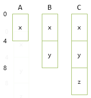
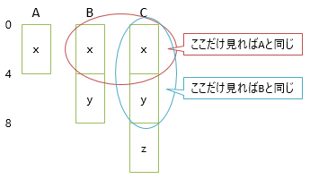
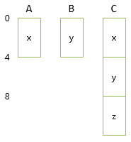
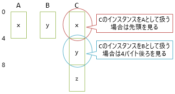
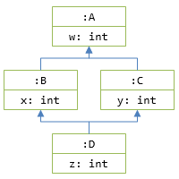
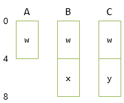
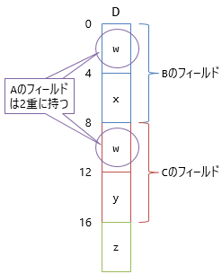
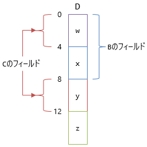

# \[雑記\] 多重継承できない理由

## <a id="sec-generated-title-1"></a> <a id="layout"></a>オブジェクトのメモリ レイアウト

多重継承を認めた場合に問題となるのは、オブジェクトのメモリ レイアウトです。そこでまず、このメモリ レイアウトについて軽く説明しておきます。

[実行時型情報](../dynamic/sp_reflection.md)で少し触れていますが、クラスや構造体などの複合型は、実行時にはメモリ上でどうレイアウトされるかが決まっています。

例えば、以下のようなクラスがあったとします。

```csharp
class A
{
    int x;
    int y;
    int z;
}
```

こういうフィールドの持ち方をすると、たいてい<sup>※</sup>の場合、以下のようなレイアウトになります。


`int`(32ビット整数)なので4バイトごとに、宣言した `x`, `y`, `z` の順に前から詰まります。

<sup>※</sup> 仕様上はコンパイラーの裁量によってフィールド間に隙間を開けることも許されているので、必ずしもこうなる保証はありません。

## <a id="sec-generated-title-2"></a> <a id="single-inheritance"></a>単一継承時のメモリ レイアウト

続いて、クラスを継承した時のレイアウトがどうなるかについてですが、例として以下のようなクラス階層を考えます。

```csharp
class A
{
    int x;
}

class B : A
{
    int y;
}

class C : B
{
    int z;
}
```

このときのレイアウトは「基底クラス側から順にフィールドを並べたものになります。この例の場合、下図のようになります。



継承の性質(is-aの関係)から、`B`のインスタンスは`A`としても使え、`C`のインスタンスは`B`としても`A`としても使えます。
単一継承の場合、実装上も難しい話は何もなく、単にレイアウトの<em>前半だけを使う</em>ことで基底クラスとして振る舞うことができます。



## <a id="sec-generated-title-3"></a> <a id="multiple-inheritance"></a>多重継承を認めた場合のメモリ レイアウト

面倒が出てくるのはここからです。先ほどと同じことを多重継承で考えてみましょう。
C#では認められていませんが、仮に、以下のように書けたとしましょう。

```csharp
class A
{
    int x;
}

class B
{
    int y;
}

class C : A, B
{
    int z;
}
```

レイアウトは以下のようにするのがシンプルでよいでしょう。



`C`では、`x`(`A`のメンバー)と`y`(`B`のメンバー)のどちらを前にするかという問題はあるものの、まあ、宣言の順(`C : A, B`という順で書いたんだから`A`が先)にすればいいでしょう。

ここで、`C`は`A`でも`B`でもあります。`C`のインスタンスを`A`として使うのは「前半を使う」で問題ないんですが、`B`として使いたければ「4バイト後ろを使う」という特殊ルールが必要になります(先頭からずれている分のオフセット管理が必要)。



「4バイト後ろを使う」というのは単純そうにも思えますが、実装上は結構面倒になります。
`B`のインスタンスと`C`のインスタンスを混在させて、どちらも`B`として使うことを考えると、`B`のインスタンスなら普通に先頭を、`C`のインスタンスなら4バイト後ろを使うというような分岐処理が必要になります。

## <a id="sec-generated-title-4"></a> <a id="diamond-inheritance"></a>ダイヤモンド問題

オフセット管理が必要な時点ですでに多重継承は面倒なんですが、より深い問題として、ダイヤモンド問題(diamond problem)というものがあります。ここで出てくるダイヤモンドという言葉は、野球用語の「ダイヤモンド」と同じく、ひし形形状のことを指します。すなわち、以下のように「ひし形な」多重継承をした場合にどうなるかという問題です。

```csharp
class A
{
    int w;
}

class B : A
{
    int x;
}

class C : A
{
    int y;
}

class D : B, C
{
    int z;
}
```

クラス図を描くと下図のようにひし形になるので「ダイヤモンド継承」と呼ばれます。



では、これらのクラスのレイアウトを考えてみましょう。`A`, `B`, `C`については単一継承しかしていないので問題はありません。



一方で、`D`クラスのレイアウトをどうすべきはなかなか悩ましくなります。
`B`にも`C`にも、`A`のメンバー`w`が含まれていることが問題になります。
Dからすると、二重管理です。

よくある実装としては2パターンあります。
1つ目は本当に二重管理してしまう方法で、`w`を2か所に持ってしまいます。



このやり方だと、`D`のインスタンスを`C`として使うのに、
前節と同様「8バイト後ろを使う」(オフセット管理)という方法でできるという利点はあります。
一方で、やはり二重管理は大変です。
`w`を書き換えるたびに、2か所のメモリ上を書き換える必要があります。

もう1つは、二重管理をなくすために、以下のようなレイアウトを考えます。



これで二重管理は解消するものの、今度は`C`のフィールドがとびとびになるという問題が出ます。
このせいで、フィールドの読み書きがかなり面倒になります。
フィールド`w`, `y`の読み書きの際、先頭から何バイト目を見ればよいかが、`C`のインスタンスか`D`のインスタンスかで、
以下の表のように変わります。

| | w の読み書き | y の読み書き |
| --- | --- | ---|
| `C`のインスタンス | 0 | 4 |
| `D`のインスタンス | 0 | 8 |

こういう不規則なオフセット管理はコストに直結します。
フィールドの読み書きがだいぶ遅くなるわけです。
そのコストを掛けてまで、本当に多重継承を使いたかったのかということを考えないといけません。

## <a id="sec-generated-title-5"></a> <a id="interface"></a>実際にほしかったものはインターフェイス

ちなみに、実際、C++の場合はここで説明したようなメモリ レイアウトで多重継承を実装しています。
しかし、コストが高すぎるので避けられる傾向があります。

ただし、多重継承のコストが問題にならない場合が1つあります。
それは、何もフィールドを持っていない場合です。
フィールドのメモリ レイアウトが問題の原因なんだから、フィールドがなければ問題ありません。
フィールドがなくても、メソッドがあればクラスの振る舞いは定義できます。
フィールドなしだとメソッドの実装が書けないにしても、抽象メソッドであればそもそも実装は必要ありません。

つまり、抽象メソッドだけを持つクラス(C++的に言うと純粋仮想関数だけを持つクラス)なら多重継承しても無害です。
C++でもそういうクラスを作ることが推奨されていますし、それを言語構文として取り入れたのがJavaやC#のインターフェイスです。
なので、JavaやC#では、クラスは単一継承関係しか認めず、代わりに、インターフェイスの実装が無制限です。

もちろん、フィールドを持てない分の不便はありますが、抽象メソッドだけでも十分な利用価値があります。
コストとメリットのバランスを考えると、これが良い妥協点だったということです。
