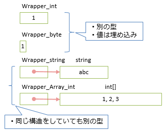
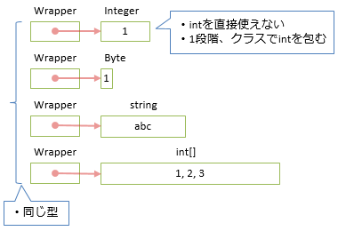
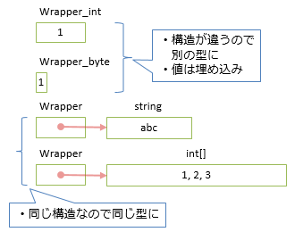

# ジェネリック

## <a id="sec-generated-title-1"></a> <a id="abst"></a>概要

C# 2.0 で、
C++でいうところのテンプレート、一般にはジェネリック(ジェネリクス)などと呼ばれるものが実装されました。
（C++ のテンプレートとは少し仕様が異なりますが。）

<strong id="generics" class="keyword">ジェネリック</strong><sup>※</sup>（generics：総称性）、
あるいは、総称的プログラミング（generic programming）とも呼ばれますが、
この機能は、
さまざまな型に対応するために、型をパラメータとして与えて、その型に対応したクラスや関数を生成するもの機能です。


##### <a id="sec-generated-title-2"></a>ポイント

* ジェネリック： 型だけ違って処理の内容が同じようなものを作るときに使う。

* ジェネリッククラス：<code>IComparable&lt;T&gt; { int CompareTo(T x, T y); }</code>

* ジェネリックメソッド：<code>T max&lt;T&gt;(T x, T y) { ... } </code>

##### <a id="sec-generated-title-3"></a> <a id="katakana-generics"></a>※genericsの訳語

英語だと、名詞では generics、形容詞が generic です。
なので名詞の genericsは、カタカナ語で訳すにしても「ジェネリクス」の方が適切な気はします。実際、Java などではジェネリクスという訳語が一般的です。
(一方、形容詞で generic type や generic method と言うときには訳もだいたい「ジェネリック」です。)

generics は「形容詞 + s」で名詞化している単語で、通常、s が付かない状態では名詞になりません。
類似の単語だとエコノミクス(economics)とかエレクトロニクス(electronics)とかがそうで、名詞としては常にsが付きます(s を取った状態だと形容詞)。

(ちなみに、この手の -ics で終わる単語は s で終わっているものの、扱いは単数。
「○○ic な事例を集めた学問」→「○○ics」みたいな感じなので複数形の単語とも取れる一方で、
抽象的に学問として扱う場合は不可算名詞。
そして、「その学問における一事例」みたいなときには「○○ics」のままで単数扱いになります。
)

マイクロソフトのドキュメントなどで、名詞形の generics であっても「ジェネリック」と訳されているのは、
マイクロソフトの翻訳ルールが機械的なせい(機械翻訳しやすいように/機械翻訳との整合性をとるため)です。
「カタカナ語にするときは複数形や三単現のsは一律削除する」というルールで運用していて、generics のように本来 s を取れない単語も巻き込まれたものと思われます。

(本サイトでは一時期、マイクロソフトのドキュメントに訳語を併せるよう努めていたため、名詞形もジェネリックになっているところが多いです。
さすがに変なルールではあるのでジェネリクスと書いているところも多く、混在しているのでご容赦ください。)

## <a id="sec-generated-title-4"></a> <a id="ex"></a>ジェネリックの例

### <a id="sec-generated-title-5"></a> <a id="method"></a>ジェネリックメソッド

例えば、2つの値の大きいほうをとる関数（静的メソッド）、Max を作りたいとします。
<code>int</code>型に限定したものなら簡単に作れて、以下のようになります。

```csharp {title="Max 関数(int限定版)"}
int Max(int x, int  y)
{
  return x > y ? x : y;
}
```


ところが、同じことを<code>double</code>型で行おうとすると、同じような関数をもう一つ追加してやる必要があります。

```csharp {title="Max 関数(double限定版)"}
double Max(double x, double y)
{
  return x > y ? x : y;
}
```


この2つの関数は、引数の型が <code>int</code> から <code>double</code> に変わったところ意外はまったく同じコードになっています。
このように、まったく同じコードを複数箇所に書くのは、書くのも面倒ですし、保守もしづらくなるのでなるべくしたくありません。

この問題に対して、
ジェネリックというものを用いれば、
必要に応じていろいろな型に対応した Max 関数を生成できます。
Max 関数のジェネリック版は以下のようになります。

```csharp {title="Max 関数(genereics 版)" highlight-text="&lt;Type&gt;"}
public static Type Max<Type>(Type a, Type b)
  where Type : IComparable
{
  return a.CompareTo(b) > 0 ? a : b;
}
```


このように、
メソッド名の後ろに、<code>&lt; &gt;</code> で囲って、
型をパラメータとして与えることができます。

（C++ のテンプレートと違って）C# のジェネリックを使うと、
比較などの演算子は使えなくなってしまうので、
わざわざ <code>CompareTo</code> を使う必要があったり、
多少の不便はありますが、
それでも、いちいち <code>int</code> 版と <code>double</code> 版を分けて書かなくてはいけないという問題は解決できます。
（<code>where</code> については後ほど説明します。）

ジェネリック版の <code>Max</code> 関数は以下のようにして呼び出します。

```csharp {title="generic メソッドの呼び出し例"}
int    n1 = Max<int>(5, 10);   // int 版の Max を明示的に呼び出し
int    n2 = Max(5, 10);        // int 版の Max が自動的に生成される
double x  = Max(5.0, 10.0);    // double 版の Max が自動的に生成される
string s  = Max("abc", "cat"); // string 版の Max (辞書式順序で比較)
```


### <a id="sec-generated-title-6"></a> <a id="class"></a>ジェネリッククラス

関数と同じく、クラスでもさまざまな型に対応したものを作成したいときがあります。
例えば、コレクションクラス（配列とかリストとかの、物の集まりのこと）などがその典型です。

ここでは例としてスタックを考えて見ましょう。
これも格納できる型を特定の型に限ったものは簡単に作成できます。

```csharp {title="Stack クラス（int 限定版）"}
// int 専用版スタッククラス
// エラー処理とかはサボっています
class StackInt
{
  int[] buf;
  int top;
  public StackInt(int max) { this.buf = new int[max]; this.top = 0;}
  public void Push(int val) { this.buf[this.top++] = val; }
  public int Pop(){ return this.buf[--this.top]; }
  public int Size{ get{return this.top; } }
  public int MaxSize{ get{ return this.buf.Length; } }
}
```


これを任意の型を格納できるように、ジェネリックを使って記述すると以下のようになります。

```csharp {title="Stack クラス（generics 版）" highlight-ranges="2:12-2:18,4:3-4:7,6:42-6:46,7:20-7:24,8:10-8:14"}
// generics 版スタッククラス
class Stack<Type>
{
  Type[] buf;
  int top;
  public Stack(int max) { this.buf = new Type[max]; this.top = 0;}
  public void Push(Type val) { this.buf[this.top++] = val; }
  public Type Pop(){ return this.buf[--this.top]; }
  public int Size{ get{return this.top; } }
  public int MaxSize{ get{ return this.buf.Length; } }
}
```


元の int 限定版とほとんど変わりありません。
クラス名 <code>Stack</code> の後ろに型パラメータ（<code>&lt;Type&gt;</code> の部分）が増えたのと、数箇所、<code>int</code> が <code>Type</code> に置き換わったのみです。

このジェネリック版の Stack クラスを参照するには、以下のように書きます。

```csharp {title="generic クラスの参照"}
const int SIZE = 5;
Stack<int>    si = new Stack<int>(SIZE);    // int型を格納できるスタックになる
Stack<double> sd = new Stack<double>(SIZE); // double型を格納できるスタックになる

for(int i=1; i<=SIZE; ++i)
{
  si.Push(i);
  sd.Push(1.0/i);
}

while(si.Size != 0)
{
  Console.Write("1/{0} = {1}\n", si.Pop(), sd.Pop());
}
```


## <a id="sec-generated-title-7"></a> <a id="merit"></a>ジェネリックの利点

C# の「[配列](../structured/st_array.md#array)」や、
「[foreach](../data/sp_foreach.md)」で例に挙げた連結リストなど、
複数の値を一まとめにして管理するクラスのことを、
<em>コンテナクラス</em>または<em>コレクションクラス</em>と呼びます。
コンテナクラスは、格納する要素の型、格納する方式によってさまざまな種類があり、
整列、検索、置換などのさまざまな操作が考えられます。
以下にいくつか例を挙げてみます。

<table summary="コンテナの要素・方式・操作">
	<caption>
		コンテナの要素・方式・操作
	</caption>
	<tr>
		<th>格納する要素の型</th>
		<td markdown="1"><code>int</code>、<code>double</code>、<code>string</code>・・・</td>
	</tr>
	<tr>
		<th>格納方式</th>
		<td markdown="1">配列、可変長配列、連結リスト、両端キュー ・・・</td>
	</tr>
	<tr>
		<th>操作</th>
		<td markdown="1">整列、検索、置換、総和計算 ・・・</td>
	</tr>
</table>


格納する型の種類が i 個、格納方式の数が j 個、操作の数が k 個あるとき、
これらのさまざまな種類のコンテナとその操作を個別に実装しようとすると、
全部で <em>i×j×k</em> 個のコードを書く必要があります。
それに対し、もし任意の型を格納できるコンテナがあり、任意の種類のコンテナを扱えるコンテナ操作関数があれば、<em>i＋j＋k</em> 個のコードを書くだけですみます。

前者は格納する要素の型、格納方式、操作が相互に依存性を持っているため、i×j×k 個という大量のコードを書く必要があるわけです。

<table summary="要素・方式に依存性がある場合">
	<caption>
		要素・方式に依存性がある場合
	</caption>
	<tr>
		<td markdown="1" rowspan="2" colspan="2"></td>
		<th colspan="4">要素の型</th>
	</tr>
	<tr>
		<th><code>int</code></th>
		<th><code>double</code></th>
		<th><code>string</code></th>
		<th>・・・</th>
	</tr>
	<tr>
		<th rowspan="4">格納方式</th>
		<th><code>Stack</code></th>
		<td markdown="1"><code>StackInt</code></td>
		<td markdown="1"><code>StackDouble</code></td>
		<td markdown="1"><code>StackString</code></td>
		<td markdown="1">・・・</td>
	</tr>
	<tr>
		<th><code>List</code></th>
		<td markdown="1"><code>ListInt</code></td>
		<td markdown="1"><code>ListDouble</code></td>
		<td markdown="1"><code>ListString</code></td>
		<td markdown="1">・・・</td>
	</tr>
	<tr>
		<th><code>Set</code></th>
		<td markdown="1"><code>SetInt</code></td>
		<td markdown="1"><code>SetDouble</code></td>
		<td markdown="1"><code>SetString</code></td>
		<td markdown="1">・・・</td>
	</tr>
	<tr>
		<th>・<br></br>・<br></br>・</th>
		<td markdown="1">・<br></br>・<br></br>・</td>
		<td markdown="1">・<br></br>・<br></br>・</td>
		<td markdown="1">・<br></br>・<br></br>・</td>
		<td markdown="1">・<br></br>　・<br></br>　　・</td>
	</tr>
</table>


逆に、後者は格納する型、格納方式、操作に依存性がないため、i＋j＋k 個という少ないコードを書くだけですみます。
ジェネリックを用いることで、
このような依存性の少ないコードを書くことが出来ます。

<table summary="要素・方式に依存性がない場合">
	<caption>
		要素・方式に依存性がない場合
	</caption>
	<tr>
		<th>要素の型</th>
		<th>格納方式</th>
	</tr>
	<tr>
		<td markdown="1"><code>int</code></td>
		<td markdown="1"><code>Stack&lt;Type&gt;</code></td>
	</tr>
	<tr>
		<td markdown="1"><code>double</code></td>
		<td markdown="1"><code>List&lt;Type&gt;</code></td>
	</tr>
	<tr>
		<td markdown="1"><code>string</code></td>
		<td markdown="1"><code>Set&lt;Type&gt;</code></td>
	</tr>
</table>


このような依存性・相関性の低い状態のことを<em>直交性が高い</em>といいます。
ジェネリックの利点は、
このような要素・方式・操作などの直交性を最大限に引き出せることです。


## <a id="sec-generated-title-8"></a> <a id="in_cs"></a>C# のジェネリック

例だけ見ても、もうほとんど分かるかと思いますが、
C# では以下のようにしてジェネリックな（どんな型に対しても総称的に使える）クラス・メソッドを定義できます。

```csharp {title="generic クラス"}
class クラス名<型引数>
  where 型引数中の型が満たすべき条件
{
  クラス定義
}
```


```csharp {title="generic メソッド"}
アクセスレベル 戻り値の型 メソッド名<型引数>(引数リスト)
  where 型引数中の型が満たすべき条件
{
  メソッド定義
}
```


クラス名・メソッド名の後に続く <code>&lt;&gt;</code> の中の部分を<strong id="typeparam" class="keyword">型引数</strong>（type parameter）といい、
関数の引数と同じようにして、型をパラメータにすることが出来ます。
テンプレートクラスを参照する側ではクラス名の後に続く <code>&lt;&gt;</code> の中に利用したい型名を書くことで、その型に特化したクラスを生成することが出来ます。

クラス、メソッドの他に、
「[インターフェース](oo_interface.md#interface)」、
「[デリゲート](../functional/sp_delegate.md#delegate)」もジェネリックなものが定義できます。
定義の仕方はクラス・メソッドに対するものと同様で、
インターフェース名、デリゲート名の後ろに型引数を書きます。

キーワード <code>where</code> に関しては次のサブセクションで説明します。


### <a id="sec-generated-title-9"></a> <a id="where"></a>制約条件

`where` 以下に、型引数が満たすべき条件(constraint: 制約条件)を書きます。
制約は付けなくてもかまいませんが、
その場合、型引数で与えた型に対するメソッド呼び出しなどは出来なくなります。

例えば以下の例で、
`First`メソッドのように何のメンバーも呼び出さない場合には制約は不要です。
一方で、`Max`メソッドのように何かを呼びたい場合は、それが何のメンバーなのかを示すため、
後述する「インターフェイス制約」などが必要になります。

```csharp {title="generic メソッド"}
// 一番目の引数だけを帰す単純なメソッド。
static Type First<Type>(Type a, Type b)
{
  // 特にメソッド呼び出し等はないのでこれは OK。
  return a;
}

// 例で挙げた Max 関数。
// where の部分を消してみる。
static Type Max<Type>(Type a, Type b)
{
  // ↓Type 型 に CompareTo なんて定義されていないと怒られてエラーになる。
  return a.CompareTo(b) > 0 ? a : b;
}
```

この例の場合、以下のような「インターフェイス制約」というものを付けます。
2つの値の比較したい場合、
<code>IComparable</code> というインターフェースが`CompareTo`というメソッドを持っているのでこれを使います。
以下のように、「クラス <code>Type</code> は <code>IComparable</code> を実装している」という制約を課すことで、
「`IComparable`を実装している任意の型に対して呼べるメソッド」が作れて、
メソッド中では`IComparable`のメンバーを呼び出せるようになります。

```csharp {title="Max 関数(genereics 版)" highlight-text="where Type : IComparable"}
static Type Max<Type>(Type a, Type b)
  where Type : IComparable
{
  // ↑この制約条件のお陰で、
  // ↓Type 型 は CompareTo を持っているというのが分かる。
  return a.CompareTo(b) > 0 ? a : b;
}
```

型引数 `T` に対する制約は、`where T : 制約` という書き方で指定します。
C# で指定できる型制約には以下のようなものがあります。

<table summary="型引数に対する制約条件(C# 7.2まで)">
	<caption>
		型引数に対する制約条件
	</caption>
	<tr>
		<th>制約の与え方</th>
		<th>説明</th>
	</tr>
	<tr>
		<td markdown="1"><code>where T : struct</code></td>
		<td markdown="1">型<code>T</code>は「[値型](../resource/oo_reference.md#valtype)」である</td>
	</tr>
	<tr>
		<td markdown="1"><code>where T : class</code></td>
		<td markdown="1">型<code>T</code>は「[参照型](../resource/oo_reference.md#reftype)」である</td>
	</tr>
	<tr>
		<td markdown="1"><code>where T : [base class]</code></td>
		<td markdown="1">型<code>T</code>は<code>[base class]</code>で指定された型を継承する。</td>
	</tr>
	<tr>
		<td markdown="1"><code>where T : [interface]</code></td>
		<td markdown="1">型<code>T</code>は<code>[interface]</code>で指定されたインターフェースを実装する。</td>
	</tr>
	<tr>
		<td markdown="1"><code>where T : new()</code></td>
		<td markdown="1">引数なしのコンストラクタを持つ。他の制約条件と同時に課す場合には、一番最後に指定する必要がある。</td>
	</tr>
</table>

前述の例でもそうだったように、一番よく使うのはインターフェイス制約でしょう。
メンバー呼び出しには必須になります。

複数の型引数に対して制約を付けたい場合は `where` を複数並べます。
また、1つの型引数に対して複数の制約を付けたい場合は `,` で制約を並べます。

```csharp {title="複数の型引数に、複数の制約"}
using System;
using System.Collections.Generic;

class X<TItem, TList>
    where TItem : class, IEquatable<TItem>, new()
    where TList : struct, IList<TItem>
{
}
```

上記の例のように、制約の中にさらにジェネリックな型(`IList<TItem>`など)を掛けますし、
型引数も使えます(型引数である`TItem`が、制約の側にも出てきます)。

ちなみに、互いに矛盾したり、意味が重複していて無駄な制約は同時には指定できません。
具体的には、`class`、`struct`、基底型は同時には指定できません。

```csharp {title="排他な制約" error-ranges="2:23-2:28,8:21-8:26"}
class X<T>
    where T : struct, class // 「クラス、かつ、構造体」なんてことはあり得ない。エラーに
{
}

class Base { }
class X<T>
    where T : Base, class // 基底クラスを持っている時点で参照型。エラーに
{
}
```

また、`class`、`struct`、基底型の3つは、インターフェイス、`new()`の2つよりも前に書く必要があります。

```csharp {title="制約の順序" error-ranges="9:28-9:34"}
using System;

class Ok<T>
    where T : struct, IDisposable // これは行ける
{
}

class Ng<T>
    where T : IDisposable, struct // こっちはダメ
{
}
```


#### <a id="sec-generated-title-10"></a> <a id="cs7.3"></a>C# 7.3 での追加

<h5 class="version version7">Ver. 7.3</h5>

C# 7.3 では、3つほど指定できる制約が増えました。

<table summary="型引数に対する制約条件(C# 7.3追加)">
	<caption>
		型引数に対する制約条件
	</caption>
	<tr>
		<th>制約の与え方</th>
		<th>説明</th>
	</tr>
	<tr>
		<td markdown="1"><code>where T : unmanaged</code></td>
		<td markdown="1">型<code>T</code>は「[アンマネージ型](../interop/sp_unsafe.md#unmanaged-types)」である</td>
	</tr>
	<tr>
		<td markdown="1"><code>where T : Enum</code></td>
		<td markdown="1">型<code>T</code>は「[列挙型](../structured/st_enum.md)」である</td>
	</tr>
	<tr>
		<td markdown="1"><code>where T : Delegate</code></td>
		<td markdown="1">型<code>T</code>は「[デリゲート型](../functional/sp_delegate.md)」である</td>
	</tr>
</table>

`unmanaged`制約を付けると、その型をポインター化したりできるようになります。
詳しくは「[unsafe](../interop/sp_unsafe.md#unmanaged-constraints)」で説明します。

`Enum`と`Delegate`に関しては、これらはキーワードではなく、それぞれ`System`名前空間にある`Enum`クラス、`Delegate`クラスのことです。
詳しくは「[[余談] 暗黙的な派生](miscimplictinherit.md#constraints)」で説明します。

ちなみに、`unmanaged`である時点で必ず`struct`なので、`struct`、`class`、基底型制約とは同時には指定できません。

一方で、`Enum`制約は`struct`制約と同時に指定できます。
通常、基底型制約は`struct`制約と同時には指定できませんが、`Enum`だけは特別に認められます。
`Enum`はクラスですが、「[[余談] 暗黙的な派生](miscimplictinherit.md#constraints)」で説明するように、
ちょっと特殊なクラスで、実態としてはクラスよりもインターフェイスに近いです
(インターフェイスであれば `struct` 制約と同時に指定できる)。

#### <a id="sec-generated-title-11"></a> <a id="cs8.0"></a>C# 8.0 での追加

<h5 class="version version8">Ver. 8.0</h5>

C# 8.0 で `notnull` 制約が増えました。

<table summary="型引数に対する制約条件(C# 8.0 追加)">
	<caption>
		型引数に対する制約条件
	</caption>
	<tr>
		<th>制約の与え方</th>
		<th>説明</th>
	</tr>
	<tr>
		<td markdown="1"><code>where T : notnull</code></td>
		<td markdown="1">型<code>T</code>には非 null な型しか渡せない</td>
	</tr>
</table>

詳しくは「[null 許容参照型](../resource/nullablereferencetype.md#type-constraints)」で説明します。

ちなみに、C# 8.0 で[null 許容参照型を有効化](../resource/nullablereferencetype.md#opt-in)した場合、
`class` 制約や、基底クラス制約は「非 null」の意味になり、
null 許容参照型を受け付けたい場合は制約に `?` を付けることになります。

```csharp {title="null 許容参照型がらみの制約" error-ranges="31:9-31:19,32:9-32:22" warning-ranges="25:9-25:23,26:9-26:37,27:9-27:22,28:9-28:25"}
#nullable enable
using System;
 
class Program
{
    static void NotNull<T>() where T : notnull { }
    static void Class<T>() where T : class { }
    static void NullableClass<T>() where T : class ? { }
    static void BaseType<T>() where T : Exception { }
    static void NullableBaseType<T>() where T : Exception? { }
 
    static void Main()
    {
        // OK。警告もなし。
        NotNull<int>();
        NotNull<string>();
        Class<string>();
        NullableClass<string>();
        NullableClass<string?>();
        BaseType<ArgumentException>();
        NullableBaseType<ArgumentException>();
        NullableBaseType<ArgumentException?>();
 
        // 警告。
        Class<string?>();
        BaseType<ArgumentException?>();
        NotNull<int?>();
        NotNull<string?>();
 
        // コンパイル エラー。
        Class<int>();
        BaseType<int>();
    }
}
 
```

#### <a id="sec-generated-title-12"></a> <a id="new-constrants"></a>補足: new() 制約

`new()`制約を付けることで、型引数`T`に対して引数なしのコンストラクター`new T()`を呼べるようになります。

例えば以下のように、`new T()`で要素を初期化しながら配列を作るなどの処理ができます。

```csharp {title="new() の利用例"}
// 既定値ではなく、new T() で要素を初期化しながら配列生成
static T[] Array<T>(int n)
    where T : new()
{
    var array = new T[n];
    for (int i = 0; i < array.Length; i++)
        array[i] = new T(); // new() 制約のおかげで空のコンストラクターを呼べる
    return array;
}
```

ただ、`new()`制約を使ったコンストラクター呼び出し`new T()`は、
内部的には[`Activator`](https://docs.microsoft.com/ja-jp/dotnet/api/system.activator)を使った動的な処理になっています。
[実行時型情報](../dynamic/sp_reflection.md)を使うので、
通常の`new`と比べて10倍くらい遅いです。

(参考: [new 制約の遅さ](https://gist.github.com/ufcpp/841a614a501130700e1c21e55318aa11)。
手元の環境でのベンチマークでは、
非ジェネリックな場合が6μ秒なのに対して、
`new()`制約や`Activator`を使ったものは100μ秒程度かかりました。
`new()`制約を使うより、外から`Func<T>`をもらって外で`new`してもらう方が10倍速かったりします。)

`new()`制約はお手軽ですが、
パフォーマンス的にシビアな場面では使わないよう注意が必要です。

#### <a id="sec-generated-title-13"></a> <a id="anti-constraint">アンチ制約</a>

<h5 class="version version13">Ver. 13</h5>

C# 13 で [`allows ref struct`](../resource/refstruct.md#ref-struct-interface) という機能が追加されました。
これはジェネリック型の `where` 句に書くもので、型引数 `T` に何らかの条件を付けるという意味では他の制約と同じですが、
`T` に及ぼす影響が真逆なのでアンチ制約、あるいは、反制約(anti-constraint)と呼びます。

通常の制約は以下のような意味を持ちます。

* メソッドの中でできることを増やす
* その代わり、使える型が減る

<table>
<tr>
<th>制約あり</th>
<th>制約なし</th>
</tr>
<tr>
<td markdown="1">

```csharp {title="制約あり" error-ranges="3:1-3:10,4:1-4:7" error-diagnostics="CS0310@3:1-3:10,CS0310@4:1-4:7"}
M<int>();
M<object>();
M<string>(); // 書けなくなる。
M<Uri>();    // 書けなくなる。

static object M<T>()
    where T : new()
{
    // new T() が書ける。
    return new T();
}
```

</td>
<td markdown="1">

```csharp {title="制約なし" error-ranges="10:12-10:19" error-diagnostics="CS0304@10:12-10:19"}
M<int>();
M<object>();
M<string>(); // 書ける。
M<Uri>();    // 書ける。

static object M<T>()
    // 制約なしの場合
{
    // こっちが書けない。
    return new T();
}
```

</td>
</tr>

</table>

一方で、アンチ制約はこれとは逆で、以下のような意味を持ちます。

* メソッドの中でできることが減る
* その代わり、使える型が増える

<table>
<tr>
<th>アンチ制約あり</th>
<th>アンチ制約なし</th>
</tr>
<tr>
<td markdown="1">

```csharp {title="アンチ制約あり" error-ranges="10:12-10:22" error-diagnostics="CS0029@10:12-10:22,CS0029@10:12-10:22"}
M<int>();
M<object>();
M<Span<string>>();      // 書ける。
M<ReadOnlySpan<int>>(); // 書ける。

static object? M<T>()
    where T : allows ref struct
{
    // ref struct を object に渡せない。
    return default(T);
}
```

</td>
<td markdown="1">

```csharp {title="アンチ制約なし" error-ranges="3:1-3:16,4:1-4:21" error-diagnostics="CS9244@3:1-3:16,CS9244@4:1-4:21"}
M<int>();
M<object>();
M<Span<string>>();      // 書けない。
M<ReadOnlySpan<int>>(); // 書けない。

static object? M<T>()
    // アンチ制約なしの場合
{
    // 書けるようになる。
    return default(T);
}
```

</td>
</tr>
</table>

`allows` は三単現の動詞の「許可する」です。
通常の `where T : X` が「T は X でなければならない」なのに対して、
`where T : allows X` は「T が X であることを許す」という意味になります。

ちなみに、`allows` は意味が逆なことを表すためにわざわざキーワードを追加したもので、
コンパイラーの実装都合だけでいうと `where T : ref struct` だけでも構文解析は可能だったそうです。

C# 13 時点でアンチ制約(= `allows` を使うもの)は `ref struct` だけですし、
他に将来アンチ制約として足したいものあまり多くはないんですが、
1つだけ有望そうな候補があります。

これまで、`where T : struct` 制約を指定すると null 許容値型を `T` に渡せなくなるという制約がありました。

```csharp {title="where T : struct では null 許容値型を使えなくなる" error-text="M&lt;int?&gt;" error-diagnostics="CS0453@2:1-2:8" warning-text="x" warning-diagnostics="CS0219@9:8-9:9"}
// struct 制約が付いていると null 許容型を指定できなくなる。
M<int?>();

static void M<T>()
    where T : struct
{
    // T = int? だとすると、T? が int?? になっちゃう。
    // (.NET は「2重 nullable」を認めていない。)
    T? x = null;
}
```

そこで、`allows nullable` (仮)アンチ制約を導入してはどうかという案が出ています。

```csharp {title="null 許容値型アンチ制約を追加する案" error-text="T?" warning-text="x" warning-diagnostics="CS0219@8:8-8:9"}
// これができるようになってほしい。
M<int?>();

static void M<T>()
    where T : struct, allows nullable // 仮文法
{
    // こっちにエラーを出す案。
    T? x = null;
}
```

### <a id="sec-generated-title-14"></a> <a id="instanciation"></a>インスタンス化

ジェネリックなクラス・メソッドに対して、
具体的な型を与えることを「インスタンス化する」といいます。

例えば、<code>class Stack&lt;Type&gt;</code> として定義した
ジェネリッククラスに対して、
具体的な型 <code>int</code> を与え、
<code>class Stack&lt;int&gt;</code> というクラスを作ることを、
「<code>int</code> で <code>Stack</code> をインスタンス化する」といいます。

```csharp {title="generic クラスの参照"}
const int SIZE = 5;
Stack<int>    si = new Stack<int>(SIZE);    // Stack を int でインスタンス化
Stack<double> sd = new Stack<double>(SIZE); // Stack を double でインスタンス化

int    n = Max(5, 10);        // Max を int でインスタンス化
double x = Max(5.0, 10.0);    // Max を double でインスタンス化
string s = Max("abc", "cat"); // Max を string でインスタンス化
```


### <a id="sec-generated-title-15"></a> <a id="complex"></a>複雑な型引数の使い方

型引数は複数の型を含んでいてもかまいません。

```csharp {title="複数の型を含む型引数" highlight-text="&lt;K, V&gt;"}
class Pair<K, V>
{
  K key;
  V val;

  public K Key  { get{return this.key;} set{this.key = value;} }
  public V Value{ get{return this.val;} set{this.val = value;} }
}
```


また、ジェネリッククラス・メソッド内では型引数を使って、
他のジェネリッククラスのインスタンス化ができます。

```csharp {title="型引数を使ってインスタンス化" highlight-text="System.Collections.Generic.IList&lt;Type&gt;"}
class TestGenerics
{
  // リスト中の要素を Console.Write で画面に出力。
  static void Show<Type>(System.Collections.Generic.IList<Type> list)
  {
    foreach(Type x in list)
      Console.Write("{0}\n", x);
  }

  static void Main()
  {
    int[] i = new int[]{1, 2, 3, 4, 5};
    Show(i);
  }
}
```


### <a id="sec-generated-title-16"></a> <a id="default"></a>既定値

変数を初期化するとき、
数値型の場合は 0 で、
参照型の場合は <code>null</code> で初期化する事がよくあります。
これら、0 や <code>null</code> などの値を既定値（default value）と呼びます。

そこで、C# ジェネリックでは、既定値を得るために、
<code>default(Type)</code> というキーワードを用意しています。
<code>default(Type)</code> は、
数値型に対しては 0、
参照型に対しては <code>null</code> になります。
また、構造体に対しては、
構造体の全てのメンバーに対して 0 または <code>null</code> で初期化したものを与えます。

```csharp {title="既定値" highlight-text="default(Type)"}
class TestGenerics
{
  // 配列を 0 または null で満たします。
  static void FillWithDefault<Type>(Type[] array)
  {
    for(int i=0; i<array.Length; ++i)
      array[i] = default(Type);
  }

  static void Main()
  {
    int[]    i = new int[5];
    string[] s = new string[5];

    FillWithDefault(i);
    FillWithDefault(s);
  }
}
```


### <a id="sec-generated-title-17"></a> <a id="variance"></a>共変性・反変性

<h5 class="version version4">Ver. 4.0</h5>

C# 4.0 から、ジェネリックの型引数に共変性・反変性を持たせることができるようになりました。
詳しくは「[ジェネリクスの共変性・反変性](sp4_variance.md)」を参照してください。


## <a id="sec-generated-title-18"></a> <a id="compare"></a>C++ や Java の template/generics との違い

（変更予定）
この比較表は「Java/C++ 開発者向け」の一節に移してもいいかも。

<table summary="">

	<tr>
		<td markdown="1"></td>
		<th>C#</th>
		<th>Java</th>
		<th>C++</th>
	</tr>
	<tr>
		<th>実装方式</th>
		<td markdown="1">MSIL に generics 用の命令がある。 （.NET 2.0 で追加された。） キャストの分のコードが減って実行効率がいい。</td>
		<td markdown="1">Java バイトコード上は generics に対応していない。 Java コンパイラがキャストを自動的に挿入してくれる。 単なるシンタックスシュガー。 （古いバージョンとの互換性重視。）</td>
		<td markdown="1">超高機能なマクロみたいなもの。 全部インライン展開されるので、 実行効率はいいものの、コンパイルに時間がかかるし、実行ファイルサイズが膨れ上がる。 また、ソースファイルとして提供せざるを得ない。</td>
	</tr>
	<tr>
		<th>実体</th>
		<td markdown="1">IL 上は List&lt;int&gt; と List&lt;string&gt; でほとんど同じ扱い。 値型と参照型の違いを吸収するための命令も IL に追加されてる。 参照型同士（たとえば List&lt;string&gt; と List&lt;object&gt; ）なら JIT 結果もほぼ共有される</td>
		<td markdown="1">いわゆる「型消去」。 Vector&lt;int&gt; と Vector&lt;string&gt; で実体は同じ。 （内部的にどころか実際に）object の Vector と同じものになる。</td>
		<td markdown="1">全部インラインに展開される。 vector&lt;int&gt; と vector&lt;string&gt; で別個にコードが生成される。</td>
	</tr>
	<tr>
		<th>型安全性</th>
		<td markdown="1">List&lt;int&gt; と List&lt;string&gt; はちゃんと別の型として扱われる。 リフレクションでも正確に型を取れる。</td>
		<td markdown="1">Vector&lt;int&gt; と Vector&lt;string&gt; を区別できない。 リフレクションでは要素の型を取れない。</td>
		<td markdown="1">vector&lt;int&gt; と vector&lt;string&gt; はちゃんと別の型として扱われる。</td>
	</tr>
	<tr>
		<th>キャスト</th>
		<td markdown="1">内部的には object の List と同じ扱いであるものの、 MSIL レベルで対応しているおかげでキャストの必要はなくなる。 キャスト（特に boxing/unboxing）が不要な分、実行効率がいい。</td>
		<td markdown="1">コンパイラが自動的にキャストコードを挿入している。</td>
		<td markdown="1">実体がそもそも別、インラインに展開されたコードになるので、 キャストも不要。 実行ファイルサイズ爆発する原因。</td>
	</tr>
	<tr>
		<th>メンバー参照</th>
		<td markdown="1">インターフェースを使った型制約に基づく。</td>
		<td markdown="1">インターフェースを使った型制約に基づく。</td>
		<td markdown="1">「[ダックタイピング](../appendix/ap_term.md#ducktype)」。</td>
	</tr>
	<tr>
		<th>その他</th>
		<td markdown="1">C# 4.0 で共変性・反変性がサポートされる。</td>
		<td markdown="1">変性の代わりにワイルドカード利用。 互換性重視なので、J2SE 5.0 でコンパイルしたものも、古いバージョンの VM で問題なく動く。</td>
		<td markdown="1">マクロみたいなものなので、型だけじゃなくて int も template の引数にできる。 template の特殊化など、C# generics がサポートしていない（原理的にできない）こともできる。</td>
	</tr>
</table>


<!-- original-page-break -->

## <a id="sec-generated-title-19"></a> <a id="inside-generics"></a>ジェネリックの実現方法

[サンプルコード](https://github.com/ufcpp/UfcppSample/tree/master/Chapters/Oop/GenericsSample)

ジェネリックの実装方法はプログラミング言語ごとに方針の差が結構あります。例えば、以下のようなやり方があります。

- 全展開(C++など)
- 値型のみ展開(C#など)
- 型消去(Javaなど)

例えば、以下のようなコードを書いたとします。単純なジェネリック クラスと、その利用側コードです。

```csharp {title="単純なジェネリック クラスと、その利用例"}
public class Wrapper<T>
{
    public T Value;
}

class Program
{
    static void Main(string[] args)
    {
        var i = new Wrapper<int> { Value = 1 };
        var b = new Wrapper<byte> { Value = 1 };
        var s = new Wrapper<string> { Value = "abc" };
        var a = new Wrapper<int[]> { Value = new[] { 1, 2, 3 } };

        int iv = i.Value;
        byte bv = b.Value;
        string sv = s.Value;
        int[] av = a.Value;
    }
}
```

4つの型パラメーターを使っていて、そのうち、2つ(`int`と`byte`)は値型、残り2つ(`string`と`int[]`)は参照型です。

これが、どういう風に展開されるかを見ていきましょう。

### <a id="sec-generated-title-20"></a> <a id="templated"></a>全展開(C++など)

わかりやすい実装は、型パラメーターごとにすべて展開してしまう手法(全展開)です。
C++ではこの手法でジェネリックを実現しています。
(ちなみに、C++の言語機能としてはテンプレート(template)と呼びます。
コンパイル時に全部ひな形生成してしまう辺りが「テンプレート」(ひな形、鋳型)と呼ばれる所以です。)

先ほどのコードを「全展開」で実装すると、以下のようなものに相当するコードが生成されます。

```csharp {title="全展開"}
// 使った分だけそれぞれ別の型に展開
public class Wrapper_int { public int Value; }
public class Wrapper_byte { public byte Value; }
public class Wrapper_string { public string Value; }
public class Wrapper_Array_int { public int[] Value; }

class Program
{
    static void Main(string[] args)
    {
        var i = new Wrapper_int { Value = 1 };
        var b = new Wrapper_byte { Value = 1 };
        var s = new Wrapper_string { Value = "abc" };
        var a = new Wrapper_Array_int { Value = new[] { 1, 2, 3 } };

        // キャストは不要
        int iv = i.Value;
        byte bv = b.Value;
        string sv = s.Value;
        int[] av = a.Value;
    }
}
```

このコードは、以下のようなメモリの使い方をします。



利点

- 無駄なオーバーヘッドがなくなって、実行性能がいい

欠点

- 型パラメーターに与える型が増えると、生成されるプログラムのサイズが大きくなりすぎる

### <a id="sec-generated-title-21"></a> <a id="type-erasure"></a>型消去(Javaなど)

全展開の真逆の実装は、全部の型を消してしまう手法(型消去)です。
`object`型にはどんな型でも代入できるので、`object`型なクラス1つを用意して、適宜キャストを挟むコードを生成します。
Javaではこの手法でジェネリックを実現しています。

先ほどのコードを「型消去」で実装すると、以下のようなものに相当するコードが生成されます。

```csharp {title="型消去"}
// object 型な1つのクラスに集約
// 元の型情報を残さない = 型消去
public class Wrapper { public object Value; }

class Program
{
    static void Main(string[] args)
    {
        var i = new Wrapper { Value = new Integer(1) };
        var b = new Wrapper { Value = new Byte(1) };
        var s = new Wrapper { Value = "abc" };
        var a = new Wrapper { Value = new[] { 1, 2, 3 } };

        // キャストが必要
        int iv = ((Integer)i.Value).Value;
        byte bv = ((Byte)i.Value).Value;
        string sv = (string)s.Value;
        int[] av = (int[])a.Value;
    }
}

//↓こんな感じのクラスが標準ライブラリ中にある

public class Integer
{
    public int Value;
    public Integer(int value) { Value = value; }
}

public class Byte
{
    public byte Value;
    public Byte(byte value) { Value = value; }
}
```

このコードは、以下のようなメモリの使い方をします。



利点

- 実装がシンプル

欠点

- 実行性能的に不利
  - 特に値型に対して[ボックス化](../resource/rmboxing.md#boxing)が発生するのがかなりつらい

### <a id="sec-generated-title-22"></a> <a id="value-type"></a>値型だけ展開

C#の実装は全展開と型消去の間くらいの手法になっています。

型消去の場合、値型に対してボックス化が起きることが実行性能上かなり不利になります。
そこで、C#の実装では、値型だけは展開し、参照型に対しては型消去に近いコードを生成します。

要するに、先ほどのコードから、以下のようなものに相当するコードが生成されます。

```csharp {title="値型だけ展開"}
// 値型の場合: 使った分だけそれぞれ別の型に展開
public class Wrapper_int { public int Value; }
public class Wrapper_byte { public byte Value; }

// 参照型の場合、object 型な1つのクラスに集約
public class Wrapper { public object Value; }

class Program
{
    static void Main(string[] args)
    {
        var i = new Wrapper_int { Value = 1 };
        var b = new Wrapper_byte { Value = 1 };
        var s = new Wrapper { Value = "abc" };
        var a = new Wrapper { Value = new[] { 1, 2, 3 } };

        // 値型はキャスト不要
        int iv = i.Value;
        byte bv = b.Value;

        // 参照型
        // (C#(.NET) の場合はこのキャストを取り除くような最適化もしてる)
        string sv = (string)s.Value;
        int[] av = (int[])a.Value;
    }
}
```

このコードは、以下のようなメモリの使い方をします。



利点

- プログラム サイズの増大と実行性能のバランスがいい

欠点

- コンパイラーの実装が大変
  - 機能の修正がしにくい


<!-- original-page-break -->


## <a id="sec-generated-title-23"></a> <a id="constrained"></a>インターフェイス制約

C#のジェネリックでは、メソッドなどのメンバーを参照するためにインターフェイス制約([制約条件](#where)で、`where T : [interface]`)を付ける必要があります。
例えば、以下のようなコードでは、前者の書き方ではだめで、
後者のように、`where`句を付けて初めてコンパイルできます。

```csharp {title="ジェネリックな引数のメンバー参照"}
// コンパイル エラー: T に Count プロパティがない
static int M<T>(T x) => x.Count;

// これなら大丈夫。IList.Count を参照できる
static int M<T>(T x)
    where T : System.Collections.IList
    => x.Count;
```

インターフェイス制約で困ることになるのは、静的メソッドを呼べないことです。
演算子も静的メソッドみたいなものなので呼べません。
例えば、以下のコードはコンパイル エラーになります。
(※ C# 11 以降は静的メソッド呼ぶ方法が追加されました。
詳しくは「[インターフェイスの静的抽象メンバー](oo_interface.md#static-abstract)」で説明しています。)

```csharp {title="ジェネリックを使うと静的メソッドを呼べない"}
// interface 制約では静的メソッドを呼べない
// なので、ジェネリックを使うと静的メソッドを呼ぶ手段がない
// コンパイル エラーに
static T M<T>(T x) => T.StaticMethod(x);

// + (演算子)は実質的には静的メソッド
// 演算子もコンパイル エラーに
static T Add<T>(T x, T y) => x + y;
```

インターフェイス制約が必要なんだったら、インターフェイスをそのまま使えばいいと思うかもしれませんが、
わざわざジェネリックにすることで実行性能的に有利になることがあります。

特に、構造体が絡むと顕著で、かなり実行性能に影響があります。
例えば以下のコードを見てください。

```csharp {title="構造体のボックス化を避けるためのジェネリック"}
using System;

// 無駄なヒープ確保をしないように構造体に
struct Disposable : IDisposable
{
    public void Dispose() { }
}

class Program
{
    static void WithInterface(IDisposable x) => x.Dispose();

    // やってることは WithInterface を同じに見えて…
    static void WithGenerics<T>(T x)
        where T : IDisposable
        => x.Dispose();

    static void Main()
    {
        // 構造体なので無駄なヒープ確保はしない
        default(Disposable).Dispose();

        for (int i = 0; i < 10000; i++)
        {
            // ところが、インターフェイスを介するとボックス化を起こす
            // 無駄なヒープ確保に
            // 1個や2個なら大したコストではないものの、何度も呼ばれるとさすがにつらい
            WithInterface(default(Disposable));
        }

        for (int i = 0; i < 10000; i++)
        {
            // ジェネリックを介するとボックス化が不要
            // 繰り返し呼んでも平気
            WithGenerics(default(Disposable));
        }
    }
}
```

`IDisposable`インターフェイスを実装した`Disposable`という構造体を作って、この`Dispose`メソッドを呼ぶことを考えます。
`IDisposable`インターフェイスなのは簡単に実装できるものを選んだというだけで、深い意味はありません。
構造体なので、普通にインスタンスを作って、普通に`Dispose`メソッドを呼ぶ分にはヒープ領域を一切使いません。

ところが、`WithInterface`メソッドのように、インターフェイスを介して引数に渡すと、ここでボックス化(ヒープ確保)が発生します。
1個や2個なら大したコストではないものの、この例のようにループの内側で大量に呼ばれると、なかなかきつい負担となります。

そこで、`WithGenerics`メソッドのように、ジェネリックを使います。
[前節](#value-type)で説明しましたが、
C#のジェネリックでは値型を使ったときにコードを展開してくれます。
その結果、ボックス化を起こさずにメソッドの引数に値型を渡せます。

### <a id="sec-generated-title-24"></a> <a id="pseudo-static"></a>静的メソッド代わり

ジェネリックでは静的メソッドを呼ぶ手段がないという話をしました。
ちょっと強引な手段にはなりますが、この代わりとなる方法を考えてみましょう。

- [サンプル コード](https://github.com/ufcpp/UfcppSample/tree/master/Chapters/Oop/ValueTypeGenerics/GenericArithmeticOperators)

たとえば、以下のような累算処理を考えてみます。
`int`配列の全要素の和と積を求めるコードです。

```csharp {title="累算処理"}
static int Sum(int[] items)
{
    var sum = 0;
    foreach (var item in items)
        sum = sum + item;
    return sum;
}

static int Prod(int[] items)
{
    var sum = 1;
    foreach (var item in items)
        sum = sum * item;
    return sum;
}

static void M()
{
    var items = new[] { 1, 2, 3, 4, 5, 6, 7, 8, 9 };
    var sum = Sum(items);
    var prod = Prod(items);
}
```

標準ライブラリにある`Aggregate`メソッド(`System.Linq.Enumerable`クラスの拡張メソッド)を使って以下のように書けはするんですが。
これはこれで、デリゲート(インターフェイスと同程度の負担)を介することになります。

```csharp {title="Aggregateを使って累算"}
var sum = items.Aggregate(0, (x, y) => x + y);
var prod = items.Aggregate(1, (x, y) => x * y);
```

デリゲートやインターフェイスを介したメソッド呼び出しは、静的メソッドと比べるとほんの少し不利です。
微々たるものですが、「ちりも積もれば」で、微々たる差を気にしないといけないこともあります。

そこで、値型のジェネリックが展開される性質を使ってみます。
まず、以下のようなインターフェイスと構造体を作ります。

```csharp {title="2項演算を表すインターフェイスと、和、積の構造体"}
interface IBinaryOperator<T>
{
    T Zero { get; }
    T Operate(T x, T y);
}

struct Add : IBinaryOperator<int>
{
    public int Zero => 0;
    public int Operate(int x, int y) => x + y;
}

struct Mul : IBinaryOperator<int>
{
    public int Zero => 1;
    public int Operate(int x, int y) => x * y;
}
```

例えば、以下のように書けます。
値型のジェネリックの展開によって、デリゲートやインターフェイスを介するよりも最適化が掛かりやすく、
静的メソッドに近い性能になります。
(具体的にいうと、仮想メソッド呼び出しが消えて、小さいメソッドを最適化オプション付きで実行すると[インライン展開](../structured/miscinlining.md)も掛かります。
この例はまさにそういう最適化が掛かって、ジェネリックなしの場合と比べて10倍以上速くなったりします。)

```csharp {title="値型ジェネリックを使ったメソッド呼び出し"}
static T Sum<T, TOperator>(T[] items, TOperator op)
    where TOperator : struct, IBinaryOperator<T>
{
    var sum = op.Zero;
    foreach (var item in items)
        sum = op.Operate(sum, item);
    return sum;
}

static void M()
{
    var items = new[] { 1, 2, 3, 4, 5, 6, 7, 8, 9 };
    // ジェネリックを介せばボックス化を避けれる
    var sum = Sum(items, default(Add));
    var prod = Sum(items, default(Mul));
}
```

もう1つ、違うバージョンを書いてみましょう。
`default(Add)`とか、呼び出し側でダミーのインスタンスを作って引数として渡すのも無駄なので、
これもメソッドの中でやってしまいましょう。

```csharp {title="型引数だけを渡すバージョン"}
static T Sum<T, TOperator>(T[] items)
    where TOperator : struct, IBinaryOperator<T>
{
    var sum = default(TOperator).Zero;
    foreach (var item in items)
        sum = default(TOperator).Operate(sum, item);
    // ↑ メソッド内で default()
    // 空の構造体なのでほぼノーコスト
    return sum;
}

static void M()
{
    var items = new[] { 1, 2, 3, 4, 5, 6, 7, 8, 9 };
    // default(T) せず、型引数だけ書く
    var sum = Sum<int, Add>(items);
    var prod = Sum<int, Mul>(items);
}
```

こういう、型引数の変更だけで動作を切り替える手法をポリシー パターン(policy pattern)とかポリシー ベース設計(policy based design)とか呼んだりします。
ちなみに、C++のtemplateの場合はジェネリックに静的メソッドを呼べるので、C++では強引な手段を取らなくてもポリシー パターンを使いやすく、結構多用されます。
