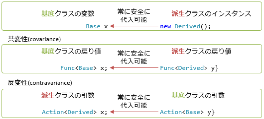
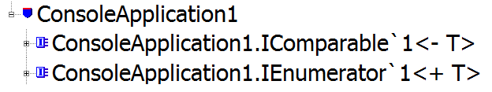

# ジェネリクスの共変性・反変性

## <a id="sec-generated-title-1"></a> <a id="abst"></a>概要

<h5 class="version version4">Ver. 4.0</h5>

C# 4.0 で、ジェネリクスの型引数に共変性・反変性を持たせることが可能になりました。
（共変性・反変性という言葉の意味は「[covariance と contravariance](../functional/sp_delegate.md#co-contra)」参照。）


## <a id="sec-generated-title-2"></a> <a id="variance"></a>ジェネリックの共変性・反変性

ジェネリクスの共変性・反変性というものがどういうものかというのを説明する前に、まず背景を。
ジェネリックコレクションに関して、昔から以下のようなことをしたいという要望がありました。

```csharp
List<string> strings = {"aa", "bb", "cc"};
List<object> objs = strings;
```


これを認めてしまうと何がまずいかというと、
以下のような不正な値の書き換えが起こり得る。

```csharp
// strings と objs は同じオブジェクト
objs[0] = 5; // int に書き換えられたらまずい
string str = strings[0];
```


この問題が起きる原因がどこにあるかというと、
List が set も get も可能なインデクサーを持っていることです。

get しかない場合なら、ここで挙げたような不正な書き換えは起こらないわけです。
戻り値（あるいは get）でしか使わない型の場合、

```csharp
IEnumerable<string> strings = new[] {"aa", "bb", "cc"};
IEnumerable<object> objs = strings;
// foreach (object x in strings) ってやっても問題ないんだから、
// objs に strings を代入しても OK。
```


みたいな事が出来ても問題ないはず。
（こういうのを<strong id="covariance" class="keyword">共変性</strong>（covariance）と言います。）

逆に、引数（あるいは set）でしか使わない場合も、

```csharp
Action<object> objAction = x => { Console.Write(x); };
Action<string> strAction = objAction;
// objAction("string"); ってやっても問題ないんだから、
// strAction に objAction を代入しても OK。
```


みたいな事をして大丈夫。
（こういうのを<strong id="contravariance" class="keyword">反変性</strong>（contravariance）といいます。）



## <a id="sec-generated-title-3"></a> <a id="in_out"></a>in/out 修飾子

ということで、C# 4.0 から、ジェネリックなインターフェース、もしくは、デリゲートに対して、
共変性・反変性を実現するための仕組みが追加されました。

共変性のためには「型を出力（戻り値、get）にしか使わない」、
反変性のためには「型を入力（引数、set）にしか使わない」という保証があればいいので、
それぞれ、ジェネリクスの型引数に out と in という修飾子を付けることでこれを保証します。
（ちなみに、この out と in 修飾子のことを<strong id="variance-annotation" class="keyword">変性注釈</strong>（variance annotation）と呼ぶそうです。）

まず、出力（メソッドの戻り値、プロパティの get）にしか使わない型には out という修飾子を指定します。
例えば、.NET Framework 4.0 では、IEnumerator の型引数に out が付きました。

```csharp
public interface IEnumerator<out T>
{
  T Current { get; } // get しかない ＝ 出力のみ
  bool MoveNext();
  void Reset();
}
```


こうすることで、共変性が認められます。

```csharp
IEnumerator<string> strEnum = new Enumerator<string>();
IEnumerator<object> objEnum = strEnum;
```


一方、入力（メソッドの引数、プロパティの set）にしか使わない型には in という修飾子を指定します。
例えば、IComparer の型引数に in が付きました。

```csharp
public interface IComparer<in T>
{
  int Compare(T a, T b); // T は引数としてしか使われない
}
```


こうすることで、今度は反変性が認められます。

```csharp
IComparer<object> objComp = new Comparer<object>();
IComparer<string> strComp = objComp;
```


当然、in/out の組み合わせもあり得ます。

```csharp
public delegate TResult Func<in T1, in T2, out TResult>(T1 arg1, T2 arg2);
```


```csharp
Func<object, object, string> f1 = (x, y) => string.Format("({0}, {1})", x, y);
Func<string, string, object> f2 = f1;
```


## <a id="sec-generated-title-4"></a> <a id="implementation"></a>余談1： in/out の内部実装

型引数の in/out のような仕組みの実現には 「[IL](../abstract/ab_dotnet.md#il)」 レベルでの対応が必要になります。
というか、IL レベルでは、.NET Framework 2.0 の時点で in/out 相当のフラグを設定する機能がありました。
（今回、C# からそのフラグを立てれるようになっただけ。）

例えば、C# 4.0 で以下のようなソースを書いて、

```csharp
namespace ConsoleApplication1
{
    public interface IEnumerator<out T>
    {
        T Current { get; }
        bool MoveNext();
    }
    public interface IComparable<in T>
    {
        int CompareTo(T x);
    }
}
```


一度コンパイルしたものを .NET Framework 2.0 付属の IL Disasm（.NET Framework 付属の IL 逆アセンブラー）で開いてみると、
型引数 T の前に + や - が付いていることを確認できます。

<figure>

[](../../../../assets/media/ufcpp2000/csharp/fig/variance.png)

<figcaption>in/out 付きインターフェースのコンパイル結果</figcaption>
</figure>


仕組みとしては .NET Framework 2.0 の頃からあったので、
IL アセンブラーを使ってこの +/- フラグを立ててやれば、
C# 3.0 以前でも共変性・反変性を使えたりします。
（一度 object にしてから無理やりキャストする必要はある。）


## <a id="sec-generated-title-5"></a> <a id="value"></a>余談2： 値型は　invariant

ちなみに、値型（int とかの組み込み整数型や、struct、enum）には共変性・反変性は使えません。
（「[IL](../abstract/ab_dotnet.md#il)」 の実装上の制約。）

```csharp
IEnumerable<object> e1 = new[] { "abc", "def" }; // こっちは OK。
IEnumerable<object> e2 = new[] { 1, 2 };         // でも、これは不可。int が値型だから。
```


<!-- original-page-break -->


## <a id="sec-generated-title-6"></a> <a id="covariant-array"></a>余談3: C#の配列は共変

C#の配列には共変性があります。つまり、以下のコードがコンパイルできます。

```csharp
string[] derivedItems = { "Aleph", "Beth", "Gimel" };
object[] baseItems = derivedItems;

// 読み出し(戻り値側、out、共変)は常に安全
for (int i = 0; i < baseItems.Length; i++)
{
    Console.WriteLine(baseItems[i]);
}
```

逆向き(反変な代入)はできません。

```csharp
object[] baseItems = { 1, 2, 3 };
string[] derivedItems = baseItems; // コンパイル エラー
```

C#の配列が共変なのは、ジェネリックがなかった時代(C# 1.0の頃)の名残です。
本当は認めるべきではありません。

共変性は、本来、出力(読み出し)になる型にしか認められません。
しかし、配列は、同じ型に対して入力(書き込み)もできます。
配列に対して特別に共変性を認めてしまっているので、以下のような問題が起きます。

```csharp
string[] derivedItems = { "Aleph", "Beth", "Gimel" };
object[] baseItems = derivedItems;

// 書き込み(引数側、in、反変)は本当はやっちゃいけない
// でも、コンパイルが成功する。実行時エラーが出る
baseItems[1] = 100;
```

本当はコンパイル自体できてはいけないコードですが、実行してみるまでエラーになりません。
`IEnumerable<T>`や`IReadOnlyCollection<T>`などのジェネリックなインターフェイスを介してのアクセスであれば、こういう問題のあるコードは書けません。

## <a id="sec-generated-title-7"></a> <a id="paramter-delegate"></a>引数でインターフェイスやデリゲートを受け取る場合

ジェネリックなインターフェイスやデリゲートを引数として渡す場合、in/outの向きが逆転します。
(戻り値の場合は逆転しません。)
例えば以下のようになります。

```csharp
// 標準ライブラリの System.Func
public delegate TResult Func<in T, out TResult>(T arg);

// 引数の Func の TIn と TOut が逆
delegate Func<TIn, TOut> F<in TIn, out TOut>(Func<TOut, TIn> x);
```

in/out 注釈は、値を受け取る(in)か渡す(out)かの区別です。
引数で受け取ったインターフェイスやデリゲートの場合、「戻り値から値を受け取る」、「引数に値を渡す」ということになるので、こういう逆転が起きます。

```csharp
interface INestedVariance<in TIn, out TOut>
{
    TOut F(TIn x, Func<TOut, TIn> f);
}

class NestedVariance<TIn, TOut> : INestedVariance<TIn, TOut>
{
    public TOut F(TIn x, Func<TOut, TIn> f)
    {
        // f の戻り値から値を受け取る = in
        TIn in1 = f(default(TOut));

        // f の引数にはこちらから値を渡す = out
        TOut out1 = default(TOut);
        var r = f(out1);

        // 引数から受け取る = in
        TIn in2 = x;

        // 戻り値を返す = out
        TOut out2 = default(TOut);
        return out2;
    }
}
```

実用例の代表は、`IObserver<T>`インターフェイスと`IObservable<T>`インターフェイス(どちらも標準ライブラリの`System`名前空間に含まれるインターフェイス)でしょう。
以下のようなインターフェイスになっています。

```csharp
public interface IObserver<in T>
{
    void OnCompleted();
    void OnError(Exception error);
    void OnNext(T value);
}

public interface IObservable<out T>
{
    IDisposable Subscribe(IObserver<T> observer);
}
```
