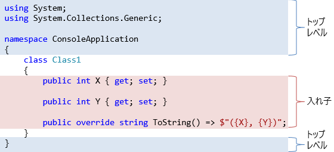

# トップ レベルのアクセシビリティ

## <a id="sec-generated-title-1"></a> <a id="abstract"></a>概要

クラスなどの型定義は、名前空間直下やファイル直下に書けます。この場合に指定できるアクセシビリティは public と internal の2種類になります。

- public: 他のアセンブリから参照できる
- internal: 他のアセンブリからは参照できない

省略すると internal 扱いになります。

##### <a id="sec-generated-title-2"></a>サンプル

- [https://github.com/ufcpp/UfcppSample/tree/master/Chapters/Oop/TopLevelAccessibility](https://github.com/ufcpp/UfcppSample/tree/master/Chapters/Oop/TopLevelAccessibility)

## <a id="sec-generated-title-3"></a> <a id="background"></a>前提知識

本題に入る前に少し用語の説明。

### <a id="sec-generated-title-4"></a> <a id="assembly"></a>アセンブリ

まずは[前項](project.md)のおさらいから。

通常、プログラムは複数のアセンブリ(assembly: 組み立て部品)を組み合わせて作り上げます。

- アセンブリ = 実行可能ファイル(exe)、もしくは、ライブラリ(dll)
- C# の場合、1つのプロジェクトで1つのアセンブリを作る
- 複数のプロジェクト(アセンブリ)で、1つの課題を解決(ソリューション)する

### <a id="sec-generated-title-5"></a> <a id="top-level"></a>トップ レベル要素

フィールドやプロパティなどのメンバーは、常にクラスもしくは構造体の内部にあります。
一方で、型(クラス、構造体、インターフェイス、デリゲート、列挙型など)の定義は名前空間の直下や、ファイル直下(コンパイル単位(compilation unit)とか呼ばれたりします)に書けます。

この、名前空間直下やファイル直下の位置を、トップ レベル(top level)と呼びます。
逆に、他の型の内部を<strong id="key-nested" class="keyword">入れ子</strong>(nested)と呼びます。



### <a id="sec-generated-title-6"></a> <a id="top-level-accessibility"></a>トップ レベル要素に対するアクセシビリティ

[実装の隠蔽](../oop/oo_conceal.md)で、5種類のアクセシビリティ(4つのキーワードとその組み合わせ)を紹介しました。

トップ レベルの型に対するアクセシビリティは、アセンブリをまたいでアクセスできるかどうかを表します。
アクセスできるかどうかの2種類しか必要ないので、
トップ レベルの型には public, internal の2つのうちのどちらかだけが選べます。

<table summary="">
	<tr>
		<th>アクセシビリティ</th>
		<th>説明</th>
	</tr>
	<tr>
		<td markdown="1">public</td>
		<td markdown="1">アセンブリの外からアクセス可能</td>
	</tr>
	<tr>
		<td markdown="1">internal</td>
		<td markdown="1">同一アセンブリ内からのみアクセス可能</td>
	</tr>
</table>

例えば、
以下の型(クラス、構造体、インターフェイス、デリゲート)はいずれも、アセンブリの外からアクセスできません。

```csharp
internal interface InternalInterface
{
    InternalDelegate X { get; }
}

internal delegate void InternalDelegate();

namespace A
{
    internal class InternalClass : InternalInterface
    {
        private InternalStruct _value;

        public InternalDelegate X => _value.X;
    }

    internal struct InternalStruct
    {
        public InternalDelegate X { get; set; }
    }
}
```

一方、以下の型はいずれも、アセンブリの外からアクセスできます。

```csharp
public interface PublicInterface
{
    PublicDelegate X { get; }
}

public delegate void PublicDelegate();

namespace A
{
    public class PublicClass : PublicInterface
    {
        private PublicStruct _value;

        public PublicDelegate X => _value.X;
    }

    public struct PublicStruct
    {
        public PublicDelegate X { get; set; }
    }
}
```

これらの型を定義しているのとは別のプロジェクトから参照する場合、
以下のように、internal なものへのアクセスはコンパイル エラーになります。

```csharp
namespace ConsoleApplication
{
    class Program
    {
        static void Main(string[] args)
        {
            var c1 = new A.PublicClass();
            var s1 = new A.PublicStruct();

            var c2 = new A.InternalClass();  // コンパイル エラー
            var s2 = new A.InternalStruct(); // コンパイル エラー
        }
    }
}
```

### <a id="sec-generated-title-7"></a> <a id="details"></a>いくつか細かいルール

ちなみに、入れ子であれば、型に対しても5種類全部のアクセシビリティを指定できます。
それぞれの意味は、[実装の隠蔽](../oop/oo_conceal.md)で紹介したメンバーに対するものと同じです。

```csharp
public class TopLevelClass
{
    public class PublicClass { }
    protected class ProtectedClass { }
    protected internal class ProtectedInternalClass { }
    internal class InternalClass { }
    private class PrivateClass { }
}
```

インターフェイスの実装であれば、
public なクラスで internal なインターフェイスを実装することも可能です。

```csharp
public struct PublicStruct { }
public interface PublicInterface { PublicStruct X { get; } }

internal struct InternalStruct { }
internal interface InternalInterface { InternalStruct X { get; } }

public class PublicClass : PublicInterface, InternalInterface
{
    public PublicStruct X => default(PublicStruct);
    InternalStruct InternalInterface.X => default(InternalStruct);
}
```

一方、internal なクラスを public なクラスで継承することはできません。

```csharp
internal class InternalClass { }

// コンパイル エラー
public class PublicClass : InternalClass
{
}
```
