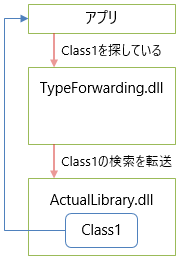
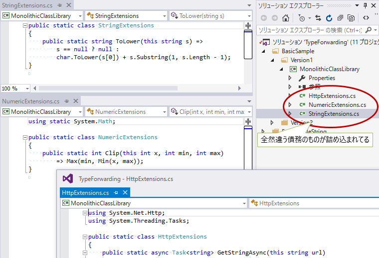
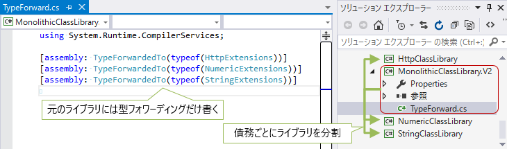
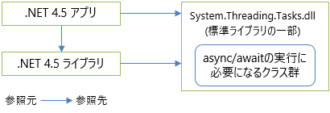
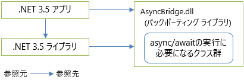
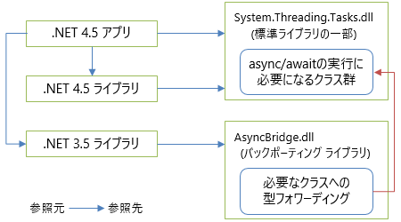

# 型フォワーディング

##  概要

.NETでは、「アセンブリ＋名前」の組み合わせで型の所在を検索します。
その結果、異なるアセンブリでまったく同じ名前の型を定義しても、それぞれ別の型として扱われます。
これは、人的ミスの削減や、悪意あるコードへの耐性につながる一方で、
型の定義場所を移動させたいときに困ります。

そこで.NETは、型の検索の際に、別のアセンブリに転送する仕組みを提供しています。
これを型フォワーディング(type forwarding: 型の転送)と呼びます。

##### サンプル

- [https://github.com/ufcpp/UfcppSample/tree/master/Chapters/Package/TypeForwarding](https://github.com/ufcpp/UfcppSample/tree/master/Chapters/Package/TypeForwarding)

##  TypeForwardedTo属性

型フォワーディングには、`TypeForwardedTo`属性(`System.Runtime.CompilerServices`)というものを使います。

例えば、ActualLibraryという名前のライブラリがあって、この中に以下のようなクラスが定義されているとします。

<pre class="source" title="ActualLibrary中">
<code><reserved>public class Class1
{
    public string Name =&gt; GetType().Assembly.GetName().Name + " / " + nameof(Class1);
}
</code></pre>

このActualLibraryを参照して、以下のような.csファイルを含む、TypeForwardingLibraryという名前のライブラリを作ります。

<pre class="source" title="">
<code><reserved>using System.Runtime.CompilerServices;

[assembly: TypeForwardedTo(typeof(Class1))]
</code></pre>

これで、アプリが「TypeForwardingLibraryにあるはずのClass1」を使おうとすると、
実際には「ActualLibraryで定義されたClass1」が返ってきます。

これで、例えば、「元々ライブラリAにあった型を、ライブラリBに移した」という場合でも、
Aに`TypeForwardedTo`属性を書いておけば、互換性を崩さずに型を移動できます。

で、型の転送ができて何が嬉しいかというと、主に2通りの用途が考えられます。

- モジュール分割
- バックポーティング

 

<!-- original-page-break -->

##  モジュール分割

- [サンプル](https://github.com/ufcpp/UfcppSample/tree/master/Chapters/Package/TypeForwarding/VersioningSamples)

ありがちな技術的負債の1つに、単一のライブラリに債務を詰め込み過ぎるというのがあります。

取り急ぎ開発を進めていると、クラスの置き場に困ってついつい1つのライブラリになんでもかんでも置いてしまうということがあります。
そして、後から振り返ると、別々のライブラリに分けたくなったりします。

例えば、以下の様な状態です。

「よく使う処理を拡張メソッドにして、ライブラリ化しよう」と試みて、気がつけば、文字列関連、ネットワーク関連、数値処理関連など、全然違う債務を1箇所に詰め込み過ぎてしまっています。
こういう状態を「一枚岩」(monolithic)であると言います。

そして、このライブラリの利用者が増えてきた頃に、「文字列関連だけが使いたい」「ネットワーク関連だけが使いたい」など、個別の要求が出てきます。

反省して複数のライブラリに分割することになったとして、問題は既存のユーザーです。
「アセンブリ＋名前」で型を探すわけで、別ライブラリに移動してしまうと互換性を崩します。

そこで、型フォワーディングの出番です。
詰め込み過ぎたライブラリを別のライブラリに分割した上で、元のライブラリには`TypeForwardedTo`属性だけを書きます。

これで、互換性は崩さずに型を移動できます。

修正後のように、債務ごとに綺麗に分かれた状態を「モジュール型」(modular)と言います。
一枚岩な状態は、依存関係が大きくなりすぎたり、部分的な更新ができなかったりといった問題を抱えることになるので、
モジュール型な状態を保つよう心がけるべきです。

###  余談: 逆のやり方

ちなみに、`TypeForwardedTo`属性を付けるのを逆にすることもできます。

上記の例で言うと、

- 将来的にライブラリを StringClassLibrary, HttpClassLibrary, NumericClassLibrary の3つに分けることに決まった
- が、今は分けてる余裕ない。MonolithicClassLibraryは今のままで維持したい
- なので、新しく作ったStringClassLibrary, HttpClassLibrary, NumericClassLibrary の側に`TypeForwardedTo`属性をつけて、MonolithicClassLibraryに型を転送する

というやり方もできます。

内部的には一枚岩のままなので、根本的には問題解決しません(依存関係は大きいままだし、部分更新できない)が、
「将来こう分割するよ」という予告にはなります。

###  余談: .NET 標準ライブラリのモジュール化

「初期段階で一枚岩に作ってしまって、後からモジュール分割」という流れ、
.NET Frameworkの標準ライブラリが典型例だったりします。

.NET Framework 4までは、標準ライブラリ中のクラスの大半がmscorlib.dllというアセンブリに詰め込まれていました。
それが、.NET Framework 4.5で、System.Net.dll, System.Threading.dll, System.Linq.dll… など、債務ごとに分割されました。

ちなみに、方法としては前節の「[逆のやり方](#transpose)」でやっています。
mscorlib.dll自体は元のままで、モジュール分割した側のアセンブリに`TypeForwardedTo`属性が入っています。

一方で、2015年に、Windowsデスクトップ向けの.NET Frameworkとは別に、
クロスプラットフォーム向けの「.NET Core」というバージョンの別実装が出てきました。

- [.NET Core Runtime (CoreCLR)](https://github.com/dotnet/coreclr)
- [.NET Core Libraries (CoreFX)](https://github.com/dotnet/corefx)

こっちのバージョンでは、最初からモジュール分割済みの実装が行われています。

 
<!-- original-page-break -->
 

##  バックポーティング

- [サンプル](https://github.com/ufcpp/UfcppSample/tree/master/Chapters/Package/TypeForwarding/FormattableString)

[C#の言語バージョンと.NET Frameworkバージョン](../cheatsheet/listfxlangversion.md)で書いていますが、
C#の新しめの機能を、古いバージョンの.NET上で動かすためには、
いくつかライブラリのバックポーティング(新しいバージョンで追加された機能を、古いバージョンに向けて移植する作業)が必要なものがあります。

ここで問題になるのが、バージョンの混在です。

C# 5.0の[async/await](../async/sp5_async.md)を例にとって話しましょう。
まず、以下のように、.NET 4.5で完結している場合にはそもそもバックポーティングが必要なく、何の問題もありません。

一方で、例えばAsyncBridgeという名前でバックポーティング用のライブラリを用意したとします。
これを使う場合でも.NET 3.5で完結するなら、以下のように特に問題は置きません。

問題は、.NET 4.5向けライブラリと.NET 3.5向けライブラリの混在です。
.NET 4.5向けのものは標準ライブラリ(System.Threading.Tasks.dll)の`Task`クラスを参照し、
.NET 3.5向けのものはバックポーティング(AsyncBridge.dll)の`Task`クラスを参照している状態になります。
同名の別実装があると、どちらを参照すればいいのかわからなくなって色々と問題を起こします
(回避方法もなくはないものの、基本的にはコンパイルできなくなります)。

この問題の解決にも型フォワーディングが使えます。
以下のように、標準ライブラリへの型フォワーディングを書いたAsyncBridge.dllを用意します。

つまり、以下のような実装が必要になります。

- .NET 3.5向けに、標準ライブラリをバックポーティング実装を書いた AsyncBridge.dll を作る
  - .NET 3.5アプリからはこれを参照する
- .NET 4.5向けに、標準ライブラリへの型フォワーディングを書いた AsyncBridge.dll を作る
  - .NET 4.5アプリからはこれを参照する

ちなみに、[サンプル](https://github.com/ufcpp/UfcppSample/tree/master/Chapters/Package/TypeForwarding/FormattableString)では、async/awaitではなく、もっと実装が簡単な[FormatableString](../start/st_string.md#FormatableString)の実装例を書いています。
