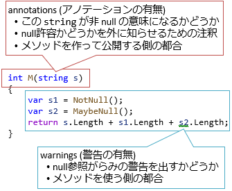

# null 許容参照型

## <a id="sec-generated-title-1"></a> <a id="abstract"></a>概要

<h5 class="version version8">Ver. 8.0</h5>

C# くらいの世代(1990年代後半～2000年代前半)のプログラミング言語では、
[参照型](oo_reference.md#reftype)には [null](oo_reference.md#null) が「つきもの」で、不可避なものでした。
(参考: 「[null参照問題](https://www.buildinsider.net/column/iwanaga-nobuyuki/011)」。)

ただ、2010年代ともなると、「つきもの」として惰性で null を認めるのはよくないとされています。
C# でも、少なくとも「意図して null を使っているかどうか」を区別できる必要性が生まれました。

そこで C# 8.0 では、以下のような機能を提供することにしました。

- 参照型でも単に型 `T` と書くと null を認めない型になる
- `T?` と書くと null を代入できる型になる

C# 7.X の頃と 8.0 で何が変わったかというと、
「参照型でも null を拒否できるようになった」ということになります。
ただ、「`T?` と書いたときに null 許容」という方式なのと、値型との対比として、
この機能は<strong id="key-nrt" class="keyword">null許容参照型</strong>(nullable reference type)と呼びます(略してNRTと言うことも)。

構文的には C# 2.0 からあった[null許容値型](sp2_nullable.md)と極力そろうように作られています。

ただ、後入りな機能なので、以下のような制約が掛かります。

- opt-in (オプションを明示しないと有効にならない)方式
  - `T` の意味が変わるので、opt-in にしないと既存のコードがコンパイルできなくなる
- 警告のみ
  - `T` 型の変数に null を代入しても警告だけで、エラーにはならない
- 値型と参照型で、`T?` の挙動が違う
  - 参照型の `T` と `T?` はアノテーション<sup>※</sup>だけの差で、内部的には差がない
  - 値型の場合は `T?` と書くと実体は `Nullable<T>` という `T` と明確に異なる型になる
  - 特に、[ジェネリクス](../oop/sp2_generics.md)を使うときに困る

<sup>※</sup> annotation。「単なる注釈」という意味で、この場合は「コンパイラーがソースコード解析するために使うヒントとなる情報」くらいの意味合い。

## <a id="sec-generated-title-2"></a> <a id="opt-in"></a>null許容参照型の有効化

無条件に「参照型でも null を拒否する」としてしまうと、既存の C# コードの挙動を壊します。

```csharp
using System;
 
class Program
{
    static void Main()
    {
        // NRT を opt-in した時点で警告が出るようになる
        string s = null; // string (非 null)に null を入れちゃダメ
        Console.WriteLine(s.Length); // null の可能性があるものを null チェックせずに使っちゃダメ
    }
}
```

警告だから追加してもいいということにはなりません。
警告を残すのは作法的によくないことですし、
なので、C# には[「警告をすべてエラー扱いする」というオプション](https://docs.microsoft.com/ja-jp/dotnet/csharp/language-reference/compiler-options/warnaserror-compiler-option)もあります。
警告の追加も破壊的変更の一種になります。

C# は「既存のソースコードがコンパイルできなくなる」というのをかなり慎重に避けている言語なので、null許容参照型は無条件に入れられる機能ではありません。
そのため、明示的な有効化(opt-in)が必要になります。

有効化された状態かどうかを指して、<strong id="nullable-context" class="keyword">null 許容コンテキスト</strong>(nullable context)と言います。
(有効・無効を切り替えることを「null 許容コンテキストの切り替え」とか言ったりします。)

null 許容コンテキストの切り替え方は2通りあります。

- ソースコード中の行単位での切り替え … `#nullable` ディレクティブ
- プロジェクト全体での切り替え … `Nullable` オプション

また、単純な有効・無効以外に、後述する warnings/annotations (それぞれ警告のみ、アノテーションのみの有効・無効化)というモードもあります。

ちなみに、C# は本来、オプションでのオン/オフ切り替えなど、
「文法の分岐」に対してもかなり消極的な言語です。
opt-in 方式で `T` の意味が変わるnull許容参照型もだいぶ悩んだ末の苦渋の決断で、
それだけnull参照問題が深刻だということです。
おそらく、C# 史上最初で最後の大きな「分岐」になると思われます。

### <a id="sec-generated-title-3"></a> <a id="nullable-directive"></a>#nullable ディレクティブ

それなりの規模のソースコードを保守している場合、いきなりnull許容参照型を全面的に有効化してしまうと結構大変なことになります。
(筆者の経験的な話で言うと、少なくとも50行に1個くらいは警告が出ます。何万行ものソースコードを持っている場合、とてもじゃないけど直して回れるものではありません。)

そのため、[プリプロセッサー](../misc/sp_preprocess.md)的に、書いたその行以降の opt-in/opt-out をする `#nullable` ディレクティブが用意されています。
([`#pragma warning`](../misc/sp_preprocess.md#pragma)と似たような使い方をします。)

以下のような書き方をします。

```csharp
#nullable enable|disable|restore [warnings|annotations]
```

null 許容参照型を有効にしたければ`#nullable enable`、
無効にしたければ`#nullable disable`と書きます。
`#nullable restore`は「1つ前のコンテキストに戻す」という処理になります。
`warnings`と`annotations`については後述しますが、省略可能で、省略した場合は「両方をオン・オフ」になります。

```csharp
public class Program
{
    static void Main()
    {
#nullable enable
        E1(null); // 警告が出る
 
#nullable disable
        E1(null); // 警告が出ない
    }
 
#nullable enable
    // 有効化したのでここでは string で非 null、string? で null 許容。
    static int E1(string s) => s.Length;
    static int? E2(string? s) => s?.Length;
 
#nullable disable
    // 無効化したので string に null が入っている可能性あり。
    // string? とは書けない(書くだけで警告になる)。
    static int D1(string s) => s.Length;
 
#nullable restore
    // 1つ前のコンテキストに戻す。
    // この場合、disable から enable に戻る。
    static int? R1(string? s) => s?.Length;
}
```

### <a id="sec-generated-title-4"></a> <a id="nullable-option"></a>Nullable オプション

一方で、これから新規に作成するプログラムの場合、最初から全部null許容参照型を有効化してしまう方がいいでしょう。
そのくらい、null参照問題は避けたいものです。

プロジェクト全体で null 許容コンテキストを切り替えるには、コンパイラー オプションを指定します。
`csc` (C# コンパイラー)コマンドを直接使う場合は `/nullable` オプションで指定します。

```console
csc source.cs /nullable:enable /langversion:8
```

csproj (C# プロジェクト)ファイル中でオプション指定する場合、`<Nullable>` タグを使います。

```xml
<Project Sdk="Microsoft.NET.Sdk">
 
  <PropertyGroup>
    <OutputType>Exe</OutputType>
    <TargetFramework>netcoreapp3.0</TargetFramework>
    <Nullable>enable</Nullable>
  </PropertyGroup>
 
</Project>
```

指定できる値は `enable`(有効)、`disable` (無効)、`warnings` (警告のみ有効)、`annotations` (アノテーションのみ有効)の4種類です。
`warnings` と `annotations` については次節で説明します。

### <a id="sec-generated-title-5"></a> <a id="nullable-directive"></a>warnings/annotations

null 許容参照型には以下の2つの側面があります。

- アノテーション: 型に `?` を付けて null 許容か非 null かを明示する
- 警告: アノテーションを見て、適切な null チェックが行われてるかどうかを調べて警告を出す



既存コードを null 許容参照型に段階的に対応させていくにあたって、
これら2つは別々に有効化・無効化できます。
以下のような状況を想定しています。

- 差し当たってアノテーションだけは付けたいけど、中身の警告を全部消す作業まで手が回らない
- 差し当たって警告は出してほしいけど、自分が公開している API にまでは責任を持てないのでアノテーションは付けたくない

アノテーションを付けるかどうかだけを切り替えるのが `annotations` で、
警告の有無だけを切り替えるのが `warnings` です。

例えば、元々以下のようなコードがあったとします。

```xml
string NotNull() => "";
string MaybeNull() => null;
 
int M(string s)
{
    var s1 = NotNull();
    var s2 = MaybeNull();
    return s.Length + s1.Length + s2.Length;
}
```

これに対して、単に `#nullable enable` を付けるとアノテーションも警告も有効になります。

```xml
#nullable enable
string NotNull() => "";
string? MaybeNull() => null; // 戻りに ? を追加
 
int M(string s) // この s は非 null の意味になる
{
    var s1 = NotNull();
    var s2 = MaybeNull();
    return s.Length + s1.Length + s2.Length; // s2 のところに警告が出る
}
```

`#nullable enable warnings` とすると警告のみ有効化できます。
この場合、引数の `string` は「C# 7.3 以前と同じ扱い」で、null 許容かどうか「未指定」になります。

```xml
// 警告のみ有効化
#nullable enable warnings
int M(string s) // この s は null 許容かどうか「未指定」
{
    var s1 = NotNull();
    var s2 = MaybeNull();
    return s.Length + s1.Length + s2.Length; // s2 のところに警告が出る
}
```

一方、`#nullable enable annotations` とするとアノテーションのみが有効化されます。
null のチェック漏れがあっても警告は出ない状態です。

```xml
// アノテーションのみ有効化
#nullable enable annotations
int M(string s) // この s は非 null
{
    var s1 = NotNull();
    var s2 = MaybeNull();
    return s.Length + s1.Length + s2.Length; // 警告は出ない
}
```

## <a id="sec-generated-title-6"></a> <a id="flow-analysis"></a>フロー解析

null 許容参照型は、フロー解析(flow analysis)で成り立っています。
フロー解析というのは、コードの流れ(flow)を追って、
「使っている場所より前で正しく代入・チェックが行われるか」を C# コンパイラーが調べるものです。

例えば以下のように、変数 `s` に何を代入したかによって、それ以降、`s.Length` というようなメンバー アクセス時に警告が出たり出なかったりします。

```csharp
// null 許容で宣言されていても、
string? s;
 
// ちゃんと有効な値を代入すれば
s = "abc";
 
// 警告は出なくなる。
Console.WriteLine(s.Length);
 
// 逆に null を代入すると、
s = null;
 
// それ以降警告が出る。
Console.WriteLine(s.Length);
```

分岐などもきっちり調べられます。

```csharp
private static void M(bool flag)
{
    string? s;
 
    // 分岐の1つでも null があれば、その後ろでは警告が出る。
    if (flag) s = "abc";
    else s = null;
 
    Console.WriteLine(s.Length);
 
    // 分岐の全部で非 null なら、その後ろでは警告が出ない。
    if (flag) s = "abc";
    else s = "123";
 
    Console.WriteLine(s.Length);
}
```

非 null (`?` が付いていない)変数・引数には null を渡した時点で警告が出て、
null 許容(`?` が付いてる)変数・引数の場合はメンバー アクセスの時点で警告が出ます。
また、null 代入の有無の他、`is null` や `== null` での null チェックをすれば、それ以降の警告は消えます。

```csharp
using System;
 
public class Program
{
#nullable enable
    // enable なコンテキストでは、string と書くと非 null、string? と書くと null 許容。
    string NotNull(string s) => s;
    string? MaybeNull(string? s) => s;
 
    void M()
    {
        // 非 null。
        var n = NotNull(null); // 引数に null を渡した時点で警告。
        Console.WriteLine(n.Length);
 
        // null 許容。
        var m = MaybeNull(null);
        Console.WriteLine(m.Length); // 戻り値の null チェックをしなかった時点で警告。
 
        if (m is null) return;
        Console.WriteLine(m.Length); // 前の行で null チェックしたのでもう警告にならない。
    }
}
```

ちなみに、一度何らかのメンバー アクセスをした時点で「null チェックした」扱いを受けます。
「null 許容型を null チェックなしで使ってる」警告が出るのは最初の1個だけになります。

```csharp
#nullable enable
void M(string? x)
{
    // null チェックせずに使ったので警告。
    Console.WriteLine(x[0]);
 
    // ただ、2重には警告がでない。警告が出るのは↑の行だけ。
    Console.WriteLine(x.Length);
}
```

他の変数との比較でも null チェックになることがあります。
例えば以下のように、非 null な変数 `x` と一致したら null 許容な変数 `y` も null ではないことが確定します。
これもちゃんとフロー解析の対象になっています。

```csharp
void M(string x, string? y)
{
    // 非 null な x との比較で y が null じゃないことがわかる。
    if (x == y)
    {
        // こっちは y が非 null なことがわかるので警告が出ない。
        Console.WriteLine(y.Length);
    }
    else
    {
        // こっちは null な可能性が残るので警告が出る。
        Console.WriteLine(y.Length);
    }
}
```

#### <a id="sec-generated-title-7"></a>注意: 別スレッドでの書き換え

フィールドやプロパティに対するフロー解析では、利便性を優先して、シングルスレッド動作を前提としたフロー解析をしています。
例えば、以下のように、マルチスレッド動作をしていて、他のスレッドで書き換えられてしまうと、本来 null が来るはずがなく警告も出ない場面で null 参照例外が起こることがあります。

```csharp
using System;
using System.Threading;
using System.Threading.Tasks;
 
#nullable enable
 
class Program
{
    public string? S;
 
    public void SetNull()
    {
        S = null;
    }
 
    public void SetNonNull()
    {
        if (S is null) S = "";
 
        Thread.Sleep(200);
 
        // 警告はでない。 S = "" しているので非 null 扱い。
        // 単一スレッド実行の場合はおかしくはない。
        // でも、Sleep 中に SetNull を呼ばれると null 参照例外になる。
        Console.WriteLine(S.Length);
    }
 
    static void Main()
    {
        var p = new Program();
        Task.Run(p.SetNonNull);
        Thread.Sleep(100);
        Task.Run(p.SetNull);
 
        Thread.Sleep(300);
    }
}
```

### <a id="sec-generated-title-8"></a> <a id="initialize-field"></a>フィールドやプロパティの初期化

非 null 型のフィールドやプロパティは、コンストラクター内で必ず初期化しなければなりません。
例えば以下のコードはフィールド `X`、プロパティ `Y` のところに警告が出ます。

```csharp
class A
{
    public string X;
    public string Y { get; set; }
}
```

以下のように、コンストラクターを追加すれば警告が消えます。

```csharp
class A
{
    public string X;
    public string Y { get; set; }
    public A(string x, string y) => (X, Y) = (x, y);
}
```

ちなみに、コンストラクターは書いたものの初期化を忘れると、
フィールド・プロパティの方だけではなく、コンストラクターの方にも警告が出ます。

```csharp
class A
{
    public string X;
 
    // X を初期化していないのでコンストラクターにも警告が出る
    public A() { }
}
```

ちなみに、最終的には非 null になるものの、コンストラクターの時点ではどうしても一時的に null を入れておかないといけない場面というものもあったりします。
そういうときの回避策として、後述する [`!` 演算子](#null-forgiving)というものもあります。

```csharp
class A
{
    // 一時的に null になってしまうことを強制的に容認
    public string X = null!;
}
```

### <a id="sec-generated-title-9"></a> <a id="oblivious"></a>oblivious

opt-in にしたので、null 許容(nullable)、非 null (non-nullable, not null)の他に、
「アノテーションが付いていない、未指定」という状態があり得ます。
この未指定状態を oblivious (忘れてる、気づかない)と呼びます。

要するに、C# 7.3 以前で書かれたコードや、`#nullable enable annotations`になっていない場所で書かれたコードの型が oblivious です。
oblivious な型の変数は一切フロー解析の対象になりません。

```csharp
using System;
 
public class Program
{
#nullable disable
    // C# 7.3 以前でコンパイルされたものや、disable なコンテキストで定義されると
    // アノテーション「未指定」(oblivious)という扱いになる。
    string Oblivious(string s) => s;
 
#nullable enable
    void M()
    {
        // 未指定。
        // null チェックの対象にならない(警告出ない)。
        var o = Oblivious(null);
        Console.WriteLine(o.Length);
 
        // たとえ明示的な型で受けても、もうこの変数は oblivious 扱いでチェック対象にならない(警告出ない)。
        string? o1 = Oblivious(null);
        Console.WriteLine(o1.Length);
    }
}
```

### <a id="sec-generated-title-10"></a> <a id="nvt-defference"></a>null 許容値型との違い

null 許容<em>参照</em>型は、
`?` を使う文法こそ[null 許容<em>値</em>型](sp2_nullable.md)と同じですが、
内部的にはだいぶ違う実装になっています。
null 許容参照型の `?` は単なるアノテーション(フロー解析のためのヒント)で、実装上、`T`と`T?`が本質的には同じ型です。
一方で、null 許容値型の `?` は明確に別の型になります(`T?` と書くと`Nullable<T>`型になります)。

この実装上の差から、使い勝手にも差が出てきます。
まず、以下のように、`T` と `T?` でオーバーロードできるのは値型だけです。

```csharp
#nullable enable
// 参照型の場合、アノテーションだけが違うオーバーロードは作れない。
void M(string x) { }
void M(string? x) { }
 
// 値型の場合、? が付くと別の型なのでオーバーロードできる。
void M(int x) { }
void M(int? x) { }
```

また、null チェック後の挙動が違います。
参照型の場合は null チェックさえ挟めば以後「null ではない」という扱いを受けますが、
値型の場合は null チェックを挟んでも `Nullable<T>` は `Nullable<T>` のままです。

```csharp
#nullable enable
// 参照型の場合
void M(string? x)
{
    // null チェックさえすれば
    if (x is null) return;
    // 警告が消える。
    Console.WriteLine(x.Length);
}
 
// 値型の場合
void M(DateTime? x)
{
    // null チェックしても
    if (x is null) return;
    // こういう書き方はできない(x?.Minute や x.Value.Minute なら大丈夫)。
    Console.WriteLine(x.Minute);
}
```

null 許容参照型は `typeof` 演算子に対しても使えません。
`T` と `T?` が内部的には同じ型なのに、`typeof(T?)` を認めると混乱の元です。
以下のコードはコンパイル エラーになります。

```csharp
var t = typeof(string?);
```


<!-- original-page-break -->


## <a id="sec-generated-title-11"></a> <a id="compile"></a>アノテーションのコンパイル結果

null 許容参照型のアノテーションのコンパイル結果は、
`NullableContext`と`Nullable` という2つの属性(いずれも`System.Runtime.CompilerServices`名前空間)を使って表現されます。

2つの属性を使い分けるのはプログラムのサイズを小さくするためです。
属性は付けば付くだけ少しずつプログラムを大きくするため、ちょっとでも付く量を減らす工夫をしています。
例えば以下のようなメソッドを考えます。
引数が4つあって、非nullとnull許容がそれぞれ2つずつになっています。

```csharp
public void M(string a, string? b, string c, string? d) { }
```

初期の案では `Nullable` 属性だけを使って、以下のようにコンパイルする予定でした。

```csharp
public void M([Nullable(1)]string a, [Nullable(2)]string b, [Nullable(1)]string c, [Nullable(2)]string d) { }
```

これだとすべての引数に属性が付くことになります。
その後、少しでも属性の数を減らすために、`NullableContext` 属性が追加され、
以下のようにコンパイルされる仕様になりました。

```csharp
[NullableContext(1)]
public void M(string a, [Nullable(2)]string b, string c, [Nullable(2)]string d) { }
```

`NullableContext` は、クラス内やメソッド内で、`Nullable` 属性が付いていない引数・戻り値をどう扱うかを示しています。
(前述の「[null 許容コンテキスト](#nullable-context)」とは微妙に違う意味で context (文脈)という単語を使ってしまっていますが、
まあどちらも「前後のコードの意味を変える」という意味で「文脈」です。)

この例でいうと、「メソッドに1と付いているので、引数 `a`、`c` は1扱い」ということになります。
メソッドに対する属性が1個増えた代わりに、引数に対する属性が2個減って、全体では属性の数が減りました。

ちなみに、属性の引数になっている1とか2とかの数値は以下の意味になります。
(`Nullable`も`NullableContext`も付いていない場合は0、すなわち oblivious 扱いになります。)

| 値 | 意味 |
| --- | --- |
| 0 | oblivious |
| 1 | 非 null |
| 2 | null 許容 |

属性は、総数が極力少なくなるように付きます。
例えば以下のような2つのメソッドを考えます。

```csharp
class A
{
    // 非 null が2個、null 許容が1個
    public void M1(string a, string b, string? c) { }
 
    // 非 null が1個、null 許容が2個
    public void M2(string a, string? b, string? c) { }
}
```

これは、以下のようなコードにコンパイルされます。
要するに、多い方が「context」になることで、属性が必要な引数が減ります。

```csharp
class A
{
    // 非 null が多いので NullableContext(1)
    [NullableContext(1)]
    public void M1(string a, string b, [Nullable(2)] string c) { }
 
    // null 許容が多いので NullableContext(2)
    [NullableContext(2)]
    public void M2([Nullable(1)] string a, string b, string c) { }
}
```

(ちなみに、数が同じ場合は2よりも1を、1よりも0を優先するようです。)

型自体に `NullableContext` が付く例も見てみましょう。
以下のような2つの型を考えます。

```csharp
class A
{
    public void M1(string a) { }
    public void M2(string? a) { }
 
    // 非 null なメソッドが多い
    public void N1(string a, string b) { }
    public void N2(string a, string b) { }
    public void N3(string a, string b) { }
}
 
class B
{
    // M1, M2 は A と同じ
    public void M1(string a) { }
    public void M2(string? a) { }
 
    // null 許容なメソッドが多い
    public void N1(string? a, string? b) { }
    public void N2(string? a, string? b) { }
    public void N3(string? a, string? b) { }
}
```

この場合、メソッドに付く属性が減るように、クラスに `NullableContext` 属性が付きます。
以下のようなコンパイル結果になります。

```csharp
[NullableContext(1)]
class A
{
    public void M1(string a) { }
    [NullableContext(2)]
    public void M2(string a) { }
 
    public void N1(string a, string b) { }
    public void N2(string a, string b) { }
    public void N3(string a, string b) { }
}
 
[NullableContext(2)]
class B
{
    [NullableContext(1)]
    public void M1(string a) { }
    public void M2(string a) { }
 
    public void N1(string a, string b) { }
    public void N2(string a, string b) { }
    public void N3(string a, string b) { }
}
```

### <a id="sec-generated-title-12"></a> <a id="generic-annotation"></a>型引数に対するアノテーション

[ジェネリクス](../oop/sp2_generics.md)が絡むともう少し複雑になります。
[`dynamic`型の場合](../dynamic/sp4_callsite.md#DynamicAttribute)と同じなんですが、
`Nullable`属性の引数が配列になります。
例えば以下のようなメソッドを考えます。

```csharp
public void M(
    Dictionary<string, string?> a,
    Dictionary<string, string?>? b,
    (string, string, string?) c
    ) { }
```

`Dictionary`型やタプルの型引数1個1個で null 許容性が違います。
また、「`Dictionary` 自体」と「`Dictionary` の型引数」でも null 許容性が違っています。
こういう場合には、以下のような属性が付きます。

```csharp
public void M(
    [Nullable(new byte[] { 1, 1, 2 })]
    Dictionary<string, string?> a,
    [Nullable(new byte[] { 2, 1, 2 })]
    Dictionary<string, string?>? b,
    [Nullable(new byte[] { 0, 1, 1, 2 })]
    (string, string, string?) c
    ) { }
```

配列の最初の要素が型自体で、2個目以降が型引数の null 許容性を表しています。

ちなみに、この他いくつか細かい条件を上げると以下のようなものがあります
(公式ドキュメント: [Nullable Metadata](https://github.com/dotnet/roslyn/blob/master/docs/features/nullable-metadata.md))。

- 非ジェネリックな値型には属性は付けない
- ジェネリックな値型の場合、0 に続けて型引数の値を並べる
- 型引数が値型のところはスキップ
- 配列中のすべて要素が同じ値のとき、配列ではなく1要素に置き換える
- タプルには元となる`ValueTuple`構造体に準じた属性を付ける

### <a id="sec-generated-title-13"></a> <a id="reflection"></a>Nullable 属性とリフレクション

これで、プログラムのサイズはだいぶ小さくなっています。
しかし、すでに察している人もいるかもしれませんが、
その分、[リフレクション](../dynamic/sp_reflection.md)で null 許容かどうかを取るのがだいぶ面倒になります。

例えば、前述のクラス `A`、`B` のメソッド `M1` の引数を調べたい場合を考えます。
(`M1` に関連する部分を抜粋して再掲します。)

```csharp
[NullableContext(1)]
class A
{
    public void M1(string a) { }
}
 
[NullableContext(2)]
class B
{
    [NullableContext(1)]
    public void M1(string a) { }
}
```

ここで、引数 `a` が null 許容かどうか調べようとするとき、

- どちらも引数 `a` 自体には属性が付いていない
- メソッドには `B` の `M1` にだけ属性が付いている
- `A` の場合は型までたどらないと引数 `a` の null 許容性がわからない

ということになります。


<!-- original-page-break -->


## <a id="sec-generated-title-14"></a> <a id="null-forgiving"></a>! 演算子

null 許容なものを、`is null` や `== null` などによるチェック抜きで、
強制的に非 null 扱いしたい場合があります。
原因としては2つあって、以下のような場面で「強制非 null 扱い」が必要になります。

- コンストラクターの時点では非 null 保証が絶対にできない(後からの初期化が必須になる)場合がある
- フロー解析の未熟さからコンパイラーが判定しきれない場合がある

前者のわかりやすい例は循環参照がある場合です。
お互いにインスタンスを持ち合う必要がある場面では、どちらか片方は絶対にコンストラクターよりも後でないとインスタンスを渡せません。

```csharp
class PairedNode
{
    // このプロパティに対する警告が消せない。
    public PairedNode Pairing { get; private set; }
 
    public static (PairedNode a, PairedNode b) Create()
    {
        var a = new PairedNode();
 
        // 後から作る方は new の時点でインスタンスを受け取れる。
        // なのでやろうと思えばコンストラクターにも渡せる。
        var b = new PairedNode { Pairing = a };
 
        // でも、先に作った方にはどうしても後からの指しなおしが必要。
        a.Pairing = b;
 
        return (a, b);
    }
}
```

後者の例は、例えば `ReferenceEquals` とかです。
null に関するフロー解析は結構ぎりぎりまで作業をしているようで、
`ReferenceEquals` に関する解析は Visual Studio 16.3 Preview 1 (2019年7月)時点では未対応、
Preview 2 (同8月) 時点で初めて対応しました。

```csharp
void M(string x, string? y)
{
    if (ReferenceEquals(x, y))
    {
        // x == y なら警告が消えるのに、ReferenceEquals だと残ってた。
        // 16.3 Preview 1 の時点では警告あり、Preview 2 から消える。
        Console.WriteLine(y.Length);
    }
}
```

この例はまだ需要もあって対処も楽な類なので対応されましたが、
もっとレアだったり、対処にコストがかかりすぎる場合は対応してもらえない可能性が高いです。

要するに、null がらみのフロー解析には無理なもの・やっても割に合わないものがざらにあるので、
フロー解析をあえて抑止するような手段が必要になります。

そこで用意されているのが後置き `!` 演算子です。
`a!` というように、式の後ろに `!` を付けると、式 `a` の null 許容性は無視して常に非 null 扱いになります。

```csharp
#nullable enable
using System;
 
class PairedNode
{
    // null を無理やり非 null 扱いにして警告を消す。
    // (省略したものの前述の) Create の中で自己責任で非 null を保証してるので大丈夫。
    public PairedNode Pairing { get; private set; } = null!;
}
class Program
{
    void M(string x, string? y)
    {
        if (ReferenceEquals(x, y))
        {
            // string? だけども気にせずメンバー アクセスする。
            // コンパイラーにはわからないかもしれないけども、人間はこの時点で y が非 null なことを知っている。
            Console.WriteLine(y!.Length);
        }
    }
}
```

この `!` 演算子は null forgiving (null に寛大)演算子とか、
null suppression (null 抑止) 演算子などと呼ばれています。
コンパイラーが厳しく(ただ、過剰に)チェックしてくれているものを、あえて緩めておおらかにコードを書く「回避策」的なものなのでこんな呼び名になっています。

(ただ、最近、C# のドキュメントは結構ぎりぎりになるまで正式な用語決定をしないので、
この呼称も最後までこのままかどうかはわかりません。「通称」になる可能性あり。)

ちなみに、`!` 演算子は英語で口頭だと bang operator とか言ったりもするみたいです。
(bang は破裂音の擬音語。「バンと音を立ててびっくりさせる」から、ビックリマークのことを bang と読んだりするそうです。)

(他のプログラミング言語では、「(コンパイラーには無理な) null 判定をプログラマーが明示する」という意味で not-null assertion (非 null 表明)と言ったり、
「強制的に非 null にしてしまう」という意味で force unwrap (強制アンラップ)と言ったりします。)

`!` 演算子を使うと本当に自己責任になります。
フロー解析の対象から外れて、`NullReferenceException` を起こす可能性が出てきます。
また、`!` を書いた地点には特に何も実行時チェックが入りません。
実際に `NullReferenceException` を起こすのはメンバー アクセスした瞬間です。
問題の真の原因と、例外が発生する場所がずれるので注意が必要です。

```csharp
#nullable enable
using System;
 
class Program
{
    static void Main()
    {
        // 悪用して、本当に null を渡してはいけないところに null を渡す。
        // この時点では例外が出ない。
        M(null!);
    }
 
    static void M(string x)
    {
        // 実際に NullReferenceException を起こすのは以下の行。
        Console.WriteLine(x.Length);
    }
}
```

ちなみに、2重に `!` を付けようとするとコンパイル エラーになります。
例えば以下のコードは`x!!` のところでコンパイル エラーが出ます。

```csharp
static void M(string? x)
{
    var y = x!!;
}
```

## <a id="sec-generated-title-15"></a> <a id="type-constraints"></a>ジェネリクス

[前述の通り](#nvt-defference)、
null 許容型の `T?` は参照型と値型でだいぶ実装方法が違います。
これで特に問題になるのは[ジェネリクス](../oop/sp2_generics.md)です。
型引数には参照型が渡される場合も値型が渡される場合もあって、
そういうときに `T?` の扱いに困ります。

扱いに困るというか、C# 8.0 では制約なしでは `T?` とは書けませんでした。
以下のコードはコンパイル エラーになります。
(後述しますが、C# 9.0 でもこの書き方には注意が必要です。)

```csharp
#nullable enable
class Generic<T>
{
    // T? と書くと C# 8.0 ではコンパイル エラー。
    public T? M() => default;
}
```

一方、`struct` 制約や `class` 制約、基底クラス制約を付けると `T?` と書けるようになります。
`struct` 制約は [null 許容値型](sp2_nullable.md)の仕様によるもので、C# 2.0 の頃から書けます。
「制約に単に `class` と書くと非 null の意味になる」というのが新仕様になります。

```csharp
#nullable enable
using System;
 
// struct 制約を付けると null 許容"値型"を使えるようになる。
class StructConstraint<T> where T : struct
{
    public T? M() => default;
}
 
// class 制約は「非 null 参照型」の意味の制約になる。
// なので T? と書いて null 許容"参照"型を作れるようになる。
class ClassConstraint<T> where T : class
{
    public T? M() => null;
}
 
// 基底クラス制約も「非 null」扱い。
class BaseTypeConstarint<T> where T : Exception
{
    public T? M() => null;
}
 
class Program
{
    static void Main()
    {
        // class 制約を満たしてる。
        var x = new ClassConstraint<string>();
 
        // class 制約は「非 null」扱いなので以下のコードには警告あり。
        var y = new ClassConstraint<string?>();
    }
}
```

その代わり、`class`、基底クラス制約に `?` を付けることで null 許容参照型を受け付けることができます。

```csharp
#nullable enable
using System;
 
// class? 制約で「null 許容参照型」を表す。
class ClassConstraint<T> where T : class?
{
    // class? な型 T をさらに T? にはできず、コンパイル エラーになる。
    public T? M() => null;
}
 
// 基底クラス制約でも ? を使って null 許容にできる。
class BaseTypeConstarint<T> where T : Exception?
{
    // この行がコンパイル エラーになるのは class? 制約と同じ。
    public T? M() => null;
}
 
class Program
{
    static void Main()
    {
        // class? 制約なので特に警告なし。
        var y = new ClassConstraint<string?>();
    }
}
```

### <a id="sec-generated-title-16"></a> <a id="notnull"></a>notnull 制約

また、新たに `notnull` 制約というものが追加されて、
非 null 参照型もしくは非 null 値型のみを受け付けることができます。

```csharp
#nullable enable
 
class NotNullConstraint<T>
    where T : notnull
{
}
 
class Program
{
 
    static void Main()
    {
        // この2行は OK。
        var ok1 = new NotNullConstraint<int>();
        var ok2 = new NotNullConstraint<string>();
 
        // この2行には警告が出る。
        var ng1 = new NotNullConstraint<int?>();
        var ng2 = new NotNullConstraint<string?>();
    }
}
```

例えば、`Dictionary<TKey, TValue>` (`System.Collections.Generic`名前空間)のキーは元々 null を受け付けていません。`d[null] = 0` みたいな書き方をすると null 参照例外が発生します。
なので、.NET Core 3.0 の `Dictionary` の `TKey` には `notnull` 制約が付いています。
`new Dicitionary<int?, string>()` みたいに書くと警告が出るようになります。

ただ、C# 8.0 では `notnull` 制約を付けてもなお、`T?` とは書けません。
(参照型と値型での null 許容の仕様の差が大きすぎてちょっと難しいようです。
もし実現しようと思うなら、C# コンパイラーのレベルでは無理で、.NET ランタイムの型システム レベルでの改修が必要。)

```csharp
#nullable enable
 
class NotNullConstraint<T>
    where T : notnull
{
    // 以下の2行はコンパイル エラーになる。
    T? M() => null;
    int M(T? x) => x is null ? 0 : x.GetHashCode();
}
```

一応、[次節](#annotation-attributes)で説明する属性を使ってある程度の問題回避はできます。

```csharp
#nullable enable
using System.Diagnostics.CodeAnalysis;
 
class NotNullConstraint<T>
    where T : notnull
{
    // T? と書けないことに対する代替手段。
    [return: MaybeNull] public T M() => default!;
    public int M([AllowNull] T x) => x is null ? 0 : x.GetHashCode();
}
 
class Program
{
    static void Main()
    {
        var x = new NotNullConstraint<string>();
        string? nullable = x.M(); // string M() だけど null が返ってくる。
        x.M(null); // M(string) だけど null を渡せる。
    }
}
```

### <a id="sec-generated-title-17"></a> <a id="unconstrained-generics"></a>制約なしジェネリック型引数

<h5 class="version version9">Ver. 9</h5>

C# 9.0 で、制約なしのジェネリック型引数 `T` に対して `T?` と書けるようになりました。
ジェネリクスの話の冒頭で「C# 8.0 ではエラーになる」と説明した以下のコードが C# 9.0 では有効です。

```csharp
#nullable enable
class Generic<T>
{
    // C# 9.0 では一応 T? と書ける。
    public T? M() => default;
}
```

「一応」と言っているのは、この `T?` にはちょっと注意が必要だからです。
前述のとおり、`T?` は内部実装的に、値型(構造体など)と参照型(クラスなど)とで結構差があって、
その影響で素直に「nullable (null 許容)」と言えるものになっていません。

どちらかというと「defaultable ([規定値](rm_struct.md#default)になる可能性がある)」というべきで、
以下のように、`T?` であっても null にはならない(規定値の 0 になる)ことがあります。

```csharp
#nullable enable
 
using System;
 
// この2つに関しては default == null なので変なことにはならない。
Console.WriteLine(M<string?>()); // null
Console.WriteLine(M<string>()); // null
Console.WriteLine(M<int?>()); // null
 
// 問題が非 null 値型で、この場合 default != null なのでちょっと変。
Console.WriteLine(M<int>()); // 0
 
// ジェネリックな T? は nullable じゃなくて defaultable。
// default を渡しても警告にならない。 
static T? M<T>() => default;
```

これはちょっと罠になるので、検討当初は `T??` みたいな文法で「nullable」と「defaultable」を区別しようかという案も出ていました。
ただ、これはこれで、[`??` 演算子](rm_nullusage.md#null-coalesce)との区別が付かなくて困る場面があるということで断念されました。
他に新しい記号を導入するのも微妙で、結局、「`T?` で defaultable 扱い」という決定が下りました。

## <a id="sec-generated-title-18"></a> <a id="default-constraint"></a>default 制約

<h5 class="version version9">Ver. 9</h5>

[前節の制約なし型引数](#unconstrained-generics)のせいなんですが、
ちょっと限定的な状況でだけ必要となる制約として、`default` 制約というものも増えました。

`default` 制約が必要になるのは以下のような状況です。

```csharp
#nullable disable
 
// さかのぼること、null 許容参照型導入前にから以下のような書き方ができた。
class Csharp7
{
    // これは Nullable<T> の意味に。
    public T? M<T>(T? x) where T : struct => null;
 
    // T と Nullable<T> は別の型扱いなのでオーバーロード可能。
    public T M<T>(T x) => default;
}
 
#nullable enable
 
// ここで、null 許容参照型を有効化。
// 特に、C# 9.0 では制約なし型引数に対して T? と書けるようになったので…
class Base
{
    // これは Nullable<T> の意味に。
    public virtual T? M<T>(T? t) where T : struct => null;
 
    // これは C# 9.0 の制約なし型引数に対する null 許容(正確には default 許容)アノテーション。
    // T と Nullable<T> 違いのオーバーロードという扱いになる。
    public virtual T? M<T>(T? t) => default;
}
 
// さらに紛らわしいのが↑を override したときで…
class Derived : Base
{
    // これ、実は Nullable<T> の意味。
    // 親クラス側の where T : struct 制約を自動的に引き継いでしまう。
    // こうしないと C# 8.0 以前との整合性が取れないとのこと。
    public override T? M<T>(T? t) => null;
 
    // ということで、制約なし T? の方を参照するために別の制約が必要になったという経緯があり。
    // override 時に限り、where T : struct じゃない方に、逆に where T : default という制約を書く必要がある。
    public override T? M<T>(T? t) where T : default => default;
}
```

まとめると、

- 古いバージョンとの互換性のため、ジェネリック型引数に対して `T` と `T?` は別の型になっている
- 基底クラス側で `where T : struct` と書いているものは、派生クラスでは改めて `where T : struct` と書かなくてもいい仕様だった
- C# 9.0 で制約なし型引数に対しても `T?` と書けるようになったことで、派生クラス側の挙動が怪しくなった
- この問題を回避するため、派生クラス側には `where T : default` という制約を書く必要がある

という感じです。
前節で説明した通り、制約なしの型引数に対する `T?` は「null 許容」というよりは「default 許容」(defaultable)なので、`where T : default` というキーワードを用います。

<!-- original-page-break -->

## <a id="sec-generated-title-19"></a> <a id="annotation-attributes"></a>アノテーション属性

[前節](#type-constraints)のジェネリクスの問題を筆頭に、
いくつか、`T?` という記法だけでは解決できない問題があります。
ジェネリックな型でなくても例えば以下のような場合に、`?` の有無だけではフロー解析がうまく働きません。

- プロパティの get と set で null 許容性が違う場合がある
- [参照引数](sp_ref.md#sec-byref)で、「null が渡ってきてもいいけど、非 null な値で必ず上書きする」みたいな挙動があり得る
- `TryGetValue` のように、戻り値が true の時だけ非 null な値を返す[出力引数](sp_ref.md#out)がある
- 「引数が null の場合に限り戻り値も null」みたいな場合がある

こういう場合への対処としていくつか、[属性](../dynamic/sp_attribute.md)によってフロー解析を制御する手段が用意されています。
いずれの属性も`System.Diagnostics.CodeAnalysis`名前空間で定義されています。

<table>
<caption>.NET Core 3.0 からあるもの</caption>
<tr>
<th>分類</th><th>属性名</th><th>概要</th>
</tr>
<tr>
<td rowspan="2">事前条件</td>
<td><code>AllowNull</code></td>
<td>(<code>T</code> であっても)入力として null を受け付ける</td>
</tr>
<tr>
<td><code>DisallowNull</code></td>
<td>(<code>T?</code> であっても)入力として null を受け付けない</td>
</tr>
<tr>
<td rowspan="2">事後条件</td>
<td><code>MaybeNull</code></td>
<td>(<code>T</code> であっても)出力として null を返す</td>
</tr>
<tr>
<td><code>NotNull</code></td>
<td>(<code>T?</code> であっても)出力として null を返さない<sup>※</sup></td>
</tr>
<tr>
<td rowspan="2">条件付き<br/>事後条件</td>
<td><code>MaybeNullWhen</code></td>
<td>戻り値が true/false どちらかの時だけ <code>MaybeNull</code> 使い</td>
</tr>
<tr>
<td><code>NotNullWhen</code></td>
<td>戻り値が true/false どちらかの時だけ <code>NotNull</code> 使い</td>
</tr>
<tr>
<td>null 依存性</td>
<td><code>NotNullIfNotNull</code></td>
<td>引数が null の時に限り戻り値が null</td>
</tr>
<tr>
<td rowspan="2">フロー</td>
<td><code>DoesNotReturn</code></td>
<td>このメソッドを呼んだらもう戻ってこないという意味で、それ以降のフロー解析をしない</td>
</tr>
<tr>
<td><code>DoesNotReturnIf</code></td>
<td>引数が true/false どちらかの時だけ <code>DoesNotReturn</code> 扱い</td>
</tr>
</table>

<table>
<caption>.NET 5 からあるもの</caption>
<tr>
<th>分類</th><th>属性名</th><th>概要</th>
</tr>
<tr>
<td rowspan="2">他のメンバー</td>
<td><code>MemberNotNull</code></td>
<td>この属性が付いたメンバーを呼んだ時点で、他のメンバーの非 null が確定する</td>
</tr>
<tr>
<td><code>MemberNotNullWhen</code></td>
<td>この属性が付いたメンバーを呼ばれて、かつ、戻り値が特定の値だった時点で、他のメンバーの非 null が確定する</td>
</tr>
</table>

<sup>※</sup> [`out`引数](sp_ref.md#out)に対しては「メソッド内で非 null な値を代入している」、
通常の引数や[`in`引数](sp_ref.md#in)に対しては「もし null が渡ってきたら例外を出すなど、それ以降の処理を続行させない」という扱い。

### <a id="sec-generated-title-20"></a> <a id="attribute-usage"></a>アノテーション属性の利用例

これらの属性が必要になる具体例をいくつか紹介していきましょう。

#### <a id="sec-generated-title-21"></a>Array.Resize (NotNull)

まず、[`Array.Resize`](https://docs.microsoft.com/ja-jp/dotnet/api/system.array.resize) は配列の長さを変更するメソッドですが、参照引数で null を受け付けはするものの、絶対に非 null なインスタンスを作って渡します。そこで、以下のように、`NotNull` 属性が付いています。

```csharp
public class Array
{
    // null を受け付けるけど、返しはしない。
    public static void Resize<T>([NotNull] ref T[]? array, int newSize);
}
```

その結果、以下のようなコードが書けます。

```csharp
using System;
 
class Program
{
    static void Main()
    {
        // null を渡せる。
        int[]? array = null;
        Array.Resize(ref array, 4);
 
        // でも、呼び出し後は非 null 保証がある。
        Console.WriteLine(array.Length); // 警告なし
    }
}
```

#### <a id="sec-generated-title-22"></a>TextWriter.NewLine (AllowNull)

[`TextWriter.NewLine`](https://docs.microsoft.com/ja-jp/dotnet/api/system.io.textwriter.newline) は get で null を返すことはありません。
しかし、「null を set すると [`Environment.NewLine`](https://docs.microsoft.com/ja-jp/dotnet/api/system.io.textwriter.newline) を使う」という仕様があって、set だけが null 許容です。
そこで、以下のように、`AllowNull` が付いています。
(`AllowNull` は意味としては「入力(引数とか)に `null` を許す」なので、プロパティに付けると `set` の `value` が nullable の意味になるみたいです。)

```csharp
public class TextWriter
{
    [AllowNull] // set だけ null 許容
    public virtual string NewLine
    {
        get => ...
        set => ...
    }
}
```

#### <a id="sec-generated-title-23"></a>ジェネリック型引数に対するアノテーション (MeybeNull)

ジェネリクス都合で `T?` と書けない問題を `MaybeNull` 属性で回避している例としては
[`StrongBox<T>.Value`](https://docs.microsoft.com/ja-jp/dotnet/api/system.runtime.compilerservices.strongbox-1.value)や[`ThreadLocal<T>.Value`](https://docs.microsoft.com/ja-jp/dotnet/api/system.threading.threadlocal-1.value)などがあります。

```csharp
public class StrongBox<T>
{
    [MaybeNull] public T Value => ...
}
 
public class ThreadLocal<T>
{
    [MaybeNull] public T Value => ...
}
```

#### <a id="sec-generated-title-24"></a>Try メソッド (NotNullWhen)

.NET には名前が `Try` から始まって、処理の成否を `bool` で返すメソッドが結構多いですが、
こういう場合「戻り値が true の時だけ null でない値を取れる」ということが多いです。
例えば、[Version.TryParse](https://docs.microsoft.com/ja-jp/dotnet/api/system.version.tryparse)が該当します。
また、[`string.IsNullEmpty`](https://docs.microsoft.com/ja-jp/dotnet/api/system.string.isnullorempty) のように、他の処理と兼ねて null チェックしているものがあります。
こういう場合に `NotNullWhen` などの条件付き事後条件を使います。

```csharp
public class Version
{
    // 戻り値が true の時には非 null 値を version 変数に入れて返す。
    public static bool TryParse(
        string? input,
        [NotNullWhen(true)] out Version? version);
}
 
public class String
{
    // 中で null チェックをしているので、true を返すなら value は非 null とわかる。
    public static bool IsNullOrEmpty([NotNullWhen(false)] string? value);
}
```

#### <a id="sec-generated-title-25"></a>null 伝搬 (NotNullIfNotNull)

[Path.GetFileName](https://docs.microsoft.com/ja-jp/dotnet/api/system.io.path.getfilename)など、単純に null を伝搬する(null が来たら素通しで null を返す)ようなメソッドも多いです。
また、[Volatile.Read](https://docs.microsoft.com/ja-jp/dotnet/api/system.threading.volatile.read)/[Write](https://docs.microsoft.com/ja-jp/dotnet/api/system.threading.volatile.write)のように、引数の値を戻り値や他の参照引数に伝搬するものがあって、値の伝搬によって null 許容性も伝搬します。
こういう場合に使うのが `NotNullIfNotNull` 属性です。

```csharp
class Path
{
    // 引数が null のとき、戻り値に null を素通しする仕様。
    [return: NotNullIfNotNull("path")]
    public static string? GetFileName(string? path);
}
 
class Volatile
{
    // location に value を書き込むメソッドなので、value の null 判定が location に伝搬。
    public static void Write<T>([NotNullIfNotNull("value")] ref T location, T value) where T : class?;
 
    // location に入っている値をそのまま返すメソッドなので、location の null 判定が戻り値に伝搬。
    [return: NotNullIfNotNull("location")]
    public static T Read<T>(ref T location) where T : class?;
}
```

(ちなみに、この例の `"path"` や `"location"` は `nameof(path)`、`nameof(location)` と書きたいところですが、[`nameof` 演算子](../start/st_string.md#nameof-operator)の仕様上、メソッドの外から引数を参照することは残念ながらできません。
この `NotNullIfNotNull` 属性によってそれなりに強い需要が生じてしまったので修正が入る可能性はありますが、破壊的変更になりそうなのであんまり期待はできません。)

#### <a id="sec-generated-title-26"></a>FailFast (DoesNotReturn)

一部のメソッドは、そのメソッドを呼んだら最後、もう絶対に正常には戻ってこないものがあります。例えば[Environment.FailFast](https://docs.microsoft.com/ja-jp/dotnet/api/system.environment.failfast)はプログラムを即座に止めてしまう(おかしな状態のままプログラムが進むよりは、一思いにクラッシュした方がマシな場面で使う)メソッドなので、このメソッドの呼び出しから後ろが実行されることは絶対にありません。
こういう場合、フロー解析もそのメソッドまでで止めてしまいたく、そのために使う属性が `DoesNotReturn` です。

```csharp
public static class Environment
{
    [DoesNotReturn]
    public static void FailFast(string message);
}
```

これは以下のような使い方を想定しています。

```csharp
static int M(string? s)
{
    if (s is null)
    {
        Environment.FailFast("null は許さない。絶対にだ！");
    }
 
    // null だったら FailFast 行きで、FailFast は DoesNotReturn なので、
    // ここに来た時点で s は非 null な保証がある。
    return s.Length;
}
```

プログラムのクラッシュの他、絶対に例外を出すことがわかっているメソッドにも `DoesNotReturn` 属性が使えます。

```csharp
static int M(string? s)
{
    if (s is null)
    {
        Throw(nameof(s));
    }
 
    return s.Length;
}
 
// throw はインライン展開を阻害するのでここだけメソッドを分離
[DoesNotReturn]
static void Throw(string name) => throw new ArgumentNullException(name);
```

#### <a id="sec-generated-title-27"></a>Assert (DoesNotReturnIf)

同じプログラムのクラッシュでも、条件付きな場合があります。
[`Debug.Assert`](https://docs.microsoft.com/ja-jp/dotnet/api/system.diagnostics.debug.assert)がわかりやすいでしょう。
このメソッドは引数が false の時に限ってプログラムを止めます。
こういうメソッドに対して使うがの `DoesNotReturnIf` 属性です。

```csharp
public static class Debug
{
    public static void Assert([DoesNotReturnIf(false)] bool condition);
}
```

ちなみに、「絶対に戻ってこないからフロー解析をしなくていい」という処理は、
null 許容性の他に[確実な初期化](rm_struct.md#definite-assignment)でも使いたいものです。
ただ、`DoesNotReturn`/`DoesNotReturnIf` 属性は null に関してしか働きません。
(確実な初期化の方がシビアな判定をすべき(でないとセキュリティ ホールになりえる)もので、
C# コンパイラーのフロー解析だけじゃなく .NET ランタイムのレベルでも検証をしたいけど、そこまで実装する余裕がないからという理由。)

## <a id="sec-generated-title-28"></a> <a id="special-treatment"></a>特殊扱いされるメソッド

前節で紹介した属性を使うことで、いろいろな状況に対応可能です。
しかし、「属性を使って汎用的に解決するほどの需要がない」ということで、
1つ1つ特別扱いすることでフロー解析しているメソッドがいくつかあります。

以下のようなものが該当します(要するに、`==` の代用になる類のメソッドです)。

- [`object.Equals`](https://docs.microsoft.com/ja-jp/dotnet/api/system.object.equals)
- [`object.ReferenceEquals`](https://docs.microsoft.com/ja-jp/dotnet/api/system.object.referenceequals)
- [`IEqualityComparer<T>.Equals`](https://docs.microsoft.com/ja-jp/dotnet/api/system.collections.generic.iequalitycomparer-1.equals)
- [`IEquatable<T>.Equals`](https://docs.microsoft.com/ja-jp/dotnet/api/system.iequatable-1.equals)
- [`Interlocked.CompareExchange`](https://docs.microsoft.com/ja-jp/dotnet/api/system.threading.interlocked.compareexchange)

これらはちゃんと、`==` 演算子と同様、null 許容性を伝搬します。
例えば以下のように、`EqualityComparer<T>.Default.Euqlas` を使って null チェックができます。

```csharp
private static void EqualityComaprerEquals(string x, string? y)
{
    // IEqualityComparer.Equals は == と同じ扱いを受ける。
    if (EqualityComparer<string>.Default.Equals(x, y))
    {
        // こっちは y が非 null なことがわかるので警告が出ない。
        Console.WriteLine(y.Length);
    }
    else
    {
        // こっちは null な可能性が残るので警告が出る。
        Console.WriteLine(y.Length);
    }
}
```

## <a id="sec-generated-title-29"></a> <a id="gradual"></a>段階的な改善

null 許容参照型はそれなりの期間を掛けて徐々に完成していく予定です。
以下の2つの意味で、少しずつ警告が増えたり減ったりします。

- C# コンパイラーのフロー解析の精度が上がる
- .NET Core の基本ライブラリに正しくアノテーション属性が付く

[`!` 演算子](#null-forgiving)の説明でも出てきましたが、
フロー解析はそれなりに労力がかかり、完璧なものは作れません。
バージョンアップとともに少しずつ精度が上がっていくものと思われます。

ほとんどの場合は「過剰に警告が出てしまっていて、それを `!` 演算子で抑止している状態」が解消できるもので、
精度が上がれるほど警告が減る方に変化すると思われます。

### <a id="sec-generated-title-30"></a> <a id="array-element"></a>配列の要素のフロー解析

しかし一部は、もしかすると<em>警告が増える</em>ことが考えられます。

例えば今「抜け穴になっていることはわかっているけど見逃している」状態なのが配列の要素の初期化です。
以下のコードは、フロー解析の漏れであって、可能であれば警告を出したいコードです。
(コンストラクター内で全要素に対して 非 null 初期化しているかどうかまで解析したい。)
しかし、少なくとも C# 8.0 時点では警告を出せません。

```csharp
#nullable enable
using System;
 
class ArrayInit
{
    string[] _buffer;
 
    public ArrayInit()
    {
        // _buffer 自体には new string[] を代入したけど、その要素には何も代入していない。
        // C# の仕様上、_buffer[0] は null になってる(おかしい)。
        // string (? を付けていない)なので null になってはいけないはず。
        _buffer = new string[1];
    }
 
    // string[] からの要素の取り出しなので、string (非 null)のはず。
    // 警告は出ない。
    public string Value => _buffer[0];
}
 
class Program
{
    static void Main()
    {
        var x = new ArrayInit();
        string s = x.Value;
 
        // どこにも警告が出ないものの、実行するとここで null 参照例外発生。
        Console.WriteLine(s.Length);
    }
}
```

### <a id="sec-generated-title-31"></a> <a id="patch-version-up"></a>C# バージョン変更なしでのフロー解析の改善

フロー解析の改善は、
C# の文法に追加があるわけではなく単に警告の増減なこともあって、
C# のバージョン変更なし(パッチ バージョンアップ)で機能が増えたりします。

#### <a id="sec-generated-title-32"></a> <a id="attribute-affect"></a>アノテーション属性のメソッド内への影響

C# 8.0 のリリース直後の時点では、
null 許容性に関する属性はメソッドの外に対してだけ影響を及ぼしていました。
以下のように、メソッド内ではフロー解析に寄与していませんでした。

```csharp
#nullable enable
using System;
using System.Diagnostics.CodeAnalysis;
 
class Program
{
    // メソッドを作る側(メソッドの中)には影響していない。
    [return: MaybeNull]
    static string M() => null; // ここで警告が出る。
 
    static void Main()
    {
        // メソッドを使う側(メソッドの外)にはちゃんと影響してる。
        var s = M();
 
        // MaybeNull なのに null チェックしていないのでここで警告。
        Console.WriteLine(s.Length);
    }
}
```

外から見た都合(メソッドを使う側)の方が大事なので優先的に実装された結果です。
当初、`null` 戻り値のところに [`!` 演算子](#null-forgiving)を付けて警告を回避するしかありませんでした。

この挙動は Visual Studio 16.6 (2020年5月リリース)で改善されていて、今はもうメソッド `M` の定義側の警告は出ません
(ちゃんと、`MaybeNull` 属性を解釈して `null` 戻り値を許す)。
「C# 8.1」になったとかではなく、「C# 8.0」のまま、フロー解析だけ改善されています。

#### <a id="sec-generated-title-33"></a> <a id="MemberNotNull"></a>MemberNotNull 属性の追加

`MemberNotNull`と `MemberNotNullWhen` 属性のフロー解析も Visual Studio 16.6 (2020年5月リリース)で追加されています。

`MemberNotNull` 属性は、あるメンバー(メソッドやプロパティ)を呼んだ時点で、
別のメンバーが非 null であることを決定するための属性です。

例えば以下のような状況を考えます
(実際、標準ライブラリの [`DeflateStream`](https://docs.microsoft.com/ja-jp/dotnet/api/system.io.compression.deflatestream)クラスに似たようなコードが入っています)。

```csharp
class DeflateStream
{
    private Stream _stream; // コンストラクターで初期化していないので警告が出る。
 
    public DeflateStream(Stream stream)
    {
        Initialize(stream);
    }
 
    private void Initialize(Stream stream)
    {
        _stream = stream;
    }
}
```

`Initialize` メソッドを介して間接的には非 null なフィールドをちゃんと初期化しているんですが、
これまでだとこの状況を正しくフロー解析する手段がありませんでした。
これに対して、`MemberNotNull` 属性が追加されたことで以下のように書けるようになりました。

```csharp
class DeflateStream
{
    private Stream _stream; // Initialize 内で初期化される。
 
    public DeflateStream(Stream stream)
    {
        // Initialize 内で _stream が初期化されることがわかるので警告が消える。
        Initialize(stream);
    }
 
    // この属性によって正しくフロー解析できるようになってる。
    [MemberNotNull(nameof(_stream))]
    private void Initialize(Stream stream)
    {
        _stream = stream;
    }
}
```


### <a id="sec-generated-title-34"></a> <a id="over-a-period"></a>移行期間

.NET Core 側としても、基本クラス ライブラリに膨大な数のクラス、メソッドがあり、
1度のリリースですべてにアノテーションを付けることは不可能です。
なので、段階的にアノテーションが増える予定です。

実際例えば、LINQ to Object (`Enumerable`クラス(`System.Linq` 名前空間の各種拡張メソッド)には .NET Core 3.0 (C# 8.0 と同世代)時点では[アノテーション属性](#annotation-attributes)が付いていません。

```csharp
#nullable enable
using System;
using System.Linq;
 
class Program
{
    static void Main()
    {
        // 以下のコードは null 参照例外を起こすんだから、ToDictionary には DisallowNull 属性が付くべき。
        _ = new[] { "", null }.ToDictionary(x => x);
 
        // 以下のコードは null を返してくるんだから、FirstOrDefault には MaybeNull 属性が付くべき。
        string s = new[] { "a", "b" }.FirstOrDefault(x => x.Length > 2);
        Console.WriteLine(s.Length);
    }
}
```

これらについては、後からアノテーションが増える予定です。

フロー解析の発達にしろアノテーションの追加にしろ、
いずれもあとから警告が増える可能性があるという点に注意してください。
しばらくの間、「移行期だから仕方がない」と受け入れてもらうしかなさそうです。

(通常、C# は警告の追加すらも「破壊的変更になるから」という理由で避ける文化のプログラミング言語です。
[opt-inであること](#opt-in)と同様、段階移行も苦渋の選択です。)
