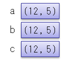
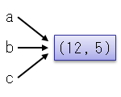
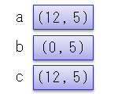

# 値型と参照型

## <a id="sec-generated-title-1"></a> <a id="abst"></a>概要

C#の型(組込み型、クラス、構造体、列挙型)には大きく分けて2つのタイプがあります。
1つは値型と呼ばれるもので、もう1つは参照型と呼ばれるものです。
ここでは、その値型と参照型の違いについて説明していきます。


##### <a id="sec-generated-title-2"></a>ポイント

* C# には値型と参照型がある。

* 値型: 変数に直接値が格納される。

* 参照型: 変数が持っているのは参照情報（実体がどこにあるのかという情報）だけ。実体は別の場所に確保される。

* 構造体は値型で、クラスは参照型になる。

## <a id="sec-generated-title-3"></a> <a id="type-category"></a>おさらい: C# の型の分類

C#の型は以下のように分類されます。

<figure>

[](../../../../assets/media/ufcpp2000/csharp/fig/TypeClassification.png)

<figcaption>C# の型の分類</figcaption>
</figure>

本項では、この青い四角で囲った分類、値型と参照型の違いについて説明していきます。

## <a id="sec-generated-title-4"></a> <a id="difference"></a>値型と参照型の違い

「[C# の型](../start/st_embeddedtype.md#type)」で概要だけ紹介していますが、
C# の型には値型と参照型という区別があります。
C# の型の中で、構造体とクラスは非常に似通った機能ですが、この2者を区別する一番大きなポイントが、値型か参照型かです。
構造体（struct キーワードを使って定義した型）は値型に、
クラス（class キーワードを使って定義した型）は参照型になります。

<strong id="valtype" class="keyword">値型</strong>（value type）と<strong id="reftype" class="keyword">参照型</strong>（reference type）の違いは、その名の通り、その型の値を直に保持するか、値の参照を保持するかです。
この<em>参照を持つ</em>というのがどういうことなのか説明するために、
以下のような2つのコードについて考えてみましょう。

```csharp
// 値型(構造体は値型になる)
struct Point
{
  public int x, y;

  public Point(int x, int y){this.x = x; this.y = y;}
  public override string ToString()
  {
    return "(" + this.x.ToString() + ", " + this.y.ToString() + ")";
  }
}

class ValueTypeSample
{
  static void Main()
  {
    Console.Write("値型の場合");
    Point a = new Point(12, 5);
    Point b = a;
    Point c = a;
    Console.Write("a: {0}\nb: {1}\nc: {2}\n", a, b, c);
    b.x = 0;
    Console.Write("a: {0}\nb: {1}\nc: {2}\n", a, b, c);
  }
}
```


```csharp
// 参照型(クラスは参照型になる)
class Point
{
  public int x, y;

  public Point(int x, int y){this.x = x; this.y = y;}
  public override string ToString()
  {
    return "(" + this.x.ToString() + ", " + this.y.ToString() + ")";
  }
}

class ReferenceTypeSample
{
  static void Main()
  {
    Console.Write("参照型の場合");
    Point a = new Point(12, 5);
    Point b = a;
    Point c = a;
    Console.Write("a: {0}\nb: {1}\nc: {2}\n", a, b, c);
    b.x = 0;
    Console.Write("a: {0}\nb: {1}\nc: {2}\n", a, b, c);
  }
}
```


この2つのコードは、その大部分はまったく一緒で、
<code>Point</code>型が構造体になっているか、
クラスになっているかという部分だけが異なります。

これまで、クラスについて、メソッドやコンストラクタ、プロパティなどの説明を行ってきましたが、
実はこれらはすべて構造体でも定義することができます。
こうしてみると、構造体とクラスはほとんど同じもののように見えるかもしれません。
(実際、構造体とクラスはかなり多くの共通点を持っています。)
この2つのもっとも大きな違いは、
<em>構造体は値型で、クラスは参照型</em>であるということです。

コード中では、
まず<code>a, b, c</code>という3つの変数に同じ値を代入し、一度画面に値を出力します。
その後、<code>b</code>の値だけ変更し、再び画面に値を出力します。
出力結果は以下のようになります。

```console
値型の場合
a: (12, 5)
b: (12, 5)
c: (12, 5)
a: (12, 5)
b: (0, 5)
c: (12, 5)
```


```console
参照型の場合
a: (12, 5)
b: (12, 5)
c: (12, 5)
a: (0, 5)
b: (0, 5)
c: (0, 5)
```


値型(構造体)を用いたほうは<code>b</code>の値だけが変更され、
参照型(クラス)を用いたほうは<code>b</code>の値と一緒に<code>a</code>と<code>c</code>の値も変更されています。

この違いは、値型は代入時に値のコピーを受け取るのに対し、
参照型は値の実体への参照のみを受け取るために生じるものです。
この違いを図で説明すると以下のようになります。

<table summary="">

	<tr>
		<td markdown="1"></td>
		<th>値型</th>
		<th>参照型</th>
	</tr>
	<tr>
		<th>代入時</th>
		<td markdown="1">
<figure>

[](../../../../assets/media/ufcpp2000/csharp/fig/refval1.png)

<figcaption></figcaption>
</figure>


それぞれの変数は値のコピーを保持。
</td>
		<td markdown="1">
<figure>

[](../../../../assets/media/ufcpp2000/csharp/fig/refval3.png)

<figcaption></figcaption>
</figure>


値の実体は別のところ<sup>※</sup>にあり、
それぞれの変数は実体への参照のみを持つ。
</td>
	</tr>
	<tr>
		<th><code>b</code>の値変更時</th>
		<td markdown="1">
<figure>

[](../../../../assets/media/ufcpp2000/csharp/fig/refval2.png)

<figcaption></figcaption>
</figure>


<code>b</code>の値のみ変更される。
</td>
		<td markdown="1">
<figure>

[](../../../../assets/media/ufcpp2000/csharp/fig/refval4.png)

<figcaption></figcaption>
</figure>


<code>b</code>が参照している実体の値が変更される。
同じ実体を参照している<code>a</code>と<code>c</code>も変更されたかのように見える。
</td>
	</tr>
</table>


<sup>※</sup>
「[ヒープ](../../computer/essential-software/memorymanagement.md#heap)」と呼ばれる領域に実体を確保します。

### <a id="sec-generated-title-5"></a> <a id="null"></a>null

[「クラス」のページの「null」](../oop/oo_class.md#null)などで「有効なインスタンスを持っていない」という状態を null という」と言っていますが、この点について、「参照」という観点から改めて説明します。

参照型の場合、「実体はどこか別の場所にあって、変数はそれを参照しているだけ」という状態になっています。
そして、元々の意味での null は「どこも参照していない」ということを表しています。

内部挙動的には、C# の参照型変数は[ポインター](../interop/sp_unsafe.md#about-pointer)と大差がなくて([ガベージ コレクション](../../computer/essential-software/memorymanagement.md#garbage-collection)に管理されているかどうかだけの差)、null も内部的には単なる「0 で表される番地」になっています。
これは、「[不定なよくわからない値よりは、わかりやすく無効な参照であることがわかる値がある方がマシ](https://www.buildinsider.net/column/iwanaga-nobuyuki/011)」ということで、変数を0で埋めています。

ただ、現在では、[null許容値型](sp2_nullable.md)などの機能もあり、
参照かどうかとかは関係なく、単に「無効な値」を表すために null が使われます。

## <a id="sec-generated-title-6"></a> <a id="merit"></a>値型と参照型の利点

値型と参照型にはそれぞれ利点・欠点があります。

値型は変数ごとに別個の値を保持するため、
代入時(関数に引数として渡す場合も含む)に値の複製を行う必要があります。
サイズが大きい(メンバー変数が多い)場合、複製に大きな手間がかかり非効率的です。
しかし、値を直接操作できるため、値の読み書きは高速になります。

一方、参照型は代入時には参照情報のみを渡すので、
どんなにサイズが大きくても大きな手間はかかりません。
しかし、値を操作する場合、参照情報を用いて実体のある場所を探してから値の操作を行う必要があるので、
値の読み書きは値型にくらべ低速になります。

また、「[クラスの継承](../oop/oo_inherit.md#inherit)」や「[多態性とは](../oop/oo_polymorphism.md#polymorphism)」で説明するような、継承や仮想メソッドなどの多態的な振る舞いは参照型でしかできません。

<table summary="値型・参照型の特徴">
	<caption>
		値型・参照型の特徴
	</caption>
	<tr>
		<td markdown="1"></td>
		<th>値型</th>
		<th>参照型</th>
	</tr>
	<tr>
		<th>代入時</th>
		<td markdown="1">値の複製が生じる</td>
		<td markdown="1">値は複製しない</td>
	</tr>
	<tr>
		<th rowspan="2">利点</th>
		<td markdown="1">間接参照が生じないので、メンバーアクセスが高速</td>
		<td markdown="1" rowspan="2">複製が生じないので、変数への代入・引数渡しが高速</td>
	</tr>
	<tr>
		<td markdown="1">[スタック](../../computer/essential-software/memorymanagement.md#heap)を使うのでメモリ確保が早い</td>
	</tr>
	<tr>
		<th rowspan="2">欠点</th>
		<td markdown="1">型のサイズが大きいとき、複製のコストが大きい</td>
		<td markdown="1">間接参照が生じて、メンバーアクセス時に少しコストがかかる</td>
	</tr>
	<tr>
		<td markdown="1">継承・多態的ふるまいができない</td>
		<td markdown="1">[ヒープ](../../computer/essential-software/memorymanagement.md#heap)を使うのでメモリ確保が少し遅い</td>
	</tr>
</table>


このような特徴があるため、通常は
<em>
        データのサイズが小さく、継承の必要のないものは構造体として定義し、
        それ以外のものはクラスとして定義します。
      </em>


## <a id="sec-generated-title-7"></a> <a id="classification"></a>C#の型の分類

C#には組込み型、クラス、構造体など、さまざまな型がありますが、
これらは以下のように分類されます。

<table summary="">

	<tr>
		<td markdown="1" rowspan="6">値型</td>
		<td markdown="1" rowspan="5">構造体型</td>
		<td markdown="1" colspan="3">ユーザー定義構造体(<code>struct</code>)</td>
	</tr>
	<tr>
		<td markdown="1" rowspan="3">数値型</td>
		<td markdown="1">整数型</td>
		<td markdown="1"><code>
            <span class="reserved">byte, sbyte, char, short, ushort, int, uint, long, ulong</span>
          </code></td>
	</tr>
	<tr>
		<td markdown="1">浮動小数点型</td>
		<td markdown="1"><code>
            <span class="reserved">float, double</span>
          </code></td>
	</tr>
	<tr>
		<td markdown="1" colspan="2"><code>
            <span class="reserved">decimal</span>
          </code></td>
	</tr>
	<tr>
		<td markdown="1" colspan="3"><code>
            <span class="reserved">bool</span>
          </code></td>
	</tr>
	<tr>
		<td markdown="1" colspan="4">列挙型(<code>enum</code>)</td>
	</tr>
	<tr>
		<td markdown="1" rowspan="6">参照型</td>
		<td markdown="1" colspan="4">クラス(<code>class</code>)</td>
	</tr>
	<tr>
		<td markdown="1" colspan="4">インターフェース(<code>interface</code>)</td>
	</tr>
	<tr>
		<td markdown="1" colspan="4">デリゲート(<code>delegate</code>)</td>
	</tr>
	<tr>
		<td markdown="1" colspan="4"><code>
            <span class="reserved">object</span>
          </code></td>
	</tr>
	<tr>
		<td markdown="1" colspan="4"><code>
            <span class="reserved">string</span>
          </code></td>
	</tr>
	<tr>
		<td markdown="1" colspan="4">配列</td>
	</tr>
</table>


注: <span class="reserved">色付き文字</span>で書かれているものは組込み型


<!-- original-page-break -->


## <a id="sec-generated-title-8"></a> <a id="performance"></a>値型の性能

実際のところ、値型と参照型でどのくらいの差が出るのかについても触れておきましょう。
値型が有利に働くような計算を、あえて構造体とクラスの両方で実装してみて、差を見てみましょう。

- [サンプル コード](https://github.com/ufcpp/UfcppSample/tree/master/Chapters/Resource/StructPerformance)

「[値型と参照型の利点](#merit)」で説明した通り、
小さいデータ構造ほど値型が有利なんですが、別項で説明する[参照渡し](sp_ref.md#byref)と組み合わせることで、多少大き目のデータでも値型の方が有利になったりします。

ここでは、ベクトルの加算を例にとってみます。多少大き目のデータの例を出したいので、8元ベクトル(`double`型(8バイト)が8つで64バイト)で考えましょう。
以下のような構造体になります。

```csharp
public struct Vector
{
    public double A, B, C, D, E, F, G, H;

    public Vector(double a, double b, double c, double d, double e, double f, double g, double h)
    {
        A = a;
        // 以下略。B～H
    }

    public void Add(ref Vector v)
    {
        A += v.A;
        // 以下略。B～H
    }
}
```

説明のために不自然なデータ構造(8元ベクトルは実用途であまり使う機会はない)を使いましたが、
同程度以上の個数の数値が詰まった型を作りたいことは結構あります。
例えば、物理シミュレーションだと、3次元の座標で位置・速度・加速度の合計3×3 = 9個の値をまとめておきたいことがよくあります。
他だと、3Dグラフィックスの分野だと4×4行列をよく使いますが、これだと4×4 = 16個の値で1つの型になったりします。

ちなみに、この8元ベクトルのコードでは、ベクトルの加算を、自分自身を上書きする形で実装しています。
一番パフォーマンスがよくなるのはこういう書き方です。

これに対して、以下のように、新しい値を作って返す実装も考えられます。

```csharp
public struct Vector
{
    public readonly double A, B, C, D, E, F, G, H;

    public Vector(double a, double b, double c, double d, double e, double f, double g, double h)
    {
        A = a;
        // 以下略。B～H
    }

    public Vector Add(Vector v) => new Vector(A + v.A, B + v.B, C + v.C, D + v.D, E + v.E, F + v.F, G + v.G, H + v.H);
}
```

新しい値を作って帰すところで、32バイトのデータのコピーが必要になるのでそれなりの負担が発生します。

さらに、これら2つの実装を、あえてクラス(参照型)にしてみたものも用意しましょう。

```csharp
public class Vector
{
    public double A, B, C, D, E, F, G, H;

    public Vector() { }

    public Vector(double a, double b, double c, double d, double e, double f, double g, double h)
    {
        A = a;
        // 以下略。B～H
    }

    public void Add(Vector v)
    {
        A += v.A;
        // 以下略。B～H
    }
}
```

```csharp
public class Vector
{
    public readonly double A, B, C, D, E, F, G, H;

    public Vector() { }

    public Vector(double a, double b, double c, double d, double e, double f, double g, double h)
    {
        A = a;
        // 以下略。B～H
    }

    public Vector Add(Vector v) => new Vector(A + v.A, B + v.B, C + v.C, D + v.D, E + v.E, F + v.F, G + v.G, H + v.H);
}
```

これらに対して、以下のような、ランダムな配列データの作成と、総和の計算を行います(これは「値型かつ自己書き換え」向けの実装です。他はちょっとずつコードが違います)。

```csharp
// ランダムに配列データの生成
public Vector[] GetSeries(Random r, int count) => Enumerable.Range(0, count).Select(_ => GetRandom(r)).ToArray();
private static Vector GetRandom(Random r) => Get(() => r.NextDouble(-1, 1));
private static Vector Get(Func<double> f) => new Vector(f(), f(), f(), f(), f(), f(), f(), f());

// 生成した配列の総和を求める
public Vector SeriesSum(Vector[] seq)
{
    var sum = new Vector();
    for (int i = 0; i < seq.Length; i++)
        sum.Add(ref seq[i]);
    return sum;
}
```

これで、5百万要素の配列生成・総和計算をしてみたところ、
手元の環境(Core i7のデスクトップPC)での計測では、実行時間は以下のようになりました。

|  | 配列データの作成(秒) | 総和の計算(秒) |
| --- | --- | --- |
| 構造体・自己書き換え | 1.1381 | 0.0291 |
| 構造体・書き換え不能 | 1.1818 |  0.0957 |
| クラス・自己書き換え | 2.2254 |  0.0312 |
| クラス・書き換え不能 | 2.0816 |  0.0716 |

計測のたびに数%程度の差は出ますが、傾向は同じです。
簡単に結果をまとめると以下の通りです。

- 参照型はインスタンス生成がかなり遅い
  - 「クラス・書き換え不能」で計算も遅いのは、`Add`の戻り値でもインスタンス生成があるせいです
- 値型は値のコピーが遅い
  - 「構造体・書き換え不能」の計算が遅いのは、`Add`の戻り値を返すときにコピーが発生するせいです

この例のように、大量の数値データに対する計算処理では、構造体(値型)と参照渡しを上手く使うことでパフォーマンス向上が期待できることが多いです。
