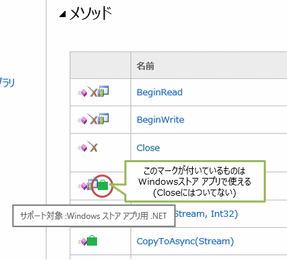

# \[雑記\] Dispose にまつわる余談

## <a id="sec-generated-title-1"></a> <a id="abst"></a>概要

「[リソースの破棄](oo_dispose.md)」で説明したように、
C# で何らかのリソースの破棄が必要な場合、IDisposable インターフェイスを実装して、using ステートメントを使います。

この、IDisposable インターフェイス（の Dispose メソッド）の実装方法などに関して、少々注釈を。


## <a id="sec-generated-title-2"></a> <a id="idisposable"></a>IDisposable インターフェイスの実装

.NET の性質上、
明示的に破棄処理を書く必要があるリソースには、非管理リソース（unmanaged resource）と管理リソース（managed resource）の2種類あります。


##### <a id="sec-generated-title-3"></a>非管理リソース

.NET Framework （の自動メモリ管理）の範疇にないリソースです。
ネイティブ コードで書かれた OS 機能を直接呼び出す場合などです。

例えば、.NET の範疇でも File クラスを使ってファイルの読み書きができますが、
Windows が提供している全機能を使えるわけではありません。
File クラスからは触れない機能を使いたければ、Windows API を直接呼ぶ必要があります。

.NET の管理下にあるオブジェクトの場合、明示的に Dispose メソッドを呼ぶのを忘れても、
最悪、ガベージ コレクションによって使っていないオブジェクトは解放されます。
しかし、非管理リソースの場合は、確実に破棄処理を働かせるためには、Dispose メソッドだけでなく、<em>ファイナライザーにも破棄処理を書く必要があります</em>。


##### <a id="sec-generated-title-4"></a>管理リソース

破棄処理をかけるべき対象が全て .NET Framework の管理化に収まるリソースです。

例えば、他の IDisposable オブジェクトをメンバーに持っていて、間接的にしか非管理リソースを使わない場合もあります。
この場合、直接触れる部分はあくまでも .NET Framework の管理化にあるオブジェクトになります。

.NET Framework の管理化にあるものは .NET Framework に任せるべきです。
非管理リソースと違って、<em>ファイナライザーの中では触れてはいけません</em>。
(※ 「[ファイナライズのコスト](rm_gc.md#cost-to-finalize)」 で説明しているように、ファイナライザーにはかなり高コストな処理が発生します。)


### <a id="sec-generated-title-5"></a> <a id="derivation"></a>Dispose の実装方法

この2種類に正式に対応（しつつ問題を起こさない実装を）するには、以下のような書き方をします。

```csharp
class SomeClass : IDisposable
{
    public void Dispose()
    {
        Dispose(true);
        GC.SuppressFinalize(this);
    }

    protected virtual void Dispose(bool disposing)
    {
        if (disposing)
        {
            // 管理（managed）リソースの破棄処理をここに記述します。 
        }

        // 非管理（unmanaged）リソースの破棄処理をここに記述します。
    }

    ~SomeClass()
    {
        Dispose(false);
    }
}
```


派生クラス含め、まったく非管理リソースを持たないのであれば、ここまで煩雑なコードを書かなくても、単純に Dispose メソッドを実装するだけで構いません。
派生クラスを作る場合には、派生クラスでも絶対に非管理リソースを持たないという保証ができない限り、この書き方を推奨します。
その際、派生クラスでは Dispose(bool disposing) の方をオーバーライドします（引数なしの Dispose メソッドとファイナライザーにはノータッチ）。


##### <a id="sec-generated-title-6"></a>Dispose(bool disposing) の中身

bool 型の引数 disposing は、Dispose メソッドから呼ぶときは true、ファイナライザーから呼ぶときは false を渡します。
if (disposing) { } の中でだけ管理リソースの破棄を行うことで、ファイナライザーの中で管理リソースに触れないようにしています。


##### <a id="sec-generated-title-7"></a>SuppressFinalize

引数なしの Dispose メソッドの中では、引数付きの Dispose メソッドの後で、SuppressFinalize というメソッドを呼んでいます。
これは、ガベージ コレクション時にもうファイナライザーを呼んでもらう必要がないということを、ガベージ コレクターに伝えるためのメソッドです
（実際、呼ばれなくなります）。
ファイナライザーを呼ぶのは、かなり（だいたいは、仕組みを知らない人が想像するよりも大幅に）コストのかかる処理です。
Dispose メソッド内ですでに破棄処理を済ませているので、必要のなくなったファイナライザー呼び出しはしないようにします。


## <a id="sec-generated-title-8"></a> <a id="close"></a>Close メソッド

リソースの明示的な破棄が必要となる典型的な例として、[Stream クラス](http://msdn.microsoft.com/ja-jp/library/System.IO.Stream.aspx)がありますが、
このクラスは Dispose メソッドに加えて、[Close メソッド](http://msdn.microsoft.com/ja-jp/library/System.IO.Stream.aspx)も持っています。

C# （をはじめとする .NET 言語）では、リソースの破棄には極力 「[using ステートメント](oo_dispose.md#using)」を使います。
using ステートメントは IDisposable インターフェイスの Dispose メソッドを実装していることを前提にしているので、
Stream を閉じる操作（リソース破棄の一例）も Dispose メソッドを使ってやるべきです。

ところが、Stream クラスは Close メソッドも持ってしまっているわけです。
しかも、Stream クラスの Close メソッドの中身は Dispose メソッドと同じことをしていて、完全に無駄な重複となっています。
（無駄なだけならまだしも、混乱の原因でもあります。
using ステートメントを使って Stream を閉じていても、内情を知らない人は「Close していないから Stream が閉じられないのではないか」と心配して、
変なコーディング・変なコード レビューが横行します。）

さすがに、マイクロソフトの .NET チームからも、この Close メソッドを持たせてしまったことは失敗だったと認識されているようです。
互換性を崩すわけにはいかないデスクトップ版の .NET Framework では Close メソッドが残り続けますが、
Windows ストア アプリ版や、クラウド最適化版の .NET Framework では削除されました。

<figure>

[](../../../../assets/media/ufcpp2000/csharp/fig/stream.close.png)

<figcaption>Stream.Close メソッドの利用可否。</figcaption>
</figure>


## <a id="sec-generated-title-9"></a> <a id="task"></a>Task クラス

IDisposable インターフェイスを実装するクラスのインスタンスは、用が済み次第 Dispose メソッドを呼んで破棄するべきです
(クラスを作った側からすると、そうしてほしいから IDisposable インターフェイスを実装している)。

しかし、Dispose したくても無理なクラスもあって、
その最たるものが Task クラス(System.Threading.Tasks 名前空間)です。
例えば、以下のようなコードを見てください。まじめに 全部 Dispose して回るのはかなり面倒です。

```csharp
var t1 = Task.Run(() => Work1()); // ここで Task インスタンスが1個できる

t1.ContinueWith(t => Work2()); // ここでも1個
t1.ContinueWith(t => Work3()); // ここでも1個

// t1 の Dispose はどこでやるべき？
// ContinueWith の方で作られる Task も変数で受けて Dispose呼ぶべき？
```


幸い、実は、Task クラスの Dispose メソッドはめったなことでは呼ぶ必要ありません。
Task クラスにはいろいろな使い方がありますが、その中のある特定の使い方をした時だけ、Dispose を呼ぶ必要のある(破棄する必要のある)リソースを確保するそうです。
以下のような場合が、唯一の Dispose が必要になる(ようなリソースを確保する)使い方です。

```csharp
IAsyncResult ar = Task.Run(() => Work1());
ar.AsyncWaitHandle.WaitOne(); // AsyncWaitHandle を呼んだ時点でリソース確保。
```


端的にいうと、古いバージョンのコードとの互換性のためだけにあるようなもので、
[`await`](../async/sp5_async.md#async) がある今、あまりやらない使い方です。
