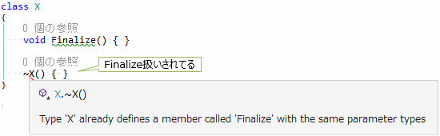

# C# のメモリ管理

## <a id="sec-generated-title-1"></a> <a id="abst"></a>概要

C# をはじめとした .NET Framework 上で動く言語は、メモリ管理を .NET Framework のガベージ コレクションに任せることで、管理の手間を削減できます。

しかし、.NET Framework に任せれたとしても、
メモリ管理の方法を知ることは有益でしょう。
例えば、本サイト内でも「[コンピュータの基礎知識](../../computer/index.md)」の「[メモリ管理](../../computer/essential-software/memorymanagement.md)」で説明しているので、興味があれば参照してください。

本セクションでは、C# のメモリ管理と関連して、次節以降、以下のような話をしていきます。

* 「[値型と参照型](oo_reference.md)」

* 「[引数の参照渡し](sp_ref.md)」

* 「[[雑記] スタックとヒープ](misc_heap.md)」

* 「[ボックス化](rmboxing.md)」

* 「[Nullable 型](sp2_nullable.md)」

* 「[リソースの破棄](oo_dispose.md)」


このページは、「[コンピュータの基礎知識](../../computer/index.md)」とC#の橋渡しのようなもので、
次節以降の話と、「[メモリ管理](../../computer/essential-software/memorymanagement.md)」で説明しているような概念の関わりについて説明します。


## <a id="sec-generated-title-2"></a> <a id="stack-heap"></a>C# とスタック/ヒープ

「[メモリ管理](../../computer/essential-software/memorymanagement.md)」で説明しますが、
一般に、メモリの管理方法には「[スタック](../../computer/essential-software/memorymanagement.md#stack)」と「[ヒープ](../../computer/essential-software/memorymanagement.md#heap)」という2種類のものがあります。

C# では、ローカル変数はスタック上に値を置きます。
この時、変数が「[値型](oo_reference.md#valtype)」の場合、値すべてがスタック上に置かれます。
一方、「[参照型](oo_reference.md#reftype)」の場合、実際の値はヒープ上に置かれ、そのヒープ上の場所への参照情報（「[ポインター](../../computer/general/memory.md#pointer)」 ）だけがスタック上に置かれます。

参考: 「[ボックス化](rmboxing.md)」


## <a id="sec-generated-title-3"></a> <a id="garbage-collection"></a>C# のガベージ コレクション

.NET Framework （の上で動く C# などの言語）は、
<strong id="garbage-collection" class="keyword">ガベージ コレクション</strong>(参考: 「[ガベージ・コレクション](../../computer/essential-software/memorymanagement.md#garbage-collection)」)
を使ってヒープを管理しています。

.NET Framework には何種類かのバリエーションがありますが、
デスクトップ向けやサーバー向けの .NET Framework では、以下のような方式のガベージ コレクションを行っています。

* 「[コンパクション](../../computer/essential-software/memorymanagement.md#compaction)」付きの「[マーク＆スイープ](../../computer/essential-software/memorymanagement.md#mark-sweep)」方式。

* 3つの世代を持つ(「[世代別ガベージ・コレクション](../../computer/essential-software/memorymanagement.md#generational)」参照)。 ちなみに、.NET の内部用語的には、この3世代は新しいものから順に gen0、gen1、gen2 と呼ばれている。

* サイズの大きい（規定の設定では 85,000バイト以上の）データは特別扱いされて、通常とは別のヒープ（LOH: Large Object Heap と呼ばれる）に確保される。 （統計的に、サイズの大きなデータは長寿命なことが多いため） LOH に確保したオブジェクトは最初から gen2 扱いを受ける（gen0、gen1 のガベージ コレクションでは回収されない）。


## <a id="sec-generated-title-4"></a> <a id="finalize"></a>ファイナライズ

C# では、オブジェクトがガベージ コレクションで回収される時に呼びだされるメソッドのことをファイナライザーといい、
~ 記号を使った C++ のデストラクターに似た構文で書きます。
(そのため C# でもかつてはこれのことをデストラクターと呼んでいました。
今では、後述するような実態に合わせてファイナライザーと呼びます。)

しかし、実は、.NET Framework 的には(そして、C# のコンパイル結果である .NET の中間言語的には)、
ガベージ コレクション時に呼ぶメソッドは、
(~クラス名 という名前のメソッドではなく)Finalize という名前のメソッドになります。
これを、(デストラクターではなく)<strong id="finalizer" class="keyword">ファイナライザー</strong>(Finalizer)と呼びます。
(C++ じゃなくて、Java が参考にされてる。
つまり、C# の文法上は C++ っぽいのに、.NET 内部的には Java っぽい。)
ちなみに、一般に、ガベージ コレクション時に(Finalize メソッドなどの)終了処理を行うことを<strong id="finalize" class="keyword">ファイナライズ</strong>(finalization)と言います。

この仕様から、C# で書いたファイナライザーは、コンパイルすると Finalize というメソッドに変換されています。
なので、ファイナライザーとは別に Finalize という名前のメソッドを書こうとすると、コンパイル エラーになります。

<figure>
	[](../../../../assets/media/ufcpp2000/csharp/fig/finalizer.png)
	<figcaption>Finalize メソッドとファイナライザー</figcaption>
</figure>


ちなみに、挙動的に同じなのは Java のファイナライザーです。
C++ のデストラクターとは、構文が似ているだけで、呼び出されるタイミングなどは違うので注意が必要です。


## <a id="sec-generated-title-5"></a> <a id="cost-to-finalize"></a>ファイナライズのコスト

ファイナライズは以下の手順で行われます。

* ファイナライザー(＝ Finalize メソッド、C# の場合は旧称デストラクター。現在は C# でもファイナライザー呼び)を持ったクラスのオブジェクトが作られたとき、 そのオブジェクトをファイナライズ リスト(finalization list)と呼ばれるリストに入れて記憶しておく。

* ガベージ コレクションの際、どこからも到達できない(＝ ゴミになった)オブジェクトがファイナライズ リストにあるかどうか調べて、 あった場合、そのオブジェクトを F-reachable キュー(F はファイナライズの F。ファイナライズ処理の中から到達できるオブジェクトを入れておく)という場所に移す。

* ファイナライズ専用のスレッドで Finalize メソッドを実行する。

* Finalize メソッドが完了したら、F-reachable キューからオブジェクトを取り出す。


ここで問題になるのは、Finalize メソッドを呼ぶために、オブジェクトの寿命が延びることです。
一度ゴミ扱いされたからこそファイナライズの対象になるわけですが、
Finalize メソッドを呼び出すまでの間はそのオブジェクトに「復活」しておいてもらう必要があります
(これが F-reachable と呼ばれる所以。どこかから到達可能 ＝ まだ使われている ＝ ゴミ扱いされない)。
つまり、その時のガベージ コレクション処理ではまだゴミ扱いされず、次のガベージ コレクションまでオブジェクトが残ります。

しかも、「次」といっても、.NET Framework のガベージ コレクションは世代を持っている(「[世代別ガベージ・コレクション](../../computer/essential-software/memorymanagement.md#generational)」参照)ので、
1度生き残ってしまうと、世代が上がってしまって、次にガベージ コレクションの対象になるのはだいぶ先になってしまいます
(これが結構深刻なコストになるので、極力ファイナライザーを使いたくない理由になります)。


### <a id="sec-generated-title-6"></a> <a id="suppress-finalization"></a>ファイナライズ抑止

前述の通り、ファイナライズ処理はコストのかかる処理なので、できる限り避けたいものです。

ファイナライザーを使いたい場合というのは、だいたい「破棄処理を忘れたらまずいものに対する保険」になります。
基本的には明示的な破棄(「[using ステートメント](oo_dispose.md#using)」 を使った Dispose メソッド呼び出し)をすべきで、
もし万が一それを忘れてしまった場合でも大丈夫なように、保険として用意しておくものです。

なので、逆にいうと、明示的に Dispose メソッドを呼んだ後なら、もう、ファイナライザーを呼んでもらう必要性がなくなる場合がほとんどです。
このため、.NET には、「もうファイナライザーを呼ばなくてもいいよ」ということをフレームワークに伝えるために、
GC クラス(System 名前空間)に SuppressFinalize というメソッドが用意されています。
(参考: 「[IDisposable インターフェイスの実装](rm_disposable.md#idisposable)」)


### <a id="sec-generated-title-7"></a> <a id="resurrection"></a>復活

ファイナライザーを使ってしまうと、一度死んだはず(ゴミ扱いされたはず)のオブジェクトが、一時的に復活してしまうという話はしました。

ここで、マナーの悪いコードを書いてしまうと、オブジェクトが完全復活(resurrection)してしまうことがあります。
例えば、以下のように、ファイナライザーの中で、静的なオブジェクトに参照を渡してしまうなどです。

```csharp
class X
{
    static List<X> resurrected = new List<X>();

    ~X()
    {
        // 死んだはずのオブジェクトを静的なもの(＝ ずっと生きてる)に渡すという暴挙
        // ガベージ コレクションの対象から外れる
        resurrected.Add(this);
    }
}
```


ちなみにこの場合、すでにファイナライズ リストからはこのオブジェクトが外れているので、
次に不要になったときには、もうファイナライザーが呼ばれなくなります。
この場合にさらにもう1度ファイナライザーを呼びたい場合は、GC クラスの ReRegisterForFinalize メソッドを呼び出します。
