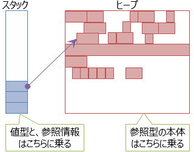
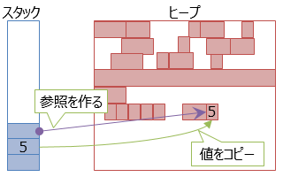
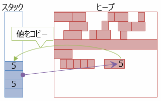

# ボックス化

## <a id="sec-generated-title-1"></a> <a id="abst"></a>概要

C# では、int 型などの値型も、object 型として扱えます。
その裏では、「ボックス化」という仕組みが動いています。


##### <a id="sec-generated-title-2"></a>サンプル

[https://github.com/ufcpp/UfcppSample/tree/master/Chapters/Resource/Boxing](https://github.com/ufcpp/UfcppSample/tree/master/Chapters/Resource/Boxing)


## <a id="sec-generated-title-3"></a> <a id="value-reference"></a>値型/参照型

「[メモリ管理](../../computer/essential-software/memorymanagement.md)」で説明しますが、
一般に、メモリの管理方法には「[スタック](../../computer/essential-software/memorymanagement.md#stack)」と「[ヒープ](../../computer/essential-software/memorymanagement.md#heap)」という2種類のものがあります。


### <a id="sec-generated-title-4"></a> <a id="stack-heap"></a>スタック/ヒープ

C# では、ローカル変数はスタック上に値を置きます。
この時、変数が「[値型](oo_reference.md#valtype)」の場合、値すべてがスタック上に置かれます。
一方、「[参照型](oo_reference.md#reftype)」の場合、実際の値はヒープ上に置かれ、そのヒープ上の場所への参照情報（「[ポインター](../../computer/general/memory.md#pointer)」 ）だけがスタック上に置かれます。

<figure>

[](../../../../assets/media/ufcpp2000/csharp/fig/RmStackHeap.png)

<figcaption>値型と参照型、スタックとヒープ</figcaption>
</figure>


### <a id="sec-generated-title-5"></a> <a id="value-type-object"></a>値型も object

C# では、値型と参照型の扱いを同列にしています。具体的には、値型も object 型から派生しているかのような扱いをしています。

(object 型は参照型です。
値型が参照型である object 型から派生している(ように見える)っていうのは実は変なことだったりします。
実際、他のプログラミング言語では、int (整数)や double (浮動小数点数)などの値型を特別扱いしていて、通常のクラス(object 型から派生)とは区別したりします。
C# でこれが可能なのは、次節で説明する「ボックス化」という仕組みが働くからです。)

例えば、`int` 型(.NET の `Int32` 型(`System` 名前空間)の別名)の定義を覗いてみると、以下のようなメソッドを持っています。
これらは、`object` 型で `virtual` に定義されているもののオーバーライドです。

```csharp {title="int 型の定義(一部)"}
    public struct Int32 : IComparable, IFormattable, IConvertible, IComparable<Int32>, IEquatable<Int32>
    {
        public override bool Equals(object obj);
        public override Int32 GetHashCode();
        public override string ToString();
        // 以下略
    }
```


利用例も挙げておきましょう。以下のようになります。

```csharp {title="object のメンバーを int に対して呼ぶ"}
int x = 5;
Console.WriteLine(x.ToString());
Console.WriteLine(x.GetHashCode());
Console.WriteLine(x.Equals(5));
Console.WriteLine(x.GetType().Name);
```


この仕様のおかげで、C# では、int 型と string 型とでなどの、値型と参照型での処理の共通化ができます。
以下の例は、型名と値をコンソールに出力するものですが、int 型でも string 型でも受け付けることができます。

```csharp {title="int と string の両方を受け取れるメソッド"}
using System;

class Program
{
    static void Main()
    {
        Write(5);
        Write("aaa");
    }

    static void Write(object x)
    {
        Console.WriteLine(x.GetType().Name + " " + x.ToString());
    }
}
```


## <a id="sec-generated-title-6"></a> <a id="boxing"></a>ボックス化

値型を object 型(object 型は参照型です)に代入できるわけですが、
この時、図2に示すように、値型(スタック上に値がある)から参照型(ヒープ上に値がある)への変換が行われます。
この処理を<strong id="key-boxing" class="keyword">ボックス化</strong>(boxing: 箱詰め)と呼びます。

<figure>

[](../../../../assets/media/ufcpp2000/csharp/fig/RmBoxing.png)

<figcaption>ボックス化(値型を参照型に変換)</figcaption>
</figure>


ヒープに新たに領域を確保して、値をコピーしています。
また、元の値が何の型だったのか(図2の例ではint)わかるように、型情報も付与します。

もちろん、この逆もあります。ボックス化した object から、元の型にキャストすると、ボックス化解除(unboxing)処理がかかります。

```csharp
int x = 5;
object y = x;   // int を object に。ボックス化が起きる。
int z = (int)y; // object から元の型に。ボックス化解除。
```


<figure>

[](../../../../assets/media/ufcpp2000/csharp/fig/RmUnboxing.png)

<figcaption>ボックス化解除(object 化した値型を元に戻す)</figcaption>
</figure>


ヒープ上にある値を、スタック上にコピーしなおします。
型が間違っていた場合は InvalidCastException 例外(System 名前空間)が発生します。


## <a id="sec-generated-title-7"></a> <a id="avoid-boxing"></a>ボックス化を避ける

一般的に、ヒープ上の領域確保は、スタックと比べると重たい処理です。
値型の利点はスタック上に値を置く(= ヒープを使わない)ことによる性能向上です。
ボックス化(要するに、ヒープ確保)が起きてしまうと、この利点が失われることになります。
できる限り避けるべきです。

ボックス化を避けるといっても、そんなに難しいことはありません。
<em>具体的な型をできる限り指定する</em>(= 値型を object で受け取るのをやめる)だけでボックス化は回避されます。

例えば以下の例を見てください。
2つのメソッド、ObjectWriteLine と IntWriteLine があります。
この2つの差は、引数が object か、int かだけです。
引数が object の方では int から object への変換(つまりボックス化)が起きますが、
引数が int の方では起きません。
ToString メソッド(object の仮想メソッド)の呼び出しも、型が明示されている限り、int.ToString (int 側でオーバーライドしたもの)が直接呼ばれます。

```csharp {title="型を明示するとボックス化を避けれる"}
using System;

class Program
{
    static void Main()
    {
        ObjectWriteLine(5);
        IntWriteLine(5);
    }

    static void ObjectWriteLine(object x)
    {
        // object.ToString が呼ばれる
        // 値型に対してはボックス化が必要
        Console.WriteLine(x.ToString());
    }

    static void IntWriteLine(int x)
    {
        // こういう場合は、int.ToString が直接呼ばれる
        // virtual メソッドだからといって、必ず virtual に呼ばれるわけじゃない
        // コンパイルの時点で型が確定してるなら、非 virtual にメソッドを呼ぶ
        Console.WriteLine(x.ToString());
    }
}
```


型を明示的に指定するには、「[ジェネリック](../oop/sp2_generics.md#generics)」を使うのも重要です。
以下の例では、ジェネリック版と非ジェネリック版の2つのメソッドがあって、ほぼ同じ処理を書いていますが、
ジェネリック版ではボックス化が起きません。

```csharp {title="ジェネリックを使うとボックス化を避けれる"}
using System;

class Program
{
    static void Main()
    {
        Console.WriteLine(CompareTo((IComparable)5, 6));
        Console.WriteLine(CompareTo((IComparable<int>)5, 6));
    }

    static int CompareTo(IComparable x, int value)
    {
        // IComparable.CompareTo(object) が呼ばれる。
        // value がボックス化される
        return x.CompareTo(value);
    }

    static int CompareTo(IComparable<int> x, int value)
    {
        // IComparable<int>.CompareTo(int) が呼ばれる。
        // value は int のまま渡される
        return x.CompareTo(value);
    }
}
```
