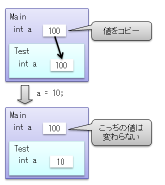
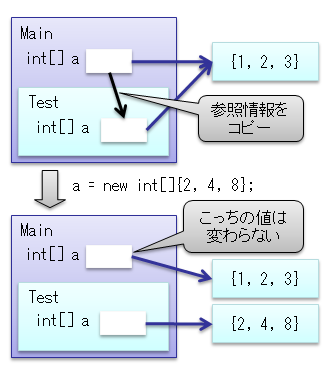
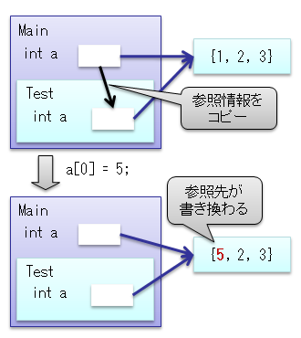
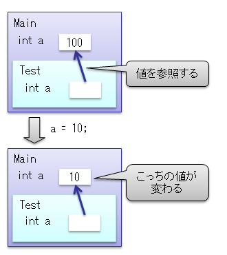
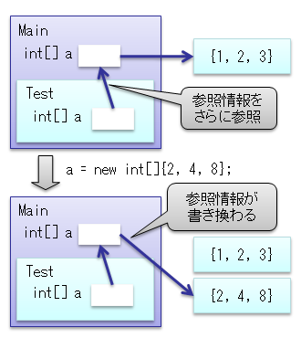
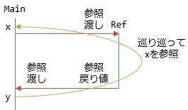
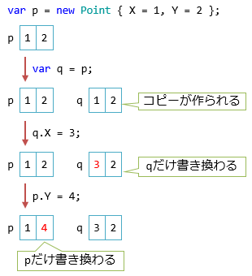
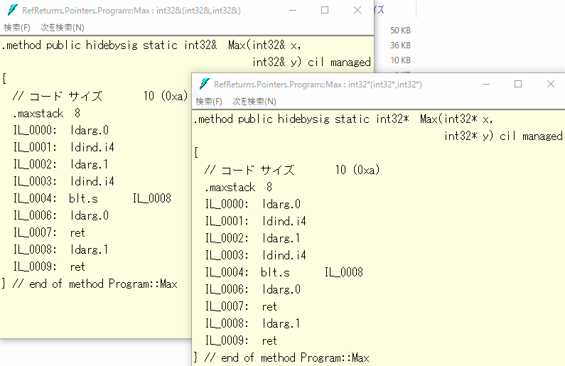

# 参照渡し

## <a id="sec-generated-title-1"></a> <a id="abst"></a>概要

プログラミング言語での値の受け渡しの方法には
<strong id="byval" class="keyword">値渡し</strong>（pass by value）と<strong id="byref" class="keyword">参照渡し</strong>（pass by reference）という2つの方法があります。

C# では、値の受け渡しは基本的に値渡しになります。
しかし、<code>ref</code> や <code>out</code> といったキーワードを使うことで参照渡しにすることが出来ます。


##### <a id="sec-generated-title-2"></a>ポイント

* 値渡し： メソッド内で引数の値を書きかえても、呼び出し元には影響しない。

* 参照渡し（ref）： メソッド内での値の書き換えの影響が呼び出し元に伝搬する。

* out： 特殊な参照渡し。戻り値以外にも値を返したいとき（複数の値を返したいとか）に使う。

## <a id="sec-generated-title-3"></a> <a id="pass-by"></a>値の受け渡し

値の受け渡しが発生する場所は何カ所かあります。例えば以下のような場所です。

- 変数から変数
- 変数から引数
- 戻り値から変数

```csharp
var x = 1;
var y = x; // x から y に値を渡す
```

```csharp
static void VariableToParameter()
{
    var x = 1;
    F(x); // 変数 x から、F の引数 x に値を渡す
}

static void F(int x)
{
}
```

```csharp
static void ReturnToVariable()
{
    var x = F(); // F の戻り値から変数 x に値を渡す
}

static int F() => 1;
```

受け渡しの方法には、以降で説明する[値渡し](#sec-byval)と[参照渡し](#sec-byref)という2種類の受け渡し方法があります。

C#では、通常(特に何もつけないと)、値渡しになります。
一方、以下のようにして、参照渡しを使うこともできます。

- C# 6以前では、引数の受け渡しの際に`ref`もしくは`out`という修飾子を付けることで参照渡しができます
- C# 7以降では、変数間の受け渡しや戻り値でも`ref`修飾子を付けることで参照渡しができます

ちなみに、C#には受け渡しの値渡しと参照渡しの他に、型の区分として[値型と参照型](oo_reference.md)というものもあります。結果的に、「値型の値渡し」、「値型の参照渡し」、「参照型の値渡し」、「参照型の参照渡し」というような組み合わせもできるので注意が必要です。

## <a id="sec-generated-title-4"></a> <a id="sec-byval"></a>値渡し

しばらく、C# 6以前でも使える「引数の受け渡し」で説明して行きましょう。

引数の値渡し(call by value)とは、メソッドを呼び出す際に値のコピーを渡すことを言います。
C# では普通にメソッドを定義すると、その引数は値渡しになります。
例えば、以下のようなプログラムがあったとします。

```csharp
using System;
class ByValueTest
{
  static void Main()
  {
    int a = 100;
    Console.Write("{0} → ", a);
    Test(a);
    Console.Write("{0}\n", a);
  }

  static void Test(int a)
  {
    a = 10; // メソッド内で値を書き換える。
  }
}
```


<code>Test</code> メソッドの変数 <code>a</code> には <code>Main</code> メソッドの <code>a</code> のコピーが渡されています。
したがって、図1のように、
<code>Test</code> 内で変数 <code>a</code> を書き換えても
<code>Main</code> 内の <code>a</code> の値は変わりません。
そのため、このプログラムの実行結果は以下のようになります。

```console
100 → 100
```


<figure>
	[](../../../../assets/media/ufcpp2000/csharp/fig/ref1.png)
	<figcaption>値型の値渡し</figcaption>
</figure>


同様に、参照型の変数を値渡しする場合、図2, 3に示すように、参照情報をコピーして渡すことになります。

<figure>
	[](../../../../assets/media/ufcpp2000/csharp/fig/ref2.png)
	<figcaption>参照型の値渡し(参照情報の書き換え)</figcaption>
</figure>


<figure>
	[](../../../../assets/media/ufcpp2000/csharp/fig/ref3.png)
	<figcaption>参照型の値渡し(参照先の書き換え)</figcaption>
</figure>

## <a id="sec-generated-title-5"></a> <a id="sec-byref-param"></a>参照渡しの引数

引数の参照渡し(call by reference)とは、メソッドを呼び出す際に変数の参照情報を渡すことを言います。
C# では、`ref`引数、`in`引数、`out`引数という3種類の参照渡しがあります。

### <a id="sec-generated-title-6"></a> <a id="sec-byref"></a>参照引数(ref 引数)

C# で単に「参照引数」という場合、`ref`引数を指します。
後述する`in`(読み取り専用)や`out`(戻り値的に使う引数)のような制約がなく、読み書き両方できるものです。

以下の例のように、メソッドの引数に <code>ref</code> キーワードを付けることでその引数は参照渡しになります。

```csharp
using System;
class ByReferenceTest
{
  static void Main()
  {
    int a = 100;
    Console.Write("{0} → ", a);
    Test(ref a);
    Console.Write("{0}\n", a);
  }

  static void Test(ref int a)
  {
    a = 10; // メソッド内で値を書き換える。
  }
}
```


<code>Test</code> メソッドの変数 <code>a</code> は <code>Main</code> メソッドの <code>a</code> に対する参照になっています。
したがって、図4のように、
<code>Test</code> 内で変数 <code>a</code> を書き換えた場合、
<code>Main</code> 内の <code>a</code> の値も同時に書き換わります。
そのため、このプログラムの実行結果は以下のようになります。

```console
100 → 10
```


<figure>
	[](../../../../assets/media/ufcpp2000/csharp/fig/ref4.png)
	<figcaption>値型の参照渡し</figcaption>
</figure>


同様に、参照型の変数を値渡しする場合、図5に示すように、参照情報をさらに参照することになります。

<figure>
	[](../../../../assets/media/ufcpp2000/csharp/fig/ref5.png)
	<figcaption>参照型の参照渡し</figcaption>
</figure>


ここで1つ注意しなければいけないのは、
<em>メソッドの呼び出し側にも <code>ref</code> キーワードをつける必要がある</em>ということです。
参照渡しを行うと、メソッドの中で値が書き換えられる可能性があります。
(というよりも、書き換える必要があるから参照渡しにする。)
引数が参照渡しであることを知らずにメソッドを呼び出してしまうと、
プログラマの意図しないところで値が書き換わってしまう可能性があり、
これはバグの原因になります。
そのため、呼び出し側でも明示的に <code>ref</code> キーワードを付けなければならいないという制約をつけることによって、
知らないうちに参照渡しのメソッドを呼び出してしまう危険性をなくしています。


##### <a id="sec-generated-title-7"></a>サンプル

```csharp
using System;

class ByRefferanceTest
{
  static void Main()
  {
    int[] array = new int[]{4, 6, 1, 8, 2, 9, 3, 5, 7};
    BubbleSort(array);
    foreach(int a in array)
    {
      Console.Write("{0,3}", a);
    }
  }

  /// <summary>
  /// バブルソートを使って配列を整列する
  /// </summary>
  static void BubbleSort(int[] array)
  {
    for(int i=0; i<array.Length-1; ++i)
      for(int j=array.Length-1; j>i; --j)
        if(array[j-1] > array[j])
          Swap(ref array[j-1], ref array[j]);
  }

  /// <summary>
  /// a と b の値を入れ替える
  /// </summary>
  static void Swap(ref int a, ref int b)
  {
    int tmp = a;
    a = b;
    b = tmp;
  }
}
```


```console
  1  2  3  4  5  6  7  8  9
```

### <a id="sec-generated-title-8"></a> <a id="in"></a>入力参照引数 (in 引数)

<h5 class="version version7">Ver. 7.2</h5>

C# 7.2 から、「参照渡しだけども読み取り専用」というような引数の渡し方ができるようになりました。
「入力用」ということを示すように、`in`キーワードを使います。
(`in` を使うのは、C# 1.0の頃からある `out` 引数(次節で説明)との対比もあります。)

```csharp
using System;

public partial class Program
{
    static void F(in int x)
    {
        // 読み取り可能
        Console.WriteLine(x);

        // 書き換えようとするとコンパイル エラー
        x = 2;
    }

    // 補足: in 引数はオプションにもできる
    static void G(in int x = 1)
    {
    }

    static void Main()
    {
        int x = 1;

        // ref 引数と違って修飾不要
        F(x);

        // 明示的に in と付けてもいい
        F(in x);

        // リテラルに対しても呼べる
        F(10);

        // 右辺値(式の計算結果)に対しても呼べる
        int y = 2;
        F(x + y);
    }
}
```

(`int`みたいな型に`in`引数を使ってもメリットは皆無なんですが、サンプルということでご容赦ください。
後述しますが、大き目の構造体に対して使うべき機能です。)

`in`引数は、書き換えできないことがコンパイラーによって保証されています
(書き換えようとするとコンパイル エラーを起こします)。

意図せず書き換わってしまう心配がないので、`ref`引数と違って以下ようなことが認めらています。

- `F(x)` というように、修飾なしで呼ぶ
- `F(10)` というように、リテラルを引数として渡す
  - 既定値を与えて[オプション引数](../structured/sp4_optional.md#optional)にすることもできる
- `F(x + y)` というように、右辺値(式の計算結果)を引数として渡す

ちなみに、
`F(in x)` というように、呼び出し側で `in` 修飾を明示することもできます。
以下のような呼び分けをできるようにするために使います。

```csharp
// 値渡しと in 引数でオーバーロードできる
static void F(int x) { }
static void F(in int x) { }

static void Main()
{
    int x = 1;

    // (※ 古いバージョンのコンパイラーだとコンパイルできないので注意)
    // F(int) の方を呼ぶ
    F(x);

    // F(in int) の方を呼ぶ
    F(in x);
}
```

※[コンパイラー](https://www.nuget.org/packages/Microsoft.Net.Compilers/)のバージョン2.7以降書けるようになりました。

「書き換えないけども参照で渡す」というのは、
大きめの構造体を使う際に役立ちます。
「[参照渡しの活用](#ref-value-type)」や「[値型の性能](oo_reference.md#performance)」などで触れていますが、
大きめの構造体を値渡し(コピーが発生)すると、結構大きな負担が発生します。
そういう場合に `in` 引数が有用です。

```csharp
public struct Quaternion
{
    public double W;
    public double X;
    public double Y;
    public double Z;
    public Quaternion(double w, double x, double y, double z) => (W, X, Y, Z) = (w, x, y, z);

    // 足し算4つくらいならインライン展開されて、値渡しでもコピーのコストが掛からない
    public static Quaternion operator +(Quaternion a, Quaternion b)
        => new Quaternion(
            a.W + b.W,
            a.X + b.X,
            a.Y + b.Y,
            a.Z + b.Z);

    // このくらい中身が大きい(掛け算16個、足し算9個)と、インライン展開されないので in 引数にする効果が結構出る
    public static Quaternion operator *(in Quaternion a, in Quaternion b)
        => new Quaternion(
            a.W * b.W - a.X * b.X - a.Y * b.Y - a.Z * b.Z,
            a.W * b.X + a.X * b.W + a.Y * b.Z - a.Z * b.Y,
            a.W * b.Y + a.Y * b.W + a.Z * b.X - a.X * b.Z,
            a.W * b.Z + a.Z * b.W + a.X * b.Y - a.Y * b.X);
}
```

ただし、たとえ値渡しでも、[インライン展開](../structured/miscinlining.md)ができるサイズであれば、展開によって値のコピーが消えることがあります。
この例でも、`+` 演算子の方はインライン展開が掛かるため、`in`引数に変えても性能は変わりません(むしろ値渡しの方が速いくらい)。
一方、`*` 演算子の方は中身が大きく、このくらいにあるとインライン展開が掛からないため、`in`引数にした効果が結構現れます。

#### <a id="sec-generated-title-9"></a> <a id="in-copy"></a>注意: in 引数を使ってもコピーが発生する場合

詳しくは「[readonly の注意点](readonlyness.md)」で説明しますが、構造体に対して`readonly`を使うと、無駄にコピーが発生してしまうことがあります。
`readonly`なものに対してメソッドを呼ぶ際、呼び出し側は「メソッド内部で値が書き換わっていない」という保証を知る由がないため、
メソッドを呼んだ時点で無条件にコピーを作ります。

この問題は、以下のように、`in`引数でも起こります。[`readonly struct`](readonlyness.md#readonly-struct)を使えば回避できる点も`readonly`フィールドと同様です。

```csharp
// 作りとしては readonly を意図しているので、何も書き換えしない
// でも、struct 自体には readonly が付いていない
struct NoReadOnly
{
    public readonly int X;
    public void M() { }
}

// NoReadOnly と作りは同じ
// ちゃんと readonly struct
readonly struct ReadOnly
{
    public readonly int X;
    public void M() { }
}

class Program
{
    // in を付けたので readonly 扱い → M を呼ぶ際にコピー発生
    static void F(in NoReadOnly x) => x.M();

    // readonly struct であれば問題なし(コピー回避)
    static void F(in ReadOnly x) => x.M();
}
```

この、前者(`NoReadOnly`構造体の方)の場合に発生するコピーは、コード上は目に見えません。
だからこそ気づきにくいバグになりがちで、
問題視され、「隠れたコピー」(hidden copy)と呼ばれています。

#### <a id="sec-generated-title-10"></a> <a id="ref-readonly-param">ref readonly 引数</a>

<h5 class="version version12">Ver. 12</h5>

[in 引数](#in)では、利便性のため、右辺値を渡せる仕様になっています。

```csharp
// in = 参照渡しだけども書き換えはしない。
void m(in int x) { }

// in 引数には右辺値を渡せる。
m(10); // リテラルとか、

var a = 1;
var b = 2;
m(a + b); // 式とか。
```

in 引数も参照渡しの一種ですが、本来、参照渡しには「参照先」となる変数が必要です。
in 引数の場合は「書き換えしないのであれば、コンパイラーが作る一時変数を参照しても大丈夫」という前提です。
つまり、さきほどような右辺値を参照する in 引数は、実際には以下のような一時変数が挿入されています。

```csharp
// in = 参照渡しだけども書き換えはしない。
void m(in int x) { }

var a = 1;
var b = 2;

// 一時変数が作られて、
int temp;

// その一時変数に値を代入したうえで参照。
temp = 10;
m(in temp);

temp = a + b;
m(in temp);
```

しかし後になって、「書き換えはしないけども、一時変数を渡されると困る」という用途がいくつかあることがわかりました。
例えば `Nullable` 型には .NET 7 から [`GetValueRefOrDefaultRef`](https://learn.microsoft.com/ja-jp/dotnet/api/system.nullable.getvaluerefordefaultref) というメソッドが追加されたんですが、
これが問題になりました。

```csharp
using System.Numerics;

Quaternion? x = new(1, 2, 3, 0);

// x の中から、x.Value の中身の部分だけを参照。
// (目的は x.Value のコピーを発生させたくない = パフォーマンス向上。)
ref readonly var v = ref Nullable.GetValueRefOrDefaultRef(in x);

// 一時変数を参照されると…
ref readonly var v1 = ref Nullable.GetValueRefOrDefaultRef(x + new Quaternion(1, -1, 0, 1));
ref readonly var v2 = ref Nullable.GetValueRefOrDefaultRef<Quaternion>(new());
// v1, v2 は実際にはどこを参照？
// 一時変数なので消えたり、他で再利用されたりする可能性がある。
```

(問題のある個所に警告が出ていますが、これは C# 12 から出る警告です。
C# 11 時点/ .NET 7 時点では警告が出ません。)

そこで C# 12 では改めて、「書き換えはしないけども、右辺値は受け付けたくない」ということを表す、
ref readonly 引数というものを導入しました。

```csharp
// 冒頭の例から in を ref readonly に変更。
void m(ref readonly int x) { }

m(10); // リテラルは警告に。

var a = 1;
var b = 2;
m(a + b); // 式も警告に。

// in や ref を付けないのも警告。
m(a);

// in を付けると警告が出ない。
m(in a);

// in 引数と違って、ref 修飾でも OK。
m(ref a);
```

ちなみに、呼び出し側の書き方が変わる以外に差はなく、コンパイル結果の挙動は in 引数と全く同じです。
呼び出し側の差は以下の通りです。

| 呼び方 | in | ref readonly |
| --- | --- | --- |
| `m(ref x)` | 警告 | OK |
| `m(in x)`  | OK | OK |
| `m(x)`, `m(x + y)`, `m(123)`     | OK | 警告 |

用途的に「右辺値は受け付けたくない」という方がレアなので、ref readonly という長ったらしい書き方も許容範囲でしょう。
ほとんどの場合、in 引数を使えばいいと思われます。
(さらにいうと ref 引数や in 引数自体、そもそも利用頻度が低めの機能ですが…)

問題があることがわかっているわけで、ref readonly 引数に右辺値を渡すとエラーにしてもいいくらいですが、警告どまりです。
これは、「一度は in 引数として公開してしまったけどもやっぱり問題があった」というメソッドがあって(前述の `GetValueRefOrDefaultRef` がまさにそう)、
それを ref readonly に変えたいけども、エラーにされると既存コードが困るからだそうです。

また、in 引数と違って `m(ref x)` みたいな呼び出しが許されているのは、
「問題があるから in 引数にできず、本当は書き換えないのに ref 引数にしていた」というメソッドがあるので、
そのメソッドを ref readonly に書き換えた時に、呼び出し側に影響が及ばないようにという配慮です。
(こちらは [`MemoryMarshal.CreateReadOnlySpan`](https://learn.microsoft.com/ja-jp/dotnet/api/system.runtime.interopservices.memorymarshal.createreadonlyspan) などが該当。)

### <a id="sec-generated-title-11"></a> <a id="out"></a>出力引数 (out 引数)

参照渡しを使うと、メソッド内からメソッド外にある変数を書き換えることができます。
これを、メソッドの戻り値代わりに使うこともできます。
特に、複数の戻り値を返す場合に有効な手段です<sup>※</sup>。
ただ、`ref`修飾子を使った参照引数では、戻り値として使うには以下のようないくつかの問題があります。

```csharp
using System;

class Program
{
    static void Main()
    {
        int a = 0; // この 0 という値には意味はないけど、必須
        int b = 0; // 同上
        MultipleReturns(ref a, ref b); // a, b を
        Console.Write("{0}\n", a);
    }

    static void MultipleReturns(ref int a, ref int b)
    {
        a = 10; // a を初期化
        // 本当は b も初期化してやらないといけないけど、忘れててバグってる
    }
}
```

(<sup>※</sup>C# 6以前では、複数の戻り値を返す唯一の手段でした。C# 7以降ではタプル型というものを使って複数の戻り値を返すことができるようになっています。)

問題を要約すると以下の2点です

- 呼び出し元で、特に意味のない値で変数を初期化しておかなければならない
  - メソッドの中で必ず上書きする想定なので、無駄な初期化になる
- メソッドの中で代入を忘れてしまってもコンパイル エラーにならない

そこで、戻り値として使いたい場合(メソッド内で変数を初期化する予定である場合)、
以下のように <code>out</code> 修飾子を用いて、出力用の参照引数であることを明示してやります。

```csharp
using System;
class ByValueTest
{
  static void Main()
  {
    int a;
    Test(out a); // out を使った場合、変数を初期化しなくてもいい
    Console.Write("{0}\n", a);
  }

  static void Test(out int a)
  {
    a = 10; // out を使った場合、メソッド内で必ず値を代入しなければならない
  }
}
```


```console
10
```

<code>out</code> キーワードを用いて宣言された引数は参照渡しになります。
<code>ref</code> キーワードとの違いは、上述のとおり、

- メソッド呼び出し前に初期化する必要がなくなる
- メソッド内で必ず値を割り当てなければいけない

の2点です。

##### <a id="sec-generated-title-12"></a>サンプル

メソッドで複数の値を返したい場合、
戻り値では1つしか値を返せないので出力変数を使います。

```csharp
using System;

class OutTest
{
  /// <summary>
  /// コンソールから係数を入力して2次方程式の根を計算し、出力する。
  /// </summary>
  static void Main()
  {
    string line = Console.ReadLine();
    string[] token = line.Split(' ');
    double a = double.Parse(token[0]);
    double b = double.Parse(token[1]);
    double c = double.Parse(token[2]);
    Console.Write("{0}x^2 + {1}x + {2} = 0\n", a, b, c);

    double x, y;
    int type;
    CalcRoot(a, b, c, out type, out x, out y);
    if(type == 0)      Console.Write("x = {0}, {1}\n", x, y);
    else if(type == 1) Console.Write("x = {0} ±i {1}\n", x, y);
    else               Console.Write("x = {0}\n", x);
  }

  /// <summary>
  /// 2次方程式 ax^2 + bx + c = 0 の根を求める
  /// </summary>
  /// <param name="a">2次の係数</param>
  /// <param name="b">1次の係数</param>
  /// <param name="c">定数項</param>
  /// <param name="type">根のタイプ。0:実数根2つ、-1:重根1つ、1:虚数根</param>
  /// <param name="x">根1(虚数根の場合、根の実部)</param>
  /// <param name="y">根2(虚数根の場合、根の虚部)</param>
  static void CalcRoot(
    double a, double b, double c,
    out int type, out double x, out double y)
  {
    b /= 2;
    double d = b * b - a * c;

    if(d < 0)
    {
      type = 1;
      x = -b / a;
      y = Math.Sqrt(-d) / a;
      return;
    }
    
    if(d > 0)
    {
      type = 0;
      double t1 = -b;
      double t2 = Math.Sqrt(d);
      x = (t1 + t2) / a;
      y = (t1 - t2) / a;
      return;
    }

    type = -1;
    x = -b / a;
    y = x;
  }
}
```


#### <a id="sec-generated-title-13"></a> <a id="out-var"></a>出力変数宣言

<h5 class="version version7">Ver. 7</h5>

C# 7で、出力引数を受け取るのと同時に式中で変数を宣言できるようになりました。
これを出力変数宣言(out variable declaration。あるいは、略して out-var)と呼びます。

以前は、出力引数で値を受け取るためには、メソッドなどの呼び出しよりも前に変数を宣言しておく必要がありました。
例えば以下のようになります。

```csharp
static int? ParseOrDefault(string s)
{
    int x;
    return int.TryParse(s, out x) ? x : default(int?);
}
```

これに対して、C# 7では、以下のような書き方ができるようになります。
式の中で変数 `x` を宣言しつつ、出力引数の値を受け取っています。

```csharp
static int? ParseOrDefault(string s)
{
    return int.TryParse(s, out int x) ? x : default(int?);
}
```

ちなみに、[`var`](../start/sp3_inference.md#implicit)を使った型推論もできます。

```csharp
static int? ParseOrDefault(string s)
{
    return int.TryParse(s, out var x) ? x : default(int?);
}
```

この例では、C# 6以前の書き方では、変数宣言ステートメントが必須で、式1つにまとめることができませんでした。
一方、C# 7以降の書き方ならば1つの式で済んでいます。
C# 6で導入された `=>` を使った形式でメソッドを書くことができます。

```csharp
static int? ParseOrDefault(string s) => int.TryParse(s, out var x) ? x : default(int?);
```

出力変数宣言で作った変数のスコープは、概ね、その式を囲っているブロック内になります。
つまり、式の直前に変数を宣言したのと同じスコープになります。

```csharp
using System;

struct Point
{
    public int X { get; set; }
    public int Y { get; set; }

    public void GetCoordinate(out int x, out int y)
    {
        x = X;
        y = Y;
    }
}

class Program
{
    static void Main()
    {
        // x, y のスコープはこのブロック内
        // この辺りで x, y という名前の変数は作れない

        var p = new Point { X = 1, Y = 2 };
        p.GetCoordinate(out var x, out var y);

        // 以下のような書き方をしたのと同じ
        // int x, y;
        // p.GetCoordinate(out x, out y);

        // この行から下で x, y を使える

        Console.WriteLine($"{x}, {y}");
    }
}
```

正確にいうともう少し複雑なルールになっていますが、詳細については「[式の中で変数宣言](../start/st_scope.md#declaration-expressions)」を参照してください。

### <a id="sec-generated-title-14"></a> <a id="ref-in-out"></a>in も out も内部的には ref

C# コンパイラーとしては`in`引数や`out`引数を`ref`引数と区別していますが、
.NET の型システムのレベルでは実は区別がありません。
.NET 的には`in`引数も`out`引数も`ref`引数扱いになっています。
そのため、以下のような不便があります。

- オーバーロードの区別に使えない
- 共変・反変にできない

まず、`ref`、`in`、`out`だけの違いのオーバーロードは作れません。
例えば以下のコードでは`F`、`G`、`H`のいずれもコンパイル エラーになります。

```csharp
void F(ref int x) { }
void F(in int x) { }

void G(ref int x) { }
void G(out int x) => x = 0;

void H(in int x) { }
void H(out int x) => x = 0;
```

もう1つは、`in`引数や`out`引数を持つ[インターフェイス](../oop/oo_interface.md)や[デリゲート](../functional/sp_delegate.md)には[変性](../oop/sp4_variance.md)を指定しません。

入力にしか使わない型引数は[反変(`in`制約)](../oop/sp4_variance.md#contravariance)に、
出力にしか使わない型引数は[共変(`out`制約)](../oop/sp4_variance.md#covariance)にできます。
この条件に沿って考えるなら本来、`in`引数は反変、`out`引数は共変にできるはずです。
ところが、 .NET の型システム上は`in`引数・`out`引数は`ref`引数と同等のものなので、
「入力/出力にしか使わない」という判定ができません。
以下のようなコードはコンパイル エラーになります。

```csharp
interface Contravariance<in T>
{
    // 普通の引数は共変
    void M(T x);

    // 本来できてもいいはずなものの、.NET 的には無理
    void M(in T x);
}

interface Covariance<out T>
{
    // 普通の戻り値は反変
    T M();

    // 本来できてもいいはずなものの、.NET 的には無理
    void M(out T x);
}
```

ちなみに、最新のコンパイラーで`in`引数を使ったメソッドを作って、
それを古いコンパイラー(Visual Studio 2017 15.4以前)で使おうとすると`ref`引数扱いされます。
(実際のところ、`in`引数は、`ref`引数に`IsReadOnly`属性が付いているだけ。)

### <a id="sec-generated-title-15"></a> <a id="byref-param-restriction"></a>参照引数の制限

[別項](refstruct.md#stack-only)で少し話していますが、参照はスタック上でしか使えません。
参照引数もこの制限に引っかかります。
その結果、参照引数(`ref`、`in`、`out`いずれも)には以下のような制限があります。

- [クロージャ](../functional/fun_localfunctions.md#closure)にキャプチャできない
- [イテレーター](../data/sp2_iterator.md)や[非同期メソッド](../async/sp5_async.md)の引数には使えない

例えば以下のコードはコンパイル エラーになります。

```csharp
using System;
using System.Collections;
using System.Threading.Tasks;

class Program
{
    void M(ref int x)
    {
        // クロージャに使えない
        Action<int> a = i => x = i;
        void f(int i) => x = i;
    }

    // イテレーターの引数に使えない
    IEnumerable Iterator(ref int x)
    {
        yield break;
    }

    // 非同期メソッドの引数に使えない
    async Task Async(ref int x)
    {
        await Task.Delay(1);
    }
}
```

<!-- original-page-break -->

## <a id="sec-generated-title-16"></a> <a id="ref-returns"></a>参照戻り値と参照ローカル変数

<h5 class="version version7">Ver. 7</h5>

- [サンプル](https://github.com/ufcpp/UfcppSample/tree/master/Chapters/Resource/RefReturns)

C# 7から、戻り値とローカル変数でも参照渡しを使えるようになりました。
書き方はほぼ参照引数と同じです。
戻り値の型の前、値を渡す側、値を受ける側それぞれに`ref`修飾子を付けます。

例として、配列のi番目の要素を参照で返してみましょう。以下のようになります。

```csharp
using System;

class Program
{
    static void Main()
    {
        var x = new[] { -1, -1, -1, -1, -1 };

        for (int i = 0; i < x.Length; i++)
        {
            // 戻り値を書き換えてる
            // 実際書き換わってるのは参照先の配列 x
            Ref(x, i) = i;
        }

        // ↑のループで書き換えたので、結果は 0, 1, 2, 3, 4
        Console.WriteLine(string.Join(", ", x));
    }

    // 配列の i 番目の要素を参照
    static ref int Ref(int[] array, int i) => ref array[i];
}
```

```console
0, 1, 2, 3, 4
```

また、ローカル変数に対しても、`ref`修飾子を付けることで参照渡しができます。

```csharp
using System;

class Program
{
    static void Main()
    {
        var a = 10;

         ref var b = ref a; // 参照ローカル変数。宣言側にも、値を渡す側にも ref

        var c = b;         // これは普通に値渡し(コピー)。この時点の a の値 = 10 が入る
        ref var d = ref b; // さらに参照渡しで、結局 a を参照

        d = 1; // d = b = a を書き換え

        ref var e = ref Ref(ref c); // 参照戻り値越しに、c を参照
        var f = Ref(ref c);         // これは結局、値渡し(コピー)

        ++e;   // e = c を +1。元が10なので、11に
        f = 0; // f は普通に値渡しで作った新しい変数なので他に影響なし

        // 結果は 1, 1, 11, 1, 11, 0
        // a, b, d が同じ場所を参照してて 1
        // 同上、c, e が 11
        // f が 0
        Console.WriteLine(string.Join(", ", a, b, c, d, e, f));
    }

    // 引数を素通し
    static ref int Ref(ref int x) => ref x;
}
```

```console
1, 1, 11, 1, 11, 0
```

`ref`だらけになってしまいますが、渡す側、受け取る側の両側に`ref`修飾子が必要なのは参照引数と同様です。
元の変数がどこか遠くの知らない場所で書き換えられるかもしれないというのはそれなりに危険なことなので、あえて面倒な構文になっています。

上記の例でも、参照引数を参照戻り値で返して、それをさらに参照ローカル変数で受け取るものもあります。
ここだけ抜き出すと以下のような感じです。

```csharp
static void Main()
{
    var x = 10;
    ref var y = ref Ref(ref x);
    y = 0; // y は巡り巡って x を参照。x も 0 に

    Console.WriteLine($"{x}, {y}"); // 0, 0
}

static ref int Ref(ref int x) => ref x;
```

これで、下図のような状態になっています。これくらい単純な例でも、結局どこが書き換わるのかそこそこわかりづらくなるので注意が必要です。



ちなみに、参照ローカル変数では、
「参照先を読み書きする」という操作の他に、
「どこを参照するか自体を書き換え」という操作が考えられます。
[後述](#ref-reassignment)しますが、この参照の書き換えはC# 7.3からできるようになっています
(逆に、C# 7.0～7.2 ではこの機能は使えません)。

### <a id="sec-generated-title-17"></a> <a id="flow-analysis"></a>参照戻り値で返せるもの

もし何の制限も掛かっていないなら、参照渡しでは参照をたどった先の大元が消えしまっている可能性があって危険です。
C#の参照渡しでは、そうならないように、参照できるものを制限しています。

(他のプログラミング言語では、参照渡しが必ずしも安全でなかったり(不正なメモリ操作につながる)、逆に参照渡しの機能を提供していないものもあります。
.NETも、[IL](../../il/index.md)のレベルでは安全でない参照もできたりします。
C#は、コンパイラーが厳しめにチェックして、安全でない参照ができないようにしています。)

- 通常のメソッドの参照引数は常に安全です
  - なので、これはC# 1.0の頃から認められています
  - [非同期メソッド](../async/sp5_async.md)や[イテレーター](../data/sp2_iterator.md)では安全性を保障できないので、これらのタイプのメソッドでは参照引数を認めていません
- 参照戻り値の場合、返しても安全かどうかを判定して、安全でない可能性があるならコンパイル エラーになります
  - 参照引数は参照戻り値で返せます
  - 通常の引数やローカル変数は返せません
  - 参照ローカル変数などを挟んで、多段に参照している場合、コードをたどって大元が安全かどうかまで調べます

例えば、以下のようなコードは、赤色の下線で強調表示しているところがコンパイル エラーになります。

```csharp
// 参照引数は参照戻り値で返せる
private static ref int Success1(ref int x) => ref x;

// 値渡しの引数はダメ
private static ref int Error1(int x) => ref x;

// ローカル変数はダメ
private static ref int Error2()
{
    var x = int.Parse(Console.ReadLine());
    return ref x;
}

// 多段の場合も元をたどって出所を調べてくれる
private static ref int Success1(ref int x, ref int y)
{
    ref int r1 = ref x;
    ref int r2 = ref y;
    ref int r3 = ref Max(ref r1, ref r2);

    // r3 は出所をたどると引数の x か y の参照
    // x も y も参照引数なので大丈夫
    return ref r3;
}

private static ref int Error1(ref int x, int y)
{
    ref int r1 = ref x;
    ref int r2 = ref y;
    ref int r3 = ref Max(ref r1, ref r2);

    // y が値渡しなのでダメ
    return ref r3;
}

private static ref int Error2(ref int x)
{
    var y = int.Parse(Console.ReadLine());
    ref int r1 = ref x;
    ref int r2 = ref y;
    ref int r3 = ref Max(ref r1, ref r2);

    // y がローカル変数なのでダメ
    return ref r3;
}
```

C# 7では、コンパイラーが賢くなって、この「大元をたどって調べる」という仕事ができるようになったので、参照戻り値や参照ローカル変数が使えるようになったということです。
こういうコンパイラーの努力を<strong id="key-escape-analysis" class="keyword">エスケープ解析</strong>(escape analysis: 逃がしてはいけないものが漏れ出ていないかの解析)といいます。

ただし、C# 7でも、あくまでメソッド内で完結できる範囲でしか「たどって調べる」ということができません。
例えば、以下のようなコードはコンパイルできません。

```csharp
// あまり意味のないメソッドなものの…
// 第1引数しか参照しない
static ref int X(ref int x, ref int y) => ref x;

static ref int Y(ref int x)
{
    int local = 1;

    // X の中身まで追えば、実のところ local は参照していないものの、そこまでは追えない
    // あくまで、「local を参照で渡してしまった以上、X の戻り値に local が含まれている可能性あり」と判定する
    // 結果的に、このコードはコンパイル エラーになる
    return ref X(ref x, ref local);
}
```

このコードは、もし仮に、`X`を`Y`の中で展開してしまえば、ローカル変数`local`の参照を戻り値として返さないということがわかるんですが、
コンパイラーはそこまでは追ってくれません。
(こういう`X`の中身次第で変わる挙動を認めてしまうと、`X`の変更の影響が`X`利用側(この例の場合`Y`)に及び過ぎるため問題があります。
「追ってくれない」というより、意図的に「追わない」という面もあります。)

#### <a id="sec-generated-title-18"></a> <a id="struct-this"></a>構造体のフィールドの参照(戻り値にできない)

C# コンパイラーが行う「参照戻り値に返して安全かどうか」の判定で、
1つ注意が必要な点があります。
構造体の場合、フィールドの参照を返せません。
(ただし、C# 7.2 では、[`ref`引数拡張メソッドを救済策として使えます](../functional/sp3_extension.md#struct-field)。)

例えば、以下のコードはコンパイル エラーになります。

```csharp
struct Struct
{
    int _v;
    public ref int Value => ref _v; // ダメ
}

class Class
{
    int _v;
    public ref int Value => ref _v; // クラスの場合はOK
}
```

ちなみに、エラーになるのは構造体のフィールドの参照を直接返している場合だけです。
以下のように、フィールドを介していても、参照型の中の参照を返すことはできます。

```csharp
struct ArrayOffset<T>
{
    T[] _array;
    int _offset;
    public ArrayOffset(T[] array, int offset) => (_array, _offset) = (array, offset);

    // フィールドの参照を直接返しているわけではなく、
    // 配列 T[] (参照型)の中の参照を返しているのでOK
    public ref T this[int i] => ref _array[i + _offset];
}
```

構造体内では、フィールドの読み書きのために、実は`this`が参照扱いになっています。
そのせいで、「大元をたどって参照を返せるかどうかを調べる」という作業が難しく、
結局「構造体はフィールドの参照(`this`が絡む参照)を返せない」という制限を掛けたそうです。

この仕様は、少し詳しい人であれば何か釈然としないものがあるかもしれません。
例えば以下のように、[拡張メソッド](../functional/sp3_extension.md)的に([静的メソッド](../oop/oo_static.md)で)書けば似たようなことが実現できます。

```csharp
struct Struct
{
    internal int _v;

    // ↓これはダメ(なのでコメントアウト)
    // public ref int V() => ref _v;
}

static class Extensions
{
    // Struct.V() と、実のところやっていることは同じ
    // (構造体内では、this は参照扱いになっている)
    // Struct.V() ではダメなのに、同じことを静的メソッドでやるとできる
    public static ref int V(ref Struct @this) => ref @this._v;
}
```

実のところ、「`this`が参照扱いになっている」というのはこのコードと似たような状態で、
このコードが許されるのに通常のメソッドでは許されないというのは少し不思議です。

正確には、「以下の2つのうちどちらか片方を選ぶ必要があり、前者を選んだ」ということだそうです。

- 構造体はフィールドの参照を返せない(C# 7で選んだ仕様)
- 構造体の関数メンバーを呼ぶ際には、常に`this`参照が引数として渡っている前提で安全性を調べる(選ばなかった仕様)

要するに、以下の例の、`Ok`メソッドのようなものを認めるためには前者の仕様が必要です。

```csharp
struct ArrayOffset<T>
{
    // 拡張メソッドから参照するために internal
    internal T[] _array;
    internal int _offset;
    public ArrayOffset(T[] array, int offset) => (_array, _offset) = (array, offset);

    // OK
    public ref T this[int i] => ref _array[i + _offset];
}

static class Extensions
{
    // ArrayOffset のインデクサーと同じことを静的メソッドで書く
    public static ref T Get<T>(ref ArrayOffset<T> @this, int i) => ref @this._array[i + @this._offset];
}

class Program
{
    static ref int Ok()
    {
        // a はローカル変数なので、こいつが絡む参照は戻り値にしてはいけない
        var a = new ArrayOffset<int>(new[] { 1, 2, 3 }, 1);

        // 構造体の関数メンバーはフィールドの参照を返さないという仕様なので、
        // この ref には a 絡みの参照は絶対にない
        return ref a[1];
    }

    static ref int Ng()
    {
        // 同上、a 絡みの参照は返せない
        var a = new ArrayOffset<int>(new[] { 1, 2, 3 }, 1);

        // a が参照引数にわたっている以上、Get の戻り値には a 絡みの参照が含まれる可能性がある
        // コンパイル エラーになる
        return ref Extensions.Get(ref a, 1);
    }
}
```

あと、以下のように、[ジェネリクス](../oop/sp2_generics.md)絡みの問題を避けるためにもこの仕様を選ぶ必要があったそうです。

```csharp
using System;

interface IReference
{
    ref int Value { get; }
}

class ReferenceClass : IReference
{
    int _value;
    public ref int Value => ref _value;
}

struct ReferenceStruct : IReference
{
    int _value;
    public ref int Value => ref _value; // 認められていない。もし認めると…
}

class Program
{
    static void Main()
    {
        ref var r = ref X<ReferenceClass>();
        r = 1;
        Console.WriteLine(1);
    }

    static ref int X<T>()
        where T : IReference, new()
    {
        var x = new T();
        return ref x.Value; // T が構造体だと、返してはいけないはずの参照が返る
    }
}
```

### <a id="sec-generated-title-19"></a> <a id="conditional-ref"></a>条件演算子での ref 利用

<h5 class="version version7">Ver. 7.2</h5>

C# 7.2から、[条件演算子](../start/st_operator.md#condition)の2項目、3項目を参照にできるようになりました。
以下のような書き方ができます。

```csharp
x > y ? ref x : ref y
```

これを、さらに参照ローカル変数や参照戻り値で受けたい場合には、条件演算子の前にも `ref` が必要です。

```csharp
var x = 1;
var y = 2;

// 条件演算子自体は ref を返すものの、その前に ref を付けていない
// v の型は int になる
var v = x > y ? ref x : ref y; ;

v = 10; // 書き換えても x, y に影響なし
Console.WriteLine((x, y)); // (1, 2)

// 条件演算子の前にも ref を付ける
// v の型は ref int になる
ref var r = ref x > y ? ref x : ref y; ;

r = 10; // y が書き換わる
Console.WriteLine((x, y)); // (1, 10)
```

この「条件 ref」は、左辺にも使えます。
例えば以下のように、「条件付きで `x` と `y` のどちらかを書き換える」みたいなことができます。

```csharp
var x = 1;
var y = 2;

// y が書き換わる
(x > y ? ref x : ref y) = 10;

Console.WriteLine((x, y)); // (1, 10)
```

ただし、この例の通り、左辺に `()` が必要です。
(`ref` に限った話ではなく、単に演算子の優先度の問題です。
代入と条件演算子が並んでいる場合、右から順に結合するので、`()`がなければ代入が先に解釈されます。)

### <a id="sec-generated-title-20"></a> <a id="ref-readonly"></a>ref readonly

<h5 class="version version7">Ver. 7.2</h5>

[`in`引数](#in)と併せてC# 7.2で、
参照戻り値と参照ローカル変数でも「参照渡しだけども読み取り専用」という渡し方ができるようになりました。
以下のように、`ref readonly`で修飾します。

```csharp
static ref readonly int Max(in int x, in int y)
{
    ref readonly var t = ref x;
    ref readonly var u = ref y;

    if (t < u) return ref u;
    else return ref t;
}
```

`ref readonly`と書く必要があるのは型名の側だけで、受け渡しする側(上記コードで言うと`ref x`や`ref y`)の方は`ref`だけ書きます。

ちなみに、引数の`in`と、ローカル変数・戻り値の `ref readonly` は全く同じ意味です。
提案当初は引数でも`ref readonly`と書かせる案もありましたが、`out`引数との対称性がきれいだったため、最終的には`in`の方が採用されました。

### <a id="sec-generated-title-21"></a> <a id="ref-reassignment"></a>ref再代入

<h5 class="version version7">Ver. 7.3</h5>

C# 7.3で、参照引数、参照ローカル変数のref再代入(ref reassignment)というものができるようになりました。
参照先の値の書き換えではなく、「どこを参照しているか」自体を書き換える機能です。

以下のように、参照ローカル変数への代入時に、右辺に`ref`を付けることでref再代入になります。

```csharp
int x = 1;
int y = 2;

// x を参照。
ref var r = ref x;

// このとき、r に対する代入は x に反映される。
r = 10; // x が 10 になる。

// これが ref 再代入。
// r が y を参照するようになる。
r = ref y;

// 今度は、r に対する代入が y に反映される。
r = 20; // y が 20 になる。

Console.WriteLine((x, y)); // (10, 20)
```

ちなみに、参照引数に対しても使えます。

```csharp
static void M1(ref int x, ref int y)
{
    x = ref y;
}

static void M2(in int x, ref int y)
{
    x = ref y;
    // y = ref x; ←逆は当然ダメ
}

static void M3(ref int x, out int y)
{
    y = 0; // 先に値を与えないとダメ
    x = ref y;
    y = ref x;
}
```

この機能の用途はそんなに広くはありませんが、
例えば、配列中のデータの探索などで、この機能を使うとシンプルに書けて速度的にも有利なことがあります。
以下の例は、`int`の配列中の最大値になっているところを参照戻り値で返す処理ですが、
都度インデックス アクセスするよりも、ref再代入を使ったコードの方が少しだけ有利です。

```csharp
static ref int RefMaxOld(int[] array)
{
    if (array.Length == 0) throw new InvalidOperationException();

    // これまでこんな感じでインデックスで持って、
    var maxIndex = 0;

    for (int i = 1; i < array.Length; i++)
    {
        // 毎度毎度、配列のインデックス アクセスするようなコードを書くことがたまに。
        // array[maxIndex] で配列の中身を取り直すのがちょっともったいない。
        if (array[maxIndex] < array[i])
        {
            maxIndex = i;
        }
    }

    return ref array[maxIndex];
}

static ref int RefMax(int[] array)
{
    if (array.Length == 0) throw new InvalidOperationException();

    // それを、こんな風に参照ローカル変数に変えて、
    ref var max = ref array[0];

    for (int i = 1; i < array.Length; i++)
    {
        // ref 再代入で済ませるように。
        ref var x = ref array[i];
        // array (の先頭)に maxIndex を足す作業が減る。
        if (max < x) max = ref x;
    }

    return ref max;
}
```

### <a id="sec-generated-title-22"></a> <a id="ref-for"></a>for/foreach のループ変数を参照に

<h5 class="version version7">Ver. 7.3</h5>

C# 7.3から、`for`ステートメントや`foreach`ステートメントのループ変数も、参照ローカル変数にできるようにないました。

`for`の方は分かりやすいでしょう。単に、`for (初期化式; 条件式; 更新式)`の初期化式内で参照ローカル変数を定義できるようになっただけです。

```csharp
var array = new[] { 1, 3, 5, 2, 4 };

var x = 0;

for (ref int i = ref x; i < array.Length; i++)
{
    if (array[i] == 5) break;
}

Console.WriteLine(x); // break した時点の i の値 = 2
```

用途はそんなに思い浮かびませんが、例えば、C++でよくやるような、[ポインター風の配列列挙](https://gist.github.com/ufcpp/b84e39371ba04ae2c07fbe0b874a6d1e)に使えるかもしれません。

`foreach`の方も、[通常の`foreach`と同じパターン](../data/sp_foreach.md#foreach)で、`MoveNext`や`Current`の呼び出しに展開されるだけです。
`Current`が参照戻り値を返すとき、それをrefループ変数で受け取ることができます。

```csharp
using System;

class Program
{
    static void Main()
    {
        var array = new int[10];
        foreach (ref var x in array.AsRef())
        {
            // ちゃんとこれで、配列の各要素を書き換えられる。
            x = 1;
        }

        foreach (var x in array)
        {
            // 全要素 1 になってる。
            Console.WriteLine(x);
        }
    }
}

// 標準で ref 戻り値になっている Enumerable はないので自作。
struct RefArrayEnumerable<T>
{
    T[] _array;
    public RefArrayEnumerable(T[] array) => _array = array;
    public RefArrayEnumerator<T> GetEnumerator() => new RefArrayEnumerator<T>(_array);
}

struct RefArrayEnumerator<T>
{
    int _index;
    T[] _array;
    public RefArrayEnumerator(T[] array) => (_index, _array) = (-1, array);
    // Current が ref 戻り値になっているのがポイント。
    public ref T Current => ref _array[_index];
    public bool MoveNext() => ++_index < _array.Length;
}

static class RefExtensions
{
    public static RefArrayEnumerable<T> AsRef<T>(this T[] array) => new RefArrayEnumerable<T>(array);
}
```

この例でもコメントに書いていますが、
言語機能として認められたと言っても、現状はこのパターン通りの列挙子がほとんどないので、
この機能の恩恵はなかなか受けづらくはあります。
また、「`IEnumerable<T>`のref版」のようなインターフェイスもありません。

ただ、.NET Core 2.1 から導入された[`Span<T>`](span.md)であれば、 `Enumerator` が `ref` 戻り値な `Current` を持っています。`AsSpan`拡張メソッドで配列を`Span<T>`にできるので、以下のようなコードが書けます。

```csharp
using System;
 
class Program
{
    static void Main()
    {
        var array = new int[10];
        foreach (ref var x in array.AsSpan())
        {
            // ちゃんとこれで、配列の各要素を書き換えられる。
            x = 1;
        }
 
        foreach (var x in array)
        {
            // 全要素 1 になってる。
            Console.WriteLine(x);
        }
    }
}
```

### <a id="sec-generated-title-23"></a>余談(将来の話): let や readonly 引数・ローカル変数

ローカル変数に対して `ref readonly var x`というように書くのは長ったらしくて多少しんどいものがあります。

`ref readonly`だけが先に入ることになりましたが、(参照ではなく単に) `readonly` な引数やローカル変数も今後入る予定です。
その際、`readonly var`の省略形として`let`など1単語を使った書き方ができるようになる予定です。
(`let`はもう少し高度な機能として提供される予定ですが、“`readonly var`としても”使えます。)

```csharp
// (将来の予定)
static void F(readonly int x)
{
    readonly int a = 1;
    readonly var b = 1;
    let c = 1;

    // 以下、いずれもコンパイル エラー
    x = 1;
    a = 2;
    b = 3;
    c = 3;
}
```

ちなみに、`ref readonly`の語順がこの順になっている理由も、この仕様を見越してのことです。
将来的には、以下のような使い分けを考えています。

- `ref`: 「再参照」も「参照先の値の書き換え」もできる
- `readonly`: 「値の書き換え」ができない
- `readonly ref`: 「再参照」できない
- `readonly ref readonly`: 「再参照」も「参照先の値の書き換え」もできない


<!-- original-page-break -->

## <a id="sec-generated-title-24"></a> <a id="value-type"></a>値型の参照渡し

- [サンプル](https://github.com/ufcpp/UfcppSample/tree/master/Chapters/Resource/RefReturns)

最後に、参照渡しの活用場面について説明します。

C#には、値渡し・参照渡しと、値型・参照型という区別があって、組み合わせると以下の4つが考えられます。

- 値型の値渡し
- 参照型の値渡し
- 値型の参照渡し
- 参照型の参照渡し

正直、参照型の参照渡しを使いたい場面は、[出力引数](#out)くらいでしょう。
通常の参照引数(`ref`引数)や参照戻り値は、ほぼ値型に対して使うものです。
ここでは、どうして値型の場合は参照渡しが必要になるかについて説明して行きましょう。

### <a id="sec-generated-title-25"></a> <a id="mutate-value"></a>値型の部分書き換えに関する問題

前述の通り、値渡しをすると、値のコピーが発生します。
結果として、値の書き換えは変数ごとに独立になります。

例えば、以下のようなコードを書いたとしましょう。
2つの変数`p`と`q`がありますが、それぞれ別コピーになっていて、片方の書き換えは他方に影響しません。

```csharp
using System;

struct Point
{
    public int X;
    public int Y;

    public override string ToString() => $"({X}, {Y})";
}

class Program
{
    static void Main()
    {
        var p = new Point { X = 1, Y = 2 };

        // p のコピーが作られる
        var q = p;

        // コピー側の書き換えなので、p には影響なし
        q.X = 3;
        Console.WriteLine(p); // 1, 2
        Console.WriteLine(q); // 3, 2

        // 同じく、p を書き換えても q に影響なし
        p.Y = 4;
        Console.WriteLine(p); // 1, 4
        Console.WriteLine(q); // 3, 2
    }
}
```

以下の図のような状態になっているわけです。



この例はローカル変数への代入に関するものですが、同様の「コピー」は、引数や戻り値でも起こります。
ここで注意が必要なのはプロパティとインデクサーです。
プロパティやインデクサーは、フィールドや配列に対する読み書きに似た呼び出し方になりますが、
実際には関数呼び出しになっています。
値を直接読み書きしているように見えて、実際には引数・戻り値越しの読み書きになります。
そのため、値型のプロパティやインデクサーには注意が必要です。

例えば、フィールドや配列を直接読み書きするのであれば、以下のような書き方ができます。

```csharp
class RawData
{
    // フィールドを直接公開
    public Point P;

    // 配列を公開
    public Point[] Items { get; } = new Point[3];
}

class Program
{
    static void Main()
    {
        var raw = new RawData();
        raw.P.X = 1;        // フィールドは直接書き換え可能
        raw.Items[0].X = 1; // 配列の要素の直接書き換え可能
    }
}
```

これが、プロパティやインデクサーを介すると、以下のように書き換えが面倒になります。

```csharp
class CapsuledData
{
    // プロパティで公開
    public Point P { get; set; }

    // インデクサーで公開
    public Point this[int i]
    {
        get { return _items[i]; }
        set { _items[i] = value; }
    }
    private Point[] _items = new Point[3];
}

class Program
{
    static void Main()
    {
#if false
        var cap = new CapsuledData();
        cap.P.X = 1;  // プロパティの戻り値(コピー品)の書き換えはコンパイル エラーに
        cap[0].X = 1; // インデクサーの戻り値も同様、コンパイル エラーに
#else
        // こんな書き方が必須になる
        var cap = new CapsuledData();
        var p = cap.P; // 一旦ローカル変数に全体をコピー
        p.X = 1;       // ローカル変数を部分書き換え
        cap.P = p;     // 全体を渡しなおし
        var q = cap[0];
        q.X = 1;
        cap[0] = q;
#endif
    }
}
```

この例を見ての通り、部分書き換えができなくなります。
一旦コピーして、ローカル変数に対して部分書き換えをして、その結果を全体を渡しなおす必要があります。

#### <a id="sec-generated-title-26"></a> <a id="immutable-value-type"></a>補足: 「構造体は書き換え不能に作れ」ガイドライン

プロパティやインデクサーを通して部分書き換えできないというのが意外と罠になるので、
構造体は最初から部分書き換え不能に作る方がいいというガイドラインもあるくらいです。
このガイドライン通りに`Point`構造体を作るなら、以下のようになります。

```csharp
struct Point
{
    public readonly int X;
    public readonly int Y;

    public Point(int x, int y) { X = x;  Y = y; }
    public override string ToString() => $"({X}, {Y})";
}
```

ただし、この方針は、パフォーマンス的には不利になることが多いです。
`X`, `Y`のどちらかだけを書き換えたい場合でも、`X`, `Y`両方のコピーが発生するためです。
特に、構造体のサイズが大きくなると、コピーの負担が結構深刻になってきます。

### <a id="sec-generated-title-27"></a> <a id="ref-value-type"></a>参照渡しの活用

補足で説明したような部分書き換えできない型を作る実装方法は、バグを減らす意味では有効です。
しかしその一方で、パフォーマンス的には不利になります。

先ほどの例の`Point`構造体(`int`型2つでせいぜい8バイト)くらいならいいんですが、
全体のコピーのコストが問題になる場合もあります。
別項の「[値型の性能](oo_reference.md#performance)」で少し触れていますが、
構造体のサイズによってはパフォーマンスに数倍の差が出たりします。

このコピーのコストが許容できない場面で、参照戻り値が役立つことがあります。
例えば先ほどの例を以下のような書き換えてみましょう。
値渡しの時と違って、構造体の部分書き換えができるようになります。

```csharp
class RefData
{
    // 参照戻り値のプロパティで公開
    public ref Point P => ref _p;
    private Point _p;

    // 参照戻り値のインデクサーで公開
    public ref Point this[int i] => ref _items[i];
    private Point[] _items = new Point[3];
}

class Program
{
    static void Main()
    {
        var raw = new RefData();
        raw.P.X = 1; // プロパティ越しに、参照先のフィールドを書き換え可能
        raw[0].X = 1; // インデクサー越しに、参照先の配列を書き換え可能
    }
}
```

プロパティ/インデクサーのsetアクセサーを介する場合と比べると自由度は減ります(set時に値の検証などの処理が挟めない)。
しかし、フィールドや配列を直接公開するよりは自由な処理が書けます(少なくともget時の処理は挟める)。
例えば以下のような利用例が考えられるでしょう。getアクセサーに少しだけ処理が挟まっています。

```csharp
/// <summary>
/// 循環バッファー。
/// </summary>
/// <typeparam name="T">要素の型。</typeparam>
class CircularBuffer<T>
{
    private int _startIndex;
    private T[] _data;

    /// <summary>
    /// 容量を指定して初期化。
    /// </summary>
    /// <param name="capacity">容量。</param>
    public CircularBuffer(int capacity)
    {
        _startIndex = 0;
        _data = new T[capacity];
    }

    /// <summary>
    /// 値を追加。
    /// 容量を超えた分は古いものから削除。
    /// </summary>
    /// <param name="item">新しい値。</param>
    public void Push(T item)
    {
        _data[_startIndex] = item;
        _startIndex++;
        if (_startIndex >= _data.Length) _startIndex = 0;
    }

    /// <summary>
    /// 先頭要素。
    /// </summary>
    public ref T Head => ref _data[_startIndex];

    /// <summary>
    /// 先頭から <paramref name="index"/> 先の要素。
    /// </summary>
    /// <param name="index">先頭からの位置。</param>
    /// <returns></returns>
    public ref T this[int index] => ref _data[(_startIndex + index) % _data.Length];
}
```

### <a id="sec-generated-title-28"></a>補足: 配列のインデクサー

本節で挙げた例で、配列のインデクサーはユーザー定義のインデクサーと挙動が違うことにお気づきでしょうか。
実は、配列のインデクサーは参照を返しています。

C# 6までは参照戻り値のための構文がなく、ユーザー定義のインデクサーでは参照を返す手段はありませんでした。
しかし、配列は特別扱いを受けていて、インデクサーが参照になっています。
例えば、以下のようなコードを書くと、配列の方だけ正常にコンパイルできます。

```csharp
var array = new[]
{
    new Point(),
    new Point(),
};
// 配列のインデクサーは要素への参照になってる
// 値型の要素の書き換え可能
array[0].X = 1; // OK

var list = new List<Point>
{
    new Point(),
    new Point(),
};
// これまで、ユーザー定義のインデクサーは参照返せなかった
// 当然、C# 6以前からあるクラスのインデクサーは値型の要素の書き換え不能
list[0].X = 1; // コンパイル エラー
```

<!-- original-page-break -->

## <a id="sec-generated-title-29"></a> <a id="pointer"></a>参照渡しとポインター

少し内部的な話もしておきましょう。
内部的には、参照渡しとポインターは似たようなものです。

もちろん、型システム上の扱いとしては、以下のような差があります。

| 参照渡し | ポインター |
| ---- | ---- |
| 通常のコンテキスト内で使える代わりに、制限がきつい | [unsafe](../interop/sp_unsafe.md#unsafe)コンテキストでしか使えない代わりに、自由が利く |
| 基本的に、有効なオブジェクトしか参照できない | どこでも参照できる。`p + 1`など、数値との加減算して隣接するメモリを参照できる |
| どんな型でも参照できる | 「[アンマネージ型](../interop/sp_unsafe.md#function)」と呼ばれる一部の型しか参照できない |

しかし、読み書きに使われる命令的には参照渡しとポインターは全く同じだったりします。
例えば、以下の2つのメソッドを見てみましょう。

```csharp
public static ref int Max(ref int x, ref int y)
{
    if (x >= y) return ref x;
    else return ref y;
}

public static unsafe int* Max(int* x, int* y)
{
    if (*x >= *y) return x;
    else return y;
}
```

やっていることは全く同じで、ただ型的に参照渡しかポインターかが違います。
このコードのコンパイル結果は、下図のように、ほとんど同じになります。



型としては、引数と戻り値のところを見ての通り、`&`と`*`の差があります(`&`が参照渡しで、`*`がポインターです)。
一方で、メソッドの中身に関しては一字一句たがわず同じです。

`ldind`はload indirect (間接ロード)の略で、 ポインターや参照ごしに値を取ってくる命令ですが、 ポインターと参照でまったく同じ命令を使います。

### <a id="sec-generated-title-30"></a> <a id="as-pointer"></a>参照渡しとポインターの相互変換

命令上互換性があるわけで、やろうと思えば参照渡しとポインターの間で相互変換が可能です。
C#を使って書けるコードではありませんが、[IL](../../il/index.md)を使えば書けます。

そのILで書かれたライブラリを参照すれば、C#からも参照渡し⇔ポインターの変換ができます。
[CoreFX](https://github.com/dotnet/corefx)による公式実装があって、以下のように、NuGetパッケージとして公開されています。

- [System.Runtime.CompilerServices.Unsafe](https://www.nuget.org/packages/System.Runtime.CompilerServices.Unsafe/)

このパッケージ中にある`Unsafe`クラスを使うと、以下のようなコードが書けます。

```csharp
unsafe
{
    int x = 1;
    void* pointer = Unsafe.AsPointer(ref x);
    *(int*)pointer = 2;

    Console.WriteLine(x); // 2 になってる

    ref int r = ref Unsafe.AsRef<int>(pointer);
    r = 3;

    Console.WriteLine(*(int*)pointer); // 3 になってる
}
```

これで何がうれしいかというと、以下のように、タイプが異なるいろんなメモリ領域を統一的に扱えたりすることです。
また、ポインターを使う部分にはunsafeコンテキストが必要ですが、作られたクラスを使うだけなら、使う側にはunsafeを求めません。

```csharp
using System.Runtime.CompilerServices;
using System.Runtime.InteropServices;

struct ManagedBuffer
{
    int[] _array;
    public ManagedBuffer(int length) { _array = new int[length]; }

    public ref int this[int index] => ref _array[index];
}

unsafe struct UnsafeBuffer
{
    void* _pointer;
    public UnsafeBuffer(int* pointer) { _pointer = pointer; }

    public ref int this[int index] => ref Unsafe.AsRef<int>(_pointer);
}

class Program
{
    unsafe static void Main()
    {
        // 配列と
        var b1 = new ManagedBuffer(10);
        b1[0] = 1;

        // スタック領域と
        var stack = stackalloc int[10];
        var b2 = new UnsafeBuffer(stack);
        b2[0] = 1;

        // アンマネージなメモリとを同じように触れる
        var p = Marshal.AllocHGlobal(10 * sizeof(int));
        var b3 = new UnsafeBuffer((int*)p);
        b3[0] = 1;

        Marshal.Release(p);
    }
}
```

特に、C# の管理外の世界からもらったアンマネージなメモリ領域を手軽に参照できるのは、パフォーマンスの改善に大きく寄与します。

一方で、もちろん、unsafeコンテキストを経由するので、通常のC#の感覚からするとおかしなこともできます。
例えば、本節の冒頭の表で「参照渡しは有効なオブジェクトしか参照できない」という説明をしましたが、
この制約を破ることができます。
例えば、以下のようなコードで、「参照渡しのnull」を作れます。

```csharp
using System;
using System.Runtime.CompilerServices;

unsafe static class NullReference
{
    public static ref T Null<T>() => ref Unsafe.AsRef<T>((void*)0);
    public static bool IsNull<T>(ref T x) => Unsafe.AsPointer(ref x) == (void*)0;
}

class Program
{
    static void Main()
    {
        ref var x = ref NullReference.Null<int>();
        Console.WriteLine(NullReference.IsNull(ref x)); // true
        Console.WriteLine(x); // 実行時エラー。NullReferenceException 発生
    }
}
```

注意して使いましょう。
