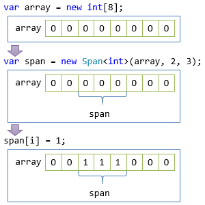
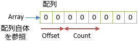
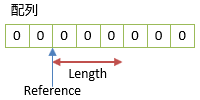

# Span<T>構造体

## <a id="sec-generated-title-1"></a> <a id="abstract"></a>概要

<h5 class="version version7">Ver. 7.2</h5>

`Span<T>`構造体(`System`名前空間)は、span (区間、範囲)という名前通り、連続してデータが並んでいるもの([配列](../structured/st_array.md)など)の一定範囲を読み書きするために使う型です。

この型によって、ファイルの読み書きや通信などの際の、生データの読み書きがやりやすくなります。
生データの読み書きを直接行うことは少ないでしょうが、通信ライブラリなどを利用することで間接的に`Span<T>`構造体のお世話になることはこれから多くなるでしょう。

`Span<T>`構造体は、 .NET Core 2.1 からは標準で入ります。それ以前のバージョンや、.NET Framework では、[System.Memory](https://www.nuget.org/packages/System.Memory/)パッケージを参照することで利用できます。

C# 7.2の新機能のうちいくつかは、この型を効率的に・安全に使うために入ったものです。
そこで、言語機能に先立って、この`Span<T>`構造体自体について説明しておきます。

<h5 class="version version14">Ver. 14</h5>

C# 14 では、`Span<T>` 構造体を言語構文的に特別扱いするようになって、より便利に使えるようになりました。
(C# 7.2 から C# 13 までの間、`Span<T>` 構造体はあくまでもあまたある普通の構造体の1つという扱いを脱していませんでした。)

こちらについては「[First-class Span](#first-class-span)」で説明します。

<h5>サンプル コード</h5>

- [サンプル コード](https://github.com/ufcpp/UfcppSample/tree/master/Chapters/Resource/Span)

## <a id="sec-generated-title-2"></a> <a id="data-span"></a>連続データの一定範囲の読み書き

「一定範囲の読み書き」の説明に、まずは配列で例を示します。
例えば以下のような書き方で、配列の一部分だけの読み書きができます。

```csharp
// 長さ 8 で配列作成
// C# の仕様で、全要素 0 で作られる
var array = new int[8];

// 配列の、2番目(0 始まりなので3要素目)から、3要素分の範囲
var span = new Span<int>(array, 2, 3);

// その範囲だけを 1 に上書き
for (int i = 0; i < span.Length; i++)
{
    span[i] = 1;
}

// ちゃんと、2, 3, 4 番目だけが 1 になってる
foreach (var x in array)
{
    Console.WriteLine(x); // 0, 0, 1, 1, 1, 0, 0, 0
}
```

このコードで、以下のような書き換えが発生します。



`Span<T>`構造体を作る部分は、以下のように、拡張メソッドでも書けます。

```csharp
var span = array.AsSpan().Slice(2, 3);
```

この`AsSpan`は、`System.SpanExtensions`クラスで定義されている拡張メソッドで、
配列全体を指す `Span<T>` を作るものです。
また、`Slice`メソッドは`Span<T>`構造体の、さらに一部分だけを抜き出すメソッドです。

ちなみに、読み書き両方可能な`Span<T>`に加えて、読み取り専用の`ReadOnlySpan<T>`構造体もあります。

```csharp
// 読み取り専用版
ReadOnlySpan<int> r = span;
var a = r[0]; // 読み取りは OK
r[0] = 1;     // 書き込みは NG
```

配列に限って言えば、「配列の一部分を指す型」として、昔から`ArraySegment<T>`構造体(`System`名前空間)がありました。
しかし、以下のような差があります。

- `Span<T>`は、配列だけでなく、いろいろなものを指せる
- `Span<T>`の方が効率的で、読み書きがだいぶ速い

## <a id="sec-generated-title-3"></a> <a id="various-data"></a>いろいろなタイプのメモリ領域を指せる

`Span<T>`は、配列だけでなく、文字列、スタック上の領域、.NET 管理外のメモリ領域などいろいろな場所を指せます。
以下のような使い方ができます。

```csharp
using System;
using System.Runtime.InteropServices;

class Program
{
    static void Main()
    {
        // 配列
        Span<int> array = new int[8].AsSpan().Slice(2, 3);

        // 文字列
        ReadOnlySpan<char> str = "abcdefgh".AsReadOnlySpan().Slice(2, 3);

        // スタック領域
        Span<int> stack = stackalloc int[8];

        unsafe
        {
            // .NET 管理外メモリ
            var p = Marshal.AllocHGlobal(sizeof(int) * 8);
            Span<int> unmanaged = new Span<int>((int*)p, 8);

            // 他の言語との相互運用
            var q = malloc((IntPtr)(sizeof(int) * 8));
            Span<int> interop = new Span<int>((int*)q, 8);

            Marshal.FreeHGlobal(p);
            free(q);
        }
    }

    [DllImport("msvcrt.dll", CallingConvention = CallingConvention.Cdecl)]
    static extern IntPtr malloc(IntPtr size);

    [DllImport("msvcrt.dll", CallingConvention = CallingConvention.Cdecl)]
    static extern void free(IntPtr ptr);
}
```

### <a id="sec-generated-title-4"></a> <a id="by-reference"></a>部分参照

`Span<T>`は、配列や文字列の一部分を直接参照しています。

例えば、`string`の`Substring`メソッドを使うと、部分文字列をコピーした新しい別の`string`が生成されて、ちょっと非効率です。
これに対して、`Span<char>`と`Slice`を使えば、コピーなしで部分文字列を参照できます。

例えば以下のようなコードを書いたとします。

```csharp
var s = "abcあいう亜以宇";

var sub = s.Substring(3, 3);
var span = s.AsReadOnlySpan().Slice(3, 3);

for (int i = 0; i < 3; i++)
{
    Console.WriteLine((sub[i], span[i])); // あ、い、う が2つずつ表示される
}
```

`sub` (`Substring`メソッドを利用)と`span` (`Slice`メソッドを利用)はいずれも、「3番目から3つ分」の部分文字列を取り出しています。
しかし、以下のように、`sub`ではコピーが発生し、`span`では発生しません。


### <a id="sec-generated-title-5"></a> <a id="pointer-and-array"></a>配列とポインターに両対応

`Span<T>`を使う利点は、配列とポインターの両方に、1つの型で対応できることです。

[ネイティブ コードとの相互運用](../interop/sp_pinvoke.md)で有用なのはもちろん、
C# だけでプログラムを作るにしてもポインターを使いたいことが稀にあります
(主に、パフォーマンスが非常に重要になる場面で)。

例えば以下のようなコードを考えます。
[unsafe](../interop/sp_unsafe.md) を使うと速い処理の典型例として、一定範囲を 0 クリアする処理を、ポインターを使って書いています。

```csharp
// unsafe を使うと速い処理の典型例として、一定範囲を 0 クリアする処理
class Program
{
    // 作る側
    // ライブラリを作る側としては別に unsafe コードがあっても不都合はそこまでない
    static unsafe void Clear(byte* p, int length)
    {
        var last = p + length;
        while (p + 7 < last)
        {
            *(ulong*)p = 0;
            p += 8;
        }
        if (p + 3 < last)
        {
            *(uint*)p = 0;
            p += 4;
        }
        while (p < last)
        {
            *p = 0;
            ++p;
        }
    }

    // 使う側
    static void Main()
    {
        var array = new byte[256];

        // array をいろいろ書き換えた後、全要素 0 にクリアしたいとして

        // ライブラリを使う側に unsafe が必要なのは怖いし面倒
        unsafe
        {
            fixed (byte* p = array)
                Clear(p, array.Length);
        }
    }
}
```

コード中にも書いていますが、ここで問題になるのは、使う側に unsafe コードを強要する点です。
ライブラリを作る側は作る人の責任で多少危険なコードも書けますが、
どういう人が使うかはコントロールできないので、使う側に unsafe を求めるのはつらいです。
また、見ての通り、`unsafe`や`fixed`などのブロックで囲う処理は面倒です。

そこで、通常、以下のようにいくつかのオーバーロードを増やすことになります。

```csharp
// 使う側に unsafe を求めないために要するオーバーロードいろいろ
static void Clear(ArraySegment<byte> segment) => Clear(segment.Array, segment.Offset, segment.Count);
static void Clear(byte[] array, int offset = 0) => Clear(array, offset, array.Length - offset);
static void Clear(byte[] array, int offset, int length)
{
    unsafe
    {
        fixed (byte* p = array)
        {
            Clear(p + offset, length);
        }
    }
}
```

1セットくらいなら別にまだ平気なんですが、例えばコピー処理(コピー元とコピー先の2セット必要)とか、引数が増えるとかなり大変なことになります。

```csharp
// Clear は1つしか引数がないのでまだマシ。
// コピー(コピー元とコピー先)とか、2つになるとだいぶ面倒に。

static void Copy(ArraySegment<byte> source, ArraySegment<byte> destination)
    => Copy(source.Array, source.Offset, destination.Array, destination.Offset, source.Count);
static void Copy(byte[] source, int sourceOffset, byte[] destination, int destinationOffset)
    => Copy(source, sourceOffset, destination, destinationOffset, source.Length - sourceOffset);
static void Copy(byte[] source, int sourceOffset, byte[] destination, int destinationOffset, int length)
{
    unsafe
    {
        fixed (byte* s = source)
        fixed (byte* d = destination)
        {
            Copy(s + sourceOffset, d + destinationOffset, length);
        }
    }
}
// 他にも、利便性を求めるなら、
// source, destination の片方だけが ArraySegment のパターンとか
// 片方だけがポインターのパターンとか(組み合わせなのでパターンが多くなる)

static unsafe void Copy(byte* source, byte* destination, int length)
{
    var last = source + length;
    while (source + 7 < last)
    {
        *(ulong*)destination = *(ulong*)source;
        source += 8;
        destination += 8;
    }
    if (source + 3 < last)
    {
        *(uint*)destination = *(uint*)source;
        source += 4;
        destination += 4;
    }
    while (source < last)
    {
        *destination = *source;
        ++source;
        ++destination;
    }
}
```

この問題に対して、`Span<T>`であれば、この構造体1つで配列でもポインターでも、その全体でも一部分でも受け取れるので、
オーバーロードは1つで十分です。

```csharp
// 作る側
// Span<T> なら配列でもポインターでも、その全体でも一部分でも受け取れる
static void Clear(Span<byte> span)
{
    unsafe
    {
        // 結局内部的には unsafe にしてポインターを使った方が速い場合あり
        fixed (byte* pin = &span.GetPinnableReference())
        // 注: C# 7.3 からは以下の書き方ができる
        // fixed (byte* pin = span)
        {
            var p = pin;
            var last = p + span.Length;
            while (p + 7 < last)
            {
                *(ulong*)p = 0;
                p += 8;
            }
            if (p + 3 < last)
            {
                *(uint*)p = 0;
                p += 4;
            }
            while (p < last)
            {
                *p = 0;
                ++p;
            }
        }
    }
}

// 使う側
static void Main()
{
    var array = new byte[256];

    // array をいろいろ書き換えた後、全要素 0 にクリアしたいとして

    // 呼ぶのがだいぶ楽
    Clear(array);
}
```

### <a id="sec-generated-title-6"></a> <a id="safe-stackalloc"></a>安全な stackalloc

C# の速度最適化のコツの1つに、「[ガベージ コレクション](rm_gc.md#garbage-collection)を避ける」というのがあります。
要は、可能であれば、クラスや配列の `new` を避けろという話になります。
(割かし「言うは易し」で、なかなか`new`を避けるのが大変なことはよくありますが。)

例えば、ファイルからデータを読み出しつつ、何か処理をしたいとします。
データは一気に全体を見る必要はなく、一定サイズずつ(仮にここでは128バイトずつ)読んでは捨ててを繰り返せるものとします。
これまでであれば、以下のように、そのサイズ分の配列を `new` して使うことになります。

```csharp
const int BufferSize = 128;

using (var f = File.OpenRead("test.data"))
{
    var rest = (int)f.Length;
    var buffer = new byte[BufferSize];

    while (true)
    {
        var read = f.Read(buffer, 0, Math.Min(rest, BufferSize));
        rest -= read;

        // buffer に対して何か処理する

        if (rest == 0) break;
    }
}
```

こういう場合に、これまでも、unsafe コードを使えば配列の `new` を避ける手段がありました。
[`stackalloc`](../interop/sp_unsafe.md#stackalloc)というものを使って、スタック上に一時領域を確保できます。
(スタックはガベージ コレクションの負担になりません。)
ただ、これだけのために unsafe コードを必要とするもの、ちょっとしんどいものがあります。

これに対して、C# 7.2では、`Span<T>`構造体と併用することで、unsafe なしで `stackalloc`を使えるようになりました。

例えば先ほどのコードは、以下のように書き直せます。
このコードはunsafeなしでコンパイルできます。
(※ .NET Core 2.1 で実行するか、他の環境では最新の [System.IO パッケージ](https://www.nuget.org/packages/System.IO/)の参照が必要です。現状ではプレビュー版のみ。)

```csharp
const int BufferSize = 128;

using (var f = File.OpenRead("test.data"))
{
    var rest = (int)f.Length;
    // Span<byte> で受け取ることで、new (配列)を stackalloc (スタック確保)に変更できる
    Span<byte> buffer = stackalloc byte[BufferSize];

    while (true)
    {
        // Read(Span<byte>) が追加された
        var read = f.Read(buffer);
        rest -= read;
        if (rest == 0) break;

        // buffer に対して何か処理する
    }
}
```

ただし、`Span<T>`相手であっても、`stackalloc`が使える型は[アンマネージ型](../interop/sp_unsafe.md#unmanaged-types)に限られます。
クラスなどに対しては使えません。

```csharp
// これはOK。
Span<int> i = stackalloc int[4];

// こっちはダメ。
// Span<string> は大丈夫だけど、stackalloc string はダメ。
Span<string> s = stackalloc string[4];
```

ちなみに、スタック上の領域確保は、あんまり大きなサイズにはできません。
一般的には、多くても数キロバイト程度くらいまでしか使いません。
そのため、確保したいバッファーのサイズに応じて、`stackalloc`と配列の`new`を切り替えたいと言ったこともあります。
そこでC# 7.2 では、以下のように、条件演算子で`stackalloc`を使うこともできるようになっています。

```csharp
Span<byte> buffer = bufferSize <= 128 ? stackalloc byte[bufferSize] : new byte[bufferSize];
```

また、unsafeが不要なことからもわかる通り、`Span<T>`との併用であれば`stackalloc`は安全です。
以下のように、範囲チェックが掛かって、確保した分を越えての読み書きはできないようになっています。

```csharp
// Span 版 = safe
static void Safe()
{
    Span<byte> span = stackalloc byte[8];

    try
    {
        // 8バイトしか確保していないのに、9要素目に書き込み
        span[8] = 1;
    }
    catch(IndexOutOfRangeException)
    {
        // ちゃんと例外が発生してここに来る
        Console.WriteLine("span[8] はダメ");
    }
}

// ポインター版 = unsafe
static unsafe void Unsafe()
{
    byte* p = stackalloc byte[8];

    try
    {
        // 8バイトしか確保していないのに、9要素目に書き込み
        p[8] = 1;
    }
    catch (Exception)
    {
        // ここには来ない！
        // 結果、不正な場所に 1 が書き込まれてるはず(かなり危険)
        // それも、エラーを拾う手段がないので気づきにくい
        throw;
    }
}
```

### <a id="sec-generated-title-7"></a> <a id="nested-stackalloc"></a>式中の stackalloc

<h5 class="version version8">Ver. 8.0</h5>

C# 8.0 で、式中の任意の場所に `stackalloc` を書けるようになりました。
例えば以下のような書き方ができます。

```csharp
using System;
using System.Threading.Tasks;
 
class Program
{
    // Span を受け取る適当なメソッドを用意。
    static int M(Span<byte> buf) => 0;
 
    static void M(int len)
    {
        // if の条件式中
        if (stackalloc byte[1] == stackalloc byte[1]) ;
        M(stackalloc byte[1]);
 
        // でもこれが今まではダメだった。
        // C# 8.0 ではコンパイルできる。
        M(len > 512 ? new byte[len] : stackalloc byte[len]);
 
        // こういう書き方は C# 8.0 以前からできてた。条件演算子だけ特別扱いしてたらしい。
        Span<byte> buf = len > 512 ? new byte[len] : stackalloc byte[len];
    }
 
    // フィールド初期化子の中でも書ける。
    int a = M(stackalloc byte[8]);
 
    static async Task MAsync()
    {
        // こういう入れ子の stackalloc の場合、非同期メソッド中でも書ける。
        M(stackalloc byte[1]);
 
        await Task.Yield();
 
        {
            // これは C# 8.0 でもダメ。
            // { } でくくってて(await をまたがない状態)もダメ。
            Span<byte> buf = stackalloc byte[1];
        }
    }
}
```

ただし、対象の型が `Span<T>` である必要があります。
ポインターに対する `stackalloc` にはこれまで通り `T* p = stackalloc T[len]` の形でしか書けません。

`Span<T> span = stackalloc T[len]` なら元々書けたので、
それと区別して「入れ子コンテキストでの `stackalloc`」(`stackalloc` in nested context)と言ったりします。

C# 7.3 時点でも、条件演算子の中でだけは `stackalloc` を書けましたが、
これは条件演算子だけ特別扱いしていたみたいです。
それに対して、C# 8.0 では本当にどこにでもかけます。

どうも、[再帰パターン](../datatype/patterns.md#recursive)を実装するついでにこの機能が入ったそうです。
(再帰パターン中に[参照](sp_ref.md#ref-returns)や[`ref`構造体](refstruct.md)が出てきても、戻り値に返していいものかどうかをちゃんと解析しないとまずくて、それが解析できるんなら`stackalloc`の安全性も解析できるとのこと。)

## <a id="sec-generated-title-8"></a> <a id="span-internal"></a>Span の内部的な話

前節では`Span<T>`構造体の用途を見てきましたが、続いて、その中身がどうなっているかについて説明しておきます。

`ArraySegment<T>`よりも`Span<T>`の方が高速な理由でもありますが、
`Span<T>`の中身は参照になっています。

比較のために`ArraySegment<T>`の中身から説明しましょう。
`ArraySegment<T>`は以下のようなメンバーを持った構造体です。

```csharp
struct ArraySegment<T>
{
    T[] Array;
    int Offset;
    int Count;
}
```



一方で、`Span<T>`構造体は、論理的には以下のようなメンバーを持った構造体です。
(「論理的には」と断っているのは、これをそのまま書くことはできないため。)

```csharp
struct Span<T>
{
    ref T Reference;
    int Length;
}
```



要するに、以下のような点が `Span<T>` の特徴になります。
(この他、`Span<T>`は .NET ランタイムが特別扱いしていくつか特殊な最適化を掛けてくれるため高速になります。)

- 必要な範囲の先頭を直接参照しているので、`+ Offset`分の計算が省ける
- `Array`と`Offset`と分けて持つ必要がないので、1メンバー分省サイズ
- 配列に限らずどこでも(ポインターでも)参照できる

### <a id="sec-generated-title-9"></a> <a id="two-implementations"></a>slow Span と fast Span

先ほど、`Span<T>`の中身には「論理的には」`ref T`なフィールドがあるという話をしました。
ただ、 .NET の型システム上、フィールドに `ref` を付けることはできませんでした(.NET 6 以前)。
実のところ、`Span<T>`はこういう「参照フィールド」を実現するためにちょっと特殊なことをしていました。

#### <a id="sec-generated-title-10"></a> <a id="fast-span"></a>fast Span (.NET Core 2.1 以降向けの Span<T>)

.NET Core 2.1 では、ランタイム側で特殊処理を入れて、「参照フィールド」に相当する機能を使えるようにしました。
.NET Core 2.1 以降向けの `Span<T>` は以下のような構造になっています。
([coreclr レポジトリ内にソースコードがあります](https://github.com/dotnet/coreclr/blob/aae414026671e3dc1ccf0f308d351ac04cc746a4/src/mscorlib/shared/System/Span.cs#L29)。)

```csharp
struct Span<T>
{
    ByReference<T> _pointer;
    int _length;
}
```

`ByReference<T>` が特殊対応部分です。
ランタイム側で「この型は参照フィールドとして扱う」という特別扱いをすることで、所望の動作を得ています。

#### <a id="sec-generated-title-11"></a> <a id="fast-span7"></a>.NET 7 以降の fast Span

.NET 7 / C# 11 で、晴れて [ref フィールド](refstruct.md#ref-field)を持てるようになりました。
その結果、`Span<T>` は「普通の」ref 構造体になりました。
おおむね以下のような内容の構造体です。

```csharp
readonly ref struct Span<T>
{
    readonly ref T _reference;
    readonly int _length;
}
```

#### <a id="sec-generated-title-12"></a> <a id="slow-span"></a>slow Span (旧来のランタイム向けの Span<T>)

「.NET Core 2.1以降でしか使えません」ということになると使い勝手が悪すぎるため、
旧来のランタイム向けの「ちょっと遅い」`Span<T>`実装もあります。
(こちらは[corefx リポジトリ内にソースコードがあります](https://github.com/dotnet/corefx/blob/8d212b41126baff94fc025e4438d6f4e8cbff7e9/src/System.Memory/src/System/Span.cs#L448)。)

こちらは、概ね以下のような構造です。

```csharp
struct Span<T>
{
    Pinnable<T> _pinnable;
    IntPtr _byteOffset;
    int _length;
}
```

`Pinnable<T>`はただのクラスです。
ガベージ コレクション管理下の参照と、管理外の参照を同列に扱えないからこういう構造になっています。
管理メモリ(配列)は `_pinnable` (ただのクラス)で扱い、管理外メモリ(相互運用で得たポインターや`stackalloc`で確保したメモリ)は `_byteOffset` に直接ポインター値を入れて扱います。

結果的に、管理下/管理外で条件分岐が必要だったり、構造体のサイズが大きくなるせいで、少し動作が遅くなります。
ただし、それでも、`ArraySegment<T>`を使うよりはだいぶ高速です。

### <a id="sec-generated-title-13"></a> <a id="ref-fields"></a>参照フィールド

要するに、`Span<T>`構造体は、論理的には「参照フィールドと、長さのペア」です。
実際、「fast Span」な実装では、参照フィールドに相当するものを、ランタイム側の特殊対応で実現しています。

となると、`Span<T>`の取り扱いには少し注意が必要になります。
「[参照戻り値と参照ローカル変数](sp_ref.md#ref-returns)」で説明していますが、
参照渡しでは、参照先が必ず有効であることを保証するために、いくつかの制限を掛けています。
それと同じ制限が`Span<T>`型の引数・変数・戻り値にも掛からなければいけません。

正確な条件などについては次節の「[ref 構造体](refstruct.md)」で説明します。


## <a id="sec-generated-title-14"></a> <a id="first-class-span">First-class Span</a>

<h5 class="version version14">Ver. 14</h5>

C# 14 では `Span<T>`/`ReadOnlySpan<T>` 構造体を言語構文的に特別扱いするようなりました。

### <a id="sec-generated-title-15"></a> <a id="before-first-class-span">C# 13 までの問題</a>

C# 7.2 の頃に `Span<T>` や `ReadOnlySpan<T>` が導入されて以来、
これらの型を使った高パフォーマンスな実装がたくさん提供されています。

以前なら `IEnumerable<T>` インターフェイスなどを使って実装していたものを、
C# 7.2 以降は `ReadOnlySpan<T>` 構造体を使って実装することが増えました。
例えば以下のように、引数の型を `IEnumerable<T>` から `ReadOnlySpan<T>` に書き換えるだけで高速になるということが多々あります。

```csharp
class Overloads
{
    // 昔からある伝統的な書き方。
    public static void M(IEnumerable<int> values)
    {
        foreach (var x in values)
        {
            // 何か
        }
    }

    // C# 7.2 以降、全く同じ処理ならこっちの方が高速。
    public static void M(ReadOnlySpan<int> values)
    {
        foreach (var x in values)
        {
            // 同じ何か
        }
    }
}
```

.NET の標準ライブラリでは、例えば [`string.Join`](https://learn.microsoft.com/ja-jp/dotnet/api/system.string.join) メソッドなどがそうで、
.NET 9 (C# 13 世代)くらいで `ReadOnlySpan<T>` 引数のオーバーロードが追加されたものが多いです。

ただ、`Span<T>` や `ReadOnlySpan<T>` 引数のメソッドには使い勝手の問題がありました。
配列や文字列から `Span<T>` や `ReadOnlySpan<T>` への変換が「普通の構造体に定義されたユーザー定義の型変換」だったせいなんですが、[型推論](../start/sp3_inference.md)や[オーバーロード解決](../structured/miscoverloadresolution.md)ができなくなる場面が多かったです。

以下に3つほど例を挙げますが、C# 13 までは、いずれの例でもメソッド `M` の呼び出しがコンパイル エラーになっていました(後述するように、これが C# 14 ではコンパイルできるようになります)。

1つ目、は拡張メソッド呼び出し:

```csharp
new int[0].M();
"".M();

static class X
{
    public static void M(this ReadOnlySpan<int> _) { }
    public static void M(this ReadOnlySpan<char> _) { }
}
```

2つ目、ユーザー定義の型変換を介した呼び出し:

```csharp
X.M(new int[0]);
X.M("");

static class X
{
    public static void M(A _) { }
}

struct A
{
    public static implicit operator A(ReadOnlySpan<int> _) => default;
    public static implicit operator A(ReadOnlySpan<char> _) => default;
}
```

3つ目、ジェネリック型引数の型推論:

```csharp
X.M(new int[0]);

static class X
{
    public static void M<T>(ReadOnlySpan<T> _) { }
}
```

また、単独ではエラーにならなくても、`IEnumerable<T>` 引数との混在でオーバーロード解決できなくなる例もあります。

```csharp
int[] data = [1, 2, 3];

Overloads.M(data); // 呼び分けができなくてコンパイル エラー(C# 13 まで)。
Overloads.M(data.AsSpan()); // ReadOnlySpan<int> 版を呼びたければこう書く。

class Overloads
{
    public static void M(IEnumerable<int> values) { }
    public static void M(ReadOnlySpan<int> values) { } // こっちの方が高速
}
```

ちなみに、[C# 12 で入ったコレクション式](../datatype/collection-expression.md#priority)や、
[C# 13 で入った `params` コレクション](../structured/sp_params.md#params-collections)では、
`T[]` や `IEnumerable<T>` よりも `Span<T>` や `ReadOnlySpan<T>` を優先的に選ぶように特別な処理が入っています。

```csharp
// int[] を経由すると解決不能になるものの、
// コレクション式や params を使った場合は ReadOnlySpan の優先度が高い扱い。
Overloads.M([1, 2, 3]);
Overloads.M(1, 2, 3);

class Overloads
{
    public static void M(params IEnumerable<int> values)
    {
        // 何か
    }

    public static void M(params int[] values)
    {
        // 同じ何か
    }

    public static void M(params ReadOnlySpan<int> values) // これが最優先。
    {
        // 同じ何か
    }
}
```

この C# 13 で入ったコレクション式での特別扱いでもわかるように、
今や `Span<T>` や `ReadOnlySpan<T>` が重要な地位を占めていて、
C# の言語構文上も徐々に特別扱いされるようになって来ています。

### <a id="sec-generated-title-16"></a> <a id="after-first-class-span">C# 14 からの Span/ReadOnlySpan 特別扱い</a>

前節の不便は
あくまで `Span<T>` や `ReadOnlySpan<T>` が「ただの構造体」ということに起因します。
配列 `T[]` の変数を `Span<T>` や `ReadOnlySpan<T>` 型の変数/引数に渡せるのもあくまで
「`Span<T>` や `ReadOnlySpan<T>` 構造体に定義されたユーザー定義型変換」を経由しています。
C# 言語組み込みの型変換と比べて、ユーザー定義型変換は1段下扱いで、色々な不便があります。

この問題は、コレクション式の例からもわかる通り、
`Span<T>` や `ReadOnlySpan<T>` を言語組み込みにする(コンパイラーで特別扱いする)ことで解決します。
これを、「ただの構造体」扱いから「(`int` などと同列の)言語組み込みな型」扱いに格上げするという意味で、
「first-class (第一級、一流)化する」と言ったりします。

first-class になったことで、まず、
前述の `IEnumerable<T>` との呼び分けができない問題も、C# 14 にするだけで解消して、
`ReadOnlySpan<T>` 側が呼ばれるようになります。

```csharp
int[] data = [1, 2, 3];

Overloads.M(data); // C# 14 であればエラーにならない。

class Overloads
{
    public static void M(IEnumerable<int> values) { }

    // こっちの方が高速。
    // C# 14 からオーバーロード解決で優先されるようになった。
    public static void M(ReadOnlySpan<int> values) { }
}
```

[拡張メソッド](../functional/sp3_extension.md)の場合はオーバーロード解決のルールがちょっと違うんですが、
「`ReadOnlySpan<T>` の方が有利なのに呼んでもらえなかった/呼べなかった」という問題はこちらにもありました。
これも、first-class 化したことで解決しています。
これまで、配列 `T[]` から `ReadOnlySpan<T>` への変換は
「ユーザー定義の変換なので拡張メソッドの解決に寄与しない」という扱いだったのが、
C# 14 からは「コンパイラーが保証している変換で、優先的に拡張メソッドの解決に使われる」という扱いになります。

```csharp
int[] data = [1, 2, 3];

// C# 13 まで: IEnumerable の方が呼ばれる。
//             (というか ReadOnlySpan の方しかないとコンパイル エラーになる。)
// C# 14 から: ReadOnlySpan の方が呼ばれる。
data.M();

static class Extensions
{
    public static void M(this IEnumerable<int> values) { }
    public static void M(this ReadOnlySpan<int> values) { } // こっちが高速なのでこっちを読んでほしい。
}
```

##### <a id="sec-generated-title-17"></a> <a id="covariance">ReadOnlySpan の共変性</a>

また、[ユーザー定義の型変換](../oop/oo_operator.md#cast)では「型引数の[共変性](../oop/sp4_variance.md#variance)」を表現できないという問題があります。
`ReadOnlySpan<string>` を `ReadOnlySpan<object>` に代入できてもいいはずなのに、
これが C# 13 まではできませんでした。
C# 14 からはこれを受け付けます。

```csharp
ReadOnlySpan<string> s = [];
ReadOnlySpan<object> span = s; // C# 13 ではエラー。
```

##### <a id="sec-generated-title-18"></a> <a id="read-only-span-over-span">Span よりも ReadOnlySpan の方を優先</a>

ちなみに、`Span<T>` と `ReadOnlySpan<T>` の両方のオーバーロードがある場合、
`ReadOnlySpan<T>` の方が優先されます。

```csharp
string[] s = [];

// ReadOnlySpan の方が優先。
s.M();

static class Extensions
{
    public static void M<T>(this Span<T> _) { }
    public static void M<T>(this ReadOnlySpan<T> _) { } // こちらが呼ばれる。
}
```

これはパフォーマンス(どちらが高速か)の問題ではなく、
こうしておかないとまた「[配列の共変性の地雷](../../../blog/2022/11/covariantarrayincident/index.md)を踏むから」という理由だそうです。

```csharp
string[] s = [];
object[] o = s; // C# の配列は共変(歴史的経緯)。

// Span を優先するとこれが例外を起こしちゃう。
// ReadOnlySpan<object> x = s; は合法。
// Span<object> x = s; は実行時例外。
o.M(); // ReadOnlySpan<object> を優先しないとここで例外が出る。

static class Ex
{
    public static void M(this Span<object> _) { }
    public static void M(this ReadOnlySpan<object> _) { }
}
```
