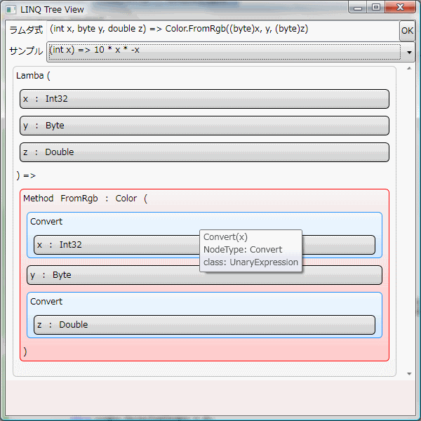

# \[サンプル\] 式木を WPF で GUI 表示

##  概要

下のスクリーンショットを見ての通り。

<figure>

</figure>

C# 3.0 で導入された式木を、
WPF を使って階層的に GUI 表示します。

* 
[ソース一式（ZIP 形式）](../../../../assets/media/ufcpp2000/csharp/source/LinqTreeView.zip)

##  構成要素

以下のような要素を詰め込んだサンプルになっています。

* 式木としてどんなクラスがあるのか、一通り全部網羅。 （System.Linq.Expressions 名前空間内の Expression クラスを継承するクラスを網羅。）

* WPF の DataTemplate を使って、階層的なデータを表示。

* 「[[サンプル] 式木の利用例](sp3_expressionsample.md)」と同様に、 CodeDOM を使って、ユーザーの入力したラムダ式を動的にコンパイル。

どんなラムダ式からどんな木構造が得られるのか、
ざっと眺めるのにちょうどいいと思います。

###  データテンプレート

他のプログラムでも使いまわせると思うので、
式木表示用の DataTemplate だけ ResourceDictionary 化しています。

* 
[Expression 表示用のデータテンプレート](../../../../assets/media/ufcpp2000/csharp/source/ExpressionTemplates.xaml)

    * ↑右クリックで「対象をファイルに保存」してください。
