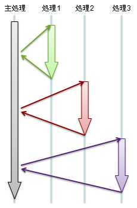
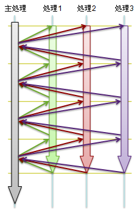
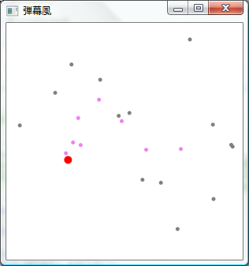

# \[サンプル\] イテレータとマイクロスレッド

## <a id="sec-generated-title-1"></a> <a id="abst"></a>概要

ゲーム開発の分野を中心として、
マイクロスレッド（microthread）あるいはコルーチン（coroutine）、ファイバー（fiber）などと呼ばれる概念が考えられています。

C# 2.0 の「[イテレーター](../data/sp2_iterator.md#iterator)」構文を使うと、
マイクロスレッドと似たようなことができます。

デモ → [シューティングゲーム風](../../../../assets/demo/FullBullet/FullBullet.xbap)。
（
[ソース一式](../../../../assets/media/ufcpp2000/csharp/source/FullBullet.zip)
（zip 形式）。）


## <a id="sec-generated-title-2"></a> <a id="microthread"></a>マイクロスレッドとは

狭い分野でしか使われてない言葉なので、
定義も用語もあまりはっきりと固まっていないんですが、
ここでの説明は数ある定義のうちの1つだと思ってください。

マイクロスレッドというものの背景には、
アクションゲームやシューティングゲームの敵や弾の動作ロジックをどう書こうかという話があります。

シューティングゲームなどでは、時間をフレームと呼ばれる単位に区切って、
1フレームごとに敵や弾の位置を更新するという方式をとる場合が多いです。
（一番多いのは、1フレーム ＝ 30分の1秒か60分の1秒の固定時間フレーム。）
一番簡単な実装方法は、毎フレーム呼び出される Update メソッドを定義する方法。

例えば、要点だけ抜き出して書くと、以下のような感じ。

```csharp {title="Update メソッドでオブジェクトの更新"}
class SimpleBullet : UpdatableObject
{
  double x, y;
  double vx, vy;

  /// <summary>
  /// 更新処理。
  /// 毎フレーム呼び出される。
  /// </summary>
  public void Update()
  {
    this.x += this.vx;
    this.y += this.vy;
  }
}
```


で、オブジェクトマネージャーみたいなクラスを別に作って、
そこで1フレーム毎にこの Update メソッドを呼び出します。

この例は、等速直線運動をしているだけのシンプルな処理なので、
これでも特に不満はありません。
じゃあ次は、もう少し複雑な処理を考えてみましょう。
例えば、以下のような動きを考えてみます。

* 最初の100フレームはその場に停滞。

* 次の100フレーム、等速直線運動。

* 最後に、向きを反転して、あとはずっと等速直線運動。


これを Update メソッドを使って書くと以下のようになります。

```csharp {title="ちょっと複雑な Update 処理"}
class ComplexBullet : UpdatableObject
{
  double x, y;
  double vx, vy;

  int state = 0;

  public void Update()
  {
    if (this.state < 100)
    {
    }
    else if (this.state < 200)
    {
      this.x += this.vx;
      this.y += this.vy;
    }
    else if (this.state == 200)
    {
      this.vx = - this.vx;
      this.vy = - this.vy;
    }
    else
    {
      this.x += this.vx;
      this.y += this.vy;
    }
    ++this.state;
  }
}
```


state 変数を使って、
今、自分が何フレーム目の処理をしているかってのを自前で管理しながら処理をします。

これもまだずいぶんシンプルな例で、
もっと複雑な処理をしようと思うと、もっと入り組んだ state 管理が必要になってきます。

で、これを、以下のように書けたら便利なんじゃないかなぁというのがマイクロスレッドの目的。
（このコードは C# でコンパイル不可。あくまで概念説明用。）

```csharp {title="マイクロスレッドの概念（コンパイル不可）例"}
class ComplexBullet : UpdatableObject
{
  double x, y;
  double vx, vy;

  public void MicroThread()
  {
    for (int i = 0; i < 100; ++i)
    {
      yield;
    }
    for (int i = 0; i < 100; ++i)
    {
      this.x += this.vx;
      this.y += this.vy;
      yield;
    }

    this.vx = - this.vx;
    this.vy = - this.vy;

    for (; ; )
    {
      this.x += this.vx;
      this.y += this.vy;
      yield;
    }
  }
}
```


yield が記述された行に到達するたびに1フレーム時間が進むようなイメージ。
さっきの Update メソッドみたいに「今、自分は何フレーム目なんだろう」みたいなことを意識する必要はなくて、
あくまでシーケンシャルな手続きを書く。

こういう処理、実行効率が悪くてもいいなら、スレッドを使えばできるんですね、一応。
yield の部分に System.Monitor.Wait とかを書いてスレッドの動作を止めて、
1フレームごとに System.Monitor.Pulse を読んでスレッドを再開するとかで。
スレッドは、Wait とかスレッド切り替えのオーバーヘッドがかなり大きいので、
この方法だと、Update を使う方と比べて非常に効率が悪いです。

で、同様のことを Update でできることはわかってるんだから、
この MicroThread メソッドから Update メソッドに相当するものを自動生成する仕組みを考えれば、
わざわざスレッドを使わなくても同様の処理ができるわけです。

ということで、
「スレッドみたいなことができるけども、
用途が限られてる代わりに処理が軽量なもの」という意味で、
マイクロスレッド（microthread）とかファイバー（fiber: thread の糸に対して、fiber は繊維）と呼びます。

具体的に、どうやって“軽量スレッド”みたいなものを作るかというと、
まあ、1つの方法が、今言ったような「MicroThread メソッドから Update メソッドのようなものを自動生成する」というという処理になります。
この他にも、（普通は OS に任せるような）スレッド管理処理を自前で実装して、本当に軽量スレッドを作ってしまうような方法を考える人もいるようです。
あと、動的言語なら、「yield のところでほんとに処理を一度止めて呼び出し元に戻る」というような実装方法もできるかも。


## <a id="sec-generated-title-3"></a> <a id="coroutine"></a>コルーチン

ここで、同じものに対して別の見方をしてみましょう。

先ほどの MicroThread メソッドを簡素化して
（ここでする説明に必要な部分だけ抜き出して）再掲してみます。
（とりあえず、100フレームだけ等速直線運動する。）

```csharp {title="マイクロスレッドの概念（コンパイル不可）例"}
class SimpleBullet : UpdatableObject
{
  double x, y;
  double vx, vy;

  public void MicroThread()
  {
    for (int i = 0; i < 100; ++i)
    {
      this.x += this.vx;
      this.y += this.vy;
      yield;
    }
  }
}
```


対比のために、普通のメソッドも書いておきます。

```csharp {title="対比： 普通のメソッド"}
  public void NormalMethod()
  {
    for (int i = 0; i < 100; ++i)
    {
      this.x += this.vx;
      this.y += this.vy;
    }
  }
```


普通のメソッドの場合、複数のオブジェクトに対して処理するなら、
例えば、以下のような書き方をします。

```csharp {title="普通のメソッド呼び出し"}
SimpleBullet o1, o2, o3;

中略。o1～o3 を初期化。

o1.NormalMethod();
o2.NormalMethod();
o3.NormalMethod();
```


マイクロスレッドの場合、ここでは、
オブジェクトマネージャのようなものを通して、
1フレームごとに Update が呼ばれるようなモデルを考えているので、
以下のようになると思います。

```csharp {title="普通のメソッド呼び出し"}
UpdatableObjectManager manager;
SimpleBullet o1, o2, o3;

中略。初期化処理。

manager.Add(o1);
manager.Add(o2);
manager.Add(o3);

manager.Run();
```


処理の流れのイメージとしては、
普通のメソッドの場合は、図1のように、
メソッドの処理全部が終わってから呼び出し元に戻るような動作をします。

<figure>

[](../../../../assets/media/ufcpp2000/csharp/fig/microthread1.png)

<figcaption>普通の処理の流れ</figcaption>
</figure>


一方、
マイクロスレッドの場合は、図2のように、
yield の行に到達するたびに、処理を中断して呼び出し元に戻ります。

<figure>

[](../../../../assets/media/ufcpp2000/csharp/fig/microthread2.png)

<figcaption>マイクロスレッドの処理の流れ</figcaption>
</figure>


普通のメソッドの中身の処理（ルーチン）と違って、
いくつかの処理が同時にちょっとずつ進むので、
マイクロスレッドのことをコルーチン（coroutine: co- は「共に」とかを意味する接頭語）と呼んだりもします。


## <a id="sec-generated-title-4"></a> <a id="bycsharp"></a>C# でマイクロスレッド

何か概念的な話ばかりしてきましが、
ようやく、じゃあどうやってマイクロスレッドみたいなものを実装するかという話に入ります。

改めて書くと、
以下のようなコードから、

```csharp {title="マイクロスレッドの概念（コンパイル不可）例"}
  public void MicroThread()
  {
    for (int i = 0; i < 100; ++i)
    {
      this.x += this.vx;
      this.y += this.vy;
      yield;
    }
  }
```


以下の Update メソッドのようなものを自動生成できればいいわけです。

```csharp {title="Update メソッド"}
  int i = 0;
  void Update()
  {
    if (this.i < 100)
    {
      this.x += this.vx;
      this.y += this.vy;
    }
    ++this.i;
  }
```


他にも方法はあるかと思いますが、
C# で実現するとするならこの方法がいいです。

こういう機能を言語が持っていない限りそう簡単に実現できるような処理じゃなかったりしますが、
幸い、C# には「[イテレーター](../data/sp2_iterator.md#iterator)」構文という似たようなことをする機能があるので、
それを使って実現可能です。
例えば以下のような感じ。

```csharp {title="イテレータでマイクロスレッドもどきを作ってみる"}
using System.Collections;

class SimpleBullet : UpdatableObject
{
  double x, y;
  double vx, vy;
  IEnumerator microthread;

  public SimpleBullet()
  {
    this.microthread = this.GetMicroThread();
  }

  IEnumerator GetMicroThread()
  {
    for (int i = 0; i < 100; ++i)
    {
      this.x += this.vx;
      this.y += this.vy;
      yield return null;
    }
  }

  void Update()
  {
    if (this.microthread != null)
    {
      if (!this.microthread.MoveNext())
      {
        this.microthread = null;
      }
    }
  }
}
```


return null みたいな余計な記述がちょっと増えてしまいますが、
一応これで所望の動作をします。

イテレータ構文は、シーケンシャルな記述から、IEnumerator を自動生成するための構文です。
ここで説明したようなマイクロスレッドの実現方法も本質は同じで、シーケンシャルな記述から、フレーム単位の更新型の処理を自動生成することで実現します。


## <a id="sec-generated-title-5"></a> <a id="sample"></a>サンプル

具体例として、シューティングゲームの弾幕風プログラムを作ってみました。
（まあ、簡単な例ということで、
ただの丸い物体が動き回るだけですが。
物体の動きもすごい適当。）

ちなみに、インスパイア元 → [東方弾幕風](http://f27.aaa.livedoor.jp/~thdmhul/pukiwiki/pukiwiki.php)。


##### <a id="sec-generated-title-6"></a>旧バージョン

[ソースファイル一式（zip 形式）](../../../../assets/source/MicroThread.zip)

<figure>

[](../../../../assets/media/ufcpp2000/csharp/fig/microthreadsample.png)

<figcaption>弾幕風サンプルプログラム</figcaption>
</figure>


Visual Studio 2008 を利用して作っていて、
プロジェクトを開くには Visual Studio 2008 が必要になります。
あと、WPF アプリです。
WPF に関しては、「[Windows Presentation Foundation](../../dotnet/index.md#wpf)」を参照。

このページで説明したようなマイクロスレッドの実装がらみのコードは
UpdatableObjectManager.cs と MicroThreadObject.cs の辺りに、
実際の物体の動作は
ElementDefinition.cs に書かれています。


##### <a id="sec-generated-title-7"></a>新バージョン

サイト上でデモできるように XBAP で書き直してみた。
あと、作成環境は Visual Studio 2005 に戻した。

その他、プロジェクト構成を整理し直しました。
3つに分割。

* MicroThread … マイクロスレッド関係のコードだけ抜き出してコンポーネント化。

* Shooting2D … シューティングゲーム風のスクリーン（WPF ユーザコントロール）。

* FullBullet … 具体例。完成物。


敵とか弾の起動もだいぶまともに。
ただ、形状は相変わらず丸とか四角です。

デモ → [シューティングゲーム風](../../../../assets/demo/FullBullet/FullBullet.xbap)。
（
[ソース一式](../../../../assets/media/ufcpp2000/csharp/source/FullBullet.zip)
（zip 形式）。）
